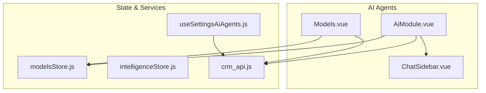
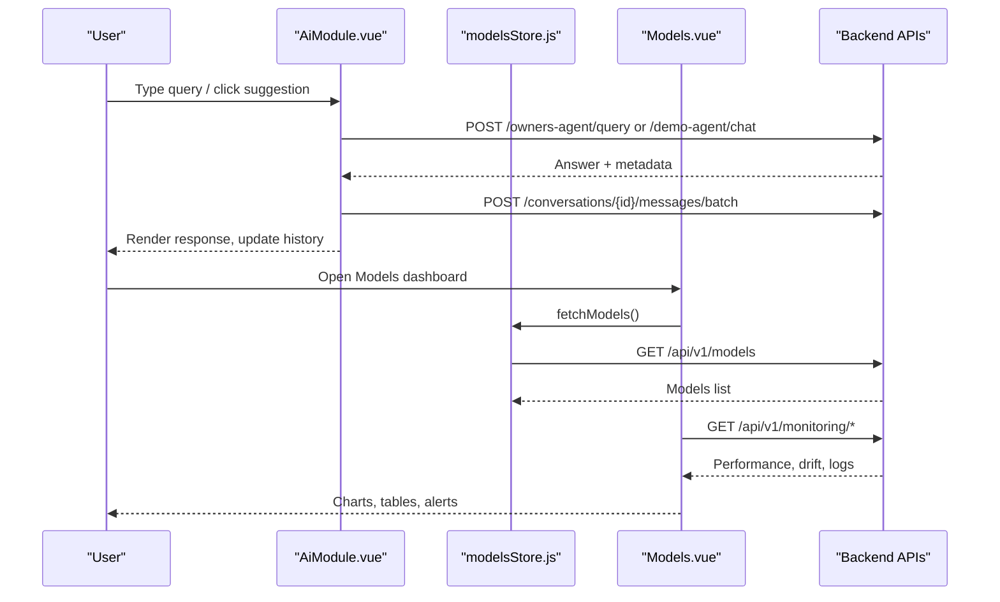
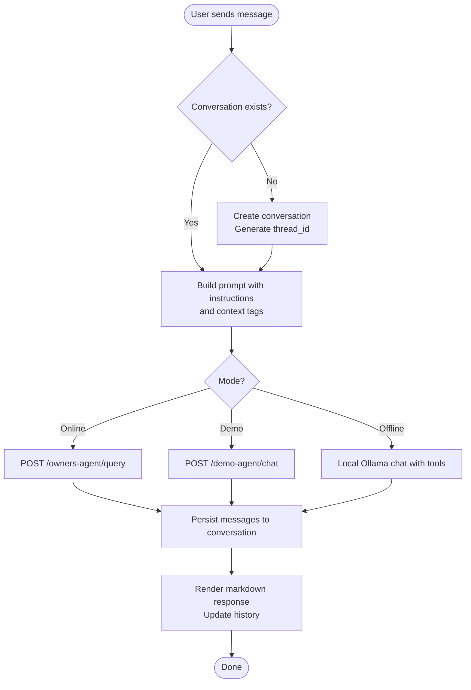
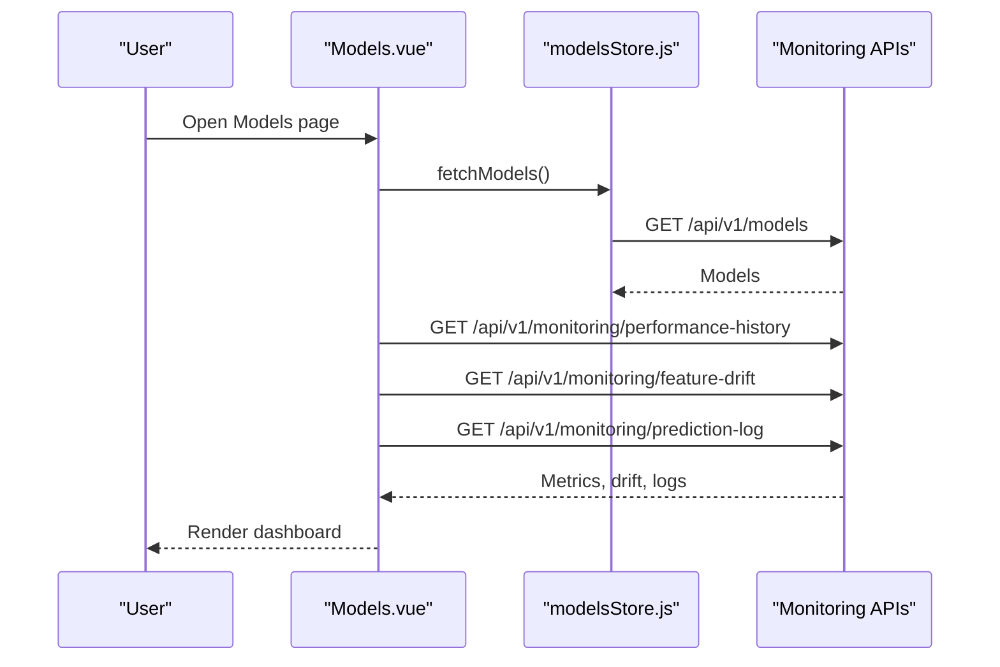
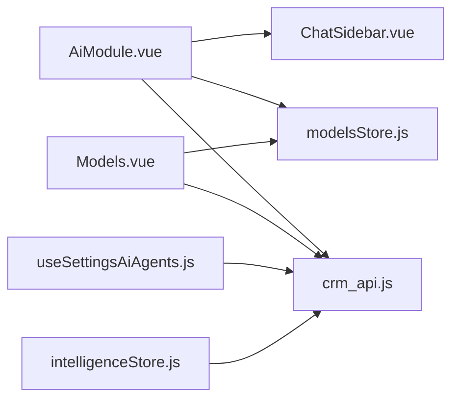

# AI Agents Module

<cite>
**Referenced Files in This Document**
- [AiModule.vue](file://src/views/Modules/aiagents/AiModule.vue)
- [ChatSidebar.vue](file://src/views/Modules/aiagents/components/ChatSidebar.vue)
- [Models.vue](file://src/views/Modules/aiagents/Models.vue)
- [useSettingsAiAgents.js](file://src/composables/settings/useSettingsAiAgents.js)
- [modelsStore.js](file://src/stores/modelsStore.js)
- [intelligenceStore.js](file://src/stores/intelligenceStore.js)
- [crm_api.js](file://src/services/crm_api.js)
</cite>

## Table of Contents
1. [Introduction](#introduction)
2. [Project Structure](#project-structure)
3. [Core Components](#core-components)
4. [Architecture Overview](#architecture-overview)
5. [Detailed Component Analysis](#detailed-component-analysis)
6. [Dependency Analysis](#dependency-analysis)
7. [Performance Considerations](#performance-considerations)
8. [Troubleshooting Guide](#troubleshooting-guide)
9. [Conclusion](#conclusion)
10. [Appendices](#appendices)

## Introduction
This document explains the AI Agents module, focusing on:
- Conversational AI interface with chat, prompt engineering, and context-aware responses grounded in enterprise data via RAG pipelines
- Model management capabilities including model registry, version control, performance monitoring, and champion/challenger comparisons
- RAG implementation for combining AI responses with enterprise data sources
- Chat sidebar, conversation history, and escalation workflows to human agents
- Model metrics dashboard covering AUC-ROC, F1 scores, feature drift monitoring with PSI, and prediction log browsing
- Practical examples for configuring AI agents, managing model lifecycles, and monitoring AI performance
- Integration patterns with the CRM module for customer insights and strategic management for intelligent recommendations

## Project Structure
The AI Agents module is implemented as a set of Vue components and stores that provide:
- A conversational UI with persistent conversations and optional offline mode
- A model management dashboard with performance, drift, governance, logs, and alerts
- Settings integration for scheduling and delivery of agent outputs
- Stores for models and intelligence data used across modules

**Diagram sources**
- [AiModule.vue:1-120](file://src/views/Modules/aiagents/AiModule.vue#L1-L120)
- [ChatSidebar.vue:1-88](file://src/views/Modules/aiagents/components/ChatSidebar.vue#L1-L88)
- [Models.vue:1-120](file://src/views/Modules/aiagents/Models.vue#L1-L120)
- [modelsStore.js:1-54](file://src/stores/modelsStore.js#L1-L54)
- [intelligenceStore.js:1-60](file://src/stores/intelligenceStore.js#L1-L60)
- [useSettingsAiAgents.js:1-42](file://src/composables/settings/useSettingsAiAgents.js#L1-L42)
- [crm_api.js:117-148](file://src/services/crm_api.js#L117-L148)

**Section sources**
- [AiModule.vue:1-120](file://src/views/Modules/aiagents/AiModule.vue#L1-L120)
- [Models.vue:1-120](file://src/views/Modules/aiagents/Models.vue#L1-L120)
- [modelsStore.js:1-54](file://src/stores/modelsStore.js#L1-L54)
- [intelligenceStore.js:1-60](file://src/stores/intelligenceStore.js#L1-L60)
- [useSettingsAiAgents.js:1-42](file://src/composables/settings/useSettingsAiAgents.js#L1-L42)
- [crm_api.js:117-148](file://src/services/crm_api.js#L117-L148)

## Core Components
- Conversational AI Interface (AiModule.vue): Provides chat input, message rendering, conversation persistence, demo/offline modes, and export utilities. It constructs contextual prompts from user role, company, and name, then calls backend endpoints for online or demo flows.
- Chat Sidebar (ChatSidebar.vue): Compact navigation for documents, notes, history, theme, settings, and profile. Emits events to toggle panels and actions.
- Model Management Dashboard (Models.vue): Displays overview KPIs, performance charts, confusion matrix with threshold tuning, segment-level performance, drift and stability metrics (PSI), governance records, live prediction logs, and active alerts.
- Settings for AI Agents (useSettingsAiAgents.js): Manages agent schedules and delivery methods, persisting settings via API.
- Models Store (modelsStore.js): Loads model registry, exposes champion models by type, and provides counts and metrics.
- Intelligence Store (intelligenceStore.js): Fetches CLV, lifecycle, forecast, and outcomes data with fallbacks when APIs are unavailable.
- CRM Integration (crm_api.js): Provides CRUD operations for customers, accounts, contacts, lead conversion, and communications used by other modules.

**Section sources**
- [AiModule.vue:534-1224](file://src/views/Modules/aiagents/AiModule.vue#L534-L1224)
- [ChatSidebar.vue:1-88](file://src/views/Modules/aiagents/components/ChatSidebar.vue#L1-L88)
- [Models.vue:623-861](file://src/views/Modules/aiagents/Models.vue#L623-L861)
- [useSettingsAiAgents.js:1-42](file://src/composables/settings/useSettingsAiAgents.js#L1-L42)
- [modelsStore.js:1-54](file://src/stores/modelsStore.js#L1-L54)
- [intelligenceStore.js:1-296](file://src/stores/intelligenceStore.js#L1-L296)
- [crm_api.js:117-148](file://src/services/crm_api.js#L117-L148)

## Architecture Overview
The AI Agents module integrates three primary layers:
- Presentation Layer: Vue components for chat and model dashboards
- State Layer: Pinia stores for models and intelligence data
- Integration Layer: Axios-based services calling backend endpoints for conversations, monitoring, CRM, and strategy

**Diagram sources**
- [AiModule.vue:1088-1155](file://src/views/Modules/aiagents/AiModule.vue#L1088-L1155)
- [AiModule.vue:876-938](file://src/views/Modules/aiagents/AiModule.vue#L876-L938)
- [Models.vue:828-861](file://src/views/Modules/aiagents/Models.vue#L828-L861)
- [modelsStore.js:31-50](file://src/stores/modelsStore.js#L31-L50)

## Detailed Component Analysis

### Conversational AI Interface (AiModule.vue)
Key responsibilities:
- Prompt engineering: Builds instructions and injects context tags for role, company, and user name before sending queries
- Conversation management: Creates, loads, persists, and deletes conversations; maintains thread IDs for memory continuity
- Online vs Demo vs Offline modes: Routes to backend endpoints for production, uses local Ollama client for offline tool-augmented chat, and supports a demo mode that executes UI actions based on JSON instructions
- Export and summary: Allows editing and exporting last bot response as text/PDF/Word-like artifacts

**Diagram sources**
- [AiModule.vue:1060-1155](file://src/views/Modules/aiagents/AiModule.vue#L1060-L1155)
- [AiModule.vue:876-938](file://src/views/Modules/aiagents/AiModule.vue#L876-L938)
- [AiModule.vue:962-1042](file://src/views/Modules/aiagents/AiModule.vue#L962-L1042)

Implementation highlights:
- Context-aware prompts: Role, company, and user name are injected into the query string to ground responses
- Thread continuity: thread_id stored in localStorage ensures LangGraph memory continuity across sessions
- Error handling: Distinct messages for network errors, 401 session expiry, and 403 permission denied
- Offline tool use: Function calling flow with dummy sales tool to demonstrate retrieval-augmented behavior locally

**Section sources**
- [AiModule.vue:1088-1155](file://src/views/Modules/aiagents/AiModule.vue#L1088-L1155)
- [AiModule.vue:876-938](file://src/views/Modules/aiagents/AiModule.vue#L876-L938)
- [AiModule.vue:962-1042](file://src/views/Modules/aiagents/AiModule.vue#L962-L1042)

### Chat Sidebar (ChatSidebar.vue)
Responsibilities:
- Provides quick access to Documents, Notes, History, Theme, Settings, Profile
- Emits events to parent component to toggle panels and actions
- Shows badge counts for history items

Usage:
- Parent AiModule.vue binds props like history count and active states, and handles panel toggling

**Section sources**
- [ChatSidebar.vue:1-88](file://src/views/Modules/aiagents/components/ChatSidebar.vue#L1-L88)
- [AiModule.vue:6-20](file://src/views/Modules/aiagents/AiModule.vue#L6-L20)

### Model Management Dashboard (Models.vue)
Capabilities:
- Overview KPIs: AUC-ROC, Log Loss, Brier Score, KS Statistic, F1 Score, model version
- Performance tab: Confusion matrix with adjustable threshold, derived Precision/Recall/F1, segment-level performance table, threshold sensitivity analysis
- Drift & Stability tab: Feature drift monitor using PSI with thresholds and status badges, trend interpretation guide
- Governance tab: Model card fields, approval lifecycle steps, risk classification, audit log
- Prediction Logs tab: Live inference stream with correlation ID, customer ID, churn probability, risk band, classification, latency
- Alerts tab: Active and resolved alerts with severity, values, thresholds, and timestamps

Data flow:
- On mount, fetches performance history, feature drift, and prediction logs concurrently
- Uses modelsStore to identify champion model and metrics

**Diagram sources**
- [Models.vue:828-861](file://src/views/Modules/aiagents/Models.vue#L828-L861)
- [modelsStore.js:31-50](file://src/stores/modelsStore.js#L31-L50)

**Section sources**
- [Models.vue:623-861](file://src/views/Modules/aiagents/Models.vue#L623-L861)
- [modelsStore.js:1-54](file://src/stores/modelsStore.js#L1-L54)

### AI Agents Settings (useSettingsAiAgents.js)
Responsibilities:
- Defines default agents with schedule and delivery method
- Saves agent settings via POST to backend endpoint with tenant context
- Provides success/error feedback per agent

Practical example:
- Configure an agent’s cron schedule and choose email/SMS/both delivery channels

**Section sources**
- [useSettingsAiAgents.js:1-42](file://src/composables/settings/useSettingsAiAgents.js#L1-L42)

### Intelligence Store (intelligenceStore.js)
Responsibilities:
- Fetches CLV, lifecycle stages, balance forecasts, and retention outcomes
- Falls back to static datasets when APIs are unavailable
- Exposes loading states and error references

Integration note:
- Other modules can consume this store to display customer value and lifecycle insights alongside AI-driven recommendations

**Section sources**
- [intelligenceStore.js:1-296](file://src/stores/intelligenceStore.js#L1-L296)

### CRM Integration (crm_api.js)
Responsibilities:
- Provides functions to create/update/delete customers, accounts, contacts
- Supports lead conversion and communication retrieval
- Used by other modules to enrich AI responses with CRM context

Integration pattern:
- AI Agents can call CRM APIs to retrieve customer details or trigger follow-up actions based on model predictions

**Section sources**
- [crm_api.js:117-148](file://src/services/crm_api.js#L117-L148)

## Dependency Analysis
Component relationships:
- AiModule.vue depends on ChatSidebar.vue for navigation and on modelsStore.js for model context
- Models.vue consumes modelsStore.js and directly calls monitoring APIs
- useSettingsAiAgents.js posts agent settings to backend
- intelligenceStore.js provides cross-module intelligence data
- crm_api.js offers CRM operations consumed by various features

**Diagram sources**
- [AiModule.vue:1088-1155](file://src/views/Modules/aiagents/AiModule.vue#L1088-L1155)
- [Models.vue:828-861](file://src/views/Modules/aiagents/Models.vue#L828-L861)
- [useSettingsAiAgents.js:23-38](file://src/composables/settings/useSettingsAiAgents.js#L23-L38)
- [intelligenceStore.js:242-288](file://src/stores/intelligenceStore.js#L242-L288)
- [crm_api.js:117-148](file://src/services/crm_api.js#L117-L148)

**Section sources**
- [AiModule.vue:1088-1155](file://src/views/Modules/aiagents/AiModule.vue#L1088-L1155)
- [Models.vue:828-861](file://src/views/Modules/aiagents/Models.vue#L828-L861)
- [useSettingsAiAgents.js:23-38](file://src/composables/settings/useSettingsAiAgents.js#L23-L38)
- [intelligenceStore.js:242-288](file://src/stores/intelligenceStore.js#L242-L288)
- [crm_api.js:117-148](file://src/services/crm_api.js#L117-L148)

## Performance Considerations
- Concurrent fetching: The Models dashboard fetches performance history, feature drift, and prediction logs in parallel to reduce load time
- Threshold interactivity: Confusion matrix recalculates precision/recall/F1 instantly as users adjust decision thresholds
- Offline mode: Local Ollama client avoids network latency but requires correct environment setup and CORS configuration
- Export operations: Report generation runs client-side; large exports may benefit from server-side processing in future iterations

[No sources needed since this section provides general guidance]

## Troubleshooting Guide
Common issues and resolutions:
- Local AI not responding: Ensure Ollama is running at http://localhost:11434 and the required model is installed; handle HTTPS mixed content restrictions by enabling localhost insecure origins in browser flags
- Session expired: When receiving 401, prompt users to re-authenticate
- Permission denied: When receiving 403, inform users they lack access to the requested feature
- Monitoring API failures: If monitoring endpoints fail, the dashboard falls back to static data; verify backend availability and token headers

**Section sources**
- [AiModule.vue:555-603](file://src/views/Modules/aiagents/AiModule.vue#L555-L603)
- [AiModule.vue:1139-1155](file://src/views/Modules/aiagents/AiModule.vue#L1139-L1155)
- [Models.vue:828-861](file://src/views/Modules/aiagents/Models.vue#L828-L861)

## Conclusion
The AI Agents module delivers a robust conversational interface with context-aware prompts, persistent conversations, and flexible deployment modes (online, demo, offline). The model management dashboard provides comprehensive monitoring including AUC-ROC, F1, PSI-based drift detection, governance records, and live prediction logs. Settings enable scheduling and delivery automation for AI agents. Integration with CRM and intelligence stores supports customer insights and strategic recommendations. Together, these capabilities form a cohesive platform for AI-driven analytics and operational workflows.

[No sources needed since this section summarizes without analyzing specific files]

## Appendices

### Practical Examples

- Configure AI Agents:
  - Use the settings composable to define schedules and delivery methods, then save via the provided function
  - Reference: [useSettingsAiAgents.js:23-38](file://src/composables/settings/useSettingsAiAgents.js#L23-L38)

- Manage Model Lifecycles:
  - Load model registry and identify champion models via the store
  - Review performance, drift, governance, and logs in the Models dashboard
  - Reference: [modelsStore.js:31-50](file://src/stores/modelsStore.js#L31-L50), [Models.vue:828-861](file://src/views/Modules/aiagents/Models.vue#L828-L861)

- Monitor AI Performance:
  - Observe AUC-ROC, F1, and PSI drift thresholds; investigate alerts and review audit logs
  - Reference: [Models.vue:662-777](file://src/views/Modules/aiagents/Models.vue#L662-L777)

- Integrate with CRM:
  - Retrieve or update customer data through CRM APIs to enrich AI responses and trigger follow-ups
  - Reference: [crm_api.js:117-148](file://src/services/crm_api.js#L117-L148)

- Use RAG-like Retrieval in Offline Mode:
  - Demonstrate tool-augmented retrieval with dummy sales data via local Ollama function calling
  - Reference: [AiModule.vue:962-1042](file://src/views/Modules/aiagents/AiModule.vue#L962-L1042)