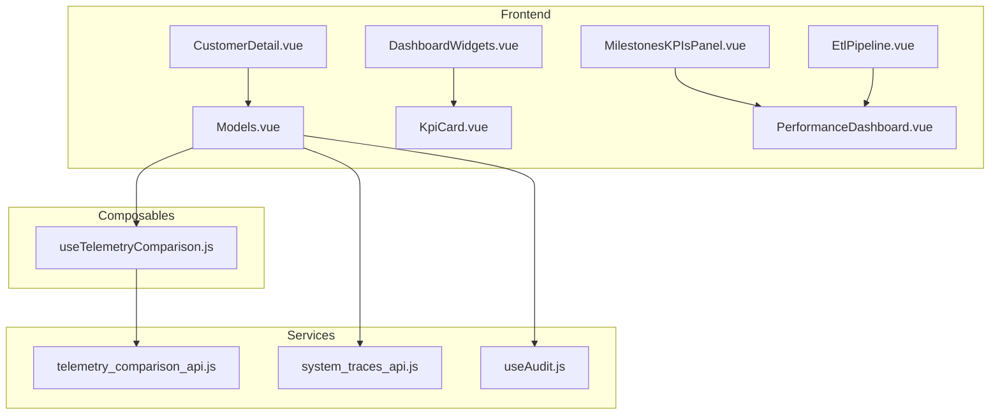
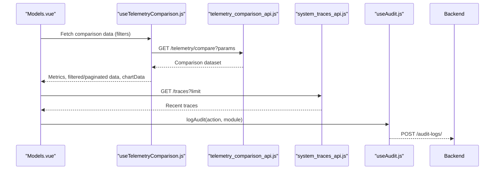
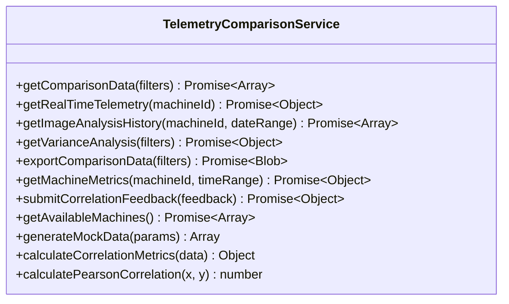
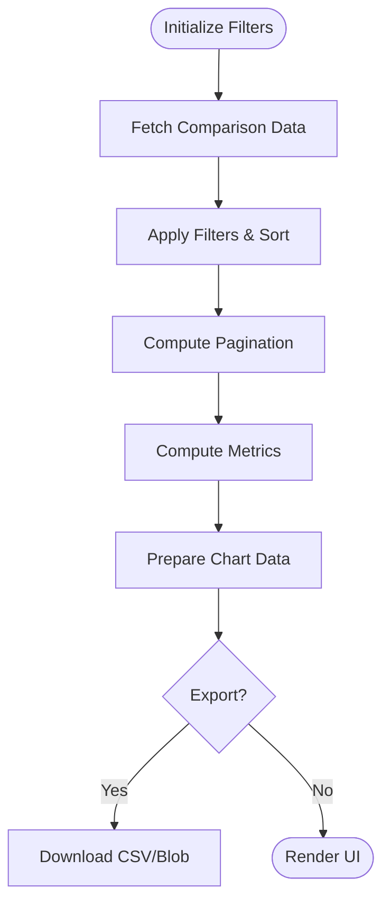
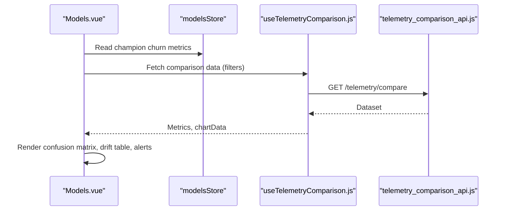
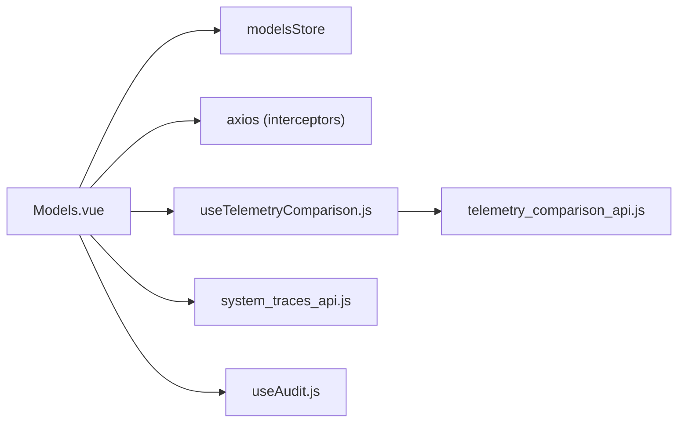

# AI Performance Monitoring & Analytics

<cite>
**Referenced Files in This Document**
- [telemetry_comparison_api.js](file://src/services/telemetry_comparison_api.js)
- [useTelemetryComparison.js](file://src/composables/useTelemetryComparison.js)
- [Models.vue](file://src/views/Modules/aiagents/Models.vue)
- [system_traces_api.js](file://src/services/system_traces_api.js)
- [DashboardWidgets.vue](file://src/components/ui/DashboardWidgets.vue)
- [KpiCard.vue](file://src/components/ui/KpiCard.vue)
- [MilestonesKPIsPanel.vue](file://src/views/Modules/strategic/components/MilestonesKPIsPanel.vue)
- [PerformanceDashboard.vue](file://src/views/Modules/strategic/components/PerformanceDashboard.vue)
- [BusinessOutcomes.vue](file://src/views/Modules/intelligence/BusinessOutcomes.vue)
- [CustomerDetail.vue](file://src/views/CustomerDetail.vue)
- [EtlPipeline.vue](file://src/views/Modules/datapipeline/EtlPipeline.vue)
- [useAudit.js](file://src/config/useAudit.js)
</cite>

## Table of Contents
1. Introduction
2. Project Structure
3. Core Components
4. Architecture Overview
5. Detailed Component Analysis
6. Dependency Analysis
7. Performance Considerations
8. Troubleshooting Guide
9. Conclusion
10. Appendices

## Introduction
This document explains the AI performance monitoring and analytics capabilities implemented in the frontend. It covers metrics collection for model accuracy, response times, and user engagement; a real-time monitoring dashboard with key performance indicators (prediction confidence scores, error rates, throughput); alerting for performance degradation, model drift, and anomalous behavior; and analytics reporting including trend analysis, correlation studies, and impact assessments. It also documents telemetry collection, data aggregation, visualization components, integration points with external systems, examples for setting up alerts and generating reports, and considerations for scalability, retention, and privacy.

## Project Structure
The monitoring and analytics features are distributed across services, composables, views, and UI components:
- Services provide API clients for telemetry, traces, and audit logging.
- Composables encapsulate stateful logic for fetching, filtering, aggregating, and exporting telemetry data.
- Views implement dashboards and tabs for model performance, drift, governance, logs, and alerts.
- UI components render KPI cards, widgets, and charts to visualize metrics.

**Diagram sources**
- [Models.vue:1-120](file://src/views/Modules/aiagents/Models.vue#L1-L120)
- [useTelemetryComparison.js:1-120](file://src/composables/useTelemetryComparison.js#L1-L120)
- [telemetry_comparison_api.js:1-150](file://src/services/telemetry_comparison_api.js#L1-L150)
- [system_traces_api.js:1-40](file://src/services/system_traces_api.js#L1-L40)
- [useAudit.js:53-75](file://src/config/useAudit.js#L53-L75)
- [DashboardWidgets.vue:1-71](file://src/components/ui/DashboardWidgets.vue#L1-L71)
- [KpiCard.vue:1-130](file://src/components/ui/KpiCard.vue#L1-L130)
- [MilestonesKPIsPanel.vue:1-120](file://src/views/Modules/strategic/components/MilestonesKPIsPanel.vue#L1-L120)
- [PerformanceDashboard.vue:1-68](file://src/views/Modules/strategic/components/PerformanceDashboard.vue#L1-L68)
- [CustomerDetail.vue:282-294](file://src/views/CustomerDetail.vue#L282-L294)
- [EtlPipeline.vue:192-253](file://src/views/Modules/datapipeline/EtlPipeline.vue#L192-L253)

**Section sources**
- [Models.vue:1-120](file://src/views/Modules/aiagents/Models.vue#L1-L120)
- [useTelemetryComparison.js:1-120](file://src/composables/useTelemetryComparison.js#L1-L120)
- [telemetry_comparison_api.js:1-150](file://src/services/telemetry_comparison_api.js#L1-L150)
- [system_traces_api.js:1-40](file://src/services/system_traces_api.js#L1-L40)
- [DashboardWidgets.vue:1-71](file://src/components/ui/DashboardWidgets.vue#L1-L71)
- [KpiCard.vue:1-130](file://src/components/ui/KpiCard.vue#L1-L130)
- [MilestonesKPIsPanel.vue:1-120](file://src/views/Modules/strategic/components/MilestonesKPIsPanel.vue#L1-L120)
- [PerformanceDashboard.vue:1-68](file://src/views/Modules/strategic/components/PerformanceDashboard.vue#L1-L68)
- [CustomerDetail.vue:282-294](file://src/views/CustomerDetail.vue#L282-L294)
- [EtlPipeline.vue:192-253](file://src/views/Modules/datapipeline/EtlPipeline.vue#L192-L253)

## Core Components
- Telemetry comparison service: fetches comparison data between telemetry and image analysis, supports real-time telemetry, variance analysis, export, machine metrics, feedback submission, and mock data generation. Includes correlation calculations.
- Telemetry composable: manages filters, pagination, computed metrics (accuracy rate, average variance, correlation), chart data, and export utilities.
- Model performance view: provides overview KPIs, confusion matrix with threshold slider, segment-level performance, drift monitoring via PSI, governance card, live prediction logs, and alerts.
- System traces API: retrieves recent traces and detailed timing breakdowns for diagnostics.
- Dashboard widgets and KPI cards: configurable widget grid and reusable KPI display with formatting and actions.
- Strategic KPI panel and performance dashboard: milestone tracking, KPI grids, alerts, and financial performance placeholders.
- Customer detail: displays model confidence based on data completeness and version info.
- ETL pipeline: shows system health stats like latency and quality trends.

**Section sources**
- [telemetry_comparison_api.js:1-252](file://src/services/telemetry_comparison_api.js#L1-L252)
- [useTelemetryComparison.js:1-382](file://src/composables/useTelemetryComparison.js#L1-L382)
- [Models.vue:1-800](file://src/views/Modules/aiagents/Models.vue#L1-L800)
- [system_traces_api.js:1-40](file://src/services/system_traces_api.js#L1-L40)
- [DashboardWidgets.vue:1-71](file://src/components/ui/DashboardWidgets.vue#L1-L71)
- [KpiCard.vue:1-130](file://src/components/ui/KpiCard.vue#L1-L130)
- [MilestonesKPIsPanel.vue:1-800](file://src/views/Modules/strategic/components/MilestonesKPIsPanel.vue#L1-L800)
- [PerformanceDashboard.vue:1-68](file://src/views/Modules/strategic/components/PerformanceDashboard.vue#L1-L68)
- [CustomerDetail.vue:282-294](file://src/views/CustomerDetail.vue#L282-L294)
- [EtlPipeline.vue:192-253](file://src/views/Modules/datapipeline/EtlPipeline.vue#L192-L253)

## Architecture Overview
The monitoring architecture combines client-side orchestration with backend APIs:
- The Models view orchestrates performance, drift, governance, logs, and alerts.
- The telemetry composable centralizes data fetching, filtering, and metric computation.
- The telemetry service abstracts HTTP calls to endpoints for comparison, real-time data, variance analysis, metrics, and export.
- System traces API enables deep-dive into request timings.
- Audit logging integrates with backend audit endpoints for compliance.

**Diagram sources**
- [Models.vue:623-656](file://src/views/Modules/aiagents/Models.vue#L623-L656)
- [useTelemetryComparison.js:156-184](file://src/composables/useTelemetryComparison.js#L156-L184)
- [telemetry_comparison_api.js:15-30](file://src/services/telemetry_comparison_api.js#L15-L30)
- [system_traces_api.js:17-27](file://src/services/system_traces_api.js#L17-L27)
- [useAudit.js:53-75](file://src/config/useAudit.js#L53-L75)

## Detailed Component Analysis

### Telemetry Comparison Service
Responsibilities:
- Fetch comparison data with filters (machine type, date range, machine ID).
- Retrieve real-time telemetry per machine.
- Perform variance analysis and export datasets to CSV.
- Compute machine metrics over time ranges.
- Submit correlation feedback to improve accuracy.
- Provide mock data for development/testing.
- Calculate correlation metrics and Pearson correlation coefficient.

Key implementation patterns:
- Centralized axios client with base URL.
- Consistent error handling with console logging and rethrowing errors.
- Utility functions for correlation and mock data generation.

**Diagram sources**
- [telemetry_comparison_api.js:9-252](file://src/services/telemetry_comparison_api.js#L9-L252)

**Section sources**
- [telemetry_comparison_api.js:1-252](file://src/services/telemetry_comparison_api.js#L1-L252)

### Telemetry Composable
Responsibilities:
- Manage reactive state for loading, errors, comparison data, real-time data, selected machine.
- Maintain filters and pagination.
- Compute filtered and paginated datasets with sorting.
- Derive metrics: total comparisons, accuracy rate, average variance, correlation coefficient, active machines, critical alerts.
- Prepare chart data for visualization.
- Export data to CSV or download blobs from backend.
- Watchers to refresh data when filters change.

**Diagram sources**
- [useTelemetryComparison.js:17-129](file://src/composables/useTelemetryComparison.js#L17-L129)
- [useTelemetryComparison.js:156-232](file://src/composables/useTelemetryComparison.js#L156-L232)
- [useTelemetryComparison.js:260-339](file://src/composables/useTelemetryComparison.js#L260-L339)

**Section sources**
- [useTelemetryComparison.js:1-382](file://src/composables/useTelemetryComparison.js#L1-L382)

### Model Performance View
Capabilities:
- Overview KPIs: AUC-ROC, Log Loss, Brier Score, KS Stat, F1 Score, Model Version.
- Confusion Matrix with interactive threshold slider; derived Precision, Recall, F1.
- Segment-level performance table with status indicators.
- Threshold sensitivity analysis table with cost estimates.
- Drift & Stability tab: PSI-based feature drift monitoring with thresholds and interpretation guide.
- Governance tab: model card, approval lifecycle, risk classification, audit history.
- Prediction Logs tab: live inference stream with probability bars, risk bands, latency.
- Alerts tab: active and resolved alerts with severity and action buttons.

**Diagram sources**
- [Models.vue:680-704](file://src/views/Modules/aiagents/Models.vue#L680-L704)
- [Models.vue:717-735](file://src/views/Modules/aiagents/Models.vue#L717-L735)
- [Models.vue:755-777](file://src/views/Modules/aiagents/Models.vue#L755-L777)
- [useTelemetryComparison.js:156-184](file://src/composables/useTelemetryComparison.js#L156-L184)
- [telemetry_comparison_api.js:15-30](file://src/services/telemetry_comparison_api.js#L15-L30)

**Section sources**
- [Models.vue:1-800](file://src/views/Modules/aiagents/Models.vue#L1-L800)

### System Traces API
Responsibilities:
- Fetch recent system traces with limit parameter.
- Retrieve detailed timing breakdown for a specific trace.

Integration:
- Used by the Models view or other diagnostic panels to inspect request latencies and identify bottlenecks.

**Section sources**
- [system_traces_api.js:1-40](file://src/services/system_traces_api.js#L1-L40)

### Dashboard Widgets and KPI Cards
- DashboardWidgets: configurable widget grid enabling users to toggle visibility of analytics widgets.
- KpiCard: reusable component for displaying formatted values, trends, navigation, and actions.

Usage:
- Aggregates multiple KPIs and visualizations into a cohesive dashboard layout.

**Section sources**
- [DashboardWidgets.vue:1-71](file://src/components/ui/DashboardWidgets.vue#L1-L71)
- [KpiCard.vue:1-130](file://src/components/ui/KpiCard.vue#L1-L130)

### Strategic KPI Panel and Performance Dashboard
- MilestonesKPIsPanel: tracks milestones, KPIs, and performance alerts with filtering and timelines.
- PerformanceDashboard: presents category-based KPIs and placeholder charts for financial performance.

**Section sources**
- [MilestonesKPIsPanel.vue:1-800](file://src/views/Modules/strategic/components/MilestonesKPIsPanel.vue#L1-L800)
- [PerformanceDashboard.vue:1-68](file://src/views/Modules/strategic/components/PerformanceDashboard.vue#L1-L68)

### Customer Detail Confidence Display
Displays model confidence based on data completeness, behavioral features populated, model version, and last update timestamp. Provides context that predictive results are estimates.

**Section sources**
- [CustomerDetail.vue:282-294](file://src/views/CustomerDetail.vue#L282-L294)

### ETL Pipeline Health Metrics
Shows system health indicators such as failed retries and average query latency, along with quality trends visualized as line/area charts.

**Section sources**
- [EtlPipeline.vue:192-253](file://src/views/Modules/datapipeline/EtlPipeline.vue#L192-L253)

## Dependency Analysis
- Models.vue depends on modelsStore for model metadata and metrics, and uses axios interceptors to attach authentication tokens.
- useTelemetryComparison.js depends on TelemetryComparisonService for data retrieval and exports.
- TelemetryComparisonService depends on API_BASE_URL and performs HTTP requests with error handling.
- system_traces_api.js provides tracing endpoints for latency diagnostics.
- useAudit.js posts audit events to backend for compliance and traceability.

**Diagram sources**
- [Models.vue:623-636](file://src/views/Modules/aiagents/Models.vue#L623-L636)
- [useTelemetryComparison.js:156-184](file://src/composables/useTelemetryComparison.js#L156-L184)
- [telemetry_comparison_api.js:1-30](file://src/services/telemetry_comparison_api.js#L1-L30)
- [system_traces_api.js:1-40](file://src/services/system_traces_api.js#L1-L40)
- [useAudit.js:53-75](file://src/config/useAudit.js#L53-L75)

**Section sources**
- [Models.vue:623-656](file://src/views/Modules/aiagents/Models.vue#L623-L656)
- [useTelemetryComparison.js:156-184](file://src/composables/useTelemetryComparison.js#L156-L184)
- [telemetry_comparison_api.js:1-30](file://src/services/telemetry_comparison_api.js#L1-L30)
- [system_traces_api.js:1-40](file://src/services/system_traces_api.js#L1-L40)
- [useAudit.js:53-75](file://src/config/useAudit.js#L53-L75)

## Performance Considerations
- Use pagination and filtering to reduce payload sizes for large datasets.
- Prefer server-side variance analysis and metrics where possible to offload computation.
- Cache real-time telemetry updates using intervals judiciously to avoid excessive network load.
- Leverage system traces to identify slow endpoints and optimize queries.
- Employ KPI cards and widget toggles to minimize rendering overhead.

[No sources needed since this section provides general guidance]

## Troubleshooting Guide
Common issues and resolutions:
- Network errors when fetching comparison data: check API connectivity and token validity; review error logs in the console.
- Real-time telemetry not updating: verify endpoint availability and polling interval configuration.
- High latency in traces: use trace breakdown to pinpoint slow stages and optimize downstream dependencies.
- Alert fatigue: tune PSI thresholds and alert severities to balance sensitivity and actionable insights.
- Audit logging failures: ensure backend audit endpoint is reachable; failures are logged but do not break calling features.

**Section sources**
- [telemetry_comparison_api.js:26-30](file://src/services/telemetry_comparison_api.js#L26-L30)
- [useTelemetryComparison.js:178-184](file://src/composables/useTelemetryComparison.js#L178-L184)
- [system_traces_api.js:23-27](file://src/services/system_traces_api.js#L23-L27)
- [useAudit.js:64-71](file://src/config/useAudit.js#L64-L71)

## Conclusion
The frontend implements a comprehensive AI performance monitoring and analytics suite. It collects and visualizes model accuracy, response times, and engagement signals; provides real-time dashboards with KPIs; detects drift and anomalies via PSI and alerts; and supports analytics reporting through correlation and trend analysis. Integration with system traces and audit logging ensures observability and compliance. Scalability and privacy can be addressed through server-side aggregation, retention policies, and secure data handling practices.

[No sources needed since this section summarizes without analyzing specific files]

## Appendices

### Examples: Setting Up Performance Alerts
- Define PSI thresholds for warning and critical levels; configure alerts in the Alerts tab to trigger when feature distributions exceed thresholds.
- Use the drift table to monitor feature-level PSI scores and statuses; investigate warnings and criticals promptly.

**Section sources**
- [Models.vue:311-376](file://src/views/Modules/aiagents/Models.vue#L311-L376)
- [Models.vue:541-617](file://src/views/Modules/aiagents/Models.vue#L541-L617)

### Examples: Generating Custom Reports
- Export comparison data to CSV using the export functionality in the telemetry composable or service.
- Use the ETL pipeline’s quality trends and system health metrics to include operational performance in reports.

**Section sources**
- [useTelemetryComparison.js:210-232](file://src/composables/useTelemetryComparison.js#L210-L232)
- [telemetry_comparison_api.js:88-98](file://src/services/telemetry_comparison_api.js#L88-L98)
- [EtlPipeline.vue:192-253](file://src/views/Modules/datapipeline/EtlPipeline.vue#L192-L253)

### Analyzing Model Performance Over Time
- Review performance history charts and KPIs (AUC-ROC, Log Loss, Brier Score) in the Overview tab.
- Correlate drift events with performance changes using PSI and alert histories.

**Section sources**
- [Models.vue:64-153](file://src/views/Modules/aiagents/Models.vue#L64-L153)
- [Models.vue:680-704](file://src/views/Modules/aiagents/Models.vue#L680-L704)

### Scalability Considerations
- Implement server-side pagination and filtering for large telemetry datasets.
- Use caching strategies for real-time telemetry and frequently accessed metrics.
- Aggregate metrics at the service layer to reduce frontend computation.

[No sources needed since this section provides general guidance]

### Data Retention Policies
- Configure retention for telemetry and trace data at the backend to align with business needs and regulatory requirements.
- Archive historical data periodically and provide access via export endpoints.

[No sources needed since this section provides general guidance]

### Privacy Compliance
- Ensure audit logging captures necessary information without exposing sensitive personal data.
- Validate that exported datasets comply with privacy regulations and anonymize identifiers where required.

**Section sources**
- [useAudit.js:53-75](file://src/config/useAudit.js#L53-L75)