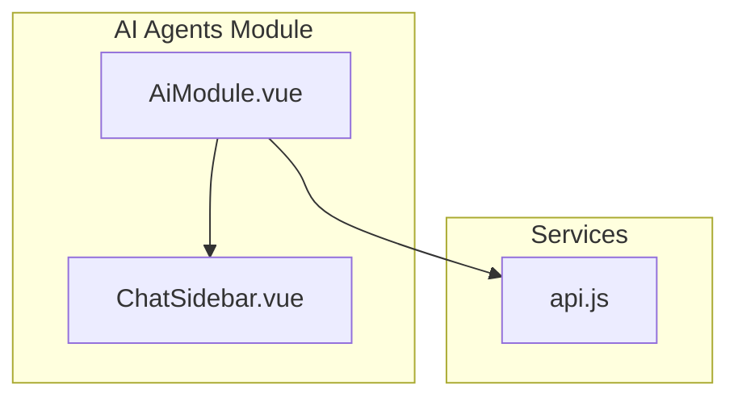
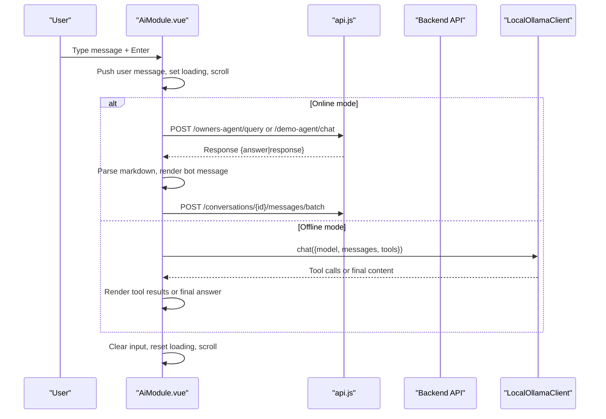
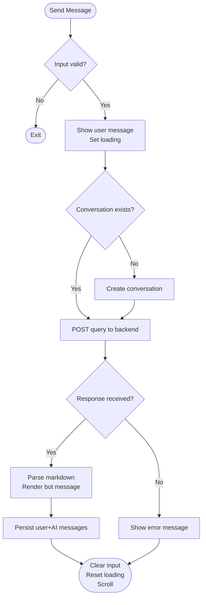
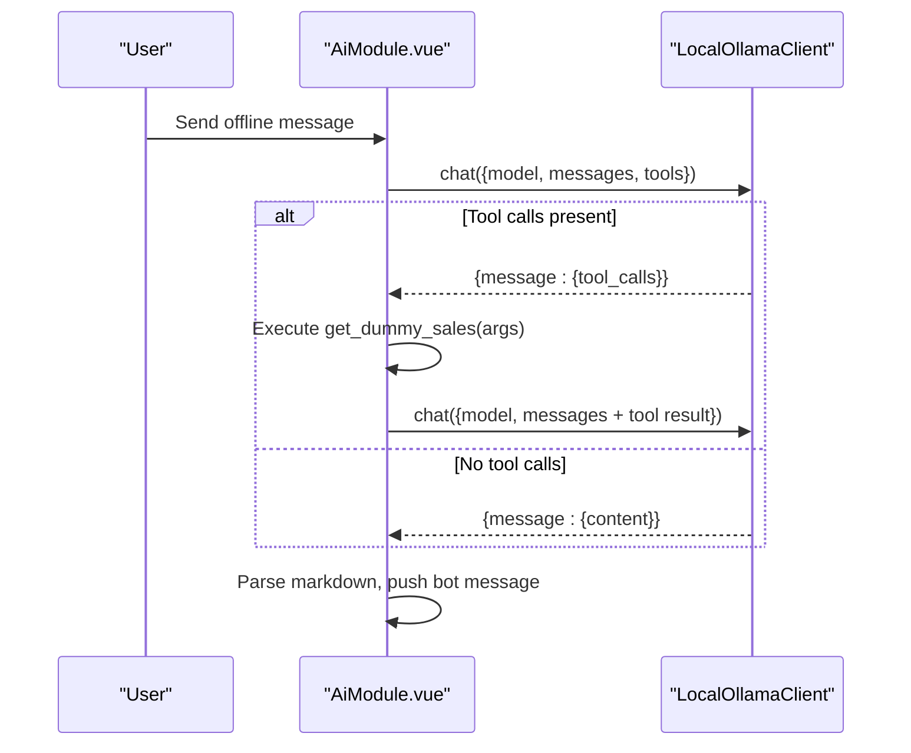
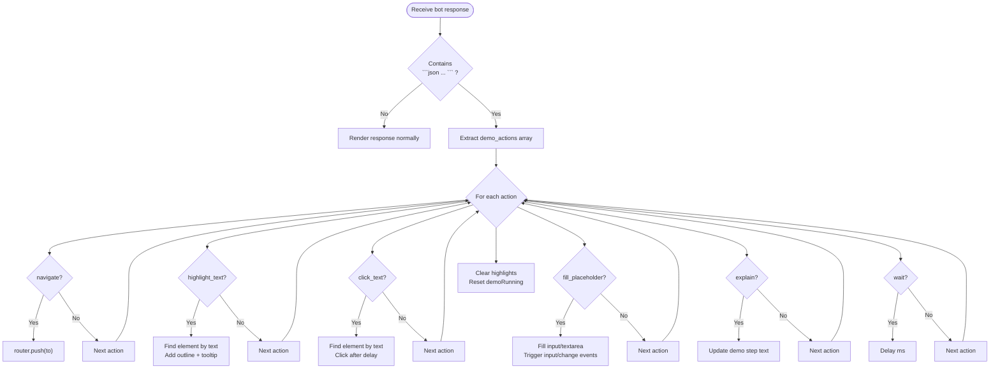
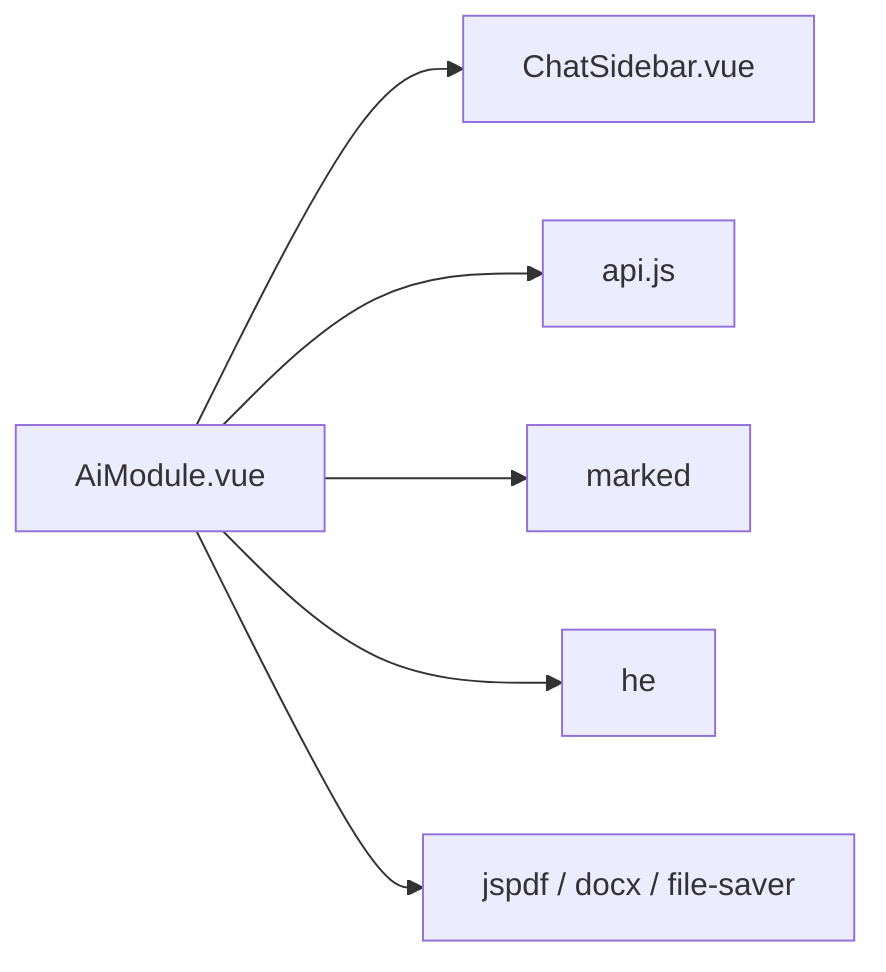

# Chat Interface & Conversational AI

<cite>
**Referenced Files in This Document**
- [AiModule.vue](file://src/views/Modules/aiagents/AiModule.vue)
- [ChatSidebar.vue](file://src/views/Modules/aiagents/components/ChatSidebar.vue)
- [api.js](file://src/services/api.js)
</cite>

## Table of Contents
1. Introduction
2. Project Structure
3. Core Components
4. Architecture Overview
5. Detailed Component Analysis
6. Dependency Analysis
7. Performance Considerations
8. Troubleshooting Guide
9. Conclusion
10. Appendices

## Introduction
This document explains the AI chat interface and conversational AI capabilities implemented in the application. It covers the main chat component, message handling, conversation management, real-time response streaming, chat sidebar with history and panels, input area features (suggestions, attachments, voice, multi-line), demo mode with automated UI interactions, offline AI mode via Ollama, message rendering with markdown and copy-to-clipboard, configuration and integration points, error handling, loading states, and UX optimizations.

## Project Structure
The chat feature is centered around a single-page module that composes:
- A main chat view that renders messages, input area, suggestion chips, and modals for offline AI and reporting.
- A compact left sidebar for toggling panels (documents, notes, history) and user actions.
- An API service layer that resolves backend URLs and handles authentication interceptors.

**Diagram sources**
- [AiModule.vue:1-281](file://src/views/Modules/aiagents/AiModule.vue#L1-L281)
- [ChatSidebar.vue:1-88](file://src/views/Modules/aiagents/components/ChatSidebar.vue#L1-L88)
- [api.js:1-18](file://src/services/api.js#L1-L18)

**Section sources**
- [AiModule.vue:1-281](file://src/views/Modules/aiagents/AiModule.vue#L1-L281)
- [ChatSidebar.vue:1-88](file://src/views/Modules/aiagents/components/ChatSidebar.vue#L1-L88)
- [api.js:1-18](file://src/services/api.js#L1-L18)

## Core Components
- Main chat view (AiModule.vue): orchestrates message flow, conversation persistence, demo/offline modes, markdown rendering, and export utilities.
- Chat sidebar (ChatSidebar.vue): provides quick access to documents, notes, history, theme, settings, and profile toggles.
- API service (api.js): centralizes base URL resolution, auth header injection, token refresh, and request/response interceptors.

Key responsibilities:
- Message handling: immediate user feedback, loading indicators, error display, scroll-to-bottom.
- Conversation management: create/load/delete conversations, persist messages, thread ID continuity.
- Offline AI: local Ollama client with tool calling and error guidance.
- Demo mode: parse embedded JSON actions and drive UI automation with highlights.
- Rendering: markdown parsing and safe HTML output; copy-to-clipboard support.

**Section sources**
- [AiModule.vue:534-1338](file://src/views/Modules/aiagents/AiModule.vue#L534-L1338)
- [ChatSidebar.vue:1-88](file://src/views/Modules/aiagents/components/ChatSidebar.vue#L1-L88)
- [api.js:64-146](file://src/services/api.js#L64-L146)

## Architecture Overview
The chat architecture separates concerns into UI orchestration, stateful conversation management, and external integrations (backend APIs and local Ollama).

**Diagram sources**
- [AiModule.vue:1059-1155](file://src/views/Modules/aiagents/AiModule.vue#L1059-L1155)
- [AiModule.vue:962-1042](file://src/views/Modules/aiagents/AiModule.vue#L962-L1042)
- [api.js:64-146](file://src/services/api.js#L64-L146)

## Detailed Component Analysis

### Main Chat View (AiModule.vue)
Responsibilities:
- Renders welcome hero, message list, typing indicator, suggestion chips, and input area.
- Manages conversation lifecycle and persistence.
- Implements online chat via backend endpoints and offline chat via Ollama.
- Provides demo mode automation with highlight overlays.
- Supports markdown rendering and copy-to-clipboard.

Key flows:
- Send message: validates input, shows user message immediately, sets loading, auto-creates conversation if needed, posts to backend or Ollama, parses and renders response, persists messages, clears input, scrolls to bottom.
- Load conversation: fetches from backend, maps stored messages to chat format, sets thread_id, scrolls to bottom.
- Offline chat: sends messages to local Ollama, supports function/tool calls, renders markdown, handles errors with actionable messages.
- Demo mode: parses embedded JSON actions from bot responses and executes navigation, highlighting, clicking, filling inputs, and waits.

**Diagram sources**
- [AiModule.vue:1059-1155](file://src/views/Modules/aiagents/AiModule.vue#L1059-L1155)
- [AiModule.vue:876-938](file://src/views/Modules/aiagents/AiModule.vue#L876-L938)

#### Markdown Rendering and Copy-to-Clipboard
- Bot messages are rendered using markdown parsing and injected as HTML.
- User messages are displayed as plain text.
- Each bot message includes a copy button that copies raw or rendered text to clipboard.

**Section sources**
- [AiModule.vue:159-175](file://src/views/Modules/aiagents/AiModule.vue#L159-L175)
- [AiModule.vue:865-872](file://src/views/Modules/aiagents/AiModule.vue#L865-L872)
- [AiModule.vue:1117-1134](file://src/views/Modules/aiagents/AiModule.vue#L1117-L1134)

#### Conversation Management
- Fetches conversation list, creates new conversations, loads existing ones, saves messages in batches, deletes conversations.
- Uses thread_id stored in localStorage to maintain context across sessions.

**Section sources**
- [AiModule.vue:876-960](file://src/views/Modules/aiagents/AiModule.vue#L876-L960)
- [AiModule.vue:1085-1086](file://src/views/Modules/aiagents/AiModule.vue#L1085-L1086)

#### Offline AI Mode (Ollama Integration)
- LocalOllamaClient wraps fetch to call local Ollama at http://127.0.0.1:11434.
- Handles model not found, mixed content security blocks, CORS/network errors with clear guidance.
- Supports tool/function calls by injecting tool results back into the conversation and re-invoking the model.

**Diagram sources**
- [AiModule.vue:555-603](file://src/views/Modules/aiagents/AiModule.vue#L555-L603)
- [AiModule.vue:962-1042](file://src/views/Modules/aiagents/AiModule.vue#L962-L1042)

**Section sources**
- [AiModule.vue:555-603](file://src/views/Modules/aiagents/AiModule.vue#L555-L603)
- [AiModule.vue:962-1042](file://src/views/Modules/aiagents/AiModule.vue#L962-L1042)

#### Demo Mode Implementation
- Parses embedded JSON actions from bot responses.
- Executes actions like navigate, highlight_text, click_text, fill_placeholder, explain, wait.
- Highlights elements with colored outlines and tooltips, then cleans up after completion.

**Diagram sources**
- [AiModule.vue:614-731](file://src/views/Modules/aiagents/AiModule.vue#L614-L731)
- [AiModule.vue:1117-1125](file://src/views/Modules/aiagents/AiModule.vue#L1117-L1125)

**Section sources**
- [AiModule.vue:614-731](file://src/views/Modules/aiagents/AiModule.vue#L614-L731)
- [AiModule.vue:1117-1125](file://src/views/Modules/aiagents/AiModule.vue#L1117-L1125)

### Chat Sidebar (ChatSidebar.vue)
- Compact vertical toolbar with icons for Documents, Notes, History, Theme, Settings, Profile.
- Emits events to parent for toggling panels and actions.
- Displays badge counts for history items.

**Section sources**
- [ChatSidebar.vue:1-88](file://src/views/Modules/aiagents/components/ChatSidebar.vue#L1-L88)

### Input Area Features
- Multi-line textarea with auto-resize and Shift+Enter for newline.
- Suggestion chips shown above input when there are messages and not loading.
- Placeholder buttons for Attach Document and Voice Input (UI hooks ready for future implementation).
- Send button disabled while empty or loading.

**Section sources**
- [AiModule.vue:200-255](file://src/views/Modules/aiagents/AiModule.vue#L200-L255)
- [AiModule.vue:826-849](file://src/views/Modules/aiagents/AiModule.vue#L826-L849)

### Error Handling and Loading States
- Global axios interceptors handle 401 by refreshing tokens or redirecting to login.
- Chat send logic catches network/API errors and displays contextual messages (e.g., session expired, permission denied).
- Offline Ollama client throws descriptive errors for missing models, HTTPS mixed content, and unreachable server.
- Loading states: global loading flag for main chat, offlineLoading for offline modal, loadingConversations for history panel.

**Section sources**
- [api.js:64-146](file://src/services/api.js#L64-L146)
- [AiModule.vue:1139-1154](file://src/views/Modules/aiagents/AiModule.vue#L1139-L1154)
- [AiModule.vue:575-601](file://src/views/Modules/aiagents/AiModule.vue#L575-L601)
- [AiModule.vue:1031-1041](file://src/views/Modules/aiagents/AiModule.vue#L1031-L1041)

### Real-Time Response Streaming
- The current implementation uses standard HTTP requests and renders full responses after completion.
- The Ollama client accepts a stream flag but does not implement streaming consumption in this codebase.
- To enable streaming, extend LocalOllamaClient to read Server-Sent Events or ReadableStream chunks and append partial content incrementally.

[No sources needed since this section provides general guidance based on observed behavior]

## Dependency Analysis
- AiModule.vue depends on:
  - ChatSidebar.vue for sidebar controls.
  - api.js for backend communication and auth handling.
  - External libraries: marked for markdown parsing, he for HTML entity decoding, jspdf/docx/file-saver for export.
- ChatSidebar.vue emits events consumed by AiModule.vue.
- api.js configures base URL and attaches Authorization headers automatically.

**Diagram sources**
- [AiModule.vue:534-548](file://src/views/Modules/aiagents/AiModule.vue#L534-L548)
- [api.js:1-18](file://src/services/api.js#L1-L18)

**Section sources**
- [AiModule.vue:534-548](file://src/views/Modules/aiagents/AiModule.vue#L534-L548)
- [api.js:1-18](file://src/services/api.js#L1-L18)

## Performance Considerations
- Immediate user message rendering improves perceived responsiveness.
- Auto-resize textarea prevents excessive height growth and maintains layout stability.
- Scroll-to-bottom after updates ensures visibility of latest content without manual scrolling.
- Batch saving of messages reduces API calls during a conversation turn.
- Debouncing or throttling suggestions load can reduce unnecessary network traffic.
- Avoid heavy DOM queries in demo mode loops; current findByText filters visible nodes efficiently.

[No sources needed since this section provides general guidance]

## Troubleshooting Guide
Common issues and resolutions:
- Backend 401 Unauthorized: Token refresh handled by interceptors; if refresh fails, user is redirected to login.
- Permission denied (403): Displayed as an error message in chat; verify role-based access.
- Network errors: Contextual error messages shown in chat; check connectivity and backend availability.
- Ollama not responding: Ensure Ollama runs at http://localhost:11434 and model is installed; set OLLAMA_ORIGINS="*" on Linux/Mac.
- Mixed Content (HTTPS site to HTTP localhost): Browser blocks connection; adjust browser flags or serve over HTTPS locally.

**Section sources**
- [api.js:90-146](file://src/services/api.js#L90-L146)
- [AiModule.vue:1139-1154](file://src/views/Modules/aiagents/AiModule.vue#L1139-L1154)
- [AiModule.vue:575-601](file://src/views/Modules/aiagents/AiModule.vue#L575-L601)

## Conclusion
The chat interface provides a robust, extensible foundation for conversational AI with both online and offline modes. It integrates seamlessly with backend services through a centralized API layer, supports rich message rendering, and offers developer-friendly features like demo mode automation. The modular design allows easy extension for streaming responses, advanced input features, and deeper integrations.

[No sources needed since this section summarizes without analyzing specific files]

## Appendices

### Configuration and Customization Examples
- Configure backend base URL via environment variable or fallback rules in api.js.
- Customize suggestions by updating the suggestions array or fetching from a remote endpoint.
- Extend offline tools by adding new functions to offlineTools and implementing handlers in sendOfflineMessage.

**Section sources**
- [api.js:4-18](file://src/services/api.js#L4-L18)
- [AiModule.vue:806-819](file://src/views/Modules/aiagents/AiModule.vue#L806-L819)
- [AiModule.vue:784-798](file://src/views/Modules/aiagents/AiModule.vue#L784-L798)

### Integrating with External AI Services
- Switch between demo and production agents by toggling isDemoMode and posting to different endpoints.
- Add new providers by extending LocalOllamaClient or creating a new client class with similar interfaces.

**Section sources**
- [AiModule.vue:1088-1110](file://src/views/Modules/aiagents/AiModule.vue#L1088-L1110)
- [AiModule.vue:555-603](file://src/views/Modules/aiagents/AiModule.vue#L555-L603)