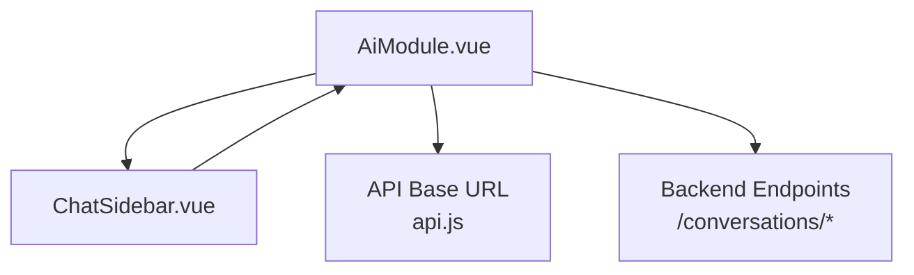
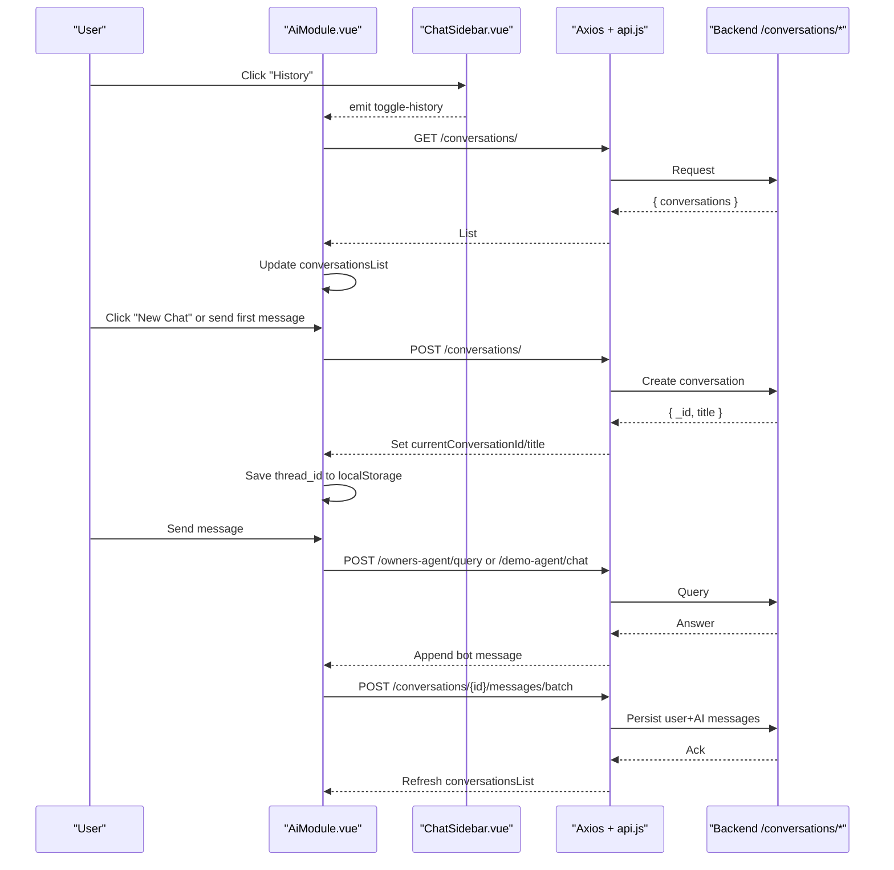
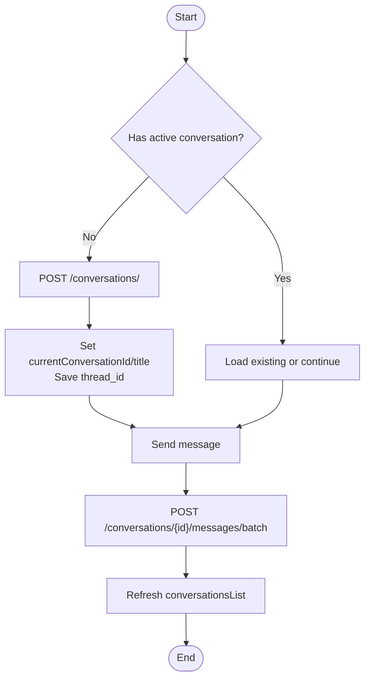
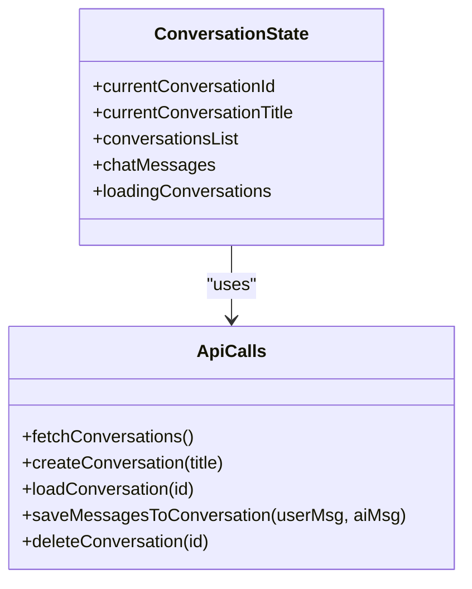
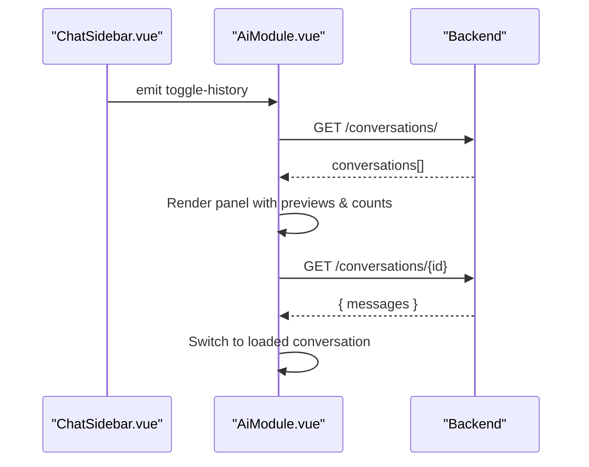
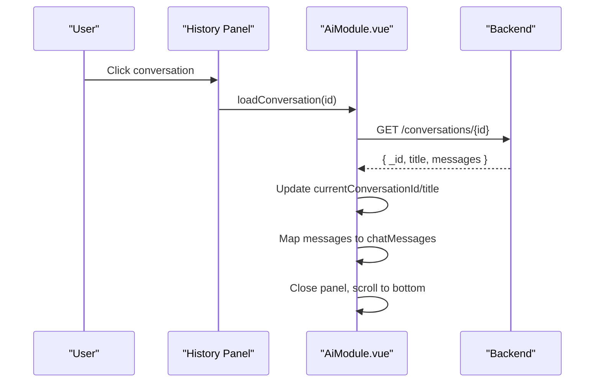
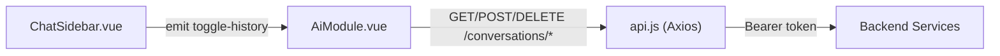

# Conversation Management & History

<cite>
**Referenced Files in This Document**
- [AiModule.vue](file://src/views/Modules/aiagents/AiModule.vue)
- [ChatSidebar.vue](file://src/views/Modules/aiagents/components/ChatSidebar.vue)
- [api.js](file://src/services/api.js)
</cite>

## Table of Contents
1. [Introduction](#introduction)
2. [Project Structure](#project-structure)
3. [Core Components](#core-components)
4. [Architecture Overview](#architecture-overview)
5. [Detailed Component Analysis](#detailed-component-analysis)
6. [Dependency Analysis](#dependency-analysis)
7. [Performance Considerations](#performance-considerations)
8. [Troubleshooting Guide](#troubleshooting-guide)
9. [Conclusion](#conclusion)

## Introduction
This document explains the conversation management system powering the AI chat interface. It covers the full lifecycle of conversations (creation, loading, saving, deletion), state management for the active conversation and history list, the history panel with sidebar integration, message preview generation, and persistence via API calls. It also details how conversation switching updates UI state, error handling strategies, performance considerations for large histories, and UX best practices for navigation.

## Project Structure
The conversation system is implemented primarily within the AI Agents module:
- AiModule.vue hosts the chat UI, conversation state, and all conversation-related operations.
- ChatSidebar.vue provides a compact left rail to toggle panels including History.
- api.js configures the base URL and adds authentication interceptors used by Axios requests.

**Diagram sources**
- [AiModule.vue:1-50](file://src/views/Modules/aiagents/AiModule.vue#L1-L50)
- [ChatSidebar.vue:1-35](file://src/views/Modules/aiagents/components/ChatSidebar.vue#L1-L35)
- [api.js:1-18](file://src/services/api.js#L1-L18)

**Section sources**
- [AiModule.vue:1-120](file://src/views/Modules/aiagents/AiModule.vue#L1-L120)
- [ChatSidebar.vue:1-88](file://src/views/Modules/aiagents/components/ChatSidebar.vue#L1-L88)
- [api.js:1-18](file://src/services/api.js#L1-L18)

## Core Components
- Conversation state variables:
  - currentConversationId: tracks the active conversation ID.
  - currentConversationTitle: displays the active conversation title in the header.
  - conversationsList: reactive array of conversation summaries shown in the History panel.
  - loadingConversations: indicates when the history list is being fetched.
- Message state:
  - chatMessages: the current conversation’s messages rendered in the chat area.
  - loading: indicates an ongoing send operation.
- Panel state:
  - activePanel: controls which side panel is open (history, notes, documents).

These are defined and updated throughout AiModule.vue to reflect user actions and backend responses.

**Section sources**
- [AiModule.vue:737-756](file://src/views/Modules/aiagents/AiModule.vue#L737-L756)
- [AiModule.vue:741-744](file://src/views/Modules/aiagents/AiModule.vue#L741-L744)

## Architecture Overview
The system integrates UI state, local storage for thread continuity, and backend APIs for conversation persistence.

**Diagram sources**
- [AiModule.vue:876-960](file://src/views/Modules/aiagents/AiModule.vue#L876-L960)
- [AiModule.vue:1060-1155](file://src/views/Modules/aiagents/AiModule.vue#L1060-L1155)
- [api.js:65-76](file://src/services/api.js#L65-L76)

## Detailed Component Analysis

### Conversation Lifecycle
- Creation:
  - On first message or explicit “New Chat”, create a conversation via POST /conversations/. The response sets currentConversationId and currentConversationTitle. A new thread_id is stored in localStorage for LangGraph continuity.
- Loading:
  - Opening History fetches all conversations via GET /conversations/. Selecting a conversation loads its messages via GET /conversations/{id}, mapping roles and rendering timestamps.
- Saving:
  - After each exchange, batch messages are posted to /conversations/{id}/messages/batch to persist user and AI messages. The history list is refreshed to update previews and counts.
- Deletion:
  - Deleting a conversation removes it from the backend and clears the active state if the deleted conversation was current.

**Diagram sources**
- [AiModule.vue:888-902](file://src/views/Modules/aiagents/AiModule.vue#L888-L902)
- [AiModule.vue:904-924](file://src/views/Modules/aiagents/AiModule.vue#L904-L924)
- [AiModule.vue:926-938](file://src/views/Modules/aiagents/AiModule.vue#L926-L938)
- [AiModule.vue:948-960](file://src/views/Modules/aiagents/AiModule.vue#L948-L960)

**Section sources**
- [AiModule.vue:876-960](file://src/views/Modules/aiagents/AiModule.vue#L876-L960)

### State Management
- currentConversationId:
  - Updated on create/load; cleared on delete or start new.
- currentConversationTitle:
  - Updated on create/load; displayed in header.
- conversationsList:
  - Populated by fetching /conversations/; used to render history items with title, preview, message count, and date.
- chatMessages:
  - Local reactive array for the current conversation; mapped from backend messages when loading.

**Diagram sources**
- [AiModule.vue:737-756](file://src/views/Modules/aiagents/AiModule.vue#L737-L756)
- [AiModule.vue:876-960](file://src/views/Modules/aiagents/AiModule.vue#L876-L960)

**Section sources**
- [AiModule.vue:737-756](file://src/views/Modules/aiagents/AiModule.vue#L737-L756)
- [AiModule.vue:876-960](file://src/views/Modules/aiagents/AiModule.vue#L876-L960)

### History Panel and Sidebar Integration
- ChatSidebar.vue exposes a History button that emits toggle-history.
- AiModule.vue listens to this event to open the right-side History panel.
- The panel shows:
  - A “New Conversation” button.
  - A list of conversations with title, preview text, message count, and relative date.
  - Delete action per item.
- Selecting a conversation triggers loadConversation, which fetches messages and resets the panel.

**Diagram sources**
- [ChatSidebar.vue:23-34](file://src/views/Modules/aiagents/components/ChatSidebar.vue#L23-L34)
- [AiModule.vue:298-349](file://src/views/Modules/aiagents/AiModule.vue#L298-L349)
- [AiModule.vue:876-924](file://src/views/Modules/aiagents/AiModule.vue#L876-L924)

**Section sources**
- [ChatSidebar.vue:1-88](file://src/views/Modules/aiagents/components/ChatSidebar.vue#L1-L88)
- [AiModule.vue:298-349](file://src/views/Modules/aiagents/AiModule.vue#L298-L349)
- [AiModule.vue:876-924](file://src/views/Modules/aiagents/AiModule.vue#L876-L924)

### Conversation Switching Mechanism
- When a user selects a conversation from History:
  - loadConversation sets currentConversationId and currentConversationTitle.
  - chatMessages is populated from the backend payload and formatted for display.
  - thread_id is set to the conversation ID to maintain context continuity.
  - The panel closes and the chat scrolls to the bottom.

**Diagram sources**
- [AiModule.vue:904-924](file://src/views/Modules/aiagents/AiModule.vue#L904-L924)

**Section sources**
- [AiModule.vue:904-924](file://src/views/Modules/aiagents/AiModule.vue#L904-L924)

### Persistence Layer and API Calls
- Fetch conversations: GET /conversations/ → populates conversationsList.
- Create conversation: POST /conversations/ → sets active conversation and thread_id.
- Load conversation: GET /conversations/{id} → maps messages and sets active state.
- Save messages: POST /conversations/{id}/messages/batch → persists user and AI messages.
- Delete conversation: DELETE /conversations/{id} → removes and refreshes list.

Authentication headers are automatically attached via Axios interceptor configured in api.js.

**Section sources**
- [AiModule.vue:876-960](file://src/views/Modules/aiagents/AiModule.vue#L876-L960)
- [api.js:65-76](file://src/services/api.js#L65-L76)

### Data Model Examples
- Conversation summary (as rendered in History):
  - Fields include id, title, preview, message_count, updated_at.
- Stored messages (as loaded into chatMessages):
  - Each message includes role (user/ai), content, and timestamp.
- Active conversation state:
  - currentConversationId, currentConversationTitle, conversationsList, chatMessages.

Note: These structures are inferred from the API usage and mapping logic in the component.

**Section sources**
- [AiModule.vue:904-924](file://src/views/Modules/aiagents/AiModule.vue#L904-L924)
- [AiModule.vue:926-938](file://src/views/Modules/aiagents/AiModule.vue#L926-L938)

### Error Handling
- Network/API errors during conversation operations are caught and logged.
- For chat sends, specific status codes produce user-facing messages:
  - 401: session expired prompt.
  - 403: permission denied message.
  - Other errors: generic error message with status or network info.
- Local AI (offline mode) errors are handled separately and surfaced in the offline modal.

**Section sources**
- [AiModule.vue:1139-1155](file://src/views/Modules/aiagents/AiModule.vue#L1139-L1155)
- [AiModule.vue:881-885](file://src/views/Modules/aiagents/AiModule.vue#L881-L885)
- [AiModule.vue:935-937](file://src/views/Modules/aiagents/AiModule.vue#L935-L937)
- [AiModule.vue:957-959](file://src/views/Modules/aiagents/AiModule.vue#L957-L959)

## Dependency Analysis
- AiModule.vue depends on:
  - ChatSidebar.vue for panel toggling events.
  - api.js for base URL and authenticated Axios behavior.
  - Backend endpoints under /conversations/* and agent query endpoints.
- ChatSidebar.vue is decoupled and only emits events consumed by AiModule.vue.
- api.js centralizes auth header injection and token refresh flow used by all Axios calls.

**Diagram sources**
- [ChatSidebar.vue:23-34](file://src/views/Modules/aiagents/components/ChatSidebar.vue#L23-L34)
- [AiModule.vue:876-960](file://src/views/Modules/aiagents/AiModule.vue#L876-L960)
- [api.js:65-76](file://src/services/api.js#L65-L76)

**Section sources**
- [ChatSidebar.vue:1-88](file://src/views/Modules/aiagents/components/ChatSidebar.vue#L1-L88)
- [AiModule.vue:876-960](file://src/views/Modules/aiagents/AiModule.vue#L876-L960)
- [api.js:65-76](file://src/services/api.js#L65-L76)

## Performance Considerations
- Large conversation histories:
  - Consider virtualizing the messages list to avoid rendering thousands of DOM nodes.
  - Paginate or lazy-load older messages when opening a conversation.
- Efficient updates:
  - Avoid re-fetching the entire conversationsList after every save unless necessary; consider optimistic updates.
- Rendering optimization:
  - Use computed properties for derived data (e.g., filtered lists).
  - Debounce heavy computations like markdown parsing for very long messages.
- Network efficiency:
  - Batch message saves where possible (already implemented).
  - Cache conversation metadata locally to reduce repeated fetches.

[No sources needed since this section provides general guidance]

## Troubleshooting Guide
- Cannot fetch conversations:
  - Verify network connectivity and that the backend is reachable at the configured base URL.
  - Ensure authentication token is present; the Axios interceptor will attach it automatically.
- Failed to create conversation:
  - Check backend availability and payload format. Errors are logged to console.
- Failed to load conversation:
  - Confirm the conversation exists and you have access. Errors are logged to console.
- Failed to save messages:
  - Ensure a valid currentConversationId exists before sending. Errors are logged to console.
- Session expired (401):
  - The interceptor attempts token refresh; if it fails, users are redirected to login.
- Permission denied (403):
  - User lacks required role/permissions; show appropriate messaging.

**Section sources**
- [AiModule.vue:881-885](file://src/views/Modules/aiagents/AiModule.vue#L881-L885)
- [AiModule.vue:899-901](file://src/views/Modules/aiagents/AiModule.vue#L899-L901)
- [AiModule.vue:921-923](file://src/views/Modules/aiagents/AiModule.vue#L921-L923)
- [AiModule.vue:935-937](file://src/views/Modules/aiagents/AiModule.vue#L935-L937)
- [AiModule.vue:957-959](file://src/views/Modules/aiagents/AiModule.vue#L957-L959)
- [api.js:90-145](file://src/services/api.js#L90-L145)

## Conclusion
The conversation management system provides a complete lifecycle for creating, loading, saving, and deleting conversations, with robust state management and clear UI feedback. The History panel integrates seamlessly with the sidebar, offering previews and counts to aid navigation. Persistence relies on well-defined backend endpoints with automatic authentication. Error handling ensures users receive meaningful feedback, and performance recommendations help scale to large histories. Together, these elements deliver a responsive and reliable chat experience.