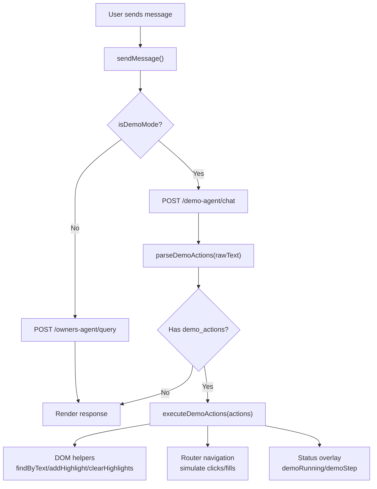
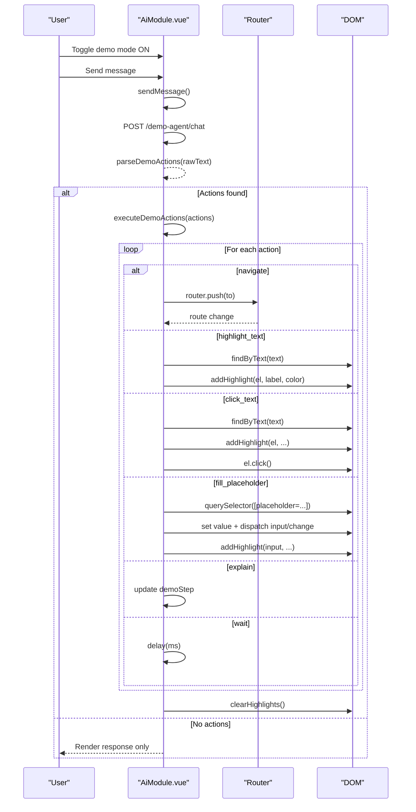
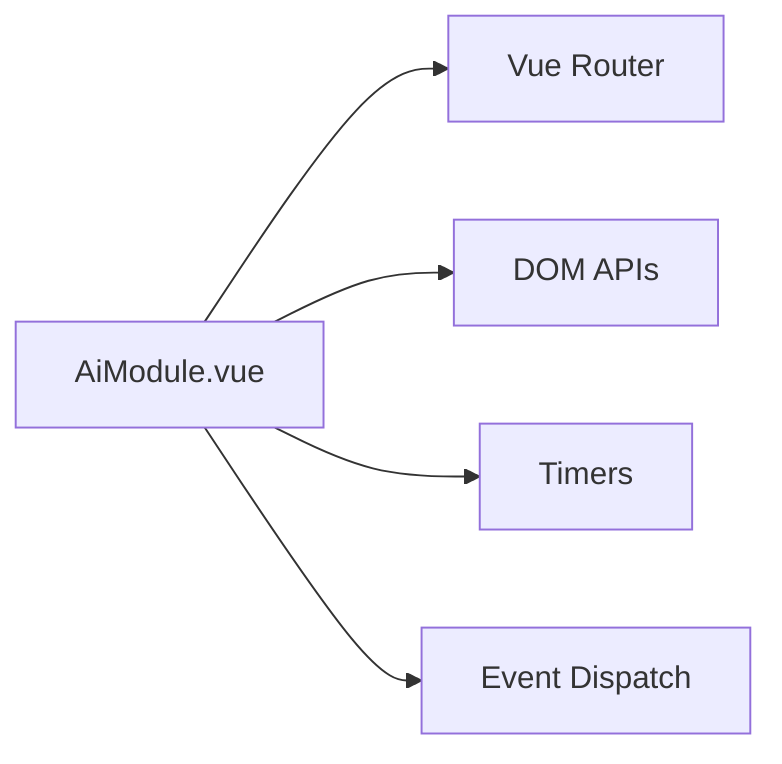

# Demo Mode & Automated Interactions

<cite>
**Referenced Files in This Document**
- [AiModule.vue](file://src/views/Modules/aiagents/AiModule.vue)
</cite>

## Table of Contents
1. [Introduction](#introduction)
2. [Project Structure](#project-structure)
3. [Core Components](#core-components)
4. [Architecture Overview](#architecture-overview)
5. [Detailed Component Analysis](#detailed-component-analysis)
6. [Dependency Analysis](#dependency-analysis)
7. [Performance Considerations](#performance-considerations)
8. [Troubleshooting Guide](#troubleshooting-guide)
9. [Conclusion](#conclusion)
10. [Appendices](#appendices)

## Introduction
This document explains the demo mode system that enables automated UI interactions and guided demonstrations within the application. It covers how demo actions are parsed from AI responses, executed step-by-step, and tracked visually for the user. It also documents DOM manipulation utilities used to highlight elements, find text-based selectors, simulate user interactions, and provide visual feedback through overlays, tooltips, and status indicators. Finally, it provides guidance on creating custom demonstration sequences, common scenarios, performance considerations, and debugging/testing practices.

## Project Structure
The demo mode is implemented as part of the AI Agents module. The key file contains:
- A toggle to enable/disable demo mode
- An execution engine that parses and runs a sequence of actions
- DOM helpers to locate and interact with elements by visible text or placeholder attributes
- Visual feedback via highlights and a persistent status banner

**Diagram sources**
- [AiModule.vue:1060-1155](file://src/views/Modules/aiagents/AiModule.vue#L1060-L1155)
- [AiModule.vue:614-731](file://src/views/Modules/aiagents/AiModule.vue#L614-L731)

**Section sources**
- [AiModule.vue:1-120](file://src/views/Modules/aiagents/AiModule.vue#L1-L120)
- [AiModule.vue:1060-1155](file://src/views/Modules/aiagents/AiModule.vue#L1060-L1155)

## Core Components
- Demo mode toggle and state:
  - State variables control whether demo mode is active and whether a demo is currently running.
  - A status banner displays the current step during execution.
- Action parser:
  - Extracts a JSON block embedded in the AI response and retrieves the action list.
- Execution engine:
  - Iterates over actions and performs routing, DOM interaction, and timing controls.
- DOM helpers:
  - Text-based element search across buttons, links, headings, labels, and common containers.
  - Highlighting with outline, shadow, and tooltip positioning.
  - Cleanup routine to remove all demo artifacts.

**Section sources**
- [AiModule.vue:614-731](file://src/views/Modules/aiagents/AiModule.vue#L614-L731)
- [AiModule.vue:258-264](file://src/views/Modules/aiagents/AiModule.vue#L258-L264)

## Architecture Overview
The demo mode integrates tightly with the chat flow:
- When demo mode is enabled, messages are sent to a dedicated endpoint.
- If the response includes an embedded JSON block with demo actions, those actions are parsed and executed after the UI updates.
- Each action type drives specific behavior (navigation, highlighting, clicking, filling inputs, explaining, waiting).
- Visual feedback is provided via a floating status indicator and per-element highlights/tooltips.

**Diagram sources**
- [AiModule.vue:662-731](file://src/views/Modules/aiagents/AiModule.vue#L662-L731)
- [AiModule.vue:1103-1125](file://src/views/Modules/aiagents/AiModule.vue#L1103-L1125)

## Detailed Component Analysis

### Demo Execution Engine
- Entry point: triggered after parsing actions from the AI response.
- Behavior:
  - Sets running state and clears previous highlights.
  - Executes actions sequentially with delays where needed.
  - Updates a global step string shown in the status banner.
  - Ensures cleanup even if an error occurs.

Key responsibilities:
- Routing: navigates to target routes and waits for Vue rendering.
- DOM interaction: finds elements by visible text, simulates clicks, fills inputs by placeholder, and triggers events to maintain framework reactivity.
- Timing: uses explicit waits to stabilize transitions and render cycles.

**Section sources**
- [AiModule.vue:662-731](file://src/views/Modules/aiagents/AiModule.vue#L662-L731)

### DOM Manipulation Utilities
- Text-based selector finder:
  - Scans common interactive and textual nodes.
  - Filters by exact trimmed text match and ensures visibility.
- Highlighter:
  - Adds outline, shadow, border radius, and smooth scroll into view.
  - Creates a floating tooltip positioned above the element.
  - Marks elements with data attributes for easy cleanup.
- Cleaner:
  - Removes outlines/shadows and deletes data attributes.
  - Removes all tooltip elements created during demos.

Complexity notes:
- Text search iterates over a subset of DOM nodes; complexity is proportional to the number of candidates.
- Highlighting and tooltip creation are O(1) per call; cleanup is O(k) where k is the number of highlighted elements and tips.

**Section sources**
- [AiModule.vue:614-660](file://src/views/Modules/aiagents/AiModule.vue#L614-L660)

### Action Types
Supported actions and their semantics:
- navigate:
  - Navigates to a specified route and waits for the page to render before continuing.
- highlight_text:
  - Locates an element by its visible text and highlights it with an optional label and color.
- click_text:
  - Finds an element by visible text, highlights it, clicks it, and waits for post-click effects.
- fill_placeholder:
  - Finds an input or textarea by its placeholder attribute, sets its value using the native setter, dispatches input/change events to ensure reactivity, and highlights the field.
- explain:
  - Updates the demo step text to display explanatory information without interacting with the DOM.
- wait:
  - Pauses execution for a specified duration to allow asynchronous operations or animations to complete.

Notes:
- Colors and labels can be customized per action.
- Delays are used to accommodate routing, rendering, and network-driven UI changes.

**Section sources**
- [AiModule.vue:662-731](file://src/views/Modules/aiagents/AiModule.vue#L662-L731)

### Visual Feedback System
- Status banner:
  - A fixed overlay at the bottom center shows “DEMO RUNNING” and the current step.
  - Uses a pulsing indicator dot to signal activity.
- Element highlights:
  - Outlines and shadows draw attention to the targeted element.
  - Smooth scrolling ensures the element is visible.
- Tooltip labels:
  - A small floating label appears near the highlighted element describing the action.
- Cleanup:
  - After completion, highlights and tooltips are removed automatically.

**Section sources**
- [AiModule.vue:258-264](file://src/views/Modules/aiagents/AiModule.vue#L258-L264)
- [AiModule.vue:624-660](file://src/views/Modules/aiagents/AiModule.vue#L624-L660)

### Demo Script Format and Custom Sequences
- Source of actions:
  - Actions are embedded in the AI response inside a fenced JSON block.
  - The parser extracts this block and reads the array of actions.
- Expected structure:
  - An array of objects, each with a type field and parameters depending on the action.
  - Common fields include text, to, placeholder, value, ms, color, label, wait_after.
- How to create custom sequences:
  - Compose a series of actions that reflect the desired user journey.
  - Use navigate to move between pages, highlight_text to emphasize content, click_text to trigger flows, fill_placeholder to enter data, explain to provide context, and wait to synchronize with async UI.
- Integration:
  - In demo mode, when the backend returns a response containing the JSON block, the frontend strips it from the displayed text and executes the actions automatically.

**Section sources**
- [AiModule.vue:724-731](file://src/views/Modules/aiagents/AiModule.vue#L724-L731)
- [AiModule.vue:1117-1125](file://src/views/Modules/aiagents/AiModule.vue#L1117-L1125)

### Example Scenarios
- Onboarding flow:
  - Navigate to the welcome page, highlight introductory sections, click “Get Started,” fill placeholders with sample data, and explain each step.
- Feature tour:
  - Move between modules, highlight key controls, click to open panels, and use explain to describe features.
- Training simulation:
  - Simulate a multi-step workflow such as searching, filtering, and exporting, with waits to show loading states and results.

[No sources needed since these are conceptual examples based on supported actions]

## Dependency Analysis
The demo mode depends on:
- Router integration for navigation.
- DOM APIs for element selection and manipulation.
- Event dispatching to maintain framework reactivity when setting values programmatically.
- Timers to coordinate asynchronous UI updates.

**Diagram sources**
- [AiModule.vue:662-731](file://src/views/Modules/aiagents/AiModule.vue#L662-L731)

**Section sources**
- [AiModule.vue:662-731](file://src/views/Modules/aiagents/AiModule.vue#L662-L731)

## Performance Considerations
- Large DOM trees:
  - Text-based searches scan a curated set of nodes rather than the entire document, reducing overhead.
  - Prefer precise text matches and avoid overly broad selectors to minimize candidate lists.
- Memory management:
  - Highlights and tooltips are tagged with data attributes and removed after execution to prevent leaks.
  - Always rely on the cleanup routine; do not leave highlights lingering across long sessions.
- Timing and rendering:
  - Use explicit waits after navigation and interactions to ensure stable state before proceeding.
  - Avoid excessive rapid-fire actions; batch them with appropriate delays.
- Extended sessions:
  - Reuse the same execution function but ensure prior highlights are cleared before starting new sequences.
  - Monitor memory usage in development tools if running very long or complex demos.

[No sources needed since this section provides general guidance grounded in observed implementation patterns]

## Troubleshooting Guide
Common issues and resolutions:
- Elements not found:
  - Ensure the visible text exactly matches the target’s rendered text (case-insensitive matching is used).
  - Verify the element is visible and not hidden by CSS (visibility checks are applied).
- Inputs not updating:
  - The engine uses the native value setter and dispatches input/change events to keep frameworks like Vue reactive.
  - Confirm the placeholder attribute matches exactly what is used in the action.
- Navigation timing:
  - Increase wait durations after navigate or click actions if the UI needs more time to render or fetch data.
- Stale highlights:
  - If highlights persist unexpectedly, run the cleanup routine or restart the demo session.
- Backend integration:
  - In demo mode, confirm the endpoint returns a response containing the expected JSON block with demo_actions.

**Section sources**
- [AiModule.vue:614-731](file://src/views/Modules/aiagents/AiModule.vue#L614-L731)
- [AiModule.vue:1103-1125](file://src/views/Modules/aiagents/AiModule.vue#L1103-L1125)

## Conclusion
The demo mode system provides a robust mechanism for guiding users through automated UI interactions. By embedding structured actions in AI responses, the application can drive navigation, highlight important elements, simulate user actions, and provide contextual explanations—all while maintaining a clean and responsive interface. With careful scripting and attention to performance and cleanup, it supports effective onboarding, feature tours, and training simulations.

[No sources needed since this section summarizes without analyzing specific files]

## Appendices

### Action Reference Summary
- navigate: moves to a route and waits for rendering.
- highlight_text: emphasizes an element by visible text with optional label and color.
- click_text: locates and clicks an element by visible text with optional wait.
- fill_placeholder: fills an input/textarea by placeholder and triggers reactivity events.
- explain: updates the demo step text for user context.
- wait: pauses execution for a specified duration.

**Section sources**
- [AiModule.vue:662-731](file://src/views/Modules/aiagents/AiModule.vue#L662-L731)