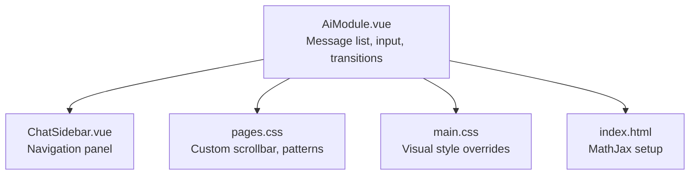
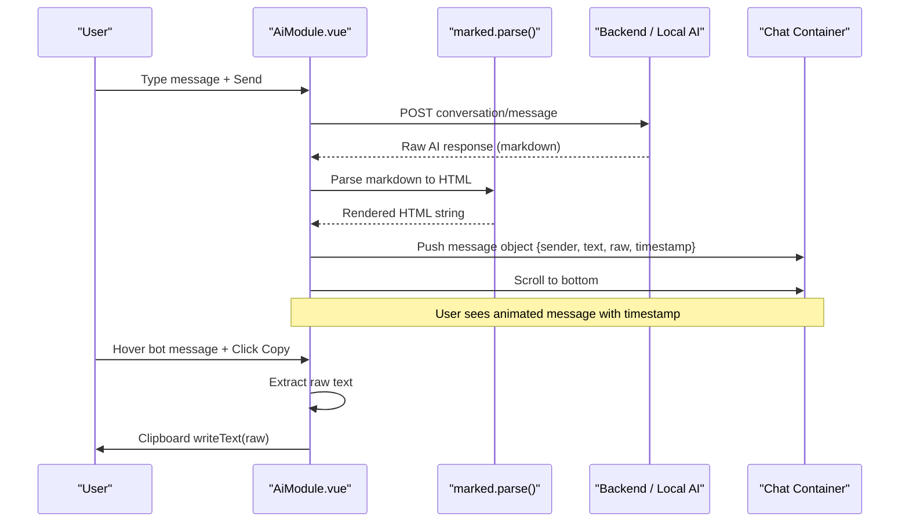
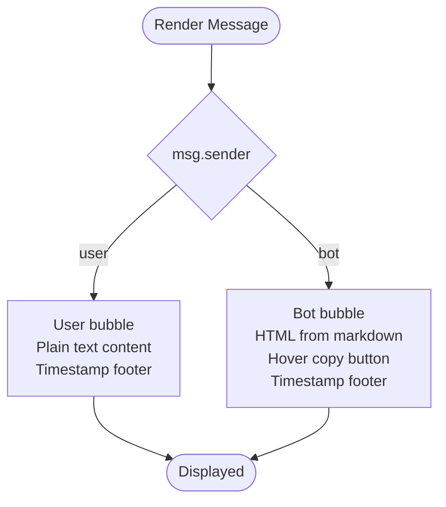
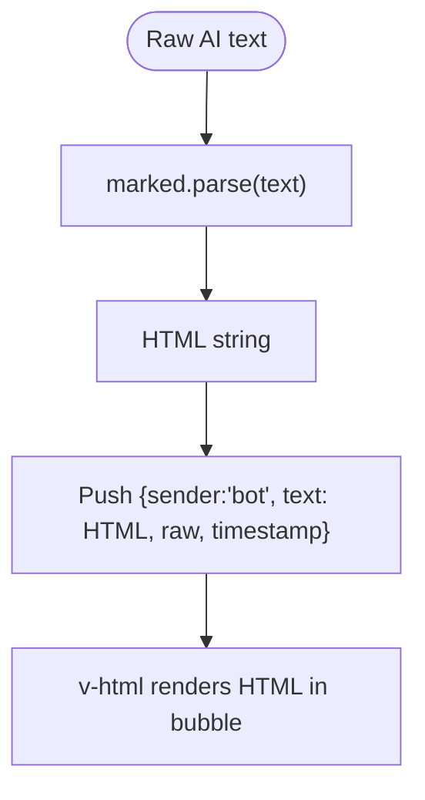
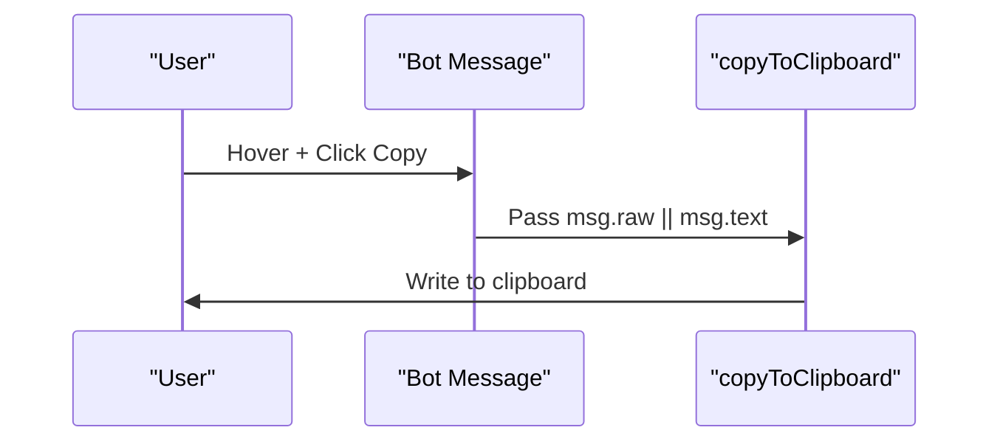
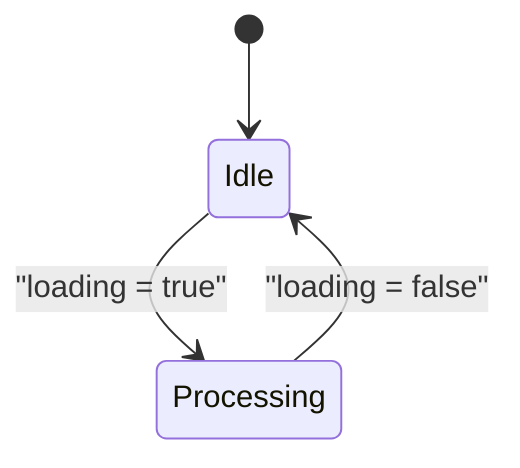
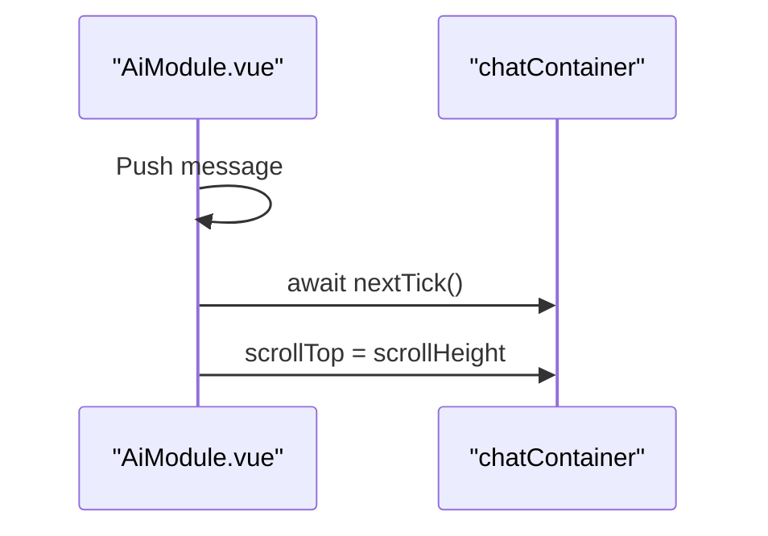
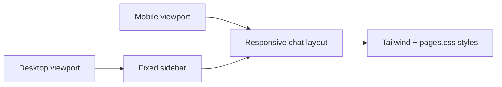
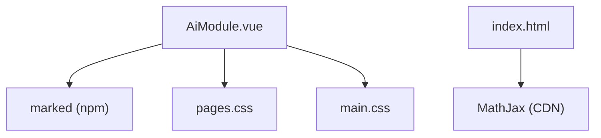

# Message Rendering & Content Display

<cite>
**Referenced Files in This Document**
- [AiModule.vue](file://src/views/Modules/aiagents/AiModule.vue)
- [ChatSidebar.vue](file://src/views/Modules/aiagents/components/ChatSidebar.vue)
- [main.css](file://src/assets/main.css)
- [pages.css](file://src/assets/pages.css)
- [index.html](file://index.html)
</cite>

## Table of Contents
1. [Introduction](#introduction)
2. [Project Structure](#project-structure)
3. [Core Components](#core-components)
4. [Architecture Overview](#architecture-overview)
5. [Detailed Component Analysis](#detailed-component-analysis)
6. [Dependency Analysis](#dependency-analysis)
7. [Performance Considerations](#performance-considerations)
8. [Troubleshooting Guide](#troubleshooting-guide)
9. [Conclusion](#conclusion)
10. [Appendices](#appendices)

## Introduction
This document explains the message rendering system used to display chat messages and AI responses. It covers how sender identity, timestamps, and styling differentiate user and bot messages; how markdown is rendered using the marked library for rich content including code blocks; how copy-to-clipboard works with raw message extraction; how typing indicators animate; how new messages transition and scroll into view; responsive design considerations; accessibility features; performance optimizations for large histories; and guidance for extending the renderer with custom content types and interactive elements.

## Project Structure
The messaging UI lives primarily in the AI Agents module:
- The main chat interface and logic are implemented in a single Vue component that renders the message list, input area, suggestions, modals, and transitions.
- A compact sidebar component provides navigation actions (documents, notes, history, theme, settings, profile).
- Shared styles define mesh backgrounds, dotted patterns, custom scrollbars, and dark mode variants.
- The application HTML includes MathJax configuration for rendering mathematical expressions in previews.

**Diagram sources**
- [AiModule.vue:1-281](file://src/views/Modules/aiagents/AiModule.vue#L1-L281)
- [ChatSidebar.vue:1-88](file://src/views/Modules/aiagents/components/ChatSidebar.vue#L1-L88)
- [pages.css:107-125](file://src/assets/pages.css#L107-L125)
- [main.css:418-448](file://src/assets/main.css#L418-L448)
- [index.html:69-77](file://index.html#L69-L77)

**Section sources**
- [AiModule.vue:1-281](file://src/views/Modules/aiagents/AiModule.vue#L1-L281)
- [ChatSidebar.vue:1-88](file://src/views/Modules/aiagents/components/ChatSidebar.vue#L1-L88)
- [pages.css:107-125](file://src/assets/pages.css#L107-L125)
- [main.css:418-448](file://src/assets/main.css#L418-L448)
- [index.html:69-77](file://index.html#L69-L77)

## Core Components
- Message list and bubbles:
  - Each message has a sender type (“user” or “bot”), text content, optional raw text for copying, and a formatted timestamp.
  - Bot messages render HTML via v-html after markdown processing; user messages render as plain text to avoid unintended HTML injection.
  - Timestamps are displayed inside each bubble footer.
  - Bot messages expose a hover-revealed action button to copy raw content.
- Typing indicator:
  - While loading, a small animated dots indicator appears aligned to the left, styled consistently with the chat bubbles.
- Input and suggestions:
  - A resizable textarea supports Enter to send and Shift+Enter for new lines.
  - Suggestion chips appear below the input when appropriate and can be clicked to send predefined prompts.
- Transitions and scrolling:
  - Messages enter with a fade/slide animation.
  - After sending or receiving a response, the container scrolls to the bottom smoothly.

**Section sources**
- [AiModule.vue:137-193](file://src/views/Modules/aiagents/AiModule.vue#L137-L193)
- [AiModule.vue:828-872](file://src/views/Modules/aiagents/AiModule.vue#L828-L872)
- [AiModule.vue:1245-1309](file://src/views/Modules/aiagents/AiModule.vue#L1245-L1309)

## Architecture Overview
The message rendering pipeline integrates data transformation, markdown rendering, DOM updates, and UX feedback:

**Diagram sources**
- [AiModule.vue:909-920](file://src/views/Modules/aiagents/AiModule.vue#L909-L920)
- [AiModule.vue:1127-1154](file://src/views/Modules/aiagents/AiModule.vue#L1127-L1154)
- [AiModule.vue:851-872](file://src/views/Modules/aiagents/AiModule.vue#L851-L872)

## Detailed Component Analysis

### Message Bubble Structure and Styling
- Sender identification:
  - Each message carries a sender field used to align and style the bubble.
  - A small label badge indicates “OPERATOR” for user messages and “LEXI_CORE” for bot messages.
- Timestamp display:
  - A monospaced, uppercase timestamp is shown at the bottom-right of each bubble.
- Styling variations:
  - User messages use a solid background with a brand-colored border.
  - Bot messages use a translucent white background with subtle borders and hover effects.
  - Both bubble types include a decorative dot pattern overlay for visual consistency.
- Rich content:
  - Bot messages render HTML produced by markdown parsing.
  - User messages render as plain text for safety.

**Diagram sources**
- [AiModule.vue:137-177](file://src/views/Modules/aiagents/AiModule.vue#L137-L177)

**Section sources**
- [AiModule.vue:137-177](file://src/views/Modules/aiagents/AiModule.vue#L137-L177)

### Markdown Rendering Pipeline (marked)
- Parsing:
  - Bot responses are parsed through the marked library to convert markdown into HTML.
  - This enables headings, lists, bold, links, and code blocks to be rendered within the message bubble.
- Integration points:
  - When loading a conversation, stored messages are mapped to chat messages with markdown parsed for AI roles.
  - On send, the final AI response is parsed before being pushed to the message list.
- Customization:
  - The rendered HTML is placed inside a scoped container class to apply consistent typography and spacing.

**Diagram sources**
- [AiModule.vue:909-915](file://src/views/Modules/aiagents/AiModule.vue#L909-L915)
- [AiModule.vue:1127-1134](file://src/views/Modules/aiagents/AiModule.vue#L1127-L1134)
- [AiModule.vue:1313-1337](file://src/views/Modules/aiagents/AiModule.vue#L1313-L1337)

**Section sources**
- [AiModule.vue:909-915](file://src/views/Modules/aiagents/AiModule.vue#L909-L915)
- [AiModule.vue:1127-1134](file://src/views/Modules/aiagents/AiModule.vue#L1127-L1134)
- [AiModule.vue:1313-1337](file://src/views/Modules/aiagents/AiModule.vue#L1313-L1337)

### Copy-to-Clipboard Functionality
- Trigger:
  - A hover-revealed button on bot messages invokes a copy function.
- Extraction:
  - The function uses the raw message field to ensure unformatted text is copied.
- Clipboard API:
  - Uses navigator.clipboard.writeText with error handling.

**Diagram sources**
- [AiModule.vue:170-175](file://src/views/Modules/aiagents/AiModule.vue#L170-L175)
- [AiModule.vue:865-872](file://src/views/Modules/aiagents/AiModule.vue#L865-L872)

**Section sources**
- [AiModule.vue:170-175](file://src/views/Modules/aiagents/AiModule.vue#L170-L175)
- [AiModule.vue:865-872](file://src/views/Modules/aiagents/AiModule.vue#L865-L872)

### Typing Indicator Implementation
- Visual:
  - Three bouncing dots indicate processing, styled consistently with the chat theme.
- Behavior:
  - Shown while the loading flag is true; hidden once the response arrives.
- Accessibility:
  - The indicator conveys state visually; consider adding aria-live regions for screen readers if needed.

**Diagram sources**
- [AiModule.vue:179-191](file://src/views/Modules/aiagents/AiModule.vue#L179-L191)

**Section sources**
- [AiModule.vue:179-191](file://src/views/Modules/aiagents/AiModule.vue#L179-L191)

### Message Transition Animations and Scroll Behavior
- Animations:
  - New messages enter with a fade and slight upward translation.
  - Additional slide-down animations are available for other UI elements.
- Scroll behavior:
  - After pushing a message or updating content, the container scrolls to the bottom using nextTick to ensure DOM readiness.
  - Smooth scrolling is enabled via CSS.

**Diagram sources**
- [AiModule.vue:139-143](file://src/views/Modules/aiagents/AiModule.vue#L139-L143)
- [AiModule.vue:851-856](file://src/views/Modules/aiagents/AiModule.vue#L851-L856)
- [AiModule.vue:1255-1262](file://src/views/Modules/aiagents/AiModule.vue#L1255-L1262)

**Section sources**
- [AiModule.vue:139-143](file://src/views/Modules/aiagents/AiModule.vue#L139-L143)
- [AiModule.vue:851-856](file://src/views/Modules/aiagents/AiModule.vue#L851-L856)
- [AiModule.vue:1255-1262](file://src/views/Modules/aiagents/AiModule.vue#L1255-L1262)

### Responsive Design Considerations
- Layout:
  - The chat container adapts to different screen sizes with padding adjustments and flexible widths.
  - Sidebar remains fixed on desktop; mobile layouts rely on the same structure but with reduced side margins.
- Typography and spacing:
  - Tailwind utility classes control font sizes, line heights, and spacing across breakpoints.
- Scrollbar and patterns:
  - Custom scrollbar styles provide a consistent look across browsers.
  - Mesh and dotted patterns adjust opacity and colors in dark mode.

**Diagram sources**
- [AiModule.vue:22-23](file://src/views/Modules/aiagents/AiModule.vue#L22-L23)
- [AiModule.vue:96-100](file://src/views/Modules/aiagents/AiModule.vue#L96-L100)
- [pages.css:107-125](file://src/assets/pages.css#L107-L125)
- [main.css:418-448](file://src/assets/main.css#L418-L448)

**Section sources**
- [AiModule.vue:22-23](file://src/views/Modules/aiagents/AiModule.vue#L22-L23)
- [AiModule.vue:96-100](file://src/views/Modules/aiagents/AiModule.vue#L96-L100)
- [pages.css:107-125](file://src/assets/pages.css#L107-L125)
- [main.css:418-448](file://src/assets/main.css#L418-L448)

### Examples of Message Formatting Options
- Headings, paragraphs, bold, lists:
  - Supported via markdown and rendered as structured HTML within the message bubble.
- Code blocks:
  - Markdown code fences produce code blocks in the rendered output.
- Links and emphasis:
  - Standard markdown link syntax and emphasis are supported.
- Mathematical expressions:
  - MathJax is configured in the application HTML to render inline and display math in previews.

**Section sources**
- [AiModule.vue:1313-1337](file://src/views/Modules/aiagents/AiModule.vue#L1313-L1337)
- [index.html:69-77](file://index.html#L69-L77)

### Custom Styling Approaches
- Scoped content container:
  - Use the prose-content class to target rendered markdown elements for consistent typography and spacing.
- Theme integration:
  - Dark mode and flat/minimal visual styles adjust backgrounds and patterns via global attributes.
- Scrollbar customization:
  - Apply the custom-scrollbar class to achieve consistent scroll appearance across browsers.

**Section sources**
- [AiModule.vue:1313-1337](file://src/views/Modules/aiagents/AiModule.vue#L1313-L1337)
- [main.css:418-448](file://src/assets/main.css#L418-L448)
- [pages.css:107-125](file://src/assets/pages.css#L107-L125)

### Accessibility Features
- Semantic labels:
  - Buttons have descriptive titles for tooltips.
- Keyboard interaction:
  - Enter sends messages; Shift+Enter inserts new lines in the textarea.
- Screen reader considerations:
  - For richer accessibility, add aria-live regions around dynamic content such as typing indicators and newly appended messages.
  - Ensure focus management when opening panels or modals.

**Section sources**
- [AiModule.vue:222-248](file://src/views/Modules/aiagents/AiModule.vue#L222-L248)
- [AiModule.vue:170-175](file://src/views/Modules/aiagents/AiModule.vue#L170-L175)

### Extending the Renderer for Custom Content Types
- Add custom block handlers:
  - Extend the markdown parser to recognize custom tokens and render them as specialized components or HTML fragments.
- Integrate interactive elements:
  - For interactive content, consider rendering safe HTML and attaching event listeners carefully, or use a component-based approach where possible.
- Sanitization:
  - If allowing arbitrary HTML, sanitize inputs to prevent XSS.
- Testing:
  - Validate rendering across devices and screen sizes; ensure keyboard and screen reader compatibility.

[No sources needed since this section provides general guidance]

## Dependency Analysis
- Internal dependencies:
  - AiModule.vue depends on ChatSidebar.vue for navigation.
  - Styles from pages.css and main.css influence visuals and behavior.
- External dependencies:
  - marked library parses markdown to HTML.
  - MathJax is loaded via script tags to render mathematical notation.

**Diagram sources**
- [AiModule.vue:543-545](file://src/views/Modules/aiagents/AiModule.vue#L543-L545)
- [AiModule.vue:1-281](file://src/views/Modules/aiagents/AiModule.vue#L1-L281)
- [index.html:69-77](file://index.html#L69-L77)

**Section sources**
- [AiModule.vue:543-545](file://src/views/Modules/aiagents/AiModule.vue#L543-L545)
- [index.html:69-77](file://index.html#L69-L77)

## Performance Considerations
- Large message histories:
  - Consider virtualizing the message list to render only visible items, reducing DOM size and improving scroll performance.
- Efficient DOM updates:
  - Use key-based lists and minimize reflows; leverage nextTick before scrolling to ensure stable DOM state.
- Debounce heavy operations:
  - If performing expensive computations during rendering, debounce or throttle to avoid blocking the UI thread.
- Image and media optimization:
  - Lazy-load images and defer non-critical assets to improve initial load time.
- Memory management:
  - Clear references to large objects when conversations are cleared or archived.

[No sources needed since this section provides general guidance]

## Troubleshooting Guide
- Markdown not rendering:
  - Verify that bot messages are parsed with the markdown parser before setting v-html content.
- Copy fails:
  - Ensure the browser allows clipboard access and that the raw text is provided; check console errors for permission issues.
- Scrolling not working:
  - Confirm that nextTick is awaited before setting scrollTop and that the container reference exists.
- Typing indicator stuck:
  - Ensure the loading flag is toggled correctly in both success and error paths.
- MathJax not rendering:
  - Confirm MathJax script is loaded and configured before content is rendered.

**Section sources**
- [AiModule.vue:851-872](file://src/views/Modules/aiagents/AiModule.vue#L851-L872)
- [AiModule.vue:1127-1154](file://src/views/Modules/aiagents/AiModule.vue#L1127-L1154)
- [index.html:69-77](file://index.html#L69-L77)

## Conclusion
The message rendering system combines clear sender identification, consistent styling, robust markdown rendering, and smooth UX interactions like typing indicators and transitions. It leverages shared styles for responsiveness and maintains simplicity while supporting rich content. With careful attention to accessibility, performance, and extensibility, the renderer can evolve to support advanced content types and interactive elements while preserving a high-quality user experience.

## Appendices

### Key Implementation References
- Message rendering and transitions:
  - [AiModule.vue:137-193](file://src/views/Modules/aiagents/AiModule.vue#L137-L193)
  - [AiModule.vue:1245-1309](file://src/views/Modules/aiagents/AiModule.vue#L1245-L1309)
- Markdown parsing:
  - [AiModule.vue:909-915](file://src/views/Modules/aiagents/AiModule.vue#L909-L915)
  - [AiModule.vue:1127-1134](file://src/views/Modules/aiagents/AiModule.vue#L1127-L1134)
- Copy-to-clipboard:
  - [AiModule.vue:170-175](file://src/views/Modules/aiagents/AiModule.vue#L170-L175)
  - [AiModule.vue:865-872](file://src/views/Modules/aiagents/AiModule.vue#L865-L872)
- Typing indicator:
  - [AiModule.vue:179-191](file://src/views/Modules/aiagents/AiModule.vue#L179-L191)
- Styles and themes:
  - [pages.css:107-125](file://src/assets/pages.css#L107-L125)
  - [main.css:418-448](file://src/assets/main.css#L418-L448)
- MathJax setup:
  - [index.html:69-77](file://index.html#L69-L77)