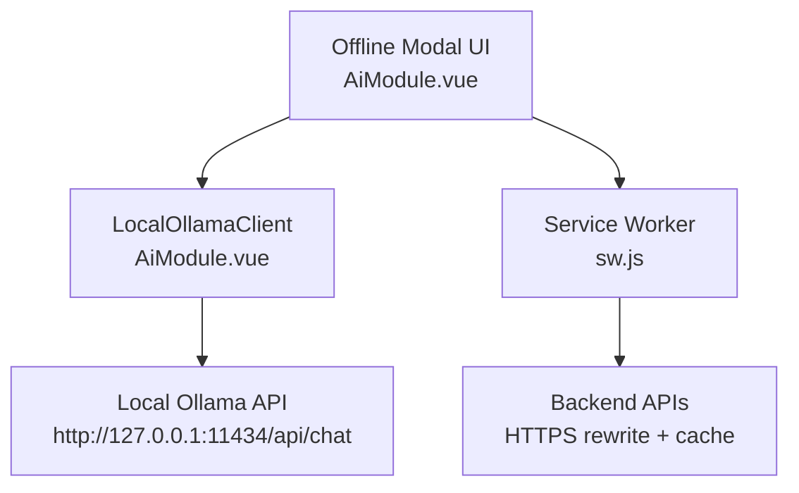
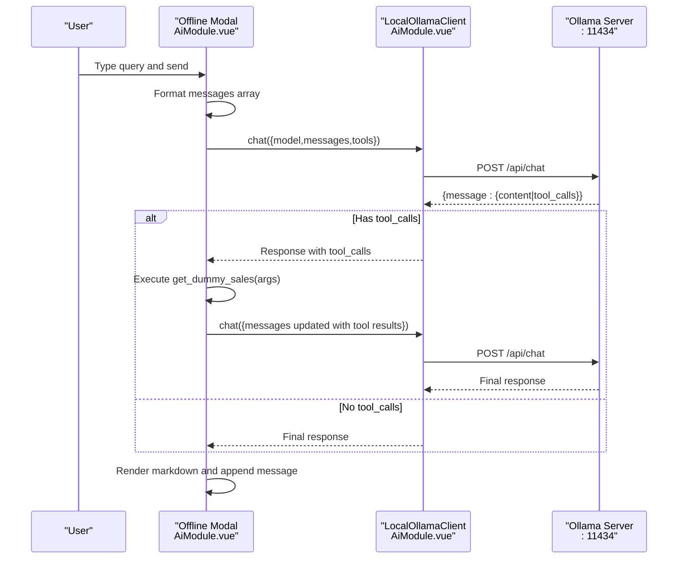
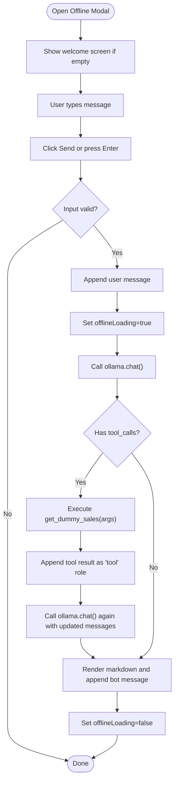
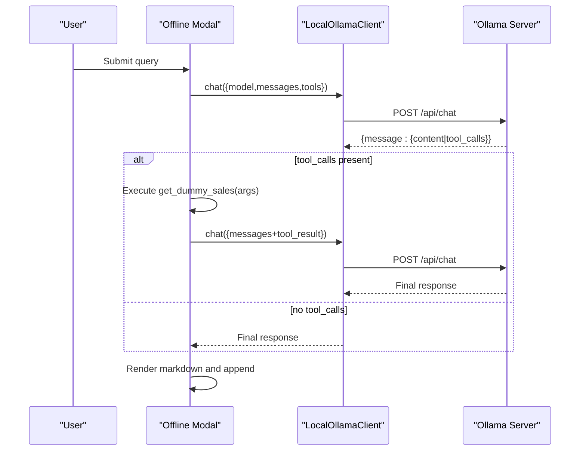
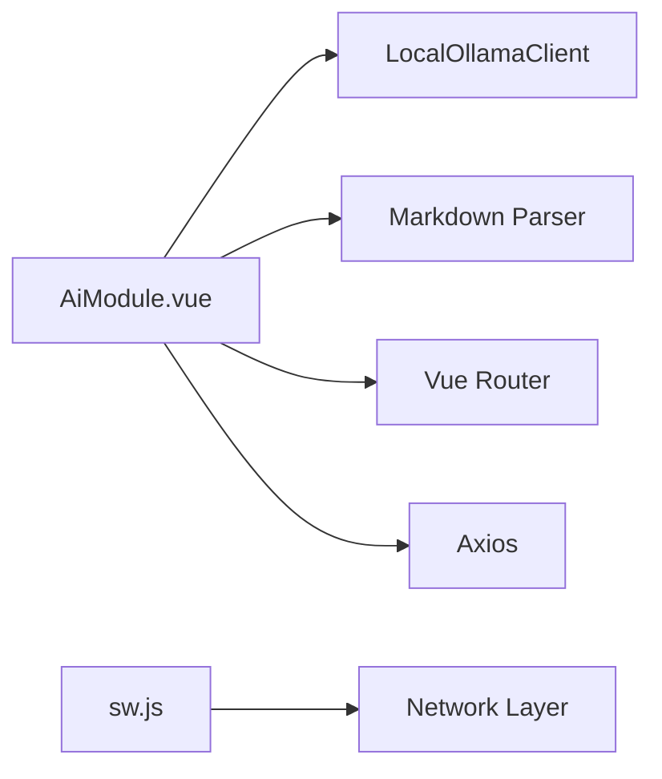

# Offline AI Mode & Local Processing

<cite>
**Referenced Files in This Document**
- [AiModule.vue](file://src/views/Modules/aiagents/AiModule.vue)
- [sw.js](file://src/sw.js)
</cite>

## Table of Contents
1. [Introduction](#introduction)
2. [Project Structure](#project-structure)
3. [Core Components](#core-components)
4. [Architecture Overview](#architecture-overview)
5. [Detailed Component Analysis](#detailed-component-analysis)
6. [Dependency Analysis](#dependency-analysis)
7. [Performance Considerations](#performance-considerations)
8. [Troubleshooting Guide](#troubleshooting-guide)
9. [Conclusion](#conclusion)
10. [Appendices](#appendices)

## Introduction
This document explains the offline AI mode implementation that integrates with a local Ollama instance to provide privacy-preserving, on-device conversational capabilities. It covers the LocalOllamaClient architecture (constructor configuration, base URL setup, and connection management), the chat method behavior (message formatting, tool integration, and streaming support), error handling for CORS and mixed content issues, the offline modal interface (message display, input handling, status indicators), dummy data system (sales data generation and test scenarios), end-to-end local model execution flow, troubleshooting guidance, and privacy considerations.

## Project Structure
The offline AI feature is implemented within the AI Agents module as a Vue component and a custom client class. A service worker provides network-level helpers for secure requests and caching when interacting with backend services. The key files are:
- AiModule.vue: Implements the offline modal UI, LocalOllamaClient, message handling, tool integration, and dummy data utilities.
- sw.js: Service Worker that rewrites HTTP requests to HTTPS and applies caching strategies for backend calls.



**Diagram sources**
- [AiModule.vue:555-603](file://src/views/Modules/aiagents/AiModule.vue#L555-L603)
- [sw.js:36-99](file://src/sw.js#L36-L99)

**Section sources**
- [AiModule.vue:365-473](file://src/views/Modules/aiagents/AiModule.vue#L365-L473)
- [sw.js:36-99](file://src/sw.js#L36-L99)

## Core Components
- LocalOllamaClient: A browser-safe client that POSTs to the local Ollama /api/chat endpoint, handles errors (including mixed content and missing models), and supports a stream flag for future streaming use.
- Offline Modal Interface: A full-screen modal with message list, typing indicator, input field, and privacy notice.
- Tool Integration: Declares a function tool for retrieving dummy sales/inventory data; the client returns tool_calls which the UI executes locally and feeds back into the conversation.
- Dummy Data System: In-memory dataset and filtering logic used by the tool to simulate sales queries.

**Section sources**
- [AiModule.vue:555-603](file://src/views/Modules/aiagents/AiModule.vue#L555-L603)
- [AiModule.vue:768-798](file://src/views/Modules/aiagents/AiModule.vue#L768-L798)
- [AiModule.vue:962-1042](file://src/views/Modules/aiagents/AiModule.vue#L962-L1042)

## Architecture Overview
The offline flow starts from user input in the offline modal, formats messages, calls LocalOllamaClient.chat, processes optional tool_calls by executing get_dummy_sales locally, and renders the final response. Errors are caught and displayed inline.



**Diagram sources**
- [AiModule.vue:962-1042](file://src/views/Modules/aiagents/AiModule.vue#L962-L1042)
- [AiModule.vue:560-603](file://src/views/Modules/aiagents/AiModule.vue#L560-L603)

## Detailed Component Analysis

### LocalOllamaClient Class
- Constructor: Accepts an optional baseUrl defaulting to http://127.0.0.1:11434.
- chat method:
  - Sends a JSON payload with model, messages, tools, and stream flag to /api/chat.
  - On non-OK responses, throws descriptive errors (e.g., 404 for missing model).
  - Detects Mixed Content (HTTPS page calling HTTP localhost) and throws a specific security error with remediation steps.
  - For other failures, throws a general connectivity/setup error with actionable instructions.
- Streaming: The stream parameter is included in the request body but not processed in this version; it can be extended to handle server-sent events or chunked responses.

```mermaid
classDiagram
class LocalOllamaClient {
+string baseUrl
+chat({model, messages, tools, stream}) Promise~object~
}
```

**Diagram sources**
- [AiModule.vue:555-603](file://src/views/Modules/aiagents/AiModule.vue#L555-L603)

**Section sources**
- [AiModule.vue:555-603](file://src/views/Modules/aiagents/AiModule.vue#L555-L603)

### Offline Modal Interface
- Visibility: Toggled via showOfflineModal state; mounted behind a backdrop overlay.
- Message Display:
  - User and bot messages rendered with distinct styling and labels.
  - Markdown rendering for bot responses using a markdown parser.
  - Timestamps shown per message.
- Input Handling:
  - Binds to offlineMessageInput; sends on Enter key or button click.
  - Disables input while offlineLoading is true.
- Status Indicators:
  - Typing indicator shown when offlineLoading is true.
  - Privacy notice displayed below the input area.



**Diagram sources**
- [AiModule.vue:962-1042](file://src/views/Modules/aiagents/AiModule.vue#L962-L1042)
- [AiModule.vue:768-798](file://src/views/Modules/aiagents/AiModule.vue#L768-L798)

**Section sources**
- [AiModule.vue:365-473](file://src/views/Modules/aiagents/AiModule.vue#L365-L473)
- [AiModule.vue:962-1042](file://src/views/Modules/aiagents/AiModule.vue#L962-L1042)

### Chat Method Implementation
- Message Formatting:
  - Maps offlineMessages to roles: user or assistant, using either raw text or rendered HTML depending on context.
- Tool Integration:
  - Declares a function tool get_dummy_sales with parameters for filtering by item name.
  - If the model responds with tool_calls, the UI executes the function locally, then appends a tool role message with the result and calls the model again to produce a final answer.
- Streaming Support:
  - The stream flag is passed to the Ollama API but not consumed in this implementation; it can be extended to handle streaming responses.

**Section sources**
- [AiModule.vue:560-603](file://src/views/Modules/aiagents/AiModule.vue#L560-L603)
- [AiModule.vue:784-798](file://src/views/Modules/aiagents/AiModule.vue#L784-L798)
- [AiModule.vue:985-1019](file://src/views/Modules/aiagents/AiModule.vue#L985-L1019)

### Error Handling System
- Mixed Content:
  - Detects when the page is served over HTTPS but the Ollama client targets HTTP localhost and throws a clear error with steps to enable insecure localhost in the browser.
- Network Connectivity:
  - Throws a comprehensive error instructing users to ensure Ollama is running, the correct model is installed, and environment variables (e.g., OLLAMA_ORIGINS) are set where applicable.
- Model Not Found:
  - Handles 404 responses by instructing how to pull the required model.
- UI-Level Errors:
  - Catches and displays friendly error messages in the chat bubble during offline interactions.

**Section sources**
- [AiModule.vue:575-601](file://src/views/Modules/aiagents/AiModule.vue#L575-L601)
- [AiModule.vue:1031-1041](file://src/views/Modules/aiagents/AiModule.vue#L1031-L1041)

### Dummy Data System
- Sales Data Generation:
  - In-memory array of items with fields like item, sku, price, currency, quantity, date, category.
- Filtering Logic:
  - getDummySales filters by item substring match when provided; otherwise returns all records.
- Test Scenarios:
  - Quick actions in the offline modal prompt example queries such as “Get dummy sales” and “Check inventory”.

**Section sources**
- [AiModule.vue:768-782](file://src/views/Modules/aiagents/AiModule.vue#L768-L782)
- [AiModule.vue:416-423](file://src/views/Modules/aiagents/AiModule.vue#L416-L423)

### Local Model Execution Flow
End-to-end sequence from user input to response:
1. User enters a message in the offline modal.
2. Messages are formatted into role/content pairs.
3. LocalOllamaClient.chat posts to the local Ollama server.
4. If tool_calls are returned, execute get_dummy_sales locally and append tool results.
5. Re-call the model with updated messages to generate a final answer.
6. Render markdown and append the bot message with timestamp.



**Diagram sources**
- [AiModule.vue:962-1042](file://src/views/Modules/aiagents/AiModule.vue#L962-L1042)
- [AiModule.vue:560-603](file://src/views/Modules/aiagents/AiModule.vue#L560-L603)

## Dependency Analysis
- Component Dependencies:
  - AiModule.vue depends on LocalOllamaClient for local AI communication.
  - Uses markdown parsing library to render bot responses.
  - Uses router and axios for online features (not part of offline flow).
- Service Worker:
  - Rewrites backend requests to HTTPS and applies caching strategies; does not intercept local Ollama calls directly but ensures consistent backend behavior.



**Diagram sources**
- [AiModule.vue:534-547](file://src/views/Modules/aiagents/AiModule.vue#L534-L547)
- [sw.js:36-99](file://src/sw.js#L36-L99)

**Section sources**
- [AiModule.vue:534-547](file://src/views/Modules/aiagents/AiModule.vue#L534-L547)
- [sw.js:36-99](file://src/sw.js#L36-L99)

## Performance Considerations
- Request Payload:
  - Keep messages concise to reduce processing time on the local model.
- Tool Usage:
  - Use targeted filters in get_dummy_sales to minimize data volume.
- Rendering:
  - Avoid excessive markdown complexity; prefer simple lists and paragraphs for faster rendering.
- Streaming:
  - When implementing streaming, process chunks incrementally to improve perceived responsiveness.
- Browser Constraints:
  - Ensure Ollama runs on localhost without TLS to avoid Mixed Content; serve the frontend over HTTP for development to prevent browser security blocks.

[No sources needed since this section provides general guidance]

## Troubleshooting Guide
Common issues and resolutions:
- Mixed Content (HTTPS site calling HTTP localhost):
  - Symptom: Security Block error indicating browser blocking due to HTTPS page accessing HTTP localhost.
  - Resolution: Enable insecure localhost in your browser flags or serve the frontend over HTTP during development.
- Ollama Not Running:
  - Symptom: Connection failure or “not responding” error.
  - Resolution: Start Ollama and verify it listens on http://localhost:11434.
- Missing Model:
  - Symptom: 404 error indicating model not found.
  - Resolution: Pull the required model using the command suggested in the error message.
- CORS Restrictions:
  - Symptom: Network/CORS errors when calling Ollama.
  - Resolution: Configure Ollama to allow origins (e.g., set OLLAMA_ORIGINS="*") on Linux/Mac environments.
- Service Worker Interference:
  - Note: The service worker rewrites backend requests to HTTPS; ensure local Ollama endpoints remain unaffected by serving the app appropriately.

**Section sources**
- [AiModule.vue:575-601](file://src/views/Modules/aiagents/AiModule.vue#L575-L601)
- [sw.js:36-99](file://src/sw.js#L36-L99)

## Conclusion
The offline AI mode leverages a lightweight LocalOllamaClient to communicate with a local Ollama instance, enabling fully private conversations without sending data to external servers. The offline modal provides a clear interface for messaging, tool usage, and status feedback. Robust error handling addresses common browser and network issues, while dummy data enables testing and demonstration without external dependencies. Extending streaming support and refining performance will further enhance the user experience.

[No sources needed since this section summarizes without analyzing specific files]

## Appendices

### Privacy Considerations and Data Isolation
- All queries and responses remain within the browser and local Ollama process; no data is transmitted to remote servers during offline mode.
- The offline modal explicitly indicates privacy mode and prevents accidental data leakage.
- Tool functions operate on in-memory data, ensuring no persistence beyond the session unless explicitly implemented.

[No sources needed since this section provides general guidance]