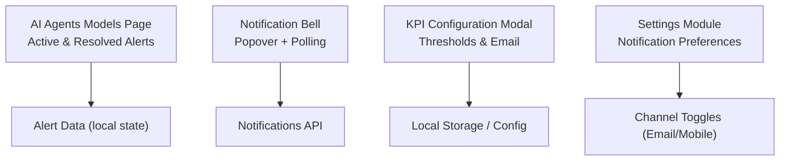
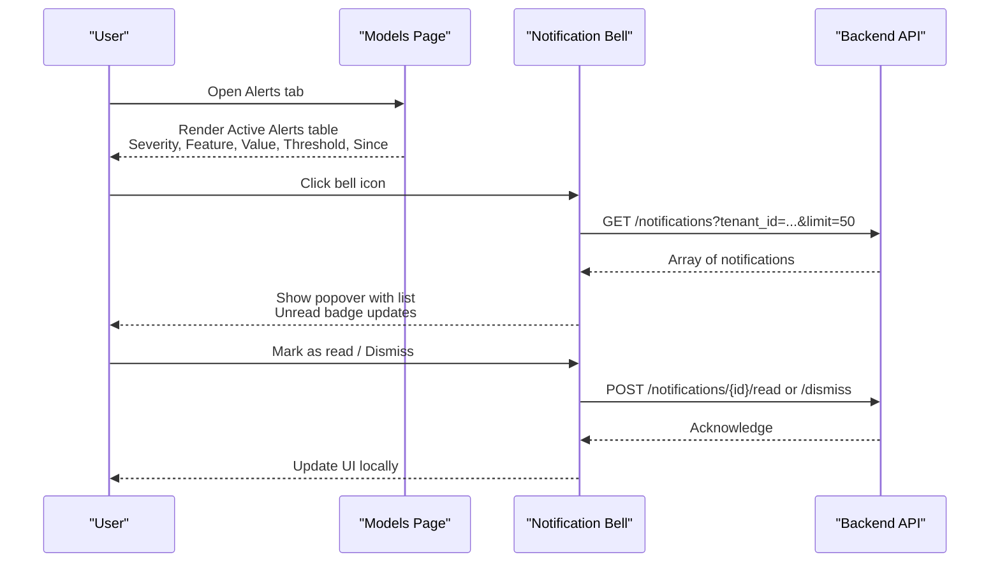
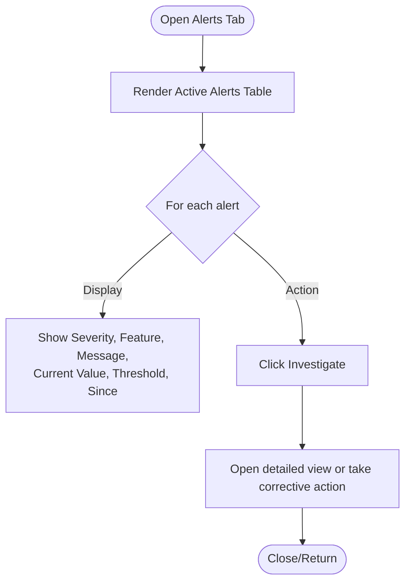
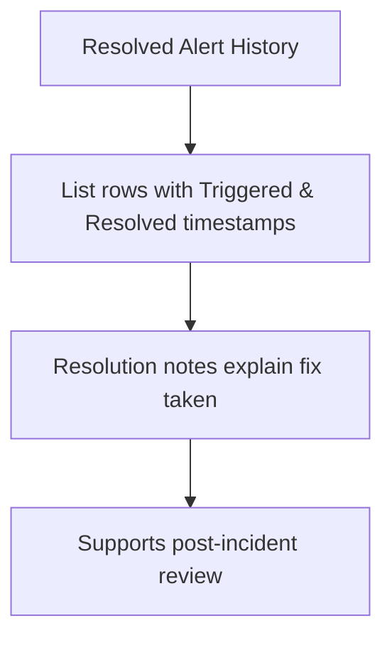
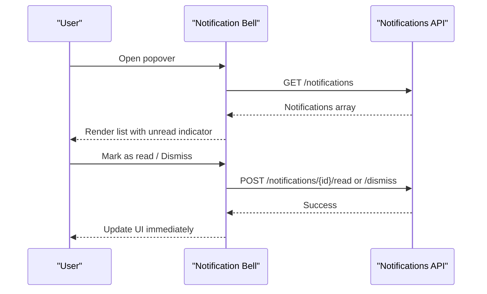
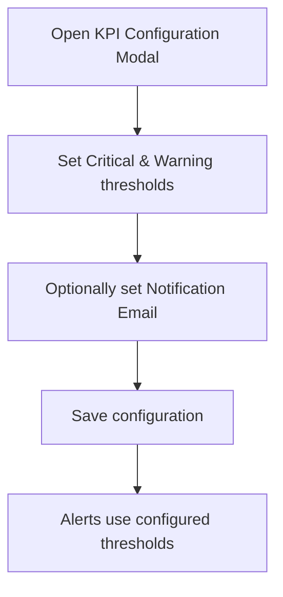
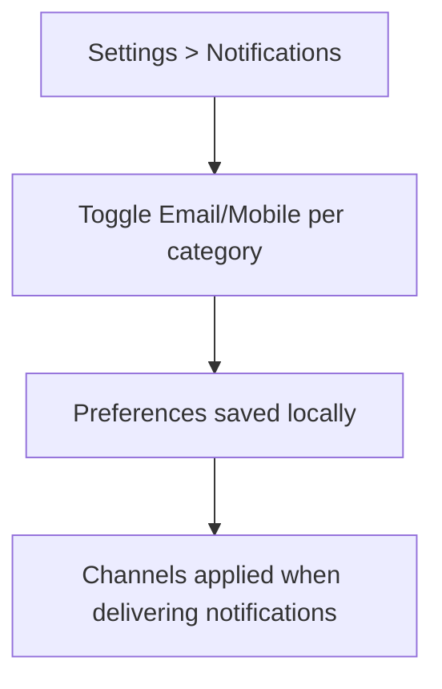
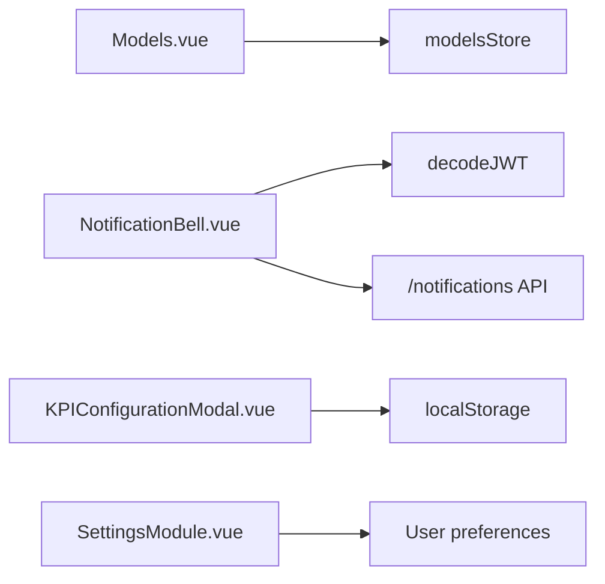

# Alert Management & Notifications

<cite>
**Referenced Files in This Document**
- [Models.vue](file://src/views/Modules/aiagents/Models.vue)
- [NotificationBell.vue](file://src/components/NotificationBell.vue)
- [KPIConfigurationModal.vue](file://src/views/Modules/strategic/modals/KPIConfigurationModal.vue)
- [SettingsModule.vue](file://src/views/Modules/settings/SettingsModule.vue)
</cite>

## Table of Contents
1. Introduction
2. Project Structure
3. Core Components
4. Architecture Overview
5. Detailed Component Analysis
6. Dependency Analysis
7. Performance Considerations
8. Troubleshooting Guide
9. Conclusion

## Introduction
This document explains the model alert management and notification system implemented in the frontend. It covers:
- Active alert display with severity levels, affected features/metrics, current values, thresholds, and duration since activation
- Alert resolution workflow including investigation actions and resolution tracking
- Alert history showing resolved alerts with trigger and resolution timestamps
- Alert configuration including threshold settings, severity classifications, and notification preferences
- Practical examples for responding to different alert types, investigating causes, and resolving model issues using the provided UI

## Project Structure
The alert and notification functionality spans several key areas:
- Model Alerts tab within the AI Agents Models page displays active and resolved alerts
- A global Notification Bell component provides real-time notifications and quick actions
- KPI Configuration modal supports defining alert thresholds and notification email targets
- Settings module exposes notification preferences by channel (email/mobile)

**Diagram sources**
- [Models.vue:544-617](file://src/views/Modules/aiagents/Models.vue#L544-L617)
- [NotificationBell.vue:105-255](file://src/components/NotificationBell.vue#L105-L255)
- [KPIConfigurationModal.vue:197-236](file://src/views/Modules/strategic/modals/KPIConfigurationModal.vue#L197-L236)
- [SettingsModule.vue:206-234](file://src/views/Modules/settings/SettingsModule.vue#L206-L234)

**Section sources**
- [Models.vue:544-617](file://src/views/Modules/aiagents/Models.vue#L544-L617)
- [NotificationBell.vue:105-255](file://src/components/NotificationBell.vue#L105-L255)
- [KPIConfigurationModal.vue:197-236](file://src/views/Modules/strategic/modals/KPIConfigurationModal.vue#L197-L236)
- [SettingsModule.vue:206-234](file://src/views/Modules/settings/SettingsModule.vue#L206-L234)

## Core Components
- Active Alerts Display: Shows severity, feature/metric, message, current value, threshold, and time since activation; includes an Investigate action per alert.
- Resolved Alert History: Lists past alerts with triggered and resolved timestamps and resolution notes.
- Notification Bell: Displays unread count, lists recent notifications, allows marking as read/dismiss, and links to configure alert settings.
- Alert Threshold Configuration: Allows setting critical and warning thresholds and a notification email target per KPI.
- Notification Preferences: Per-category toggles for email and mobile channels.

**Section sources**
- [Models.vue:544-617](file://src/views/Modules/aiagents/Models.vue#L544-L617)
- [NotificationBell.vue:105-255](file://src/components/NotificationBell.vue#L105-L255)
- [KPIConfigurationModal.vue:197-236](file://src/views/Modules/strategic/modals/KPIConfigurationModal.vue#L197-L236)
- [SettingsModule.vue:206-234](file://src/views/Modules/settings/SettingsModule.vue#L206-L234)

## Architecture Overview
The system combines local model alert views with a centralized notification feed:
- The Models page renders active and resolved alerts from local state for the selected model.
- The Notification Bell polls a backend notifications endpoint, shows new items via toast, and supports read/dismiss operations.
- Thresholds and notification emails are configured in the KPI Configuration modal.
- User-level notification preferences are managed in the Settings module.

**Diagram sources**
- [Models.vue:544-617](file://src/views/Modules/aiagents/Models.vue#L544-L617)
- [NotificationBell.vue:121-184](file://src/components/NotificationBell.vue#L121-L184)

## Detailed Component Analysis

### Active Alerts Display (Model Alerts Tab)
- Severity levels: CRITICAL and WARNING are shown with distinct badges.
- Affected features/metrics: Displayed prominently in a monospaced column.
- Current values vs thresholds: Side-by-side columns for easy comparison.
- Duration since activation: “Since” column indicates how long the alert has been active.
- Investigation action: Each row includes an Investigate button to start triage.

**Diagram sources**
- [Models.vue:544-617](file://src/views/Modules/aiagents/Models.vue#L544-L617)

**Section sources**
- [Models.vue:544-617](file://src/views/Modules/aiagents/Models.vue#L544-L617)

### Resolved Alert History
- Columns include feature, alert description, triggered timestamp, resolved timestamp, and resolution note.
- Provides an audit trail for model health and remediation efforts.

**Diagram sources**
- [Models.vue:591-617](file://src/views/Modules/aiagents/Models.vue#L591-L617)

**Section sources**
- [Models.vue:591-617](file://src/views/Modules/aiagents/Models.vue#L591-L617)

### Notification Bell (Global Notifications)
- Unread count badge on the bell icon.
- Popover lists recent notifications with category icons, titles, messages, and relative timestamps.
- Actions: mark as read, dismiss, mark all as read.
- Polling: fetches notifications every 60 seconds and shows a toast for newly arrived unread items.
- Link to configure alert settings is provided in the footer.

**Diagram sources**
- [NotificationBell.vue:105-255](file://src/components/NotificationBell.vue#L105-L255)

**Section sources**
- [NotificationBell.vue:105-255](file://src/components/NotificationBell.vue#L105-L255)

### Alert Threshold Configuration (KPI Configuration Modal)
- Critical and warning thresholds can be set per KPI.
- Notification email field allows specifying where alerts should be sent.
- Targets and stretch goals complement alert thresholds for performance monitoring.

**Diagram sources**
- [KPIConfigurationModal.vue:197-236](file://src/views/Modules/strategic/modals/KPIConfigurationModal.vue#L197-L236)

**Section sources**
- [KPIConfigurationModal.vue:197-236](file://src/views/Modules/strategic/modals/KPIConfigurationModal.vue#L197-L236)

### Notification Preferences (Settings)
- Per-category toggles for Email and Mobile channels.
- Enables fine-grained control over how and where users receive alerts.

**Diagram sources**
- [SettingsModule.vue:206-234](file://src/views/Modules/settings/SettingsModule.vue#L206-L234)

**Section sources**
- [SettingsModule.vue:206-234](file://src/views/Modules/settings/SettingsModule.vue#L206-L234)

## Dependency Analysis
- Models page depends on local state for alert rendering and uses a shared models store for model metadata.
- Notification Bell depends on a backend notifications API and JWT decoding to identify tenant context.
- KPI Configuration modal persists configuration locally and emits events to parent components.
- Settings module manages user preference toggles for notification channels.

**Diagram sources**
- [Models.vue:623-638](file://src/views/Modules/aiagents/Models.vue#L623-L638)
- [NotificationBell.vue:105-115](file://src/components/NotificationBell.vue#L105-L115)
- [KPIConfigurationModal.vue:452-476](file://src/views/Modules/strategic/modals/KPIConfigurationModal.vue#L452-L476)
- [SettingsModule.vue:365-394](file://src/views/Modules/settings/SettingsModule.vue#L365-L394)

**Section sources**
- [Models.vue:623-638](file://src/views/Modules/aiagents/Models.vue#L623-L638)
- [NotificationBell.vue:105-115](file://src/components/NotificationBell.vue#L105-L115)
- [KPIConfigurationModal.vue:452-476](file://src/views/Modules/strategic/modals/KPIConfigurationModal.vue#L452-L476)
- [SettingsModule.vue:365-394](file://src/views/Modules/settings/SettingsModule.vue#L365-L394)

## Performance Considerations
- Notification polling interval is set to 60 seconds to balance freshness and network usage.
- Local state rendering for alerts avoids unnecessary re-fetches on tab switches.
- Popover content is paginated via limit parameter to reduce payload size.

[No sources needed since this section provides general guidance]

## Troubleshooting Guide
- No notifications appear:
  - Ensure tenant ID is available and the notifications API returns data.
  - Check that polling is active and not blocked by network policies.
- New notifications do not trigger toast:
  - Verify that newly arrived unread items are detected by comparing IDs.
- Cannot mark as read or dismiss:
  - Confirm that POST endpoints for read/dismiss are reachable and return success.
- Alert thresholds not effective:
  - Validate that thresholds are saved in the KPI configuration and that the model evaluation logic references them.

**Section sources**
- [NotificationBell.vue:121-184](file://src/components/NotificationBell.vue#L121-L184)
- [KPIConfigurationModal.vue:452-476](file://src/views/Modules/strategic/modals/KPIConfigurationModal.vue#L452-L476)

## Conclusion
The alert management and notification system provides a clear operational view of model health through active alerts and historical resolution records. Users can investigate and act on alerts directly from the Models page, while the Notification Bell offers a centralized, real-time feed with actionable controls. Thresholds and notification preferences are configurable to tailor alerting behavior to organizational needs.

[No sources needed since this section summarizes without analyzing specific files]