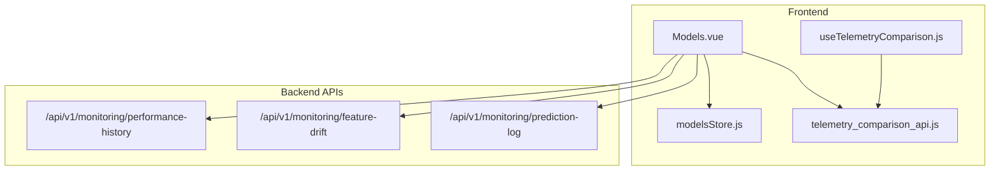
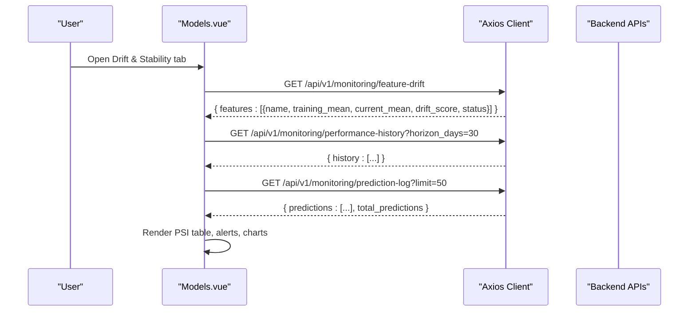
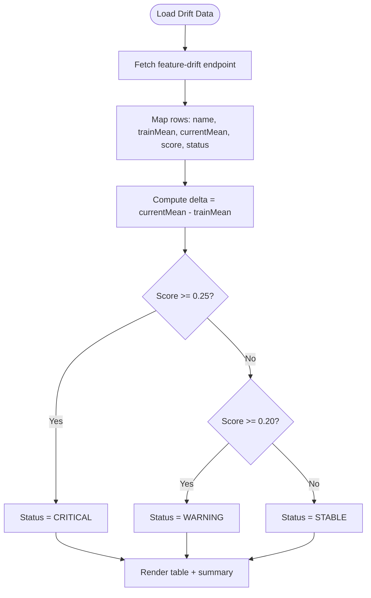
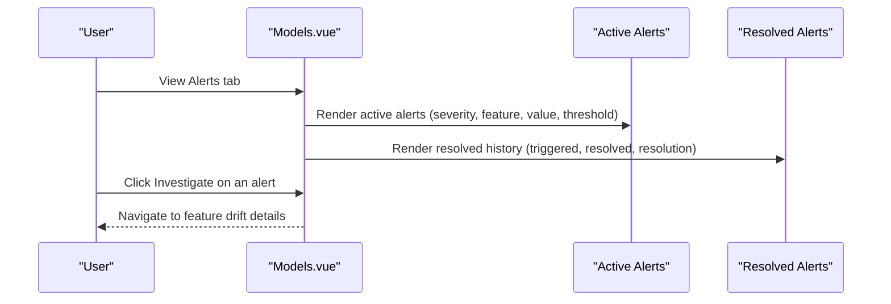
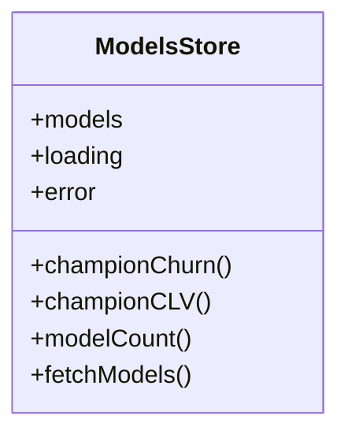
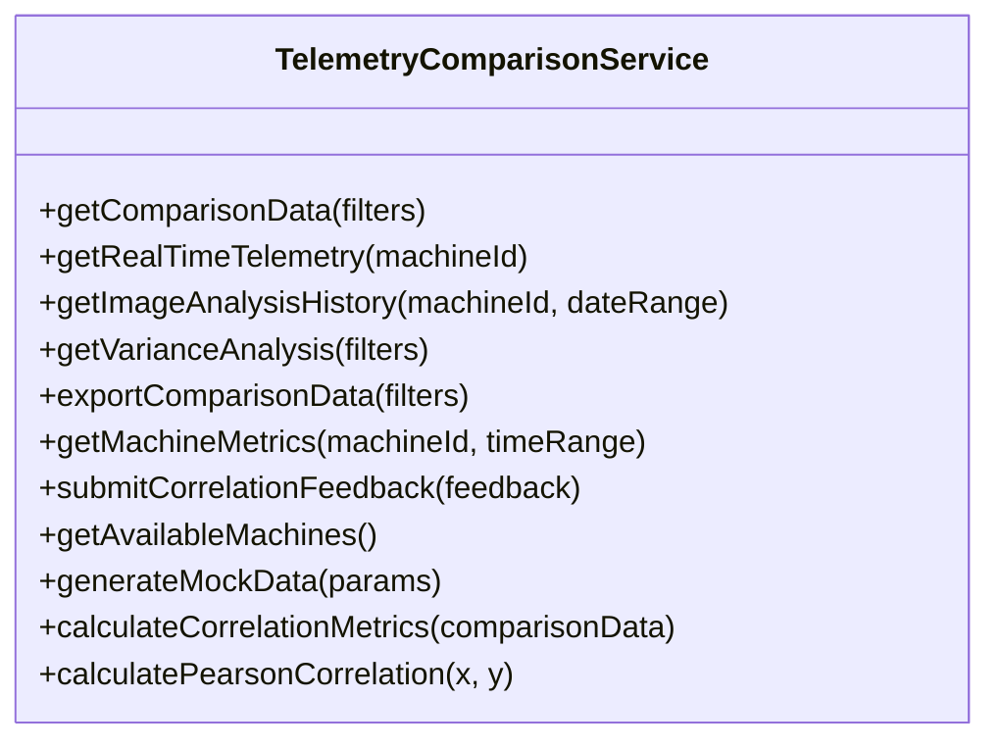
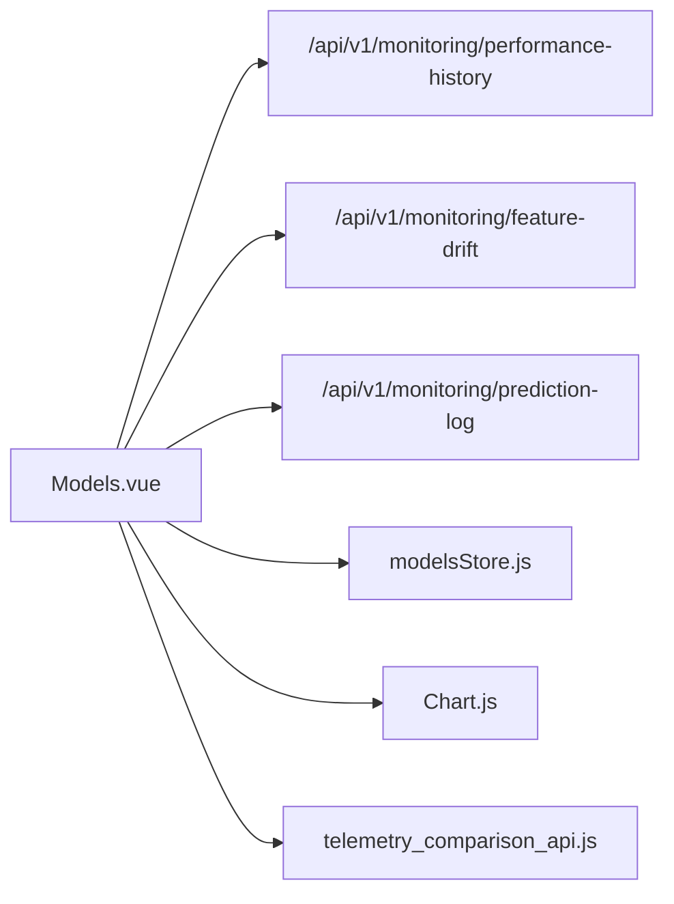

# Drift Detection & Stability Monitoring

<cite>
**Referenced Files in This Document**
- [Models.vue](file://src/views/Modules/aiagents/Models.vue)
- [modelsStore.js](file://src/stores/modelsStore.js)
- [telemetry_comparison_api.js](file://src/services/telemetry_comparison_api.js)
- [useTelemetryComparison.js](file://src/composables/useTelemetryComparison.js)
</cite>

## Table of Contents
1. [Introduction](#introduction)
2. [Project Structure](#project-structure)
3. [Core Components](#core-components)
4. [Architecture Overview](#architecture-overview)
5. [Detailed Component Analysis](#detailed-component-analysis)
6. [Dependency Analysis](#dependency-analysis)
7. [Performance Considerations](#performance-considerations)
8. [Troubleshooting Guide](#troubleshooting-guide)
9. [Conclusion](#conclusion)
10. [Appendices](#appendices)

## Introduction
This document explains the model drift detection and stability monitoring capabilities exposed by the frontend, focusing on Population Stability Index (PSI) calculations and interpretation for detecting feature distribution shifts between training and production data. It covers the drift monitoring dashboard that displays PSI scores, per-feature drift analysis, and stability status indicators. It also details the alerting system for critical and warning-level drift events, threshold configurations, and how automated retraining can be triggered from the UI. Finally, it provides guidance for interpreting drift reports, investigating causes of feature drift, and taking corrective actions.

## Project Structure
The drift and stability features are primarily implemented in the AI Agents Models page, which integrates with backend monitoring endpoints to fetch performance history, feature drift metrics, and prediction logs. A Pinia store manages model metadata and metrics, while a telemetry comparison service provides additional variance and correlation utilities used elsewhere in the application.

**Diagram sources**
- [Models.vue:828-861](file://src/views/Modules/aiagents/Models.vue#L828-L861)
- [modelsStore.js:31-50](file://src/stores/modelsStore.js#L31-L50)
- [telemetry_comparison_api.js:15-30](file://src/services/telemetry_comparison_api.js#L15-L30)

**Section sources**
- [Models.vue:828-861](file://src/views/Modules/aiagents/Models.vue#L828-L861)
- [modelsStore.js:1-54](file://src/stores/modelsStore.js#L1-L54)
- [telemetry_comparison_api.js:1-252](file://src/services/telemetry_comparison_api.js#L1-L252)

## Core Components
- Drift & Stability Dashboard: Displays PSI-based feature drift, thresholds, and status indicators.
- Alerts Panel: Shows active and resolved alerts for drift events with severity levels.
- Model Store: Provides model metadata and metrics used across tabs.
- Telemetry Comparison Service: Offers variance analysis and correlation utilities for broader monitoring use cases.

Key responsibilities:
- Fetch and render PSI scores and feature drift tables.
- Compute derived counts such as drifting features exceeding thresholds.
- Present alerts and allow investigation workflows.
- Provide charts for performance trends and latency summaries.

**Section sources**
- [Models.vue:291-377](file://src/views/Modules/aiagents/Models.vue#L291-L377)
- [Models.vue:541-617](file://src/views/Modules/aiagents/Models.vue#L541-L617)
- [modelsStore.js:15-52](file://src/stores/modelsStore.js#L15-L52)
- [telemetry_comparison_api.js:68-81](file://src/services/telemetry_comparison_api.js#L68-L81)

## Architecture Overview
The frontend requests monitoring data from three backend endpoints and renders them into cohesive views:
- Performance history for trend visualization.
- Feature drift metrics for PSI-based analysis.
- Prediction logs for inference stream insights.

**Diagram sources**
- [Models.vue:828-861](file://src/views/Modules/aiagents/Models.vue#L828-L861)

## Detailed Component Analysis

### Drift & Stability Tab
- PSI Summary Bar: Shows number of monitored features, count of drifting features (PSI > 0.20), and last scan timestamp.
- Feature Drift Table: Lists each feature with training mean, current mean, delta, PSI score, distribution shift direction, and status (STABLE/WARNING/CRITICAL).
- Thresholds: WARNING at 0.20 PSI; CRITICAL at 0.25 PSI.
- Interpretation Guide:
  - PSI < 0.10: No significant change; stable.
  - 0.10 ≤ PSI < 0.25: Moderate shift; investigate.
  - PSI ≥ 0.25: Major shift; immediate review or retraining.

**Diagram sources**
- [Models.vue:755-777](file://src/views/Modules/aiagents/Models.vue#L755-L777)
- [Models.vue:311-377](file://src/views/Modules/aiagents/Models.vue#L311-L377)

**Section sources**
- [Models.vue:291-377](file://src/views/Modules/aiagents/Models.vue#L291-L377)
- [Models.vue:755-777](file://src/views/Modules/aiagents/Models.vue#L755-L777)

### Alerts System
- Active Alerts: Severity (CRITICAL/WARNING), feature/metric, message, current value, threshold, since timestamp, and action button to investigate.
- Resolved Alert History: Tracks when alerts were triggered, resolved, and resolution notes.
- Example behaviors:
  - Tenure months exceeded CRITICAL threshold (PSI ≥ 0.25).
  - Avg monthly balance exceeded WARNING threshold (PSI ≥ 0.10).

**Diagram sources**
- [Models.vue:541-617](file://src/views/Modules/aiagents/Models.vue#L541-L617)
- [Models.vue:662-678](file://src/views/Modules/aiagents/Models.vue#L662-L678)

**Section sources**
- [Models.vue:541-617](file://src/views/Modules/aiagents/Models.vue#L541-L617)
- [Models.vue:662-678](file://src/views/Modules/aiagents/Models.vue#L662-L678)

### Model Store Integration
- The store loads model registry data and exposes computed properties for champion models and metrics.
- Used by the Models page to display model identity, status, and performance metrics.

**Diagram sources**
- [modelsStore.js:15-52](file://src/stores/modelsStore.js#L15-L52)

**Section sources**
- [modelsStore.js:1-54](file://src/stores/modelsStore.js#L1-L54)

### Telemetry Comparison Utilities
- Variance analysis and correlation metrics support broader monitoring scenarios beyond PSI.
- Methods include fetching comparison data, real-time telemetry, image analysis history, and exporting results.

**Diagram sources**
- [telemetry_comparison_api.js:9-250](file://src/services/telemetry_comparison_api.js#L9-L250)

**Section sources**
- [telemetry_comparison_api.js:1-252](file://src/services/telemetry_comparison_api.js#L1-L252)
- [useTelemetryComparison.js:1-259](file://src/composables/useTelemetryComparison.js#L1-L259)

## Dependency Analysis
- Models.vue depends on:
  - Backend monitoring endpoints for performance history, feature drift, and prediction logs.
  - modelsStore for model metadata and metrics.
  - Chart.js for rendering sparklines and main charts.
- TelemetryComparisonService is independent but available for other modules requiring variance/correlation analysis.

**Diagram sources**
- [Models.vue:828-861](file://src/views/Modules/aiagents/Models.vue#L828-L861)
- [modelsStore.js:31-50](file://src/stores/modelsStore.js#L31-L50)
- [telemetry_comparison_api.js:15-30](file://src/services/telemetry_comparison_api.js#L15-L30)

**Section sources**
- [Models.vue:828-861](file://src/views/Modules/aiagents/Models.vue#L828-L861)
- [modelsStore.js:31-50](file://src/stores/modelsStore.js#L31-L50)
- [telemetry_comparison_api.js:15-30](file://src/services/telemetry_comparison_api.js#L15-L30)

## Performance Considerations
- Data fetching uses parallel requests for performance history, feature drift, and prediction logs to minimize load time.
- Charts are initialized after loading completes to avoid layout thrashing.
- Pagination and filtering are supported in telemetry comparison flows to handle large datasets efficiently.

[No sources needed since this section provides general guidance]

## Troubleshooting Guide
Common issues and resolutions:
- Missing drift data: If no feature drift data is returned, the UI shows a placeholder indicating no data available from the backend. Verify the feature-drift endpoint availability and response schema.
- Network errors: Axios interceptors attach authorization tokens; ensure token presence and correct base URL configuration.
- Chart initialization: Charts initialize only after loading completes; if not rendering, check DOM readiness and canvas refs.

Operational tips:
- Use the Alerts tab to identify active drift events and their severity.
- Investigate specific features via the drift table’s distribution shift indicators and PSI scores.
- Export prediction logs for deeper analysis using the export button in the Prediction Logs tab.

**Section sources**
- [Models.vue:336-338](file://src/views/Modules/aiagents/Models.vue#L336-L338)
- [Models.vue:828-861](file://src/views/Modules/aiagents/Models.vue#L828-L861)

## Conclusion
The frontend provides a comprehensive drift detection and stability monitoring experience centered around PSI-based feature drift analysis. Users can monitor PSI scores, interpret drift severity through thresholds, and act on alerts to maintain model reliability. While PSI computation occurs on the backend, the UI effectively visualizes results, supports investigation workflows, and enables retraining triggers through the interface.

[No sources needed since this section summarizes without analyzing specific files]

## Appendices

### Interpreting Drift Reports
- PSI < 0.10: Stable; no action required.
- 0.10 ≤ PSI < 0.25: Moderate drift; investigate data pipeline changes or upstream sources.
- PSI ≥ 0.25: Major drift; consider retraining or model review immediately.

Investigation steps:
- Identify features with highest PSI scores and check recent data changes.
- Review distribution shift direction (left/right) to understand whether values increased or decreased.
- Correlate with business events (e.g., quarter-end effects, campaign launches).

Corrective actions:
- For WARNING: Monitor closely and validate data quality.
- For CRITICAL: Initiate retraining workflow via the “Request Retrain” action and review model performance post-deployment.

**Section sources**
- [Models.vue:368-377](file://src/views/Modules/aiagents/Models.vue#L368-L377)
- [Models.vue:39-45](file://src/views/Modules/aiagents/Models.vue#L39-L45)

### Automated Retraining Triggers
- The UI includes a “Request Retrain” button to initiate retraining workflows.
- Thresholds drive alerting and can inform automated triggers configured on the backend.

**Section sources**
- [Models.vue:39-45](file://src/views/Modules/aiagents/Models.vue#L39-L45)