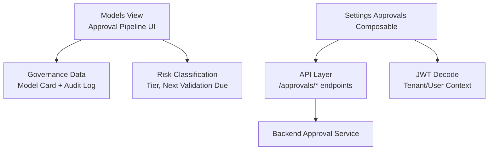
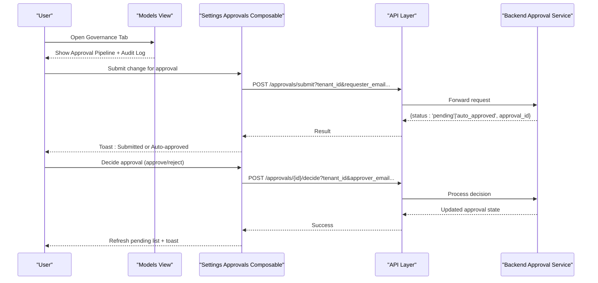
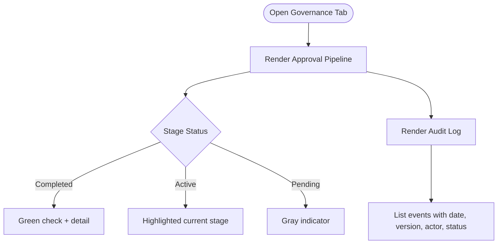
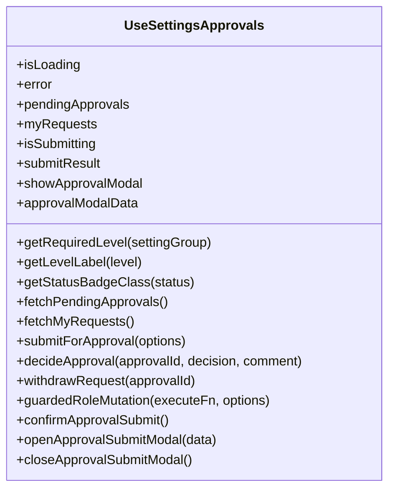
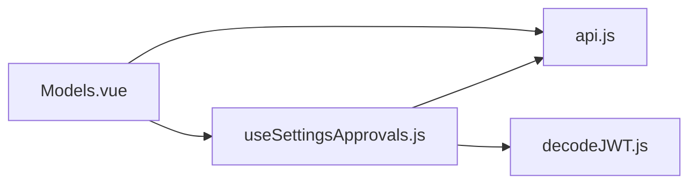

# Approval Lifecycle Management

<cite>
**Referenced Files in This Document**
- [Models.vue](file://src/views/Modules/aiagents/Models.vue)
- [useSettingsApprovals.js](file://src/composables/settings/useSettingsApprovals.js)
- [api.js](file://src/services/api.js)
- [decodeJWT.js](file://src/services/decodeJWT.js)
- [README.md](file://README.md)
</cite>

## Table of Contents
1. Introduction
2. Project Structure
3. Core Components
4. Architecture Overview
5. Detailed Component Analysis
6. Dependency Analysis
7. Performance Considerations
8. Troubleshooting Guide
9. Conclusion
10. Appendices

## Introduction
This document explains the multi-stage model approval lifecycle management system implemented in the frontend. It covers the four stages—Conceptual Approval, Development, Independent Validation (MRM review), and Production Deployment—along with workflow transitions, required approvals, validation criteria, and the visual representation of approval status through the approval pipeline interface. It also provides practical examples for navigating the workflow, escalating issues when stuck, and maintaining regulatory compliance throughout the lifecycle.

## Project Structure
The approval lifecycle is primarily surfaced in the AI Agents Models view and supported by a reusable approval composable that manages multi-level approvals for sensitive settings changes. The key files are:
- Models view: displays the approval pipeline, governance data, audit log, and risk classification for models.
- Settings approvals composable: implements submit, decide, withdraw, and guard flows for role/permission changes.
- Services: API base URL and JWT decoding utilities used by the composable.

**Diagram sources**
- [Models.vue:382-469](file://src/views/Modules/aiagents/Models.vue#L382-L469)
- [useSettingsApprovals.js:96-140](file://src/composables/settings/useSettingsApprovals.js#L96-L140)
- [useSettingsApprovals.js:146-210](file://src/composables/settings/useSettingsApprovals.js#L146-L210)
- [useSettingsApprovals.js:215-257](file://src/composables/settings/useSettingsApprovals.js#L215-L257)
- [decodeJWT.js](file://src/services/decodeJWT.js)
- [api.js](file://src/services/api.js)

**Section sources**
- [Models.vue:382-469](file://src/views/Modules/aiagents/Models.vue#L382-L469)
- [useSettingsApprovals.js:96-140](file://src/composables/settings/useSettingsApprovals.js#L96-L140)
- [useSettingsApprovals.js:146-210](file://src/composables/settings/useSettingsApprovals.js#L146-L210)
- [useSettingsApprovals.js:215-257](file://src/composables/settings/useSettingsApprovals.js#L215-L257)
- [README.md:7-28](file://README.md#L7-L28)

## Core Components
- Approval Pipeline UI: Visualizes completed, active, and pending stages with clear indicators and details per stage.
- Governance Panel: Displays model card fields, risk classification, and an immutable audit log of events across the lifecycle.
- Multi-Level Approval Composable: Handles submission, decisioning, withdrawal, and guarding of sensitive changes with level-based requirements.

Key responsibilities:
- Present stage status and transitions visually.
- Provide auditability via logs and timestamps.
- Enforce approval levels and capture approver identity and comments.

**Section sources**
- [Models.vue:401-469](file://src/views/Modules/aiagents/Models.vue#L401-L469)
- [useSettingsApprovals.js:44-92](file://src/composables/settings/useSettingsApprovals.js#L44-L92)
- [useSettingsApprovals.js:337-415](file://src/composables/settings/useSettingsApprovals.js#L337-L415)

## Architecture Overview
The approval lifecycle spans UI presentation, stateful composable logic, and backend services. The Models view renders the approval pipeline and governance artifacts. The settings approvals composable orchestrates request submission, decision workflows, and user context extraction.

**Diagram sources**
- [useSettingsApprovals.js:146-210](file://src/composables/settings/useSettingsApprovals.js#L146-L210)
- [useSettingsApprovals.js:215-257](file://src/composables/settings/useSettingsApprovals.js#L215-L257)
- [Models.vue:382-469](file://src/views/Modules/aiagents/Models.vue#L382-L469)

## Detailed Component Analysis

### Approval Pipeline Interface (Models View)
- Visual stages: Completed (green check), Active (current stage highlighted), Pending (gray).
- Stage details include dates and actors where applicable.
- Governance panel includes model card fields compliant with SR 11-7 / SARB MRM Framework documentation.
- Audit log shows immutable history of events such as Conceptual Approval, MRM Validation Completed, Retrain, and Production Deployment.

**Diagram sources**
- [Models.vue:401-424](file://src/views/Modules/aiagents/Models.vue#L401-L424)
- [Models.vue:439-469](file://src/views/Modules/aiagents/Models.vue#L439-L469)

**Section sources**
- [Models.vue:401-469](file://src/views/Modules/aiagents/Models.vue#L401-L469)

### Multi-Level Approval Composable
- Level mapping: Auto-approved (Level 0), Manager (Level 1), Director (Level 2), Executive (Level 3).
- Guarded mutations: For roles/permissions, if Level > 0, opens modal to confirm submission; if Level = 0, executes immediately.
- Submission flow: Captures tenant, requester identity, proposed/current values, justification, metadata; posts to backend.
- Decision flow: Approver submits approve/reject with comment; refreshes pending list on success.
- Withdrawal: Requester can withdraw pending requests.

**Diagram sources**
- [useSettingsApprovals.js:19-92](file://src/composables/settings/useSettingsApprovals.js#L19-L92)
- [useSettingsApprovals.js:96-140](file://src/composables/settings/useSettingsApprovals.js#L96-L140)
- [useSettingsApprovals.js:146-210](file://src/composables/settings/useSettingsApprovals.js#L146-L210)
- [useSettingsApprovals.js:215-257](file://src/composables/settings/useSettingsApprovals.js#L215-L257)
- [useSettingsApprovals.js:262-297](file://src/composables/settings/useSettingsApprovals.js#L262-L297)
- [useSettingsApprovals.js:337-415](file://src/composables/settings/useSettingsApprovals.js#L337-L415)

**Section sources**
- [useSettingsApprovals.js:44-92](file://src/composables/settings/useSettingsApprovals.js#L44-L92)
- [useSettingsApprovals.js:146-210](file://src/composables/settings/useSettingsApprovals.js#L146-L210)
- [useSettingsApprovals.js:215-257](file://src/composables/settings/useSettingsApprovals.js#L215-L257)
- [useSettingsApprovals.js:337-415](file://src/composables/settings/useSettingsApprovals.js#L337-L415)

### Workflow Transitions and Required Approvals
- Conceptual Approval: Business and architecture sign-off recorded in audit log; shown as completed in pipeline.
- Development: Model built and unit-tested; recorded in audit log; shown as completed.
- Independent Validation: MRM review completed; recorded in audit log; shown as completed.
- Production: Deployed to production endpoint; shown as active in pipeline; subsequent re-deployments update audit log.

Transition rules:
- Each stage must be approved before moving to the next.
- Audit log entries provide immutable evidence of approvals and actions.
- Risk classification indicates tier and next validation due date to ensure ongoing compliance.

**Section sources**
- [Models.vue:797-810](file://src/views/Modules/aiagents/Models.vue#L797-L810)
- [Models.vue:426-437](file://src/views/Modules/aiagents/Models.vue#L426-L437)

### Validation Criteria and Compliance
- Governance panel references SR 11-7 / SARB MRM Framework compliance documentation.
- Risk classification includes Model Risk Tier, Next Validation Due, Annual Review status, and Materiality.
- Audit log captures versions, metrics (e.g., AUC-ROC), actors, and statuses for traceability.

**Section sources**
- [Models.vue:382-399](file://src/views/Modules/aiagents/Models.vue#L382-L399)
- [Models.vue:426-437](file://src/views/Modules/aiagents/Models.vue#L426-L437)
- [Models.vue:439-469](file://src/views/Modules/aiagents/Models.vue#L439-L469)

## Dependency Analysis
The approval system depends on:
- Models view for UI rendering of pipeline and governance artifacts.
- Settings approvals composable for workflow orchestration and API interactions.
- API service layer for base URL configuration.
- JWT decode utility for tenant and user context.

**Diagram sources**
- [Models.vue:623-636](file://src/views/Modules/aiagents/Models.vue#L623-L636)
- [useSettingsApprovals.js:1-5](file://src/composables/settings/useSettingsApprovals.js#L1-L5)
- [api.js](file://src/services/api.js)
- [decodeJWT.js](file://src/services/decodeJWT.js)

**Section sources**
- [Models.vue:623-636](file://src/views/Modules/aiagents/Models.vue#L623-L636)
- [useSettingsApprovals.js:1-5](file://src/composables/settings/useSettingsApprovals.js#L1-L5)

## Performance Considerations
- Batch fetching: The Models view fetches performance history, feature drift, and prediction logs concurrently to reduce load time.
- Minimal re-renders: Approval pipeline and audit log are static arrays in the view, minimizing reactive overhead.
- Efficient decisions: The composable refreshes only necessary lists after decisions to avoid full page reloads.

[No sources needed since this section provides general guidance]

## Troubleshooting Guide
Common issues and resolutions:
- Authentication errors: Ensure token exists and tenant/user info is available from JWT decode. Errors will surface in the composable’s error state.
- Network failures: Check API connectivity and headers; the composable sets isLoading and error states accordingly.
- Stuck approvals: Verify pending approvals list and use the decide endpoint to resolve; if rejected, address comments and resubmit.
- Escalation path: If a request remains pending beyond SLA, escalate to higher-level approvers based on required level mapping.

Operational tips:
- Use the audit log to trace who acted and when.
- Export MRM reports from the Models view for offline review and compliance audits.
- Monitor risk classification and next validation due dates to maintain ongoing compliance.

**Section sources**
- [useSettingsApprovals.js:215-257](file://src/composables/settings/useSettingsApprovals.js#L215-L257)
- [Models.vue:38-45](file://src/views/Modules/aiagents/Models.vue#L38-L45)
- [Models.vue:439-469](file://src/views/Modules/aiagents/Models.vue#L439-L469)

## Conclusion
The approval lifecycle management system provides a clear, auditable, and compliant pathway for model development and deployment. The approval pipeline interface offers immediate visibility into completed, active, and pending stages, while the multi-level approval composable enforces governance policies and captures detailed audit trails. Together, these components support robust regulatory adherence and operational transparency.

[No sources needed since this section summarizes without analyzing specific files]

## Appendices

### Practical Examples
- Navigating the approval workflow:
  - Open the Governance tab to view the approval pipeline and audit log.
  - Confirm stage statuses and details to understand progress.
- Escalating issues when stuck:
  - Check pending approvals via the composable’s pending list.
  - Use the decide endpoint to approve/reject with comments; if rejected, revise and resubmit.
  - Escalate to higher-level approvers based on required level mapping.
- Maintaining compliance:
  - Review risk classification and next validation due dates regularly.
  - Export MRM reports for audits and keep audit logs intact for traceability.

[No sources needed since this section provides general guidance]