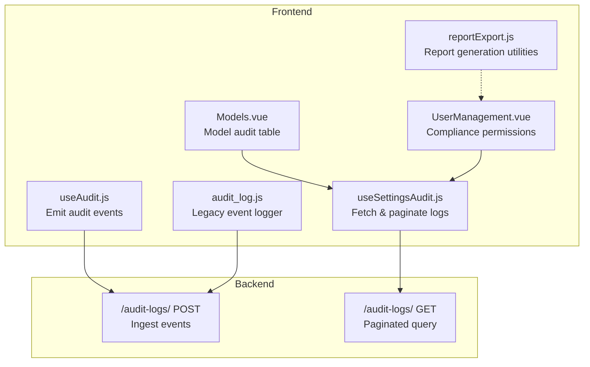
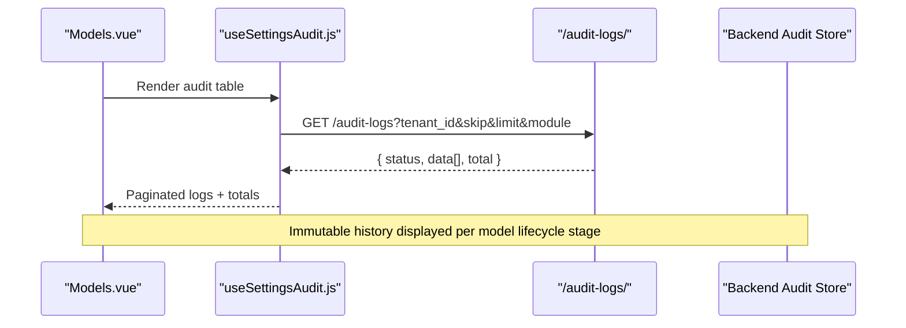
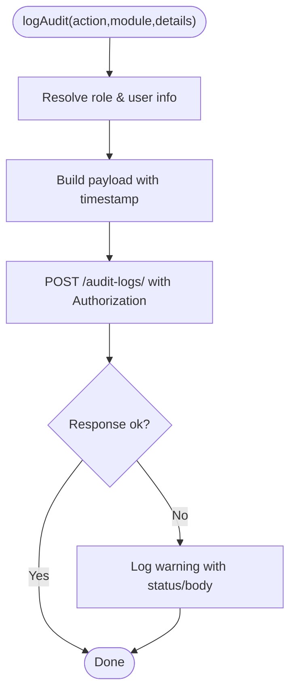
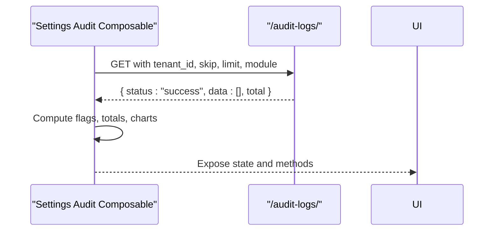
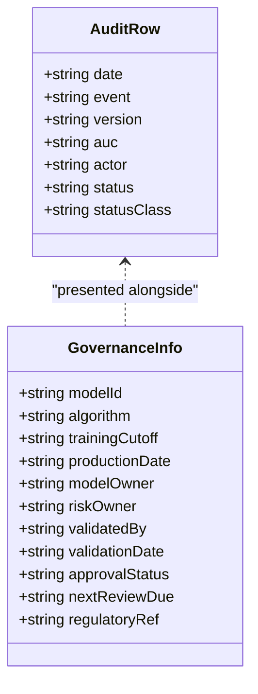
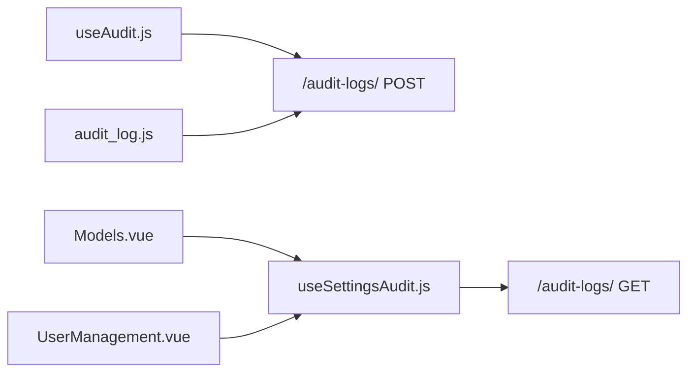

# Audit Trail & Change Logging

<cite>
**Referenced Files in This Document**
- [useAudit.js](file://src/config/useAudit.js)
- [audit_log.js](file://src/services/audit_log.js)
- [useSettingsAudit.js](file://src/composables/settings/useSettingsAudit.js)
- [Models.vue](file://src/views/Modules/aiagents/Models.vue)
- [UserManagement.vue](file://src/views/Modules/settings/UserManagement.vue)
- [reportExport.js](file://src/utils/reportExport.js)
</cite>

## Table of Contents
1. [Introduction](#introduction)
2. [Project Structure](#project-structure)
3. [Core Components](#core-components)
4. [Architecture Overview](#architecture-overview)
5. [Detailed Component Analysis](#detailed-component-analysis)
6. [Dependency Analysis](#dependency-analysis)
7. [Performance Considerations](#performance-considerations)
8. [Troubleshooting Guide](#troubleshooting-guide)
9. [Conclusion](#conclusion)
10. [Appendices](#appendices)

## Introduction
This document describes the immutable audit trail and change logging system that tracks model lifecycle events, changes, approvals, and monitoring activities. It explains how the frontend captures, stores, and presents audit records across the model development pipeline—from conceptual approval through independent validation to production deployment and ongoing monitoring. It also covers compliance reporting capabilities, data retention considerations, and access controls for audit logs.

## Project Structure
The audit trail spans several layers:
- Event capture: composables and services emit audit events with user context and timestamps.
- Storage and retrieval: backend endpoints receive and serve audit logs with pagination and filtering.
- UI presentation: views render immutable audit histories for models and general system activity.
- Compliance and export: permissions and utilities support exporting audit data for regulatory review.

**Diagram sources**
- [useAudit.js:19-75](file://src/config/useAudit.js#L19-L75)
- [audit_log.js:4-20](file://src/services/audit_log.js#L4-L20)
- [useSettingsAudit.js:66-84](file://src/composables/settings/useSettingsAudit.js#L66-L84)
- [Models.vue:439-461](file://src/views/Modules/aiagents/Models.vue#L439-L461)
- [UserManagement.vue:610-614](file://src/views/Modules/settings/UserManagement.vue#L610-L614)

**Section sources**
- [useAudit.js:19-75](file://src/config/useAudit.js#L19-L75)
- [audit_log.js:4-20](file://src/services/audit_log.js#L4-L20)
- [useSettingsAudit.js:66-84](file://src/composables/settings/useSettingsAudit.js#L66-L84)
- [Models.vue:439-461](file://src/views/Modules/aiagents/Models.vue#L439-L461)
- [UserManagement.vue:610-614](file://src/views/Modules/settings/UserManagement.vue#L610-L614)

## Core Components
- Event emission:
  - useAudit composable: centralizes capturing user actions with email, name, role, action type, module, details, and timestamp; posts to /audit-logs/.
  - Legacy logger: a simpler service posting to /api/audit-log with action, details, timestamp, and user.
- Event ingestion and retrieval:
  - Backend endpoint /audit-logs/: accepts POST for new entries and GET for paginated queries with tenant_id, skip, limit, and optional module filter.
- UI consumption:
  - Settings audit composable: fetches logs, computes totals, flags sensitive modules, and supports pagination.
  - Models view: renders an immutable “Model Change & Validation Log” table with Date, Event, Version, AUC-ROC, Actioned By, and Status columns.
- Access control:
  - User management defines compliance permissions including viewing and exporting audit logs.

**Section sources**
- [useAudit.js:19-75](file://src/config/useAudit.js#L19-L75)
- [audit_log.js:4-20](file://src/services/audit_log.js#L4-L20)
- [useSettingsAudit.js:66-84](file://src/composables/settings/useSettingsAudit.js#L66-L84)
- [Models.vue:439-461](file://src/views/Modules/aiagents/Models.vue#L439-L461)
- [UserManagement.vue:610-614](file://src/views/Modules/settings/UserManagement.vue#L610-L614)

## Architecture Overview
The audit system follows a simple, resilient pattern:
- Frontend emits events asynchronously without blocking user workflows.
- Backend persists immutable records and serves them via a paginated API.
- UI components present structured audit trails for both general system activity and model-specific lifecycles.

**Diagram sources**
- [useSettingsAudit.js:66-84](file://src/composables/settings/useSettingsAudit.js#L66-L84)
- [Models.vue:439-461](file://src/views/Modules/aiagents/Models.vue#L439-L461)

## Detailed Component Analysis

### Event Capture: useAudit composable
- Purpose: Provide a reusable hook to log any user action with rich context (user identity, role, module, details).
- Key behaviors:
  - Resolves active operator role from multiple sources.
  - Posts to /audit-logs/ with Authorization header using JWT token.
  - Non-blocking: failures are logged but do not break calling features.
- Data captured:
  - user_email, user_name, role, action, module, details, timestamp.

**Diagram sources**
- [useAudit.js:19-75](file://src/config/useAudit.js#L19-L75)

**Section sources**
- [useAudit.js:19-75](file://src/config/useAudit.js#L19-L75)

### Legacy Logger: audit_log.js
- Purpose: Simple utility to post audit events to /api/audit-log.
- Captures: action, details, timestamp, user (from localStorage or store).
- Error handling: catches and logs errors without raising exceptions.

**Section sources**
- [audit_log.js:4-20](file://src/services/audit_log.js#L4-L20)

### Retrieval and Presentation: useSettingsAudit.js
- Fetches logs with pagination and filters by tenant and module.
- Computes aggregates:
  - Total pages based on limit.
  - Flags for sensitive modules when delete/update thresholds are exceeded.
  - Action totals and chart-ready counts by module.
- Provides navigation helpers for previous/next pages.

**Diagram sources**
- [useSettingsAudit.js:66-84](file://src/composables/settings/useSettingsAudit.js#L66-L84)

**Section sources**
- [useSettingsAudit.js:66-84](file://src/composables/settings/useSettingsAudit.js#L66-L84)

### Model Lifecycle Audit: Models.vue
- Renders an immutable “Model Change & Validation Log” table with columns:
  - Date
  - Event
  - Version
  - AUC-ROC
  - Actioned By
  - Status
- Includes governance metadata such as model ID, algorithm, training cutoff, production date, owners, validation dates, and regulatory references.
- Shows approval steps from Conceptual Approval through Development, Independent Validation, and Production.

**Diagram sources**
- [Models.vue:439-461](file://src/views/Modules/aiagents/Models.vue#L439-L461)
- [Models.vue:779-810](file://src/views/Modules/aiagents/Models.vue#L779-L810)

**Section sources**
- [Models.vue:439-461](file://src/views/Modules/aiagents/Models.vue#L439-L461)
- [Models.vue:779-810](file://src/views/Modules/aiagents/Models.vue#L779-L810)

### Access Controls and Export Permissions: UserManagement.vue
- Defines compliance-related permissions:
  - View Audit Logs
  - Export Audit Data
  - Manage Policies
- These permissions gate access to audit features and export functionality.

**Section sources**
- [UserManagement.vue:610-614](file://src/views/Modules/settings/UserManagement.vue#L610-L614)

## Dependency Analysis
- Event emission depends on:
  - JWT decoding for user identity and tokens.
  - API base URL configuration.
- Retrieval depends on:
  - Tenant identification and authorization headers.
  - Pagination parameters and optional module filtering.
- UI depends on:
  - Computed aggregations for flags and charts.
  - Permission checks for compliance actions.

**Diagram sources**
- [useAudit.js:19-75](file://src/config/useAudit.js#L19-L75)
- [audit_log.js:4-20](file://src/services/audit_log.js#L4-L20)
- [useSettingsAudit.js:66-84](file://src/composables/settings/useSettingsAudit.js#L66-L84)
- [Models.vue:439-461](file://src/views/Modules/aiagents/Models.vue#L439-L461)
- [UserManagement.vue:610-614](file://src/views/Modules/settings/UserManagement.vue#L610-L614)

**Section sources**
- [useAudit.js:19-75](file://src/config/useAudit.js#L19-L75)
- [audit_log.js:4-20](file://src/services/audit_log.js#L4-L20)
- [useSettingsAudit.js:66-84](file://src/composables/settings/useSettingsAudit.js#L66-L84)
- [Models.vue:439-461](file://src/views/Modules/aiagents/Models.vue#L439-L461)
- [UserManagement.vue:610-614](file://src/views/Modules/settings/UserManagement.vue#L610-L614)

## Performance Considerations
- Asynchronous, non-blocking logging ensures UI responsiveness even if audit endpoints fail.
- Paginated retrieval reduces payload size and improves rendering performance for large audit histories.
- Client-side aggregation (flags, totals, charts) is computed only on fetched datasets to minimize overhead.

[No sources needed since this section provides general guidance]

## Troubleshooting Guide
- If audit events are not appearing:
  - Verify Authorization header presence and valid token when posting to /audit-logs/.
  - Check network responses for non-ok statuses and console warnings.
- If audit logs cannot be loaded:
  - Ensure tenant_id is included in GET requests.
  - Confirm skip/limit values are correct and within bounds.
  - Validate module filter usage when narrowing results.
- For permission issues:
  - Confirm compliance permissions (View Audit Logs, Export Audit Data) are granted to the current user role.

**Section sources**
- [useAudit.js:55-71](file://src/config/useAudit.js#L55-L71)
- [useSettingsAudit.js:66-84](file://src/composables/settings/useSettingsAudit.js#L66-L84)
- [UserManagement.vue:610-614](file://src/views/Modules/settings/UserManagement.vue#L610-L614)

## Conclusion
The audit trail system provides a robust, immutable record of model lifecycle events and system actions. It captures essential fields (Date, Event, Version, AUC-ROC, Actioned By, Status), supports pagination and filtering, and integrates with compliance permissions for secure access and export. The design emphasizes resilience and usability, ensuring audit logging does not disrupt core workflows while maintaining comprehensive traceability for regulatory audits and troubleshooting.

[No sources needed since this section summarizes without analyzing specific files]

## Appendices

### Audit Log Schema and Examples
- Event capture schema includes:
  - user_email, user_name, role, action, module, details, timestamp.
- Model audit table columns:
  - Date, Event, Version, AUC-ROC, Actioned By, Status.

Examples of events captured:
- Conceptual Approval
- Initial Development
- Retraining — Feature fix
- MRM Validation Completed
- Production Deployment

These examples illustrate the full lifecycle from conceptual approval through production deployment and ongoing monitoring.

**Section sources**
- [useAudit.js:39-53](file://src/config/useAudit.js#L39-L53)
- [Models.vue:797-810](file://src/views/Modules/aiagents/Models.vue#L797-L810)

### Generating Compliance Reports
- Export permissions:
  - Users with “Export Audit Data” can download audit logs for review.
- Report generation utilities:
  - Utilities exist for generating Word and Excel reports; these can be adapted to export audit data when integrated with the audit retrieval layer.

**Section sources**
- [UserManagement.vue:610-614](file://src/views/Modules/settings/UserManagement.vue#L610-L614)
- [reportExport.js:24-88](file://src/utils/reportExport.js#L24-L88)
- [reportExport.js:390-417](file://src/utils/reportExport.js#L390-L417)

### Data Retention and Access Controls
- Data retention policies:
  - Not explicitly defined in the frontend code; ensure backend enforces retention and archival rules for audit logs.
- Access controls:
  - Authorization via bearer tokens for both posting and retrieving audit logs.
  - Tenant scoping via tenant_id parameter for multi-tenant isolation.
  - Role-based permissions for viewing and exporting audit data.

**Section sources**
- [useAudit.js:55-62](file://src/config/useAudit.js#L55-L62)
- [useSettingsAudit.js:66-75](file://src/composables/settings/useSettingsAudit.js#L66-L75)
- [UserManagement.vue:610-614](file://src/views/Modules/settings/UserManagement.vue#L610-L614)