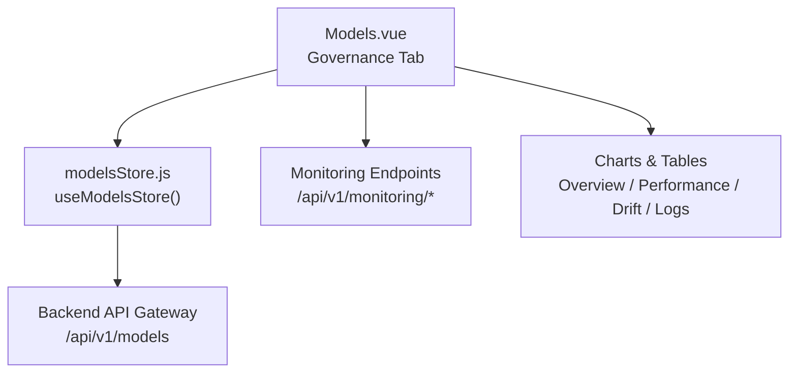
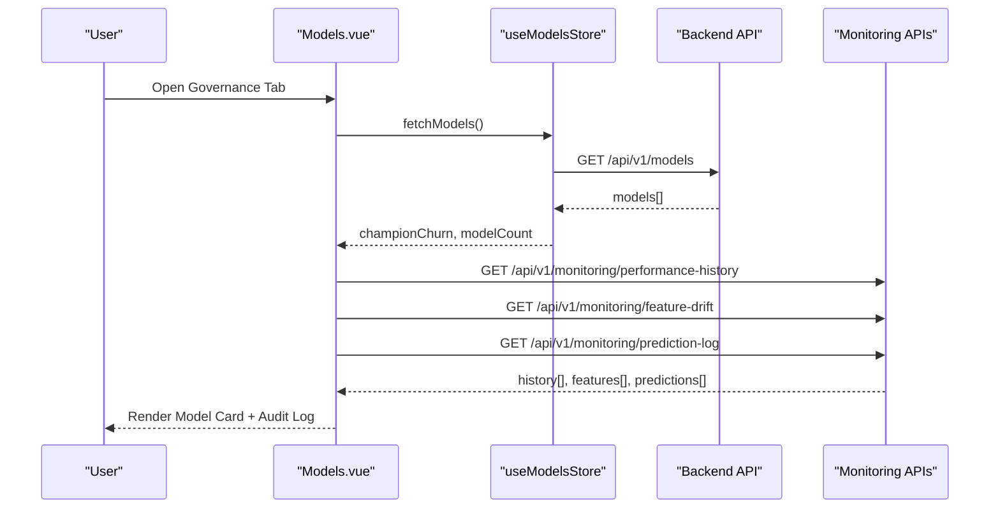
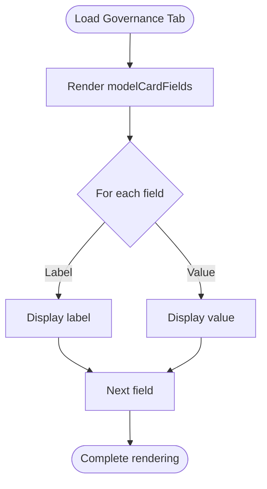
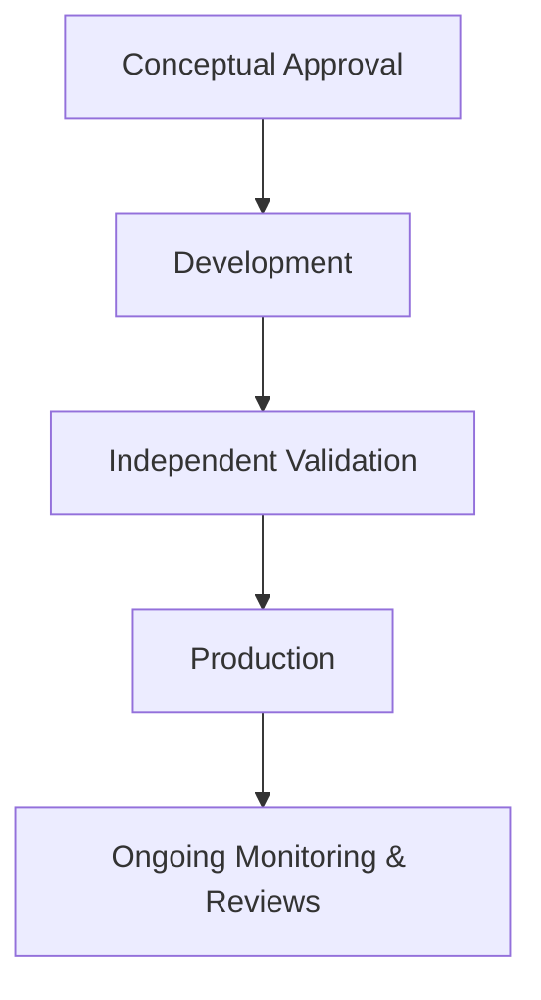
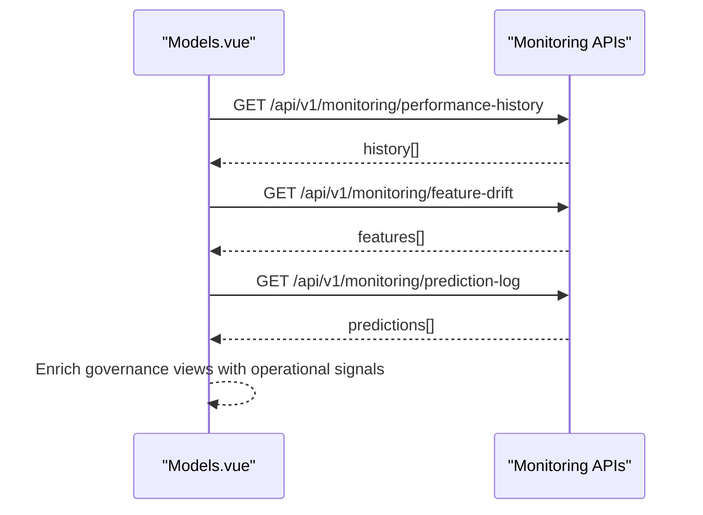
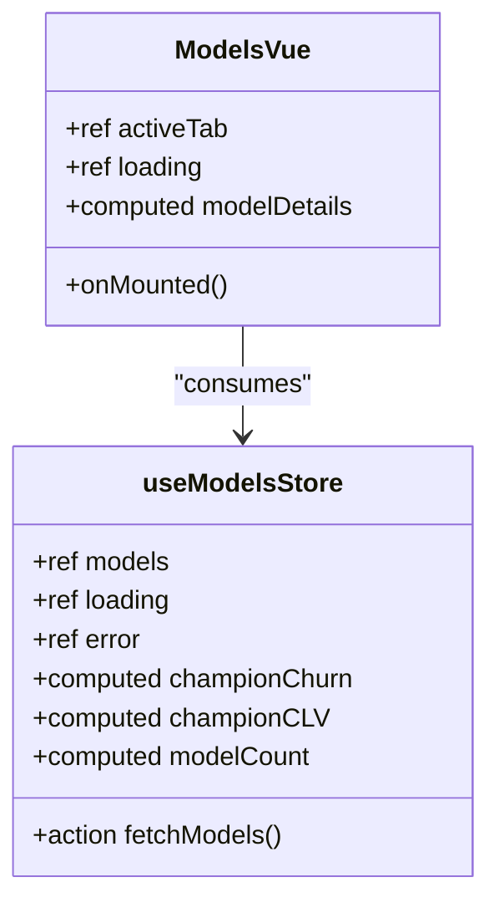
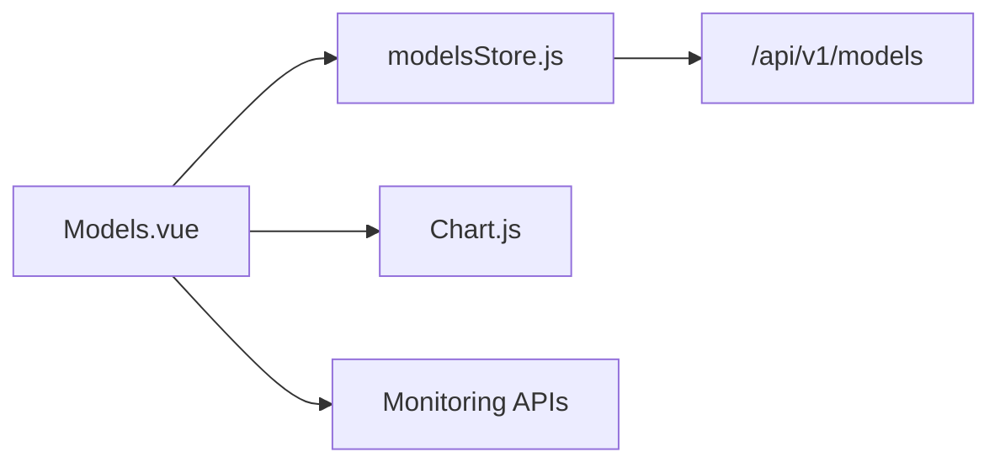

# Model Card System

<cite>
**Referenced Files in This Document**
- [Models.vue](file://src/views/Modules/aiagents/Models.vue)
- [modelsStore.js](file://src/stores/modelsStore.js)
- [README.md](file://README.md)
</cite>

## Table of Contents
1. [Introduction](#introduction)
2. [Project Structure](#project-structure)
3. [Core Components](#core-components)
4. [Architecture Overview](#architecture-overview)
5. [Detailed Component Analysis](#detailed-component-analysis)
6. [Dependency Analysis](#dependency-analysis)
7. [Performance Considerations](#performance-considerations)
8. [Troubleshooting Guide](#troubleshooting-guide)
9. [Conclusion](#conclusion)
10. [Appendices](#appendices)

## Introduction
This document explains the model card system implemented in the AI Agents module for ABSA’s Intelligence Unit frontend. The model card provides a standardized, compliance-oriented view of a production model’s metadata and governance status. It is designed to support transparency and accountability across model development, validation, approval, and deployment lifecycles.

The model card surfaces key fields such as Model ID, Algorithm type, Training Cutoff dates, Production Date, Model Owner, Risk Owner, Validated By information, Validation Date, Approval Status, Next Review Due dates, Regulatory References (SARB MRM Framework, SR 11-7), Target Variable definitions, Features Used specifications, and Sampling Strategy details. These fields are presented under the Governance tab alongside an approval lifecycle summary and audit history.

## Project Structure
The model card UI resides within the AI Agents module and integrates with a Pinia store for model registry data and monitoring endpoints for performance, drift, and prediction logs.

**Diagram sources**
- [Models.vue:379-399](file://src/views/Modules/aiagents/Models.vue#L379-L399)
- [modelsStore.js:15-52](file://src/stores/modelsStore.js#L15-L52)

**Section sources**
- [README.md:287-327](file://README.md#L287-L327)
- [Models.vue:379-399](file://src/views/Modules/aiagents/Models.vue#L379-L399)
- [modelsStore.js:15-52](file://src/stores/modelsStore.js#L15-L52)

## Core Components
- Model Card Fields: A structured list of governance-related attributes displayed in a two-column layout (label/value).
- Approval Lifecycle: A visual step-by-step pipeline showing conceptual approval, development, independent validation, and production stages.
- Audit History: An immutable log of model events including version, metrics, actor, and status.
- Monitoring Integration: Fetches performance history, feature drift, and prediction logs to contextualize governance decisions.

Key responsibilities:
- Present model metadata consistently for stakeholders (risk managers, auditors, regulators).
- Provide clear visibility into approvals and validations aligned with regulatory frameworks.
- Connect governance records to live operational signals (drift, alerts, performance).

**Section sources**
- [Models.vue:379-399](file://src/views/Modules/aiagents/Models.vue#L379-L399)
- [Models.vue:797-810](file://src/views/Modules/aiagents/Models.vue#L797-L810)
- [Models.vue:828-861](file://src/views/Modules/aiagents/Models.vue#L828-L861)

## Architecture Overview
The model card is part of a broader AI Models dashboard that includes overview, performance, drift, governance, logs, and alerts tabs. The governance tab renders the model card and related compliance artifacts.

**Diagram sources**
- [Models.vue:828-861](file://src/views/Modules/aiagents/Models.vue#L828-L861)
- [modelsStore.js:31-50](file://src/stores/modelsStore.js#L31-L50)

## Detailed Component Analysis

### Model Card Fields
The model card displays a set of governance fields in a consistent format. Each field has a label and value pair, enabling quick scanning by stakeholders.

Fields included:
- Model ID
- Algorithm
- Training Cutoff
- Production Date
- Model Owner
- Risk Owner
- Validated By
- Validation Date
- Approval Status
- Next Review Due
- Regulatory Ref
- Target Variable
- Features Used
- Sampling Strategy

These fields provide a concise snapshot of model identity, ownership, validation, and regulatory alignment. They enable risk managers and auditors to quickly assess whether a model meets internal standards and external requirements.

**Diagram sources**
- [Models.vue:379-399](file://src/views/Modules/aiagents/Models.vue#L379-L399)
- [Models.vue:780-795](file://src/views/Modules/aiagents/Models.vue#L780-L795)

**Section sources**
- [Models.vue:379-399](file://src/views/Modules/aiagents/Models.vue#L379-L399)
- [Models.vue:780-795](file://src/views/Modules/aiagents/Models.vue#L780-L795)

### Approval Lifecycle and Audit History
The approval lifecycle shows the progression from conceptual approval through development, independent validation, and production. The audit log captures historical events with versioning and actors.

**Diagram sources**
- [Models.vue:797-802](file://src/views/Modules/aiagents/Models.vue#L797-L802)

Audit entries include date, event, version, metric snapshot, actor, and status, providing traceability for changes and validations.

**Section sources**
- [Models.vue:797-810](file://src/views/Modules/aiagents/Models.vue#L797-L810)

### Monitoring Integration and Context
The governance tab benefits from real-time context via monitoring endpoints:
- Performance history over time
- Feature drift metrics (PSI)
- Prediction logs with latency and classification

This integration ensures that governance decisions are informed by current operational health.

**Diagram sources**
- [Models.vue:828-861](file://src/views/Modules/aiagents/Models.vue#L828-L861)

**Section sources**
- [Models.vue:828-861](file://src/views/Modules/aiagents/Models.vue#L828-L861)

### Data Flow Between Store and UI
The store centralizes model registry data and exposes computed properties for champion models and counts. The UI consumes these to populate headers, badges, and KPIs.

**Diagram sources**
- [modelsStore.js:15-52](file://src/stores/modelsStore.js#L15-L52)
- [Models.vue:623-684](file://src/views/Modules/aiagents/Models.vue#L623-L684)

**Section sources**
- [modelsStore.js:15-52](file://src/stores/modelsStore.js#L15-L52)
- [Models.vue:623-684](file://src/views/Modules/aiagents/Models.vue#L623-L684)

## Dependency Analysis
- Models.vue depends on:
  - Pinia store (useModelsStore) for model registry state
  - Axios-based HTTP client configured with base URL and token interceptor
  - Chart.js for visualization components
  - Monitoring endpoints for performance, drift, and logs
- modelsStore.js depends on:
  - API_BASE_URL service configuration
  - Token injection via request interceptor

**Diagram sources**
- [Models.vue:623-636](file://src/views/Modules/aiagents/Models.vue#L623-L636)
- [modelsStore.js:1-12](file://src/stores/modelsStore.js#L1-L12)

**Section sources**
- [Models.vue:623-636](file://src/views/Modules/aiagents/Models.vue#L623-L636)
- [modelsStore.js:1-12](file://src/stores/modelsStore.js#L1-L12)

## Performance Considerations
- Parallel fetching: Monitoring endpoints are fetched concurrently to reduce load time.
- Computed properties: Metrics and derived values are cached and recomputed only when dependencies change.
- Lazy chart initialization: Charts are initialized after loading completes to avoid unnecessary re-renders.

[No sources needed since this section provides general guidance]

## Troubleshooting Guide
Common issues and resolutions:
- Failed model fetch: Check network connectivity and backend availability; review store error state.
- Missing monitoring data: Validate endpoint responses; ensure correct parameters and authentication tokens.
- Chart rendering errors: Ensure DOM refs exist before initializing charts; handle empty datasets gracefully.

Operational tips:
- Use the Alerts tab to identify critical drift or performance breaches requiring immediate attention.
- Cross-check audit log entries with approval steps to confirm proper governance flow.

**Section sources**
- [modelsStore.js:31-50](file://src/stores/modelsStore.js#L31-L50)
- [Models.vue:828-861](file://src/views/Modules/aiagents/Models.vue#L828-L861)

## Conclusion
The model card system provides a robust, compliance-aligned interface for documenting and reviewing model metadata and governance status. By combining standardized fields, approval lifecycle visualization, and audit history with live monitoring signals, it supports transparency and accountability for model development and deployment. Stakeholders can quickly assess model readiness, validate regulatory compliance, and act on operational insights.

[No sources needed since this section summarizes without analyzing specific files]

## Appendices

### Interpreting Model Card Information for Stakeholders
- Risk Managers: Focus on Risk Owner, Next Review Due, Regulatory References, and drift/alerts to evaluate ongoing risk exposure and remediation needs.
- Auditors: Review Approval Status, Validation Date, Validated By, and Audit Log to verify governance completeness and traceability.
- Regulatory Bodies: Confirm adherence to SARB MRM Framework and SR 11-7 references, and validate that training cutoffs, sampling strategies, and target variables are documented and appropriate.

### Examples of Completing Model Cards
- Churn Prediction Model:
  - Model ID: churn_lgbm_v1.4.2
  - Algorithm: LightGBM (Gradient Boosted Trees)
  - Training Cutoff: 2024-06-30
  - Production Date: 2024-09-01
  - Model Owner: Data Science – Retail Analytics
  - Risk Owner: Chief Risk Officer
  - Validated By: Model Risk Management Team
  - Validation Date: 2024-08-15
  - Approval Status: APPROVED — In Production
  - Next Review Due: 2025-12-31
  - Regulatory Ref: SARB MRM Framework 2023 · SR 11-7
  - Target Variable: churn_within_90_days (binary)
  - Features Used: 42 input features (v1.4.x schema)
  - Sampling Strategy: Stratified K-fold (k=5) · SMOTE oversampling

- Customer Lifetime Value (CLV) Model:
  - Model ID: clv_xgboost_v2.1.0
  - Algorithm: XGBoost (Regressor)
  - Training Cutoff: 2024-07-15
  - Production Date: 2024-09-10
  - Model Owner: Data Science – Portfolio Analytics
  - Risk Owner: Chief Risk Officer
  - Validated By: Model Risk Management Team
  - Validation Date: 2024-08-20
  - Approval Status: APPROVED — In Production
  - Next Review Due: 2025-12-31
  - Regulatory Ref: SARB MRM Framework 2023 · SR 11-7
  - Target Variable: lifetime_value_next_12_months (continuous)
  - Features Used: 38 input features (v2.1.x schema)
  - Sampling Strategy: Stratified K-fold (k=5) · Quantile binning

- Fraud Detection Model:
  - Model ID: fraud_isolation_forest_v1.0.5
  - Algorithm: Isolation Forest (Anomaly Detector)
  - Training Cutoff: 2024-05-31
  - Production Date: 2024-08-01
  - Model Owner: Data Science – Risk Analytics
  - Risk Owner: Chief Risk Officer
  - Validated By: Model Risk Management Team
  - Validation Date: 2024-07-25
  - Approval Status: APPROVED — In Production
  - Next Review Due: 2025-12-31
  - Regulatory Ref: SARB MRM Framework 2023 · SR 11-7
  - Target Variable: anomaly_score (continuous)
  - Features Used: 55 input features (v1.0.x schema)
  - Sampling Strategy: Stratified K-fold (k=5) · Class imbalance handling via threshold tuning

[No sources needed since this section provides conceptual examples based on repository patterns]