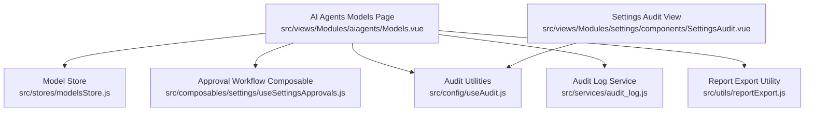
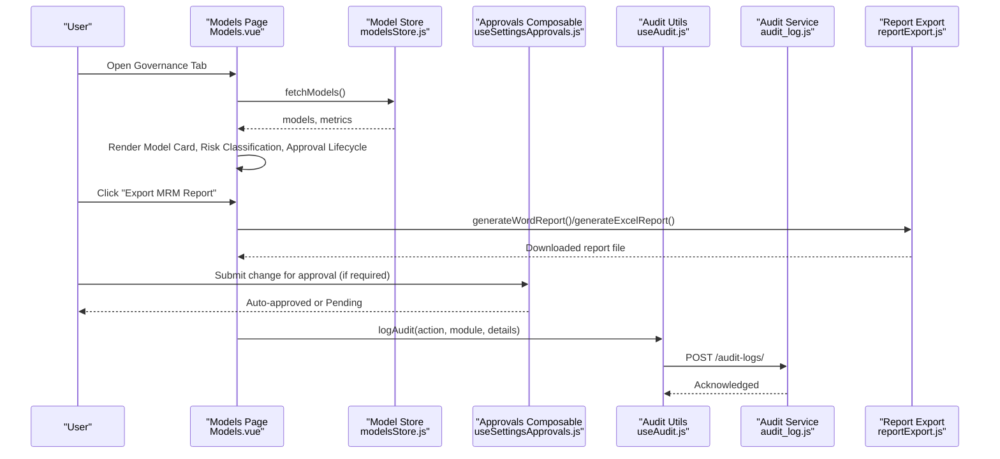
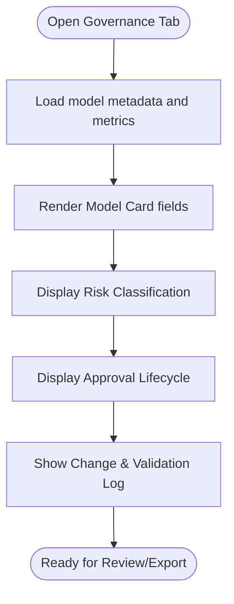
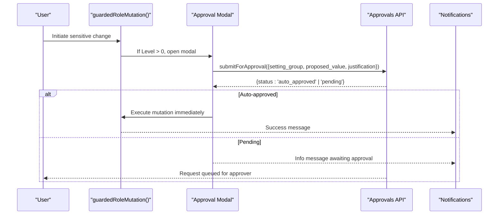
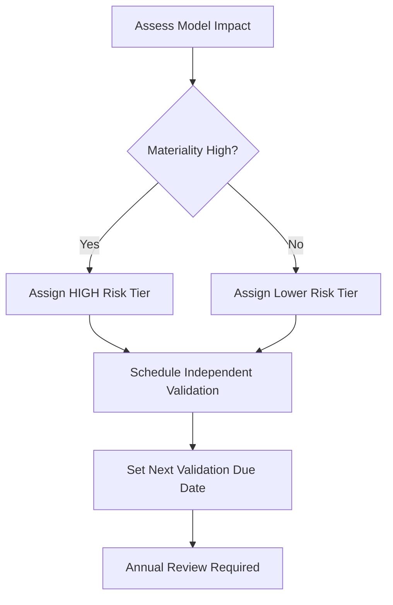
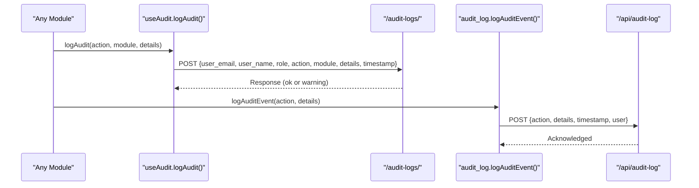
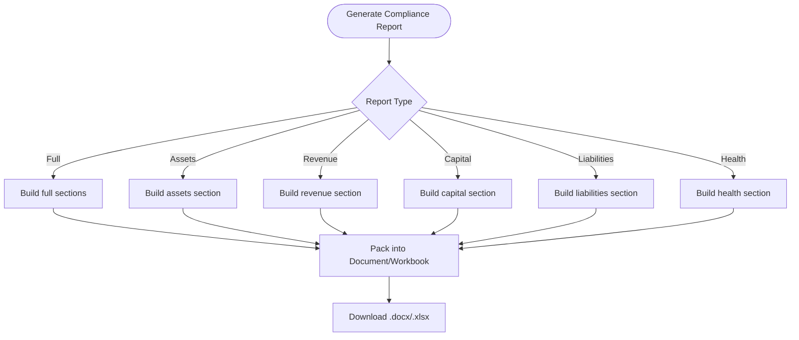
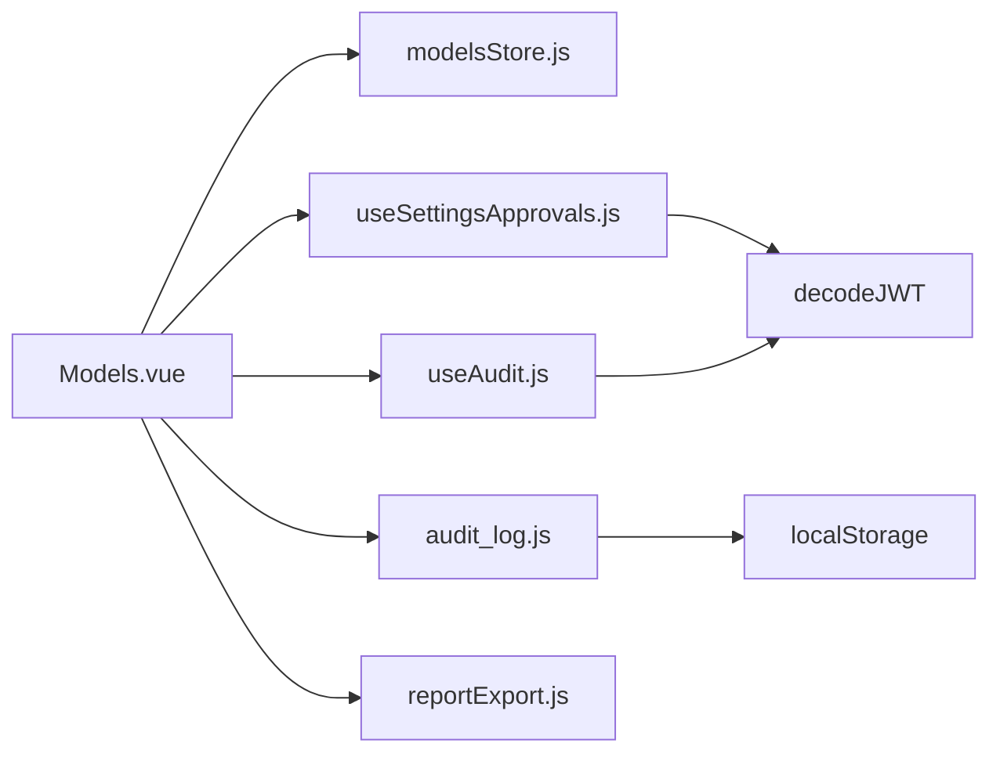

# Model Governance & Compliance

<cite>
**Referenced Files in This Document**
- [Models.vue](file://src/views/Modules/aiagents/Models.vue)
- [modelsStore.js](file://src/stores/modelsStore.js)
- [useSettingsApprovals.js](file://src/composables/settings/useSettingsApprovals.js)
- [useAudit.js](file://src/config/useAudit.js)
- [audit_log.js](file://src/services/audit_log.js)
- [SettingsAudit.vue](file://src/views/Modules/settings/components/SettingsAudit.vue)
- [reportExport.js](file://src/utils/reportExport.js)
</cite>

## Table of Contents
1. Introduction
2. Project Structure
3. Core Components
4. Architecture Overview
5. Detailed Component Analysis
6. Dependency Analysis
7. Performance Considerations
8. Troubleshooting Guide
9. Conclusion
10. Appendices

## Introduction
This document explains the model governance and regulatory compliance features implemented in the frontend, focusing on:
- The model card system that documents algorithm details, training data information, validation results, and approval status
- The approval workflow pipeline from conceptual approval through development, independent validation, and production deployment
- Risk classification and materiality assessments for regulatory compliance
- Audit logging capabilities tracking changes, validations, and approvals
- Examples for creating model cards, navigating approval workflows, and generating compliance reports aligned with SARB MRM Framework and SR 11-7 requirements

The goal is to provide both technical and non-technical readers with a clear understanding of how the system supports responsible AI governance and regulatory reporting.

## Project Structure
The governance and compliance functionality spans several modules:
- Model registry and monitoring UI under AI Agents
- Approval workflows for sensitive settings and role mutations
- Audit logging utilities and configuration
- Report export utilities for compliance documentation

**Diagram sources**
- [Models.vue:1-120](file://src/views/Modules/aiagents/Models.vue#L1-L120)
- [modelsStore.js:1-54](file://src/stores/modelsStore.js#L1-L54)
- [useSettingsApprovals.js:1-120](file://src/composables/settings/useSettingsApprovals.js#L1-L120)
- [useAudit.js:1-76](file://src/config/useAudit.js#L1-L76)
- [audit_log.js:1-20](file://src/services/audit_log.js#L1-L20)
- [reportExport.js:1-90](file://src/utils/reportExport.js#L1-L90)
- [SettingsAudit.vue:1-53](file://src/views/Modules/settings/components/SettingsAudit.vue#L1-L53)

**Section sources**
- [Models.vue:1-120](file://src/views/Modules/aiagents/Models.vue#L1-L120)
- [modelsStore.js:1-54](file://src/stores/modelsStore.js#L1-L54)
- [useSettingsApprovals.js:1-120](file://src/composables/settings/useSettingsApprovals.js#L1-L120)
- [useAudit.js:1-76](file://src/config/useAudit.js#L1-L76)
- [audit_log.js:1-20](file://src/services/audit_log.js#L1-L20)
- [reportExport.js:1-90](file://src/utils/reportExport.js#L1-L90)
- [SettingsAudit.vue:1-53](file://src/views/Modules/settings/components/SettingsAudit.vue#L1-L53)

## Core Components
- Model Card and Governance Tab: Displays comprehensive model documentation including algorithm, training cutoff, production date, owners, validation dates, approval status, next review due date, and regulatory references. It also shows risk classification and an approval lifecycle timeline.
- Approval Workflow Pipeline: Multi-level approval mechanism for sensitive changes with configurable levels per setting group, supporting auto-approval, manager/director/executive approvals, and quorum rules.
- Audit Logging: Centralized composable and service to log user actions across modules, capturing actor identity, module context, action type, timestamp, and details.
- Report Export: Utilities to generate structured Word and Excel reports suitable for compliance submissions.

**Section sources**
- [Models.vue:379-470](file://src/views/Modules/aiagents/Models.vue#L379-L470)
- [useSettingsApprovals.js:44-120](file://src/composables/settings/useSettingsApprovals.js#L44-L120)
- [useAudit.js:19-76](file://src/config/useAudit.js#L19-L76)
- [audit_log.js:1-20](file://src/services/audit_log.js#L1-L20)
- [reportExport.js:24-90](file://src/utils/reportExport.js#L24-L90)

## Architecture Overview
The governance architecture integrates UI components, state stores, composables, and services to support end-to-end model lifecycle management and compliance reporting.

**Diagram sources**
- [Models.vue:379-470](file://src/views/Modules/aiagents/Models.vue#L379-L470)
- [modelsStore.js:31-52](file://src/stores/modelsStore.js#L31-L52)
- [useSettingsApprovals.js:146-257](file://src/composables/settings/useSettingsApprovals.js#L146-L257)
- [useAudit.js:43-72](file://src/config/useAudit.js#L43-L72)
- [audit_log.js:4-19](file://src/services/audit_log.js#L4-L19)
- [reportExport.js:24-90](file://src/utils/reportExport.js#L24-L90)

## Detailed Component Analysis

### Model Card System
The Model Card provides comprehensive documentation for each model, including:
- Algorithm details and feature schema
- Training cutoff and production date
- Model owner and risk owner
- Validation details and approvers
- Approval status and next review due date
- Regulatory references (SARB MRM Framework and SR 11-7)

It also displays:
- Risk classification (risk tier, materiality)
- Approval lifecycle stages (conceptual approval, development, independent validation, production)
- An immutable audit trail table showing version, event, metrics, actor, and status

**Diagram sources**
- [Models.vue:379-470](file://src/views/Modules/aiagents/Models.vue#L379-L470)
- [Models.vue:779-810](file://src/views/Modules/aiagents/Models.vue#L779-L810)

**Section sources**
- [Models.vue:379-470](file://src/views/Modules/aiagents/Models.vue#L379-L470)
- [Models.vue:779-810](file://src/views/Modules/aiagents/Models.vue#L779-L810)

### Approval Workflow Pipeline
The approval workflow enforces multi-level controls for sensitive changes:
- Configurable approval levels by setting group (e.g., roles_permissions requires higher level)
- Auto-approval for low-risk changes
- Submission flow with justification and metadata
- Decision handling (approve/reject/changes requested)
- Withdrawal of pending requests
- Role-based guards to wrap mutations

**Diagram sources**
- [useSettingsApprovals.js:337-415](file://src/composables/settings/useSettingsApprovals.js#L337-L415)
- [useSettingsApprovals.js:146-257](file://src/composables/settings/useSettingsApprovals.js#L146-L257)

**Section sources**
- [useSettingsApprovals.js:44-120](file://src/composables/settings/useSettingsApprovals.js#L44-L120)
- [useSettingsApprovals.js:146-257](file://src/composables/settings/useSettingsApprovals.js#L146-L257)
- [useSettingsApprovals.js:337-415](file://src/composables/settings/useSettingsApprovals.js#L337-L415)

### Risk Classification and Materiality Assessments
The governance tab exposes:
- Model risk tier (e.g., HIGH)
- Next validation due date
- Annual review status
- Materiality assessment (e.g., HIGH)

These indicators guide oversight cadence and escalation paths in line with regulatory expectations.

[No sources needed since this diagram shows conceptual workflow, not actual code structure]

**Section sources**
- [Models.vue:426-435](file://src/views/Modules/aiagents/Models.vue#L426-L435)

### Audit Logging Capabilities
Two complementary mechanisms capture audit events:
- useAudit composable: Logs actions with user identity, role, module, and details to a backend endpoint
- audit_log service: Lightweight utility to post events to a dedicated audit endpoint

Both ensure traceability of changes, validations, and approvals.

**Diagram sources**
- [useAudit.js:43-72](file://src/config/useAudit.js#L43-L72)
- [audit_log.js:4-19](file://src/services/audit_log.js#L4-L19)

**Section sources**
- [useAudit.js:19-76](file://src/config/useAudit.js#L19-L76)
- [audit_log.js:1-20](file://src/services/audit_log.js#L1-L20)
- [SettingsAudit.vue:1-53](file://src/views/Modules/settings/components/SettingsAudit.vue#L1-L53)

### Compliance Reporting
The system includes report generation utilities to produce structured documents suitable for regulatory submissions:
- Word reports with sections for assets, revenue, capital, liabilities, and health metrics
- Excel exports with multiple sheets for detailed breakdowns

While these utilities are financial-report oriented, they demonstrate the pattern for building compliance artifacts that can be adapted for model governance outputs (e.g., model cards, validation summaries, risk classifications).

**Diagram sources**
- [reportExport.js:24-90](file://src/utils/reportExport.js#L24-L90)
- [reportExport.js:390-417](file://src/utils/reportExport.js#L390-L417)

**Section sources**
- [reportExport.js:24-90](file://src/utils/reportExport.js#L24-L90)
- [reportExport.js:390-417](file://src/utils/reportExport.js#L390-L417)

## Dependency Analysis
Key dependencies and interactions:
- Models page depends on the model store to fetch and display model metadata and metrics
- Approval workflow composable integrates with JWT decoding and API endpoints for submission and decisioning
- Audit utilities depend on JWT decoding and API base URL to send logs with proper authorization
- Report export utilities rely on document and workbook libraries to generate downloadable files

**Diagram sources**
- [Models.vue:623-636](file://src/views/Modules/aiagents/Models.vue#L623-L636)
- [modelsStore.js:1-12](file://src/stores/modelsStore.js#L1-L12)
- [useSettingsApprovals.js:1-5](file://src/composables/settings/useSettingsApprovals.js#L1-L5)
- [useAudit.js:16-20](file://src/config/useAudit.js#L16-L20)
- [audit_log.js:4-19](file://src/services/audit_log.js#L4-L19)
- [reportExport.js:1-4](file://src/utils/reportExport.js#L1-L4)

**Section sources**
- [Models.vue:623-636](file://src/views/Modules/aiagents/Models.vue#L623-L636)
- [modelsStore.js:1-12](file://src/stores/modelsStore.js#L1-L12)
- [useSettingsApprovals.js:1-5](file://src/composables/settings/useSettingsApprovals.js#L1-L5)
- [useAudit.js:16-20](file://src/config/useAudit.js#L16-L20)
- [audit_log.js:4-19](file://src/services/audit_log.js#L4-L19)
- [reportExport.js:1-4](file://src/utils/reportExport.js#L1-L4)

## Performance Considerations
- Fetching model data and monitoring endpoints should be rate-limited and cached where appropriate to avoid excessive network calls
- Chart rendering should debounce updates when thresholds or timeframes change frequently
- Audit logging should be fire-and-forget to prevent blocking critical user flows
- Report generation should handle large datasets efficiently and consider chunked processing if necessary

[No sources needed since this section provides general guidance]

## Troubleshooting Guide
Common issues and resolutions:
- Approval submission failures: Check authentication token presence and network connectivity; review error messages returned by the approvals API
- Audit log failures: Ensure the backend endpoints are reachable; verify that user identity and role are correctly resolved from JWT or local storage
- Model data loading errors: Validate API responses and handle empty or malformed data gracefully; check for timeouts and retry logic
- Report export errors: Confirm that required libraries are available and that input data structures match expected schemas

**Section sources**
- [useSettingsApprovals.js:196-206](file://src/composables/settings/useSettingsApprovals.js#L196-L206)
- [useSettingsApprovals.js:242-256](file://src/composables/settings/useSettingsApprovals.js#L242-L256)
- [useAudit.js:64-71](file://src/config/useAudit.js#L64-L71)
- [audit_log.js:16-19](file://src/services/audit_log.js#L16-L19)

## Conclusion
The frontend implements a robust model governance and compliance framework centered around:
- A comprehensive model card system documenting algorithms, training data, validation results, and approval status
- A configurable approval workflow pipeline ensuring controlled changes across the model lifecycle
- Clear risk classification and materiality assessments guiding oversight and validation cadence
- Comprehensive audit logging to track all changes, validations, and approvals
- Report export utilities enabling creation of compliance artifacts for regulatory bodies

These capabilities collectively support adherence to SARB MRM Framework and SR 11-7 requirements by providing transparency, accountability, and traceability throughout the model lifecycle.

[No sources needed since this section summarizes without analyzing specific files]

## Appendices

### Example: Creating a Model Card
Steps:
- Navigate to the AI Agents Models page and select the Governance tab
- Verify that the Model Card displays algorithm details, training cutoff, production date, owners, validation dates, approval status, next review due date, and regulatory references
- Confirm risk classification and materiality indicators are present and accurate
- Use the “Export MRM Report” button to generate a compliance-ready document

**Section sources**
- [Models.vue:379-470](file://src/views/Modules/aiagents/Models.vue#L379-L470)
- [Models.vue:779-810](file://src/views/Modules/aiagents/Models.vue#L779-L810)

### Example: Navigating Approval Workflows
Steps:
- Attempt a sensitive change (e.g., role mutation) which triggers the approval guard
- If required, confirm submission via the approval modal with justification and metadata
- Monitor the status: auto-approved changes execute immediately; others enter pending approval
- Approvers can decide to approve, reject, or request changes; requesters can withdraw pending requests

**Section sources**
- [useSettingsApprovals.js:337-415](file://src/composables/settings/useSettingsApprovals.js#L337-L415)
- [useSettingsApprovals.js:146-257](file://src/composables/settings/useSettingsApprovals.js#L146-L257)

### Example: Generating Compliance Reports
Steps:
- From the Models page, click “Export MRM Report”
- Select desired report type (full or specific sections)
- Download the generated Word or Excel file for submission to regulatory bodies

**Section sources**
- [Models.vue:38-45](file://src/views/Modules/aiagents/Models.vue#L38-L45)
- [reportExport.js:24-90](file://src/utils/reportExport.js#L24-L90)
- [reportExport.js:390-417](file://src/utils/reportExport.js#L390-L417)