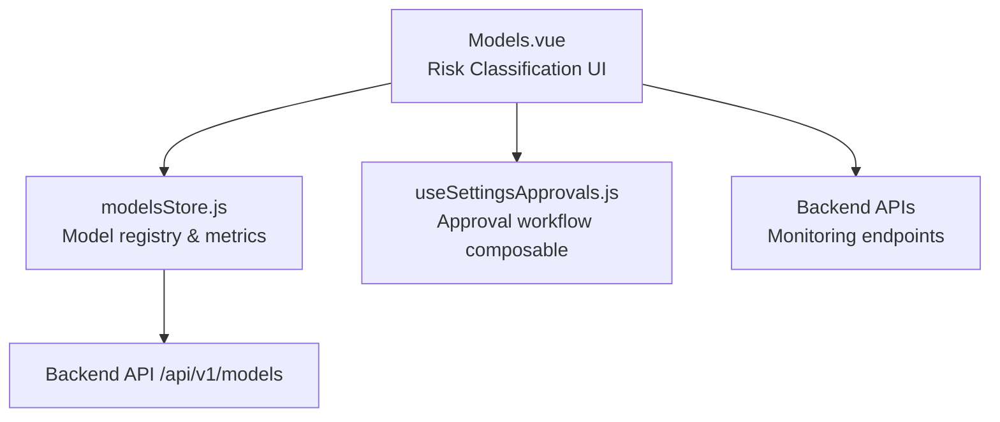
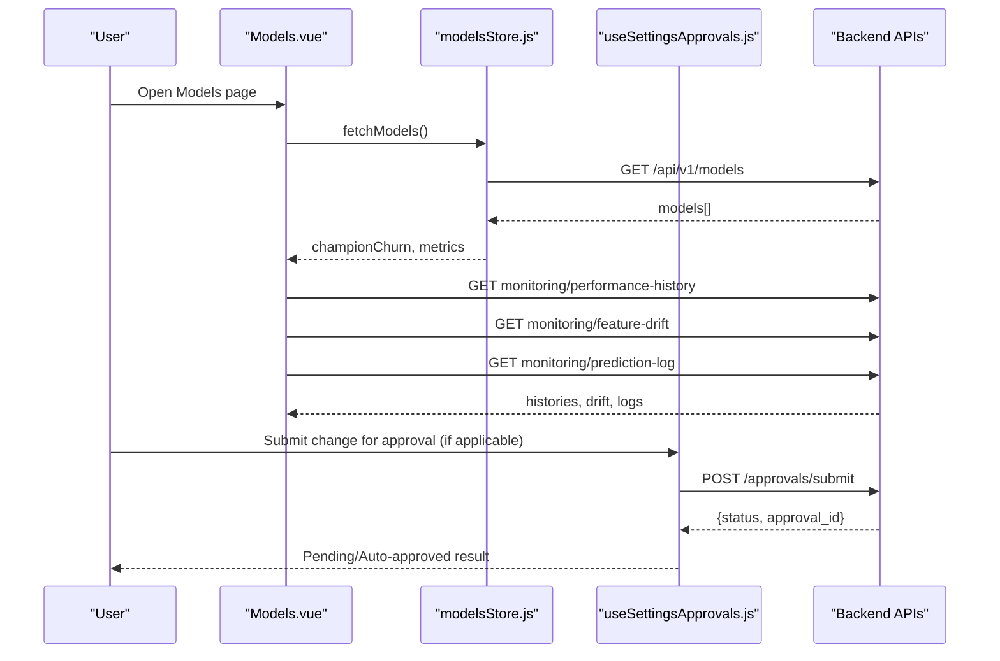
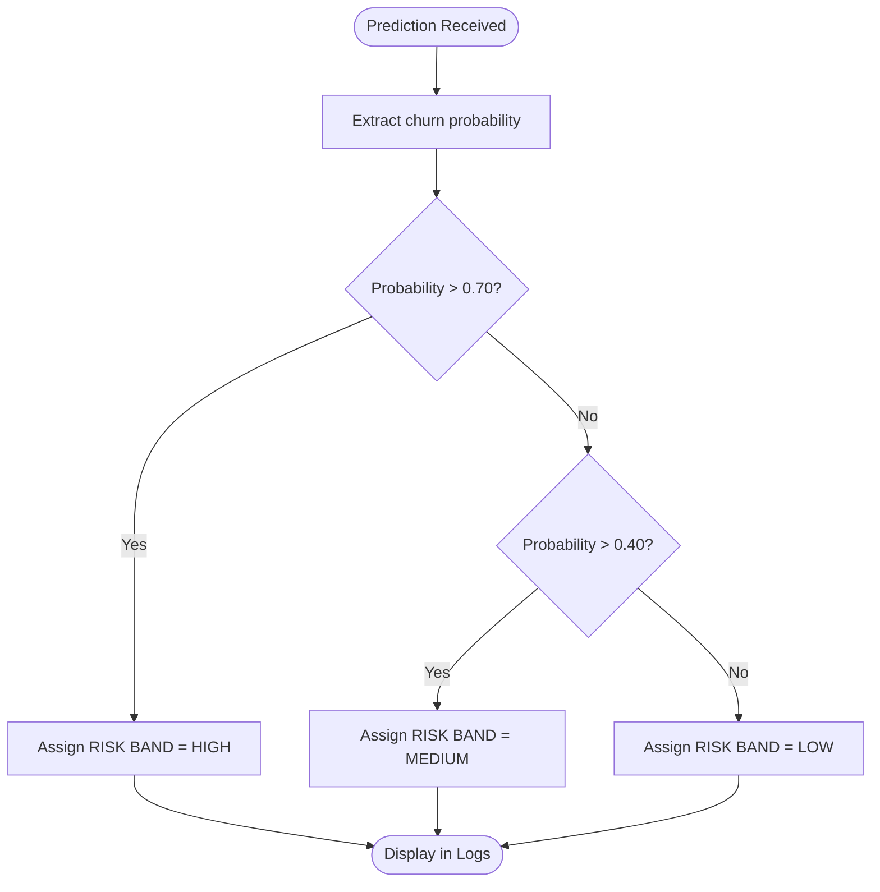
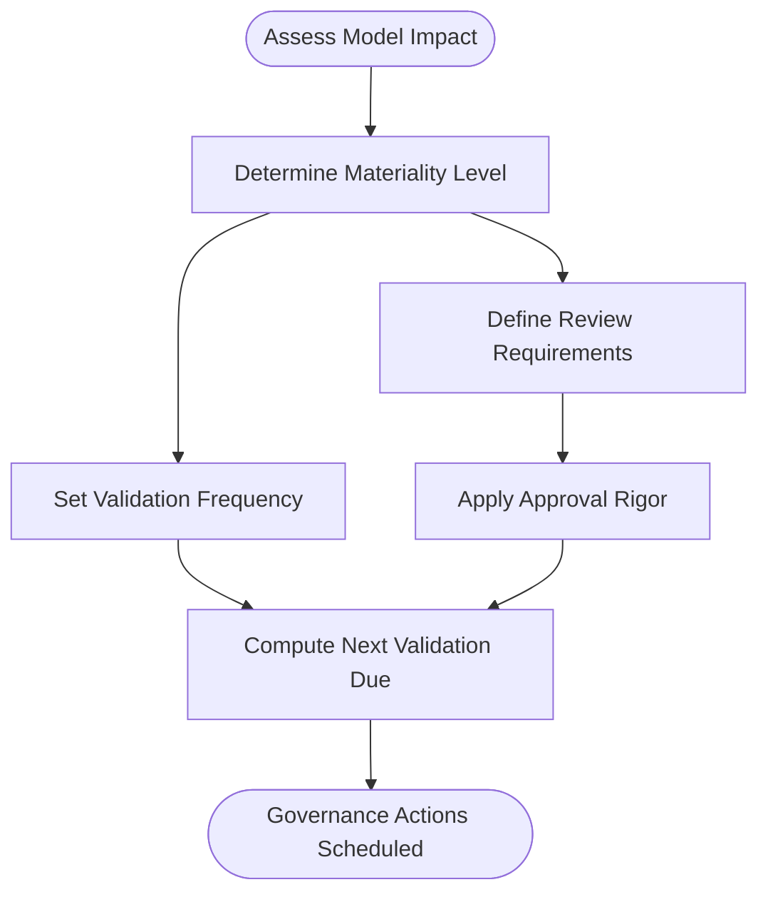
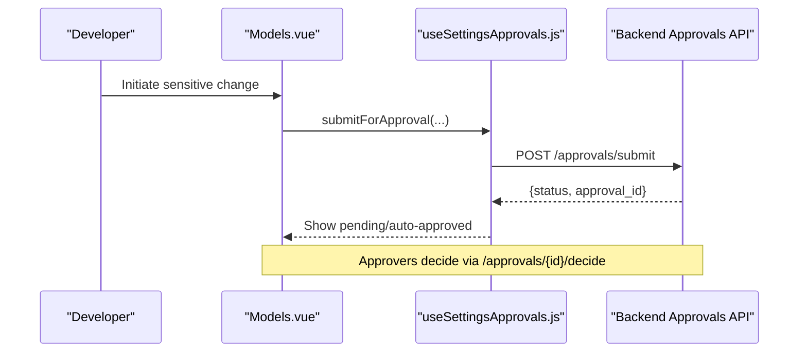
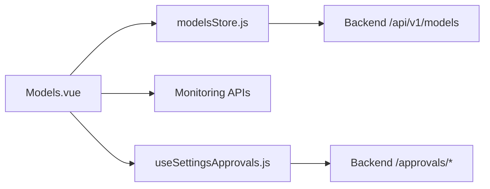

# Risk Classification & Materiality Assessment

<cite>
**Referenced Files in This Document**
- [Models.vue](file://src/views/Modules/aiagents/Models.vue)
- [modelsStore.js](file://src/stores/modelsStore.js)
- [useSettingsApprovals.js](file://src/composables/settings/useSettingsApprovals.js)
</cite>

## Table of Contents
1. Introduction
2. Project Structure
3. Core Components
4. Architecture Overview
5. Detailed Component Analysis
6. Dependency Analysis
7. Performance Considerations
8. Troubleshooting Guide
9. Conclusion

## Introduction
This document explains the model risk classification and materiality assessment system as implemented in the frontend. It covers:
- The risk tier classification system (LOW, MEDIUM, HIGH) and how models are categorized by potential impact and complexity.
- The materiality assessment process that drives review requirements and validation frequency.
- The relationship between risk classification and approval workflows, including which tiers require additional scrutiny or independent validation.
- Examples of risk classification scenarios for different model types and how materiality assessments drive governance requirements.
- Next validation due dates and annual review processes tied to risk classifications.

## Project Structure
The risk classification and materiality features are primarily surfaced in the AI Agents Models view, with supporting state management and approval workflow composable integration.

**Diagram sources**
- [Models.vue:623-860](file://src/views/Modules/aiagents/Models.vue#L623-L860)
- [modelsStore.js:15-52](file://src/stores/modelsStore.js#L15-L52)
- [useSettingsApprovals.js:146-257](file://src/composables/settings/useSettingsApprovals.js#L146-L257)

**Section sources**
- [Models.vue:623-860](file://src/views/Modules/aiagents/Models.vue#L623-L860)
- [modelsStore.js:15-52](file://src/stores/modelsStore.js#L15-L52)

## Core Components
- Risk Classification Panel: Displays Model Risk Tier, Next Validation Due, Annual Review status, and Materiality level for a given model.
- Approval Lifecycle: Visualizes stages such as Conceptual Approval, Development, Independent Validation, and Production.
- Prediction Risk Bands: Classifies individual predictions into LOW/MEDIUM/HIGH based on probability thresholds.
- Monitoring Integration: Fetches performance history, feature drift, and prediction logs to inform risk posture.

Key responsibilities:
- Surface risk tier and materiality prominently for governance visibility.
- Tie next validation due date and annual review status to risk tier.
- Provide an approval lifecycle view aligned with high-risk models requiring independent validation.
- Compute per-prediction risk bands to support operational risk monitoring.

**Section sources**
- [Models.vue:401-437](file://src/views/Modules/aiagents/Models.vue#L401-L437)
- [Models.vue:812-821](file://src/views/Modules/aiagents/Models.vue#L812-L821)
- [Models.vue:828-860](file://src/views/Modules/aiagents/Models.vue#L828-L860)

## Architecture Overview
The system combines UI-driven governance views with backend monitoring data and an approval workflow composable to enforce risk-based controls.

**Diagram sources**
- [Models.vue:828-860](file://src/views/Modules/aiagents/Models.vue#L828-L860)
- [modelsStore.js:31-50](file://src/stores/modelsStore.js#L31-L50)
- [useSettingsApprovals.js:146-209](file://src/composables/settings/useSettingsApprovals.js#L146-L209)

## Detailed Component Analysis

### Risk Tier Classification System (LOW, MEDIUM, HIGH)
- Model-level risk tier is displayed in the Governance tab and header badge, indicating the overall risk posture of the model.
- Per-prediction risk bands are computed from churn probability:
  - LOW: probability ≤ 0.40
  - MEDIUM: 0.40 < probability ≤ 0.70
  - HIGH: probability > 0.70
- These bands help prioritize operational actions and align with risk-tiered governance.

**Diagram sources**
- [Models.vue:812-821](file://src/views/Modules/aiagents/Models.vue#L812-L821)

**Section sources**
- [Models.vue:812-821](file://src/views/Modules/aiagents/Models.vue#L812-L821)

### Materiality Assessment Process
- Materiality is shown alongside risk tier in the Governance panel, indicating the significance of the model’s impact and thus its governance intensity.
- Materiality influences:
  - Review requirements (e.g., independent validation, documentation depth).
  - Validation frequency (next validation due date).
  - Approval rigor (multi-level approvals for sensitive changes).

[No diagram sources needed since this section provides conceptual mapping]

**Section sources**
- [Models.vue:426-437](file://src/views/Modules/aiagents/Models.vue#L426-L437)

### Relationship Between Risk Classification and Approval Workflows
- High-risk models typically require independent validation and multi-step approvals before production deployment.
- The approval lifecycle visualized includes stages such as Conceptual Approval, Development, Independent Validation, and Production.
- For sensitive settings changes, the approval workflow composable supports submission, decisioning, and withdrawal flows, enabling enforcement of risk-tiered controls.

**Diagram sources**
- [useSettingsApprovals.js:146-257](file://src/composables/settings/useSettingsApprovals.js#L146-L257)
- [Models.vue:401-437](file://src/views/Modules/aiagents/Models.vue#L401-L437)

**Section sources**
- [Models.vue:401-437](file://src/views/Modules/aiagents/Models.vue#L401-L437)
- [useSettingsApprovals.js:146-257](file://src/composables/settings/useSettingsApprovals.js#L146-L257)

### Examples of Risk Classification Scenarios
- Churn Prediction Model (High Risk):
  - Model Risk Tier: HIGH
  - Materiality: HIGH
  - Next Validation Due: Year-end date
  - Annual Review: Completed
  - Requires independent validation and strict approval gates prior to production.
- Customer Lifetime Value Model (Medium Risk):
  - Model Risk Tier: MEDIUM
  - Materiality: MEDIUM
  - Next Validation Due: Mid-year date
  - Annual Review: In progress
  - Standard validation cadence with routine approvals.
- Marketing Attribution Model (Low Risk):
  - Model Risk Tier: LOW
  - Materiality: LOW
  - Next Validation Due: Extended interval
  - Annual Review: Not required annually
  - Streamlined approval path; minimal oversight.

[No sources needed since these are illustrative scenarios grounded in the UI fields]

### Next Validation Due Dates and Annual Reviews
- Next Validation Due is explicitly shown in the Governance panel and informs scheduling of revalidation activities.
- Annual Review status indicates whether the yearly governance checkpoint has been completed.
- These fields are used to trigger reminders, schedule audits, and enforce compliance timelines.

**Section sources**
- [Models.vue:426-437](file://src/views/Modules/aiagents/Models.vue#L426-L437)

## Dependency Analysis
- Models.vue depends on:
  - modelsStore.js for model registry and metrics.
  - Backend monitoring APIs for performance history, feature drift, and prediction logs.
  - useSettingsApprovals.js for submitting and managing approval requests when changes require governance.

**Diagram sources**
- [Models.vue:828-860](file://src/views/Modules/aiagents/Models.vue#L828-L860)
- [modelsStore.js:31-50](file://src/stores/modelsStore.js#L31-L50)
- [useSettingsApprovals.js:146-257](file://src/composables/settings/useSettingsApprovals.js#L146-L257)

**Section sources**
- [Models.vue:828-860](file://src/views/Modules/aiagents/Models.vue#L828-L860)
- [modelsStore.js:31-50](file://src/stores/modelsStore.js#L31-L50)
- [useSettingsApprovals.js:146-257](file://src/composables/settings/useSettingsApprovals.js#L146-L257)

## Performance Considerations
- Parallel fetching of monitoring data improves initial load time.
- Local computation of prediction risk bands avoids extra backend calls.
- Chart rendering is deferred until data loads to prevent layout thrash.

[No sources needed since this section provides general guidance]

## Troubleshooting Guide
- If model data fails to load:
  - Verify network connectivity and token presence.
  - Check console warnings for fetch failures.
- If approval submission fails:
  - Ensure tenant ID and email are present in JWT context.
  - Inspect error responses from the approvals endpoint.
- If risk bands appear incorrect:
  - Confirm probability values are normalized to 0–1 range before threshold checks.

**Section sources**
- [modelsStore.js:31-50](file://src/stores/modelsStore.js#L31-L50)
- [useSettingsApprovals.js:146-209](file://src/composables/settings/useSettingsApprovals.js#L146-L209)
- [Models.vue:828-860](file://src/views/Modules/aiagents/Models.vue#L828-L860)

## Conclusion
The frontend implements a clear, user-facing model risk classification and materiality assessment system. Risk tiers (LOW, MEDIUM, HIGH) and materiality levels drive governance requirements, validation schedules, and approval rigor. The approval workflow composable enforces multi-level controls for sensitive changes, while monitoring integrations provide real-time insights to maintain model health and compliance.