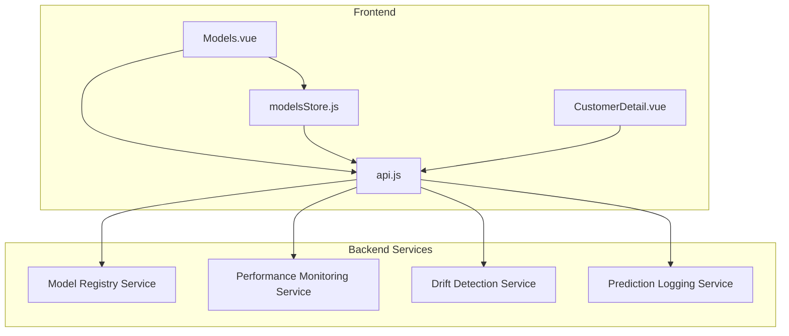
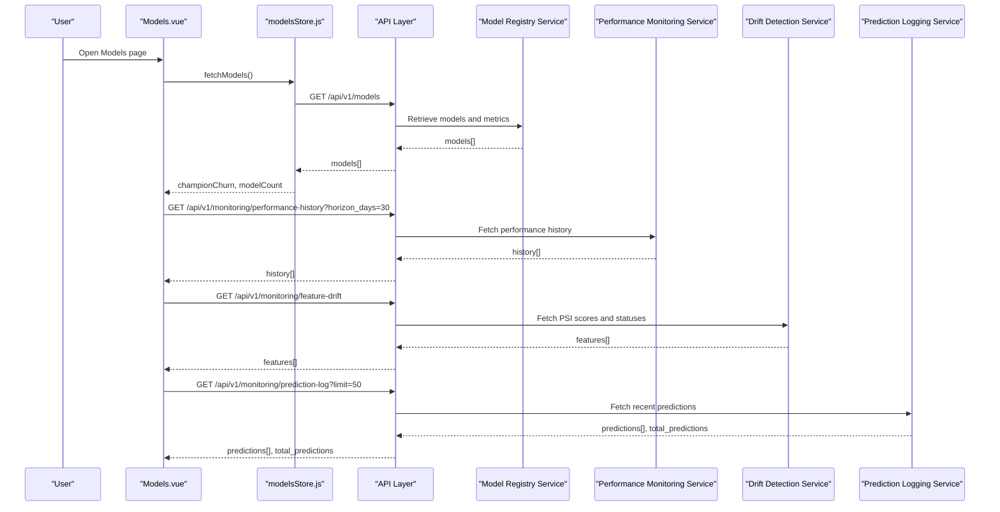
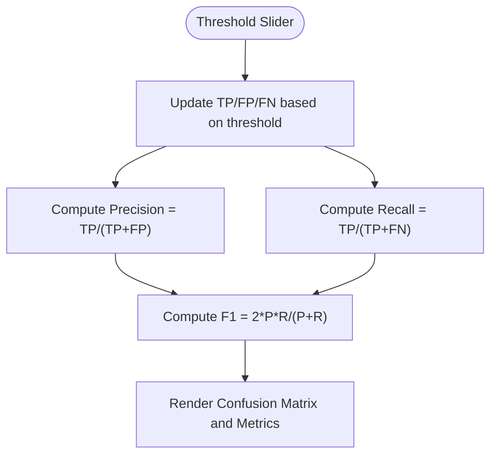
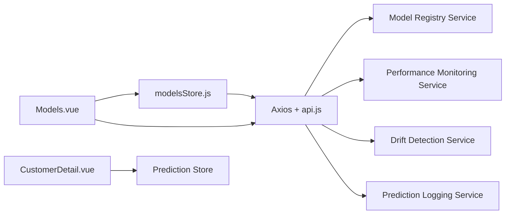

# Model Registry & Management

<cite>
**Referenced Files in This Document**
- [Models.vue](file://src/views/Modules/aiagents/Models.vue)
- [modelsStore.js](file://src/stores/modelsStore.js)
- [api.js](file://src/services/api.js)
- [CustomerDetail.vue](file://src/views/CustomerDetail.vue)
- [FRONTEND-REQUIREMENTS.md](file://docs/FRONTEND-REQUIREMENTS.md)
- [FRONTEND-REQUIREMENTS-V2.md](file://docs/FRONTEND-REQUIREMENTS-V2.md)
- [README.md](file://README.md)
</cite>

## Table of Contents
1. [Introduction](#introduction)
2. [Project Structure](#project-structure)
3. [Core Components](#core-components)
4. [Architecture Overview](#architecture-overview)
5. [Detailed Component Analysis](#detailed-component-analysis)
6. [Dependency Analysis](#dependency-analysis)
7. [Performance Considerations](#performance-considerations)
8. [Troubleshooting Guide](#troubleshooting-guide)
9. [Conclusion](#conclusion)
10. [Appendices](#appendices)

## Introduction
This document describes the AI model registry and management system implemented in the frontend for monitoring, governance, and operational visibility of models. It focuses on:
- Model registration and versioning as surfaced by the UI and store
- Lifecycle management including approval stages and audit trails
- Performance monitoring with AUC-ROC, F1 score, precision/recall, log loss, Brier score, KS statistic
- Drift detection using Population Stability Index (PSI) thresholds and alerts
- Prediction logging and inference latency tracking
- Governance and compliance documentation via a model card and audit logs
- Champion/challenger concepts through the store’s champion selection logic
- Deployment-related workflows exposed via UI actions and documented endpoints

Where backend services are referenced, this document clarifies that the frontend consumes them via defined API endpoints; actual implementation resides in the backend services listed in project documentation.

## Project Structure
The model registry and management features are primarily implemented in:
- The Models page for overview, performance, drift, governance, prediction logs, and alerts
- A Pinia store to fetch and expose model metadata and metrics
- Customer detail views that show model version and confidence context per customer
- Documentation files that define API contracts and service mapping

**Diagram sources**
- [Models.vue:623-861](file://src/views/Modules/aiagents/Models.vue#L623-L861)
- [modelsStore.js:1-54](file://src/stores/modelsStore.js#L1-L54)
- [api.js](file://src/services/api.js)

**Section sources**
- [Models.vue:1-940](file://src/views/Modules/aiagents/Models.vue#L1-L940)
- [modelsStore.js:1-54](file://src/stores/modelsStore.js#L1-L54)
- [FRONTEND-REQUIREMENTS.md:209-245](file://docs/FRONTEND-REQUIREMENTS.md#L209-L245)
- [FRONTEND-REQUIREMENTS-V2.md:575-590](file://docs/FRONTEND-REQUIREMENTS-V2.md#L575-L590)

## Core Components
- Models page: Central dashboard for model overview, performance analysis, drift monitoring, governance, prediction logs, and alerts.
- modelsStore: Fetches model catalog from the backend and exposes computed champions and counts.
- CustomerDetail: Displays model version used for predictions and data completeness/confidence indicators.
- API contract: Defines endpoints for model registry, performance history, feature drift, and prediction logs.

Key responsibilities:
- Display and navigate tabs for different aspects of model management
- Render KPIs, charts, tables, and alerts based on live or mock data
- Compute derived metrics (precision, recall, F1) at configurable thresholds
- Show PSI-based drift status and alert severity
- Present governance artifacts (model card, approval lifecycle, audit log)
- Provide export capabilities for reports and logs

**Section sources**
- [Models.vue:64-617](file://src/views/Modules/aiagents/Models.vue#L64-L617)
- [modelsStore.js:15-53](file://src/stores/modelsStore.js#L15-L53)
- [CustomerDetail.vue:282-332](file://src/views/CustomerDetail.vue#L282-L332)
- [FRONTEND-REQUIREMENTS.md:209-245](file://docs/FRONTEND-REQUIREMENTS.md#L209-L245)

## Architecture Overview
The frontend orchestrates data fetching and presentation across multiple tabs. The store retrieves the model registry and computes champion models. The Models page aggregates performance history, drift, and prediction logs from monitoring endpoints.

**Diagram sources**
- [modelsStore.js:31-50](file://src/stores/modelsStore.js#L31-L50)
- [Models.vue:828-861](file://src/views/Modules/aiagents/Models.vue#L828-L861)
- [FRONTEND-REQUIREMENTS.md:209-245](file://docs/FRONTEND-REQUIREMENTS.md#L209-L245)

## Detailed Component Analysis

### Models Page: Overview Tab
- Displays KPIs such as AUC-ROC, Log Loss, Brier Score, KS Statistic, F1 Score, and current model version.
- Shows sparklines and main performance chart over time.
- Highlights active alerts when drift or metric thresholds are breached.
- Computes average inference latency from prediction logs.

Implementation highlights:
- Metrics are derived from store data or fallback defaults when backend data is unavailable.
- Alert strip surfaces critical and warning conditions with timestamps.
- Threshold slider enables interactive confusion matrix and derived metrics.

**Section sources**
- [Models.vue:64-153](file://src/views/Modules/aiagents/Models.vue#L64-L153)
- [Models.vue:686-715](file://src/views/Modules/aiagents/Models.vue#L686-L715)

### Models Page: Performance Tab
- Confusion matrix with threshold slider to adjust decision boundary.
- Derived metrics: Precision, Recall, F1 Score computed from TP/FP/FN.
- Segment-level performance table showing AUC-ROC and F1 per segment with status badges.
- Threshold sensitivity table comparing precision, recall, F1, false positive rate, estimated cost, and recommended threshold.

Algorithmic flow for derived metrics:

**Diagram sources**
- [Models.vue:717-735](file://src/views/Modules/aiagents/Models.vue#L717-L735)

**Section sources**
- [Models.vue:158-289](file://src/views/Modules/aiagents/Models.vue#L158-L289)
- [Models.vue:717-753](file://src/views/Modules/aiagents/Models.vue#L717-L753)

### Models Page: Drift & Stability Tab
- PSI summary cards: number of monitored features, count of drifting features above thresholds, last drift scan date.
- Feature drift table with training vs. current means, delta, PSI score, distribution shift visualization, and status.
- Interpretation guide for PSI thresholds: stable, moderate shift, major shift.

Data flow:
- Fetches feature drift data from backend and maps fields to display properties.
- Falls back to static rows if no backend data is available.

**Section sources**
- [Models.vue:291-377](file://src/views/Modules/aiagents/Models.vue#L291-L377)
- [Models.vue:755-777](file://src/views/Modules/aiagents/Models.vue#L755-L777)
- [Models.vue:837-846](file://src/views/Modules/aiagents/Models.vue#L837-L846)

### Models Page: Governance Tab
- Model card with metadata: algorithm, training cutoff, production date, owners, validation details, regulatory references, target variable, features, sampling strategy.
- Approval lifecycle steps: conceptual approval, development, independent validation, production.
- Risk classification panel: risk tier, next validation due, annual review status, materiality.
- Audit log table: immutable trail of events, versions, AUC-ROC, actors, and statuses.

Compliance alignment:
- References SR 11-7 and SARB MRM Framework within the model card.
- Provides structured approval stages and auditability.

**Section sources**
- [Models.vue:379-470](file://src/views/Modules/aiagents/Models.vue#L379-L470)
- [Models.vue:780-810](file://src/views/Modules/aiagents/Models.vue#L780-L810)

### Models Page: Prediction Logs Tab
- Live prediction log table with timestamp, correlation ID, customer ID, churn probability, risk band, classification, and latency.
- Timeframe selector and export button for logs.
- Total predictions counter and pagination controls.

Operational value:
- Enables tracing of individual predictions with correlation IDs.
- Supports performance monitoring via latency averages and classification distributions.

**Section sources**
- [Models.vue:472-539](file://src/views/Modules/aiagents/Models.vue#L472-L539)
- [Models.vue:847-857](file://src/views/Modules/aiagents/Models.vue#L847-L857)

### Models Page: Alerts Tab
- Active alerts table with severity, feature/metric, message, current value, threshold, since timestamp, and action buttons.
- Resolved alert history with trigger/resolution dates and resolution notes.

Alert categories:
- PSI exceeded WARNING or CRITICAL thresholds
- Metric drops below acceptable levels

**Section sources**
- [Models.vue:541-617](file://src/views/Modules/aiagents/Models.vue#L541-L617)
- [Models.vue:662-678](file://src/views/Modules/aiagents/Models.vue#L662-L678)

### Store: Champion/Challenger Selection
- Fetches models from the backend and maps fields to local state.
- Computes champion models by type and status (e.g., champion churn).
- Exposes model count for registry size.

Integration points:
- Uses API base URL and token injection via axios interceptor.
- Handles errors gracefully and resets state on failure.

**Section sources**
- [modelsStore.js:15-53](file://src/stores/modelsStore.js#L15-L53)

### Customer Detail: Model Version and Confidence
- Displays model version used for predictions and last update timestamp.
- Shows data completeness percentage and behavioral feature population counts.
- Contextualizes confidence as an estimate based on data quality and recency.

**Section sources**
- [CustomerDetail.vue:282-332](file://src/views/CustomerDetail.vue#L282-L332)
- [CustomerDetail.vue:615-632](file://src/views/CustomerDetail.vue#L615-L632)

## Dependency Analysis
- Models.vue depends on:
  - modelsStore for model catalog and champion selection
  - api.js for base URL configuration
  - Chart.js for visualizations
  - Axios for HTTP requests with token interception
- modelsStore depends on:
  - api.js for base URL
  - Axios for authenticated requests
- CustomerDetail.vue depends on:
  - Prediction store and feature snapshot data to compute confidence and model version context

External services consumed:
- Model Registry Service: /api/v1/models
- Performance Monitoring Service: /api/v1/monitoring/performance-history
- Drift Detection Service: /api/v1/monitoring/feature-drift
- Prediction Logging Service: /api/v1/monitoring/prediction-log

**Diagram sources**
- [Models.vue:623-861](file://src/views/Modules/aiagents/Models.vue#L623-L861)
- [modelsStore.js:1-54](file://src/stores/modelsStore.js#L1-L54)
- [FRONTEND-REQUIREMENTS.md:209-245](file://docs/FRONTEND-REQUIREMENTS.md#L209-L245)

**Section sources**
- [Models.vue:623-861](file://src/views/Modules/aiagents/Models.vue#L623-L861)
- [modelsStore.js:1-54](file://src/stores/modelsStore.js#L1-L54)
- [FRONTEND-REQUIREMENTS.md:209-245](file://docs/FRONTEND-REQUIREMENTS.md#L209-L245)

## Performance Considerations
- Use lazy loading and pagination for large prediction logs to reduce memory usage.
- Debounce threshold slider updates to avoid excessive re-renders.
- Cache performance history and drift data where appropriate to minimize network calls.
- Monitor average latency and alert on spikes to detect degradation early.
- Optimize chart rendering by limiting data points and using efficient datasets.

[No sources needed since this section provides general guidance]

## Troubleshooting Guide
Common issues and resolutions:
- Models not loading: Check network connectivity and token validity; verify /api/v1/models endpoint availability.
- No drift data: Ensure /api/v1/monitoring/feature-drift returns expected structure; fallback to static rows if unavailable.
- Prediction logs empty: Confirm /api/v1/monitoring/prediction-log returns predictions and total_predictions; check limit parameter.
- Alerts not updating: Validate backend thresholds and ensure real-time or periodic refresh is configured.

Error handling patterns:
- Store catches fetch errors and sets error state while clearing models.
- Models page logs warnings for monitoring fetch failures and continues with partial data.

**Section sources**
- [modelsStore.js:31-50](file://src/stores/modelsStore.js#L31-L50)
- [Models.vue:828-861](file://src/views/Modules/aiagents/Models.vue#L828-L861)

## Conclusion
The frontend implements a comprehensive model registry and management interface focused on observability, governance, and operational control. It provides robust performance monitoring, drift detection, and auditability aligned with regulatory frameworks. While champion/challenger comparison and advanced deployment workflows are partially deferred in scope, the current system lays a strong foundation for future enhancements.

[No sources needed since this section summarizes without analyzing specific files]

## Appendices

### Practical Examples

- Registering a new model:
  - Add a new model entry via the backend registry service; the frontend will surface it after fetching /api/v1/models.
  - Assign type and status to enable champion selection in the store.

- Comparing model versions:
  - Use the governance tab’s audit log to compare versions, AUC-ROC, and statuses across events.
  - Review approval lifecycle steps to understand progression from development to production.

- Monitoring model health:
  - Observe KPIs in the overview tab (AUC-ROC, Log Loss, Brier Score, KS Stat, F1).
  - Track PSI drift in the drift tab and respond to alerts in the alerts tab.
  - Inspect prediction logs for latency and classification trends.

- Deployment workflows and rollback:
  - UI actions include “Export MRM Report” and “Request Retrain,” indicating operational controls.
  - Rollback procedures involve promoting previous approved versions via the registry service; the frontend displays versioned audit trails.

- A/B testing capabilities:
  - Not explicitly implemented in the current frontend; can be extended by adding variant toggles and segmented performance comparisons.

- Training data versioning and feature importance:
  - Feature drift monitoring captures distribution changes; full SHAP explanations are deferred per requirements.
  - Model card includes feature schema and sampling strategy metadata.

**Section sources**
- [Models.vue:379-470](file://src/views/Modules/aiagents/Models.vue#L379-L470)
- [Models.vue:64-153](file://src/views/Modules/aiagents/Models.vue#L64-L153)
- [Models.vue:291-377](file://src/views/Modules/aiagents/Models.vue#L291-L377)
- [Models.vue:472-617](file://src/views/Modules/aiagents/Models.vue#L472-L617)
- [FRONTEND-REQUIREMENTS.md:209-245](file://docs/FRONTEND-REQUIREMENTS.md#L209-L245)
- [FRONTEND-REQUIREMENTS-V2.md:575-590](file://docs/FRONTEND-REQUIREMENTS-V2.md#L575-L590)
- [README.md:498-550](file://README.md#L498-L550)