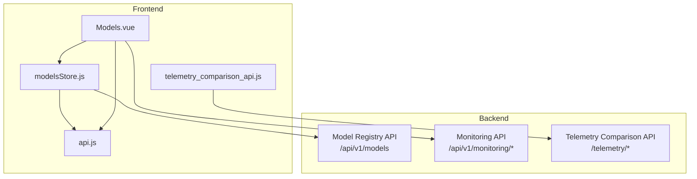
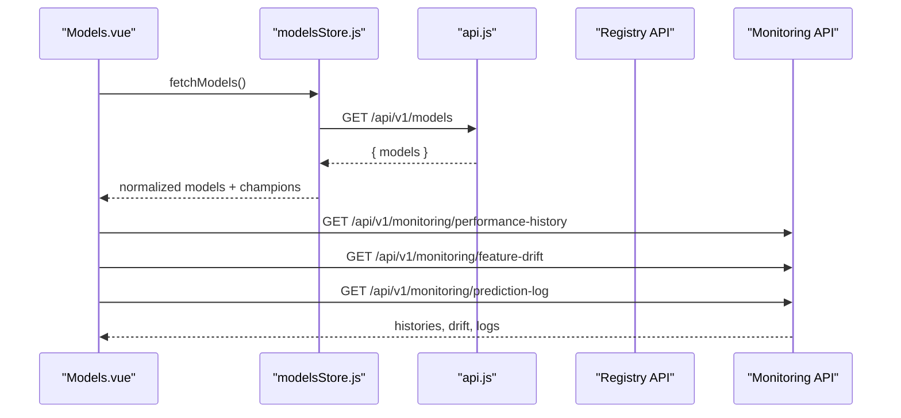
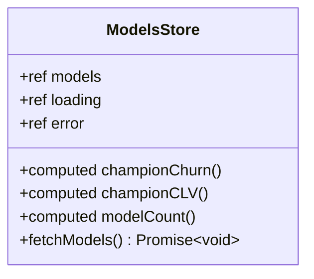
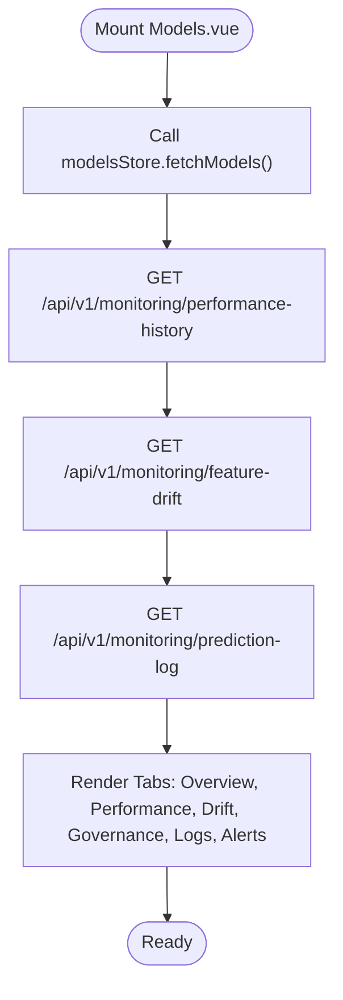
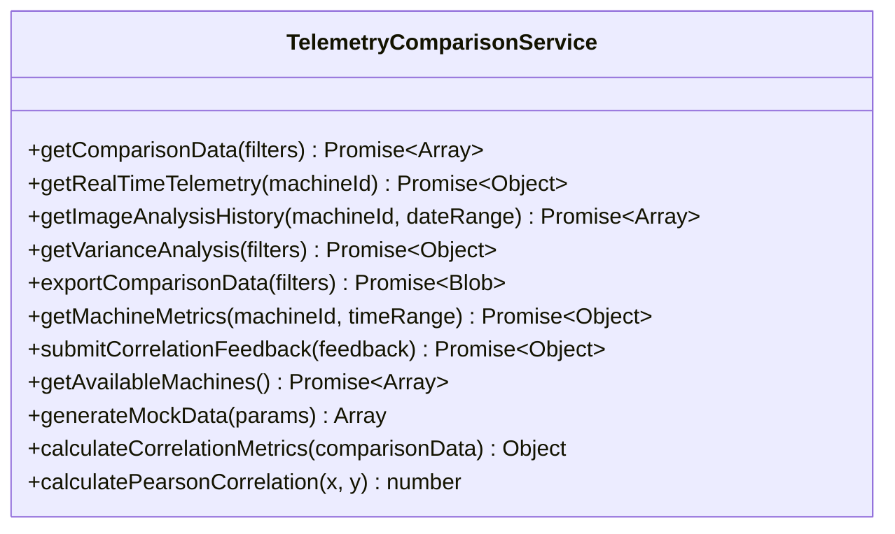
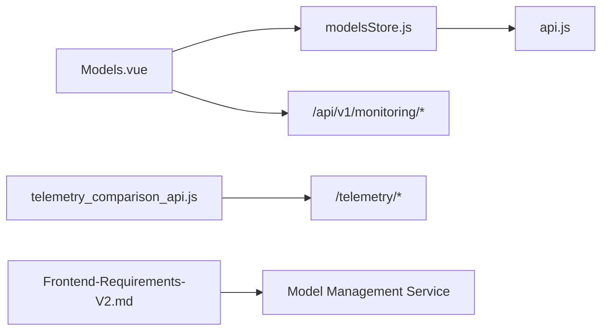

# Model Registry & Version Control

<cite>
**Referenced Files in This Document**
- [modelsStore.js](file://src/stores/modelsStore.js)
- [Models.vue](file://src/views/Modules/aiagents/Models.vue)
- [api.js](file://src/services/api.js)
- [telemetry_comparison_api.js](file://src/services/telemetry_comparison_api.js)
- [Frontend-Requirements-V2.md](file://docs/Frontend-Requirements-V2.md)
</cite>

## Table of Contents
1. [Introduction](#introduction)
2. [Project Structure](#project-structure)
3. [Core Components](#core-components)
4. [Architecture Overview](#architecture-overview)
5. [Detailed Component Analysis](#detailed-component-analysis)
6. [Dependency Analysis](#dependency-analysis)
7. [Performance Considerations](#performance-considerations)
8. [Troubleshooting Guide](#troubleshooting-guide)
9. [Conclusion](#conclusion)
10. [Appendices](#appendices)

## Introduction
This document explains the model registry and version control system as implemented in the frontend. It covers how models are registered, stored, and tracked through their lifecycle versions; how the champion/challenger framework is surfaced for comparing model versions and performance metrics; how model metadata (algorithm, training data references, feature schemas, deployment status) is managed; and how the UI integrates with the backend model registry API and local state management patterns. It also includes examples for registering new model versions, comparing performance across versions, and managing dependencies, along with rollback procedures supported by the UI.

## Project Structure
The model registry functionality spans a Pinia store, a dedicated view for model governance and monitoring, shared API utilities, and a telemetry comparison service used for performance analysis. The key files are:
- Store: centralizes model list, loading/error states, and computed champion selection
- View: presents model overview, performance, drift, governance, logs, and alerts
- Services: base API configuration and interceptors; telemetry comparison helpers
- Requirements doc: maps frontend domains to backend services including the Model Management Service

**Diagram sources**
- [modelsStore.js:31-50](file://src/stores/modelsStore.js#L31-L50)
- [Models.vue:828-861](file://src/views/Modules/aiagents/Models.vue#L828-L861)
- [api.js:64-76](file://src/services/api.js#L64-L76)
- [telemetry_comparison_api.js:15-30](file://src/services/telemetry_comparison_api.js#L15-L30)

**Section sources**
- [modelsStore.js:1-53](file://src/stores/modelsStore.js#L1-L53)
- [Models.vue:1-120](file://src/views/Modules/aiagents/Models.vue#L1-L120)
- [api.js:1-209](file://src/services/api.js#L1-L209)
- [telemetry_comparison_api.js:1-252](file://src/services/telemetry_comparison_api.js#L1-L252)
- [Frontend-Requirements-V2.md:575-590](file://docs/Frontend-Requirements-V2.md#L575-L590)

## Core Components
- Model Store (Pinia): Holds the current set of models, loading/error state, and exposes computed champions per model type. It fetches models from the backend registry and normalizes fields for UI consumption.
- Models View: Provides tabs for Overview, Performance, Drift & Stability, Governance, Prediction Logs, and Alerts. It displays champion model KPIs, confusion matrix, threshold sensitivity, PSI-based drift monitoring, governance card, audit history, and live prediction logs.
- API Layer: Centralized Axios instance with auth header injection and token refresh handling. Base URL resolution supports local and hosted backends.
- Telemetry Comparison Service: Utility for fetching and analyzing telemetry vs image analysis data, including correlation metrics and mock data generation.

Key responsibilities:
- Fetch and normalize model registry entries
- Identify champion models by type
- Surface performance metrics and drift signals
- Present governance and audit trails
- Integrate with monitoring endpoints for historical performance and drift

**Section sources**
- [modelsStore.js:15-53](file://src/stores/modelsStore.js#L15-L53)
- [Models.vue:623-715](file://src/views/Modules/aiagents/Models.vue#L623-L715)
- [api.js:64-76](file://src/services/api.js#L64-L76)
- [telemetry_comparison_api.js:15-30](file://src/services/telemetry_comparison_api.js#L15-L30)

## Architecture Overview
The frontend uses a layered architecture:
- UI layer (Models.vue) orchestrates user interactions and renders tabs for model governance and monitoring
- State layer (modelsStore.js) manages model data and derived state (champions)
- API layer (api.js) handles HTTP requests, authentication headers, and token refresh
- Backend integration points:
  - /api/v1/models for registry listing
  - /api/v1/monitoring/* for performance history, feature drift, and prediction logs
  - /telemetry/* for comparative analytics via TelemetryComparisonService

**Diagram sources**
- [modelsStore.js:31-50](file://src/stores/modelsStore.js#L31-L50)
- [Models.vue:828-861](file://src/views/Modules/aiagents/Models.vue#L828-L861)
- [api.js:64-76](file://src/services/api.js#L64-L76)

## Detailed Component Analysis

### Model Store: Champion Selection and Normalization
- Maintains reactive state for models, loading, and error
- Exposes computed properties to find champion models by type (e.g., churn, CLV)
- Normalizes backend model entries into a consistent shape for UI consumption
- Handles errors gracefully and resets state on failure

**Diagram sources**
- [modelsStore.js:15-53](file://src/stores/modelsStore.js#L15-L53)

**Section sources**
- [modelsStore.js:15-53](file://src/stores/modelsStore.js#L15-L53)

### Models View: Lifecycle, Metadata, and Monitoring
- Displays model details, status, and risk tier
- Presents KPIs such as AUC-ROC, Log Loss, Brier Score, KS Stat, F1 Score, and model version
- Shows confusion matrix with adjustable threshold and derived metrics
- Tracks feature drift using PSI thresholds and visual indicators
- Governance tab shows model card fields, approval lifecycle, risk classification, and audit log
- Prediction logs tab shows real-time inference stream with latency and classification
- Alerts tab lists active and resolved alerts with severity and actions

**Diagram sources**
- [Models.vue:828-861](file://src/views/Modules/aiagents/Models.vue#L828-L861)

**Section sources**
- [Models.vue:1-120](file://src/views/Modules/aiagents/Models.vue#L1-L120)
- [Models.vue:623-715](file://src/views/Modules/aiagents/Models.vue#L623-L715)
- [Models.vue:755-810](file://src/views/Modules/aiagents/Models.vue#L755-L810)

### Telemetry Comparison Service: Performance Metrics and Correlation
- Provides methods to fetch comparison data, real-time telemetry, image analysis history, variance analysis, export, machine metrics, and feedback submission
- Includes utility functions to calculate correlation metrics and Pearson correlation coefficient
- Supports mock data generation for development/testing

**Diagram sources**
- [telemetry_comparison_api.js:9-252](file://src/services/telemetry_comparison_api.js#L9-L252)

**Section sources**
- [telemetry_comparison_api.js:15-30](file://src/services/telemetry_comparison_api.js#L15-L30)
- [telemetry_comparison_api.js:199-252](file://src/services/telemetry_comparison_api.js#L199-L252)

## Dependency Analysis
- modelsStore depends on api.js for base URL and axios interceptor configuration
- Models.vue consumes modelsStore and calls monitoring endpoints directly
- TelemetryComparisonService encapsulates telemetry-related API calls and computations
- Frontend requirements map the Model Registry and Drift domain to a backend Model Management Service

**Diagram sources**
- [modelsStore.js:1-12](file://src/stores/modelsStore.js#L1-L12)
- [Models.vue:828-861](file://src/views/Modules/aiagents/Models.vue#L828-L861)
- [telemetry_comparison_api.js:15-30](file://src/services/telemetry_comparison_api.js#L15-L30)
- [Frontend-Requirements-V2.md:575-590](file://docs/Frontend-Requirements-V2.md#L575-L590)

**Section sources**
- [modelsStore.js:1-12](file://src/stores/modelsStore.js#L1-L12)
- [Models.vue:828-861](file://src/views/Modules/aiagents/Models.vue#L828-L861)
- [telemetry_comparison_api.js:15-30](file://src/services/telemetry_comparison_api.js#L15-L30)
- [Frontend-Requirements-V2.md:575-590](file://docs/Frontend-Requirements-V2.md#L575-L590)

## Performance Considerations
- Use computed properties for derived values (e.g., champion selection, KPIs) to avoid redundant calculations
- Batch monitoring requests where possible to reduce network overhead
- Debounce or throttle frequent updates (e.g., live prediction logs) to maintain UI responsiveness
- Cache telemetry comparison results when feasible to minimize repeated computations
- Ensure proper error handling and fallbacks to keep the UI stable under network failures

[No sources needed since this section provides general guidance]

## Troubleshooting Guide
Common issues and resolutions:
- Authentication failures: The API layer automatically injects Authorization headers and refreshes tokens on 401 responses. If login is required, users are redirected to the login page.
- Model fetch failures: The store sets an error message and clears models on failure; check console warnings and ensure the backend endpoint is reachable.
- Monitoring data missing: If performance history, drift, or prediction logs fail to load, the UI will render empty states; verify backend availability and request parameters.
- Token expiration: On 401, the interceptor attempts to refresh tokens; if refresh fails, users are prompted to re-authenticate.

**Section sources**
- [api.js:64-146](file://src/services/api.js#L64-L146)
- [modelsStore.js:31-50](file://src/stores/modelsStore.js#L31-L50)

## Conclusion
The frontend implements a robust model registry and version control interface centered around a Pinia store and a comprehensive Vue view. It surfaces champion models, tracks lifecycle versions, monitors drift and performance, and maintains governance and audit trails. Integration with backend APIs enables retrieval of registry data, monitoring metrics, and telemetry comparisons. The design supports clear workflows for model registration, version tagging, performance comparison, and rollback procedures via governance controls and alerting.

[No sources needed since this section summarizes without analyzing specific files]

## Appendices

### Example Workflows

#### Register a New Model Version
- Trigger retraining from the UI (“Request Retrain”) and monitor progress via governance and alerts tabs
- After validation, promote a candidate to champion via backend registry operations (not exposed in UI code here)
- Verify champion selection by checking modelsStore computed properties and UI display

**Section sources**
- [Models.vue:38-45](file://src/views/Modules/aiagents/Models.vue#L38-L45)
- [modelsStore.js:21-28](file://src/stores/modelsStore.js#L21-L28)

#### Compare Model Performance Across Versions
- Use the Performance tab to inspect confusion matrix, threshold sensitivity, and segment-level metrics
- Review historical performance via monitoring endpoints and visualize trends in the Overview tab
- Leverage telemetry comparison service for additional correlation insights

**Section sources**
- [Models.vue:158-288](file://src/views/Modules/aiagents/Models.vue#L158-L288)
- [Models.vue:828-861](file://src/views/Modules/aiagents/Models.vue#L828-L861)
- [telemetry_comparison_api.js:199-252](file://src/services/telemetry_comparison_api.js#L199-L252)

#### Manage Model Dependencies
- Feature drift monitoring highlights changes in input distributions that may require dependency updates
- Governance tab documents algorithm, training cutoff, feature schema, and sampling strategy
- Audit log records version changes and validations for traceability

**Section sources**
- [Models.vue:294-377](file://src/views/Modules/aiagents/Models.vue#L294-L377)
- [Models.vue:779-810](file://src/views/Modules/aiagents/Models.vue#L779-L810)

#### Rollback Procedures
- In case of performance degradation or drift alerts, revert to a previous approved version via backend registry operations
- Use governance and audit logs to identify stable versions and validate rollback decisions
- Monitor post-rollback metrics to confirm stability

**Section sources**
- [Models.vue:382-470](file://src/views/Modules/aiagents/Models.vue#L382-L470)
- [Models.vue:804-810](file://src/views/Modules/aiagents/Models.vue#L804-L810)