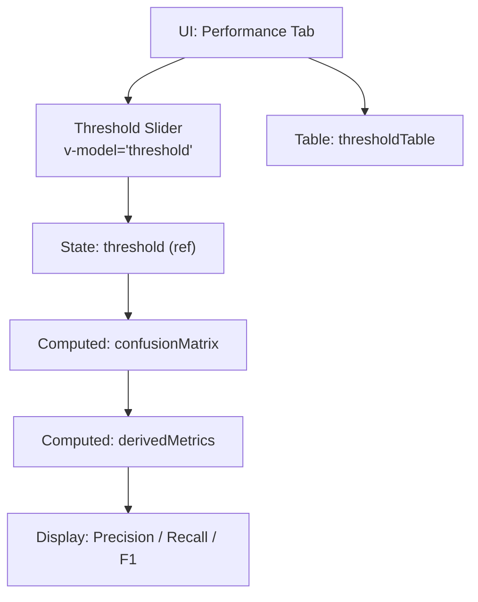
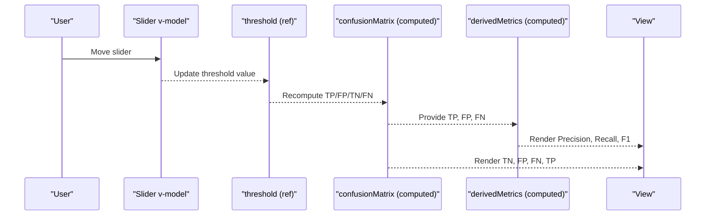
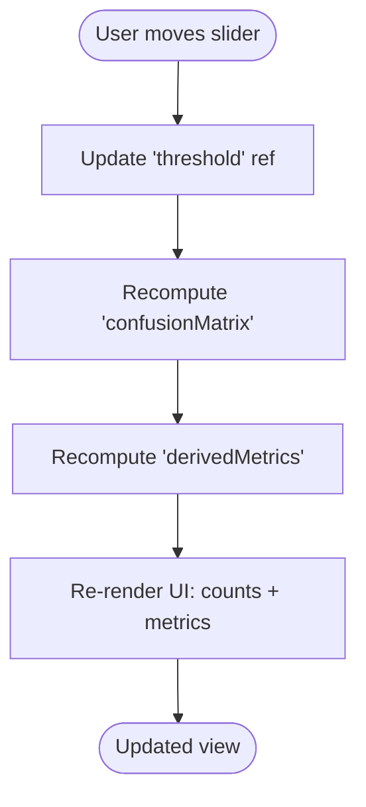
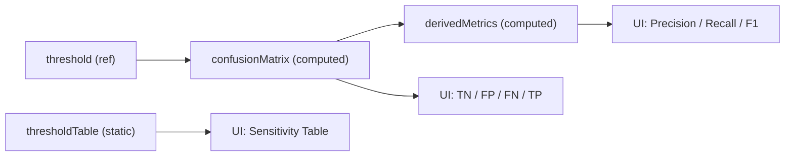

# Confusion Matrix & Threshold Analysis

<cite>
**Referenced Files in This Document**
- [Models.vue](file://src/views/Modules/aiagents/Models.vue)
</cite>

## Table of Contents
1. [Introduction](#introduction)
2. [Project Structure](#project-structure)
3. [Core Components](#core-components)
4. [Architecture Overview](#architecture-overview)
5. [Detailed Component Analysis](#detailed-component-analysis)
6. [Dependency Analysis](#dependency-analysis)
7. [Performance Considerations](#performance-considerations)
8. [Troubleshooting Guide](#troubleshooting-guide)
9. [Conclusion](#conclusion)
10. [Appendices](#appendices)

## Introduction
This document explains the interactive confusion matrix and threshold analysis features for model evaluation. It focuses on how true positives, false positives, true negatives, and false negatives are displayed at configurable decision thresholds, how the threshold slider updates metrics in real time, and how derived metrics (precision, recall, F1 score) are computed from the selected threshold. It also provides practical examples to guide model evaluation and threshold optimization decisions.

## Project Structure
The confusion matrix and threshold analysis are implemented within a single Vue component that renders:
- A performance tab containing the interactive confusion matrix with a threshold slider
- Derived metrics (precision, recall, F1) computed reactively from the current threshold
- A threshold sensitivity table showing precision, recall, F1, false positive rate, estimated cost, and recommended threshold across several candidate values

**Diagram sources**
- [Models.vue:158-211](file://src/views/Modules/aiagents/Models.vue#L158-L211)
- [Models.vue:717-735](file://src/views/Modules/aiagents/Models.vue#L717-L735)
- [Models.vue:250-288](file://src/views/Modules/aiagents/Models.vue#L250-L288)
- [Models.vue:746-753](file://src/views/Modules/aiagents/Models.vue#L746-L753)

**Section sources**
- [Models.vue:158-211](file://src/views/Modules/aiagents/Models.vue#L158-L211)
- [Models.vue:250-288](file://src/views/Modules/aiagents/Models.vue#L250-L288)
- [Models.vue:717-735](file://src/views/Modules/aiagents/Models.vue#L717-L735)
- [Models.vue:746-753](file://src/views/Modules/aiagents/Models.vue#L746-L753)

## Core Components
- Interactive confusion matrix panel with a threshold slider
- Reactive computation of confusion counts based on the current threshold
- Reactive computation of derived metrics (precision, recall, F1) from confusion counts
- Threshold sensitivity table summarizing trade-offs across multiple thresholds

Key responsibilities:
- Maintain the current threshold value via a reactive reference
- Compute confusion matrix counts as a function of the threshold
- Compute precision, recall, and F1 from the confusion counts
- Present a static but informative threshold sensitivity table for comparison

**Section sources**
- [Models.vue:167-211](file://src/views/Modules/aiagents/Models.vue#L167-L211)
- [Models.vue:717-735](file://src/views/Modules/aiagents/Models.vue#L717-L735)
- [Models.vue:250-288](file://src/views/Modules/aiagents/Models.vue#L250-L288)
- [Models.vue:746-753](file://src/views/Modules/aiagents/Models.vue#L746-L753)

## Architecture Overview
The feature follows a simple reactive pipeline:
- User adjusts the threshold slider
- The threshold value updates the computed confusion matrix
- Derived metrics update automatically from the confusion matrix
- The UI re-renders to show updated counts and metrics

**Diagram sources**
- [Models.vue:167-172](file://src/views/Modules/aiagents/Models.vue#L167-L172)
- [Models.vue:717-735](file://src/views/Modules/aiagents/Models.vue#L717-L735)

## Detailed Component Analysis

### Confusion Matrix Panel
- Displays four quadrants: True Negative, False Positive, False Negative, True Positive
- Each quadrant shows a label, count, and short interpretation
- The header indicates the active decision threshold used to compute the counts

Behavior:
- The threshold is controlled by an input range bound to a reactive variable
- As the threshold changes, the confusion counts update immediately

Implementation highlights:
- Threshold state: a reactive reference initialized to a default value
- Computed confusion matrix: returns TN, FP, FN, TP as functions of the current threshold
- Derived metrics: computed from TP, FP, FN to produce precision, recall, and F1

Practical usage:
- Lower thresholds increase predicted positives, typically increasing TP and FP while decreasing TN and FN
- Higher thresholds decrease predicted positives, typically increasing TN and FN while decreasing TP and FP

**Section sources**
- [Models.vue:161-211](file://src/views/Modules/aiagents/Models.vue#L161-L211)
- [Models.vue:717-735](file://src/views/Modules/aiagents/Models.vue#L717-L735)

### Threshold Slider
- Binds to the threshold reactive variable with a defined min, max, and step
- Provides immediate feedback by displaying the current threshold value next to the slider

Impact:
- Changing the slider value triggers recomputation of the confusion matrix and derived metrics
- Enables rapid exploration of how classification behavior shifts with different cutoffs

**Section sources**
- [Models.vue:167-172](file://src/views/Modules/aiagents/Models.vue#L167-L172)
- [Models.vue:717-718](file://src/views/Modules/aiagents/Models.vue#L717-L718)

### Derived Metrics Calculation
Derived metrics are computed from the confusion matrix counts:
- Precision = TP / (TP + FP), guarded against division by zero
- Recall = TP / (TP + FN), guarded against division by zero
- F1 Score = harmonic mean of precision and recall, guarded against invalid inputs

These computations are encapsulated in a computed property so they update whenever the confusion matrix changes.

**Section sources**
- [Models.vue:728-735](file://src/views/Modules/aiagents/Models.vue#L728-L735)

### Threshold Sensitivity Table
A table summarizes performance across several candidate thresholds, including:
- Threshold value
- Precision, Recall, F1 Score
- False Positive Rate
- Estimated Cost (Interventions)
- Recommended flag indicating an optimal or preferred choice

Use this table to compare trade-offs and select a threshold aligned with business objectives (e.g., minimizing false positives vs. maximizing recall).

**Section sources**
- [Models.vue:250-288](file://src/views/Modules/aiagents/Models.vue#L250-L288)
- [Models.vue:746-753](file://src/views/Modules/aiagents/Models.vue#L746-L753)

### Data Flow and Reactivity

**Diagram sources**
- [Models.vue:167-172](file://src/views/Modules/aiagents/Models.vue#L167-L172)
- [Models.vue:717-735](file://src/views/Modules/aiagents/Models.vue#L717-L735)

## Dependency Analysis
- The confusion matrix and derived metrics depend only on the local reactive state (threshold) and computed properties
- No external services or stores are required for these specific features; they are self-contained within the component
- The threshold sensitivity table uses a static array to present precomputed scenarios for quick comparison

**Diagram sources**
- [Models.vue:717-735](file://src/views/Modules/aiagents/Models.vue#L717-L735)
- [Models.vue:746-753](file://src/views/Modules/aiagents/Models.vue#L746-L753)

**Section sources**
- [Models.vue:717-735](file://src/views/Modules/aiagents/Models.vue#L717-L735)
- [Models.vue:746-753](file://src/views/Modules/aiagents/Models.vue#L746-L753)

## Performance Considerations
- Computations are lightweight and run only when the threshold changes due to Vue’s reactivity
- Avoid heavy operations inside computed properties; keep them focused on deriving metrics from small datasets
- For large-scale evaluations, consider moving complex calculations to a worker or backend endpoint if needed

[No sources needed since this section provides general guidance]

## Troubleshooting Guide
Common issues and resolutions:
- Division by zero in precision/recall: The implementation guards against zero denominators and returns a placeholder when necessary
- Unexpected metric jumps: Verify the threshold slider range and step; ensure the underlying confusion matrix logic matches expectations
- Misleading recommendations: Review the threshold sensitivity table’s assumptions (e.g., cost estimates, FP rates) and adjust business criteria accordingly

**Section sources**
- [Models.vue:728-735](file://src/views/Modules/aiagents/Models.vue#L728-L735)
- [Models.vue:250-288](file://src/views/Modules/aiagents/Models.vue#L250-L288)

## Conclusion
The interactive confusion matrix and threshold analysis provide a clear, real-time view of how classification outcomes change with the decision threshold. By adjusting the slider, users can observe immediate effects on true/false positives/negatives and derived metrics. The threshold sensitivity table complements this by presenting comparative insights across multiple thresholds, supporting informed decisions that balance precision, recall, and operational costs.

[No sources needed since this section summarizes without analyzing specific files]

## Appendices

### Practical Examples

- Example 1: Prioritizing high recall (catching most churners)
  - Move the threshold lower to increase predicted positives
  - Observe increases in TP and FP, decreases in TN and FN
  - Expect higher recall and potentially lower precision; use the sensitivity table to quantify trade-offs

- Example 2: Prioritizing high precision (minimizing false alarms)
  - Move the threshold higher to reduce predicted positives
  - Observe increases in TN and FN, decreases in TP and FP
  - Expect higher precision and potentially lower recall; review FP rate and cost in the sensitivity table

- Example 3: Selecting an optimal threshold
  - Use the threshold sensitivity table to identify a balanced point where F1 is strong and FP rate/cost align with business constraints
  - Validate the chosen threshold using the interactive confusion matrix to confirm expected TP/FP/TN/FN behavior

[No sources needed since this section provides conceptual guidance]