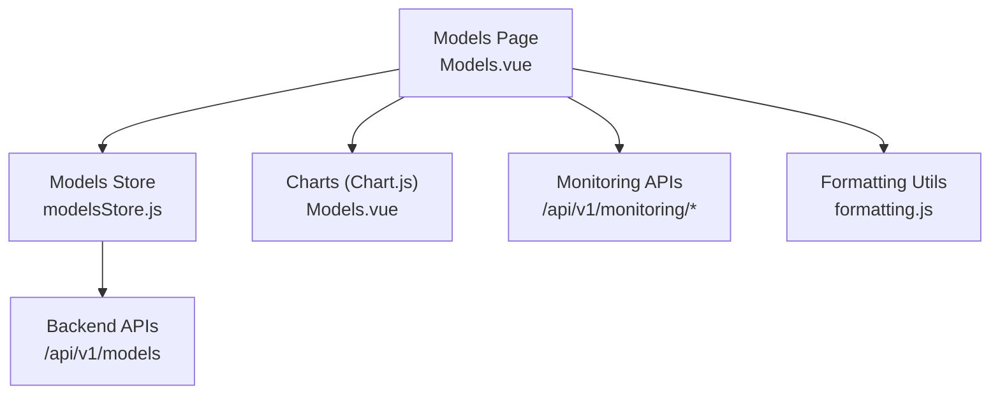
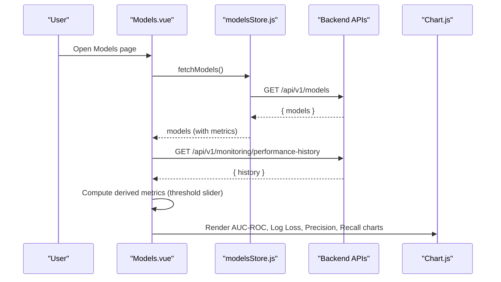
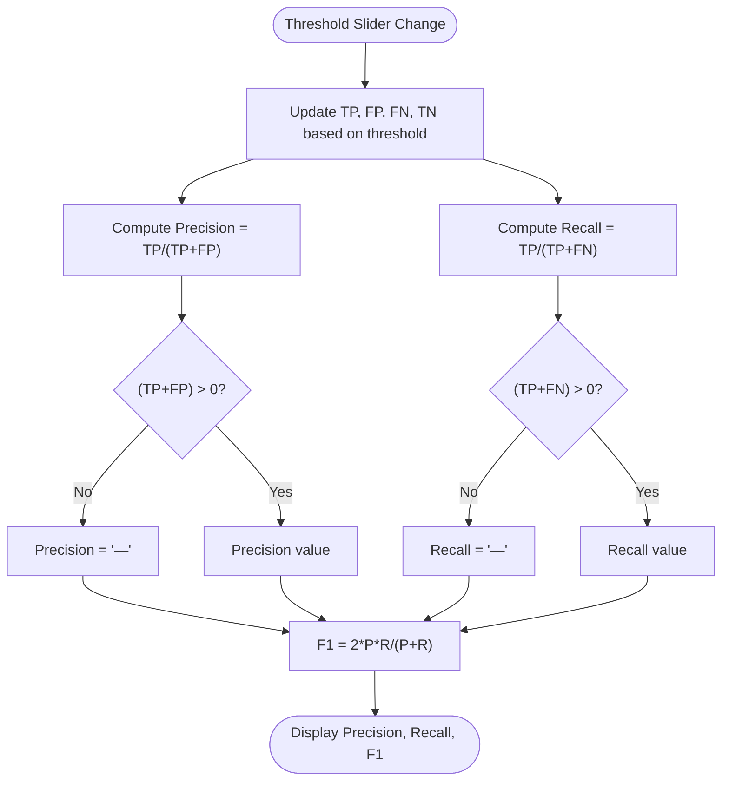
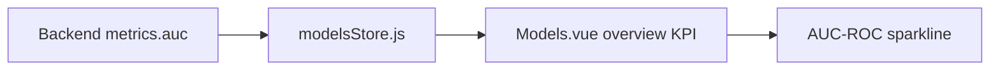
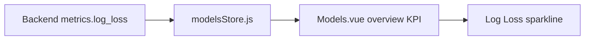
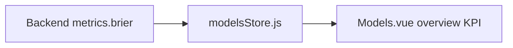
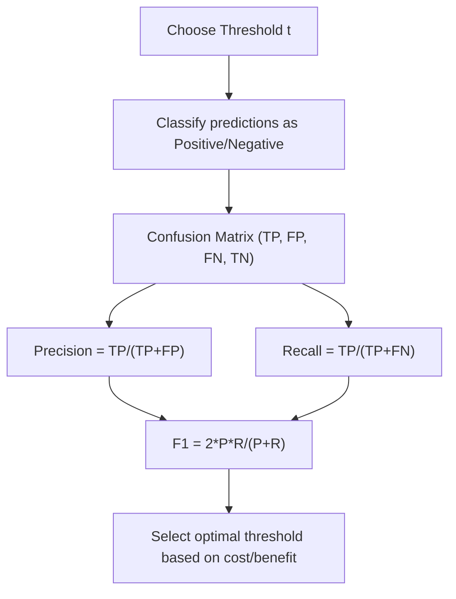
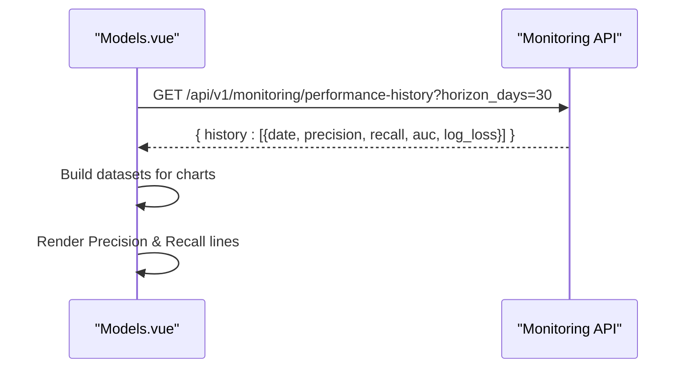
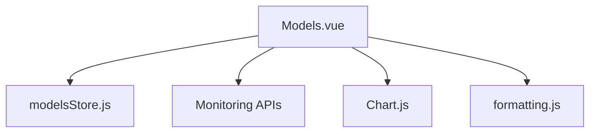

# Metrics Calculation & KPIs

<cite>
**Referenced Files in This Document**
- [Models.vue](file://src/views/Modules/aiagents/Models.vue)
- [modelsStore.js](file://src/stores/modelsStore.js)
- [formatting.js](file://src/utils/formatting.js)
</cite>

## Table of Contents
1. Introduction
2. Project Structure
3. Core Components
4. Architecture Overview
5. Detailed Component Analysis
6. Dependency Analysis
7. Performance Considerations
8. Troubleshooting Guide
9. Conclusion

## Introduction
This document explains how model metrics and KPIs are calculated and presented in the application, focusing on AUC-ROC, F1 score, precision, recall, log loss, and Brier score. It details threshold-based metric computation using a confusion matrix, shows where calculations occur in the codebase, and provides interpretation guidelines for each KPI. The goal is to make metric computation transparent and actionable for both technical and non-technical users.

## Project Structure
The metrics-related logic is primarily implemented in the AI Agents Models page, with supporting data fetched via a store and formatting utilities used elsewhere in the app. Key locations:
- Model metrics display and threshold-driven computations: Models.vue
- Model registry and metrics ingestion from backend: modelsStore.js
- Number and percentage formatting helpers (used across the app): formatting.js

**Diagram sources**
- [Models.vue:623-860](file://src/views/Modules/aiagents/Models.vue#L623-L860)
- [modelsStore.js:15-52](file://src/stores/modelsStore.js#L15-L52)
- [formatting.js:1-60](file://src/utils/formatting.js#L1-L60)

**Section sources**
- [Models.vue:623-860](file://src/views/Modules/aiagents/Models.vue#L623-L860)
- [modelsStore.js:15-52](file://src/stores/modelsStore.js#L15-L52)
- [formatting.js:1-60](file://src/utils/formatting.js#L1-L60)

## Core Components
- Threshold slider and confusion matrix: The page exposes a threshold slider that updates TP, FP, FN, TN counts and derives Precision, Recall, and F1 at the chosen threshold.
- Metric cards: AUC-ROC, Log Loss, and Brier Score are shown as overview KPIs, sourced from the model metrics object or fallback values when backend data is unavailable.
- Time-series charts: Precision and Recall over time are plotted using monitoring history; AUC-ROC and Log Loss sparklines visualize recent trends.
- Segment performance table: Shows AUC-ROC and F1 by customer segment for fairness monitoring.

**Section sources**
- [Models.vue:158-211](file://src/views/Modules/aiagents/Models.vue#L158-L211)
- [Models.vue:686-704](file://src/views/Modules/aiagents/Models.vue#L686-L704)
- [Models.vue:867-923](file://src/views/Modules/aiagents/Models.vue#L867-L923)

## Architecture Overview
The flow of metric data and computation:
- The Models page fetches model metadata and monitoring data.
- Model metrics (AUC-ROC, Log Loss, Brier) are read from the store’s model metrics object.
- Threshold-based metrics (Precision, Recall, F1) are computed locally from a simulated confusion matrix driven by the threshold slider.
- Time-series charts render historical Precision and Recall, plus AUC-ROC and Log Loss sparklines.

**Diagram sources**
- [Models.vue:828-860](file://src/views/Modules/aiagents/Models.vue#L828-L860)
- [modelsStore.js:31-50](file://src/stores/modelsStore.js#L31-L50)

## Detailed Component Analysis

### Confusion Matrix and Threshold-Based Metrics
At a chosen decision threshold t, predictions are binarized into positive/negative classes. The confusion matrix counts:
- True Positives (TP), False Positives (FP), False Negatives (FN), True Negatives (TN).

Derived metrics:
- Precision = TP / (TP + FP)
- Recall = TP / (TP + FN)
- F1 Score = 2 * Precision * Recall / (Precision + Recall)

Implementation highlights:
- The threshold slider drives a computed confusion matrix and derived metrics.
- When denominators are zero, the code returns placeholders to avoid division-by-zero errors.

**Diagram sources**
- [Models.vue:717-735](file://src/views/Modules/aiagents/Models.vue#L717-L735)

**Section sources**
- [Models.vue:167-211](file://src/views/Modules/aiagents/Models.vue#L167-L211)
- [Models.vue:717-735](file://src/views/Modules/aiagents/Models.vue#L717-L735)

### AUC-ROC
- Purpose: Measures the model’s ability to discriminate between classes across all thresholds. Higher is better.
- Source: Displayed as an overview KPI and sparkline trend. Values come from the model metrics object or fallback defaults if not provided by the backend.
- Interpretation:
  - ~0.5: No discrimination
  - 0.7–0.8: Acceptable
  - 0.8–0.9: Excellent
  - >0.9: Outstanding

**Diagram sources**
- [modelsStore.js:36-42](file://src/stores/modelsStore.js#L36-L42)
- [Models.vue:686-704](file://src/views/Modules/aiagents/Models.vue#L686-L704)
- [Models.vue:875-893](file://src/views/Modules/aiagents/Models.vue#L875-L893)

**Section sources**
- [Models.vue:686-704](file://src/views/Modules/aiagents/Models.vue#L686-L704)
- [Models.vue:875-893](file://src/views/Modules/aiagents/Models.vue#L875-L893)
- [modelsStore.js:36-42](file://src/stores/modelsStore.js#L36-L42)

### Log Loss
- Purpose: Penalizes confident wrong predictions; lower is better.
- Source: Displayed as an overview KPI and sparkline trend from model metrics or fallback defaults.
- Interpretation:
  - Closer to 0 indicates well-calibrated probabilities.
  - Sudden increases may indicate data drift or model degradation.

**Diagram sources**
- [modelsStore.js:36-42](file://src/stores/modelsStore.js#L36-L42)
- [Models.vue:686-704](file://src/views/Modules/aiagents/Models.vue#L686-L704)
- [Models.vue:875-899](file://src/views/Modules/aiagents/Models.vue#L875-L899)

**Section sources**
- [Models.vue:686-704](file://src/views/Modules/aiagents/Models.vue#L686-L704)
- [Models.vue:875-899](file://src/views/Modules/aiagents/Models.vue#L875-L899)
- [modelsStore.js:36-42](file://src/stores/modelsStore.js#L36-L42)

### Brier Score
- Purpose: Measures calibration quality for binary outcomes; lower is better.
- Source: Displayed as an overview KPI from model metrics or fallback defaults.
- Interpretation:
  - Near 0 indicates excellent calibration.
  - Higher values suggest miscalibration even if discrimination (AUC) is good.

**Diagram sources**
- [modelsStore.js:36-42](file://src/stores/modelsStore.js#L36-L42)
- [Models.vue:686-704](file://src/views/Modules/aiagents/Models.vue#L686-L704)

**Section sources**
- [Models.vue:686-704](file://src/views/Modules/aiagents/Models.vue#L686-L704)
- [modelsStore.js:36-42](file://src/stores/modelsStore.js#L36-L42)

### Precision, Recall, and F1 Score (Threshold-Based)
- Precision: Among predicted positives, how many are actually positive. Important when false alarms are costly.
- Recall: Among actual positives, how many were correctly identified. Critical when missing positives is risky.
- F1 Score: Harmonic mean of Precision and Recall; balances both.

Business implications:
- Lower threshold increases Recall but may reduce Precision (more false positives).
- Higher threshold increases Precision but may reduce Recall (more false negatives).
- Choose threshold based on business cost trade-offs (e.g., intervention costs vs. missed churners).

**Diagram sources**
- [Models.vue:717-735](file://src/views/Modules/aiagents/Models.vue#L717-L735)

**Section sources**
- [Models.vue:167-211](file://src/views/Modules/aiagents/Models.vue#L167-L211)
- [Models.vue:717-735](file://src/views/Modules/aiagents/Models.vue#L717-L735)

### Time-Series Monitoring (Precision & Recall)
- The page renders Precision and Recall over a rolling window (e.g., last 30 days) to detect performance drift.
- Data is sourced from monitoring endpoints; fallback series are used when no data is available.

**Diagram sources**
- [Models.vue:828-860](file://src/views/Modules/aiagents/Models.vue#L828-L860)
- [Models.vue:875-923](file://src/views/Modules/aiagents/Models.vue#L875-L923)

**Section sources**
- [Models.vue:828-860](file://src/views/Modules/aiagents/Models.vue#L828-L860)
- [Models.vue:875-923](file://src/views/Modules/aiagents/Models.vue#L875-L923)

### Segment-Level Performance
- AUC-ROC and F1 are shown per customer segment to support fairness monitoring and targeted improvements.

**Section sources**
- [Models.vue:214-247](file://src/views/Modules/aiagents/Models.vue#L214-L247)

## Dependency Analysis
- Models.vue depends on:
  - modelsStore.js for model registry and metrics.
  - Monitoring APIs for performance history and feature drift.
  - Chart.js for visualizations.
  - Formatting utilities for consistent number/percentage presentation elsewhere in the app.

**Diagram sources**
- [Models.vue:623-860](file://src/views/Modules/aiagents/Models.vue#L623-L860)
- [modelsStore.js:15-52](file://src/stores/modelsStore.js#L15-L52)
- [formatting.js:1-60](file://src/utils/formatting.js#L1-L60)

**Section sources**
- [Models.vue:623-860](file://src/views/Modules/aiagents/Models.vue#L623-L860)
- [modelsStore.js:15-52](file://src/stores/modelsStore.js#L15-L52)
- [formatting.js:1-60](file://src/utils/formatting.js#L1-L60)

## Performance Considerations
- Avoid unnecessary recomputation: Derived metrics are computed only when the threshold changes.
- Use efficient chart rendering: Sparklines and main charts reuse datasets and options to minimize redraw overhead.
- Guard against division by zero: Precision/Recall/F1 computations handle edge cases gracefully.

[No sources needed since this section provides general guidance]

## Troubleshooting Guide
- Missing backend metrics: If model metrics are not returned, the UI falls back to default values for AUC-ROC, Log Loss, and Brier. Verify the backend response structure and ensure fields like auc, log_loss, and brier are present.
- Empty monitoring history: If performance history is empty, charts use fallback series. Confirm the monitoring endpoint returns valid arrays.
- Threshold sensitivity anomalies: If Precision/Recall/F1 appear unstable, check the confusion matrix derivation and ensure the threshold range covers meaningful operating points.

**Section sources**
- [Models.vue:686-704](file://src/views/Modules/aiagents/Models.vue#L686-L704)
- [Models.vue:828-860](file://src/views/Modules/aiagents/Models.vue#L828-L860)
- [Models.vue:717-735](file://src/views/Modules/aiagents/Models.vue#L717-L735)

## Conclusion
The application computes and displays key classification metrics through a combination of backend-provided scores and local threshold-based calculations. AUC-ROC, Log Loss, and Brier Score provide global performance and calibration insights, while Precision, Recall, and F1 offer actionable guidance for threshold selection aligned with business objectives. Continuous monitoring via time-series charts and segment-level breakdowns supports ongoing model governance and fairness compliance.

[No sources needed since this section summarizes without analyzing specific files]