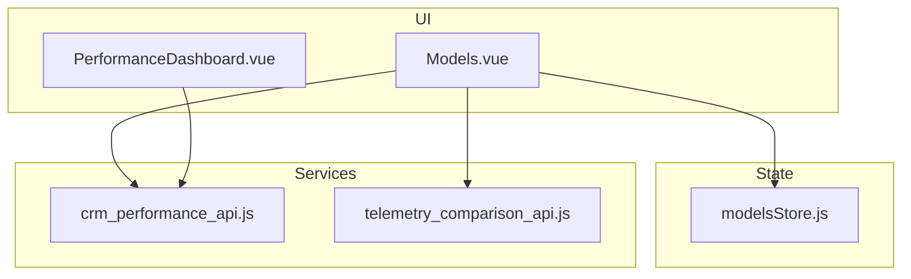
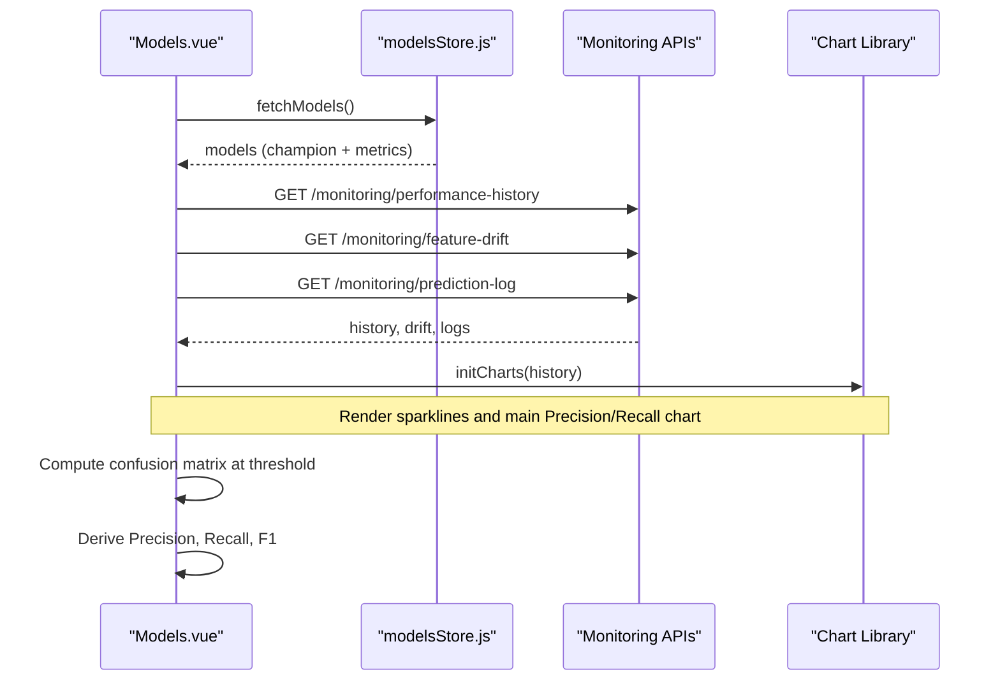
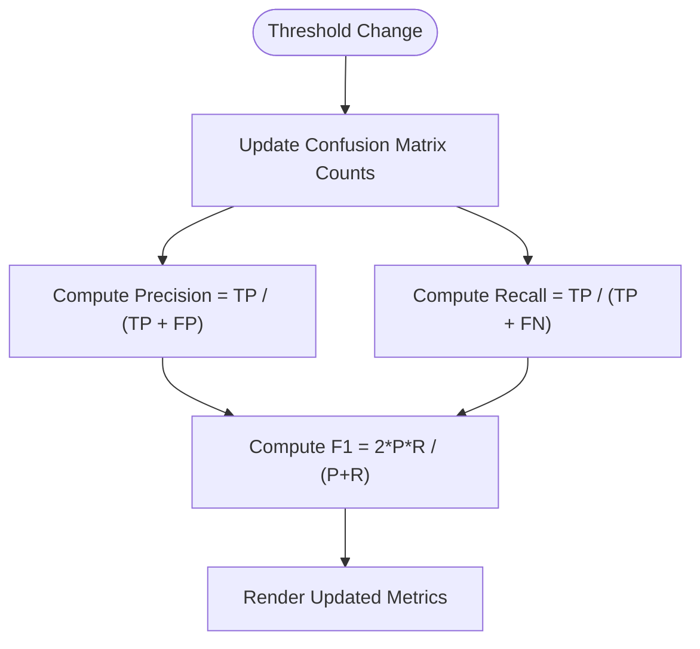
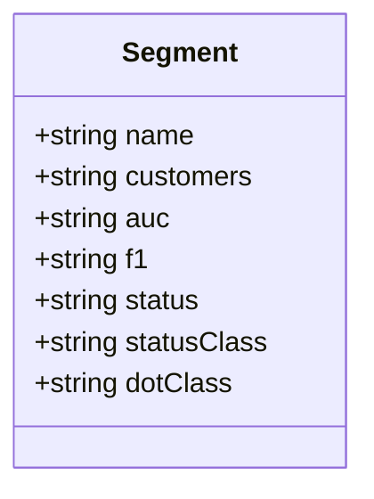
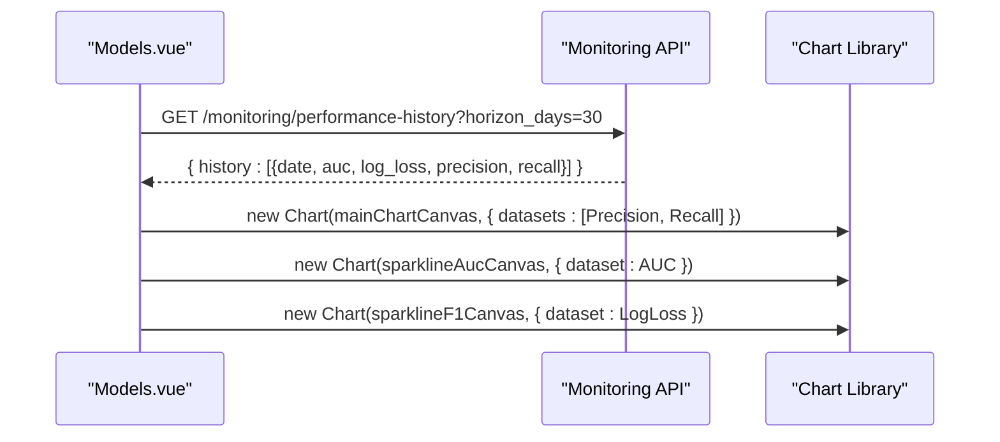
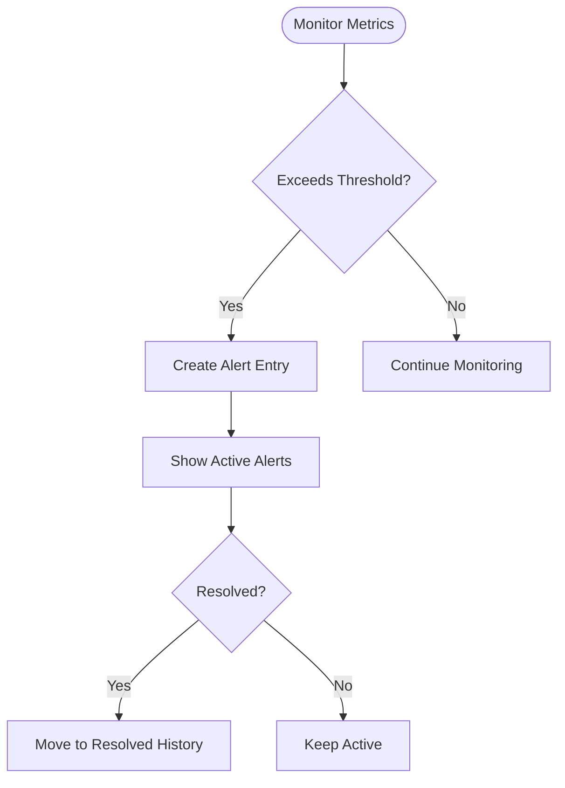
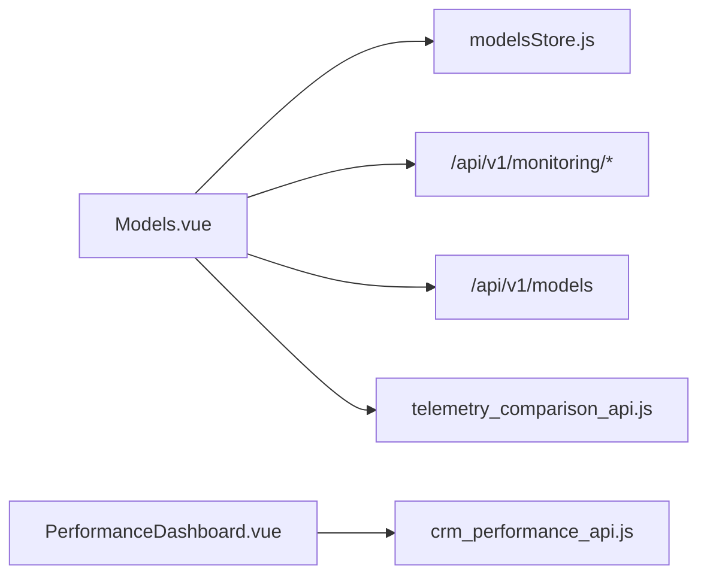

# Performance Monitoring & Metrics

<cite>
**Referenced Files in This Document**
- [Models.vue](file://src/views/Modules/aiagents/Models.vue)
- [modelsStore.js](file://src/stores/modelsStore.js)
- [PerformanceDashboard.vue](file://src/views/Modules/strategic/components/PerformanceDashboard.vue)
- [crm_performance_api.js](file://src/services/crm_performance_api.js)
- [telemetry_comparison_api.js](file://src/services/telemetry_comparison_api.js)
</cite>

## Table of Contents
1. Introduction
2. Project Structure
3. Core Components
4. Architecture Overview
5. Detailed Component Analysis
6. Dependency Analysis
7. Performance Considerations
8. Troubleshooting Guide
9. Conclusion
10. Appendices

## Introduction
This document explains how the application monitors model performance and tracks key metrics for classification models, with a focus on AUC-ROC, F1 score, precision, recall, log loss, and Brier score. It covers interactive confusion matrix visualization with threshold adjustment, segment-level fairness monitoring, threshold sensitivity analysis, real-time performance charts, historical trend analysis, and automated alerting for performance degradation. It also provides guidance for interpreting metrics and making threshold optimization decisions.

## Project Structure
The performance monitoring UI is centered around a dedicated Models page that aggregates overview KPIs, time-series charts, confusion matrix with threshold slider, segment-level performance, drift and stability indicators, governance information, live prediction logs, and alerts. Supporting stores and services fetch model metadata, performance history, feature drift, and prediction logs from backend endpoints.



**Diagram sources**
- [Models.vue:623-861](file://src/views/Modules/aiagents/Models.vue#L623-L861)
- [modelsStore.js:15-53](file://src/stores/modelsStore.js#L15-L53)
- [crm_performance_api.js:1-19](file://src/services/crm_performance_api.js#L1-L19)
- [telemetry_comparison_api.js:1-39](file://src/services/telemetry_comparison_api.js#L1-L39)

**Section sources**
- [Models.vue:623-861](file://src/views/Modules/aiagents/Models.vue#L623-L861)
- [modelsStore.js:15-53](file://src/stores/modelsStore.js#L15-L53)

## Core Components
- Model Overview KPIs: AUC-ROC, Log Loss, Brier Score, KS Statistic, F1 at a reference threshold, model version.
- Time-series Charts: Precision and Recall over 30 days; sparklines for AUC-ROC and Log Loss.
- Confusion Matrix: Interactive threshold slider updates TP, FP, FN, TN and derived Precision, Recall, F1.
- Segment-Level Performance: AUC-ROC and F1 by customer segment with status indicators for fairness monitoring.
- Threshold Sensitivity: Table showing Precision, Recall, F1, False Positive Rate, estimated intervention cost, and recommended threshold.
- Drift & Stability: Feature PSI table with thresholds and visual shift indicators.
- Alerts: Active and resolved alerts with severity, values, thresholds, and timestamps.
- Prediction Logs: Live inference stream with probability, risk band, classification, and latency.

**Section sources**
- [Models.vue:64-153](file://src/views/Modules/aiagents/Models.vue#L64-L153)
- [Models.vue:158-289](file://src/views/Modules/aiagents/Models.vue#L158-L289)
- [Models.vue:294-377](file://src/views/Modules/aiagents/Models.vue#L294-L377)
- [Models.vue:544-617](file://src/views/Modules/aiagents/Models.vue#L544-L617)
- [Models.vue:475-539](file://src/views/Modules/aiagents/Models.vue#L475-L539)

## Architecture Overview
The Models page orchestrates data fetching and rendering:
- On mount, it loads model registry via modelsStore to obtain champion model metadata and metrics.
- It concurrently requests performance history, feature drift, and prediction logs from monitoring endpoints.
- It renders charts using a charting library and computes derived metrics (Precision, Recall, F1) from the confusion matrix based on an interactive threshold.
- Segment-level metrics and threshold sensitivity tables are rendered from static or computed datasets.
- Alerts are surfaced from active alert state and resolved history.



**Diagram sources**
- [Models.vue:828-861](file://src/views/Modules/aiagents/Models.vue#L828-L861)
- [modelsStore.js:31-50](file://src/stores/modelsStore.js#L31-L50)

**Section sources**
- [Models.vue:828-861](file://src/views/Modules/aiagents/Models.vue#L828-L861)
- [modelsStore.js:31-50](file://src/stores/modelsStore.js#L31-L50)

## Detailed Component Analysis

### Key Performance Indicators and Calculations
- AUC-ROC: Displayed as a percentage in overview cards and sparkline; represents discrimination power.
- Log Loss: Shown with sparkline; lower is better indicating calibration quality.
- Brier Score: Calibration metric shown in overview card.
- KS Statistic: Separation strength indicator.
- F1 Score: Computed at a reference threshold and shown in overview.

These metrics are sourced from the champion model’s metrics object and rendered in overview cards and sparklines.

**Section sources**
- [Models.vue:686-704](file://src/views/Modules/aiagents/Models.vue#L686-L704)
- [Models.vue:78-100](file://src/views/Modules/aiagents/Models.vue#L78-L100)

### Confusion Matrix with Interactive Threshold
- The confusion matrix displays True Negative, False Positive, False Negative, and True Positive counts.
- An interactive threshold slider adjusts these counts and recalculates Precision, Recall, and F1 in real time.
- Derived metrics are computed from TP, FP, FN to reflect current threshold behavior.



**Diagram sources**
- [Models.vue:717-735](file://src/views/Modules/aiagents/Models.vue#L717-L735)

**Section sources**
- [Models.vue:161-212](file://src/views/Modules/aiagents/Models.vue#L161-L212)
- [Models.vue:717-735](file://src/views/Modules/aiagents/Models.vue#L717-L735)

### Segment-Level Performance for Fairness Monitoring
- Segment table shows AUC-ROC and F1 per customer segment with status indicators (STABLE, MONITOR, REVIEW).
- Status reflects fairness monitoring aligned with regulatory guidance.



**Diagram sources**
- [Models.vue:737-744](file://src/views/Modules/aiagents/Models.vue#L737-L744)

**Section sources**
- [Models.vue:214-247](file://src/views/Modules/aiagents/Models.vue#L214-L247)
- [Models.vue:737-744](file://src/views/Modules/aiagents/Models.vue#L737-L744)

### Threshold Sensitivity Analysis
- Threshold sensitivity table presents Precision, Recall, F1, False Positive Rate, estimated cost, and recommendation across multiple thresholds.
- Helps operators choose a threshold balancing detection and cost.

```mermaid
table
| Threshold | Precision | Recall | F1 | FP Rate | Cost | Recommended |
|-----------|-----------|--------|----|---------|------|-------------|
| 0.30 | 0.61 | 0.94 | 0.74 | 0.28 | R 4.2M/mo | No |
| 0.40 | 0.71 | 0.87 | 0.78 | 0.18 | R 2.9M/mo | No |
| 0.45 | 0.76 | 0.81 | 0.78 | 0.14 | R 2.4M/mo | Yes |
| 0.50 | 0.82 | 0.74 | 0.78 | 0.10 | R 1.8M/mo | No |
| 0.60 | 0.89 | 0.61 | 0.72 | 0.06 | R 1.1M/mo | No |
```

**Diagram sources**
- [Models.vue:746-753](file://src/views/Modules/aiagents/Models.vue#L746-L753)

**Section sources**
- [Models.vue:250-289](file://src/views/Modules/aiagents/Models.vue#L250-L289)
- [Models.vue:746-753](file://src/views/Modules/aiagents/Models.vue#L746-L753)

### Real-Time Performance Charts and Historical Trends
- Sparklines visualize recent AUC-ROC and Log Loss trends.
- Main line chart shows Precision and Recall over 30 days with responsive scaling and tooltips.
- Data is fetched from performance history endpoint and rendered via chart initialization.



**Diagram sources**
- [Models.vue:828-861](file://src/views/Modules/aiagents/Models.vue#L828-L861)
- [Models.vue:867-924](file://src/views/Modules/aiagents/Models.vue#L867-L924)

**Section sources**
- [Models.vue:867-924](file://src/views/Modules/aiagents/Models.vue#L867-L924)

### Automated Alerting for Performance Degradation
- Active alerts display severity, feature/metric, message, current value, threshold, and since timestamp.
- Resolved alert history records trigger and resolution details.
- Alerts can be surfaced in overview strip and dedicated alerts tab.



**Diagram sources**
- [Models.vue:662-678](file://src/views/Modules/aiagents/Models.vue#L662-L678)
- [Models.vue:544-617](file://src/views/Modules/aiagents/Models.vue#L544-L617)

**Section sources**
- [Models.vue:662-678](file://src/views/Modules/aiagents/Models.vue#L662-L678)
- [Models.vue:544-617](file://src/views/Modules/aiagents/Models.vue#L544-L617)

### Interpretation and Threshold Optimization Examples
- If Precision drops while Recall remains high, consider raising the threshold to reduce false positives.
- If Recall drops significantly, lowering the threshold may improve detection but increase false positives.
- Use the threshold sensitivity table to identify a balanced threshold where F1 is stable and cost is acceptable.
- For fairness, review segment-level AUC-ROC and F1; segments underperforming may require targeted interventions or retraining.

[No sources needed since this section provides general guidance]

## Dependency Analysis
- Models.vue depends on modelsStore for model registry and metrics.
- Models.vue calls monitoring endpoints for performance history, feature drift, and prediction logs.
- PerformanceDashboard.vue provides a generic KPI dashboard with export capabilities and operational metrics.
- CRM performance API supports user-level performance retrieval.
- Telemetry comparison service enables telemetry-based comparisons and real-time telemetry access.



**Diagram sources**
- [Models.vue:828-861](file://src/views/Modules/aiagents/Models.vue#L828-L861)
- [modelsStore.js:31-50](file://src/stores/modelsStore.js#L31-L50)
- [crm_performance_api.js:1-19](file://src/services/crm_performance_api.js#L1-L19)
- [telemetry_comparison_api.js:1-39](file://src/services/telemetry_comparison_api.js#L1-L39)

**Section sources**
- [Models.vue:828-861](file://src/views/Modules/aiagents/Models.vue#L828-L861)
- [modelsStore.js:31-50](file://src/stores/modelsStore.js#L31-L50)
- [crm_performance_api.js:1-19](file://src/services/crm_performance_api.js#L1-L19)
- [telemetry_comparison_api.js:1-39](file://src/services/telemetry_comparison_api.js#L1-L39)

## Performance Considerations
- Chart rendering uses responsive options and minimal point rendering to optimize performance.
- Concurrent fetching of performance history, drift, and logs reduces load time.
- Token-based authorization ensures secure API calls without repeated auth overhead.
- Avoid excessive re-renders by computing derived metrics only when threshold changes.

[No sources needed since this section provides general guidance]

## Troubleshooting Guide
- If monitoring endpoints fail, the component logs warnings and continues with fallback data for charts and tables.
- Ensure token is present in localStorage for authenticated requests.
- Verify API base URL configuration and network connectivity.
- For drift issues, check PSI thresholds and feature distribution shifts; investigate features marked CRITICAL or WARNING.

**Section sources**
- [Models.vue:857-861](file://src/views/Modules/aiagents/Models.vue#L857-L861)
- [Models.vue:631-636](file://src/views/Modules/aiagents/Models.vue#L631-L636)
- [modelsStore.js:31-50](file://src/stores/modelsStore.js#L31-L50)

## Conclusion
The application provides a comprehensive performance monitoring interface for classification models, including key metrics (AUC-ROC, F1, precision, recall, log loss, Brier), interactive confusion matrix with threshold control, segment-level fairness insights, threshold sensitivity analysis, real-time charts, historical trends, and automated alerts. These tools enable informed threshold optimization and proactive model management.

[No sources needed since this section summarizes without analyzing specific files]

## Appendices

### API Endpoints Used
- Performance history: GET /api/v1/monitoring/performance-history?horizon_days=30
- Feature drift: GET /api/v1/monitoring/feature-drift
- Prediction logs: GET /api/v1/monitoring/prediction-log?limit=50
- Model registry: GET /api/v1/models

**Section sources**
- [Models.vue:828-861](file://src/views/Modules/aiagents/Models.vue#L828-L861)
- [modelsStore.js:31-50](file://src/stores/modelsStore.js#L31-L50)