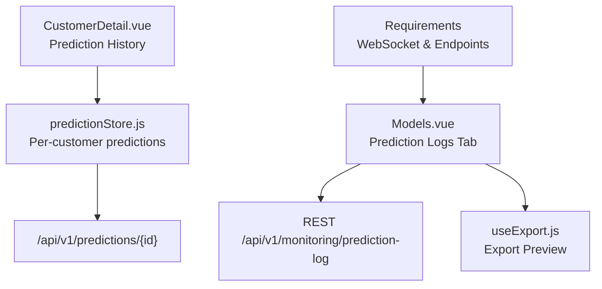
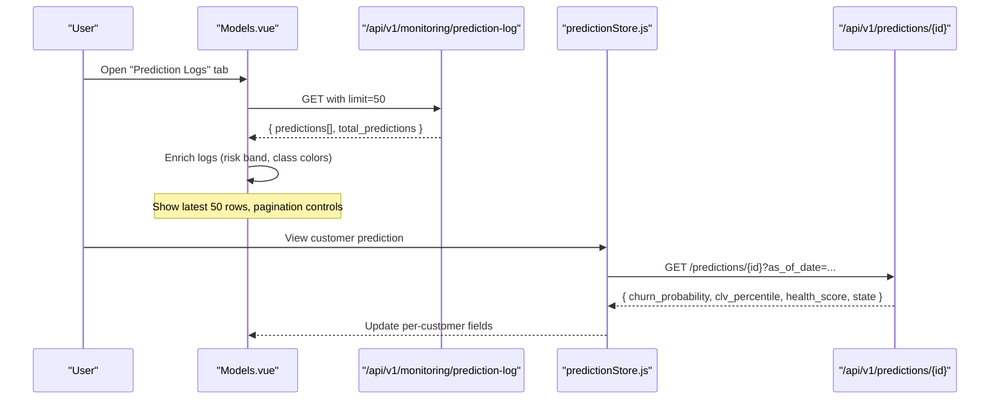
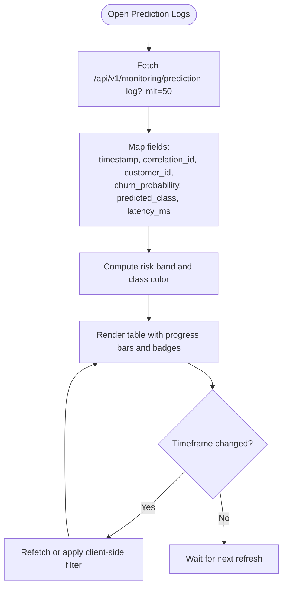
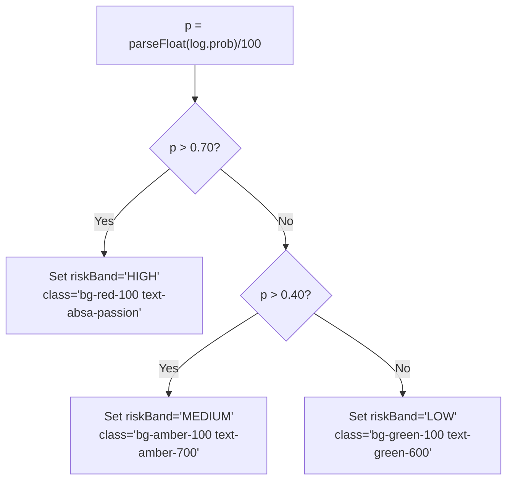
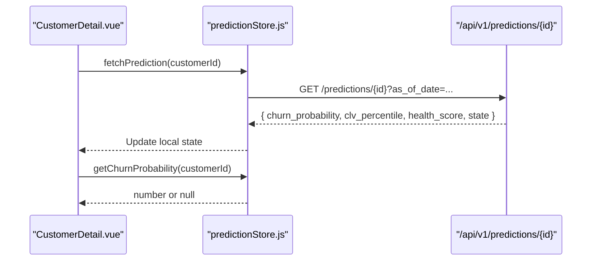
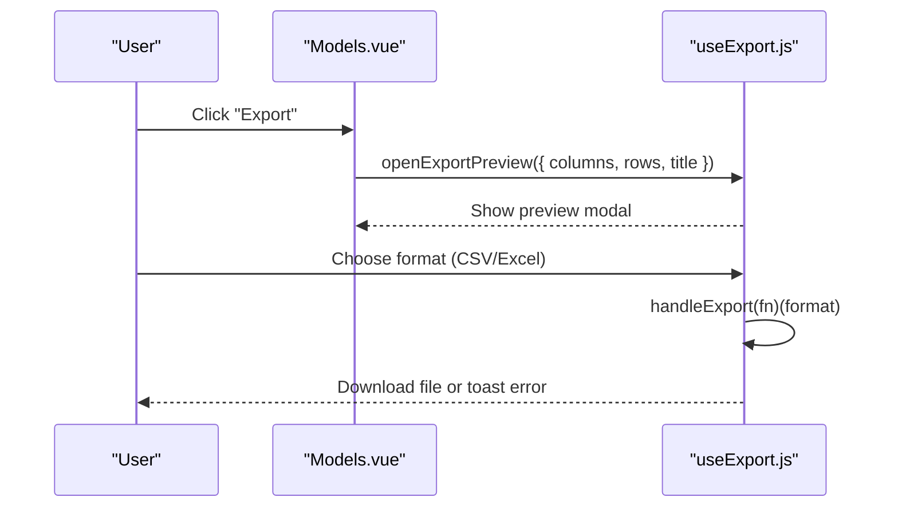
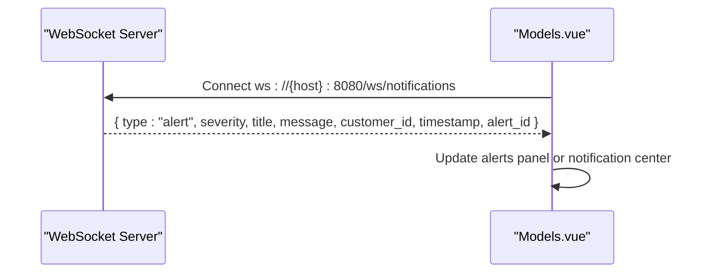
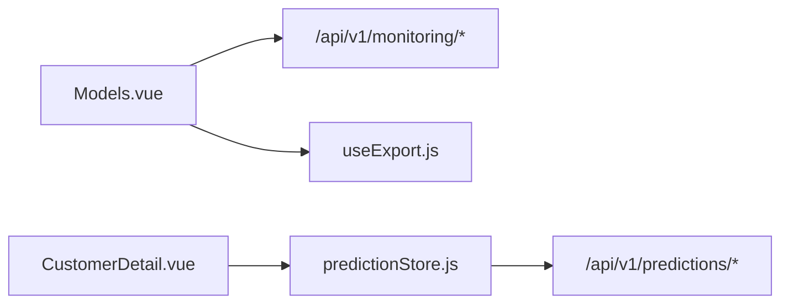

# Prediction Logs & Inference Tracking

<cite>
**Referenced Files in This Document**
- [Models.vue](file://src/views/Modules/aiagents/Models.vue)
- [predictionStore.js](file://src/stores/predictionStore.js)
- [useExport.js](file://src/composables/useExport.js)
- [CustomerDetail.vue](file://src/views/CustomerDetail.vue)
- [FRONTEND-REQUIREMENTS-V2.md](file://docs/FRONTEND-REQUIREMENTS-V2.md)
- [FRONTEND-REQUIREMENTS-V3.md](file://docs/FRONTEND-REQUIREMENTS-V3.md)
</cite>

## Table of Contents
1. [Introduction](#introduction)
2. [Project Structure](#project-structure)
3. [Core Components](#core-components)
4. [Architecture Overview](#architecture-overview)
5. [Detailed Component Analysis](#detailed-component-analysis)
6. [Dependency Analysis](#dependency-analysis)
7. [Performance Considerations](#performance-considerations)
8. [Troubleshooting Guide](#troubleshooting-guide)
9. [Conclusion](#conclusion)
10. [Appendices](#appendices)

## Introduction
This document explains the prediction logging and inference tracking capabilities implemented in the frontend. It focuses on the live prediction log interface that displays real-time inference streams from production endpoints, including timestamps, correlation IDs, customer identifiers, churn probabilities, risk bands, classifications, and latency metrics. It also covers filtering by time range, export options for offline analysis, enrichment of raw predictions with risk classifications and performance metrics, and practical examples for analyzing patterns, investigating individual predictions, and exporting logs for debugging.

## Project Structure
The prediction logging and inference tracking features are primarily implemented in:
- A dedicated “Prediction Logs” tab within the AI Agents Models view, which renders a live table of recent predictions and provides time-range selection and an export button.
- A prediction store that fetches per-customer predictions and health scores via REST APIs.
- An export composable used to preview and trigger exports.
- Customer detail views that show prediction history and data completeness for context.
- Requirements documents describing backend endpoints and WebSocket notifications.

**Diagram sources**
- [Models.vue:472-539](file://src/views/Modules/aiagents/Models.vue#L472-L539)
- [predictionStore.js:59-79](file://src/stores/predictionStore.js#L59-L79)
- [useExport.js:4-34](file://src/composables/useExport.js#L4-L34)
- [CustomerDetail.vue:306-311](file://src/views/CustomerDetail.vue#L306-L311)
- [FRONTEND-REQUIREMENTS-V2.md:428-479](file://docs/FRONTEND-REQUIREMENTS-V2.md#L428-L479)

**Section sources**
- [Models.vue:472-539](file://src/views/Modules/aiagents/Models.vue#L472-L539)
- [predictionStore.js:1-171](file://src/stores/predictionStore.js#L1-L171)
- [useExport.js:1-36](file://src/composables/useExport.js#L1-L36)
- [CustomerDetail.vue:306-311](file://src/views/CustomerDetail.vue#L306-L311)
- [FRONTEND-REQUIREMENTS-V2.md:428-479](file://docs/FRONTEND-REQUIREMENTS-V2.md#L428-L479)

## Core Components
- Live Prediction Log Interface (Models.vue): Displays a paginated table of recent predictions with columns for timestamp, correlation ID, customer ID, churn probability, risk band, classification, and latency. Includes time-range filter and export button.
- Prediction Enrichment (Models.vue): Computes risk bands and color-coded classes from raw churn probabilities to aid quick visual triage.
- Per-Customer Prediction Store (predictionStore.js): Fetches churn probability, CLV percentile, health score, and state for individual customers; supports batch fetching and convenience getters.
- Export Preview (useExport.js): Provides a reusable modal flow to preview and export selected datasets in chosen formats.
- Customer Detail Context (CustomerDetail.vue): Shows prediction history and data completeness to support investigation of individual predictions.

**Section sources**
- [Models.vue:472-539](file://src/views/Modules/aiagents/Models.vue#L472-L539)
- [Models.vue:812-821](file://src/views/Modules/aiagents/Models.vue#L812-L821)
- [predictionStore.js:59-138](file://src/stores/predictionStore.js#L59-L138)
- [useExport.js:4-34](file://src/composables/useExport.js#L4-L34)
- [CustomerDetail.vue:306-311](file://src/views/CustomerDetail.vue#L306-L311)

## Architecture Overview
The system integrates a monitoring endpoint that returns recent predictions, enriches them client-side, and presents them in a live table. The same infrastructure supports per-customer prediction retrieval and contextual details in the customer detail page.

**Diagram sources**
- [Models.vue:828-856](file://src/views/Modules/aiagents/Models.vue#L828-L856)
- [predictionStore.js:59-79](file://src/stores/predictionStore.js#L59-L79)

## Detailed Component Analysis

### Live Prediction Log Interface
- Displays a header indicating it is a real-time inference stream and shows total predictions count.
- Columns include timestamp, correlation ID, customer ID, churn probability (with mini progress bar), risk band (color-coded), classification (CHURN vs non-CHURN), and latency.
- Time-range selector allows Last 1 Hour, Last 24 Hours, Last 7 Days.
- Pagination footer indicates “Showing latest 50” with navigation buttons.
- Export button is present for initiating export flows.

**Diagram sources**
- [Models.vue:472-539](file://src/views/Modules/aiagents/Models.vue#L472-L539)
- [Models.vue:812-821](file://src/views/Modules/aiagents/Models.vue#L812-L821)
- [Models.vue:828-856](file://src/views/Modules/aiagents/Models.vue#L828-L856)

**Section sources**
- [Models.vue:472-539](file://src/views/Modules/aiagents/Models.vue#L472-L539)
- [Models.vue:812-821](file://src/views/Modules/aiagents/Models.vue#L812-L821)
- [Models.vue:828-856](file://src/views/Modules/aiagents/Models.vue#L828-L856)

### Prediction Enrichment and Risk Bands
- Raw churn probabilities are converted to percentages and mapped to risk bands:
  - HIGH if probability > 0.70
  - MEDIUM if probability > 0.40
  - LOW otherwise
- Each log entry receives a risk band class for consistent coloring.
- Classification is derived from predicted_class and colored accordingly (e.g., CHURN highlighted).

**Diagram sources**
- [Models.vue:812-821](file://src/views/Modules/aiagents/Models.vue#L812-L821)

**Section sources**
- [Models.vue:812-821](file://src/views/Modules/aiagents/Models.vue#L812-L821)

### Per-Customer Predictions and Health Scores
- The prediction store fetches:
  - Churn probability for a specific customer
  - Full prediction payload including CLV percentile, health score, and lifecycle state
  - Markov matrix for transitions
  - Batch predictions for multiple customers
- Convenience methods expose churn probability and health score for UI consumption.

**Diagram sources**
- [predictionStore.js:59-79](file://src/stores/predictionStore.js#L59-L79)
- [predictionStore.js:98-107](file://src/stores/predictionStore.js#L98-L107)

**Section sources**
- [predictionStore.js:27-138](file://src/stores/predictionStore.js#L27-L138)

### Export Capabilities
- The Models view includes an Export button in the Prediction Logs header.
- The useExport composable provides:
  - A preview modal to review columns and rows before export
  - A handler that triggers format-specific export functions and shows error toasts on failure
- While the Models view currently exposes the Export button, the actual export implementation can be wired to useExport to support CSV/Excel downloads for offline analysis.

**Diagram sources**
- [Models.vue:482-490](file://src/views/Modules/aiagents/Models.vue#L482-L490)
- [useExport.js:4-34](file://src/composables/useExport.js#L4-L34)

**Section sources**
- [Models.vue:482-490](file://src/views/Modules/aiagents/Models.vue#L482-L490)
- [useExport.js:4-34](file://src/composables/useExport.js#L4-L34)

### Real-Time Monitoring and WebSocket Notifications
- The requirements document defines a WebSocket protocol for real-time notifications, including alert messages with severity, titles, messages, customer IDs, timestamps, and alert IDs.
- Although the current Prediction Logs tab uses HTTP polling to fetch recent predictions, the architecture supports future integration of WebSocket-based streaming for live updates.

**Diagram sources**
- [FRONTEND-REQUIREMENTS-V2.md:428-479](file://docs/FRONTEND-REQUIREMENTS-V2.md#L428-L479)

**Section sources**
- [FRONTEND-REQUIREMENTS-V2.md:428-479](file://docs/FRONTEND-REQUIREMENTS-V2.md#L428-L479)

## Dependency Analysis
- Models.vue depends on:
  - Axios instance configured with base URL and token interceptor
  - Monitoring endpoints for performance history, feature drift, and prediction logs
  - Local computed logic to enrich logs and compute average latency
- predictionStore.js depends on:
  - Axios instance with base URL and token interceptor
  - Prediction endpoints for single and batch retrieval
- useExport.js is framework-agnostic and can be integrated into any view needing export functionality.
- CustomerDetail.vue consumes predictionStore to display per-customer prediction history and data completeness.

**Diagram sources**
- [Models.vue:623-636](file://src/views/Modules/aiagents/Models.vue#L623-L636)
- [Models.vue:828-856](file://src/views/Modules/aiagents/Models.vue#L828-L856)
- [predictionStore.js:1-12](file://src/stores/predictionStore.js#L1-L12)
- [predictionStore.js:59-138](file://src/stores/predictionStore.js#L59-L138)
- [useExport.js:4-34](file://src/composables/useExport.js#L4-L34)
- [CustomerDetail.vue:306-311](file://src/views/CustomerDetail.vue#L306-L311)

**Section sources**
- [Models.vue:623-636](file://src/views/Modules/aiagents/Models.vue#L623-L636)
- [Models.vue:828-856](file://src/views/Modules/aiagents/Models.vue#L828-L856)
- [predictionStore.js:1-12](file://src/stores/predictionStore.js#L1-L12)
- [predictionStore.js:59-138](file://src/stores/predictionStore.js#L59-L138)
- [useExport.js:4-34](file://src/composables/useExport.js#L4-L34)
- [CustomerDetail.vue:306-311](file://src/views/CustomerDetail.vue#L306-L311)

## Performance Considerations
- Latency Metrics: Average latency across recent predictions is computed and displayed to monitor inference performance.
- Pagination: Only the latest 50 predictions are shown at once to reduce rendering overhead.
- Batch Fetching: The prediction store batches requests to avoid overwhelming the backend when retrieving multiple customer predictions.
- Client-Side Enrichment: Risk band computation is lightweight and performed on small arrays, minimizing impact on UI responsiveness.

[No sources needed since this section provides general guidance]

## Troubleshooting Guide
- No Prediction Logs Available: If the table shows no logs, verify the monitoring endpoint returns data and check network errors.
- Export Failures: Use the export composable’s error handling to surface user-friendly messages when export operations fail.
- WebSocket Connectivity: Ensure the WebSocket connection is established and authenticated; refer to the requirements document for headers and message types.
- Data Completeness: On the customer detail page, inspect data completeness to understand why certain predictions may be missing or less reliable.

**Section sources**
- [useExport.js:17-25](file://src/composables/useExport.js#L17-L25)
- [FRONTEND-REQUIREMENTS-V2.md:428-479](file://docs/FRONTEND-REQUIREMENTS-V2.md#L428-L479)
- [CustomerDetail.vue:626-632](file://src/views/CustomerDetail.vue#L626-L632)

## Conclusion
The frontend implements a robust prediction logging and inference tracking experience centered around a live table of recent predictions, enriched with risk bands and classification indicators. It supports time-range filtering and export workflows for offline analysis. Per-customer prediction retrieval and health scores provide deeper context for investigations. Future enhancements can integrate WebSocket streaming for truly real-time updates and expand export formats for comprehensive debugging and reporting.

[No sources needed since this section summarizes without analyzing specific files]

## Appendices

### Example Workflows

#### Analyzing Prediction Patterns
- Open the Prediction Logs tab and observe churn probability distributions and risk bands.
- Use the timeframe selector to focus on recent activity (Last 1 Hour, Last 24 Hours, Last 7 Days).
- Review average latency to detect performance regressions.

**Section sources**
- [Models.vue:472-539](file://src/views/Modules/aiagents/Models.vue#L472-L539)
- [Models.vue:812-821](file://src/views/Modules/aiagents/Models.vue#L812-L821)
- [Models.vue:828-856](file://src/views/Modules/aiagents/Models.vue#L828-L856)

#### Investigating Individual Predictions
- Navigate to the customer detail page to view prediction history and data completeness.
- Use the prediction store to fetch detailed per-customer predictions, including CLV percentile and health score.

**Section sources**
- [CustomerDetail.vue:306-311](file://src/views/CustomerDetail.vue#L306-L311)
- [predictionStore.js:59-79](file://src/stores/predictionStore.js#L59-L79)

#### Exporting Logs for Offline Analysis
- Click the Export button in the Prediction Logs header.
- Use the export preview to confirm columns and rows, then choose a format (CSV/Excel) to download.

**Section sources**
- [Models.vue:482-490](file://src/views/Modules/aiagents/Models.vue#L482-L490)
- [useExport.js:4-34](file://src/composables/useExport.js#L4-L34)