# RAG Pipelines & Context Integration

<cite>
**Referenced Files in This Document**
- [AiModule.vue](file://src/views/Modules/aiagents/AiModule.vue)
- [AIEnhanceButton.vue](file://src/components/AIEnhanceButton.vue)
- [intelligenceStore.js](file://src/stores/intelligenceStore.js)
- [crm_api.js](file://src/services/crm_api.js)
- [documents_api.js](file://src/services/documents_api.js)
- [etlApi.js](file://src/services/etlApi.js)
- [EtlPipeline.vue](file://src/views/Modules/datapipeline/EtlPipeline.vue)
- [ETLRunHistory.vue](file://src/views/Modules/datapipeline/ETLRunHistory.vue)
- [useSettingsAudit.js](file://src/composables/settings/useSettingsAudit.js)
- [README.md](file://README.md)
</cite>

## Table of Contents
1. [Introduction](#introduction)
2. [Project Structure](#project-structure)
3. [Core Components](#core-components)
4. [Architecture Overview](#architecture-overview)
5. [Detailed Component Analysis](#detailed-component-analysis)
6. [Dependency Analysis](#dependency-analysis)
7. [Performance Considerations](#performance-considerations)
8. [Troubleshooting Guide](#troubleshooting-guide)
9. [Conclusion](#conclusion)
10. [Appendices](#appendices)

## Introduction
This document explains how the application integrates Retrieval-Augmented Generation (RAG) capabilities into the CRM-centric workflow. It covers:
- How user queries are augmented with enterprise context and sent to AI endpoints for grounded responses
- The data ingestion pipeline that prepares unstructured documents and structured CRM data for retrieval
- Prompt engineering patterns used to inject role, company, and user context into requests
- Context window management via conversation threading and message history
- Response synthesis and presentation in the chat interface
- CRM integrations for customer profiles, deal histories, and communication logs
- Configuration examples, customization options, and optimization strategies
- Data privacy considerations, access controls, and audit logging

## Project Structure
The RAG-related functionality spans several modules:
- AI agent chat UI and request orchestration
- Text enhancement component for inline AI assistance
- ETL configuration and execution for data ingestion
- CRM API services for retrieving customer, deal, and communication data
- Document service APIs for ingestion and versioning
- Audit composable for compliance and access control visibility

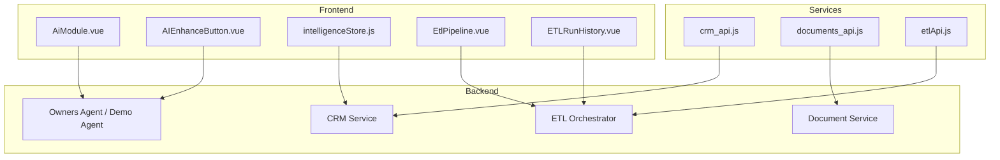

**Diagram sources**
- [AiModule.vue:1088-1110](file://src/views/Modules/aiagents/AiModule.vue#L1088-L1110)
- [AIEnhanceButton.vue:50-88](file://src/components/AIEnhanceButton.vue#L50-L88)
- [intelligenceStore.js:242-288](file://src/stores/intelligenceStore.js#L242-L288)
- [crm_api.js:46-143](file://src/services/crm_api.js#L46-L143)
- [documents_api.js:25-182](file://src/services/documents_api.js#L25-L182)
- [etlApi.js:94-114](file://src/services/etlApi.js#L94-L114)
- [EtlPipeline.vue:222-288](file://src/views/Modules/datapipeline/EtlPipeline.vue#L222-L288)
- [ETLRunHistory.vue:352-380](file://src/views/Modules/datapipeline/ETLRunHistory.vue#L352-L380)

**Section sources**
- [AiModule.vue:1088-1110](file://src/views/Modules/aiagents/AiModule.vue#L1088-L1110)
- [AIEnhanceButton.vue:50-88](file://src/components/AIEnhanceButton.vue#L50-L88)
- [intelligenceStore.js:242-288](file://src/stores/intelligenceStore.js#L242-L288)
- [crm_api.js:46-143](file://src/services/crm_api.js#L46-L143)
- [documents_api.js:25-182](file://src/services/documents_api.js#L25-L182)
- [etlApi.js:94-114](file://src/services/etlApi.js#L94-L114)
- [EtlPipeline.vue:222-288](file://src/views/Modules/datapipeline/EtlPipeline.vue#L222-L288)
- [ETLRunHistory.vue:352-380](file://src/views/Modules/datapipeline/ETLRunHistory.vue#L352-L380)

## Core Components
- AI Chat Orchestration: Builds contextual prompts, manages conversation threads, and posts queries to backend agents. Supports demo mode and offline local model integration.
- Inline AI Enhancement: Enhances text fields using a dedicated endpoint with tenant scoping.
- Intelligence Store: Fetches analytics and forecasting data from backend endpoints, with fallbacks when unavailable.
- CRM Services: Provides CRUD and query operations for leads, customers, accounts, contacts, deals, communications, meetings, and performance metrics.
- Document Services: Handles listing, uploading, versioning, sharing, and downloading documents with tenant scoping.
- ETL Services and UI: Lists extraction specs, triggers runs, and displays run history and quality metrics.
- Audit Composable: Retrieves and visualizes audit logs, supports filtering by module and pagination.

**Section sources**
- [AiModule.vue:1088-1110](file://src/views/Modules/aiagents/AiModule.vue#L1088-L1110)
- [AIEnhanceButton.vue:50-88](file://src/components/AIEnhanceButton.vue#L50-L88)
- [intelligenceStore.js:242-288](file://src/stores/intelligenceStore.js#L242-L288)
- [crm_api.js:46-143](file://src/services/crm_api.js#L46-L143)
- [documents_api.js:25-182](file://src/services/documents_api.js#L25-L182)
- [etlApi.js:94-114](file://src/services/etlApi.js#L94-L114)
- [useSettingsAudit.js:66-81](file://src/composables/settings/useSettingsAudit.js#L66-L81)

## Architecture Overview
The RAG flow combines user intent with enterprise context and returns grounded responses:
- User input is enriched with role, company, and user context tags before being sent to the agent endpoint
- Conversation threading ensures context window management across messages
- Backend agents can retrieve CRM and document data as needed; the frontend orchestrates these calls through services
- ETL pipelines ingest and prepare data for downstream retrieval and analytics
- Audit logging tracks sensitive actions and provides compliance visibility

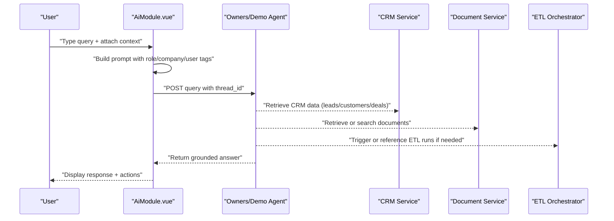

**Diagram sources**
- [AiModule.vue:1088-1110](file://src/views/Modules/aiagents/AiModule.vue#L1088-L1110)
- [crm_api.js:46-143](file://src/services/crm_api.js#L46-L143)
- [documents_api.js:25-182](file://src/services/documents_api.js#L25-L182)
- [etlApi.js:94-114](file://src/services/etlApi.js#L94-L114)

## Detailed Component Analysis

### AI Chat Orchestration (RAG Request Flow)
- Constructs a contextual prompt prefix including role, company name, and user name
- Manages conversation threading via thread_id stored in localStorage
- Posts to either demo or production agent endpoints based on mode
- Processes responses, supports demo actions, and renders messages with timestamps

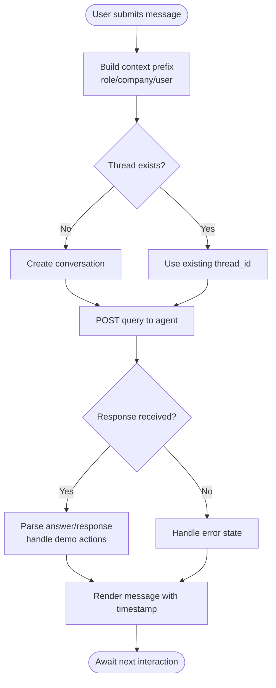

**Diagram sources**
- [AiModule.vue:1088-1110](file://src/views/Modules/aiagents/AiModule.vue#L1088-L1110)

**Section sources**
- [AiModule.vue:1088-1110](file://src/views/Modules/aiagents/AiModule.vue#L1088-L1110)

### Inline AI Enhancement
- Provides an “Enhance with AI” button for text fields
- Sends current text and context to a backend enhancement endpoint with tenant scoping
- Updates the field value with enhanced text and emits events for consumers

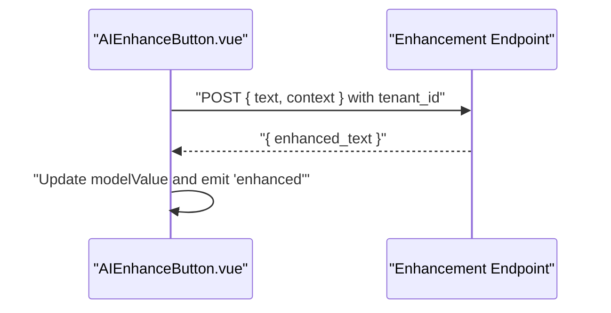

**Diagram sources**
- [AIEnhanceButton.vue:50-88](file://src/components/AIEnhanceButton.vue#L50-L88)

**Section sources**
- [AIEnhanceButton.vue:50-88](file://src/components/AIEnhanceButton.vue#L50-L88)

### Intelligence Store (Analytics and Forecasting)
- Fetches CLV, lifecycle stages, balance forecasts, and outcomes from backend endpoints
- Implements fallback data when APIs are unavailable
- Uses a centralized axios instance with token-based authorization

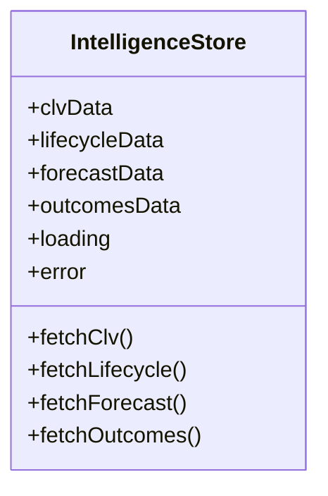

**Diagram sources**
- [intelligenceStore.js:234-296](file://src/stores/intelligenceStore.js#L234-L296)

**Section sources**
- [intelligenceStore.js:234-296](file://src/stores/intelligenceStore.js#L234-L296)

### CRM Integrations (Customer Profiles, Deal Histories, Communication Logs)
- Provides functions to list and manage leads, customers, accounts, contacts, deals, communications, meetings, and performance metrics
- Sanitizes parameters and handles errors consistently
- Enables fetching related activities and conversions

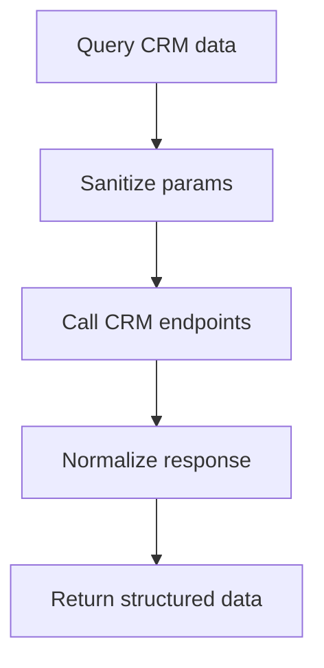

**Diagram sources**
- [crm_api.js:46-143](file://src/services/crm_api.js#L46-L143)

**Section sources**
- [crm_api.js:46-143](file://src/services/crm_api.js#L46-L143)

### Document Ingestion Pipeline
- Lists, uploads, updates, deletes, shares, and versions documents with tenant scoping
- Supports file uploads with progress tracking
- Provides invoice references and PDF downloads

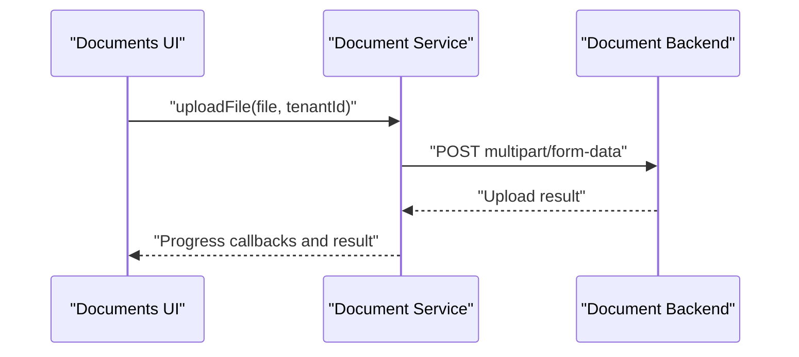

**Diagram sources**
- [documents_api.js:164-182](file://src/services/documents_api.js#L164-L182)

**Section sources**
- [documents_api.js:25-182](file://src/services/documents_api.js#L25-L182)

### ETL Pipeline Execution and Monitoring
- Displays system health, quality trends, and execution history
- Allows triggering manual runs and exporting logs
- Integrates with ETL API to fetch configs and trigger runs

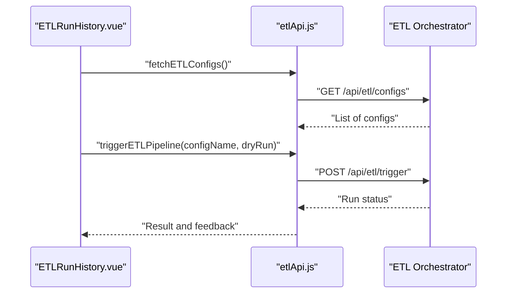

**Diagram sources**
- [ETLRunHistory.vue:352-380](file://src/views/Modules/datapipeline/ETLRunHistory.vue#L352-L380)
- [etlApi.js:94-114](file://src/services/etlApi.js#L94-L114)

**Section sources**
- [EtlPipeline.vue:222-288](file://src/views/Modules/datapipeline/EtlPipeline.vue#L222-L288)
- [ETLRunHistory.vue:352-380](file://src/views/Modules/datapipeline/ETLRunHistory.vue#L352-L380)
- [etlApi.js:94-114](file://src/services/etlApi.js#L94-L114)

### Prompt Engineering Patterns and Context Window Management
- Prompt construction includes instructions and contextual tags for role, company, and user
- Thread-based conversation management maintains context windows across interactions
- Demo mode allows parsing and executing actions embedded in responses

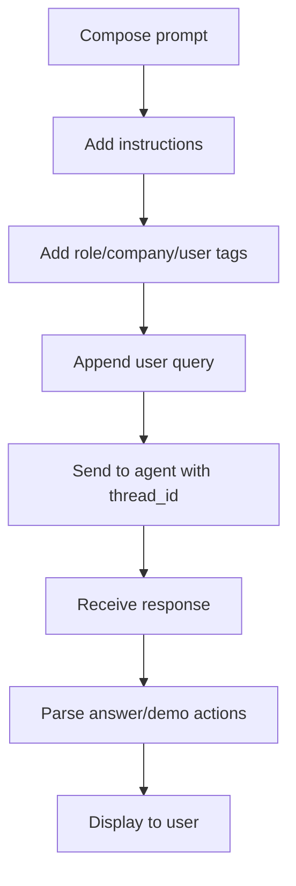

**Diagram sources**
- [AiModule.vue:1088-1110](file://src/views/Modules/aiagents/AiModule.vue#L1088-L1110)

**Section sources**
- [AiModule.vue:1088-1110](file://src/views/Modules/aiagents/AiModule.vue#L1088-L1110)

### Data Privacy, Access Controls, and Audit Logging
- Tenant-scoped requests ensure data isolation per organization
- Authorization headers carry tokens for authenticated requests
- Audit composable retrieves logs with tenant filtering and pagination
- Settings provide visibility into compliance and policy management

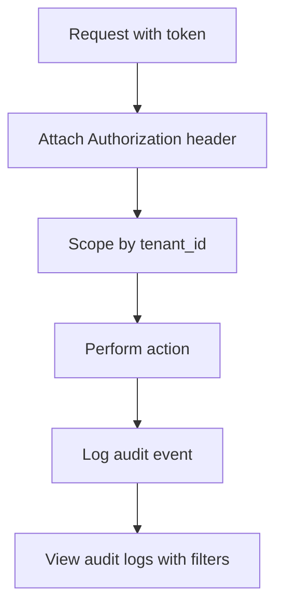

**Diagram sources**
- [documents_api.js:14-20](file://src/services/documents_api.js#L14-L20)
- [useSettingsAudit.js:66-81](file://src/composables/settings/useSettingsAudit.js#L66-L81)

**Section sources**
- [documents_api.js:14-20](file://src/services/documents_api.js#L14-L20)
- [useSettingsAudit.js:66-81](file://src/composables/settings/useSettingsAudit.js#L66-L81)
- [README.md:424-437](file://README.md#L424-L437)

## Dependency Analysis
- AiModule depends on axios for HTTP requests and JWT decoding utilities for user context
- AIEnhanceButton depends on API base URL and emits events to parent components
- IntelligenceStore uses a centralized axios instance with token interception
- CRM and Document services encapsulate REST endpoints and parameter sanitization
- ETL services expose configuration listing and pipeline triggering

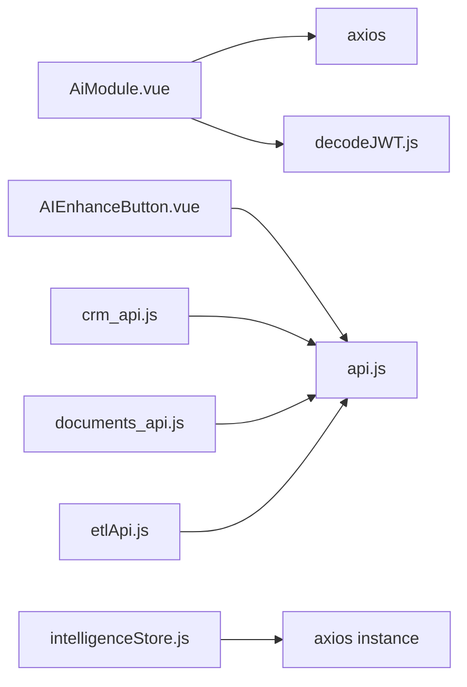

**Diagram sources**
- [AiModule.vue:534-549](file://src/views/Modules/aiagents/AiModule.vue#L534-L549)
- [AIEnhanceButton.vue:23-26](file://src/components/AIEnhanceButton.vue#L23-L26)
- [intelligenceStore.js:1-11](file://src/stores/intelligenceStore.js#L1-L11)
- [crm_api.js:1-45](file://src/services/crm_api.js#L1-L45)
- [documents_api.js:1-20](file://src/services/documents_api.js#L1-L20)
- [etlApi.js:1-16](file://src/services/etlApi.js#L1-L16)

**Section sources**
- [AiModule.vue:534-549](file://src/views/Modules/aiagents/AiModule.vue#L534-L549)
- [AIEnhanceButton.vue:23-26](file://src/components/AIEnhanceButton.vue#L23-L26)
- [intelligenceStore.js:1-11](file://src/stores/intelligenceStore.js#L1-L11)
- [crm_api.js:1-45](file://src/services/crm_api.js#L1-L45)
- [documents_api.js:1-20](file://src/services/documents_api.js#L1-L20)
- [etlApi.js:1-16](file://src/services/etlApi.js#L1-L16)

## Performance Considerations
- Use tenant-scoped queries to minimize payload sizes and improve cache effectiveness
- Prefer paginated retrieval for large datasets (e.g., CRM lists, ETL runs)
- Leverage fallback data in stores to maintain UI responsiveness during backend outages
- Monitor ETL quality scores and latency to optimize ingestion throughput
- Keep conversation threads concise; trim older messages if necessary to fit context windows

[No sources needed since this section provides general guidance]

## Troubleshooting Guide
- Local AI connectivity issues: Ensure Ollama is running locally and accessible; handle HTTPS-to-HTTP mixed content restrictions
- Network errors: Check token presence and CORS settings; inspect response status and error payloads
- ETL failures: Review run history for status and quality scores; verify config names and permissions
- CRM data inconsistencies: Validate parameter sanitization and filter criteria; check related activity endpoints

**Section sources**
- [AiModule.vue:555-603](file://src/views/Modules/aiagents/AiModule.vue#L555-L603)
- [etlApi.js:18-38](file://src/services/etlApi.js#L18-L38)
- [EtlPipeline.vue:222-288](file://src/views/Modules/datapipeline/EtlPipeline.vue#L222-L288)

## Conclusion
The application implements a practical RAG-enabled experience by combining contextual prompt engineering, conversation threading, and robust integrations with CRM and document services. ETL pipelines support data ingestion and quality monitoring, while audit logging ensures compliance and traceability. The modular architecture enables customization of retrieval strategies, response synthesis, and operational controls to meet enterprise needs.

[No sources needed since this section summarizes without analyzing specific files]

## Appendices

### Configuring RAG Pipelines and Customizing Retrieval Strategies
- Configure tenant IDs and authorization tokens in service clients to scope data correctly
- Adjust prompt templates to include relevant context tags and instructions for better grounding
- Use ETL configurations to define extraction specs and destinations for knowledge bases
- Enable demo mode for testing and offline mode for secure local processing

**Section sources**
- [AIEnhanceButton.vue:50-88](file://src/components/AIEnhanceButton.vue#L50-L88)
- [AiModule.vue:1088-1110](file://src/views/Modules/aiagents/AiModule.vue#L1088-L1110)
- [etlApi.js:94-114](file://src/services/etlApi.js#L94-L114)

### Optimizing Response Quality
- Refine prompt instructions to emphasize conciseness and relevance
- Ensure CRM and document data are up-to-date via ETL runs
- Monitor quality trends and adjust ingestion parameters accordingly
- Use fallback data strategically to maintain continuity during outages

**Section sources**
- [EtlPipeline.vue:222-288](file://src/views/Modules/datapipeline/EtlPipeline.vue#L222-L288)
- [intelligenceStore.js:242-288](file://src/stores/intelligenceStore.js#L242-L288)