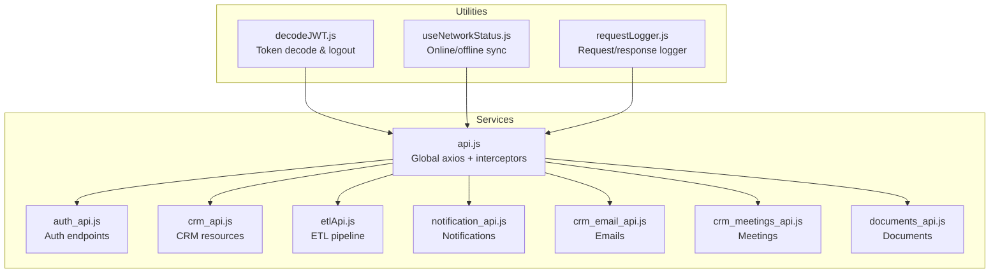
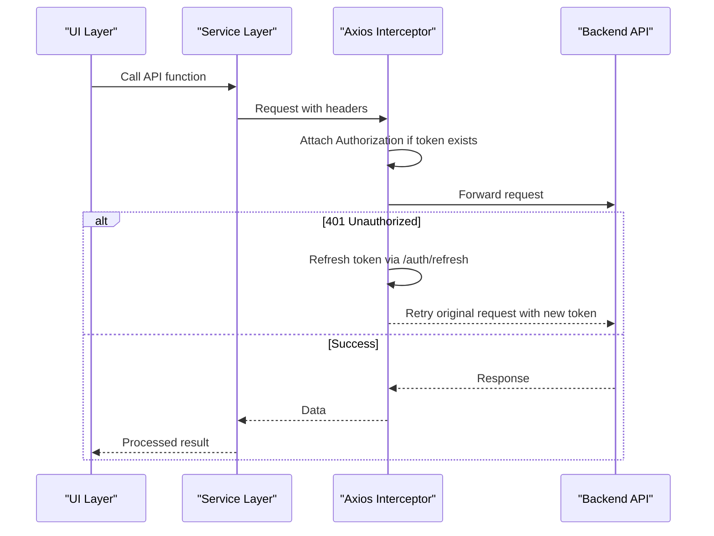
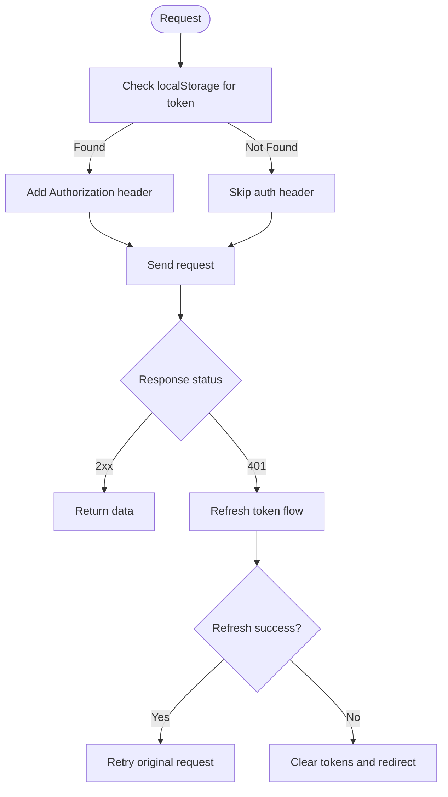
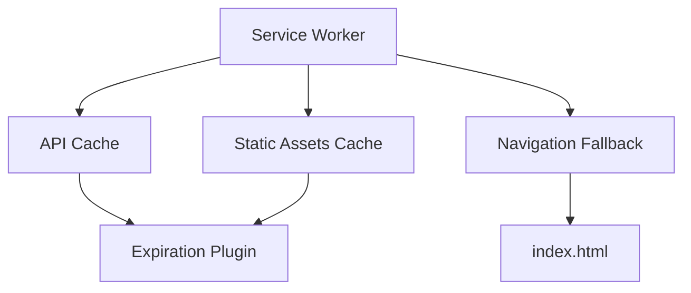
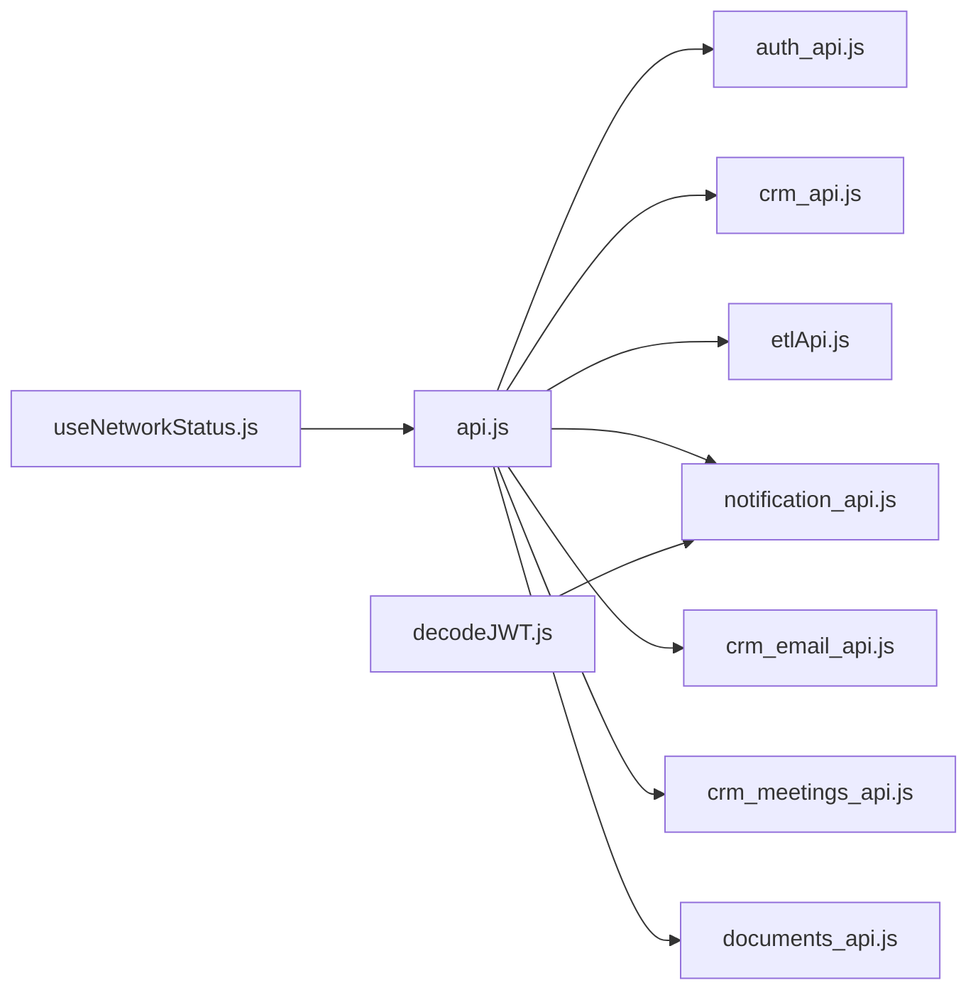

# API Integration

<cite>
**Referenced Files in This Document**
- [api.js](file://src/services/api.js)
- [auth_api.js](file://src/services/auth_api.js)
- [crm_api.js](file://src/services/crm_api.js)
- [etlApi.js](file://src/services/etlApi.js)
- [notification_api.js](file://src/services/notification_api.js)
- [crm_email_api.js](file://src/services/crm_email_api.js)
- [crm_meetings_api.js](file://src/services/crm_meetings_api.js)
- [documents_api.js](file://src/services/documents_api.js)
- [decodeJWT.js](file://src/services/decodeJWT.js)
- [useNetworkStatus.js](file://src/composables/useNetworkStatus.js)
- [requestLogger.js](file://src/utils/requestLogger.js)
- [sw.js](file://src/sw.js)
</cite>

## Table of Contents
1. [Introduction](#introduction)
2. [Project Structure](#project-structure)
3. [Core Components](#core-components)
4. [Architecture Overview](#architecture-overview)
5. [Detailed Component Analysis](#detailed-component-analysis)
6. [Dependency Analysis](#dependency-analysis)
7. [Performance Considerations](#performance-considerations)
8. [Troubleshooting Guide](#troubleshooting-guide)
9. [Conclusion](#conclusion)
10. [Appendices](#appendices)

## Introduction
This document provides comprehensive API integration documentation for the ABSA Foundry Frontend. It covers the centralized HTTP client configuration, authentication and token handling, service layer architecture across Authentication, CRM, ETL Pipeline, Notifications, Email, Meetings, and Documents, and details on error handling, retry mechanisms, offline capabilities, caching strategies, security considerations, debugging techniques, and monitoring approaches.

## Project Structure
The frontend organizes API integrations into a service layer under src/services, with shared utilities and composables for network status and logging. The base URL is resolved from environment variables or runtime context, and multiple clients are used:
- A global axios instance with interceptors for auth and 401 refresh flow
- Dedicated axios instances per domain (e.g., documents)
- Native fetch calls for specific services with consistent header and error handling patterns

**Diagram sources**
- [api.js:1-209](file://src/services/api.js#L1-L209)
- [auth_api.js:1-190](file://src/services/auth_api.js#L1-L190)
- [crm_api.js:1-801](file://src/services/crm_api.js#L1-L801)
- [etlApi.js:1-115](file://src/services/etlApi.js#L1-L115)
- [notification_api.js:1-64](file://src/services/notification_api.js#L1-L64)
- [crm_email_api.js:1-313](file://src/services/crm_email_api.js#L1-L313)
- [crm_meetings_api.js:1-322](file://src/services/crm_meetings_api.js#L1-L322)
- [documents_api.js:1-182](file://src/services/documents_api.js#L1-L182)
- [decodeJWT.js:1-164](file://src/services/decodeJWT.js#L1-L164)
- [useNetworkStatus.js:1-228](file://src/composables/useNetworkStatus.js#L1-L228)
- [requestLogger.js:1-34](file://src/utils/requestLogger.js#L1-L34)

**Section sources**
- [api.js:1-209](file://src/services/api.js#L1-L209)
- [auth_api.js:1-190](file://src/services/auth_api.js#L1-L190)
- [crm_api.js:1-801](file://src/services/crm_api.js#L1-L801)
- [etlApi.js:1-115](file://src/services/etlApi.js#L1-L115)
- [notification_api.js:1-64](file://src/services/notification_api.js#L1-L64)
- [crm_email_api.js:1-313](file://src/services/crm_email_api.js#L1-L313)
- [crm_meetings_api.js:1-322](file://src/services/crm_meetings_api.js#L1-L322)
- [documents_api.js:1-182](file://src/services/documents_api.js#L1-L182)
- [decodeJWT.js:1-164](file://src/services/decodeJWT.js#L1-L164)
- [useNetworkStatus.js:1-228](file://src/composables/useNetworkStatus.js#L1-L228)
- [requestLogger.js:1-34](file://src/utils/requestLogger.js#L1-L34)

## Core Components
- Centralized Base URL and Axios Instance
  - Base URL resolution supports environment variable and runtime fallback to local or hosted backend.
  - Global axios request interceptor attaches Authorization header using stored token.
  - Response interceptor handles 401 by refreshing tokens via /auth/refresh, queuing concurrent requests, and redirecting to login when refresh fails.
  - Utility functions provide signup, login, refresh, and logout flows.

- Auth Service Layer
  - Provides login, refresh, signup, profile fetch, role update, password reset helpers.
  - Uses both axios and fetch; stores tokens consistently in localStorage.

- CRM Service Layer
  - Comprehensive CRUD for leads, contacts, accounts, deals, communications, activities, visits, meetings, notifications, metadata, import/export, and bulk operations.
  - Consistent headers and error handling helper for parsing FastAPI-style validation errors.

- ETL Pipeline Service Layer
  - Endpoints for dashboard data, run details, config listing, and triggering runs.

- Notification Service Layer
  - Sends notifications to home page and external channels with tenant context.

- Email Service Layer
  - Send, schedule, list, track, configure, test email configurations.

- Meetings Service Layer
  - Create, list, get, update, delete, complete, cancel meetings; add notes; stats and upcoming/today views.

- Documents Service Layer
  - CRUD for documents, versions, folders, sharing, downloads, invoice references, file uploads with progress.

- Token Decoding and Session Management
  - Decode JWT, extract user info, handle expiration, perform logout including backend revocation.

- Network Status and Offline Handling
  - Tracks online/offline state, triggers auto-sync on reconnect, shows offline notifications, integrates with offline sync manager and IndexedDB.

**Section sources**
- [api.js:20-209](file://src/services/api.js#L20-L209)
- [auth_api.js:1-190](file://src/services/auth_api.js#L1-L190)
- [crm_api.js:1-801](file://src/services/crm_api.js#L1-L801)
- [etlApi.js:1-115](file://src/services/etlApi.js#L1-L115)
- [notification_api.js:1-64](file://src/services/notification_api.js#L1-L64)
- [crm_email_api.js:1-313](file://src/services/crm_email_api.js#L1-L313)
- [crm_meetings_api.js:1-322](file://src/services/crm_meetings_api.js#L1-L322)
- [documents_api.js:1-182](file://src/services/documents_api.js#L1-L182)
- [decodeJWT.js:1-164](file://src/services/decodeJWT.js#L1-L164)
- [useNetworkStatus.js:1-228](file://src/composables/useNetworkStatus.js#L1-L228)

## Architecture Overview
The frontend uses a layered approach:
- Presentation layers call service functions that encapsulate HTTP calls.
- Services centralize base URL, headers, and error handling.
- Interceptors manage authentication and token refresh globally.
- Utilities provide decoding, logging, and network status.

**Diagram sources**
- [api.js:64-146](file://src/services/api.js#L64-L146)
- [auth_api.js:20-27](file://src/services/auth_api.js#L20-L27)

## Detailed Component Analysis

### Centralized Axios Configuration and Interceptors
- Base URL resolution: environment variable or runtime detection for local vs hosted backend.
- Request interceptor: adds Authorization header from localStorage token.
- Response interceptor:
  - Handles 401 by attempting token refresh via /auth/refresh.
  - Queues concurrent requests during refresh to avoid race conditions.
  - Clears tokens and redirects to login on refresh failure.
- Utility functions:
  - Signup, login, refresh, logout with consistent token storage.

**Diagram sources**
- [api.js:64-146](file://src/services/api.js#L64-L146)

**Section sources**
- [api.js:1-209](file://src/services/api.js#L1-L209)

### Authentication APIs
- Endpoints:
  - POST /auth/login → credentials { username, password } → returns access_token, refresh_token, token_type, expires_in
  - POST /auth/refresh → { refresh_token } → returns new token pair
  - POST /auth/signup → { email, password, phone_number, role } → success response
  - GET /auth/logout → clears session locally and redirects
  - POST /auth/forgot-password → { email } → sends reset email
  - POST /auth/reset-password → { email, otp, new_password } → resets password
- Methods:
  - Login and refresh use axios with withCredentials enabled in some paths; others use fetch.
  - Tokens stored in localStorage keys: token, refresh_token, access_token.
- Error handling:
  - Throws errors with detail messages from backend responses.
  - Clears tokens on refresh failure.

**Section sources**
- [auth_api.js:31-143](file://src/services/auth_api.js#L31-L143)
- [api.js:149-209](file://src/services/api.js#L149-L209)
- [auth_api.js:145-190](file://src/services/auth_api.js#L145-L190)

### CRM Endpoints
- Leads:
  - GET /crm/leads?query → list with filters
  - GET /crm/leads/{id} → single lead
  - POST /crm/leads → create
  - PUT /crm/leads/{id} → update
  - DELETE /crm/leads/{id} → delete
  - GET /crm/leads/{id}/notes, emails, attachments, campaigns
  - POST /crm/leads/{id}/convert → convert to account/contact/deal
  - POST /crm/leads/import → bulk import
  - GET /crm/leads/export?limit → export
  - POST /crm/leads/bulk-upload-file → multipart upload
  - POST /crm/leads/bulk-upload-process → process uploaded file
  - GET /crm/leads/download-template → download template
  - POST /crm/leads/bulk-assign, bulk-delete, bulk-update → bulk operations
- Contacts:
  - GET /crm/contacts?query → list
  - GET /crm/contacts/{id} → single
  - POST /crm/contacts → create
  - PUT /crm/contacts/{id} → update
  - DELETE /crm/contacts/{id} → delete
  - GET /crm/activities?related_type=contact&related_id={id} → activities
- Accounts:
  - GET /crm/accounts?query → list
  - GET /crm/accounts/{id} → single
  - POST /crm/accounts → create
  - PUT /crm/accounts/{id} → update
  - DELETE /crm/accounts/{id} → delete
  - GET /crm/accounts/{id}/contacts → related contacts
  - GET /crm/activities?related_type=account&related_id={id} → activities
- Deals:
  - GET /crm/deals?query → list
  - GET /crm/deals/{id} → single
  - POST /crm/deals → create
  - PUT /crm/deals/{id} → update
  - DELETE /crm/deals/{id} → delete
  - GET /crm/activities?related_type=deal&related_id={id} → activities
- Communications:
  - GET /crm/communications?query → list
  - POST /crm/communications → create
  - PATCH /crm/communications/{id} → update
  - DELETE /crm/communications/{id} → delete
  - GET /crm/communications/{id}/notes → notes
  - POST /crm/communications/{id}/notes → add note
- Activities:
  - GET /crm/activities?query → list
  - POST /crm/activities → log activity (with related_type, related_id)
  - DELETE /crm/activities/{id} → delete activity
- Visits:
  - GET /crm/visits?query → list
  - POST /crm/visits → create
  - PATCH /crm/visits/{id} → update
  - POST /crm/visits/{id}/notes → add note
  - GET /crm/visits/{id}/notes → notes
  - DELETE /crm/visits/{id} → delete
- Meetings:
  - GET /crm/meetings/list?query → list
  - POST /crm/meetings/create → create
  - PUT /crm/meetings/{id} → update
  - DELETE /crm/meetings/{id} → delete
- Notifications:
  - GET /notifications?query → list
  - GET /notifications?lead_id={id}&category=crm → lead-specific
  - PUT /notifications/{id}/read → mark read
  - PUT /notifications/mark-read → mark all read
  - POST /notifications/{id}/dismiss → dismiss
  - DELETE /notifications → dismiss all
  - POST /crm/notifications/scan → scan CRM notifications
- Metadata:
  - GET /metadata/modules → module metadata
  - GET /records?module={name}&... → generic records
  - GET /crm/metadata → CRM metadata
  - PUT /crm/metadata → update CRM metadata
- Analytics:
  - GET /crm/stats?query → stats
  - GET /crm/performance/team?query → team performance

- Request/Response Schema Notes:
  - Most endpoints accept JSON bodies with Content-Type application/json.
  - Query parameters are sanitized to remove undefined/null/empty values.
  - Errors include detail/message fields; validation errors may be arrays of objects with loc/msg/type.

**Section sources**
- [crm_api.js:1-801](file://src/services/crm_api.js#L1-L801)

### ETL Pipeline APIs
- Endpoints:
  - GET /api/etl/runs?query → dashboard data (kpis, status, quality_trend, runs, pagination)
  - GET /api/etl/runs/{runId} → run detail
  - GET /api/etl/configs → list extraction spec configs
  - POST /api/etl/trigger → trigger pipeline run with { config_name, dry_run }
- Methods:
  - All authenticated via Authorization header.
- Error handling:
  - Parses detail/message/error fields; throws standardized errors with status and data.

**Section sources**
- [etlApi.js:1-115](file://src/services/etlApi.js#L1-L115)

### Notification Services
- Endpoint:
  - POST /notifications?tenant_id={id} → send notification with title, message, details, category, recipient_email, recipient_whatsapp, channels, auto_send, metadata
- Authentication:
  - Authorization header included if token present.
- Error handling:
  - Throws error with detail or generic message.

**Section sources**
- [notification_api.js:1-64](file://src/services/notification_api.js#L1-L64)

### Email Services
- Endpoints:
  - POST /crm/emails/send → send email
  - POST /crm/emails/schedule → schedule email
  - GET /crm/emails/list?folder&limit&skip&linked_record_id → list emails
  - GET /crm/emails/stats?user_email → statistics
  - POST /crm/emails/track → track actions
  - GET /crm/emails/{emailId} → email detail
  - GET /email-configurations/?tenant_id → list configurations
  - POST /email-configurations/ → create configuration
  - PUT /email-configurations/{configId} → update configuration
  - DELETE /email-configurations/{configId} → delete configuration
  - POST /email-configurations/{configId}/test → test configuration
- Authentication:
  - Authorization header included for all endpoints.
- Error handling:
  - Throws errors with detail or generic messages.

**Section sources**
- [crm_email_api.js:1-313](file://src/services/crm_email_api.js#L1-L313)

### Meetings Services
- Endpoints:
  - POST /crm/meetings/create → create meeting
  - GET /crm/meetings/list?query → list meetings
  - GET /crm/meetings/{meetingId} → get meeting
  - PUT /crm/meetings/{meetingId} → update meeting
  - DELETE /crm/meetings/{meetingId}?tenant_id → delete meeting
  - POST /crm/meetings/{meetingId}/complete?outcome → complete meeting
  - POST /crm/meetings/{meetingId}/cancel?reason → cancel meeting
  - POST /crm/meetings/{meetingId}/notes → add note
  - GET /crm/meetings/stats/{tenantId} → statistics
  - GET /crm/meetings/list?status=scheduled&start_date → upcoming meetings
  - GET /crm/meetings/list?start_date&end_date → today’s meetings
- Authentication:
  - Authorization header included for all endpoints.
- Error handling:
  - Throws errors with detail or generic messages.

**Section sources**
- [crm_meetings_api.js:1-322](file://src/services/crm_meetings_api.js#L1-L322)

### Documents Services
- Endpoints:
  - GET /documents/?tenant_id → list documents
  - GET /documents/{documentId}?tenant_id → get document
  - POST /documents/?tenant_id → upload document (multipart/form-data)
  - PUT /documents/{documentId}?tenant_id → update metadata
  - DELETE /documents/{documentId}?tenant_id → delete document
  - POST /documents/{documentId}/share?tenant_id → share document
  - POST /documents/{documentId}/download?tenant_id → track download
  - POST /documents/{documentId}/version?tenant_id → create new version
  - GET /documents/{documentId}/versions?tenant_id → list versions
  - GET /documents/folders/list?tenant_id → list folders
  - GET /documents/stats?tenant_id → statistics
  - POST /documents/invoice-reference?tenant_id → create invoice reference
  - GET /documents/{documentId}/download-invoice-pdf?tenant_id → download PDF
  - POST /documents/upload-file → upload file with progress
- Authentication:
  - Authorization header attached via axios instance interceptor.
- Error handling:
  - Standard axios error handling; file uploads support progress callbacks.

**Section sources**
- [documents_api.js:1-182](file://src/services/documents_api.js#L1-L182)

### Token Management and Security
- Token Storage:
  - Access and refresh tokens stored in localStorage keys: token, refresh_token, access_token.
- Token Usage:
  - Authorization header added to requests via interceptors or explicit headers.
- Expiration Handling:
  - JWT decoded to check exp; expired tokens trigger logout and redirect.
- Logout Flow:
  - Attempts backend revocation via /auth/logout; clears local storage and navigates to login.

**Section sources**
- [api.js:64-146](file://src/services/api.js#L64-L146)
- [auth_api.js:20-27](file://src/services/auth_api.js#L20-L27)
- [decodeJWT.js:11-96](file://src/services/decodeJWT.js#L11-L96)

### Error Handling Strategies
- Unified error parsing:
  - Helpers parse detail/message/error fields; arrays of validation errors are flattened.
- 401 Handling:
  - Global interceptor attempts token refresh; queues concurrent requests; clears tokens and redirects on failure.
- Service-level errors:
  - Each service throws errors with descriptive messages; some wrap backend details.

**Section sources**
- [crm_api.js:11-32](file://src/services/crm_api.js#L11-L32)
- [etlApi.js:18-38](file://src/services/etlApi.js#L18-L38)
- [api.js:90-146](file://src/services/api.js#L90-L146)

### Retry Mechanisms
- Token Refresh Retry:
  - On 401, interceptor retries the original request after successful refresh.
  - Concurrent requests are queued and retried once token is refreshed.
- No explicit exponential backoff for general requests; rely on browser/network retry behavior.

**Section sources**
- [api.js:90-146](file://src/services/api.js#L90-L146)

### Offline Capability Handling
- Network Status Tracking:
  - Composable tracks online/offline events and triggers auto-sync on reconnect.
- Offline Sync:
  - Integrates with offline sync manager and IndexedDB to queue operations and sync when online.
- User Feedback:
  - Shows offline toast notifications and exposes sync status for UI updates.

**Section sources**
- [useNetworkStatus.js:1-228](file://src/composables/useNetworkStatus.js#L1-L228)

### Caching Strategies
- Service Worker Caching:
  - Routes registered for API cache with expiration policies.
  - Static assets cached with long-lived strategies.
  - Navigation fallback to index.html for offline pages.
- LocalStorage Caching:
  - Some modules cache data in localStorage keyed by tenant ID for faster load times.
- Build-time Cache Versioning:
  - Script updates Service Worker cache names with timestamps to bust stale caches.

**Diagram sources**
- [sw.js:129-159](file://src/sw.js#L129-L159)

**Section sources**
- [sw.js:129-159](file://src/sw.js#L129-L159)
- [scripts/update-sw-cache.js:1-34](file://scripts/update-sw-cache.js#L1-L34)
- [StrategicManagementModule.js:118-246](file://src/views/Modules/strategic/composables/StrategicManagementModule.js#L118-L246)

### Practical Examples
- Making an API call:
  - Use service functions (e.g., getLeads, createLead) which handle headers, query sanitization, and error parsing.
- Handling responses:
  - Await service function; catch thrown errors; display user-friendly messages.
- Managing loading states:
  - Wrap calls in try/catch; set loading flags before async calls; clear in finally blocks.

[No sources needed since this section provides general guidance]

## Dependency Analysis
- Coupling:
  - Services depend on api.js for base URL and sometimes axios instance.
  - decodeJWT used by notification_api for tenant context.
  - useNetworkStatus integrates with offline sync and IndexedDB.
- External Dependencies:
  - axios for HTTP client and interceptors.
  - jwt-decode for token decoding.
  - Service Worker for caching and offline navigation.

**Diagram sources**
- [api.js:1-209](file://src/services/api.js#L1-L209)
- [auth_api.js:1-190](file://src/services/auth_api.js#L1-L190)
- [crm_api.js:1-801](file://src/services/crm_api.js#L1-L801)
- [etlApi.js:1-115](file://src/services/etlApi.js#L1-L115)
- [notification_api.js:1-64](file://src/services/notification_api.js#L1-L64)
- [crm_email_api.js:1-313](file://src/services/crm_email_api.js#L1-L313)
- [crm_meetings_api.js:1-322](file://src/services/crm_meetings_api.js#L1-L322)
- [documents_api.js:1-182](file://src/services/documents_api.js#L1-L182)
- [decodeJWT.js:1-164](file://src/services/decodeJWT.js#L1-L164)
- [useNetworkStatus.js:1-228](file://src/composables/useNetworkStatus.js#L1-L228)

**Section sources**
- [api.js:1-209](file://src/services/api.js#L1-L209)
- [decodeJWT.js:1-164](file://src/services/decodeJWT.js#L1-L164)
- [useNetworkStatus.js:1-228](file://src/composables/useNetworkStatus.js#L1-L228)

## Performance Considerations
- Minimize redundant requests:
  - Use query sanitization to avoid unnecessary parameters.
  - Leverage Service Worker caching for API responses where appropriate.
- Efficient token refresh:
  - Queue concurrent requests during refresh to reduce network overhead.
- File uploads:
  - Use FormData with progress callbacks for large files.
- Offline-first design:
  - Cache critical data in localStorage; sync when online to reduce latency.

[No sources needed since this section provides general guidance]

## Troubleshooting Guide
- Debugging API Calls:
  - Use loggedFetch wrapper to log method, URL, payload, and response body/status without exposing secrets.
- Monitoring Network Status:
  - Use useNetworkStatus composable to detect offline events and trigger sync.
- Common Issues:
  - 401 Unauthorized: Ensure token exists and is valid; check refresh flow and backend availability.
  - Validation Errors: Parse detail arrays and display user-friendly messages.
  - Offline Mode: Verify offline sync manager and IndexedDB integration.

**Section sources**
- [requestLogger.js:1-34](file://src/utils/requestLogger.js#L1-L34)
- [useNetworkStatus.js:1-228](file://src/composables/useNetworkStatus.js#L1-L228)
- [crm_api.js:11-32](file://src/services/crm_api.js#L11-L32)

## Conclusion
The ABSA Foundry Frontend implements a robust API integration layer with centralized configuration, comprehensive service modules, strong authentication and token management, resilient error handling, offline capabilities, and caching strategies. These components collectively ensure secure, efficient, and maintainable communication with backend services.

[No sources needed since this section summarizes without analyzing specific files]

## Appendices

### API Endpoint Reference Summary
- Authentication:
  - POST /auth/login, POST /auth/refresh, POST /auth/signup, GET /auth/logout, POST /auth/forgot-password, POST /auth/reset-password
- CRM:
  - Leads, Contacts, Accounts, Deals, Communications, Activities, Visits, Meetings, Notifications, Metadata, Analytics
- ETL:
  - GET /api/etl/runs, GET /api/etl/runs/{id}, GET /api/etl/configs, POST /api/etl/trigger
- Notifications:
  - POST /notifications?tenant_id
- Email:
  - POST /crm/emails/send, POST /crm/emails/schedule, GET /crm/emails/list, GET /crm/emails/stats, POST /crm/emails/track, GET /crm/emails/{id}, GET/POST/PUT/DELETE /email-configurations/*
- Meetings:
  - POST /crm/meetings/create, GET /crm/meetings/list, GET/PUT/DELETE /crm/meetings/{id}, POST /crm/meetings/{id}/complete, POST /crm/meetings/{id}/cancel, POST /crm/meetings/{id}/notes, GET /crm/meetings/stats/{tenantId}
- Documents:
  - GET/POST/PUT/DELETE /documents/*, POST /documents/upload-file, POST /documents/invoice-reference, GET /documents/{id}/download-invoice-pdf

[No sources needed since this section lists endpoints without analyzing specific files]