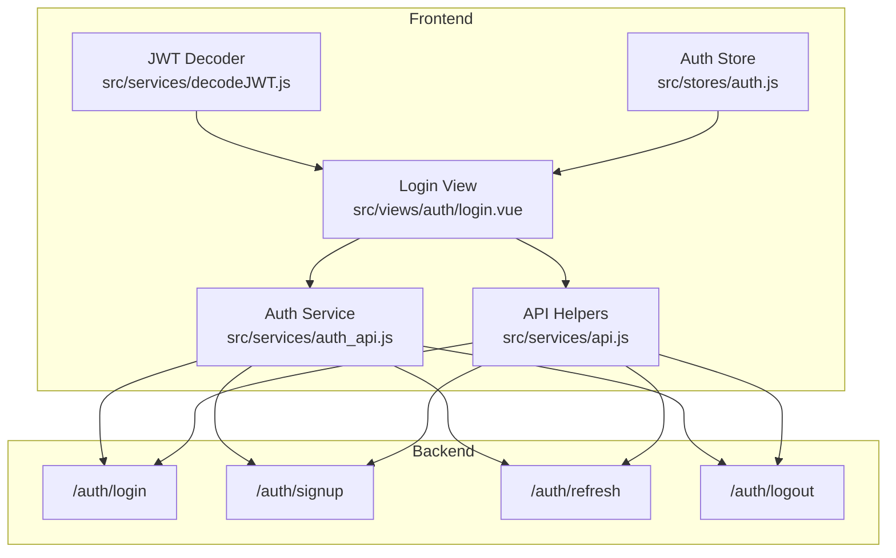
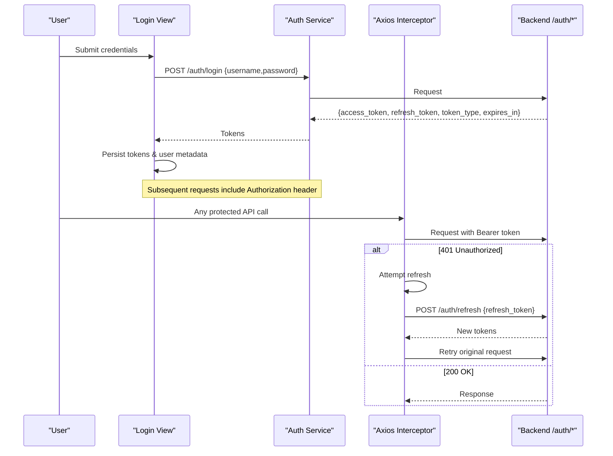
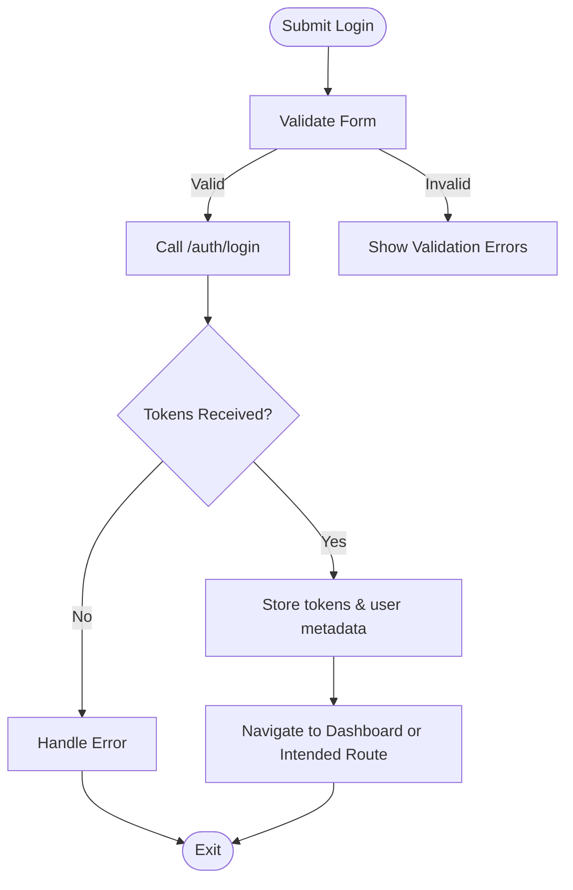
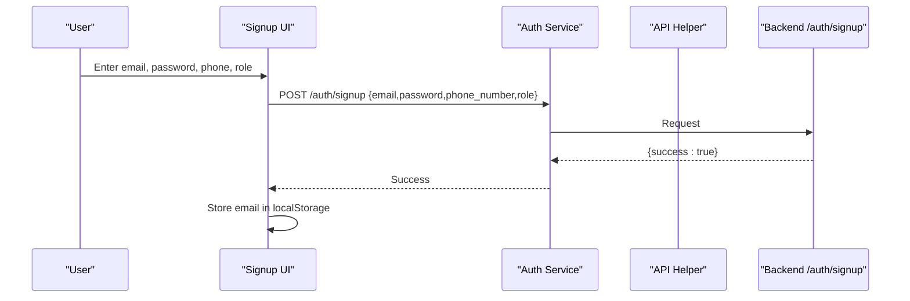
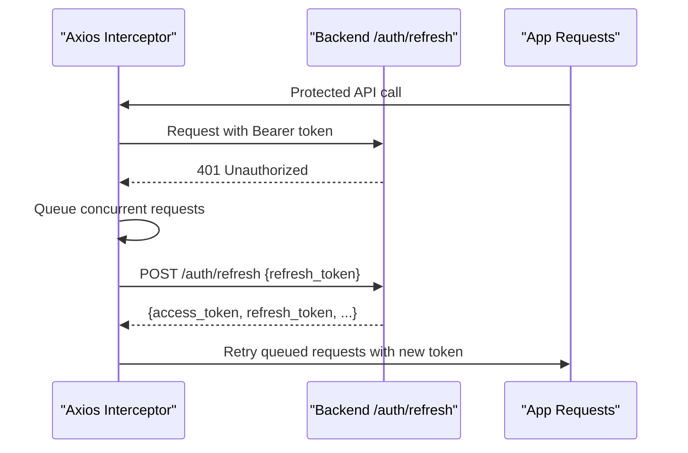
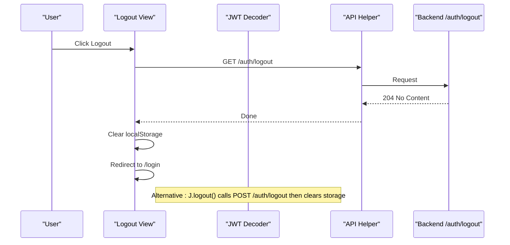
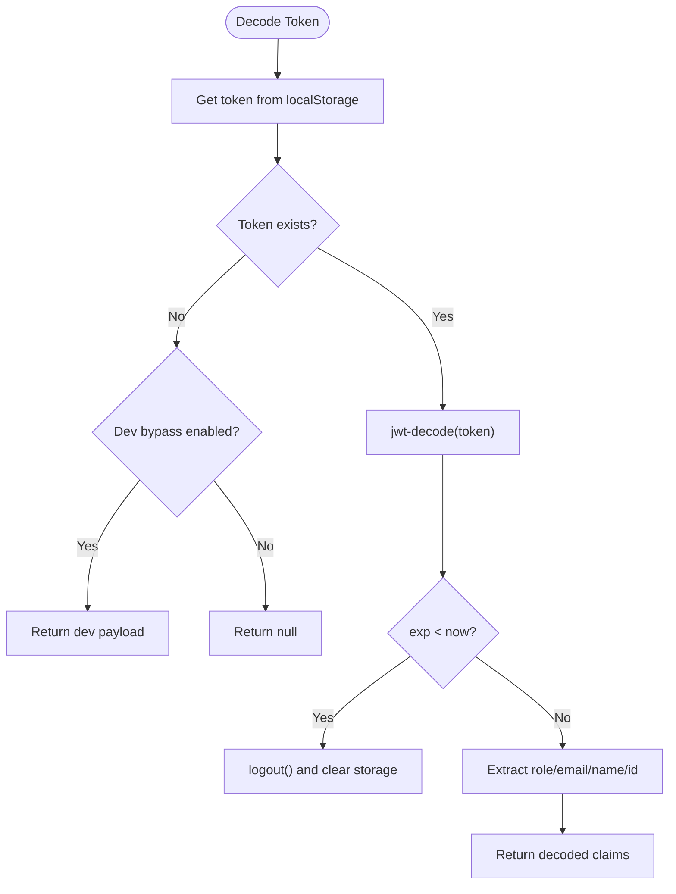
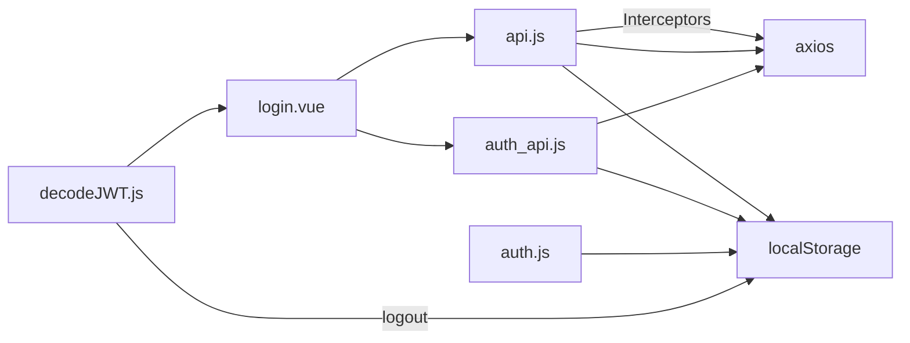

# Authentication APIs

<cite>
**Referenced Files in This Document**
- [auth_api.js](file://src/services/auth_api.js)
- [api.js](file://src/services/api.js)
- [decodeJWT.js](file://src/services/decodeJWT.js)
- [auth.js](file://src/stores/auth.js)
- [login.vue](file://src/views/auth/login.vue)
- [Logout.vue](file://src/views/auth/Logout.vue)
- [AUTH-INTEGRATION.md](file://docs/AUTH-INTEGRATION.md)
</cite>

## Table of Contents
1. [Introduction](#introduction)
2. [Project Structure](#project-structure)
3. [Core Components](#core-components)
4. [Architecture Overview](#architecture-overview)
5. [Detailed Component Analysis](#detailed-component-analysis)
6. [Dependency Analysis](#dependency-analysis)
7. [Performance Considerations](#performance-considerations)
8. [Troubleshooting Guide](#troubleshooting-guide)
9. [Conclusion](#conclusion)
10. [Appendices](#appendices)

## Introduction
This document explains the authentication API endpoints and JWT token management implemented in the frontend application. It covers:
- Login (POST /auth/login) with username/password, returning access_token, refresh_token, token_type, expires_in
- Signup (POST /auth/signup) for user registration with email, password, phone_number, role
- Refresh token mechanism (POST /auth/refresh) to obtain new access tokens
- Logout (GET /auth/logout) for session termination
- JWT decoding utilities, token validation, and security best practices
- Code examples and flows for handling token expiration and managing sessions

## Project Structure
The authentication flow spans services, stores, views, and documentation:
- Services: HTTP clients and helpers for auth endpoints and JWT decoding
- Stores: Pinia store for auth state
- Views: UI for login and logout
- Docs: Backend API specification and integration guide

**Diagram sources**
- [login.vue:133-264](file://src/views/auth/login.vue#L133-L264)
- [auth_api.js:31-143](file://src/services/auth_api.js#L31-L143)
- [api.js:64-208](file://src/services/api.js#L64-L208)
- [decodeJWT.js:11-96](file://src/services/decodeJWT.js#L11-L96)
- [auth.js:3-21](file://src/stores/auth.js#L3-L21)

**Section sources**
- [login.vue:133-264](file://src/views/auth/login.vue#L133-L264)
- [auth_api.js:31-143](file://src/services/auth_api.js#L31-L143)
- [api.js:64-208](file://src/services/api.js#L64-L208)
- [decodeJWT.js:11-96](file://src/services/decodeJWT.js#L11-L96)
- [auth.js:3-21](file://src/stores/auth.js#L3-L21)

## Core Components
- Auth service (auth_api.js): Encapsulates login, signup, refresh, logout, profile fetch, and role update calls; attaches Authorization headers via Axios interceptor; persists tokens to localStorage.
- API helpers (api.js): Provides centralized base URL resolution, request/response interceptors for automatic token attachment and 401-driven refresh, plus helper functions for login, refresh, signup, and logout.
- JWT decoder (decodeJWT.js): Decodes tokens, validates expiry, extracts claims (role, email, name, id), and provides a logout utility that revokes tokens on the backend and clears local storage.
- Auth store (auth.js): Pinia store holding token, role, and email from localStorage; exposes isAuthenticated getter and logout action.
- Login view (login.vue): Validates form, calls login, parses token claims, persists user metadata, and navigates to dashboard or intended route.
- Logout view (Logout.vue): Clears local auth data and redirects to login.

**Section sources**
- [auth_api.js:31-143](file://src/services/auth_api.js#L31-L143)
- [api.js:64-208](file://src/services/api.js#L64-L208)
- [decodeJWT.js:11-96](file://src/services/decodeJWT.js#L11-L96)
- [auth.js:3-21](file://src/stores/auth.js#L3-L21)
- [login.vue:133-264](file://src/views/auth/login.vue#L133-L264)
- [Logout.vue:1-24](file://src/views/auth/Logout.vue#L1-L24)

## Architecture Overview
End-to-end authentication flow using JWT:
- Login sends credentials, receives access_token and refresh_token, stores them locally, and sets Authorization header for subsequent requests.
- On 401 responses, an interceptor attempts to refresh using refresh_token; if successful, retries the original request; otherwise, logs out.
- JWT decoding validates expiry and extracts user claims for UI and routing decisions.
- Logout revokes tokens on the backend and clears local storage.

**Diagram sources**
- [auth_api.js:31-87](file://src/services/auth_api.js#L31-L87)
- [api.js:64-146](file://src/services/api.js#L64-L146)
- [AUTH-INTEGRATION.md:14-98](file://docs/AUTH-INTEGRATION.md#L14-L98)

## Detailed Component Analysis

### Login Endpoint (POST /auth/login)
- Request payload:
  - username: string
  - password: string
- Response schema:
  - access_token: string (JWT)
  - refresh_token: string (opaque)
  - token_type: string ("bearer")
  - expires_in: number (seconds until access token expires)
- Behavior:
  - The service posts credentials and stores both tokens in localStorage.
  - The login view validates input, calls login, decodes token claims, persists user metadata (user_id, role, email, company_name, tenant_id, userName), and navigates to the intended route or dashboard.

**Diagram sources**
- [login.vue:161-247](file://src/views/auth/login.vue#L161-L247)
- [auth_api.js:31-57](file://src/services/auth_api.js#L31-L57)
- [api.js:166-180](file://src/services/api.js#L166-L180)

**Section sources**
- [login.vue:161-247](file://src/views/auth/login.vue#L161-L247)
- [auth_api.js:31-57](file://src/services/auth_api.js#L31-L57)
- [api.js:166-180](file://src/services/api.js#L166-L180)
- [AUTH-INTEGRATION.md:14-50](file://docs/AUTH-INTEGRATION.md#L14-L50)

### Signup Endpoint (POST /auth/signup)
- Request payload:
  - email: string
  - password: string
  - phone_number: string
  - role: string
- Behavior:
  - The service posts the user data and stores the email in localStorage upon success.
  - The API helper also exposes a Signup function that posts to /auth/signup with the same fields.

**Diagram sources**
- [auth_api.js:89-103](file://src/services/auth_api.js#L89-L103)
- [api.js:149-159](file://src/services/api.js#L149-L159)

**Section sources**
- [auth_api.js:89-103](file://src/services/auth_api.js#L89-L103)
- [api.js:149-159](file://src/services/api.js#L149-L159)

### Refresh Token Mechanism (POST /auth/refresh)
- Request payload:
  - refresh_token: string
- Response schema:
  - access_token: string (new JWT)
  - refresh_token: string (new opaque token; old one revoked)
  - token_type: string ("bearer")
  - expires_in: number (seconds until new access token expires)
- Behavior:
  - The service posts the refresh_token and updates stored tokens.
  - The API helper includes an Axios response interceptor that automatically detects 401 errors, queues concurrent requests, attempts refresh, updates Authorization headers, and retries the original request. If refresh fails, it clears tokens and redirects to login.

**Diagram sources**
- [auth_api.js:59-87](file://src/services/auth_api.js#L59-L87)
- [api.js:78-146](file://src/services/api.js#L78-L146)
- [AUTH-INTEGRATION.md:53-82](file://docs/AUTH-INTEGRATION.md#L53-L82)

**Section sources**
- [auth_api.js:59-87](file://src/services/auth_api.js#L59-L87)
- [api.js:78-146](file://src/services/api.js#L78-L146)
- [AUTH-INTEGRATION.md:53-82](file://docs/AUTH-INTEGRATION.md#L53-L82)

### Logout Endpoint (GET /auth/logout)
- Behavior:
  - The API helper performs a GET to /auth/logout and clears all local storage before redirecting to home.
  - The decodeJWT utility’s logout method calls POST /auth/logout with Authorization header, then clears local storage and navigates to login.
  - The Logout view clears local auth data and redirects to login.

**Diagram sources**
- [api.js:202-208](file://src/services/api.js#L202-L208)
- [decodeJWT.js:66-96](file://src/services/decodeJWT.js#L66-L96)
- [Logout.vue:7-15](file://src/views/auth/Logout.vue#L7-L15)

**Section sources**
- [api.js:202-208](file://src/services/api.js#L202-L208)
- [decodeJWT.js:66-96](file://src/services/decodeJWT.js#L66-L96)
- [Logout.vue:7-15](file://src/views/auth/Logout.vue#L7-L15)

### JWT Token Decoding Utilities and Validation
- Decoding:
  - Uses jwt-decode to parse the token and extract claims such as role, email, name, id, exp, iat.
- Expiry validation:
  - Compares decoded exp with current time; if expired, triggers logout and clears storage.
- Claim extraction helpers:
  - getUserRole, getUserEmail, getUserName, getUserId, getBranchId.
- Logout integration:
  - Attempts to revoke token on backend and clears local storage, then navigates to login.

**Diagram sources**
- [decodeJWT.js:11-96](file://src/services/decodeJWT.js#L11-L96)

**Section sources**
- [decodeJWT.js:11-96](file://src/services/decodeJWT.js#L11-L96)

### Security Best Practices
- Always attach Authorization header for protected requests via Axios interceptor.
- Use refresh_token only when necessary; each refresh revokes the previous refresh_token.
- On 401, attempt refresh once; if it fails, clear tokens and force logout.
- Validate token expiry client-side and trigger logout when expired.
- Clear sensitive data from localStorage on logout.
- Avoid storing secrets in code; use environment variables for base URLs.

[No sources needed since this section provides general guidance]

## Dependency Analysis
Key dependencies and relationships:
- Login view depends on auth service and API helpers for network calls and navigation.
- Auth service depends on Axios and localStorage for token persistence.
- API helpers provide global interceptors for token attachment and auto-refresh on 401.
- JWT decoder depends on jwt-decode and integrates with router for navigation after logout.
- Auth store reads/writes localStorage for token, role, and email.

**Diagram sources**
- [login.vue:133-264](file://src/views/auth/login.vue#L133-L264)
- [auth_api.js:1-27](file://src/services/auth_api.js#L1-L27)
- [api.js:64-146](file://src/services/api.js#L64-L146)
- [decodeJWT.js:11-96](file://src/services/decodeJWT.js#L11-L96)
- [auth.js:3-21](file://src/stores/auth.js#L3-L21)

**Section sources**
- [login.vue:133-264](file://src/views/auth/login.vue#L133-L264)
- [auth_api.js:1-27](file://src/services/auth_api.js#L1-L27)
- [api.js:64-146](file://src/services/api.js#L64-L146)
- [decodeJWT.js:11-96](file://src/services/decodeJWT.js#L11-L96)
- [auth.js:3-21](file://src/stores/auth.js#L3-L21)

## Performance Considerations
- Auto-refresh on 401 reduces manual intervention but can cause request queuing; ensure queue processing is efficient.
- Avoid excessive token decoding; cache decoded claims where appropriate.
- Minimize localStorage operations; batch writes when possible.
- Use environment-based base URLs to avoid unnecessary DNS lookups during development.

[No sources needed since this section provides general guidance]

## Troubleshooting Guide
Common issues and resolutions:
- Invalid credentials on login:
  - Ensure username and password are correct; check error messages from backend.
- Token expired:
  - Client-side expiry check triggers logout; verify refresh_token exists and is valid.
- Refresh failed:
  - If refresh returns 401, tokens are cleared and user redirected to login; re-authenticate.
- Logout not clearing state:
  - Verify localStorage keys are removed; confirm navigation to login occurs.

**Section sources**
- [auth_api.js:54-87](file://src/services/auth_api.js#L54-L87)
- [api.js:90-146](file://src/services/api.js#L90-L146)
- [decodeJWT.js:24-96](file://src/services/decodeJWT.js#L24-L96)
- [Logout.vue:7-15](file://src/views/auth/Logout.vue#L7-L15)

## Conclusion
The frontend implements a robust authentication flow using JWT with secure token handling, automatic refresh on 401, and comprehensive logout mechanisms. The services and utilities centralize token management, ensuring consistent behavior across the application while adhering to backend API specifications.

[No sources needed since this section summarizes without analyzing specific files]

## Appendices

### API Reference Summary
- POST /auth/login
  - Request: { username, password }
  - Response: { access_token, refresh_token, token_type, expires_in }
- POST /auth/signup
  - Request: { email, password, phone_number, role }
  - Response: success indicator and optional user info
- POST /auth/refresh
  - Request: { refresh_token }
  - Response: { access_token, refresh_token, token_type, expires_in }
- GET /auth/logout
  - Response: 204 No Content (or similar success)

**Section sources**
- [AUTH-INTEGRATION.md:14-98](file://docs/AUTH-INTEGRATION.md#L14-L98)
- [api.js:149-208](file://src/services/api.js#L149-L208)
- [auth_api.js:31-143](file://src/services/auth_api.js#L31-L143)