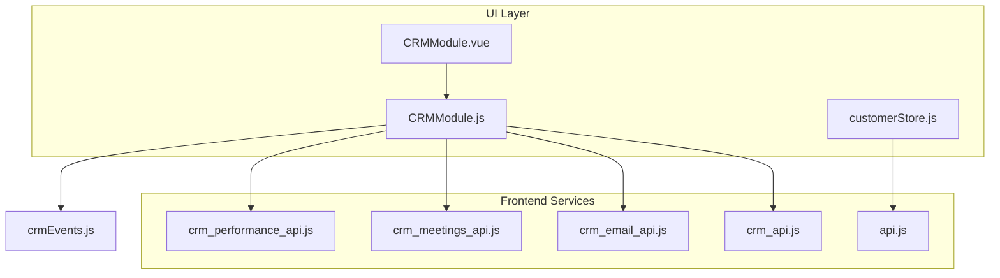
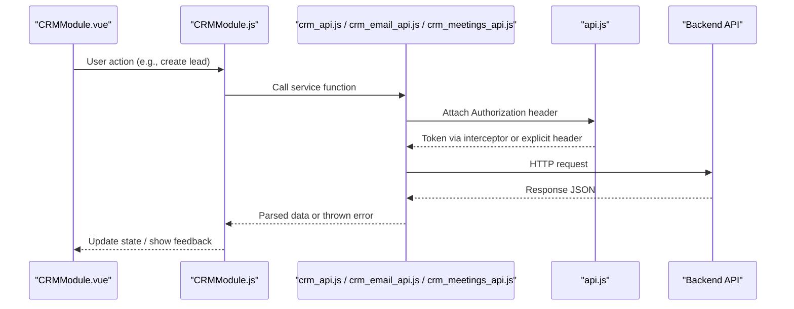
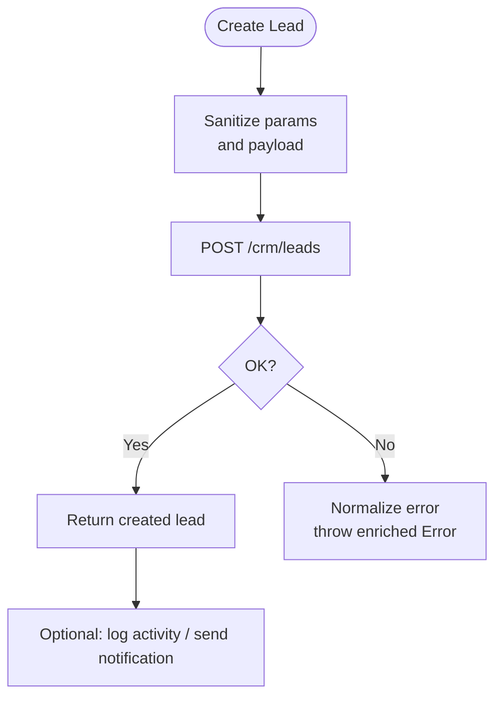
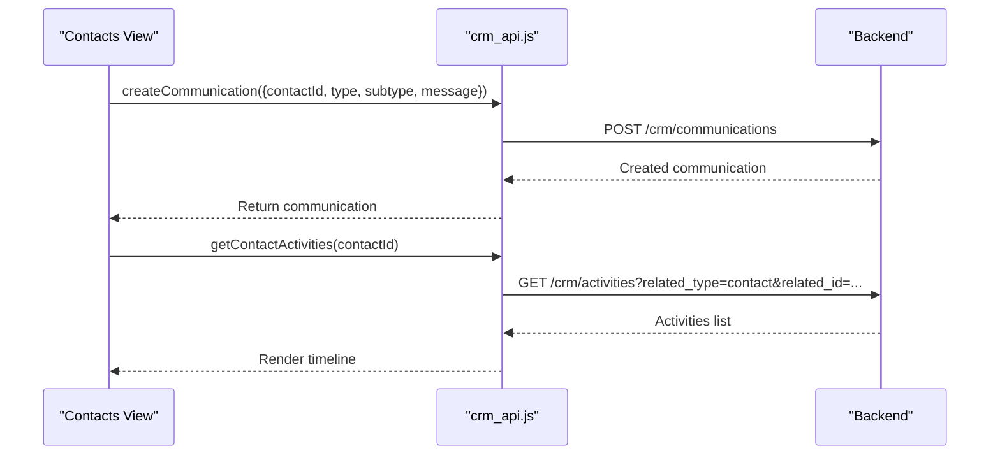
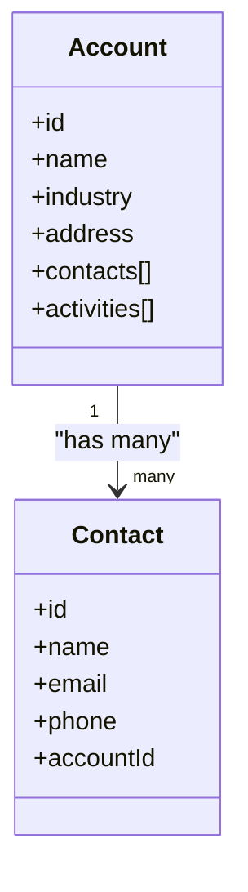
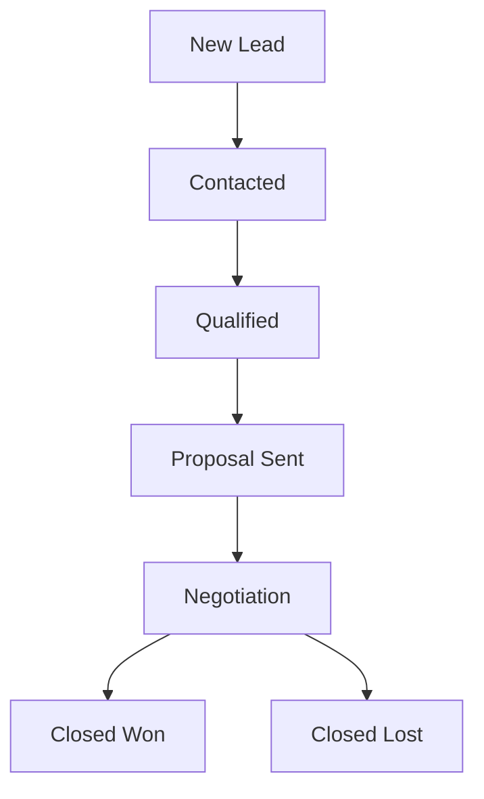
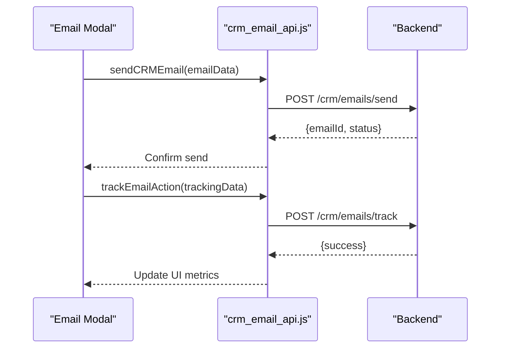
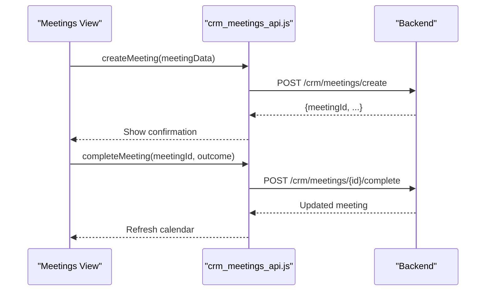
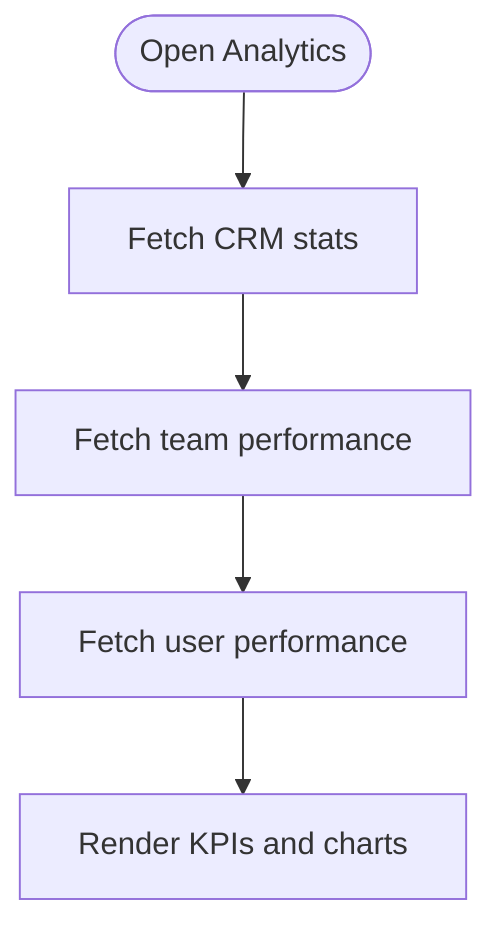
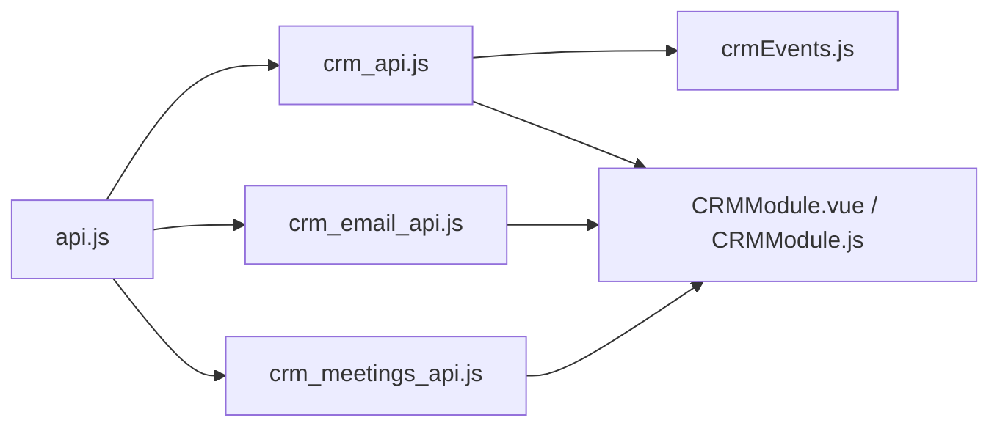

# CRM Service Layer

<cite>
**Referenced Files in This Document**
- [crm_api.js](file://src/services/crm_api.js)
- [crm_email_api.js](file://src/services/crm_email_api.js)
- [crm_meetings_api.js](file://src/services/crm_meetings_api.js)
- [crm_performance_api.js](file://src/services/crm_performance_api.js)
- [api.js](file://src/services/api.js)
- [CRMModule.vue](file://src/views/Modules/crm/CRMModule.vue)
- [CRMModule.js](file://src/views/Modules/crm/composables/CRMModule.js)
- [customerStore.js](file://src/stores/customerStore.js)
- [crmEvents.js](file://src/events/crmEvents.js)
</cite>

## Table of Contents
1. [Introduction](#introduction)
2. [Project Structure](#project-structure)
3. [Core Components](#core-components)
4. [Architecture Overview](#architecture-overview)
5. [Detailed Component Analysis](#detailed-component-analysis)
6. [Dependency Analysis](#dependency-analysis)
7. [Performance Considerations](#performance-considerations)
8. [Troubleshooting Guide](#troubleshooting-guide)
9. [Conclusion](#conclusion)
10. [Appendices](#appendices)

## Introduction
This document describes the CRM service layer exposed by the frontend, focusing on customer relationship management APIs for leads, contacts, accounts, deals, communications (including email), meetings, and performance analytics. It explains how the UI composes these services to implement common CRM workflows such as lead creation and conversion, contact association with accounts and deals, communication tracking, meeting scheduling, and reporting.

## Project Structure
The CRM service layer is implemented as a set of focused JavaScript modules under src/services that wrap HTTP calls to the backend. The main orchestration logic lives in the CRM module composables and views.

**Diagram sources**
- [crm_api.js:1-800](file://src/services/crm_api.js#L1-L800)
- [crm_email_api.js:1-313](file://src/services/crm_email_api.js#L1-L313)
- [crm_meetings_api.js:1-322](file://src/services/crm_meetings_api.js#L1-L322)
- [crm_performance_api.js:1-19](file://src/services/crm_performance_api.js#L1-L19)
- [api.js:1-209](file://src/services/api.js#L1-L209)
- [CRMModule.vue:1-411](file://src/views/Modules/crm/CRMModule.vue#L1-L411)
- [CRMModule.js:1-800](file://src/views/Modules/crm/composables/CRMModule.js#L1-L800)
- [customerStore.js:1-187](file://src/stores/customerStore.js#L1-L187)
- [crmEvents.js:1-31](file://src/events/crmEvents.js#L1-L31)

**Section sources**
- [CRMModule.vue:1-411](file://src/views/Modules/crm/CRMModule.vue#L1-L411)
- [CRMModule.js:1-800](file://src/views/Modules/crm/composables/CRMModule.js#L1-L800)
- [api.js:1-209](file://src/services/api.js#L1-L209)

## Core Components
- CRM API client: Unified functions for leads, contacts, accounts, deals, activities, visits, notifications, metadata, bulk operations, and stats.
- Email integration: Send, schedule, list, track, and configure emails linked to CRM records.
- Meetings API: Create, list, update, delete, complete, cancel meetings; add notes; fetch stats and upcoming/today’s meetings.
- Performance API: Fetch user performance metrics across CRM entities.
- Shared auth and base URL: Centralized token injection, refresh handling, and base URL resolution.
- Event bus: Lightweight pub/sub for CRM events used across components.

**Section sources**
- [crm_api.js:1-800](file://src/services/crm_api.js#L1-L800)
- [crm_email_api.js:1-313](file://src/services/crm_email_api.js#L1-L313)
- [crm_meetings_api.js:1-322](file://src/services/crm_meetings_api.js#L1-L322)
- [crm_performance_api.js:1-19](file://src/services/crm_performance_api.js#L1-L19)
- [api.js:1-209](file://src/services/api.js#L1-L209)
- [crmEvents.js:1-31](file://src/events/crmEvents.js#L1-L31)

## Architecture Overview
The CRM service layer follows a layered approach:
- UI components call composables that encapsulate business logic and state.
- Composables invoke service modules that perform HTTP requests using a shared base URL and authentication.
- Error handling is centralized in the CRM API client with consistent response parsing and error enrichment.
- Cross-cutting concerns like token refresh are handled at the axios interceptor level.

**Diagram sources**
- [crm_api.js:11-32](file://src/services/crm_api.js#L11-L32)
- [api.js:64-146](file://src/services/api.js#L64-L146)
- [CRMModule.js:270-309](file://src/views/Modules/crm/composables/CRMModule.js#L270-L309)

## Detailed Component Analysis

### Lead Management
- Endpoints:
  - List leads with filters
  - Get single lead
  - Create, update, delete leads
  - Lead notes, emails, attachments, campaigns
  - Lead activities and conversions
  - Bulk import/export and bulk assign/delete/update
- Data model highlights:
  - Fields include name, email, phone, company, position, priority, stage, value, source, assignedTo, notes, location fields, social links, timestamps.
  - Stage values map to pipeline stages defined in the module.
- Validation rules:
  - Parameter sanitization removes undefined/null/empty strings before building query strings.
  - Backend validation errors are normalized into a single message string.
- Common workflows:
  - Create a lead, then convert it to an account/contact/deal.
  - Log activities and notes to maintain audit trails.
  - Import leads from files and process uploads.

**Diagram sources**
- [crm_api.js:34-44](file://src/services/crm_api.js#L34-L44)
- [crm_api.js:78-108](file://src/services/crm_api.js#L78-L108)
- [crm_api.js:11-32](file://src/services/crm_api.js#L11-L32)

**Section sources**
- [crm_api.js:46-143](file://src/services/crm_api.js#L46-L143)
- [crm_api.js:305-323](file://src/services/crm_api.js#L305-L323)
- [crm_api.js:539-585](file://src/services/crm_api.js#L539-L585)
- [CRMModule.js:481-535](file://src/views/Modules/crm/composables/CRMModule.js#L481-L535)

### Contact Management
- Endpoints:
  - List, get, create, update, delete contacts
  - Get contact activities
- Associations:
  - Contacts can be associated with accounts and deals through related IDs in activities and communications.
  - Communications (calls, emails, WhatsApp) are logged against contacts and surfaced in activity timelines.
- Communication tracking:
  - Create communications with type/subtype/message and link to contactId.
  - Add notes to communications for detailed follow-ups.

**Diagram sources**
- [crm_api.js:145-215](file://src/services/crm_api.js#L145-L215)
- [crm_api.js:329-364](file://src/services/crm_api.js#L329-L364)

**Section sources**
- [crm_api.js:128-164](file://src/services/crm_api.js#L128-L164)
- [crm_api.js:329-364](file://src/services/crm_api.js#L329-L364)

### Account Management
- Endpoints:
  - List, get, create, update, delete accounts
  - Get account contacts and activities
- Organization and company data:
  - Accounts represent organizations; contacts belong to accounts.
  - Activities are tracked per account for history and auditing.

**Diagram sources**
- [crm_api.js:366-412](file://src/services/crm_api.js#L366-L412)

**Section sources**
- [crm_api.js:366-412](file://src/services/crm_api.js#L366-L412)

### Deal Tracking and Pipeline
- Endpoints:
  - List, get, create, update, delete deals
  - Get deal activities
  - Filter deals by accountId
- Stages and probability:
  - Pipeline stages are configurable via CRM metadata and default stages.
  - Probability calculations are typically derived from stage order and deal value; UI computes weighted pipeline value based on stages.
- Workflow:
  - Leads progress through stages and may convert to accounts/deals.
  - Deals carry value and stage; probability influences weighted pipeline totals.

**Diagram sources**
- [CRMModule.js:527-552](file://src/views/Modules/crm/composables/CRMModule.js#L527-L552)
- [crm_api.js:414-468](file://src/services/crm_api.js#L414-L468)

**Section sources**
- [crm_api.js:414-468](file://src/services/crm_api.js#L414-L468)
- [CRMModule.js:527-552](file://src/views/Modules/crm/composables/CRMModule.js#L527-L552)

### Email Integration
- Capabilities:
  - Send CRM-related emails
  - Schedule emails for later delivery
  - List emails by folder and filter by linked CRM record
  - Track email actions (open, click, bounce, reply)
  - Manage email configurations per tenant
- Typical flow:
  - Compose email with recipients, subject, body, optional attachments and scheduled time.
  - Send or schedule; track interactions via dedicated endpoints.

**Diagram sources**
- [crm_email_api.js:13-35](file://src/services/crm_email_api.js#L13-L35)
- [crm_email_api.js:42-64](file://src/services/crm_email_api.js#L42-L64)
- [crm_email_api.js:138-159](file://src/services/crm_email_api.js#L138-L159)

**Section sources**
- [crm_email_api.js:13-159](file://src/services/crm_email_api.js#L13-L159)
- [crm_email_api.js:166-313](file://src/services/crm_email_api.js#L166-L313)

### Meeting Scheduling and Calendar Integration
- Capabilities:
  - Create, list, get, update, delete meetings
  - Complete or cancel meetings with optional outcome/reason
  - Add notes to meetings
  - Fetch stats, upcoming meetings, and today’s meetings
- Integration points:
  - LinkedRecordType and LinkedRecordId associate meetings with CRM records (leads, contacts, accounts, deals).
  - Reminders and virtual meeting URLs support remote collaboration.

**Diagram sources**
- [crm_meetings_api.js:13-36](file://src/services/crm_meetings_api.js#L13-L36)
- [crm_meetings_api.js:166-190](file://src/services/crm_meetings_api.js#L166-L190)

**Section sources**
- [crm_meetings_api.js:13-322](file://src/services/crm_meetings_api.js#L13-L322)
- [crm_api.js:587-620](file://src/services/crm_api.js#L587-L620)

### Performance Analytics
- Endpoints:
  - Team performance metrics
  - User performance details including activities and sales counts
- Use cases:
  - Dashboard KPIs for conversion rate, pipeline value, open deals, and stale leads.
  - Individual performance breakdowns for coaching and reporting.

**Diagram sources**
- [crm_api.js:748-760](file://src/services/crm_api.js#L748-L760)
- [crm_performance_api.js:1-19](file://src/services/crm_performance_api.js#L1-L19)

**Section sources**
- [crm_api.js:748-760](file://src/services/crm_api.js#L748-L760)
- [crm_performance_api.js:1-19](file://src/services/crm_performance_api.js#L1-L19)

## Dependency Analysis
- Authentication and Base URL:
  - All services rely on a shared base URL and inject Authorization headers via local storage tokens.
  - Axios interceptors handle automatic token refresh on 401 responses and queue retries.
- CRM Module Orchestration:
  - The composable centralizes state for leads, contacts, accounts, deals, meetings, and communications.
  - It coordinates fetching metadata, pipeline stages, and performing bulk operations.
- Event Bus:
  - Simple event emitter allows decoupled updates between components (e.g., branch changes trigger re-fetches).

**Diagram sources**
- [api.js:64-146](file://src/services/api.js#L64-L146)
- [crm_api.js:1-9](file://src/services/crm_api.js#L1-L9)
- [crm_email_api.js:1-7](file://src/services/crm_email_api.js#L1-L7)
- [crm_meetings_api.js:1-7](file://src/services/crm_meetings_api.js#L1-L7)
- [crmEvents.js:1-31](file://src/events/crmEvents.js#L1-L31)

**Section sources**
- [api.js:64-146](file://src/services/api.js#L64-L146)
- [CRMModule.js:59-67](file://src/views/Modules/crm/composables/CRMModule.js#L59-L67)

## Performance Considerations
- Parameter sanitization reduces unnecessary query parameters, minimizing payload size and server-side filtering overhead.
- Batch operations (bulk assign/delete/update) reduce round trips for large datasets.
- Pagination and limits are applied where supported (e.g., email lists, meetings).
- Local caching strategies (e.g., location search results) improve responsiveness.
- Avoid redundant network calls by consolidating data loads in composables and leveraging computed properties.

[No sources needed since this section provides general guidance]

## Troubleshooting Guide
- Authentication failures:
  - Ensure token exists in local storage; axios interceptors will attempt refresh on 401 and redirect to login if refresh fails.
- Network errors:
  - Errors are normalized with status codes and parsed messages; check console logs for detailed stack traces.
- Validation errors:
  - Backend validation arrays are collapsed into readable messages; inspect the error object’s data field for specifics.
- Email configuration issues:
  - Use test endpoint to validate SMTP settings; review error detail for connection or credential problems.
- Meetings conflicts:
  - When completing or cancelling meetings, verify IDs and tenant context; errors include detail messages for invalid states.

**Section sources**
- [api.js:90-146](file://src/services/api.js#L90-L146)
- [crm_api.js:11-32](file://src/services/crm_api.js#L11-L32)
- [crm_email_api.js:288-313](file://src/services/crm_email_api.js#L288-L313)
- [crm_meetings_api.js:166-222](file://src/services/crm_meetings_api.js#L166-L222)

## Conclusion
The CRM service layer provides a comprehensive set of APIs for managing leads, contacts, accounts, deals, communications, meetings, and performance analytics. It integrates tightly with the UI through a modular architecture that emphasizes reusable services, centralized error handling, and robust authentication. By following the documented workflows and endpoints, teams can implement effective CRM processes, track communications, manage pipelines, and generate actionable insights.

[No sources needed since this section summarizes without analyzing specific files]

## Appendices

### Practical Workflows

- Lead Creation and Conversion
  - Create a lead via the leads endpoint, optionally attach notes and activities.
  - Convert the lead to an account/contact/deal using the conversion endpoint.
  - Verify associations by retrieving related activities and communications.

- Contact Association with Accounts and Deals
  - Create a contact and associate it with an account ID.
  - Link the contact to a deal via activities or communications.
  - Retrieve contact activities to confirm associations.

- Email Sending and Tracking
  - Compose and send an email linked to a CRM record.
  - Schedule emails for future delivery.
  - Track opens and clicks to measure engagement.

- Meeting Scheduling
  - Create a meeting with participants and linked CRM record.
  - Set reminders and virtual meeting URLs.
  - Complete or cancel meetings and add notes post-meeting.

- Performance Reporting
  - Fetch CRM stats and team performance to compute KPIs.
  - Use user performance endpoints to drill down into individual contributions.

[No sources needed since this section provides general guidance]