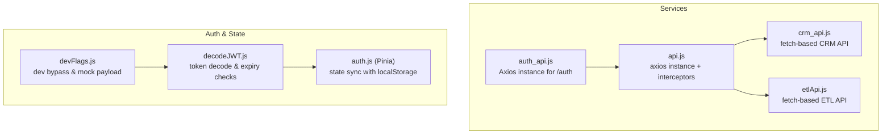
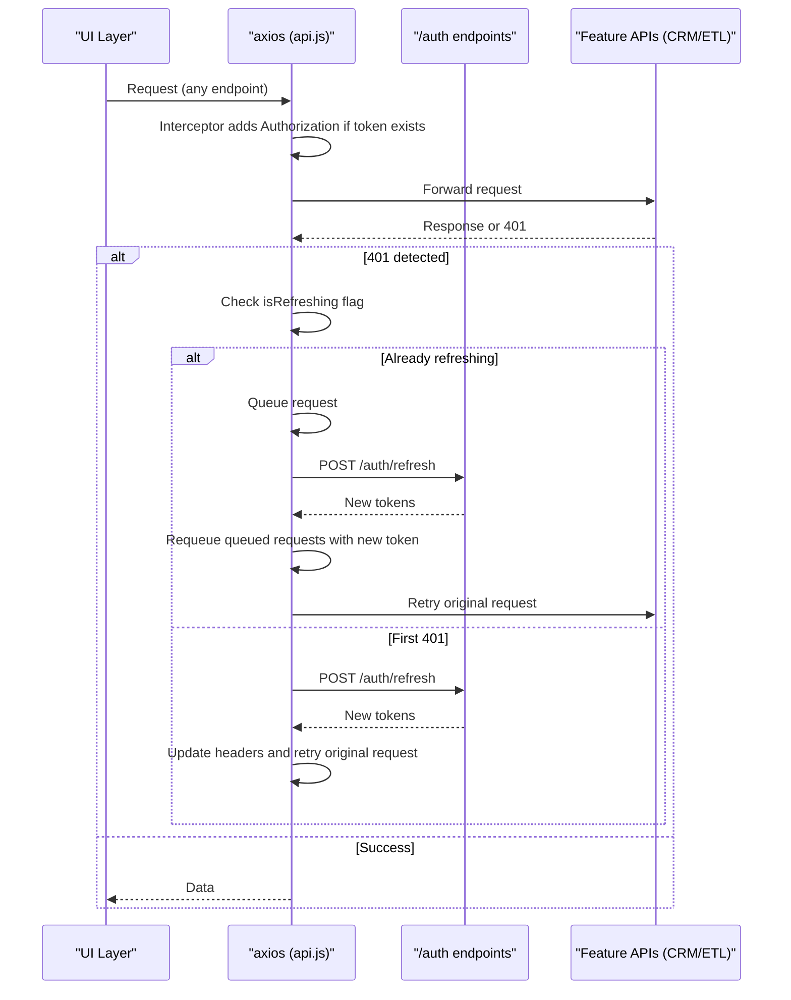
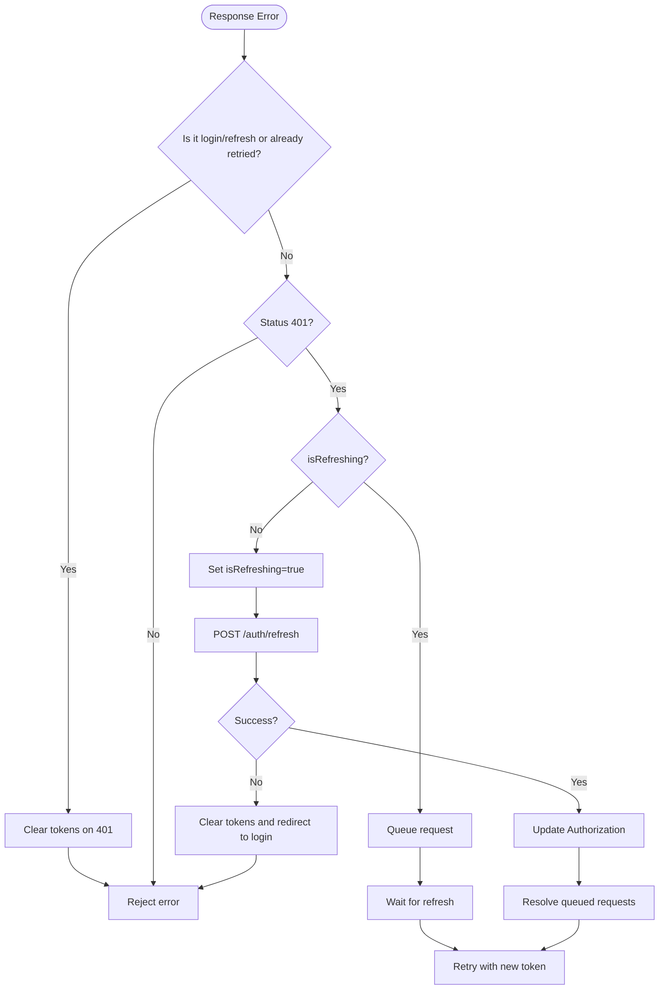
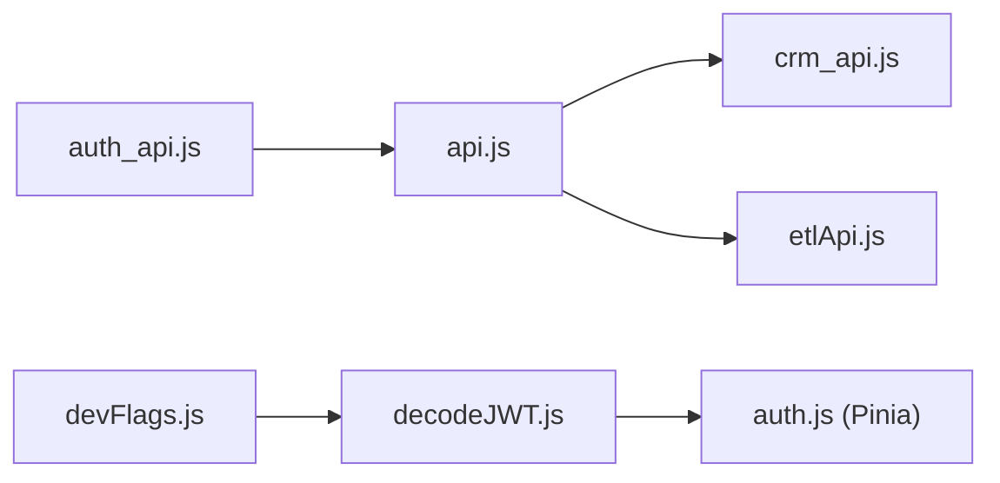

# Centralized API Client

<cite>
**Referenced Files in This Document**
- [api.js](file://src/services/api.js)
- [auth_api.js](file://src/services/auth_api.js)
- [crm_api.js](file://src/services/crm_api.js)
- [etlApi.js](file://src/services/etlApi.js)
- [decodeJWT.js](file://src/services/decodeJWT.js)
- [auth.js](file://src/stores/auth.js)
- [devFlags.js](file://src/config/devFlags.js)
- [vite.config.js](file://vite.config.js)
</cite>

## Table of Contents
1. Introduction
2. Project Structure
3. Core Components
4. Architecture Overview
5. Detailed Component Analysis
6. Dependency Analysis
7. Performance Considerations
8. Troubleshooting Guide
9. Conclusion
10. Appendices

## Introduction
This document explains the centralized API client implementation used across the frontend to communicate with backend services. It covers axios instance configuration, base URL resolution, environment-specific endpoints, request and response interceptors for authentication and token refresh, error handling strategies, token management via localStorage, and security considerations such as token storage and secure communication.

## Project Structure
The API client is implemented using a combination of:
- A shared axios instance with global interceptors for automatic authentication and 401-based token refresh
- Feature-specific service modules that use either fetch or axios with consistent header injection and error normalization
- A Pinia store for auth state synchronization with localStorage
- JWT decoding utilities for session validation and role/email extraction

**Diagram sources**
- [api.js:1-18](file://src/services/api.js#L1-L18)
- [auth_api.js:1-17](file://src/services/auth_api.js#L1-L17)
- [crm_api.js:1-32](file://src/services/crm_api.js#L1-L32)
- [etlApi.js:1-38](file://src/services/etlApi.js#L1-L38)
- [decodeJWT.js:1-58](file://src/services/decodeJWT.js#L1-L58)
- [auth.js:1-21](file://src/stores/auth.js#L1-L21)
- [devFlags.js:1-27](file://src/config/devFlags.js#L1-L27)

**Section sources**
- [api.js:1-18](file://src/services/api.js#L1-L18)
- [auth_api.js:1-17](file://src/services/auth_api.js#L1-L17)
- [crm_api.js:1-32](file://src/services/crm_api.js#L1-L32)
- [etlApi.js:1-38](file://src/services/etlApi.js#L1-L38)
- [decodeJWT.js:1-58](file://src/services/decodeJWT.js#L1-L58)
- [auth.js:1-21](file://src/stores/auth.js#L1-L21)
- [devFlags.js:1-27](file://src/config/devFlags.js#L1-L27)

## Core Components
- Base URL resolution and exports
  - The shared base URL is resolved from an environment variable with a fallback to local development or a hosted backend.
  - The resolved value is exported for reuse by other services.
- Axios request interceptor
  - Automatically attaches Authorization header with a Bearer token read from localStorage when present.
- Axios response interceptor
  - Implements automatic token refresh on 401 responses with a queue to serialize concurrent requests during refresh.
  - Prevents retry loops for login/refresh endpoints and clears tokens on failure.
- Auth service module
  - Provides login, signup, refresh, and profile helpers using a dedicated axios instance configured for /auth endpoints.
- Feature services (CRM, ETL)
  - Use fetch with consistent header injection and normalized error handling.

**Section sources**
- [api.js:4-18](file://src/services/api.js#L4-L18)
- [api.js:64-76](file://src/services/api.js#L64-L76)
- [api.js:78-146](file://src/services/api.js#L78-L146)
- [auth_api.js:1-27](file://src/services/auth_api.js#L1-L27)
- [crm_api.js:1-32](file://src/services/crm_api.js#L1-L32)
- [etlApi.js:1-38](file://src/services/etlApi.js#L1-L38)

## Architecture Overview
The system uses a layered approach:
- Global axios instance handles authentication and token refresh transparently for all axios-based calls.
- Feature services encapsulate domain logic and normalize errors.
- Auth utilities decode tokens and enforce session validity.
- Pinia store mirrors localStorage state for UI reactivity.

**Diagram sources**
- [api.js:64-76](file://src/services/api.js#L64-L76)
- [api.js:78-146](file://src/services/api.js#L78-L146)
- [auth_api.js:36-87](file://src/services/auth_api.js#L36-L87)

## Detailed Component Analysis

### Base URL Resolution and Environment Endpoints
- Base URL strategy:
  - Uses an environment variable when provided; otherwise falls back to localhost for local development or a production backend URL.
  - Exports the resolved base URL for consistent usage across services.
- Environment-specific behavior:
  - Development flags can enable a dev bypass mode that injects a mock payload for offline development.

Practical implications:
- Ensure VITE_API_BASE_URL is set correctly per environment to route requests to the intended backend.
- In development, you can toggle dev bypass to simulate authenticated sessions without a live backend.

**Section sources**
- [api.js:4-18](file://src/services/api.js#L4-L18)
- [devFlags.js:1-27](file://src/config/devFlags.js#L1-L27)

### Axios Request Interceptor: Automatic Authentication
- Behavior:
  - Reads the access token from localStorage and sets the Authorization header on every outgoing axios request if present.
  - Avoids overwriting existing Authorization headers.

Usage pattern:
- Any axios call automatically includes the bearer token when available, simplifying feature services.

**Section sources**
- [api.js:64-76](file://src/services/api.js#L64-L76)

### Axios Response Interceptor: Token Refresh and Error Handling
- Behavior:
  - Detects 401 responses and initiates a single refresh flow while queuing subsequent concurrent requests.
  - Skips refresh attempts for login/refresh endpoints to prevent infinite loops.
  - On successful refresh, updates the Authorization header and retries the original request.
  - On refresh failure, clears tokens and redirects to login.

Error handling:
- Normalizes errors and ensures callers receive meaningful messages.
- Queued requests are resolved or rejected based on refresh outcome.

**Diagram sources**
- [api.js:78-146](file://src/services/api.js#L78-L146)

**Section sources**
- [api.js:78-146](file://src/services/api.js#L78-L146)

### Auth Service Module: Login, Refresh, and Profile
- Dedicated axios instance for /auth endpoints with credentials support.
- Methods:
  - Login: authenticates and stores both access and refresh tokens.
  - Refresh: exchanges refresh token for new tokens and updates storage.
  - Signup: registers a new user and persists email.
  - Profile: fetches protected profile data.

Integration notes:
- Tokens are stored under consistent keys to be consumed by interceptors and JWT utilities.

**Section sources**
- [auth_api.js:1-27](file://src/services/auth_api.js#L1-L27)
- [auth_api.js:36-87](file://src/services/auth_api.js#L36-L87)
- [auth_api.js:89-141](file://src/services/auth_api.js#L89-L141)

### Feature Services: CRM and ETL
- Consistent header injection:
  - Each service reads the token from localStorage and sets Authorization on requests.
- Normalized error handling:
  - Parses response text into JSON when possible and constructs standardized error objects with status and data fields.
- Parameter sanitization:
  - Removes undefined/null/empty parameters before building query strings.

Examples:
- CRM operations: leads, customers, accounts, communications, notifications, meetings, bulk imports/exports.
- ETL operations: dashboard queries, run details, config listing, pipeline triggers.

**Section sources**
- [crm_api.js:1-32](file://src/services/crm_api.js#L1-L32)
- [crm_api.js:46-143](file://src/services/crm_api.js#L46-L143)
- [crm_api.js:228-287](file://src/services/crm_api.js#L228-L287)
- [crm_api.js:329-412](file://src/services/crm_api.js#L329-L412)
- [crm_api.js:418-468](file://src/services/crm_api.js#L418-L468)
- [crm_api.js:539-585](file://src/services/crm_api.js#L539-L585)
- [crm_api.js:587-620](file://src/services/crm_api.js#L587-L620)
- [crm_api.js:622-662](file://src/services/crm_api.js#L622-L662)
- [crm_api.js:718-759](file://src/services/crm_api.js#L718-L759)
- [crm_api.js:766-799](file://src/services/crm_api.js#L766-L799)
- [etlApi.js:1-38](file://src/services/etlApi.js#L1-L38)
- [etlApi.js:68-114](file://src/services/etlApi.js#L68-L114)

### Token Management System
- Storage keys:
  - Access token stored under a consistent key and also mirrored under another key for compatibility.
  - Refresh token stored separately for renewal flows.
- Session persistence:
  - Pinia auth store initializes state from localStorage and provides logout actions to clear sensitive data.
- JWT decoding:
  - Decodes tokens to extract roles, emails, and names; validates expiration and triggers logout on expiry.
  - Supports dev bypass mode to inject a mock payload for local development.

Security note:
- Tokens are persisted in localStorage; ensure your deployment enforces HTTPS and consider additional protections like HttpOnly cookies where feasible.

**Section sources**
- [api.js:166-200](file://src/services/api.js#L166-L200)
- [auth_api.js:36-87](file://src/services/auth_api.js#L36-L87)
- [auth.js:1-21](file://src/stores/auth.js#L1-L21)
- [decodeJWT.js:1-58](file://src/services/decodeJWT.js#L1-L58)
- [devFlags.js:1-27](file://src/config/devFlags.js#L1-L27)

### Practical Examples and Usage Patterns
- Making authenticated API calls:
  - Use any feature service function; they automatically include Authorization headers when a token is present.
- Handling different HTTP status codes:
  - Feature services throw normalized errors with status and data fields; handle them in calling code to display appropriate messages.
- Custom error handling strategies:
  - Wrap calls in try/catch and branch on error.status to show user-friendly feedback or trigger retries.

Example references:
- CRM lead operations and ETL dashboard calls demonstrate consistent patterns for GET/POST/PUT/DELETE with error normalization.

**Section sources**
- [crm_api.js:11-32](file://src/services/crm_api.js#L11-L32)
- [crm_api.js:46-143](file://src/services/crm_api.js#L46-L143)
- [etlApi.js:18-38](file://src/services/etlApi.js#L18-L38)

## Dependency Analysis
- api.js:
  - Defines the global axios instance and interceptors; serves as the central point for authentication and token refresh.
- auth_api.js:
  - Creates a separate axios instance scoped to /auth endpoints; implements login/refresh/profile flows.
- crm_api.js and etlApi.js:
  - Depend on the shared base URL and rely on localStorage for token presence; implement their own error normalization.
- decodeJWT.js:
  - Depends on jwt-decode and dev flags to validate and interpret tokens.
- auth.js (Pinia):
  - Mirrors localStorage state for reactive UI components.

**Diagram sources**
- [api.js:1-18](file://src/services/api.js#L1-L18)
- [auth_api.js:1-27](file://src/services/auth_api.js#L1-L27)
- [crm_api.js:1-32](file://src/services/crm_api.js#L1-L32)
- [etlApi.js:1-38](file://src/services/etlApi.js#L1-L38)
- [decodeJWT.js:1-58](file://src/services/decodeJWT.js#L1-L58)
- [auth.js:1-21](file://src/stores/auth.js#L1-L21)
- [devFlags.js:1-27](file://src/config/devFlags.js#L1-L27)

**Section sources**
- [api.js:1-18](file://src/services/api.js#L1-L18)
- [auth_api.js:1-27](file://src/services/auth_api.js#L1-L27)
- [crm_api.js:1-32](file://src/services/crm_api.js#L1-L32)
- [etlApi.js:1-38](file://src/services/etlApi.js#L1-L38)
- [decodeJWT.js:1-58](file://src/services/decodeJWT.js#L1-L58)
- [auth.js:1-21](file://src/stores/auth.js#L1-L21)
- [devFlags.js:1-27](file://src/config/devFlags.js#L1-L27)

## Performance Considerations
- Token refresh batching:
  - The response interceptor queues concurrent requests during a refresh to avoid redundant refresh calls and reduce network overhead.
- Header caching:
  - Authorization headers are attached once per request via interceptors, minimizing repeated logic in feature services.
- Error normalization:
  - Centralized parsing reduces duplicate error-handling code and improves consistency across features.

[No sources needed since this section provides general guidance]

## Troubleshooting Guide
Common issues and resolutions:
- 401 Unauthorized:
  - The interceptor will attempt to refresh tokens; if refresh fails, tokens are cleared and the user is redirected to login.
- Stale or missing tokens:
  - Ensure login flow stores both access and refresh tokens under expected keys; verify localStorage contents.
- Dev environment quirks:
  - When dev bypass is enabled, mock payloads may be used; confirm flags and behavior in development builds.

Operational tips:
- Inspect network requests to verify Authorization headers are present.
- Check console logs for token decoding warnings or refresh failures.
- Validate environment variables for correct base URL configuration.

**Section sources**
- [api.js:78-146](file://src/services/api.js#L78-L146)
- [api.js:166-200](file://src/services/api.js#L166-L200)
- [decodeJWT.js:11-38](file://src/services/decodeJWT.js#L11-L38)
- [devFlags.js:1-27](file://src/config/devFlags.js#L1-L27)

## Conclusion
The centralized API client provides a robust foundation for authenticated communication with backend services. It leverages axios interceptors for seamless token attachment and automatic refresh, normalizes errors across feature services, and maintains session state through localStorage and Pinia. By following the documented patterns, developers can confidently implement authenticated API calls, handle diverse HTTP statuses, and maintain secure, efficient interactions with the backend.

[No sources needed since this section summarizes without analyzing specific files]

## Appendices

### Security Considerations
- Token storage:
  - Tokens are stored in localStorage; ensure your application runs over HTTPS and consider server-side protections or HttpOnly cookies where applicable.
- XSS prevention:
  - Avoid rendering raw tokens in UI; sanitize inputs and outputs to mitigate cross-site scripting risks.
- Secure communication:
  - Enforce HTTPS for all API calls; configure CORS appropriately on the backend to restrict origins.

[No sources needed since this section provides general guidance]