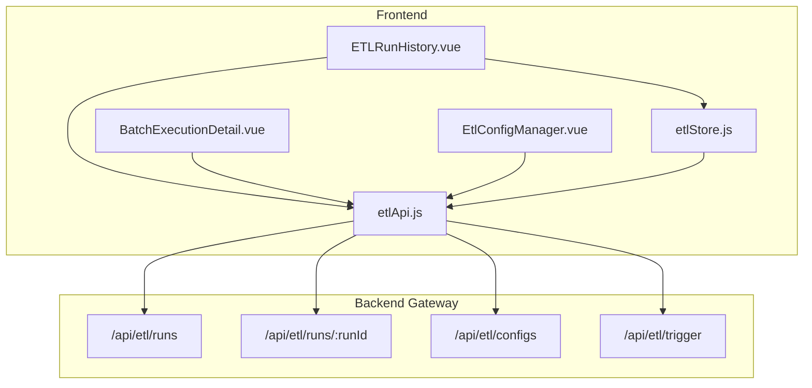
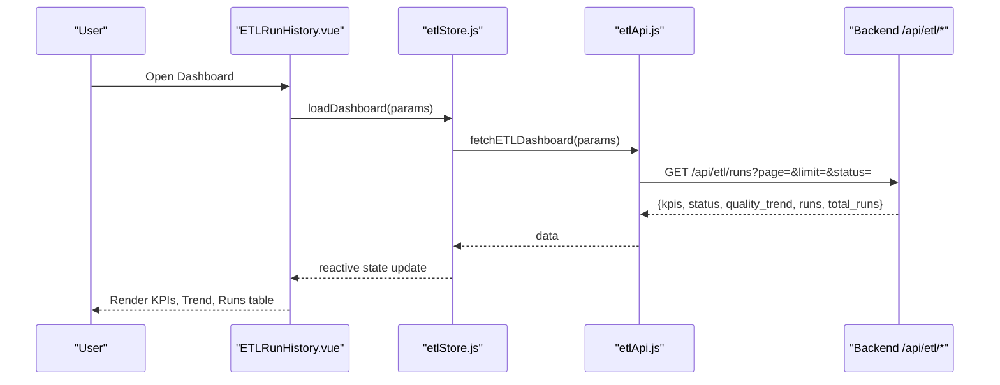
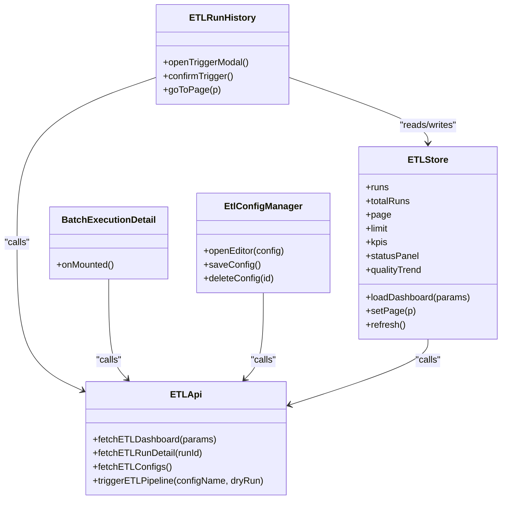
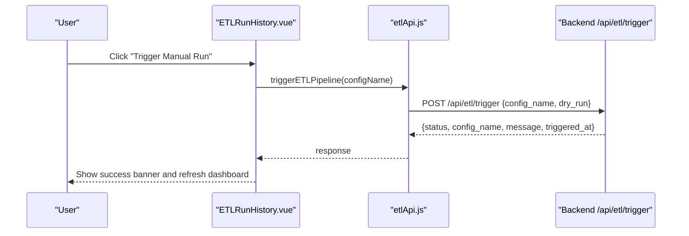
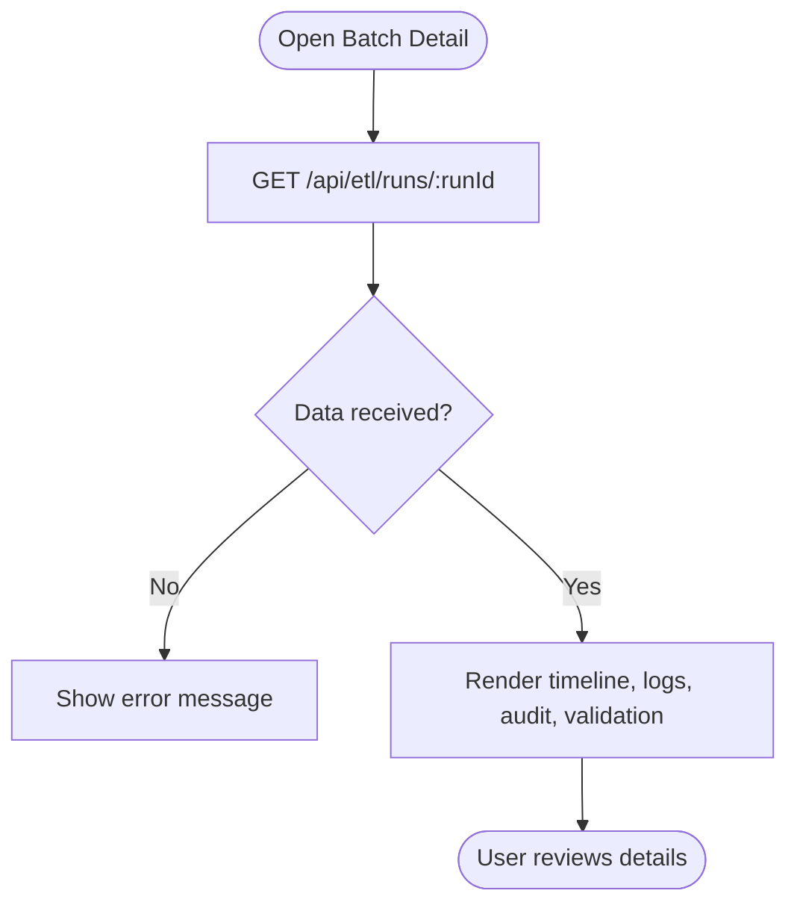

# Data Pipeline APIs

<cite>
**Referenced Files in This Document**
- [etlApi.js](file://src/services/etlApi.js)
- [etlStore.js](file://src/stores/etlStore.js)
- [ETLRunHistory.vue](file://src/views/Modules/datapipeline/ETLRunHistory.vue)
- [BatchExecutionDetail.vue](file://src/views/Modules/datapipeline/BatchExecutionDetail.vue)
- [EtlConfigManager.vue](file://src/views/Modules/datapipeline/EtlConfigManager.vue)
- [FRONTEND-DESIGN-DOC.md](file://docs/FRONTEND-DESIGN-DOC.md)
- [ETL-CONFIG-MANAGER-REQUIREMENTS.md](file://docs/ETL-CONFIG-MANAGER-REQUIREMENTS.md)
</cite>

## Table of Contents
1. [Introduction](#introduction)
2. [Project Structure](#project-structure)
3. [Core Components](#core-components)
4. [Architecture Overview](#architecture-overview)
5. [Detailed Component Analysis](#detailed-component-analysis)
6. [Dependency Analysis](#dependency-analysis)
7. [Performance Considerations](#performance-considerations)
8. [Troubleshooting Guide](#troubleshooting-guide)
9. [Conclusion](#conclusion)
10. [Appendices](#appendices)

## Introduction
This document describes the ETL pipeline management APIs exposed by the frontend and how they are consumed to manage pipeline configurations, execute batch jobs, monitor execution status, review run history, and analyze data quality outcomes. It also outlines orchestration touchpoints (triggering runs, viewing audit trails), error recovery patterns visible in the UI, and performance considerations for large datasets and frequent polling.

The implementation is a Vue 3 application that communicates with a backend gateway under /api/etl/. The primary capabilities documented here include:
- Listing and triggering ETL extraction specs
- Viewing paginated run history and KPIs
- Inspecting individual batch executions with logs, audit trails, and validation summaries
- Managing YAML-based configuration definitions via a dedicated manager view

## Project Structure
The ETL feature spans services, stores, and views:
- Services: HTTP clients for ETL endpoints
- Stores: Centralized state for dashboard data and pagination
- Views: Run History, Batch Detail, and Config Manager UIs

**Diagram sources**
- [ETLRunHistory.vue:267-397](file://src/views/Modules/datapipeline/ETLRunHistory.vue#L267-L397)
- [BatchExecutionDetail.vue:113-151](file://src/views/Modules/datapipeline/BatchExecutionDetail.vue#L113-L151)
- [EtlConfigManager.vue:15-66](file://src/views/Modules/datapipeline/EtlConfigManager.vue#L15-L66)
- [etlStore.js:12-95](file://src/stores/etlStore.js#L12-L95)
- [etlApi.js:68-114](file://src/services/etlApi.js#L68-L114)

**Section sources**
- [FRONTEND-DESIGN-DOC.md:162-215](file://docs/FRONTEND-DESIGN-DOC.md#L162-L215)
- [ETL-CONFIG-MANAGER-REQUIREMENTS.md:203-240](file://docs/ETL-CONFIG-MANAGER-REQUIREMENTS.md#L203-L240)

## Core Components
- etlApi.js: Encapsulates all ETL API calls with consistent headers, parameter sanitization, and error handling.
- etlStore.js: Pinia store that loads dashboard data, manages pagination, and exposes reactive state to views.
- ETLRunHistory.vue: Main dashboard page showing health cards, quality trend, execution history table, and trigger modal.
- BatchExecutionDetail.vue: Detailed view of a single run including timeline, logs, audit trail, and validation breakdown.
- EtlConfigManager.vue: Configuration manager with inline editor and actions for creating/editing/deleting configs and triggering runs.

Key responsibilities:
- Fetching paginated runs and KPIs
- Triggering pipelines using available configs
- Rendering detailed execution timelines and validation insights
- Managing YAML-based extraction specs

**Section sources**
- [etlApi.js:10-114](file://src/services/etlApi.js#L10-L114)
- [etlStore.js:12-95](file://src/stores/etlStore.js#L12-L95)
- [ETLRunHistory.vue:267-397](file://src/views/Modules/datapipeline/ETLRunHistory.vue#L267-L397)
- [BatchExecutionDetail.vue:113-151](file://src/views/Modules/datapipeline/BatchExecutionDetail.vue#L113-L151)
- [EtlConfigManager.vue:83-131](file://src/views/Modules/datapipeline/EtlConfigManager.vue#L83-L131)

## Architecture Overview
The ETL feature follows a clear separation:
- Views call the Pinia store or service layer directly
- The service layer performs HTTP requests to the backend gateway
- Errors are normalized and surfaced to the UI with user-friendly messages

**Diagram sources**
- [ETLRunHistory.vue:394-397](file://src/views/Modules/datapipeline/ETLRunHistory.vue#L394-L397)
- [etlStore.js:33-57](file://src/stores/etlStore.js#L33-L57)
- [etlApi.js:68-75](file://src/services/etlApi.js#L68-L75)

## Detailed Component Analysis

### ETL API Service (etlApi.js)
Responsibilities:
- Build Authorization headers from stored token
- Sanitize query parameters to avoid empty values
- Normalize responses and throw typed errors with status and payload
- Provide functions for dashboard, run detail, config listing, and trigger

Endpoints used:
- GET /api/etl/runs?page=&limit=&status=
- GET /api/etl/runs/{runId}
- GET /api/etl/configs
- POST /api/etl/trigger

Error handling:
- Non-OK responses parse JSON when possible and extract human-readable messages
- Errors carry status and raw data for debugging

**Section sources**
- [etlApi.js:10-49](file://src/services/etlApi.js#L10-L49)
- [etlApi.js:68-114](file://src/services/etlApi.js#L68-L114)

### ETL Store (etlStore.js)
Responsibilities:
- Load dashboard data with pagination and filters
- Maintain runs, totals, KPIs, status panel, and quality trend
- Expose computed totalPages and isEmpty
- Provide actions for page navigation, filtering, and refresh

Data flow:
- Calls fetchETLDashboard with current page/limit/status
- Updates reactive state for views to consume

**Section sources**
- [etlStore.js:12-95](file://src/stores/etlStore.js#L12-L95)

### Run History View (ETLRunHistory.vue)
Capabilities:
- Displays health cards, quality trend chart, and execution history table
- Supports pagination driven by etlStore
- Provides “Trigger Manual Run” modal that lists configs and triggers a pipeline
- Shows success/error banners and auto-refreshes after trigger

Key interactions:
- On mount, loads dashboard via etlStore
- Opens trigger modal, fetches configs, and calls trigger endpoint
- Navigates to batch detail on row click

**Section sources**
- [ETLRunHistory.vue:267-397](file://src/views/Modules/datapipeline/ETLRunHistory.vue#L267-L397)

### Batch Execution Detail (BatchExecutionDetail.vue)
Capabilities:
- Loads full run details and validation summary
- Renders execution timeline, logs, audit trail, and rejection analysis
- Shows quality score with SLA comparison and row counts

Key interactions:
- Fetches run detail by runId
- Derives logs and audit entries from run metadata
- Updates timeline based on run status and timestamps

**Section sources**
- [BatchExecutionDetail.vue:113-151](file://src/views/Modules/datapipeline/BatchExecutionDetail.vue#L113-L151)
- [BatchExecutionDetail.vue:49-82](file://src/views/Modules/datapipeline/BatchExecutionDetail.vue#L49-L82)

### Config Manager (EtlConfigManager.vue)
Capabilities:
- Lists extraction specs with name, description, status, last modified, size
- Inline GitHub-style YAML editor with line numbers and preview mode
- Actions: edit, delete, and run pipeline
- Local save simulation and search filtering

Notes:
- Current implementation uses local state for configs; integration with backend CRUD endpoints can be added per requirements
- Trigger action wired to backend via etlApi.triggerETLPipeline

**Section sources**
- [EtlConfigManager.vue:15-66](file://src/views/Modules/datapipeline/EtlConfigManager.vue#L15-L66)
- [EtlConfigManager.vue:83-131](file://src/views/Modules/datapipeline/EtlConfigManager.vue#L83-L131)

## Dependency Analysis
Component relationships and data flows:

**Diagram sources**
- [ETLRunHistory.vue:267-397](file://src/views/Modules/datapipeline/ETLRunHistory.vue#L267-L397)
- [etlStore.js:12-95](file://src/stores/etlStore.js#L12-L95)
- [etlApi.js:68-114](file://src/services/etlApi.js#L68-L114)
- [BatchExecutionDetail.vue:113-151](file://src/views/Modules/datapipeline/BatchExecutionDetail.vue#L113-L151)
- [EtlConfigManager.vue:83-131](file://src/views/Modules/datapipeline/EtlConfigManager.vue#L83-L131)

**Section sources**
- [FRONTEND-DESIGN-DOC.md:218-256](file://docs/FRONTEND-DESIGN-DOC.md#L218-L256)

## Performance Considerations
- Pagination: Use etlStore.page and limit to reduce payload sizes for run history.
- Parameter sanitization: Avoid sending empty strings or undefined values to backend queries.
- Error normalization: Centralized error handling prevents redundant parsing and improves UX.
- UI responsiveness: Skeleton loaders and disabled states during async operations improve perceived performance.
- Chart rendering: Ensure containers have explicit dimensions to avoid layout thrashing.

[No sources needed since this section provides general guidance]

## Troubleshooting Guide
Common issues and resolutions:
- Failed to load dashboard: Check network tab for 4xx/5xx; verify token presence; inspect etlStore.error.
- Trigger pipeline fails: Confirm selected config exists; check banner message; retry after resolving backend issues.
- Batch detail not loading: Validate runId in route params; ensure backend returns expected fields for timeline and logs.
- Config list empty: Verify backend serves /api/etl/configs; handle error state with Retry button.

Error handling patterns:
- etlApi normalizes non-OK responses into Error objects with status and data.
- Views display user-friendly messages and provide retry or back navigation.

**Section sources**
- [etlApi.js:18-38](file://src/services/etlApi.js#L18-L38)
- [ETLRunHistory.vue:375-391](file://src/views/Modules/datapipeline/ETLRunHistory.vue#L375-L391)
- [BatchExecutionDetail.vue:145-151](file://src/views/Modules/datapipeline/BatchExecutionDetail.vue#L145-L151)

## Conclusion
The ETL pipeline management APIs are implemented through a clean separation of concerns:
- etlApi.js centralizes HTTP communication and error handling
- etlStore.js manages dashboard state and pagination
- Views provide rich UIs for monitoring, triggering, and investigating runs and configurations

The system supports:
- Listing and triggering extraction specs
- Paginated run history with KPIs and quality trends
- Detailed batch inspection with logs, audit trails, and validation insights
- A configurable YAML-based spec editor for managing extraction definitions

Future enhancements can integrate full CRUD for configs and add real-time streaming where supported by the backend.

[No sources needed since this section summarizes without analyzing specific files]

## Appendices

### API Endpoints Summary
- GET /api/etl/runs?page=&limit=&status= — Dashboard data (KPIs, status, quality trend, runs)
- GET /api/etl/runs/{runId} — Single run detail with validation summary
- GET /api/etl/configs — List extraction specs
- POST /api/etl/trigger — Trigger a pipeline run with a given config

Request/response shapes are defined in the requirements documentation and consumed by the service and views.

**Section sources**
- [ETL-CONFIG-MANAGER-REQUIREMENTS.md:203-240](file://docs/ETL-CONFIG-MANAGER-REQUIREMENTS.md#L203-L240)
- [FRONTEND-DESIGN-DOC.md:247-256](file://docs/FRONTEND-DESIGN-DOC.md#L247-L256)

### Common Workflows

#### Trigger a Pipeline Run

**Diagram sources**
- [ETLRunHistory.vue:375-391](file://src/views/Modules/datapipeline/ETLRunHistory.vue#L375-L391)
- [etlApi.js:107-114](file://src/services/etlApi.js#L107-L114)

#### Inspect a Batch Execution

**Diagram sources**
- [BatchExecutionDetail.vue:113-151](file://src/views/Modules/datapipeline/BatchExecutionDetail.vue#L113-L151)

[No sources needed since this diagram shows conceptual workflow, not actual code structure]