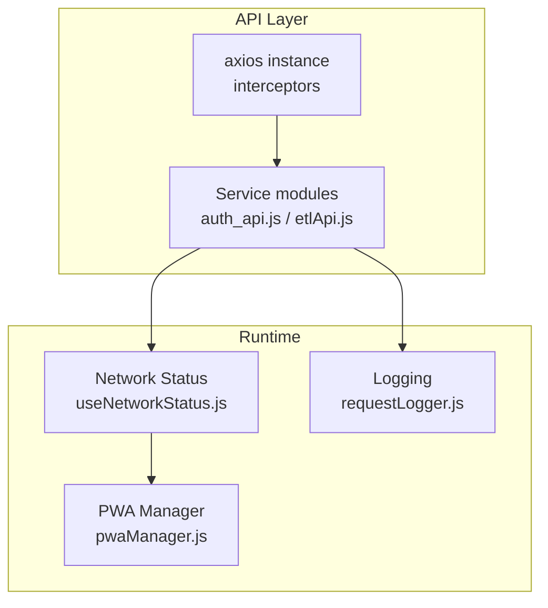
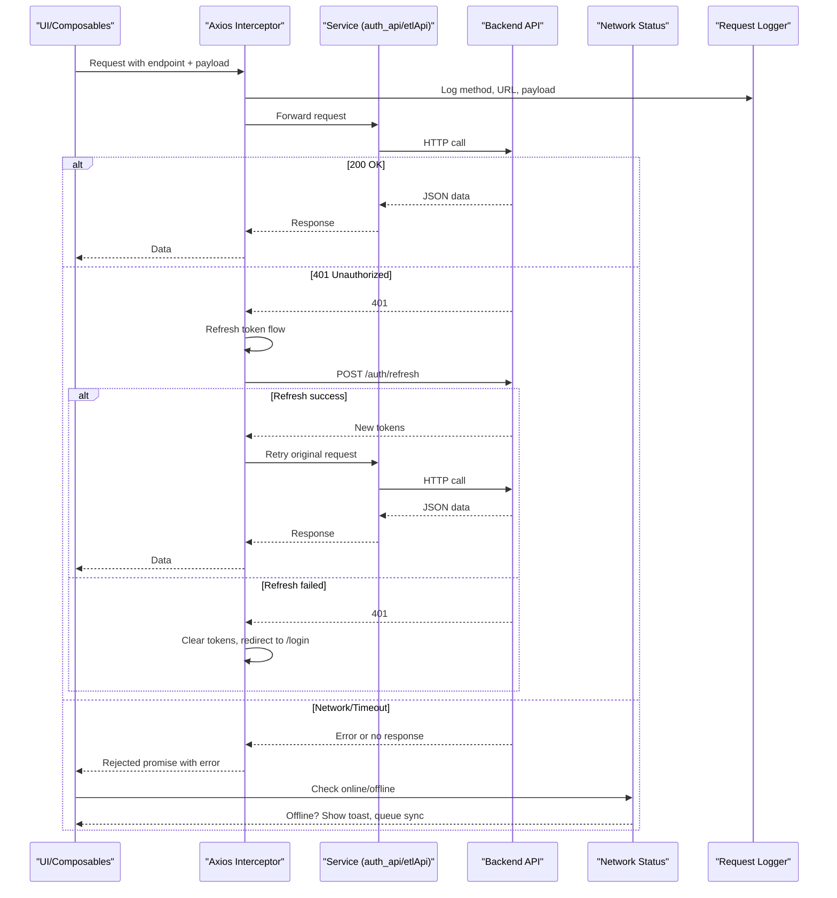
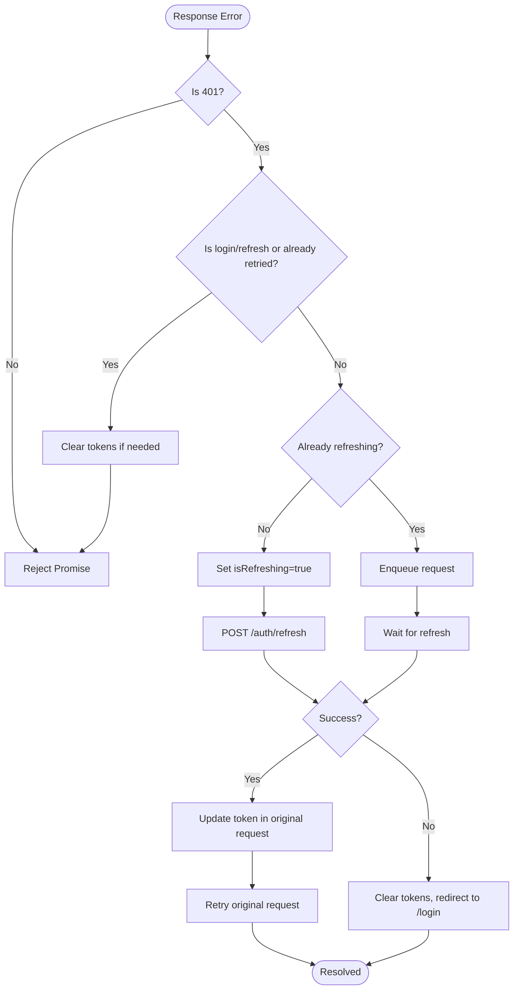
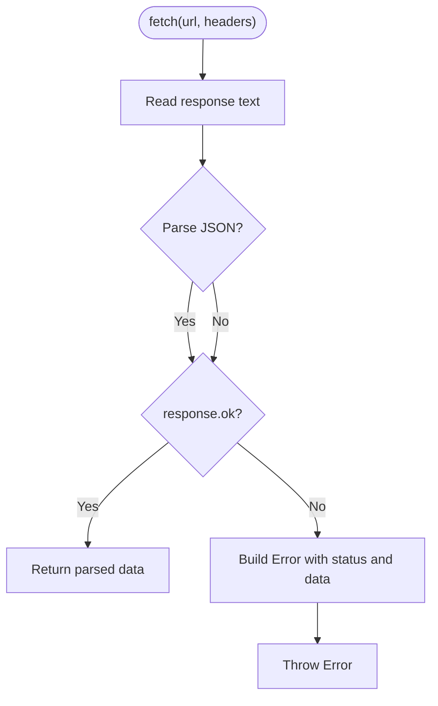
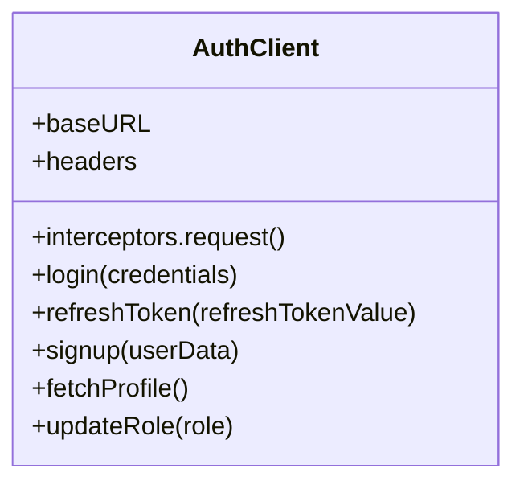
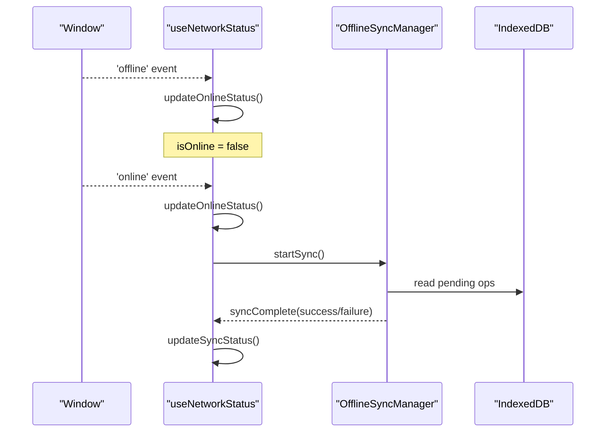
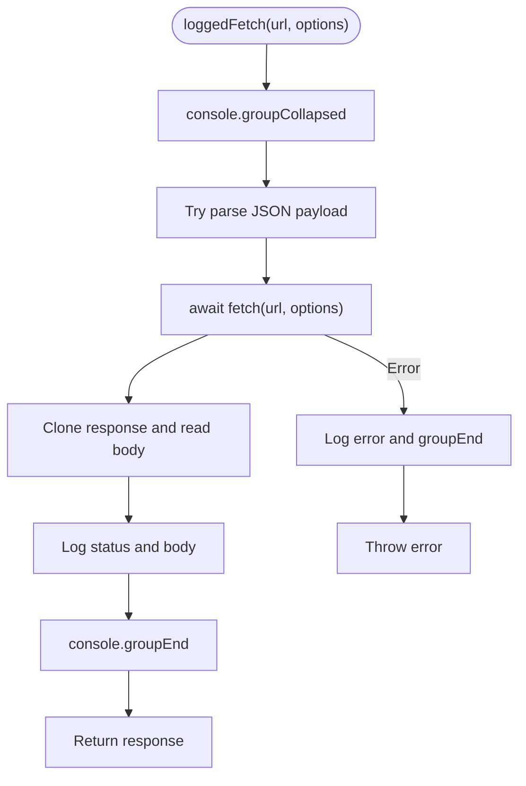
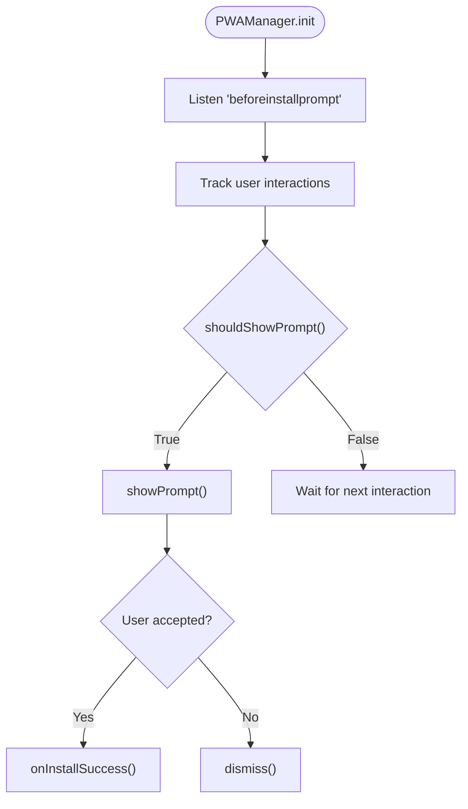
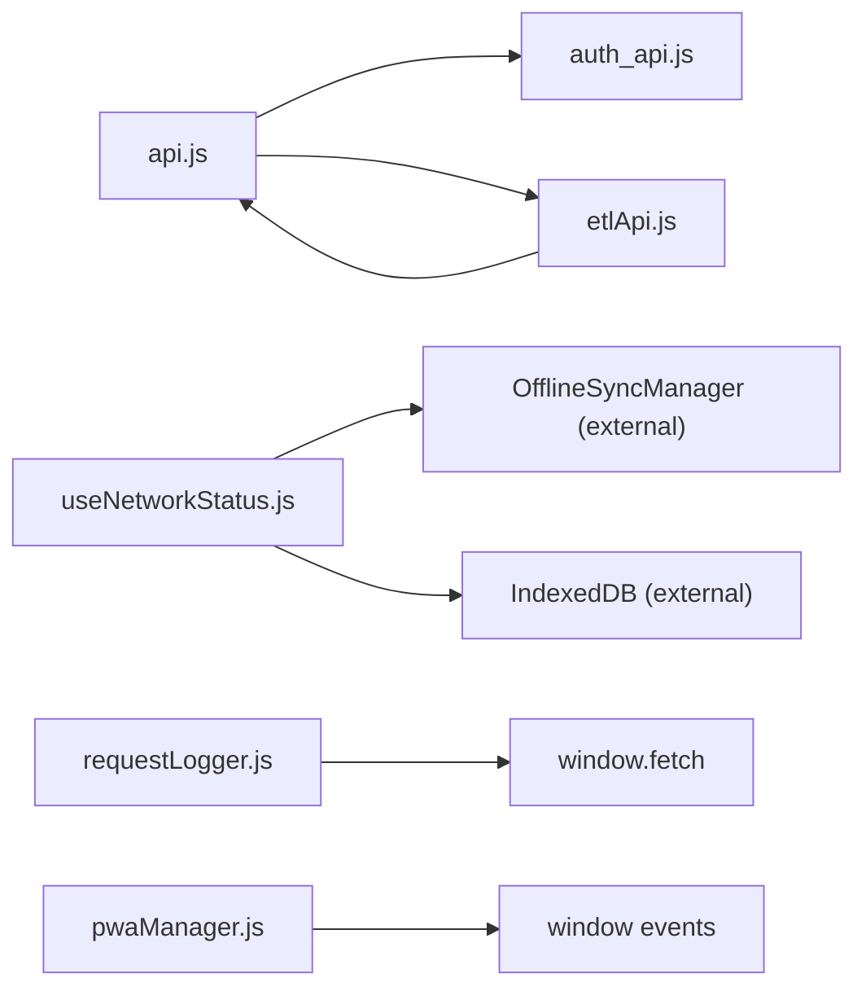

# Error Handling Strategies

<cite>
**Referenced Files in This Document**
- [api.js](file://src/services/api.js)
- [auth_api.js](file://src/services/auth_api.js)
- [etlApi.js](file://src/services/etlApi.js)
- [requestLogger.js](file://src/utils/requestLogger.js)
- [useNetworkStatus.js](file://src/composables/useNetworkStatus.js)
- [pwaManager.js](file://src/utils/pwaManager.js)
</cite>

## Table of Contents
1. [Introduction](#introduction)
2. [Project Structure](#project-structure)
3. [Core Components](#core-components)
4. [Architecture Overview](#architecture-overview)
5. [Detailed Component Analysis](#detailed-component-analysis)
6. [Dependency Analysis](#dependency-analysis)
7. [Performance Considerations](#performance-considerations)
8. [Troubleshooting Guide](#troubleshooting-guide)
9. [Conclusion](#conclusion)
10. [Appendices](#appendices)

## Introduction
This document explains the error handling strategies across the API integration layer, focusing on global interceptors, authentication refresh flows, network status management, logging, and offline resilience. It covers how HTTP errors, network failures, and timeouts are caught and processed; how transient failures are retried; and how user feedback is provided during partial outages or offline periods. It also outlines patterns for structured logging, monitoring, and alerting to support debugging and observability.

## Project Structure
The error handling strategy spans several layers:
- Global Axios interceptors for token injection and 401 handling with refresh-token flow
- Service utilities that normalize responses and convert non-OK statuses into typed errors
- Network status composable that tracks online/offline state and triggers sync when reconnected
- Logging utility that captures request/response details for debugging
- PWA manager for install prompts and related UX considerations

**Diagram sources**
- [api.js:64-146](file://src/services/api.js#L64-L146)
- [auth_api.js:20-27](file://src/services/auth_api.js#L20-L27)
- [etlApi.js:18-38](file://src/services/etlApi.js#L18-L38)
- [useNetworkStatus.js:10-41](file://src/composables/useNetworkStatus.js#L10-L41)
- [requestLogger.js:3-33](file://src/utils/requestLogger.js#L3-L33)
- [pwaManager.js:7-44](file://src/utils/pwaManager.js#L7-L44)

**Section sources**
- [api.js:64-146](file://src/services/api.js#L64-L146)
- [auth_api.js:20-27](file://src/services/auth_api.js#L20-L27)
- [etlApi.js:18-38](file://src/services/etlApi.js#L18-L38)
- [useNetworkStatus.js:10-41](file://src/composables/useNetworkStatus.js#L10-L41)
- [requestLogger.js:3-33](file://src/utils/requestLogger.js#L3-L33)
- [pwaManager.js:7-44](file://src/utils/pwaManager.js#L7-L44)

## Core Components
- Global Axios request interceptor attaches Authorization headers from localStorage before each request.
- Global Axios response interceptor handles 401 by refreshing tokens, queuing concurrent requests, and redirecting to login when refresh fails.
- Service-level helpers normalize fetch responses into consistent error objects with status and parsed data.
- Network status composable observes online/offline events, debounces updates, and auto-syncs when reconnecting.
- Logging utility wraps fetch calls to log method, URL, payload, and response body/status safely.
- PWA manager provides install prompt orchestration and user preference tracking.

Key responsibilities:
- Centralized auth header injection and token refresh
- Consistent error shaping for downstream consumers
- Offline detection and background sync coordination
- Debug-friendly request/response logging
- Graceful UX during connectivity changes

**Section sources**
- [api.js:20-28](file://src/services/api.js#L20-L28)
- [api.js:64-146](file://src/services/api.js#L64-L146)
- [etlApi.js:18-38](file://src/services/etlApi.js#L18-L38)
- [useNetworkStatus.js:10-41](file://src/composables/useNetworkStatus.js#L10-L41)
- [requestLogger.js:3-33](file://src/utils/requestLogger.js#L3-L33)
- [pwaManager.js:7-44](file://src/utils/pwaManager.js#L7-L44)

## Architecture Overview
The API integration layer uses a layered approach:
- Interceptors handle cross-cutting concerns (auth, token refresh).
- Services encapsulate domain endpoints and standardize error shapes.
- Composables manage runtime state such as connectivity and sync.
- Utilities provide logging and PWA features.

**Diagram sources**
- [api.js:64-146](file://src/services/api.js#L64-L146)
- [auth_api.js:20-27](file://src/services/auth_api.js#L20-L27)
- [etlApi.js:18-38](file://src/services/etlApi.js#L18-L38)
- [useNetworkStatus.js:10-41](file://src/composables/useNetworkStatus.js#L10-L41)
- [requestLogger.js:3-33](file://src/utils/requestLogger.js#L3-L33)

## Detailed Component Analysis

### Global Axios Interceptors and Token Refresh
- Request interceptor injects Authorization header using stored token.
- Response interceptor:
  - Skips retry for login/refresh endpoints to avoid loops.
  - On 401, queues concurrent requests while refreshing token once.
  - On successful refresh, updates queued requests’ headers and retries them.
  - On refresh failure, clears tokens and redirects to login.

**Diagram sources**
- [api.js:78-146](file://src/services/api.js#L78-L146)

**Section sources**
- [api.js:64-146](file://src/services/api.js#L64-L146)

### Service-Level Error Normalization (ETL API)
- The ETL service wraps fetch calls with a helper that:
  - Parses response text to JSON when possible.
  - Converts non-OK responses into Error objects with status and parsed data.
  - Provides consistent error shape for callers to handle uniformly.

**Diagram sources**
- [etlApi.js:18-38](file://src/services/etlApi.js#L18-L38)

**Section sources**
- [etlApi.js:18-38](file://src/services/etlApi.js#L18-L38)

### Authentication Service Helpers
- Auth service creates an Axios client with base URL and content-type.
- Adds Authorization header via request interceptor.
- Exposes methods for login, refresh, signup, profile fetch, and role update, normalizing errors to throw with descriptive messages.

**Diagram sources**
- [auth_api.js:10-27](file://src/services/auth_api.js#L10-L27)
- [auth_api.js:36-141](file://src/services/auth_api.js#L36-L141)

**Section sources**
- [auth_api.js:10-27](file://src/services/auth_api.js#L10-L27)
- [auth_api.js:36-141](file://src/services/auth_api.js#L36-L141)

### Network Status and Offline Resilience
- Tracks online/offline state and sync status.
- Debounces network change events to avoid thrashing.
- Auto-triggers sync when coming back online.
- Provides methods to force sync and show offline notifications.

**Diagram sources**
- [useNetworkStatus.js:10-41](file://src/composables/useNetworkStatus.js#L10-L41)
- [useNetworkStatus.js:75-91](file://src/composables/useNetworkStatus.js#L75-L91)
- [useNetworkStatus.js:170-197](file://src/composables/useNetworkStatus.js#L170-L197)

**Section sources**
- [useNetworkStatus.js:10-41](file://src/composables/useNetworkStatus.js#L10-L41)
- [useNetworkStatus.js:75-91](file://src/composables/useNetworkStatus.js#L75-L91)
- [useNetworkStatus.js:170-197](file://src/composables/useNetworkStatus.js#L170-L197)

### Request Logging Utility
- Wraps fetch to log method, URL, payload, and response body/status.
- Safely parses JSON or falls back to raw text.
- Groups logs for readability and throws errors after logging.

**Diagram sources**
- [requestLogger.js:3-33](file://src/utils/requestLogger.js#L3-L33)

**Section sources**
- [requestLogger.js:3-33](file://src/utils/requestLogger.js#L3-L33)

### PWA Install Flow (UX Context)
- Captures beforeinstallprompt, tracks interactions, and shows prompt based on thresholds and cooldowns.
- Persists user preferences and supports forced prompts for testing.

**Diagram sources**
- [pwaManager.js:7-44](file://src/utils/pwaManager.js#L7-L44)
- [pwaManager.js:74-121](file://src/utils/pwaManager.js#L74-L121)
- [pwaManager.js:123-178](file://src/utils/pwaManager.js#L123-L178)

**Section sources**
- [pwaManager.js:7-44](file://src/utils/pwaManager.js#L7-L44)
- [pwaManager.js:74-121](file://src/utils/pwaManager.js#L74-L121)
- [pwaManager.js:123-178](file://src/utils/pwaManager.js#L123-L178)

## Dependency Analysis
- api.js depends on axios and router; it centralizes auth header injection and 401 handling.
- auth_api.js defines its own Axios client and interceptors for auth endpoints.
- etlApi.js depends on API_BASE_URL from api.js and implements standardized error handling for fetch-based calls.
- useNetworkStatus.js depends on offline sync and IndexedDB abstractions to coordinate background operations.
- requestLogger.js is a standalone utility used to wrap fetch calls for debugging.
- pwaManager.js is independent but interacts with window events and local storage.

**Diagram sources**
- [api.js:64-146](file://src/services/api.js#L64-L146)
- [auth_api.js:10-27](file://src/services/auth_api.js#L10-L27)
- [etlApi.js:8-16](file://src/services/etlApi.js#L8-L16)
- [useNetworkStatus.js:6-8](file://src/composables/useNetworkStatus.js#L6-L8)
- [requestLogger.js:3-33](file://src/utils/requestLogger.js#L3-L33)
- [pwaManager.js:32-44](file://src/utils/pwaManager.js#L32-L44)

**Section sources**
- [api.js:64-146](file://src/services/api.js#L64-L146)
- [auth_api.js:10-27](file://src/services/auth_api.js#L10-L27)
- [etlApi.js:8-16](file://src/services/etlApi.js#L8-L16)
- [useNetworkStatus.js:6-8](file://src/composables/useNetworkStatus.js#L6-L8)
- [requestLogger.js:3-33](file://src/utils/requestLogger.js#L3-L33)
- [pwaManager.js:32-44](file://src/utils/pwaManager.js#L32-L44)

## Performance Considerations
- Token refresh batching: The response interceptor queues concurrent 401 requests and performs a single refresh, reducing redundant network calls.
- Debounced network updates: Online/offline listeners debounce to prevent excessive sync attempts.
- Minimal logging overhead: Logged payloads are parsed only when possible; groups are closed promptly to avoid console bloat.
- Avoid redundant retries: Login/refresh endpoints are excluded from retry logic to prevent loops.

[No sources needed since this section provides general guidance]

## Troubleshooting Guide
Common issues and where to investigate:
- 401 Unauthorized loops:
  - Verify that login/refresh endpoints are excluded from retry logic and that tokens are cleared on failure.
  - Confirm that refresh endpoint returns expected token fields.
- Network errors and timeouts:
  - Use the network status composable to detect offline states and trigger sync when reconnected.
  - Inspect logged requests/responses to identify malformed payloads or CORS issues.
- Inconsistent error shapes:
  - Ensure services normalize responses to include status and parsed data for uniform handling.

Actionable checks:
- Confirm Authorization header presence in requests.
- Validate that refresh token exists before attempting refresh.
- Review console logs grouped by request for payload and response details.
- Observe offline toast notifications and sync status updates.

**Section sources**
- [api.js:90-146](file://src/services/api.js#L90-L146)
- [useNetworkStatus.js:96-150](file://src/composables/useNetworkStatus.js#L96-L150)
- [requestLogger.js:3-33](file://src/utils/requestLogger.js#L3-L33)
- [etlApi.js:18-38](file://src/services/etlApi.js#L18-L38)

## Conclusion
The API integration layer employs a robust set of error handling strategies:
- Centralized interceptors manage authentication and token refresh efficiently.
- Services normalize errors to enable consistent consumer handling.
- Network status management ensures graceful degradation during connectivity changes.
- Logging utilities aid debugging without exposing secrets.
Together, these patterns improve resilience, maintain usability under partial outages, and provide clear signals for users and developers.

[No sources needed since this section summarizes without analyzing specific files]

## Appendices

### Error Categorization and User Feedback
- Client errors (4xx): Surface actionable messages (e.g., permission denied, rate limit) and guide users to retry or adjust input.
- Server errors (5xx): Inform users of temporary issues and suggest retrying later; log context for backend investigation.
- Network errors: Detect offline state, show friendly notifications, and queue operations for later sync.

[No sources needed since this section provides general guidance]

### Retry Mechanisms and Circuit Breakers
- Current implementation batches token refresh to avoid redundant calls and prevents retry loops on auth endpoints.
- For transient failures beyond auth, consider implementing exponential backoff at service boundaries and circuit breaker patterns to fail fast during prolonged outages.

[No sources needed since this section provides general guidance]

### Monitoring and Alerting
- Use structured logging around requests/responses to capture timestamps, endpoints, status codes, and error contexts.
- Integrate with monitoring systems to track error rates, latency, and token refresh outcomes.
- Alert on spikes in 401/403/5xx responses and network error rates.

[No sources needed since this section provides general guidance]