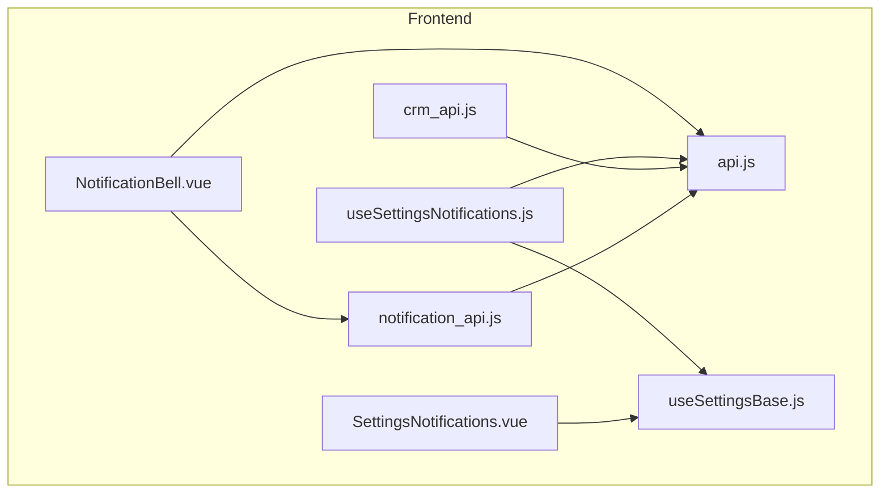
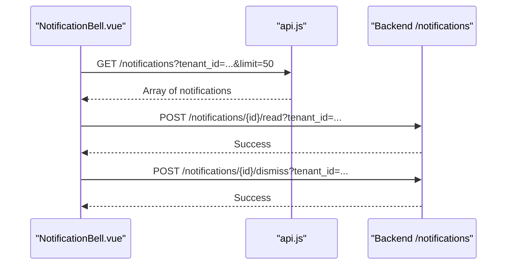
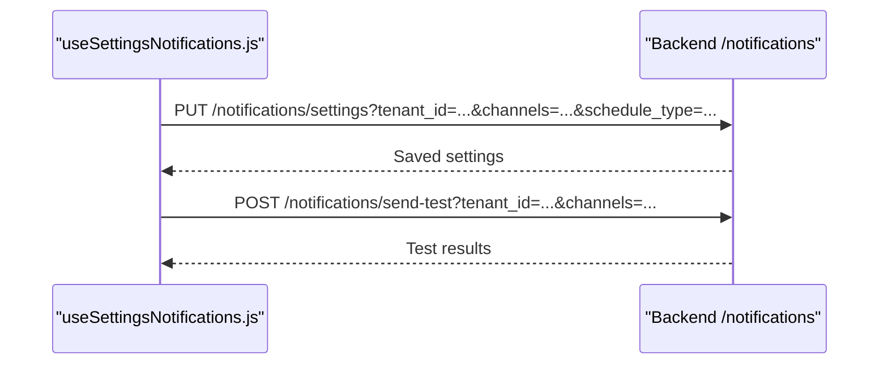
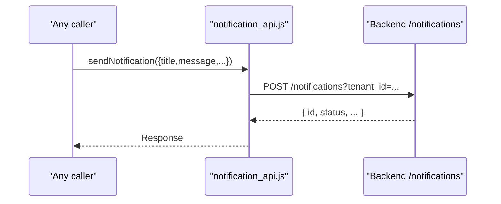
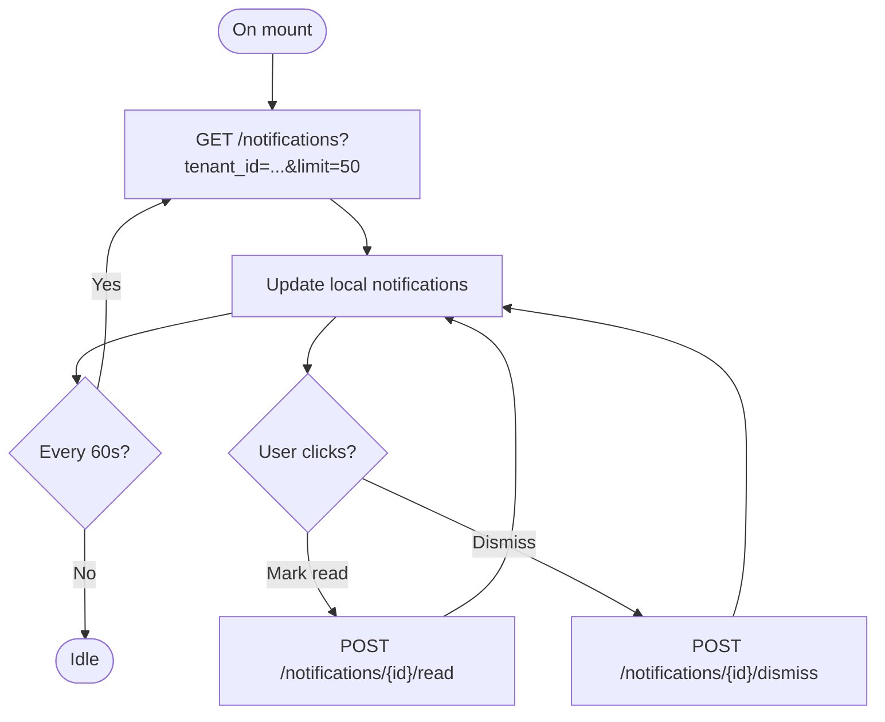
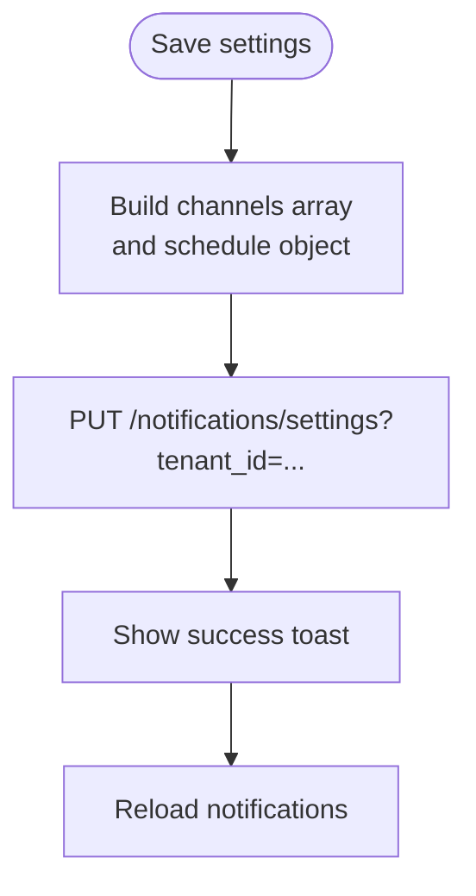
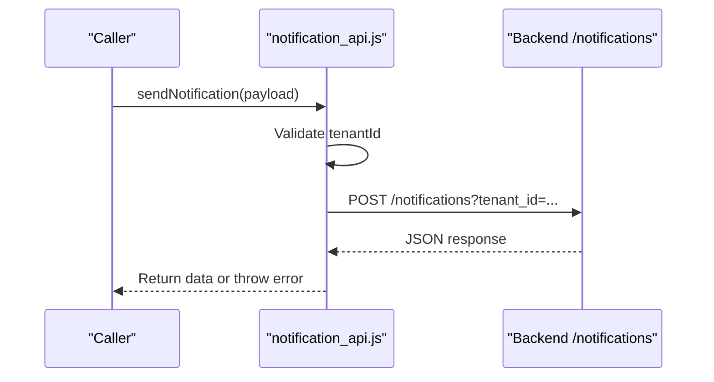
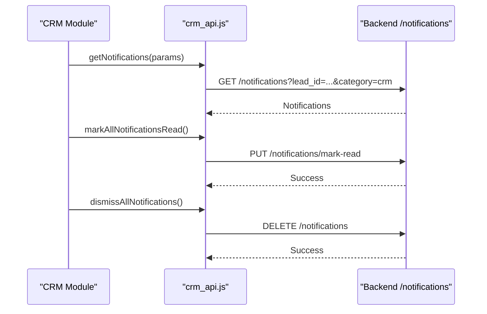
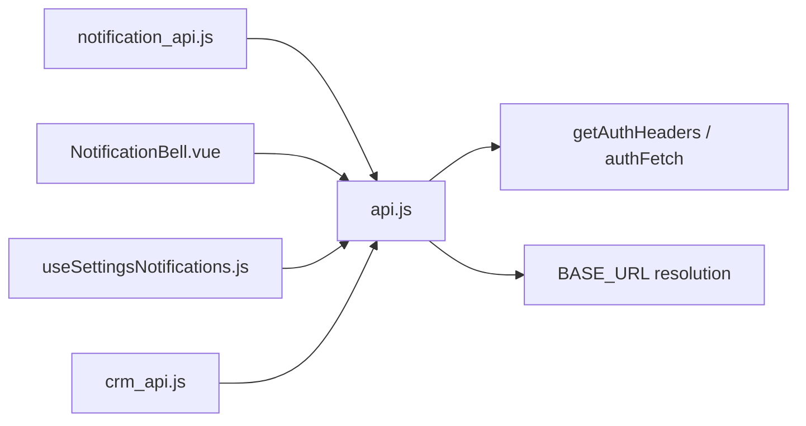

# Notification Service

<cite>
**Referenced Files in This Document**
- [notification_api.js](file://src/services/notification_api.js)
- [NotificationBell.vue](file://src/components/NotificationBell.vue)
- [useSettingsNotifications.js](file://src/composables/settings/useSettingsNotifications.js)
- [api.js](file://src/services/api.js)
- [crm_api.js](file://src/services/crm_api.js)
- [useSettingsBase.js](file://src/composables/settings/useSettingsBase.js)
- [SettingsNotifications.vue](file://src/views/Modules/settings/components/SettingsNotifications.vue)
</cite>

## Table of Contents
1. [Introduction](#introduction)
2. [Project Structure](#project-structure)
3. [Core Components](#core-components)
4. [Architecture Overview](#architecture-overview)
5. [Detailed Component Analysis](#detailed-component-analysis)
6. [Dependency Analysis](#dependency-analysis)
7. [Performance Considerations](#performance-considerations)
8. [Troubleshooting Guide](#troubleshooting-guide)
9. [Conclusion](#conclusion)
10. [Appendices](#appendices)

## Introduction
This document describes the notification service layer implemented in the frontend. It covers real-time notification endpoints for delivering alerts, messages, and system updates; channel management (email, WhatsApp, in-app); user preferences and scheduling; notification lifecycle from creation to delivery confirmation; and bulk operations such as dismissing all notifications or scanning CRM-related alerts. It also explains how templates and customization are handled via metadata and category-driven UI rendering.

## Project Structure
The notification feature spans several layers:
- Services: API clients that call backend endpoints for sending, listing, marking read/dismiss, and managing settings.
- Composables: Business logic for loading, grouping, filtering, exporting, and saving notification preferences.
- Components: In-app UI for displaying notifications and interacting with them.
- Settings views: Placeholder and integration points for configuring notification channels and schedules.

**Diagram sources**
- [NotificationBell.vue:105-255](file://src/components/NotificationBell.vue#L105-L255)
- [useSettingsNotifications.js:188-309](file://src/composables/settings/useSettingsNotifications.js#L188-L309)
- [notification_api.js:18-59](file://src/services/notification_api.js#L18-L59)
- [crm_api.js:229-270](file://src/services/crm_api.js#L229-L270)
- [api.js:1-18](file://src/services/api.js#L1-L18)
- [useSettingsBase.js:26-65](file://src/composables/settings/useSettingsBase.js#L26-L65)
- [SettingsNotifications.vue:1-34](file://src/views/Modules/settings/components/SettingsNotifications.vue#L1-L34)

**Section sources**
- [NotificationBell.vue:105-255](file://src/components/NotificationBell.vue#L105-L255)
- [useSettingsNotifications.js:188-309](file://src/composables/settings/useSettingsNotifications.js#L188-L309)
- [notification_api.js:18-59](file://src/services/notification_api.js#L18-L59)
- [crm_api.js:229-270](file://src/services/crm_api.js#L229-L270)
- [api.js:1-18](file://src/services/api.js#L1-L18)
- [useSettingsBase.js:26-65](file://src/composables/settings/useSettingsBase.js#L26-L65)
- [SettingsNotifications.vue:1-34](file://src/views/Modules/settings/components/SettingsNotifications.vue#L1-L34)

## Core Components
- Real-time in-app notifications: A polling-based bell component fetches recent notifications, marks items as read, dismisses them, and shows a toast when new unread items arrive.
- Notification settings and preferences: A composable manages channels (email, WhatsApp), auto-send toggles, schedule configuration, per-item thresholds, and global stock thresholds. It supports test sends and exports.
- Sending notifications: A dedicated API client posts notifications to the backend with tenant context, optional recipient overrides, channel selection, and metadata.
- CRM integration: Utilities to list notifications filtered by lead/category, mark read/dismiss, and trigger scans for CRM-related alerts.

**Section sources**
- [NotificationBell.vue:121-199](file://src/components/NotificationBell.vue#L121-L199)
- [useSettingsNotifications.js:276-309](file://src/composables/settings/useSettingsNotifications.js#L276-L309)
- [notification_api.js:18-59](file://src/services/notification_api.js#L18-L59)
- [crm_api.js:229-270](file://src/services/crm_api.js#L229-L270)

## Architecture Overview
The frontend calls backend endpoints through shared base URL configuration and authenticated headers. Notifications are created via a POST endpoint, listed via GET with filters, and managed via read/dismiss endpoints. Preferences are saved via PUT to a settings endpoint, and test sends use a dedicated endpoint.

**Diagram sources**
- [NotificationBell.vue:121-199](file://src/components/NotificationBell.vue#L121-L199)
- [api.js:20-38](file://src/services/api.js#L20-L38)

**Diagram sources**
- [useSettingsNotifications.js:276-309](file://src/composables/settings/useSettingsNotifications.js#L276-L309)

**Diagram sources**
- [notification_api.js:18-59](file://src/services/notification_api.js#L18-L59)

## Detailed Component Analysis

### Real-time In-App Notifications (NotificationBell)
- Polling: Fetches up to 50 notifications every 60 seconds and updates local state.
- Read/Dismiss: Marks individual notifications as read or dismisses them via dedicated endpoints.
- New arrival UX: Shows a toast for newly arrived unread notifications during polling and opens the popover on click.
- Grouping and icons: Uses category to render icons and colors.

**Diagram sources**
- [NotificationBell.vue:121-199](file://src/components/NotificationBell.vue#L121-L199)
- [NotificationBell.vue:245-255](file://src/components/NotificationBell.vue#L245-L255)

**Section sources**
- [NotificationBell.vue:121-199](file://src/components/NotificationBell.vue#L121-L199)
- [NotificationBell.vue:245-255](file://src/components/NotificationBell.vue#L245-L255)

### Notification Settings and Preferences (useSettingsNotifications)
- Channels: Toggle email and WhatsApp channels; build channel list for settings and tests.
- Auto-send and schedule: Persist auto-send flag and schedule type/time/day.
- Item-level thresholds: Per inventory item low/critical/empty alert toggles; global thresholds for low and critical stock.
- Filtering and grouping: Group notifications by category with severity-aware UI classes and search/filter helpers.
- Export: Generate Excel and PDF reports of current notifications.

**Diagram sources**
- [useSettingsNotifications.js:276-292](file://src/composables/settings/useSettingsNotifications.js#L276-L292)

**Section sources**
- [useSettingsNotifications.js:276-309](file://src/composables/settings/useSettingsNotifications.js#L276-L309)
- [useSettingsNotifications.js:312-375](file://src/composables/settings/useSettingsNotifications.js#L312-L375)
- [useSettingsNotifications.js:377-399](file://src/composables/settings/useSettingsNotifications.js#L377-L399)

### Sending Notifications (notification_api)
- Tenant context: Extracts tenant ID from JWT and validates presence.
- Authentication: Adds Authorization header if token exists.
- Payload: Sends title, message, details, category, optional recipient overrides, channels, auto_send flag, and metadata.
- Error handling: Throws descriptive errors on non-OK responses.

**Diagram sources**
- [notification_api.js:18-59](file://src/services/notification_api.js#L18-L59)

**Section sources**
- [notification_api.js:18-59](file://src/services/notification_api.js#L18-L59)

### CRM Integration and Bulk Operations (crm_api)
- List notifications with filters (e.g., lead_id, category).
- Mark single or all notifications as read.
- Dismiss single or all notifications.
- Trigger scan for CRM notifications.

**Diagram sources**
- [crm_api.js:229-270](file://src/services/crm_api.js#L229-L270)

**Section sources**
- [crm_api.js:229-270](file://src/services/crm_api.js#L229-L270)

### Settings View (SettingsNotifications)
- Placeholder view indicating migration from legacy settings module.
- Integrates with base settings infrastructure for tabs and navigation.

**Section sources**
- [SettingsNotifications.vue:1-34](file://src/views/Modules/settings/components/SettingsNotifications.vue#L1-L34)
- [useSettingsBase.js:50-65](file://src/composables/settings/useSettingsBase.js#L50-L65)

## Dependency Analysis
- Base URL and auth: All notification requests rely on the centralized base URL and authentication helpers.
- JWT tenant extraction: Tenant ID is extracted from JWT to scope requests per tenant.
- Cross-module usage: Both general notification flows and CRM-specific flows share the same backend endpoints.

**Diagram sources**
- [api.js:1-38](file://src/services/api.js#L1-L38)
- [notification_api.js:1-5](file://src/services/notification_api.js#L1-L5)
- [NotificationBell.vue:105-115](file://src/components/NotificationBell.vue#L105-L115)
- [useSettingsNotifications.js:1-10](file://src/composables/settings/useSettingsNotifications.js#L1-L10)
- [crm_api.js:229-270](file://src/services/crm_api.js#L229-L270)

**Section sources**
- [api.js:1-38](file://src/services/api.js#L1-L38)
- [notification_api.js:1-5](file://src/services/notification_api.js#L1-L5)
- [NotificationBell.vue:105-115](file://src/components/NotificationBell.vue#L105-L115)
- [useSettingsNotifications.js:1-10](file://src/composables/settings/useSettingsNotifications.js#L1-L10)
- [crm_api.js:229-270](file://src/services/crm_api.js#L229-L270)

## Performance Considerations
- Polling interval: The bell component polls every 60 seconds; adjust frequency based on expected volume and network constraints.
- Limit parameter: Requests include a limit to cap payload size; ensure backend pagination aligns with UI needs.
- Local state updates: Mark-as-read and dismiss update local state immediately for responsiveness while awaiting server confirmation.
- Exports: Generating large Excel/PDF reports should be used judiciously to avoid UI freezes.

[No sources needed since this section provides general guidance]

## Troubleshooting Guide
- Missing tenant ID: Sending notifications requires a valid tenant ID; ensure the user is logged in and JWT contains tenant information.
- Non-OK responses: Errors are thrown with detail messages; check network tab and backend logs for specifics.
- Auth failures: If 401 occurs, tokens may need refresh; the base API handles refresh and redirects to login when necessary.
- Settings save failures: Verify channel values and schedule fields; inspect query parameters built before the PUT request.
- Test send failures: Confirm configured channels and recipients; review returned results for per-channel status.

**Section sources**
- [notification_api.js:18-59](file://src/services/notification_api.js#L18-L59)
- [api.js:78-146](file://src/services/api.js#L78-L146)
- [useSettingsNotifications.js:276-309](file://src/composables/settings/useSettingsNotifications.js#L276-L309)

## Conclusion
The frontend notification service layer provides a robust set of capabilities for creating, displaying, and managing notifications across channels. It integrates with backend endpoints for real-time updates, supports user preferences and scheduling, and offers bulk operations for efficient management. While template customization is primarily driven by metadata and category-based UI rendering, the architecture allows easy extension for richer templating and branding in future iterations.

[No sources needed since this section summarizes without analyzing specific files]

## Appendices

### Real-Time Endpoints Used by Frontend
- Create notification: POST /notifications?tenant_id=...
- List notifications: GET /notifications?tenant_id=...&category=...&limit=...
- Mark read: POST /notifications/{id}/read?tenant_id=...
- Dismiss: POST /notifications/{id}/dismiss?tenant_id=...
- Mark all read: PUT /notifications/mark-read
- Dismiss all: DELETE /notifications
- Settings: PUT /notifications/settings?tenant_id=...&channels=...&schedule_type=...
- Test send: POST /notifications/send-test?tenant_id=...&channels=...

**Section sources**
- [notification_api.js:18-59](file://src/services/notification_api.js#L18-L59)
- [NotificationBell.vue:121-199](file://src/components/NotificationBell.vue#L121-L199)
- [crm_api.js:229-270](file://src/services/crm_api.js#L229-L270)
- [useSettingsNotifications.js:276-309](file://src/composables/settings/useSettingsNotifications.js#L276-L309)

### Channel Management Summary
- Email: Enabled via settings; used for outbound emails when configured.
- WhatsApp: Enabled via settings; used for outbound WhatsApp messages when configured.
- In-app: Always available via the bell component and settings panel.

**Section sources**
- [useSettingsNotifications.js:276-309](file://src/composables/settings/useSettingsNotifications.js#L276-L309)

### Notification Lifecycle Example
- Creation: Call sendNotification with required fields and optional metadata.
- Delivery: Backend routes to configured channels based on settings and payload.
- Display: Frontend polls and renders notifications; users can mark read or dismiss.
- Confirmation: Backend returns status; frontend reflects changes locally and via subsequent polls.

**Section sources**
- [notification_api.js:18-59](file://src/services/notification_api.js#L18-L59)
- [NotificationBell.vue:121-199](file://src/components/NotificationBell.vue#L121-L199)