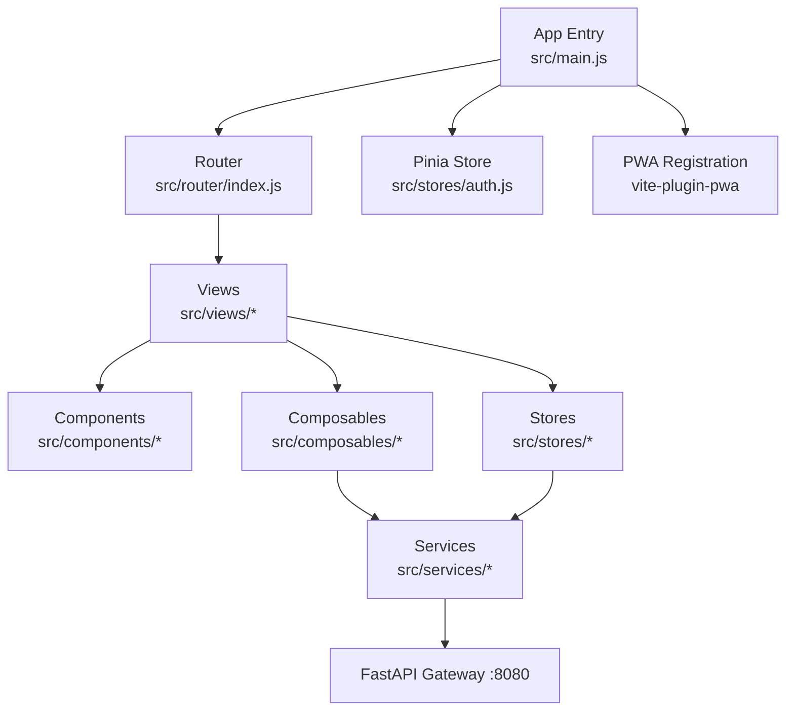
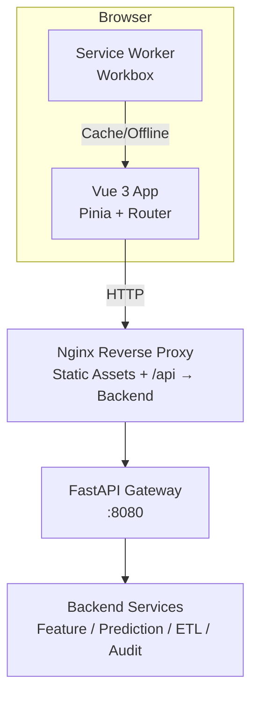
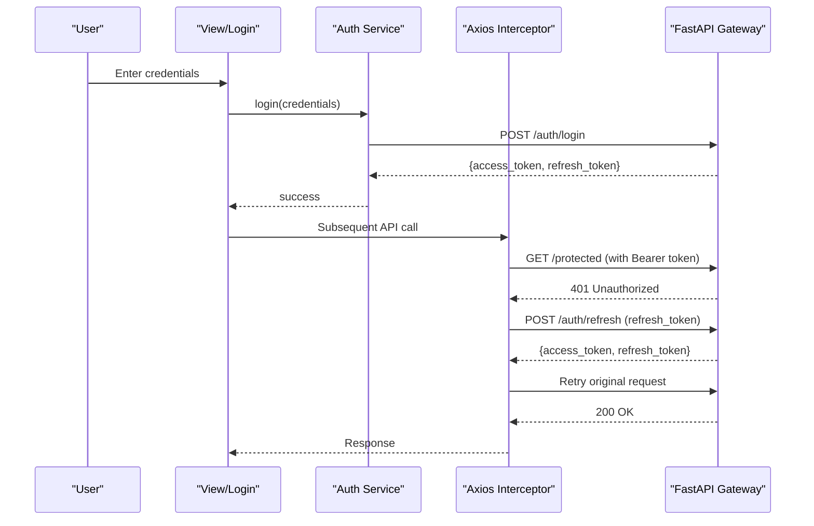
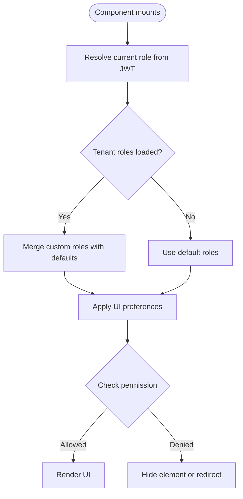
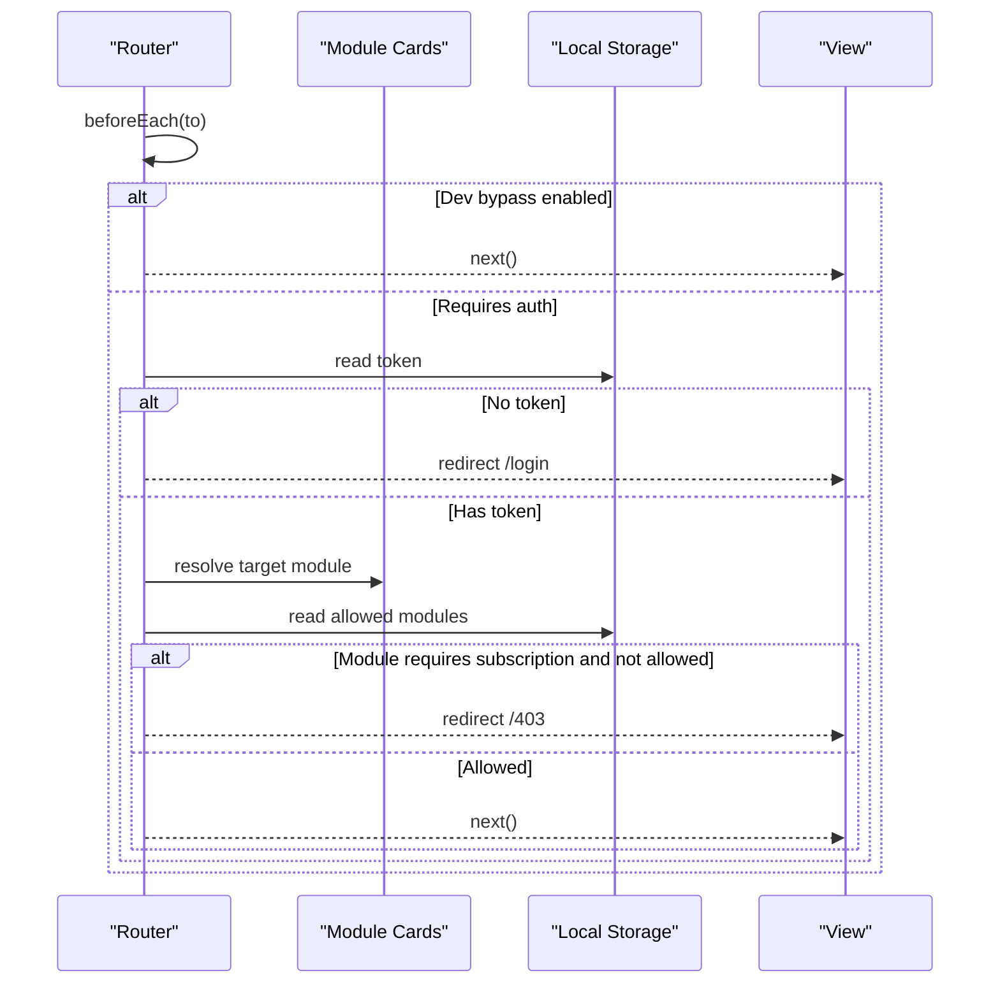
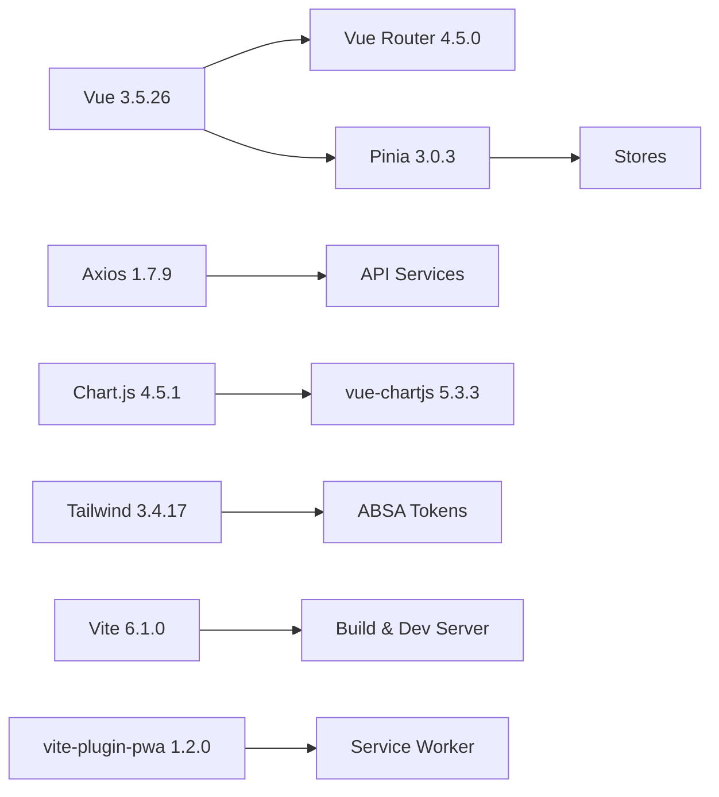
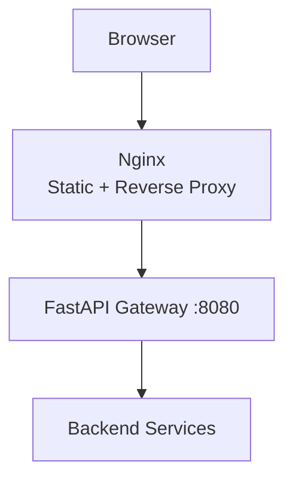

# Architecture & Design

<cite>
**Referenced Files in This Document**
- [package.json](file://package.json)
- [README.md](file://README.md)
- [vite.config.js](file://vite.config.js)
- [tailwind.config.js](file://tailwind.config.js)
- [Dockerfile](file://Dockerfile)
- [public/manifest.json](file://public/manifest.json)
- [src/main.js](file://src/main.js)
- [src/router/index.js](file://src/router/index.js)
- [src/stores/auth.js](file://src/stores/auth.js)
- [src/services/api.js](file://src/services/api.js)
- [src/services/auth_api.js](file://src/services/auth_api.js)
- [src/config/rbac.js](file://src/config/rbac.js)
- [src/composables/useRBAC.js](file://src/composables/useRBAC.js)
- [src/utils/v-role.js](file://src/utils/v-role.js)
- [src/config/moduleCards.js](file://src/config/moduleCards.js)
</cite>

## Table of Contents
1. Introduction
2. Project Structure
3. Core Components
4. Architecture Overview
5. Detailed Component Analysis
6. Dependency Analysis
7. Performance Considerations
8. Troubleshooting Guide
9. Conclusion
10. Appendices

## Introduction
This document describes the ABSA Foundry Frontend system design for an air-gapped, on-premise enterprise banking analytics platform. It explains the MVVM-style architecture using Vue 3 Composition API, a component-based structure with shared and scoped components, and a service-oriented architecture via an API abstraction layer. It also documents technical decisions (Pinia over Vuex, Vite build tooling, Tailwind CSS styling), infrastructure requirements, scalability considerations, deployment topology with Nginx reverse proxy, cross-cutting concerns (JWT authentication, role-based access control, audit logging, PWA capabilities), and technology stack version compatibility.

## Project Structure
The application follows a clear separation of concerns:
- Views: route-targeted page components under src/views, including feature modules (CRM, AI Agents, Data Pipeline, Strategic Management, Settings).
- Components: shared UI primitives and layouts under src/components/ui and src/components/layouts.
- Composables: reusable logic (RBAC, currency, export, network status, PWA install) under src/composables.
- Stores: Pinia stores for state management (auth, dashboard, CRM, etc.).
- Services: HTTP clients and domain-specific API wrappers under src/services.
- Config: RBAC definitions, module cards, preferences, activity tracking under src/config.
- Utils: pure utilities (formatting, report export, PWA manager, request logger, role directive).

**Diagram sources**
- [src/main.js:70-76](file://src/main.js#L70-L76)
- [src/router/index.js:196-199](file://src/router/index.js#L196-L199)
- [src/stores/auth.js:1-22](file://src/stores/auth.js#L1-L22)
- [vite.config.js:11-35](file://vite.config.js#L11-L35)
- [src/services/api.js:1-18](file://src/services/api.js#L1-L18)

**Section sources**
- [README.md:47-148](file://README.md#L47-L148)
- [src/main.js:70-76](file://src/main.js#L70-L76)
- [src/router/index.js:196-199](file://src/router/index.js#L196-L199)

## Core Components
- App bootstrap: creates Vue app, registers Pinia, router, global plugins (toasts, Google login), and PWA registration.
- Router: defines routes, lazy loads views, and enforces auth and subscription checks via beforeEach guard.
- State: Pinia store for auth token, user role, email; getters and actions to manage session lifecycle.
- Services: Axios instance with interceptors for Authorization header injection and automatic token refresh on 401; dedicated auth API client.
- RBAC: composable that resolves current user role from JWT, fetches tenant roles and permissions, and exposes permission helpers; static RBAC config defines entities, permissions, default roles, and helpers.
- UI directives: v-role directive hides elements based on user role.

Key implementation references:
- App initialization and plugin registration: [src/main.js:70-101](file://src/main.js#L70-L101)
- Route definitions and guards: [src/router/index.js:34-194](file://src/router/index.js#L34-L194), [src/router/index.js:201-272](file://src/router/index.js#L201-L272)
- Auth store: [src/stores/auth.js:1-22](file://src/stores/auth.js#L1-L22)
- API base URL and interceptors: [src/services/api.js:1-18](file://src/services/api.js#L1-L18), [src/services/api.js:64-146](file://src/services/api.js#L64-L146)
- Auth API client: [src/services/auth_api.js:1-27](file://src/services/auth_api.js#L1-L27)
- RBAC composable and config: [src/composables/useRBAC.js:55-137](file://src/composables/useRBAC.js#L55-L137), [src/config/rbac.js:13-77](file://src/config/rbac.js#L13-L77)
- Role directive: [src/utils/v-role.js:1-12](file://src/utils/v-role.js#L1-L12)

**Section sources**
- [src/main.js:70-101](file://src/main.js#L70-L101)
- [src/router/index.js:34-194](file://src/router/index.js#L34-L194)
- [src/router/index.js:201-272](file://src/router/index.js#L201-L272)
- [src/stores/auth.js:1-22](file://src/stores/auth.js#L1-L22)
- [src/services/api.js:1-18](file://src/services/api.js#L1-L18)
- [src/services/api.js:64-146](file://src/services/api.js#L64-L146)
- [src/services/auth_api.js:1-27](file://src/services/auth_api.js#L1-L27)
- [src/composables/useRBAC.js:55-137](file://src/composables/useRBAC.js#L55-L137)
- [src/config/rbac.js:13-77](file://src/config/rbac.js#L13-L77)
- [src/utils/v-role.js:1-12](file://src/utils/v-role.js#L1-L12)

## Architecture Overview
High-level MVVM pattern:
- Model: Pinia stores hold application state; services encapsulate backend data access.
- View: Vue components and pages render UI; composables provide reactive logic.
- ViewModel: Composables and stores coordinate view state and business rules; route guards enforce security.

Service-oriented architecture:
- Centralized API base URL resolution and Axios interceptors handle authentication and token refresh.
- Domain-specific service modules wrap endpoints for CRM, documents, notifications, audit, ETL, telemetry, etc.

Infrastructure and deployment:
- Air-gapped on-premise deployment with Nginx serving static assets and reverse proxying API calls to FastAPI Gateway (:8080).
- Docker multi-stage build produces optimized static assets and a lightweight runtime server.

Technology decisions:
- Vue 3.5.26 with Composition API for modern, scalable component logic.
- Pinia 3.0.3 as primary state management (Vuex kept for legacy).
- Vite 6.x for fast builds and development experience; vite-plugin-pwa for offline-first PWA.
- Tailwind CSS 3.x with ABSA design tokens for consistent theming.

System context diagram:

**Diagram sources**
- [vite.config.js:11-35](file://vite.config.js#L11-L35)
- [public/manifest.json:1-24](file://public/manifest.json#L1-L24)
- [README.md:527-536](file://README.md#L527-L536)

**Section sources**
- [README.md:7-44](file://README.md#L7-L44)
- [README.md:527-536](file://README.md#L527-L536)
- [package.json:13-62](file://package.json#L13-L62)

## Detailed Component Analysis

### Authentication Flow (JWT + Token Refresh)

**Diagram sources**
- [src/services/api.js:64-146](file://src/services/api.js#L64-L146)
- [src/services/auth_api.js:36-87](file://src/services/auth_api.js#L36-L87)

**Section sources**
- [src/services/api.js:64-146](file://src/services/api.js#L64-L146)
- [src/services/auth_api.js:36-87](file://src/services/auth_api.js#L36-L87)

### Role-Based Access Control (RBAC)

**Diagram sources**
- [src/composables/useRBAC.js:55-137](file://src/composables/useRBAC.js#L55-L137)
- [src/config/rbac.js:658-671](file://src/config/rbac.js#L658-L671)
- [src/utils/v-role.js:1-12](file://src/utils/v-role.js#L1-L12)

**Section sources**
- [src/composables/useRBAC.js:55-137](file://src/composables/useRBAC.js#L55-L137)
- [src/config/rbac.js:658-671](file://src/config/rbac.js#L658-L671)
- [src/utils/v-role.js:1-12](file://src/utils/v-role.js#L1-L12)

### Module Navigation and Subscription Guard

**Diagram sources**
- [src/router/index.js:201-272](file://src/router/index.js#L201-L272)
- [src/config/moduleCards.js:13-51](file://src/config/moduleCards.js#L13-L51)

**Section sources**
- [src/router/index.js:201-272](file://src/router/index.js#L201-L272)
- [src/config/moduleCards.js:13-51](file://src/config/moduleCards.js#L13-L51)

### PWA Capabilities
- Service worker registration and update prompts are handled at app bootstrap.
- Manifest defines app metadata and icons; Workbox strategies configured via Vite plugin.

**Section sources**
- [src/main.js:23-67](file://src/main.js#L23-L67)
- [vite.config.js:11-35](file://vite.config.js#L11-L35)
- [public/manifest.json:1-24](file://public/manifest.json#L1-L24)

## Dependency Analysis
Core dependencies and their roles:
- Vue 3.5.26: framework and composition API.
- Pinia 3.0.3: primary state management.
- Vue Router 4.5.0: routing and navigation guards.
- Axios 1.7.9: HTTP client with interceptors.
- Chart.js 4.5.1 with vue-chartjs 5.3.3: chart rendering.
- Tailwind CSS 3.4.17: utility-first styling with ABSA tokens.
- Vite 6.1.0: build tooling and dev server.
- vite-plugin-pwa 1.2.0: PWA integration.

Compatibility notes:
- Vue 3.5.26 is compatible with Vue Router 4.5.0 and Pinia 3.0.3.
- Axios 1.7.9 supports modern interceptors and promise-based APIs.
- Chart.js 4.5.1 integrates with vue-chartjs 5.3.3 for Vue 3.

**Diagram sources**
- [package.json:13-62](file://package.json#L13-L62)

**Section sources**
- [package.json:13-62](file://package.json#L13-L62)

## Performance Considerations
- Lazy loading: Routes use dynamic imports to reduce initial bundle size.
- Tree-shaking: Scoped components and composables minimize unused code.
- Build optimizations: Vite targets esnext, disables unnecessary minification in build config for faster builds during development; production builds can enable minification.
- Caching: PWA precaching and runtime caching improve offline performance and resilience.
- Network efficiency: Axios interceptors batch retries and avoid redundant refresh calls; token refresh queue prevents race conditions.

[No sources needed since this section provides general guidance]

## Troubleshooting Guide
Common issues and resolutions:
- 401 Unauthorized: Ensure token exists; if missing, app redirects to login. If refresh fails, tokens are cleared and user redirected to login.
- Service Worker registration errors: Check environment flags and browser support; dev bypass can be used to skip SW in development.
- Permission denied (403): Verify role and module subscription; route guard may redirect to /403 if module not allowed.
- Build failures in Docker: Ensure Node memory limit is set; verify npm registry and retry settings.

**Section sources**
- [src/services/api.js:90-146](file://src/services/api.js#L90-L146)
- [src/main.js:35-67](file://src/main.js#L35-L67)
- [src/router/index.js:201-272](file://src/router/index.js#L201-L272)
- [Dockerfile:36-39](file://Dockerfile#L36-L39)

## Conclusion
The ABSA Foundry Frontend employs a robust MVVM architecture with Vue 3 Composition API, Pinia for state, and a service-oriented API layer. The system is designed for air-gapped, on-premise deployments behind Nginx, with strong security via JWT and RBAC, and enhanced UX through PWA capabilities. The modular structure and strict scoping of components and composables ensure maintainability and scalability for enterprise banking workloads.

[No sources needed since this section summarizes without analyzing specific files]

## Appendices

### Infrastructure Requirements
- Node.js 18+ for development; Docker for containerized builds.
- Internal network access to FastAPI Gateway (:8080).
- Nginx reverse proxy to serve static assets and forward API requests.

**Section sources**
- [README.md:461-494](file://README.md#L461-L494)
- [README.md:527-536](file://README.md#L527-L536)

### Scalability Considerations
- Stateless frontend assets served by Nginx scale horizontally.
- Client-side caching via PWA reduces backend load.
- Modular features allow independent scaling of backend services behind the gateway.

[No sources needed since this section provides general guidance]

### Deployment Topology

**Diagram sources**
- [README.md:527-536](file://README.md#L527-L536)

### Technology Stack Summary
- Framework: Vue 3.5.26
- State: Pinia 3.0.3 (primary), Vuex 4.0.2 (legacy)
- Routing: Vue Router 4.5.0
- Styling: Tailwind CSS 3.4.17
- Charts: Chart.js 4.5.1 with vue-chartjs 5.3.3
- HTTP: Axios 1.7.9
- Build: Vite 6.1.0 with vite-plugin-pwa 1.2.0

**Section sources**
- [package.json:13-62](file://package.json#L13-L62)