# Component Architecture

<cite>
**Referenced Files in This Document**
- [main.js](file://src/main.js)
- [App.vue](file://src/App.vue)
- [index.js](file://src/router/index.js)
- [DashboardLayout.vue](file://src/components/layouts/DashboardLayout.vue)
- [SuperAdminLayout.vue](file://src/components/layouts/SuperAdminLayout.vue)
- [AbsaButton.vue](file://src/components/ui/AbsaButton.vue)
- [AbsaCard.vue](file://src/components/ui/AbsaCard.vue)
- [AbsaBadge.vue](file://src/components/ui/AbsaBadge.vue)
- [Modal.vue](file://src/components/ui/Modal.vue)
- [index.js](file://src/components/ui/index.js)
- [tailwind.config.js](file://tailwind.config.js)
- [useRBAC.js](file://src/composables/useRBAC.js)
- [moduleCards.js](file://src/config/moduleCards.js)
- [BackButton.spec.js](file://src/components/__tests__/BackButton.spec.js)
- [BulkActionsBar.spec.js](file://src/components/__tests__/BulkActionsBar.spec.js)
</cite>

## Table of Contents
1. Introduction
2. Project Structure
3. Core Components
4. Architecture Overview
5. Detailed Component Analysis
6. Dependency Analysis
7. Performance Considerations
8. Troubleshooting Guide
9. Conclusion

## Introduction
This document explains the ABSA Foundry Frontend component architecture from the root application down to atomic UI primitives. It covers composition patterns (slots, props, events), layout system for authenticated and administrative routes, route guards, lifecycle management with Vue 3 Composition API, reactive data binding, performance techniques, testing strategies, accessibility patterns, responsive design, and design system integration using Tailwind CSS customizations and brand tokens.

## Project Structure
The application is bootstrapped by main.js, which creates the Vue app, registers plugins (Pinia, Router, Toast, Google Login), configures global components/directives, and initializes service worker behavior. App.vue acts as the top-level shell, rendering router-view and global overlays (e.g., PWA install prompt). The router defines protected and public routes, applies a central beforeEach guard for authentication and subscription checks, and mounts layout wrappers for dashboard and super-admin areas. Layouts encapsulate navigation chrome and render page content via nested router-view. Atomic UI components live under src/components/ui and are re-exported through an index barrel.

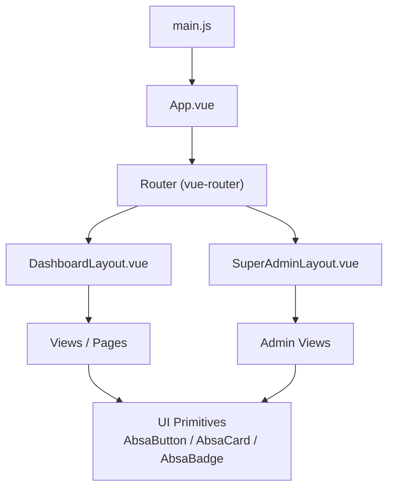

**Diagram sources**
- [main.js:70-125](file://src/main.js#L70-L125)
- [App.vue:1-88](file://src/App.vue#L1-L88)
- [index.js:196-275](file://src/router/index.js#L196-L275)
- [DashboardLayout.vue:1-97](file://src/components/layouts/DashboardLayout.vue#L1-L97)
- [SuperAdminLayout.vue:1-63](file://src/components/layouts/SuperAdminLayout.vue#L1-L63)

**Section sources**
- [main.js:1-129](file://src/main.js#L1-L129)
- [App.vue:1-293](file://src/App.vue#L1-L293)
- [index.js:1-275](file://src/router/index.js#L1-L275)

## Core Components
- Root Shell (App.vue): Renders global gradient background, PWA install toast, modal overlay for MFE portal sharing, and delegates routing to router-view. Initializes currency service, preferences, RBAC, and PWA listeners on mount. Watches route changes to redirect authenticated users away from auth pages.
- Layouts:
  - DashboardLayout.vue: Wraps authenticated dashboard routes; provides header, search bar, user info, and dynamic module menu. Uses computed title from route meta and fetches subscribed modules to filter visible items based on role and permissions.
  - SuperAdminLayout.vue: Provides admin sidebar with fixed navigation and a topbar; renders admin-specific pages under /super-admin.
- Atomic UI Primitives:
  - AbsaButton.vue: Brand-compliant button with variants, sizes, loading state, block mode, and slots for icons.
  - AbsaCard.vue: Card with accent bar, hoverable gradient overlay, header/footer/default slots, padding and flat variants.
  - AbsaBadge.vue: Status badge with dot indicator, size/pill options, and state-driven color mapping.
  - Modal.vue: Accessible dialog with focus trapping, escape-to-close, teleport to body, and sticky header/footer.
- UI Index Barrel: Centralized exports for consistent imports across the app.

**Section sources**
- [App.vue:90-241](file://src/App.vue#L90-L241)
- [DashboardLayout.vue:99-233](file://src/components/layouts/DashboardLayout.vue#L99-L233)
- [SuperAdminLayout.vue:65-67](file://src/components/layouts/SuperAdminLayout.vue#L65-L67)
- [AbsaButton.vue:23-100](file://src/components/ui/AbsaButton.vue#L23-L100)
- [AbsaCard.vue:38-89](file://src/components/ui/AbsaCard.vue#L38-L89)
- [AbsaBadge.vue:13-80](file://src/components/ui/AbsaBadge.vue#L13-L80)
- [Modal.vue:55-208](file://src/components/ui/Modal.vue#L55-L208)
- [index.js:1-22](file://src/components/ui/index.js#L1-L22)

## Architecture Overview
The application follows a layered architecture:
- Entry and Bootstrapping: main.js sets up Pinia, Router, Toast, Google OAuth, global components, directives, and service worker registration logic.
- Application Shell: App.vue orchestrates global UX (PWA prompts, modals) and initializes services and RBAC.
- Routing and Guards: Router defines routes and a centralized beforeEach guard that enforces authentication, subscription/module access, and redirects.
- Layouts: DashboardLayout and SuperAdminLayout provide consistent chrome and context-aware navigation.
- Feature Modules: Views/pages compose reusable UI primitives and composables to implement business features.
- Design System: Tailwind configuration extends theme tokens, colors, typography, spacing, radii, shadows, animations, and z-index scales aligned with ABSA brand.

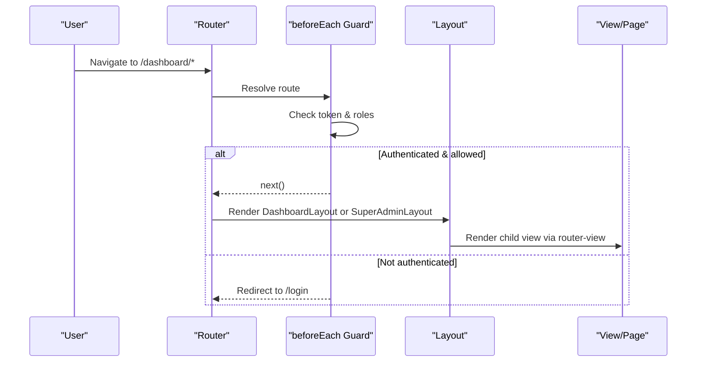

**Diagram sources**
- [index.js:201-272](file://src/router/index.js#L201-L272)
- [DashboardLayout.vue:107-113](file://src/components/layouts/DashboardLayout.vue#L107-L113)
- [SuperAdminLayout.vue:65-67](file://src/components/layouts/SuperAdminLayout.vue#L65-L67)

**Section sources**
- [main.js:70-125](file://src/main.js#L70-L125)
- [App.vue:146-203](file://src/App.vue#L146-L203)
- [index.js:196-275](file://src/router/index.js#L196-L275)

## Detailed Component Analysis

### Root Application (App.vue)
- Responsibilities: Global UI overlays, PWA install flow, session check and redirect, initialization of currency service, preferences, and RBAC.
- Lifecycle: onMounted waits for router readiness, performs initial checks, initializes services, and registers PWA callbacks. watch(route) handles route-based redirects.
- Event-driven communication: Emits actions to PWA manager via callbacks; dismiss/install handlers manage toast visibility.

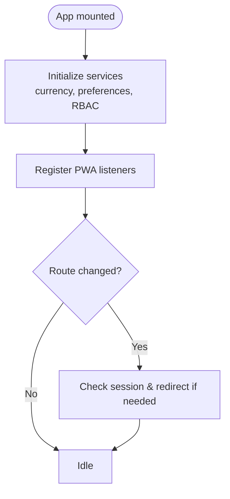

**Diagram sources**
- [App.vue:146-203](file://src/App.vue#L146-L203)
- [App.vue:200-203](file://src/App.vue#L200-L203)

**Section sources**
- [App.vue:90-241](file://src/App.vue#L90-L241)

### DashboardLayout.vue
- Responsibilities: Header with dropdown navigation, user info, search area, and dynamic module list filtered by subscriptions and permissions.
- Composition: Uses computed properties for page title and user details; fetches subscribed modules and filters based on role and permissions.
- Navigation: Nested router-view renders page content.

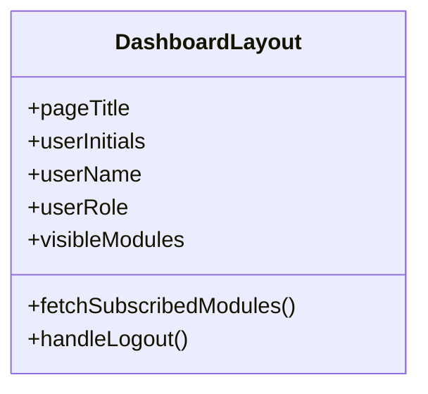

**Diagram sources**
- [DashboardLayout.vue:111-167](file://src/components/layouts/DashboardLayout.vue#L111-L167)
- [DashboardLayout.vue:169-233](file://src/components/layouts/DashboardLayout.vue#L169-L233)

**Section sources**
- [DashboardLayout.vue:1-299](file://src/components/layouts/DashboardLayout.vue#L1-L299)

### SuperAdminLayout.vue
- Responsibilities: Admin sidebar with fixed navigation and topbar; renders admin views via router-view.
- Composition: Minimal script setup; relies on static navigation and layout styling.

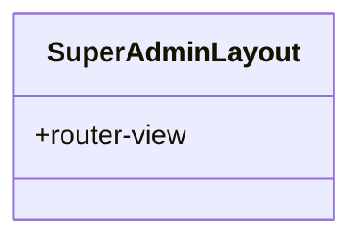

**Diagram sources**
- [SuperAdminLayout.vue:1-63](file://src/components/layouts/SuperAdminLayout.vue#L1-L63)

**Section sources**
- [SuperAdminLayout.vue:1-155](file://src/components/layouts/SuperAdminLayout.vue#L1-L155)

### Atomic UI Primitives

#### AbsaButton.vue
- Props: variant, size, disabled, loading, block.
- Slots: default content, icon-left, icon-right.
- Behavior: Disables when loading/disabled; shows spinner; computes classes per variant and size.

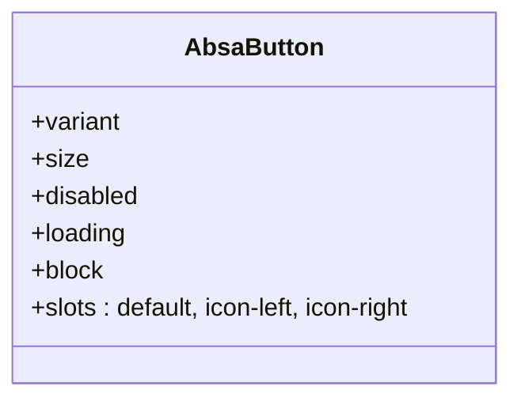

**Diagram sources**
- [AbsaButton.vue:23-100](file://src/components/ui/AbsaButton.vue#L23-L100)

**Section sources**
- [AbsaButton.vue:1-101](file://src/components/ui/AbsaButton.vue#L1-L101)

#### AbsaCard.vue
- Props: padding, accent, hoverable, flat.
- Slots: header, default, footer.
- Behavior: Accent bar at top; optional hover gradient; conditional footer border.

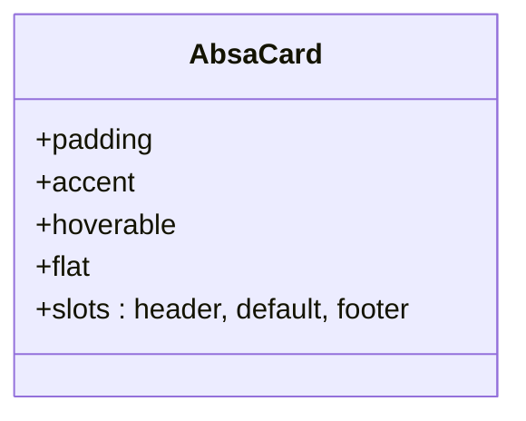

**Diagram sources**
- [AbsaCard.vue:38-89](file://src/components/ui/AbsaCard.vue#L38-L89)

**Section sources**
- [AbsaCard.vue:1-90](file://src/components/ui/AbsaCard.vue#L1-L90)

#### AbsaBadge.vue
- Props: state, size, noDot, pill.
- Behavior: Computes dot color and style based on state; supports sm/md sizes and pill vs rounded styles.

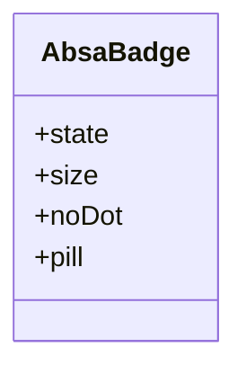

**Diagram sources**
- [AbsaBadge.vue:13-80](file://src/components/ui/AbsaBadge.vue#L13-L80)

**Section sources**
- [AbsaBadge.vue:1-81](file://src/components/ui/AbsaBadge.vue#L1-L81)

#### Modal.vue
- Props: to, closeOnEscape, trapFocus, restoreFocus.
- Accessibility: aria-modal, role="dialog", focus trapping, escape key handling, focus restoration.
- Teleport: Renders into body to avoid stacking issues.

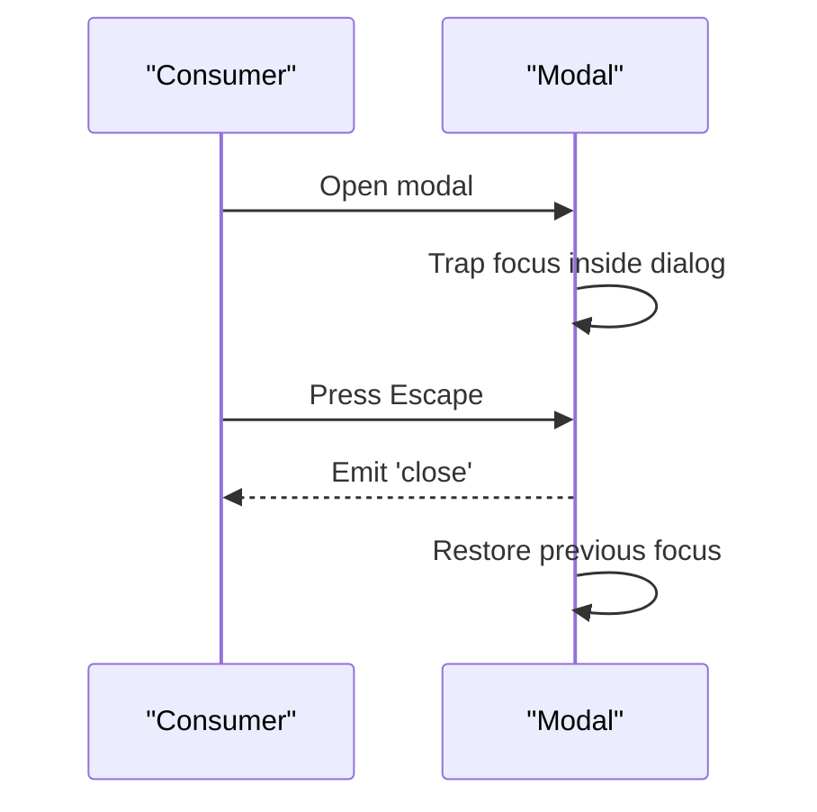

**Diagram sources**
- [Modal.vue:55-208](file://src/components/ui/Modal.vue#L55-L208)

**Section sources**
- [Modal.vue:1-258](file://src/components/ui/Modal.vue#L1-L258)

### Composition Patterns
- Slots: Used extensively in AbsaCard (header/default/footer), AbsaButton (icon-left/right), Modal (title/content/footer).
- Props and Events: AbsaButton emits disabled/loading states; Modal emits close; layouts emit logout actions.
- Composables: useRBAC provides permission checks and UI preferences; DashboardLayout uses it to compute visibility and permissions.

**Section sources**
- [AbsaCard.vue:21-34](file://src/components/ui/AbsaCard.vue#L21-L34)
- [AbsaButton.vue:13-19](file://src/components/ui/AbsaButton.vue#L13-L19)
- [Modal.vue:22-43](file://src/components/ui/Modal.vue#L22-L43)
- [useRBAC.js:55-137](file://src/composables/useRBAC.js#L55-L137)
- [DashboardLayout.vue:107-167](file://src/components/layouts/DashboardLayout.vue#L107-L167)

### Route Guards and Conditional Rendering
- Central guard in router/index.js enforces:
  - Authentication: Redirects to login if requiresAuth and no token.
  - Subscription enforcement: For dashboard routes beyond portfolio, checks allowed modules and roles.
  - Impersonation token handling: Sets token from query param and redirects to dashboard.
- Conditional rendering in DashboardLayout filters visible modules based on subscriptions and permissions.

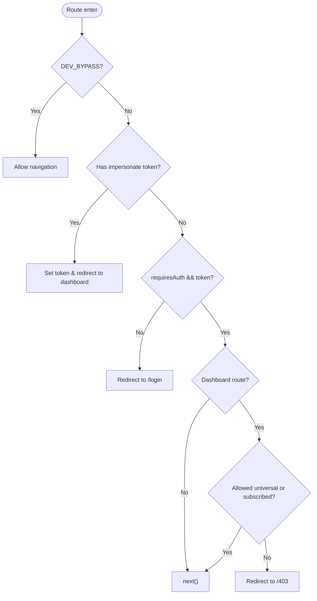

**Diagram sources**
- [index.js:201-272](file://src/router/index.js#L201-L272)

**Section sources**
- [index.js:201-272](file://src/router/index.js#L201-L272)
- [DashboardLayout.vue:169-233](file://src/components/layouts/DashboardLayout.vue#L169-L233)

### Component Lifecycle Management
- Vue 3 Composition API usage:
  - onMounted: Initialize services, register PWA listeners, fetch preferences/RBAC.
  - onUnmounted: Cleanup timers and event listeners.
  - ref/reactive: Manage local state (e.g., showInstallToast, mfePortalLink).
  - computed: Derive derived values (page title, user initials, module visibility).
- Reactive data binding: v-if/v-show for conditional UI; v-bind for attributes; watchers for route changes.

**Section sources**
- [App.vue:146-209](file://src/App.vue#L146-L209)
- [DashboardLayout.vue:111-167](file://src/components/layouts/DashboardLayout.vue#L111-L167)

### Testing Strategies
- Unit tests with Vitest and @vue/test-utils:
  - BackButton.spec.js: Verifies rendering variants, router interactions, and accessibility attributes.
  - BulkActionsBar.spec.js: Validates selection count display, emitted events, and slot rendering.
- Patterns:
  - Mocking dependencies (e.g., vue-router) to isolate component behavior.
  - Asserting DOM presence and event emissions for interactive elements.

**Section sources**
- [BackButton.spec.js:1-83](file://src/components/__tests__/BackButton.spec.js#L1-L83)
- [BulkActionsBar.spec.js:1-74](file://src/components/__tests__/BulkActionsBar.spec.js#L1-L74)

### Accessibility Compliance Patterns
- Modal: aria-modal, role="dialog", focus trapping, escape-to-close, focus restoration.
- Buttons: Focus ring and disabled states; semantic HTML buttons with proper attributes.
- Badges/Cards: aria-hidden for decorative elements; meaningful labels where applicable.

**Section sources**
- [Modal.vue:12-15](file://src/components/ui/Modal.vue#L12-L15)
- [Modal.vue:139-186](file://src/components/ui/Modal.vue#L139-L186)
- [AbsaButton.vue:51-99](file://src/components/ui/AbsaButton.vue#L51-L99)
- [AbsaCard.vue:6-19](file://src/components/ui/AbsaCard.vue#L6-L19)

### Responsive Design Implementations
- Tailwind breakpoints used in layouts and components (e.g., hidden md:flex, media queries in styles).
- DashboardLayout and SuperAdminLayout adapt navigation and content layout for mobile vs desktop.
- App.vue includes media queries for PWA toast positioning on small screens.

**Section sources**
- [DashboardLayout.vue:10-91](file://src/components/layouts/DashboardLayout.vue#L10-L91)
- [SuperAdminLayout.vue:144-149](file://src/components/layouts/SuperAdminLayout.vue#L144-L149)
- [App.vue:266-273](file://src/App.vue#L266-L273)

### Design System Integration (Tailwind CSS)
- Custom theme extensions:
  - Colors: ABSA brand palette (passion, power, hope, inspire, energy, uplift, enrich, serene) and Material-like tokens.
  - Typography: Hanken Grotesk font families and headline/body/label scales.
  - Spacing: Custom margins, gutters, card paddings, touch targets.
  - Radius, Shadows, Z-index: Consistent elevation and layering.
  - Animations: Float, fadeIn, loading-bar keyframes.
- Usage: Components reference brand variables and Tailwind utilities to maintain consistency.

**Section sources**
- [tailwind.config.js:6-175](file://tailwind.config.js#L6-L175)
- [AbsaButton.vue:51-99](file://src/components/ui/AbsaButton.vue#L51-L99)
- [AbsaCard.vue:66-88](file://src/components/ui/AbsaCard.vue#L66-L88)
- [AbsaBadge.vue:40-79](file://src/components/ui/AbsaBadge.vue#L40-L79)

## Dependency Analysis
- main.js depends on:
  - Vue core, Pinia, Router, Toast, Google Login, Lucide icons, Service Worker registration.
- App.vue depends on:
  - Router, PWA manager, currency service, JWT decoder, preferences, RBAC composable.
- Router depends on:
  - decodeJWT, moduleCards, DEV_BYPASS flag; lazy loads views and layouts.
- Layouts depend on:
  - Router APIs, decodeJWT, moduleCards, RBAC composable.
- UI components depend on:
  - Tailwind utilities and brand variables; Modal depends on DOM APIs for focus management.

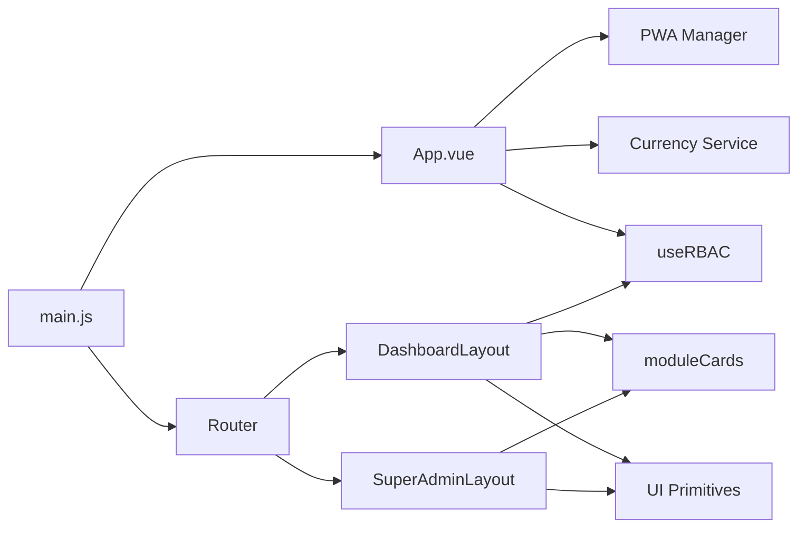

**Diagram sources**
- [main.js:70-125](file://src/main.js#L70-L125)
- [App.vue:90-168](file://src/App.vue#L90-L168)
- [index.js:196-275](file://src/router/index.js#L196-L275)
- [DashboardLayout.vue:107-233](file://src/components/layouts/DashboardLayout.vue#L107-L233)
- [SuperAdminLayout.vue:65-67](file://src/components/layouts/SuperAdminLayout.vue#L65-L67)

**Section sources**
- [main.js:70-125](file://src/main.js#L70-L125)
- [App.vue:90-168](file://src/App.vue#L90-L168)
- [index.js:196-275](file://src/router/index.js#L196-L275)
- [DashboardLayout.vue:107-233](file://src/components/layouts/DashboardLayout.vue#L107-L233)
- [SuperAdminLayout.vue:65-67](file://src/components/layouts/SuperAdminLayout.vue#L65-L67)

## Performance Considerations
- Lazy loading: Router uses dynamic imports for views and layouts to reduce initial bundle size.
- Computed properties: Minimize recalculations by deriving values like page title and module visibility efficiently.
- Service Worker: Optional dev bypass to skip SW registration during development; version checking triggers updates.
- Event cleanup: Timers and event listeners are cleared on unmount to prevent memory leaks.

[No sources needed since this section provides general guidance]

## Troubleshooting Guide
- Service Worker Registration:
  - If dev bypass is enabled, SW registration is skipped and existing registrations are cleared.
  - Errors are logged; check console for registration failures.
- Route Guards:
  - If redirected unexpectedly, verify token presence and role; impersonation token must be present in query for admin flows.
  - Subscription checks may block non-admin/non-manager roles if modules are not allowed.
- PWA Install Prompt:
  - Ensure beforeinstallprompt is captured globally; dismiss/install handlers manage toast visibility.

**Section sources**
- [main.js:35-67](file://src/main.js#L35-L67)
- [index.js:201-272](file://src/router/index.js#L201-L272)
- [App.vue:146-203](file://src/App.vue#L146-L203)

## Conclusion
The ABSA Foundry Frontend employs a clear hierarchical component architecture with robust layout wrappers, centralized routing and guards, and a cohesive design system built on Tailwind CSS. Composition patterns (slots, props, events) and Vue 3 Composition API enable scalable, testable, and accessible components. The modular structure supports responsive design, performance optimizations, and consistent brand expression across the application.