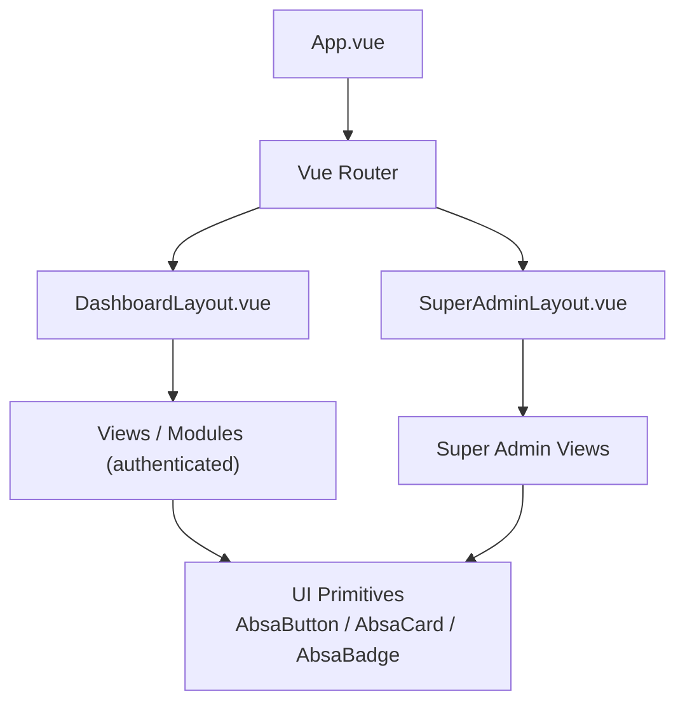
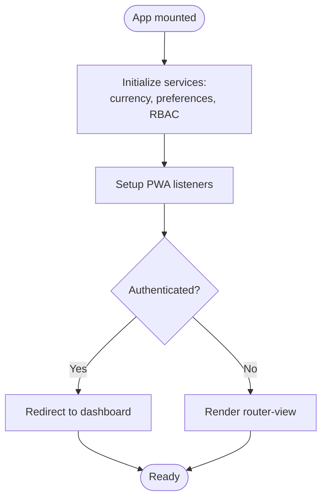
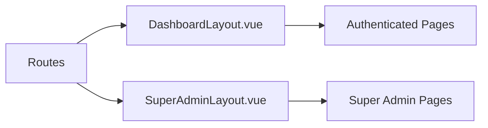
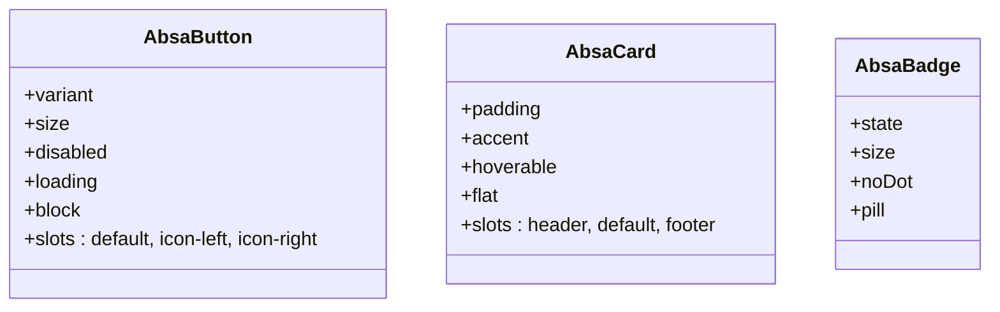
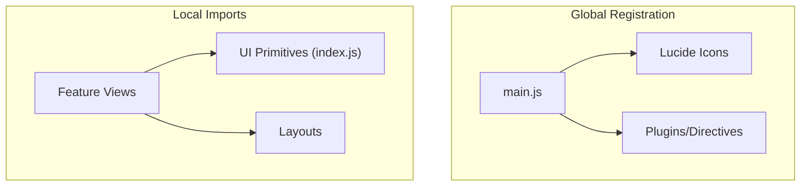
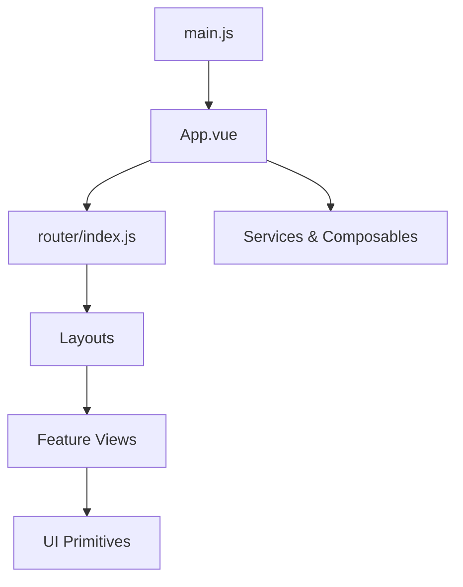

# Component Hierarchy & Structure

<cite>
**Referenced Files in This Document**
- [App.vue](file://src/App.vue)
- [DashboardLayout.vue](file://src/components/layouts/DashboardLayout.vue)
- [SuperAdminLayout.vue](file://src/components/layouts/SuperAdminLayout.vue)
- [index.js (UI barrel)](file://src/components/ui/index.js)
- [AbsaButton.vue](file://src/components/ui/AbsaButton.vue)
- [AbsaCard.vue](file://src/components/ui/AbsaCard.vue)
- [AbsaBadge.vue](file://src/components/ui/AbsaBadge.vue)
- [router/index.js](file://src/router/index.js)
- [main.js](file://src/main.js)
</cite>

## Table of Contents
1. Introduction
2. Project Structure
3. Core Components
4. Architecture Overview
5. Detailed Component Analysis
6. Dependency Analysis
7. Performance Considerations
8. Troubleshooting Guide
9. Conclusion

## Introduction
This document explains the component hierarchy and structure of ABSA Foundry Frontend, focusing on how the root application orchestrates layouts for authenticated users and administrative functions, and how atomic UI primitives are organized and composed throughout the app. It covers:
- The role of App.vue as the application entry point
- Route-based selection between DashboardLayout.vue and SuperAdminLayout.vue
- The component tree from high-level layouts down to atomic UI primitives
- Modular organization under src/components/ (ui/, layouts/, feature-specific components)
- Global registration patterns and local imports
- Composition patterns and separation of concerns between presentation and business logic

## Project Structure
The frontend follows a layered, modular structure:
- Application shell: App.vue renders global chrome and delegates rendering to Vue Router via <router-view />
- Layouts: DashboardLayout.vue wraps authenticated dashboards; SuperAdminLayout.vue wraps super-admin routes
- UI primitives: Reusable, theme-aware components under src/components/ui/
- Feature views: Business modules under src/views/Modules/*
- Routing: Centralized route definitions that map paths to layout wrappers and page components
- Bootstrap: main.js initializes plugins, directives, and global utilities



**Diagram sources**
- [App.vue:1-88](file://src/App.vue#L1-L88)
- [router/index.js:104-194](file://src/router/index.js#L104-L194)
- [DashboardLayout.vue:1-97](file://src/components/layouts/DashboardLayout.vue#L1-L97)
- [SuperAdminLayout.vue:1-63](file://src/components/layouts/SuperAdminLayout.vue#L1-L63)

**Section sources**
- [App.vue:1-88](file://src/App.vue#L1-L88)
- [router/index.js:104-194](file://src/router/index.js#L104-L194)

## Core Components
- App.vue: Root container with global PWA prompts, MFE modal overlay, and <router-view /> for routing. Initializes currency service, preferences, RBAC, and PWA behaviors on mount.
- DashboardLayout.vue: Authenticated dashboard shell with top navigation, user info, search, and a content area that renders child routes. Dynamically filters module visibility based on subscriptions and permissions.
- SuperAdminLayout.vue: Administrative shell with a persistent sidebar and topbar for super-admin tasks.
- UI primitives: AbsaButton, AbsaCard, AbsaBadge provide consistent styling, variants, and behavior used across features.

Key responsibilities:
- App.vue: Bootstrapping, global state initialization, PWA interactions, and routing outlet
- Layouts: Provide consistent chrome and context for pages; enforce navigation and user context
- UI primitives: Encapsulate visual and interaction patterns without business logic

**Section sources**
- [App.vue:90-241](file://src/App.vue#L90-L241)
- [DashboardLayout.vue:99-233](file://src/components/layouts/DashboardLayout.vue#L99-L233)
- [SuperAdminLayout.vue:65-67](file://src/components/layouts/SuperAdminLayout.vue#L65-L67)
- [AbsaButton.vue:23-99](file://src/components/ui/AbsaButton.vue#L23-L99)
- [AbsaCard.vue:38-89](file://src/components/ui/AbsaCard.vue#L38-L89)
- [AbsaBadge.vue:13-80](file://src/components/ui/AbsaBadge.vue#L13-L80)

## Architecture Overview
The application uses Vue Router to select a layout wrapper based on the current path:
- Routes under /dashboard use DashboardLayout.vue
- Routes under /super-admin use SuperAdminLayout.vue
- Other public or auth routes render directly

```mermaid
sequenceDiagram
participant User as "User"
participant Router as "Vue Router"
participant App as "App.vue"
participant Layout as "Layout Wrapper"
participant View as "Page View"
User->>Router : Navigate to /dashboard/portfolio
Router->>App : Render <router-view />
App->>Router : Resolve route
Router->>Layout : Mount DashboardLayout.vue
Layout->>View : Render child view inside <router-view />
Note over Layout,View : Layout provides chrome; View contains business content
```

**Diagram sources**
- [router/index.js:104-194](file://src/router/index.js#L104-L194)
- [App.vue:1-88](file://src/App.vue#L1-L88)
- [DashboardLayout.vue:1-97](file://src/components/layouts/DashboardLayout.vue#L1-L97)

## Detailed Component Analysis

### Root Application: App.vue
- Renders global background, PWA install toast, and MFE modal overlays
- Delegates all page rendering to <router-view />
- On mount: waits for router readiness, checks session, initializes currency service, preferences, and RBAC, sets up PWA callbacks, and registers periodic sync if supported
- Watches route changes to redirect authenticated users away from login/signup pages



**Diagram sources**
- [App.vue:146-203](file://src/App.vue#L146-L203)

**Section sources**
- [App.vue:1-88](file://src/App.vue#L1-L88)
- [App.vue:90-241](file://src/App.vue#L90-L241)

### Layouts: DashboardLayout.vue vs SuperAdminLayout.vue
- DashboardLayout.vue:
  - Provides a top header with dropdown navigation, search, notifications, help, and user avatar/info
  - Uses <router-view /> to render authenticated pages
  - Computes page title from route meta
  - Fetches subscribed modules and filters visible items based on roles and permissions
- SuperAdminLayout.vue:
  - Provides a left sidebar with admin sections and a top bar
  - Uses <router-view /> to render super-admin pages
  - Minimal script block; primarily presentational

Route-based conditional rendering is handled by Vue Router:
- Paths starting with /dashboard mount DashboardLayout.vue
- Paths starting with /super-admin mount SuperAdminLayout.vue



**Diagram sources**
- [router/index.js:104-194](file://src/router/index.js#L104-L194)
- [DashboardLayout.vue:1-97](file://src/components/layouts/DashboardLayout.vue#L1-L97)
- [SuperAdminLayout.vue:1-63](file://src/components/layouts/SuperAdminLayout.vue#L1-L63)

**Section sources**
- [DashboardLayout.vue:1-97](file://src/components/layouts/DashboardLayout.vue#L1-L97)
- [DashboardLayout.vue:99-233](file://src/components/layouts/DashboardLayout.vue#L99-L233)
- [SuperAdminLayout.vue:1-67](file://src/components/layouts/SuperAdminLayout.vue#L1-L67)
- [router/index.js:104-194](file://src/router/index.js#L104-L194)

### Atomic UI Primitives: AbsaButton, AbsaCard, AbsaBadge
These components encapsulate brand-consistent styles and behaviors:
- AbsaButton:
  - Props: variant, size, disabled, loading, block
  - Slots: default content, icon-left, icon-right
  - Computed classes apply theme colors and sizes
- AbsaCard:
  - Props: padding, accent, hoverable, flat
  - Slots: header, default, footer
  - Accent bar and subtle hover gradient effects
- AbsaBadge:
  - Props: state, size, noDot, pill
  - State-driven color mapping for lifecycle and operational statuses



**Diagram sources**
- [AbsaButton.vue:23-99](file://src/components/ui/AbsaButton.vue#L23-L99)
- [AbsaCard.vue:38-89](file://src/components/ui/AbsaCard.vue#L38-L89)
- [AbsaBadge.vue:13-80](file://src/components/ui/AbsaBadge.vue#L13-L80)

**Section sources**
- [AbsaButton.vue:1-101](file://src/components/ui/AbsaButton.vue#L1-L101)
- [AbsaCard.vue:1-90](file://src/components/ui/AbsaCard.vue#L1-L90)
- [AbsaBadge.vue:1-81](file://src/components/ui/AbsaBadge.vue#L1-L81)

### Modular Organization: ui/, layouts/, and feature-specific components
- ui/: Contains reusable, theme-aware primitives and shared UI widgets (e.g., Modal, ConfirmDialog, PageHeader, KpiCard, BulkActionsBar). Exposed via a barrel index.js for convenient imports.
- layouts/: Contains layout shells that wrap pages with consistent chrome (header/sidebar/topbar).
- Feature-specific components: Located within views/Modules/* and other feature directories, composed using UI primitives and layout shells.

Global registration and local imports:
- Global registration: main.js registers Lucide icons globally and installs plugins/directives (e.g., vRole, currency plugin, toastify).
- Local imports: Components import UI primitives directly where needed (e.g., feature views importing AbsaButton/AbsaCard/AbsaBadge).



**Diagram sources**
- [main.js:70-101](file://src/main.js#L70-L101)
- [index.js (UI barrel):1-22](file://src/components/ui/index.js#L1-L22)

**Section sources**
- [main.js:70-101](file://src/main.js#L70-L101)
- [index.js (UI barrel):1-22](file://src/components/ui/index.js#L1-L22)

### Component Composition Patterns
- Layout composition: Pages are nested under layout wrappers via <router-view />, allowing layouts to provide chrome while pages focus on domain content.
- Primitive composition: Feature views compose AbsaButton, AbsaCard, AbsaBadge to build complex UIs consistently.
- Separation of concerns:
  - Presentation: Layouts and UI primitives handle visual structure and styling
  - Business logic: Features and composables manage data fetching, permissions, and state (e.g., DashboardLayout fetches subscribed modules and applies RBAC)

Example flows:
- DashboardLayout computes page title from route meta and dynamically filters module visibility based on subscriptions and permissions
- UI primitives expose props/slots to adapt to different contexts without embedding business rules

**Section sources**
- [DashboardLayout.vue:111-167](file://src/components/layouts/DashboardLayout.vue#L111-L167)
- [DashboardLayout.vue:169-233](file://src/components/layouts/DashboardLayout.vue#L169-L233)
- [AbsaButton.vue:23-99](file://src/components/ui/AbsaButton.vue#L23-L99)
- [AbsaCard.vue:38-89](file://src/components/ui/AbsaCard.vue#L38-L89)
- [AbsaBadge.vue:13-80](file://src/components/ui/AbsaBadge.vue#L13-L80)

## Dependency Analysis
- App.vue depends on:
  - Router for navigation and route resolution
  - Services for currency, JWT decoding, preferences, and RBAC
  - PWA manager for install prompts and lifecycle events
- Layouts depend on:
  - Router for nested views and navigation
  - RBAC and module configuration for dynamic visibility
- UI primitives are independent and consumed by feature views and layouts
- main.js bootstraps the app and registers global dependencies



**Diagram sources**
- [App.vue:90-241](file://src/App.vue#L90-L241)
- [router/index.js:1-275](file://src/router/index.js#L1-275)
- [main.js:70-101](file://src/main.js#L70-L101)

**Section sources**
- [App.vue:90-241](file://src/App.vue#L90-L241)
- [router/index.js:1-275](file://src/router/index.js#L1-275)
- [main.js:70-101](file://src/main.js#L70-L101)

## Performance Considerations
- Lazy loading: Routes use dynamic imports to split bundles and reduce initial load time
- Efficient reactivity: Layouts compute derived values (e.g., page title, module visibility) using computed properties
- Minimal global state: Use composables and stores for shared logic; avoid unnecessary re-renders by scoping state
- Service worker: Optional dev bypass can improve development iteration speed; production benefits from caching and updates

[No sources needed since this section provides general guidance]

## Troubleshooting Guide
Common issues and where to look:
- Authentication redirects not working:
  - Verify route guards and token presence in router/index.js
  - Check session detection in App.vue
- Module visibility incorrect:
  - Inspect subscription fetching and filtering in DashboardLayout.vue
  - Ensure RBAC initialization in App.vue and usage in layouts
- PWA install prompt missing:
  - Confirm global event capture and PWA setup in main.js and App.vue
- UI inconsistencies:
  - Validate prop usage against AbsaButton/AbsaCard/AbsaBadge interfaces

**Section sources**
- [router/index.js:201-272](file://src/router/index.js#L201-L272)
- [App.vue:120-203](file://src/App.vue#L120-L203)
- [DashboardLayout.vue:169-233](file://src/components/layouts/DashboardLayout.vue#L169-L233)
- [main.js:23-67](file://src/main.js#L23-L67)

## Conclusion
ABSA Foundry Frontend organizes its component hierarchy around clear separation of concerns:
- App.vue orchestrates global initialization and delegates rendering to Vue Router
- Layouts provide consistent chrome and context for authenticated and administrative experiences
- UI primitives offer reusable, theme-aware building blocks
- Features compose these primitives to deliver business functionality
This structure supports scalability, maintainability, and consistent user experience across the application.

[No sources needed since this section summarizes without analyzing specific files]