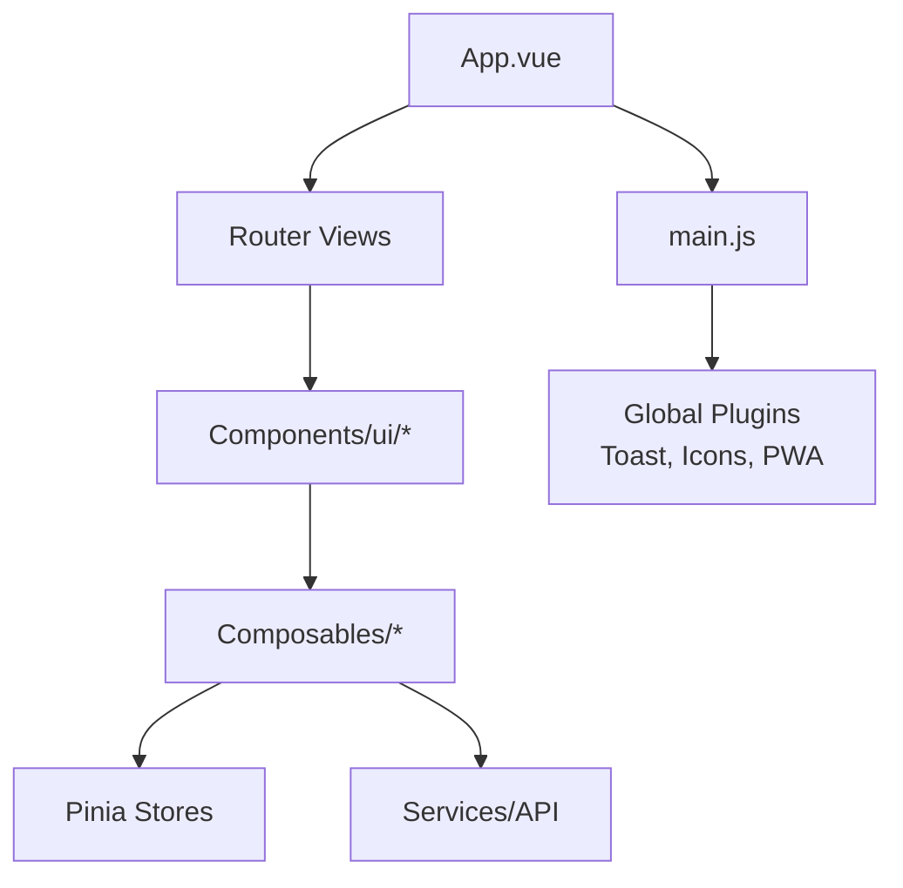
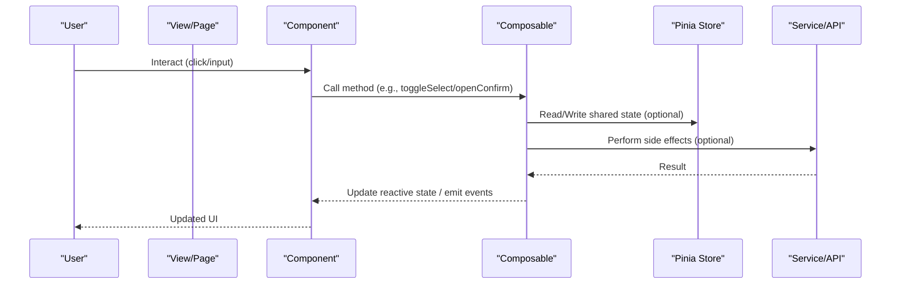
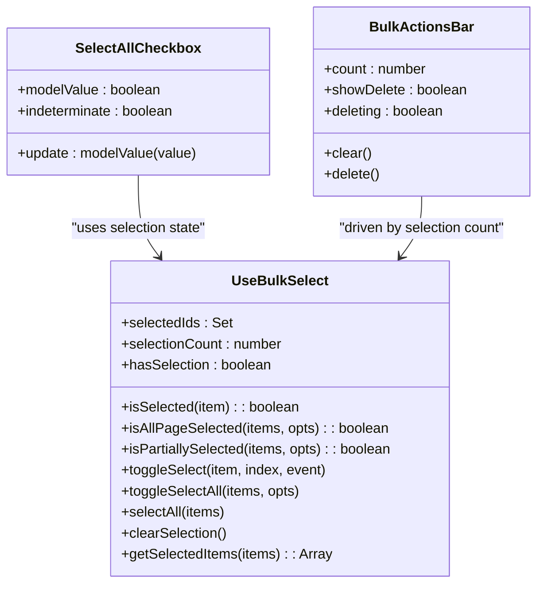
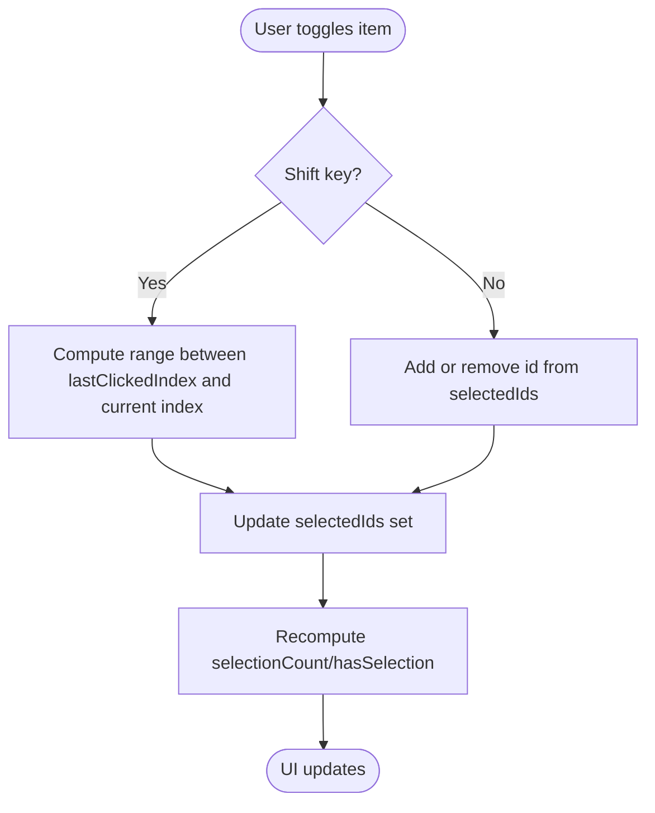
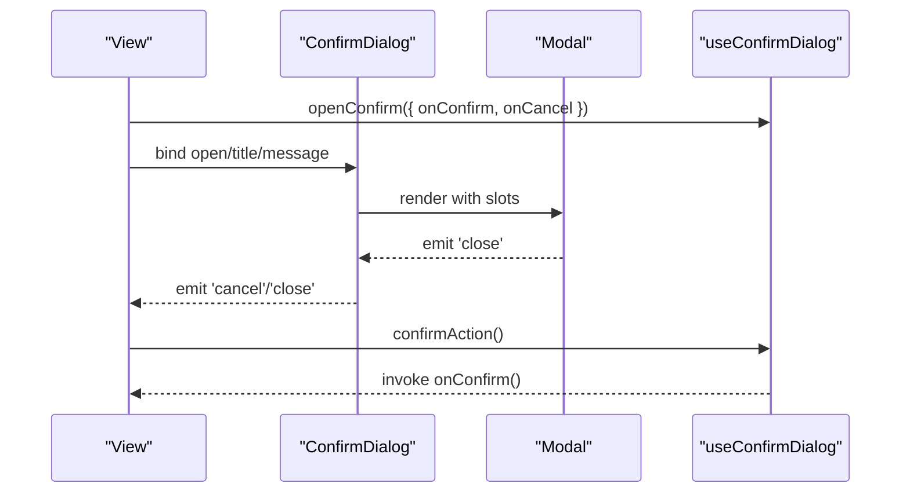
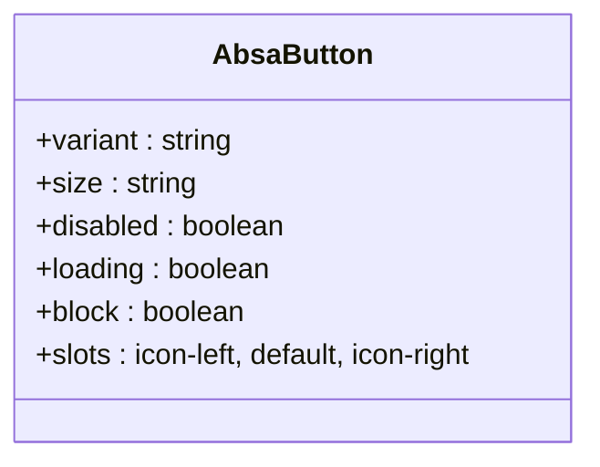
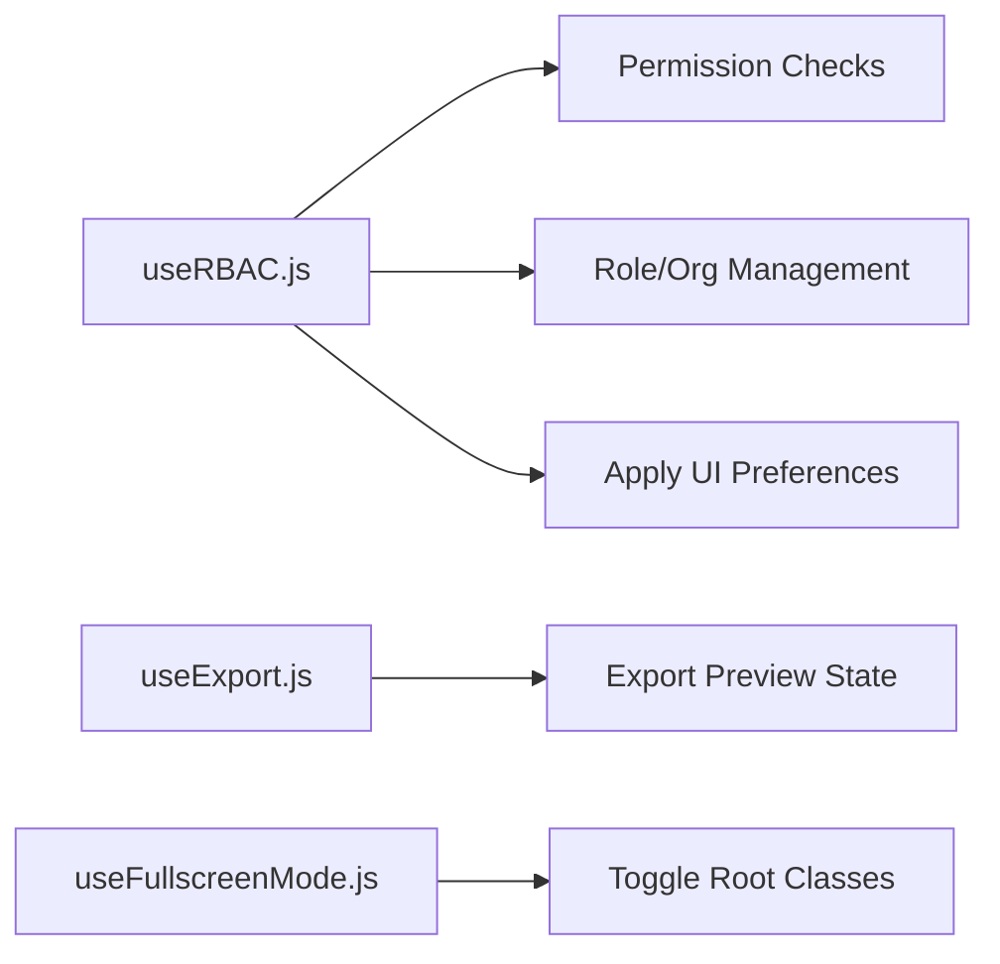
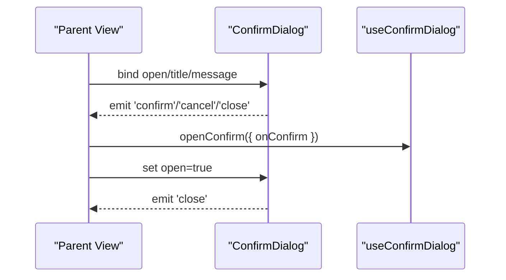
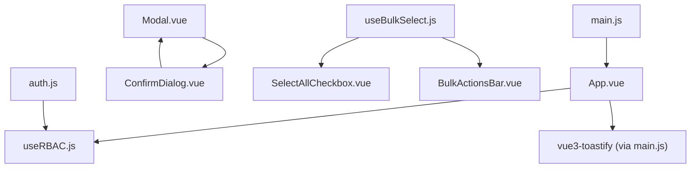

# Composition Patterns & Communication

<cite>
**Referenced Files in This Document**
- [useBulkSelect.js](file://src/composables/useBulkSelect.js)
- [BulkActionsBar.vue](file://src/components/ui/BulkActionsBar.vue)
- [SelectAllCheckbox.vue](file://src/components/ui/SelectAllCheckbox.vue)
- [Modal.vue](file://src/components/ui/Modal.vue)
- [ConfirmDialog.vue](file://src/components/ui/ConfirmDialog.vue)
- [AbsaButton.vue](file://src/components/ui/AbsaButton.vue)
- [useRBAC.js](file://src/composables/useRBAC.js)
- [useConfirmDialog.js](file://src/composables/useConfirmDialog.js)
- [useExport.js](file://src/composables/useExport.js)
- [useFullscreenMode.js](file://src/composables/useFullscreenMode.js)
- [auth.js](file://src/stores/auth.js)
- [App.vue](file://src/App.vue)
- [main.js](file://src/main.js)
</cite>

## Table of Contents
1. [Introduction](#introduction)
2. [Project Structure](#project-structure)
3. [Core Components](#core-components)
4. [Architecture Overview](#architecture-overview)
5. [Detailed Component Analysis](#detailed-component-analysis)
6. [Dependency Analysis](#dependency-analysis)
7. [Performance Considerations](#performance-considerations)
8. [Troubleshooting Guide](#troubleshooting-guide)
9. [Conclusion](#conclusion)
10. [Appendices](#appendices)

## Introduction
This document explains the Vue 3 Composition API patterns and component communication strategies used across ABSA Foundry Frontend. It focuses on:
- Composables for reusable business logic (e.g., selection, permissions, dialogs, exports, fullscreen mode)
- Event-driven communication (custom events, v-model, slots, props)
- Reactive data binding with ref(), computed(), watch()
- Parent-child, sibling, and cross-cutting concerns via composables and stores
- Testing strategies and best practices for maintainable, reusable components

## Project Structure
The codebase organizes UI primitives under src/components/ui, shared logic as composables under src/composables, global state via Pinia stores under src/stores, and app bootstrap in main.js and App.vue.

**Diagram sources**
- [App.vue:1-293](file://src/App.vue#L1-L293)
- [main.js:1-129](file://src/main.js#L1-L129)

**Section sources**
- [App.vue:1-293](file://src/App.vue#L1-L293)
- [main.js:1-129](file://src/main.js#L1-L129)

## Core Components
Key UI building blocks demonstrate composition patterns:
- Modal: Teleport-based dialog with focus trapping and keyboard handling; emits close event; uses slots for title/content/footer.
- ConfirmDialog: High-level confirmation modal composed from Modal; exposes confirm/cancel/close events; variant-driven styling via computed.
- AbsaButton: Reusable button with slots for icons and content; variant/size/block props; computed class resolution.
- SelectAllCheckbox: Two-way binding via v-model; indeterminate state support; emits update:modelValue.
- BulkActionsBar: Displays selected count and actions; emits clear/delete; supports slot injection for custom actions.

These components emphasize:
- Props for configuration
- Slots for flexible content injection
- Emits for parent-driven behavior
- Computed classes/state for derived UI

**Section sources**
- [Modal.vue:1-258](file://src/components/ui/Modal.vue#L1-L258)
- [ConfirmDialog.vue:1-178](file://src/components/ui/ConfirmDialog.vue#L1-L178)
- [AbsaButton.vue:1-101](file://src/components/ui/AbsaButton.vue#L1-L101)
- [SelectAllCheckbox.vue:1-18](file://src/components/ui/SelectAllCheckbox.vue#L1-L18)
- [BulkActionsBar.vue:1-47](file://src/components/ui/BulkActionsBar.vue#L1-L47)

## Architecture Overview
The application composes features by combining small, focused components with reusable composables. Global initialization boots plugins and services; views compose UI primitives and call composables to handle domain logic.

[No sources needed since this diagram shows conceptual workflow, not actual code structure]

## Detailed Component Analysis

### Bulk Selection Pattern (composable + components)
- useBulkSelect provides a Set-based selection model with computed counts and helpers for range selection, partial/all detection, and filtering.
- SelectAllCheckbox binds to selection state via v-model and supports indeterminate states.
- BulkActionsBar displays selection count and emits actions (clear/delete), while allowing custom action slots.

**Diagram sources**
- [useBulkSelect.js:1-99](file://src/composables/useBulkSelect.js#L1-L99)
- [SelectAllCheckbox.vue:1-18](file://src/components/ui/SelectAllCheckbox.vue#L1-L18)
- [BulkActionsBar.vue:1-47](file://src/components/ui/BulkActionsBar.vue#L1-L47)

**Diagram sources**
- [useBulkSelect.js:27-66](file://src/composables/useBulkSelect.js#L27-L66)

**Section sources**
- [useBulkSelect.js:1-99](file://src/composables/useBulkSelect.js#L1-L99)
- [SelectAllCheckbox.vue:1-18](file://src/components/ui/SelectAllCheckbox.vue#L1-L18)
- [BulkActionsBar.vue:1-47](file://src/components/ui/BulkActionsBar.vue#L1-L47)

### Confirmation Dialog Pattern (composable + modal)
- useConfirmDialog centralizes dialog state and lifecycle callbacks (open, cancel, confirm, close).
- ConfirmDialog composes Modal, maps props to variants, and emits confirm/cancel/close.
- Modal handles accessibility, focus trapping, escape key, and teleporting to body.

**Diagram sources**
- [useConfirmDialog.js:1-64](file://src/composables/useConfirmDialog.js#L1-L64)
- [ConfirmDialog.vue:1-178](file://src/components/ui/ConfirmDialog.vue#L1-L178)
- [Modal.vue:1-258](file://src/components/ui/Modal.vue#L1-L258)

**Section sources**
- [useConfirmDialog.js:1-64](file://src/composables/useConfirmDialog.js#L1-L64)
- [ConfirmDialog.vue:1-178](file://src/components/ui/ConfirmDialog.vue#L1-L178)
- [Modal.vue:1-258](file://src/components/ui/Modal.vue#L1-L258)

### Button and Slot-Based Composition
- AbsaButton demonstrates prop-driven variants/sizes, computed class resolution, and slot composition for icons and content.
- It also forwards attributes via v-bind($attrs) for accessibility and interop.

**Diagram sources**
- [AbsaButton.vue:1-101](file://src/components/ui/AbsaButton.vue#L1-L101)

**Section sources**
- [AbsaButton.vue:1-101](file://src/components/ui/AbsaButton.vue#L1-L101)

### Reactive Data Binding Patterns
- v-model usage: SelectAllCheckbox implements two-way binding via modelValue and update:modelValue.
- ref(): Used extensively in composables for local state (e.g., selectedIds, showExportPreview, isFullscreen).
- computed(): Derived UI state such as selectionCount, hasSelection, and dynamic classes.
- watch(): Side effects like toggling CSS classes on documentElement when entering/exiting fullscreen.

Examples:
- Selection count and presence are derived from selectedIds using computed().
- Fullscreen mode toggles a root class reactively via watch(isFullscreen).
- Export preview visibility and payload are managed with ref() and exposed methods.

**Section sources**
- [SelectAllCheckbox.vue:1-18](file://src/components/ui/SelectAllCheckbox.vue#L1-L18)
- [useBulkSelect.js:1-99](file://src/composables/useBulkSelect.js#L1-L99)
- [useFullscreenMode.js:1-29](file://src/composables/useFullscreenMode.js#L1-L29)
- [useExport.js:1-36](file://src/composables/useExport.js#L1-L36)

### Cross-Cutting Concerns via Composables
- Role-Based Access Control (RBAC): Centralized permission checks, role/organization management, and UI preferences application. Provides readonly reactive state and methods to query capabilities (canRead, canEdit, etc.).
- Export Flow: Encapsulates export preview state and error handling via toast notifications.
- Fullscreen Mode: Toggles application-wide visual mode and applies CSS classes.

**Diagram sources**
- [useRBAC.js:1-783](file://src/composables/useRBAC.js#L1-L783)
- [useExport.js:1-36](file://src/composables/useExport.js#L1-L36)
- [useFullscreenMode.js:1-29](file://src/composables/useFullscreenMode.js#L1-L29)

**Section sources**
- [useRBAC.js:1-783](file://src/composables/useRBAC.js#L1-L783)
- [useExport.js:1-36](file://src/composables/useExport.js#L1-L36)
- [useFullscreenMode.js:1-29](file://src/composables/useFullscreenMode.js#L1-L29)

### Parent-Child and Sibling Communication
- Parent-to-Child: Props pass configuration (e.g., variant, size, disabled) and boolean flags (e.g., open, showDelete).
- Child-to-Parent: Emits drive parent behavior (e.g., ConfirmDialog emits confirm/cancel/close; BulkActionsBar emits clear/delete).
- Sibling Communication: Shared state via composables (e.g., useBulkSelect) or Pinia stores (e.g., auth store) enables decoupled coordination without direct coupling.

**Diagram sources**
- [ConfirmDialog.vue:1-178](file://src/components/ui/ConfirmDialog.vue#L1-L178)
- [useConfirmDialog.js:1-64](file://src/composables/useConfirmDialog.js#L1-L64)

**Section sources**
- [ConfirmDialog.vue:1-178](file://src/components/ui/ConfirmDialog.vue#L1-L178)
- [useConfirmDialog.js:1-64](file://src/composables/useConfirmDialog.js#L1-L64)
- [auth.js:1-22](file://src/stores/auth.js#L1-L22)

## Dependency Analysis
High-level dependencies among core files:

**Diagram sources**
- [main.js:1-129](file://src/main.js#L1-L129)
- [App.vue:1-293](file://src/App.vue#L1-L293)
- [useRBAC.js:1-783](file://src/composables/useRBAC.js#L1-L783)
- [Modal.vue:1-258](file://src/components/ui/Modal.vue#L1-L258)
- [ConfirmDialog.vue:1-178](file://src/components/ui/ConfirmDialog.vue#L1-L178)
- [useBulkSelect.js:1-99](file://src/composables/useBulkSelect.js#L1-L99)
- [SelectAllCheckbox.vue:1-18](file://src/components/ui/SelectAllCheckbox.vue#L1-L18)
- [BulkActionsBar.vue:1-47](file://src/components/ui/BulkActionsBar.vue#L1-L47)
- [auth.js:1-22](file://src/stores/auth.js#L1-L22)

**Section sources**
- [main.js:1-129](file://src/main.js#L1-L129)
- [App.vue:1-293](file://src/App.vue#L1-L293)
- [useRBAC.js:1-783](file://src/composables/useRBAC.js#L1-L783)
- [Modal.vue:1-258](file://src/components/ui/Modal.vue#L1-L258)
- [ConfirmDialog.vue:1-178](file://src/components/ui/ConfirmDialog.vue#L1-L178)
- [useBulkSelect.js:1-99](file://src/composables/useBulkSelect.js#L1-L99)
- [SelectAllCheckbox.vue:1-18](file://src/components/ui/SelectAllCheckbox.vue#L1-L18)
- [BulkActionsBar.vue:1-47](file://src/components/ui/BulkActionsBar.vue#L1-L47)
- [auth.js:1-22](file://src/stores/auth.js#L1-L22)

## Performance Considerations
- Prefer computed over watchers for derived UI state to minimize recalculations.
- Keep composable state minimal and co-located with its consumers; avoid global mutable state unless necessary.
- Debounce heavy computations if triggered frequently (e.g., large list selections).
- Use slots to reduce prop drilling and keep components declarative.
- Leverage Pinia stores for cross-cutting state that must be shared across unrelated components.

[No sources needed since this section provides general guidance]

## Troubleshooting Guide
Common issues and where to look:
- Modal focus/keyboard traps: Ensure Modal’s trapFocus and closeOnEscape are configured correctly; verify focus restoration on unmount.
- Confirm dialog not closing: Check that parent listens to close and clears open state; ensure useConfirmDialog callbacks are provided.
- Bulk selection not updating: Verify getId mapping matches your data shape; ensure items passed to helpers include indices for shift-range selection.
- Permissions not applied: Confirm initializeRBAC ran and roles/preferences were fetched; check dev bypass flag behavior.
- Export errors: Inspect toast messages from useExport and validate exported data shape.

**Section sources**
- [Modal.vue:1-258](file://src/components/ui/Modal.vue#L1-L258)
- [ConfirmDialog.vue:1-178](file://src/components/ui/ConfirmDialog.vue#L1-L178)
- [useBulkSelect.js:1-99](file://src/composables/useBulkSelect.js#L1-L99)
- [useRBAC.js:1-783](file://src/composables/useRBAC.js#L1-L783)
- [useExport.js:1-36](file://src/composables/useExport.js#L1-L36)

## Conclusion
ABSA Foundry Frontend leverages Vue 3 Composition API patterns to build modular, testable, and reusable UI features. Composables encapsulate cross-cutting logic (permissions, selection, dialogs, exports, fullscreen), while components communicate through well-defined props, slots, and events. This approach maintains clear boundaries, improves reusability, and simplifies testing and maintenance.

[No sources needed since this section summarizes without analyzing specific files]

## Appendices

### Best Practices Checklist
- Keep composables pure regarding UI rendering; they should manage state and logic only.
- Expose minimal APIs from composables; prefer named functions over objects when possible.
- Use v-model for form-like components to standardize two-way binding.
- Favor slots for content flexibility; avoid excessive prop drilling.
- Centralize global state in Pinia stores; keep component-local state in composables or component scope.
- Test composables in isolation and components with mocked dependencies.

[No sources needed since this section provides general guidance]