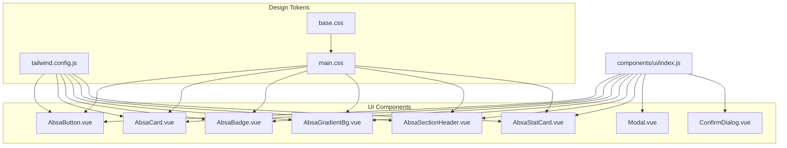
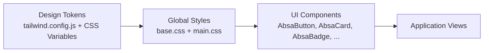
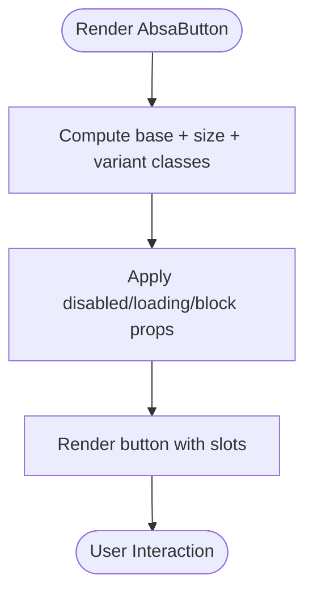
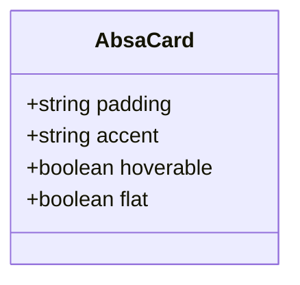
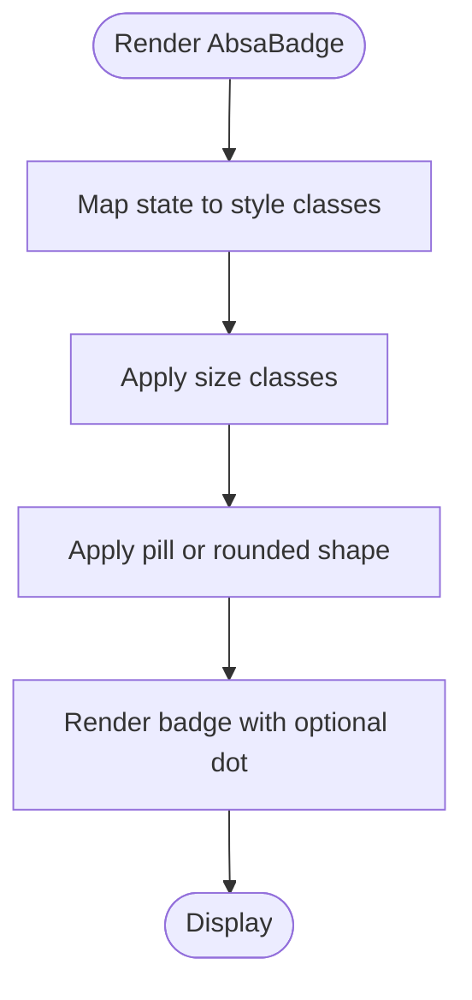
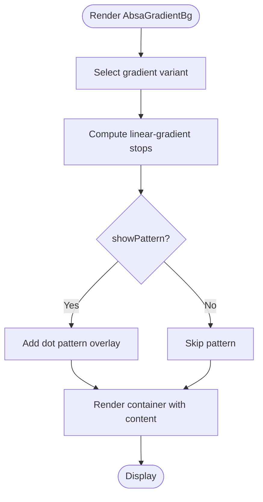
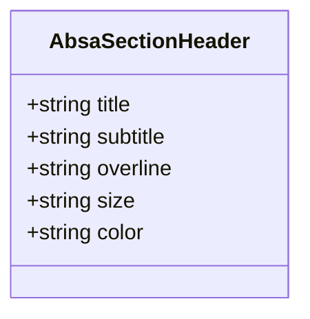
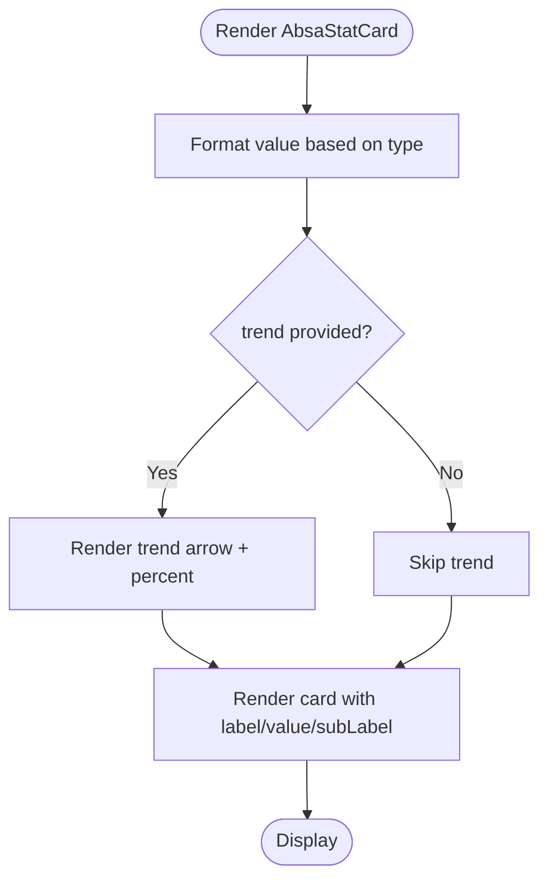
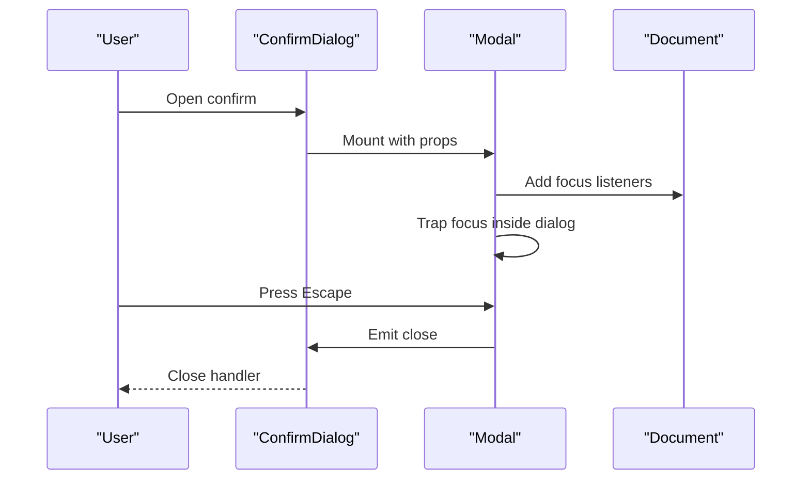
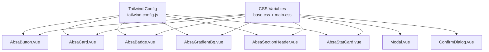

# Design System & UI Components

<cite>
**Referenced Files in This Document**
- [index.js](file://src/components/ui/index.js)
- [AbsaButton.vue](file://src/components/ui/AbsaButton.vue)
- [AbsaCard.vue](file://src/components/ui/AbsaCard.vue)
- [AbsaBadge.vue](file://src/components/ui/AbsaBadge.vue)
- [AbsaGradientBg.vue](file://src/components/ui/AbsaGradientBg.vue)
- [AbsaSectionHeader.vue](file://src/components/ui/AbsaSectionHeader.vue)
- [AbsaStatCard.vue](file://src/components/ui/AbsaStatCard.vue)
- [Modal.vue](file://src/components/ui/Modal.vue)
- [ConfirmDialog.vue](file://src/components/ui/ConfirmDialog.vue)
- [tailwind.config.js](file://tailwind.config.js)
- [base.css](file://src/assets/base.css)
- [main.css](file://src/assets/main.css)
- [ThemeManager.vue](file://src/components/ThemeManager.vue)
</cite>

## Table of Contents
1. Introduction
2. Project Structure
3. Core Components
4. Architecture Overview
5. Detailed Component Analysis
6. Dependency Analysis
7. Performance Considerations
8. Troubleshooting Guide
9. Conclusion

## Introduction
This document explains the design system and brand-consistent UI component library used in ABSA Foundry Frontend. It covers the AbsaButton, AbsaCard, AbsaBadge, and related primitives built with Vue 3 and Tailwind CSS. You will find guidance on props, variants, theme integration via CSS variables and Tailwind configuration, accessibility patterns (ARIA attributes, keyboard navigation, focus management), responsive behavior, dark mode support, cross-browser considerations, and how to compose components while following ABSA brand guidelines.

## Project Structure
The design system is organized under src/components/ui as a cohesive set of reusable components. A central barrel file exports all UI components for convenient imports across the application. Global styles and design tokens are defined in base.css and main.css, with Tailwind configuration extending colors, typography, spacing, radii, shadows, z-index layers, and animations. Dark mode is class-based and toggled at the document root.

**Diagram sources**
- [index.js:1-22](file://src/components/ui/index.js#L1-L22)
- [tailwind.config.js:1-181](file://tailwind.config.js#L1-L181)
- [base.css:1-87](file://src/assets/base.css#L1-L87)
- [main.css:1-800](file://src/assets/main.css#L1-L800)

**Section sources**
- [index.js:1-22](file://src/components/ui/index.js#L1-L22)
- [tailwind.config.js:1-181](file://tailwind.config.js#L1-L181)
- [base.css:1-87](file://src/assets/base.css#L1-L87)
- [main.css:1-800](file://src/assets/main.css#L1-L800)

## Core Components
This section summarizes each core component’s purpose, customization options, and usage patterns.

- AbsaButton
  - Purpose: Primary interactive element with brand-aligned variants and sizes.
  - Props: variant (absa, power, hope, outline, ghost, energy, danger), size (sm, md, lg), disabled, loading, block.
  - Styling: Uses Tailwind classes mapped to ABSA brand colors; includes focus ring and hover states.
  - Accessibility: Passes through attributes; supports keyboard interaction by default as a native button.

- AbsaCard
  - Purpose: Content container with optional accent bar, hover effects, and flat style.
  - Props: padding (sm, md, lg), accent (passion, power, hope, energy, none), hoverable, flat.
  - Styling: Subtle shadow or flat border based on props; gradient overlay on hover when enabled.

- AbsaBadge
  - Purpose: Status indicator with state-driven color and optional dot.
  - Props: state (active, at-risk, dormant, churned, info, success, warning, error, completed, running, failed), size (sm, md), noDot, pill.
  - Styling: Pill or rounded rectangle; dot color maps to state.

- AbsaGradientBg
  - Purpose: Brand-compliant gradient backgrounds with optional pattern overlay.
  - Props: variant (multiple predefined gradients), showPattern, padding (none, md, lg), rounded (none, md, lg, xl).
  - Styling: Gradient computed from brand palette; optional subtle dot pattern overlay.

- AbsaSectionHeader
  - Purpose: Section title with overline, subtitle, and vertical accent bar.
  - Props: title, subtitle, overline, size (sm, md, lg), color (passion, power, energy, hope).
  - Styling: Dynamic heading tag based on size; accent bar width and height vary by size.

- AbsaStatCard
  - Purpose: Metric display with label, formatted value, trend indicator, and accent bar.
  - Props: label, value, subLabel, trend, loading, accentColor, format (number, currency, percentage, raw).
  - Styling: Accent top bar; trend arrow and color; loading skeleton.

- Modal
  - Purpose: Accessible dialog with focus trapping, escape-to-close, and backdrop.
  - Props: to (teleport target), closeOnEscape, trapFocus, restoreFocus.
  - Accessibility: role="dialog", aria-modal, focus management, Escape key handling.

- ConfirmDialog
  - Purpose: Confirmation modal with variant-driven iconography and actions.
  - Props: open, title, message, detail, variant (danger, warning, info, neutral), labels, busy flags.
  - Accessibility: aria-labelledby and aria-describedby bound to dynamic IDs; keyboard accessible buttons.

**Section sources**
- [AbsaButton.vue:1-101](file://src/components/ui/AbsaButton.vue#L1-L101)
- [AbsaCard.vue:1-90](file://src/components/ui/AbsaCard.vue#L1-L90)
- [AbsaBadge.vue:1-81](file://src/components/ui/AbsaBadge.vue#L1-L81)
- [AbsaGradientBg.vue:1-120](file://src/components/ui/AbsaGradientBg.vue#L1-L120)
- [AbsaSectionHeader.vue:1-83](file://src/components/ui/AbsaSectionHeader.vue#L1-L83)
- [AbsaStatCard.vue:1-87](file://src/components/ui/AbsaStatCard.vue#L1-L87)
- [Modal.vue:1-258](file://src/components/ui/Modal.vue#L1-L258)
- [ConfirmDialog.vue:1-178](file://src/components/ui/ConfirmDialog.vue#L1-L178)

## Architecture Overview
The design system follows a token-driven architecture:
- Design tokens (colors, fonts, spacing, radii, shadows, z-index, animations) are centralized in Tailwind configuration and CSS custom properties.
- Components consume these tokens via Tailwind utilities and CSS variables, ensuring brand consistency and easy theming.
- Dark mode is implemented using a class strategy on the document root, with overrides in global styles.
- The UI index barrel provides a single import surface for all components.

**Diagram sources**
- [tailwind.config.js:1-181](file://tailwind.config.js#L1-L181)
- [base.css:1-87](file://src/assets/base.css#L1-L87)
- [main.css:1-800](file://src/assets/main.css#L1-L800)

**Section sources**
- [tailwind.config.js:1-181](file://tailwind.config.js#L1-L181)
- [base.css:1-87](file://src/assets/base.css#L1-L87)
- [main.css:1-800](file://src/assets/main.css#L1-L800)

## Detailed Component Analysis

### AbsaButton
- Props and Variants:
  - variant controls background, text, hover, and active states aligned to ABSA brand palette.
  - size adjusts padding and font scale.
  - disabled and loading affect interactivity and spinner visibility.
  - block enables full-width layout.
- Styling:
  - Focus ring uses brand color variable for consistent accessibility.
  - Hover and active states use darker brand tones for feedback.
- Accessibility:
  - Native button semantics ensure keyboard support.
  - Loading state visually indicates async action.

**Diagram sources**
- [AbsaButton.vue:23-99](file://src/components/ui/AbsaButton.vue#L23-L99)

**Section sources**
- [AbsaButton.vue:1-101](file://src/components/ui/AbsaButton.vue#L1-L101)

### AbsaCard
- Props and Variants:
  - padding sets internal spacing.
  - accent selects top accent bar color.
  - hoverable toggles lift and gradient overlay.
  - flat removes shadow and lightens border.
- Styling:
  - Group hover effect reveals subtle gradient overlay.
  - Accent bar uses brand colors.
- Accessibility:
  - Decorative elements marked aria-hidden to avoid screen reader noise.

**Diagram sources**
- [AbsaCard.vue:41-88](file://src/components/ui/AbsaCard.vue#L41-L88)

**Section sources**
- [AbsaCard.vue:1-90](file://src/components/ui/AbsaCard.vue#L1-L90)

### AbsaBadge
- Props and Variants:
  - state drives background/text color and dot color.
  - size adjusts text and spacing.
  - noDot hides the colored dot.
  - pill toggles fully rounded shape.
- Styling:
  - State map includes customer lifecycle and generic statuses.
  - Dot color aligns with status meaning.
- Accessibility:
  - Decorative dot marked aria-hidden.

**Diagram sources**
- [AbsaBadge.vue:16-79](file://src/components/ui/AbsaBadge.vue#L16-L79)

**Section sources**
- [AbsaBadge.vue:1-81](file://src/components/ui/AbsaBadge.vue#L1-L81)

### AbsaGradientBg
- Props and Variants:
  - variant selects predefined gradient combinations from brand palette.
  - showPattern adds subtle dot pattern overlay.
  - padding and rounded control container styling.
- Styling:
  - Gradient computed from brand colors with 45-degree angle per brand guide.
  - Pattern overlay uses radial dots with low opacity.
- Accessibility:
  - Background and pattern overlays marked aria-hidden.

**Diagram sources**
- [AbsaGradientBg.vue:28-118](file://src/components/ui/AbsaGradientBg.vue#L28-L118)

**Section sources**
- [AbsaGradientBg.vue:1-120](file://src/components/ui/AbsaGradientBg.vue#L1-L120)

### AbsaSectionHeader
- Props and Variants:
  - title, subtitle, overline provide textual hierarchy.
  - size determines heading tag, font size, and accent bar dimensions.
  - color selects accent bar hue.
- Styling:
  - Title tag changes based on size for semantic structure.
  - Accent bar width and height adapt to size.
- Accessibility:
  - Decorative bar marked aria-hidden.

**Diagram sources**
- [AbsaSectionHeader.vue:40-81](file://src/components/ui/AbsaSectionHeader.vue#L40-L81)

**Section sources**
- [AbsaSectionHeader.vue:1-83](file://src/components/ui/AbsaSectionHeader.vue#L1-L83)

### AbsaStatCard
- Props and Variants:
  - label and subLabel provide context.
  - value formats according to format prop (number, currency, percentage, raw).
  - trend shows directional change with arrow and color.
  - loading displays skeleton placeholder.
  - accentColor sets top accent bar color.
- Styling:
  - Trend arrow SVG and color indicate positive/negative movement.
  - Value formatting uses locale-aware number/currency/percentage.
- Accessibility:
  - Decorative accent bar marked aria-hidden.

**Diagram sources**
- [AbsaStatCard.vue:49-85](file://src/components/ui/AbsaStatCard.vue#L49-L85)

**Section sources**
- [AbsaStatCard.vue:1-87](file://src/components/ui/AbsaStatCard.vue#L1-L87)

### Modal and ConfirmDialog
- Modal:
  - Provides accessible dialog with focus trapping, Escape-to-close, and body scroll lock.
  - Teleports to a configurable target to manage stacking context.
- ConfirmDialog:
  - Wraps Modal with variant-driven iconography and actions.
  - Uses aria-labelledby and aria-describedby for screen readers.
  - Supports busy states and customizable labels.

**Diagram sources**
- [Modal.vue:58-207](file://src/components/ui/Modal.vue#L58-L207)
- [ConfirmDialog.vue:67-177](file://src/components/ui/ConfirmDialog.vue#L67-L177)

**Section sources**
- [Modal.vue:1-258](file://src/components/ui/Modal.vue#L1-L258)
- [ConfirmDialog.vue:1-178](file://src/components/ui/ConfirmDialog.vue#L1-L178)

## Dependency Analysis
Components depend on:
- Tailwind utility classes and extended theme tokens for consistent styling.
- CSS variables for brand colors, spacing, radii, and shadows.
- Global styles for dark mode and visual styles.

**Diagram sources**
- [tailwind.config.js:1-181](file://tailwind.config.js#L1-L181)
- [base.css:1-87](file://src/assets/base.css#L1-L87)
- [main.css:1-800](file://src/assets/main.css#L1-L800)
- [AbsaButton.vue:1-101](file://src/components/ui/AbsaButton.vue#L1-L101)
- [AbsaCard.vue:1-90](file://src/components/ui/AbsaCard.vue#L1-L90)
- [AbsaBadge.vue:1-81](file://src/components/ui/AbsaBadge.vue#L1-L81)
- [AbsaGradientBg.vue:1-120](file://src/components/ui/AbsaGradientBg.vue#L1-L120)
- [AbsaSectionHeader.vue:1-83](file://src/components/ui/AbsaSectionHeader.vue#L1-L83)
- [AbsaStatCard.vue:1-87](file://src/components/ui/AbsaStatCard.vue#L1-L87)
- [Modal.vue:1-258](file://src/components/ui/Modal.vue#L1-L258)
- [ConfirmDialog.vue:1-178](file://src/components/ui/ConfirmDialog.vue#L1-L178)

**Section sources**
- [tailwind.config.js:1-181](file://tailwind.config.js#L1-L181)
- [base.css:1-87](file://src/assets/base.css#L1-L87)
- [main.css:1-800](file://src/assets/main.css#L1-L800)

## Performance Considerations
- Prefer Tailwind utilities to minimize custom CSS and leverage JIT compilation.
- Use computed classes to reduce runtime overhead in components.
- Avoid heavy animations; prefer subtle transitions for better performance on low-end devices.
- Keep modal focus traps efficient by querying only visible focusable elements.
- Lazy-load non-critical assets and defer heavy computations until needed.

[No sources needed since this section provides general guidance]

## Troubleshooting Guide
- Dark mode not applying:
  - Ensure the document root has the dark class when toggling themes.
  - Verify that global overrides in main.css target the correct selectors.
- Focus issues in modals:
  - Confirm focus trapping is enabled and that focusable elements are visible.
  - Check that Escape key handling emits close events correctly.
- Inconsistent brand colors:
  - Validate that CSS variables are defined and referenced in Tailwind config.
  - Ensure components use the intended variant mapping for brand colors.
- Accessibility warnings:
  - Decorative elements should have aria-hidden.
  - Interactive elements must have appropriate roles and labels.

**Section sources**
- [ThemeManager.vue:1-46](file://src/components/ThemeManager.vue#L1-L46)
- [Modal.vue:58-207](file://src/components/ui/Modal.vue#L58-L207)
- [main.css:109-127](file://src/assets/main.css#L109-L127)

## Conclusion
The ABSA Foundry Frontend design system delivers a brand-consistent, accessible, and themeable component library built on Tailwind CSS and CSS variables. Components like AbsaButton, AbsaCard, AbsaBadge, AbsaGradientBg, AbsaSectionHeader, and AbsaStatCard provide flexible customization through props and variants. Modal and ConfirmDialog implement robust accessibility patterns including focus management and ARIA attributes. The architecture ensures maintainability and scalability, enabling teams to build new components that adhere to ABSA brand guidelines while supporting responsive design, dark mode, and cross-browser compatibility.

[No sources needed since this section summarizes without analyzing specific files]