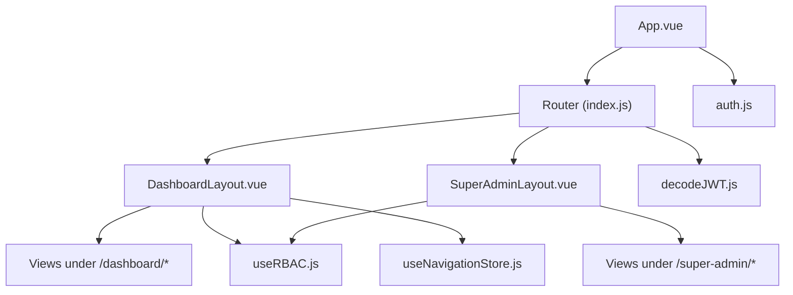
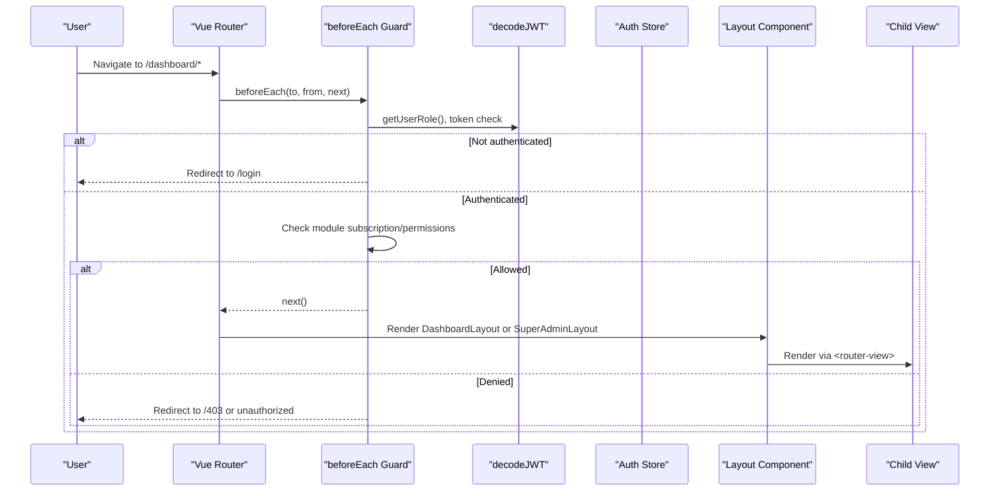
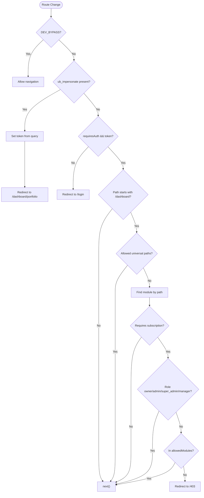
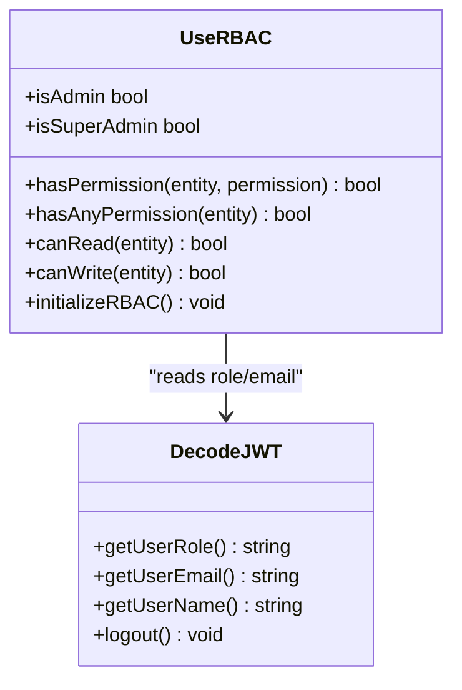
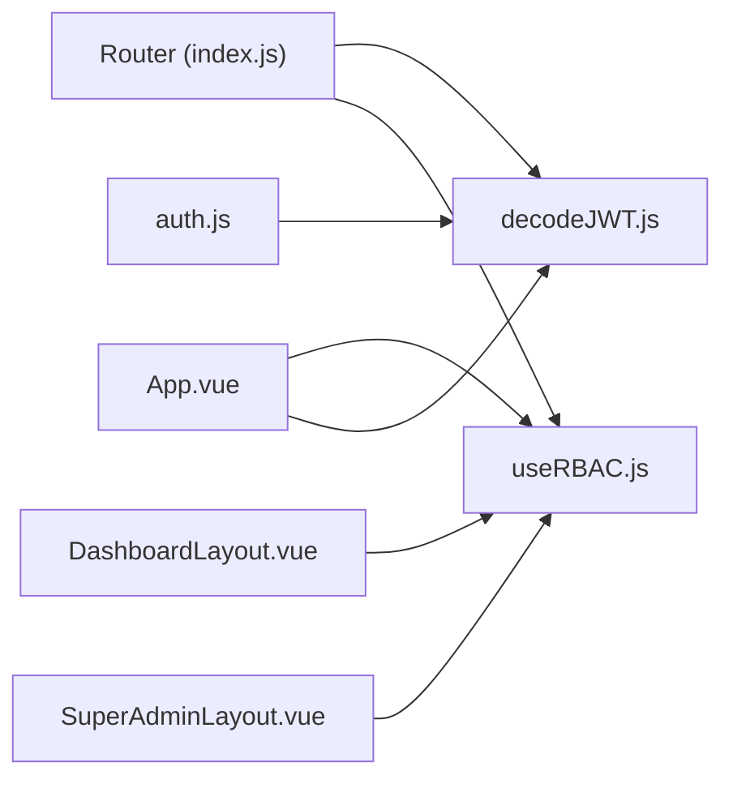

# Layout System & Navigation

<cite>
**Referenced Files in This Document**
- [DashboardLayout.vue](file://src/components/layouts/DashboardLayout.vue)
- [SuperAdminLayout.vue](file://src/components/layouts/SuperAdminLayout.vue)
- [index.js](file://src/router/index.js)
- [useRBAC.js](file://src/composables/useRBAC.js)
- [decodeJWT.js](file://src/services/decodeJWT.js)
- [auth.js](file://src/stores/auth.js)
- [App.vue](file://src/App.vue)
- [useNavigationStore.js](file://src/stores/useNavigationStore.js)
</cite>

## Table of Contents
1. [Introduction](#introduction)
2. [Project Structure](#project-structure)
3. [Core Components](#core-components)
4. [Architecture Overview](#architecture-overview)
5. [Detailed Component Analysis](#detailed-component-analysis)
6. [Dependency Analysis](#dependency-analysis)
7. [Performance Considerations](#performance-considerations)
8. [Troubleshooting Guide](#troubleshooting-guide)
9. [Conclusion](#conclusion)

## Introduction
This document explains the layout system and navigation architecture in ABSA Foundry Frontend. It covers:
- Dual-layout approach using DashboardLayout for standard authenticated users and SuperAdminLayout for administrative functions
- Routing integration with Vue Router, including route guards, nested routes, and dynamic parameters
- How authentication state affects layout rendering and access control
- Responsive design patterns used across layouts (mobile-first, adaptive menus)
- Programmatic navigation, route transitions, and breadcrumb generation
- Integration with role-based access control (RBAC) to conditionally render elements and restrict route access

## Project Structure
The layout and navigation are implemented across a small set of focused files:
- Layouts: DashboardLayout.vue (standard user shell), SuperAdminLayout.vue (admin shell)
- Router: index.js (route definitions, global guards, nested routes)
- Auth utilities: decodeJWT.js (JWT decoding, logout), auth store (auth state)
- RBAC: useRBAC.js (role and permission checks, UI preferences)
- App bootstrap: App.vue (initialization, redirects)
- Breadcrumb store: useNavigationStore.js (breadcrumbs state)

**Diagram sources**
- [App.vue:146-168](file://src/App.vue#L146-L168)
- [index.js:104-194](file://src/router/index.js#L104-L194)
- [DashboardLayout.vue:100-113](file://src/components/layouts/DashboardLayout.vue#L100-L113)
- [SuperAdminLayout.vue:1-67](file://src/components/layouts/SuperAdminLayout.vue#L1-L67)
- [useRBAC.js:55-130](file://src/composables/useRBAC.js#L55-L130)
- [decodeJWT.js:11-96](file://src/services/decodeJWT.js#L11-L96)
- [auth.js:3-21](file://src/stores/auth.js#L3-L21)
- [useNavigationStore.js:4-21](file://src/stores/useNavigationStore.js#L4-L21)

**Section sources**
- [DashboardLayout.vue:1-97](file://src/components/layouts/DashboardLayout.vue#L1-L97)
- [SuperAdminLayout.vue:1-67](file://src/components/layouts/SuperAdminLayout.vue#L1-L67)
- [index.js:1-275](file://src/router/index.js#L1-L275)
- [useRBAC.js:1-130](file://src/composables/useRBAC.js#L1-L130)
- [decodeJWT.js:1-96](file://src/services/decodeJWT.js#L1-L96)
- [auth.js:1-22](file://src/stores/auth.js#L1-L22)
- [App.vue:146-168](file://src/App.vue#L146-L168)
- [useNavigationStore.js:1-23](file://src/stores/useNavigationStore.js#L1-L23)

## Core Components
- DashboardLayout.vue: Shell for authenticated users under /dashboard/*; includes top header, dropdown navigation, search area, user info, and <router-view> for child pages.
- SuperAdminLayout.vue: Admin shell for /super-admin/*; includes sidebar navigation, top bar, and <router-view>.
- Router (index.js): Defines all routes, nested children, and a global beforeEach guard that enforces authentication and subscription/module access.
- useRBAC.js: Provides hasPermission, isAdmin, isSuperAdmin, and initialization to load roles and permissions from JWT and API.
- decodeJWT.js: Decodes JWT, exposes user role/email/name, handles token expiry and logout.
- auth.js: Pinia store exposing isAuthenticated and logout actions.
- App.vue: Bootstraps app, initializes preferences and RBAC, and redirects authenticated users away from login/landing.
- useNavigationStore.js: Holds breadcrumbs and current module context for UI features.

**Section sources**
- [DashboardLayout.vue:100-233](file://src/components/layouts/DashboardLayout.vue#L100-L233)
- [SuperAdminLayout.vue:65-67](file://src/components/layouts/SuperAdminLayout.vue#L65-L67)
- [index.js:201-272](file://src/router/index.js#L201-L272)
- [useRBAC.js:55-130](file://src/composables/useRBAC.js#L55-L130)
- [decodeJWT.js:11-96](file://src/services/decodeJWT.js#L11-L96)
- [auth.js:3-21](file://src/stores/auth.js#L3-L21)
- [App.vue:146-168](file://src/App.vue#L146-L168)
- [useNavigationStore.js:4-21](file://src/stores/useNavigationStore.js#L4-L21)

## Architecture Overview
The application uses a single router with nested routes. Layout components wrap groups of views via parent routes. A global route guard ensures only authenticated users can access protected routes and enforces module-level access rules. RBAC composable provides fine-grained permission checks used by components to conditionally render UI or gate actions.

**Diagram sources**
- [index.js:201-272](file://src/router/index.js#L201-L272)
- [decodeJWT.js:11-96](file://src/services/decodeJWT.js#L11-L96)
- [DashboardLayout.vue:100-113](file://src/components/layouts/DashboardLayout.vue#L100-L113)
- [SuperAdminLayout.vue:1-67](file://src/components/layouts/SuperAdminLayout.vue#L1-L67)

## Detailed Component Analysis

### Dual-Layout Approach: DashboardLayout vs SuperAdminLayout
- DashboardLayout renders for authenticated users navigating under /dashboard/* and related paths (/portfolio, /customer/:id). It shows a top header with a dropdown menu, user info, and a content area via <router-view>.
- SuperAdminLayout renders for admin routes under /super-admin/*. It provides a persistent sidebar with admin sections and a top bar.

When each layout is rendered:
- The router defines parent routes that mount these layouts. For example, /dashboard mounts DashboardLayout and /super-admin would mount SuperAdminLayout (if defined). Child routes then render their respective views inside the layout’s <router-view>.
- Role-based decisions within components (e.g., isSuperAdmin, isAdmin) can influence which links or features are visible, but the primary layout selection is driven by route matching.

Responsive behavior:
- DashboardLayout uses Tailwind classes to adapt between mobile and desktop: a compact header with a dropdown menu on small screens and expanded navigation/search on larger screens.
- SuperAdminLayout hides its sidebar on small screens via media queries and adjusts padding/content width accordingly.

Programmatic navigation and transitions:
- Both layouts rely on Vue Router for navigation. Links are typically declarative (<router-link>) for accessibility and SEO. Programmatic navigation can be performed via the router instance where needed.
- Transitions can be applied at the app level using Vue Router’s built-in transition support if configured globally; currently, no explicit page transitions are defined in the provided files.

Breadcrumb generation:
- A navigation store exists to hold breadcrumbs and current module context. Individual views can update breadcrumbs when needed. In the provided code, breadcrumbs are not automatically generated from routes; they must be set programmatically by views or composables.

**Section sources**
- [DashboardLayout.vue:1-97](file://src/components/layouts/DashboardLayout.vue#L1-L97)
- [DashboardLayout.vue:235-299](file://src/components/layouts/DashboardLayout.vue#L235-L299)
- [SuperAdminLayout.vue:1-67](file://src/components/layouts/SuperAdminLayout.vue#L1-L67)
- [SuperAdminLayout.vue:69-155](file://src/components/layouts/SuperAdminLayout.vue#L69-L155)
- [useNavigationStore.js:4-21](file://src/stores/useNavigationStore.js#L4-L21)

### Routing Integration: Guards, Nested Routes, Dynamic Parameters
- Nested routes: Parent routes mount layouts; child routes define specific pages. Examples include /dashboard/* with many sub-routes like portfolio, branch-manager, models, etl-run-history, crm/*, strategic-management/*, etc.
- Dynamic parameters: Customer detail and action plan routes use :id parameters (e.g., /dashboard/customer/:id, /dashboard/customer/:id/action-plan).
- Route guards: A global beforeEach guard enforces:
  - Authentication: If a route requires auth and there is no token, redirect to /login.
  - Subscription/module access: For /dashboard routes (except certain allowed ones), it identifies the target module and checks local storage for allowed modules or role-based allowances. Non-admin/non-manager roles without an allowed module are redirected to /403.
  - Impersonation flow: A query parameter ub_impersonate sets a token into localStorage and redirects to dashboard/portfolio.

**Diagram sources**
- [index.js:201-272](file://src/router/index.js#L201-L272)

**Section sources**
- [index.js:104-194](file://src/router/index.js#L104-L194)
- [index.js:201-272](file://src/router/index.js#L201-L272)

### Authentication State and Layout Rendering
- decodeJWT.js reads the token from localStorage, decodes it, validates expiration, and exposes user role/email/name. On expiry or decode error, it triggers logout and navigates to /login.
- App.vue initializes preferences and RBAC on mount and redirects authenticated users away from public pages like /login.
- The auth store maintains token and role state and provides a logout action that clears persisted data.

How this affects layout rendering:
- The router guard prevents unauthenticated access to protected routes, ensuring only authenticated users see DashboardLayout or SuperAdminLayout.
- Within layouts, user info is derived from decoded JWT, and conditional rendering can be based on roles obtained via useRBAC.

**Section sources**
- [decodeJWT.js:11-96](file://src/services/decodeJWT.js#L11-L96)
- [App.vue:146-168](file://src/App.vue#L146-L168)
- [auth.js:3-21](file://src/stores/auth.js#L3-L21)
- [index.js:201-272](file://src/router/index.js#L201-L272)

### Responsive Design Patterns
- Mobile-first navigation: DashboardLayout uses a hamburger-style dropdown menu on small screens and expands to show more options on larger screens. Search and notifications are hidden on mobile to save space.
- Adaptive sidebar: SuperAdminLayout hides the sidebar on small screens and adjusts content padding for better readability.
- Tailwind utility classes handle responsive breakpoints and spacing consistently across both layouts.

**Section sources**
- [DashboardLayout.vue:10-97](file://src/components/layouts/DashboardLayout.vue#L10-L97)
- [SuperAdminLayout.vue:69-155](file://src/components/layouts/SuperAdminLayout.vue#L69-L155)

### Programmatic Navigation, Route Transitions, and Breadcrumbs
- Programmatic navigation: Use the router instance to navigate imperatively (e.g., router.push('/dashboard/portfolio')). The app already performs programmatic redirects in the guard and during impersonation flows.
- Route transitions: No explicit page transitions are configured in the provided files. You can add global transitions around <router-view> in App.vue if desired.
- Breadcrumbs: The navigation store holds breadcrumbs and current module. Views can call setBreadcrumbs to update the UI. Currently, breadcrumbs are not auto-generated from route meta; implement per-view logic to push breadcrumb entries when entering complex nested routes.

**Section sources**
- [index.js:201-272](file://src/router/index.js#L201-L272)
- [useNavigationStore.js:4-21](file://src/stores/useNavigationStore.js#L4-L21)

### Role-Based Access Control (RBAC) Integration
- useRBAC provides:
  - hasPermission(entity, permission) to check granular permissions
  - isAdmin and isSuperAdmin computed properties for quick role checks
  - initializeRBAC to load roles and permissions from JWT and API, apply UI preferences, and sync healthcare-related permissions
- Layouts and views can use these helpers to conditionally render elements (e.g., settings link visibility) and to gate actions.
- The router guard also leverages role information to allow or deny access to certain modules based on subscriptions and stored allowed modules.

**Diagram sources**
- [useRBAC.js:55-130](file://src/composables/useRBAC.js#L55-L130)
- [decodeJWT.js:11-96](file://src/services/decodeJWT.js#L11-L96)

**Section sources**
- [useRBAC.js:55-130](file://src/composables/useRBAC.js#L55-L130)
- [DashboardLayout.vue:167-233](file://src/components/layouts/DashboardLayout.vue#L167-L233)
- [index.js:201-272](file://src/router/index.js#L201-L272)

## Dependency Analysis
Key dependencies and relationships:
- Router depends on decodeJWT for role extraction and on module configuration for subscription checks.
- Layouts depend on useRBAC for permission checks and on decodeJWT for user info.
- App initializes RBAC and preferences early to ensure consistent UI and access control.
- Auth store provides a centralized place for token and role state, though much of the runtime auth logic relies on localStorage and JWT decoding.

**Diagram sources**
- [index.js:201-272](file://src/router/index.js#L201-L272)
- [DashboardLayout.vue:100-233](file://src/components/layouts/DashboardLayout.vue#L100-L233)
- [SuperAdminLayout.vue:1-67](file://src/components/layouts/SuperAdminLayout.vue#L1-L67)
- [App.vue:146-168](file://src/App.vue#L146-L168)
- [decodeJWT.js:11-96](file://src/services/decodeJWT.js#L11-L96)
- [auth.js:3-21](file://src/stores/auth.js#L3-L21)

**Section sources**
- [index.js:201-272](file://src/router/index.js#L201-L272)
- [DashboardLayout.vue:100-233](file://src/components/layouts/DashboardLayout.vue#L100-L233)
- [SuperAdminLayout.vue:1-67](file://src/components/layouts/SuperAdminLayout.vue#L1-L67)
- [App.vue:146-168](file://src/App.vue#L146-L168)
- [decodeJWT.js:11-96](file://src/services/decodeJWT.js#L11-L96)
- [auth.js:3-21](file://src/stores/auth.js#L3-L21)

## Performance Considerations
- Lazy loading: Many routes and components are dynamically imported to reduce initial bundle size and improve load times.
- Minimal re-renders: Layouts compute page title and user info via computed properties to avoid unnecessary recalculations.
- Efficient permission checks: useRBAC caches roles and permissions after initial fetch and provides fast boolean checks for UI gating.
- Network calls: Module subscription fetching is aborted after a timeout to prevent long waits; consider caching results to reduce repeated requests.

[No sources needed since this section provides general guidance]

## Troubleshooting Guide
Common issues and resolutions:
- Token expired or invalid: decodeJWT detects expired tokens and triggers logout; ensure backend logout endpoint is reachable and local storage is cleared.
- Unauthorized access to modules: The router guard may redirect to /403 if a non-admin/non-manager role lacks module access in allowedModules; verify subscription details and role permissions.
- Missing breadcrumbs: Since breadcrumbs are not auto-generated, ensure views call setBreadcrumbs appropriately when navigating deep hierarchies.
- Layout mismatch: Confirm that routes correctly mount the intended layout and that role-based visibility does not hide critical navigation items unexpectedly.

**Section sources**
- [decodeJWT.js:11-96](file://src/services/decodeJWT.js#L11-L96)
- [index.js:201-272](file://src/router/index.js#L201-L272)
- [useNavigationStore.js:4-21](file://src/stores/useNavigationStore.js#L4-L21)

## Conclusion
ABSA Foundry Frontend employs a clear dual-layout strategy with robust routing and RBAC integration. DashboardLayout serves standard users with a responsive, mobile-friendly interface, while SuperAdminLayout provides a dedicated admin experience. Vue Router’s nested routes and global guards enforce authentication and module access, and useRBAC enables fine-grained permission checks throughout the app. Breadcrumbs and programmatic navigation are supported via stores and router APIs, allowing flexible UX enhancements. The architecture balances performance through lazy loading and efficient state management while maintaining security and usability.

[No sources needed since this section summarizes without analyzing specific files]