# Routing & Navigation

<cite>
**Referenced Files in This Document**
- [router/index.js](file://src/router/index.js)
- [auth/login.vue](file://src/views/auth/login.vue)
- [layouts/DashboardLayout.vue](file://src/components/layouts/DashboardLayout.vue)
- [decodeJWT.js](file://src/services/decodeJWT.js)
- [useRBAC.js](file://src/composables/useRBAC.js)
- [rbac.js](file://src/config/rbac.js)
- [moduleCards.js](file://src/config/moduleCards.js)
- [devFlags.js](file://src/config/devFlags.js)
- [403.vue](file://src/views/403.vue)
- [useNavigationStore.js](file://src/stores/useNavigationStore.js)
- [PageHeader.vue](file://src/components/ui/PageHeader.vue)
</cite>

## Table of Contents
1. Introduction
2. Project Structure
3. Core Components
4. Architecture Overview
5. Detailed Component Analysis
6. Dependency Analysis
7. Performance Considerations
8. Troubleshooting Guide
9. Conclusion
10. Appendices

## Introduction
This document explains the routing and navigation system for the ABSA Foundry Frontend, built with Vue Router 4. It covers route definitions, nested routes per module, dynamic access control based on roles and permissions, authentication and authorization guards, lazy loading strategies, breadcrumb patterns, programmatic navigation, parameter handling, error pages, redirect strategies, session timeout handling, and testing guidance for guards and navigation logic.

## Project Structure
The routing layer is centralized in a single router configuration that defines public routes (login, reset password), protected dashboard routes (with nested children per module), and error routes. Authentication and authorization are enforced via a global beforeEach guard using JWT decoding and role-based checks. Layouts wrap authenticated sections, while modules are loaded lazily to optimize performance.

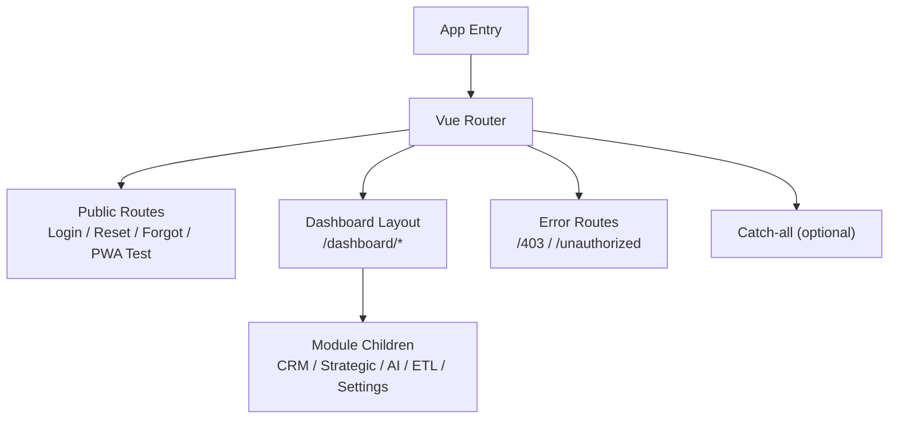

**Diagram sources**
- [router/index.js:34-194](file://src/router/index.js#L34-L194)
- [layouts/DashboardLayout.vue:1-96](file://src/components/layouts/DashboardLayout.vue#L1-L96)

**Section sources**
- [router/index.js:1-275](file://src/router/index.js#L1-L275)

## Core Components
- Router configuration and guards: centralizes route definitions and navigation guards.
- Authentication store and JWT utilities: manage token lifecycle and decode user context.
- RBAC composable and config: define roles, permissions, and permission-checking helpers.
- Module cards and available modules: drive subscription and visibility rules.
- Layouts: provide consistent chrome for authenticated areas.
- Error pages: handle unauthorized access scenarios.
- Navigation store and UI header: support breadcrumbs and back navigation.

**Section sources**
- [router/index.js:1-275](file://src/router/index.js#L1-L275)
- [auth/login.vue:133-264](file://src/views/auth/login.vue#L133-L264)
- [decodeJWT.js:11-96](file://src/services/decodeJWT.js#L11-L96)
- [useRBAC.js:55-137](file://src/composables/useRBAC.js#L55-L137)
- [rbac.js:85-337](file://src/config/rbac.js#L85-L337)
- [moduleCards.js:13-51](file://src/config/moduleCards.js#L13-L51)
- [layouts/DashboardLayout.vue:99-233](file://src/components/layouts/DashboardLayout.vue#L99-L233)
- [403.vue:1-14](file://src/views/403.vue#L1-L14)
- [useNavigationStore.js:1-22](file://src/stores/useNavigationStore.js#L1-L22)
- [PageHeader.vue:1-70](file://src/components/ui/PageHeader.vue#L1-L70)

## Architecture Overview
The application uses a single-page architecture with Vue Router’s history mode. Public routes are accessible without authentication. Protected routes under /dashboard require a valid token and may enforce subscription or role-based access. The global beforeEach guard orchestrates authentication, impersonation flow, and module-level authorization.

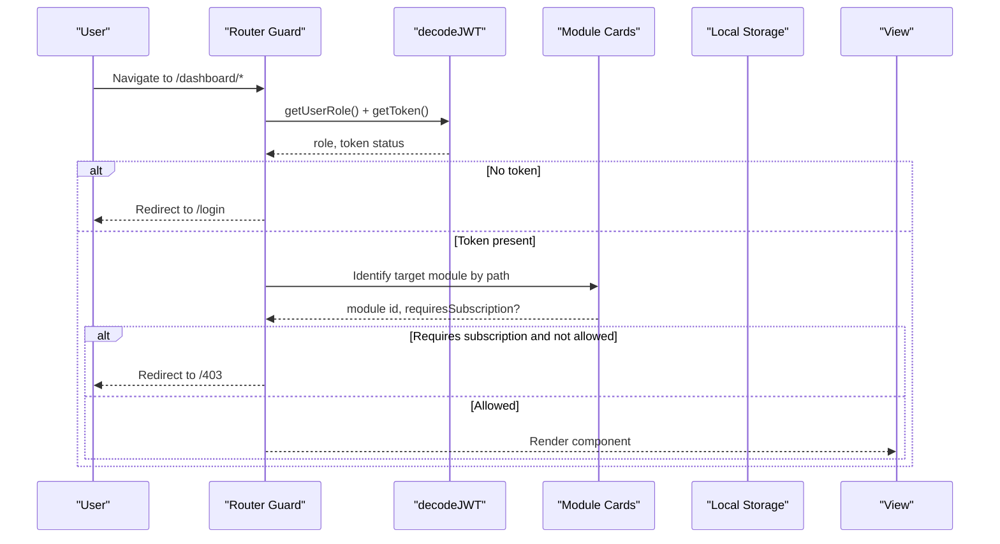

**Diagram sources**
- [router/index.js:201-272](file://src/router/index.js#L201-L272)
- [decodeJWT.js:11-62](file://src/services/decodeJWT.js#L11-L62)
- [moduleCards.js:13-51](file://src/config/moduleCards.js#L13-L51)

## Detailed Component Analysis

### Router Configuration and Guards
- Route definitions include:
  - Public routes: root initialization screen, landing, PWA test, forgot/reset password, login, logout.
  - Dashboard layout with nested children for portfolio, customer details, branch manager, models, ETL pipeline/history/config, intelligence modules, AI assistant, settings, subaccounts, profile, CRM suite, and strategic management subpages.
  - Error routes: 403 and unauthorized.
- Global beforeEach guard:
  - Development bypass allows skipping auth checks when enabled.
  - Impersonation token from query param is stored and redirects to dashboard/portfolio after cleaning the URL.
  - Authentication check: if a route requires auth and no token exists, redirect to /login.
  - Subscription enforcement for non-dashboard/portfolio paths: identifies module by path prefix, checks subscription requirement, and enforces allowed modules list for non-admin roles; otherwise redirects to /403.

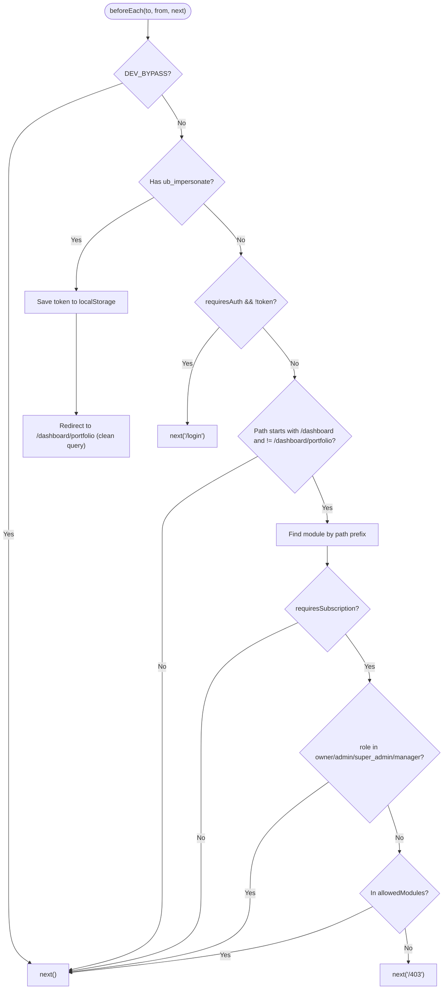

**Diagram sources**
- [router/index.js:201-272](file://src/router/index.js#L201-L272)

**Section sources**
- [router/index.js:34-194](file://src/router/index.js#L34-L194)
- [router/index.js:201-272](file://src/router/index.js#L201-L272)

### Authentication Flow and Session Handling
- Login page validates inputs, calls the API, stores tokens and user metadata in localStorage, and navigates to either an intended route or default dashboard.
- JWT decoding utility:
  - Validates token expiry and triggers logout if expired.
  - Provides getters for role, email, name, user ID, and branch info.
  - Implements logout by calling backend endpoint and clearing local storage, then navigating to login.
- Dashboard layout logout:
  - Calls backend logout, clears local storage keys, and redirects to login.

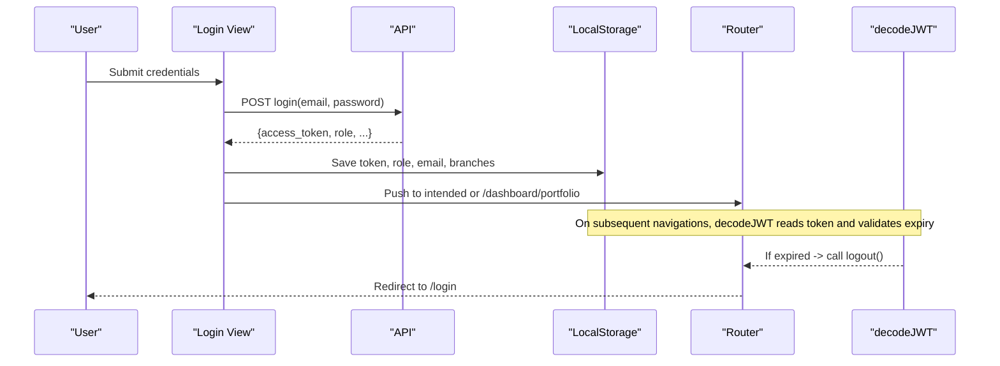

**Diagram sources**
- [auth/login.vue:180-240](file://src/views/auth/login.vue#L180-L240)
- [decodeJWT.js:11-96](file://src/services/decodeJWT.js#L11-L96)
- [layouts/DashboardLayout.vue:117-136](file://src/components/layouts/DashboardLayout.vue#L117-L136)

**Section sources**
- [auth/login.vue:133-264](file://src/views/auth/login.vue#L133-L264)
- [decodeJWT.js:11-96](file://src/services/decodeJWT.js#L11-L96)
- [layouts/DashboardLayout.vue:117-136](file://src/components/layouts/DashboardLayout.vue#L117-L136)

### Authorization and Role-Based Access Control
- RBAC composable exposes permission checks (read/write/edit/delete/assign/approve/export) and admin/super-admin flags.
- Default roles and permissions are defined centrally; custom roles can be merged at runtime.
- Dashboard layout computes visible modules based on subscriptions and permissions, filtering out admin-only pages and primary nav items.

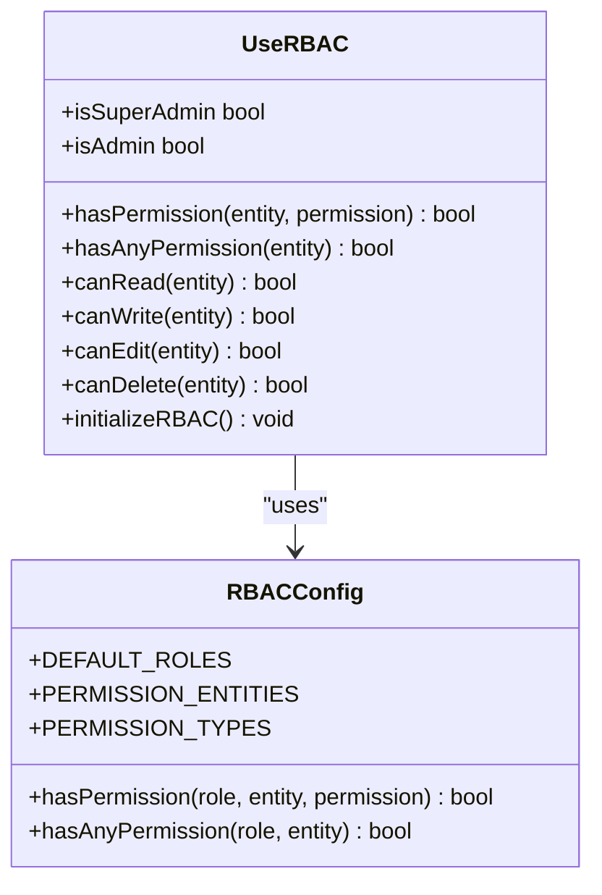

**Diagram sources**
- [useRBAC.js:55-137](file://src/composables/useRBAC.js#L55-L137)
- [rbac.js:85-337](file://src/config/rbac.js#L85-L337)

**Section sources**
- [useRBAC.js:55-137](file://src/composables/useRBAC.js#L55-L137)
- [rbac.js:85-337](file://src/config/rbac.js#L85-L337)
- [layouts/DashboardLayout.vue:167-233](file://src/components/layouts/DashboardLayout.vue#L167-L233)

### Nested Routes and Module Organization
- Dashboard layout wraps all /dashboard/* child routes, providing a consistent header and content area.
- Child routes include:
  - Portfolio overview, customer detail/action plan/take action flows.
  - Branch manager dashboard.
  - Models monitoring and ETL pipeline/history/config.
  - Intelligence modules: customer value, balance forecast, business outcomes, lifecycle prediction.
  - AI assistant, settings, subaccounts, profile.
  - CRM suite: leads, pipeline, contacts, accounts, deals, documents, meetings, emails, calls, visits, whatsapp, acquisition.
  - Strategic management subpages: overview, notes, governance, actions, goals, predictions, analysis, funding, environmental, internal analysis, positioning, brand.

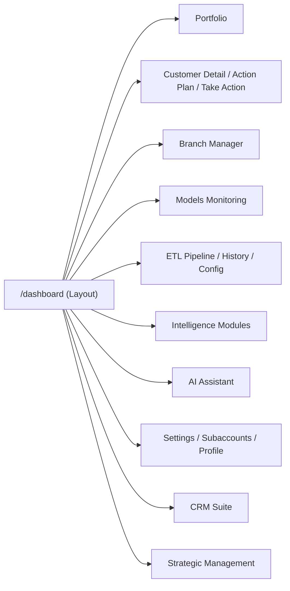

**Diagram sources**
- [router/index.js:105-167](file://src/router/index.js#L105-L167)
- [layouts/DashboardLayout.vue:1-96](file://src/components/layouts/DashboardLayout.vue#L1-L96)

**Section sources**
- [router/index.js:105-167](file://src/router/index.js#L105-L167)

### Dynamic Routing Based on Roles and Permissions
- The guard identifies the target module by matching path prefixes against module cards and enforces subscription requirements.
- For non-admin roles, it consults an allowed modules list stored locally; missing entries result in a 403 redirect.
- Dashboard layout further filters visible modules based on subscriptions and permissions, ensuring users only see what they can access.

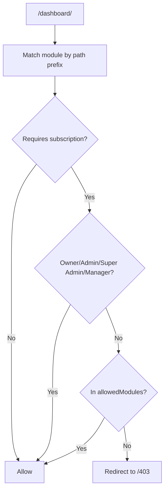

**Diagram sources**
- [router/index.js:227-265](file://src/router/index.js#L227-L265)
- [moduleCards.js:13-51](file://src/config/moduleCards.js#L13-L51)

**Section sources**
- [router/index.js:227-265](file://src/router/index.js#L227-L265)
- [layouts/DashboardLayout.vue:167-233](file://src/components/layouts/DashboardLayout.vue#L167-L233)

### Lazy Loading Strategies and Code Splitting
- Most components are imported lazily using dynamic imports within route definitions to reduce initial bundle size and improve load performance.
- Examples include views for login, reset password, dashboard children, and various module pages.

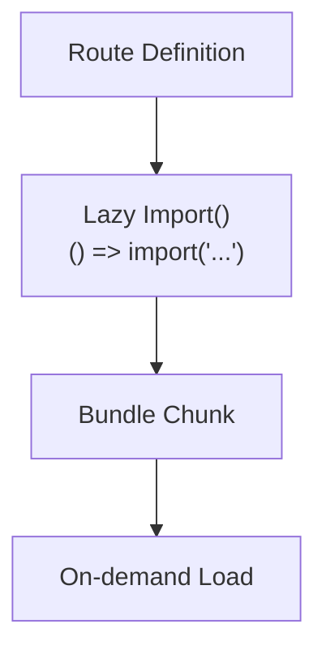

**Diagram sources**
- [router/index.js:7-7](file://src/router/index.js#L7-L7)
- [router/index.js:39-39](file://src/router/index.js#L39-L39)
- [router/index.js:60-60](file://src/router/index.js#L60-L60)
- [router/index.js:71-71](file://src/router/index.js#L71-L71)
- [router/index.js:99-99](file://src/router/index.js#L99-L99)
- [router/index.js:107-167](file://src/router/index.js#L107-L167)

**Section sources**
- [router/index.js:7-7](file://src/router/index.js#L7-L7)
- [router/index.js:39-39](file://src/router/index.js#L39-L39)
- [router/index.js:60-60](file://src/router/index.js#L60-L60)
- [router/index.js:71-71](file://src/router/index.js#L71-L71)
- [router/index.js:99-99](file://src/router/index.js#L99-L99)
- [router/index.js:107-167](file://src/router/index.js#L107-L167)

### Breadcrumb Navigation Patterns
- A dedicated navigation store maintains current module and breadcrumbs state.
- Page header component supports back navigation and displays parent/current view labels, enabling breadcrumb-like UX.

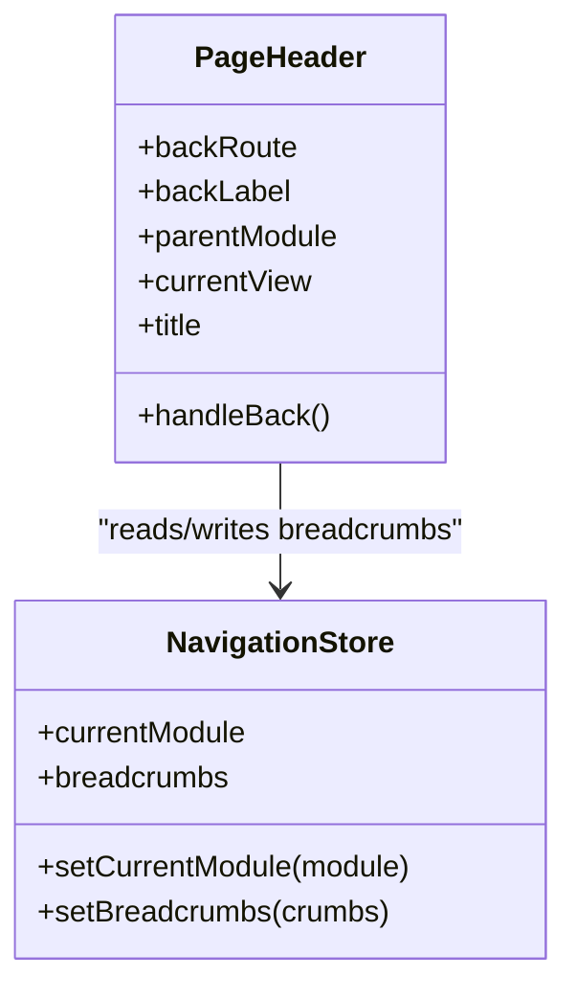

**Diagram sources**
- [useNavigationStore.js:1-22](file://src/stores/useNavigationStore.js#L1-L22)
- [PageHeader.vue:1-70](file://src/components/ui/PageHeader.vue#L1-L70)

**Section sources**
- [useNavigationStore.js:1-22](file://src/stores/useNavigationStore.js#L1-L22)
- [PageHeader.vue:1-70](file://src/components/ui/PageHeader.vue#L1-L70)

### Programmatic Navigation Methods and Route Parameters
- Navigation is performed via Vue Router’s push and replace methods.
- Login flow pushes to an intended route stored in local storage or defaults to dashboard/portfolio.
- Impersonation flow cleans query parameters and replaces the URL while navigating to dashboard/portfolio.
- Route parameters are used for customer-related routes (e.g., /customer/:id, /customer/:id/action-plan, /customer/:id/take-action).

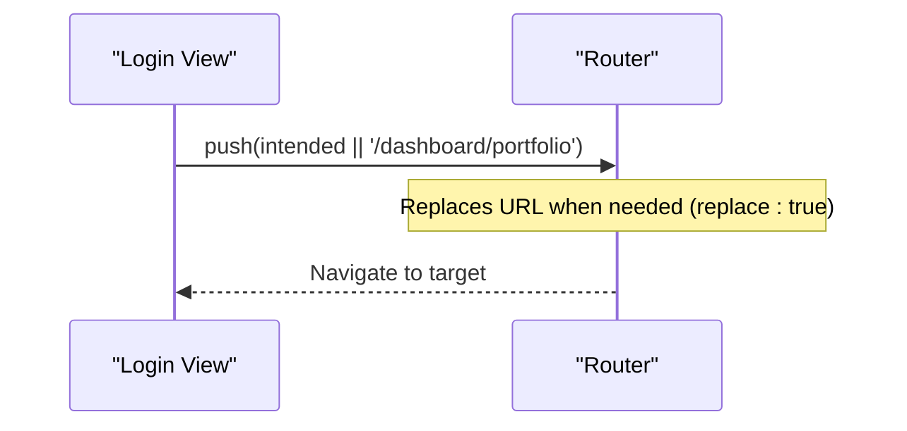

**Diagram sources**
- [auth/login.vue:232-240](file://src/views/auth/login.vue#L232-L240)
- [router/index.js:207-216](file://src/router/index.js#L207-L216)
- [router/index.js:113-115](file://src/router/index.js#L113-L115)

**Section sources**
- [auth/login.vue:232-240](file://src/views/auth/login.vue#L232-L240)
- [router/index.js:207-216](file://src/router/index.js#L207-L216)
- [router/index.js:113-115](file://src/router/index.js#L113-L115)

### Error Handling for 404 and 403 Routes
- Unauthorized access results in a dedicated 403 page with a link back to the dashboard.
- An inline unauthorized template is also registered for generic cases.
- The catch-all route is commented out; ensure a proper 404 handler is added if needed.

**Section sources**
- [router/index.js:189-193](file://src/router/index.js#L189-L193)
- [403.vue:1-14](file://src/views/403.vue#L1-L14)

### Redirect Strategies and Navigation History Management
- Redirects occur:
  - From login to intended route or default dashboard.
  - From impersonation URL to dashboard/portfolio with cleaned query.
  - From unauthorized attempts to /403.
- History management:
  - Replace is used to avoid stacking URLs during impersonation.
  - Logout clears local storage and navigates to login.

**Section sources**
- [auth/login.vue:232-240](file://src/views/auth/login.vue#L232-L240)
- [router/index.js:207-216](file://src/router/index.js#L207-L216)
- [layouts/DashboardLayout.vue:117-136](file://src/components/layouts/DashboardLayout.vue#L117-L136)

### Integration with Authentication Flows and Session Timeout Handling
- JWT decoding validates token expiration and triggers logout automatically when expired.
- Backend logout endpoints are called before clearing local storage to revoke sessions server-side.
- Development mode can bypass auth checks for easier testing.

**Section sources**
- [decodeJWT.js:11-96](file://src/services/decodeJWT.js#L11-L96)
- [layouts/DashboardLayout.vue:117-136](file://src/components/layouts/DashboardLayout.vue#L117-L136)
- [devFlags.js:1-28](file://src/config/devFlags.js#L1-L28)

### Testing Strategies for Route Guards and Navigation Logic
- Unit tests for navigation components verify programmatic navigation behavior (push/back) and accessibility attributes.
- Recommended approaches:
  - Mock Vue Router instance to assert navigation calls.
  - Stub localStorage and decodeJWT to simulate authenticated/unauthenticated states.
  - Assert guard behavior for required auth and subscription checks.
  - Validate redirects to /login, /403, and dashboard routes under different conditions.

**Section sources**
- [components/__tests__/BackButton.spec.js:46-82](file://src/components/__tests__/BackButton.spec.js#L46-L82)

## Dependency Analysis
The routing system depends on several core services and configurations:

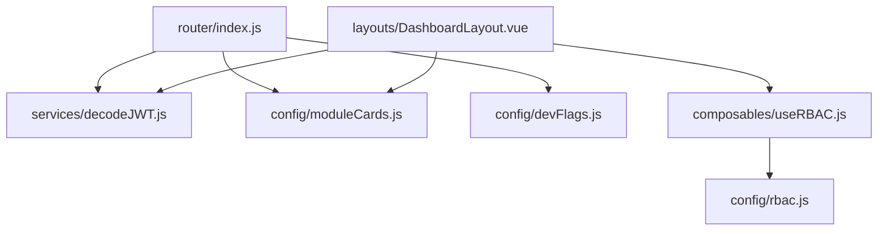

**Diagram sources**
- [router/index.js:1-5](file://src/router/index.js#L1-L5)
- [layouts/DashboardLayout.vue:99-109](file://src/components/layouts/DashboardLayout.vue#L99-L109)
- [useRBAC.js:55-137](file://src/composables/useRBAC.js#L55-L137)
- [rbac.js:85-337](file://src/config/rbac.js#L85-L337)

**Section sources**
- [router/index.js:1-5](file://src/router/index.js#L1-L5)
- [layouts/DashboardLayout.vue:99-109](file://src/components/layouts/DashboardLayout.vue#L99-L109)
- [useRBAC.js:55-137](file://src/composables/useRBAC.js#L55-L137)
- [rbac.js:85-337](file://src/config/rbac.js#L85-L337)

## Performance Considerations
- Lazy loading reduces initial bundle size by splitting code into chunks loaded on demand.
- Avoid heavy computations in beforeEach; keep guards lightweight and rely on cached data where possible.
- Use replace navigation judiciously to prevent unnecessary history entries.
- Ensure module card lists and subscription checks are efficient; consider memoization if needed.

[No sources needed since this section provides general guidance]

## Troubleshooting Guide
- Token expired: decodeJWT logs a warning and triggers logout; verify backend token validity and refresh strategy.
- Unauthorized access: guard redirects to /403; confirm module subscription and allowed modules list.
- Impersonation issues: ensure ub_impersonate query param is handled and cleared; verify redirect to dashboard/portfolio.
- Navigation failures: check router.push arguments and ensure routes exist; validate meta.requiresAuth usage.

**Section sources**
- [decodeJWT.js:24-38](file://src/services/decodeJWT.js#L24-L38)
- [router/index.js:227-265](file://src/router/index.js#L227-L265)
- [router/index.js:207-216](file://src/router/index.js#L207-L216)

## Conclusion
The ABSA Foundry Frontend implements a robust routing and navigation system with clear separation between public and protected routes, comprehensive authentication and authorization guards, and modular organization through nested routes. Lazy loading optimizes performance, while RBAC ensures fine-grained access control. Breadcrumb patterns and programmatic navigation enhance user experience, and error handling provides clear feedback for unauthorized access.

[No sources needed since this section summarizes without analyzing specific files]

## Appendices

### Route Definitions Summary
- Public routes: root initialization, landing, PWA test, forgot/reset password, login, logout.
- Dashboard layout with nested children for portfolio, customer flows, branch manager, models, ETL, intelligence modules, AI, settings, subaccounts, profile, CRM, and strategic management.
- Error routes: 403 and unauthorized.

**Section sources**
- [router/index.js:34-194](file://src/router/index.js#L34-L194)

### Guard Logic Summary
- Development bypass flag controls auth checks.
- Impersonation token handling and redirect.
- Authentication check for routes requiring auth.
- Subscription enforcement for dashboard modules.

**Section sources**
- [router/index.js:201-272](file://src/router/index.js#L201-L272)
- [devFlags.js:1-28](file://src/config/devFlags.js#L1-L28)