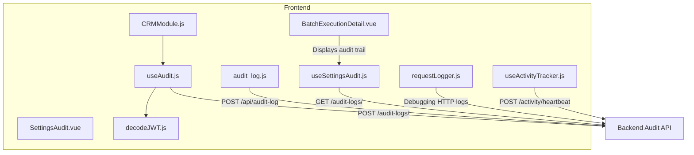
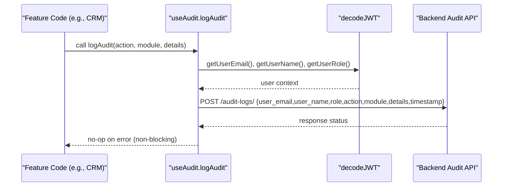
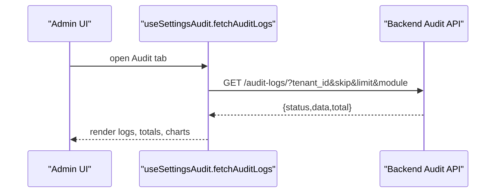
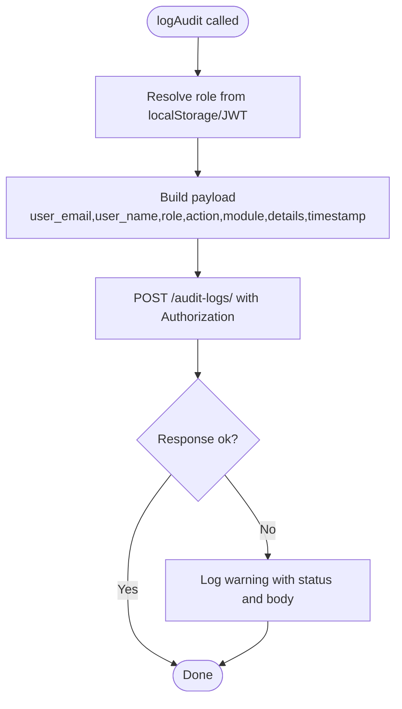
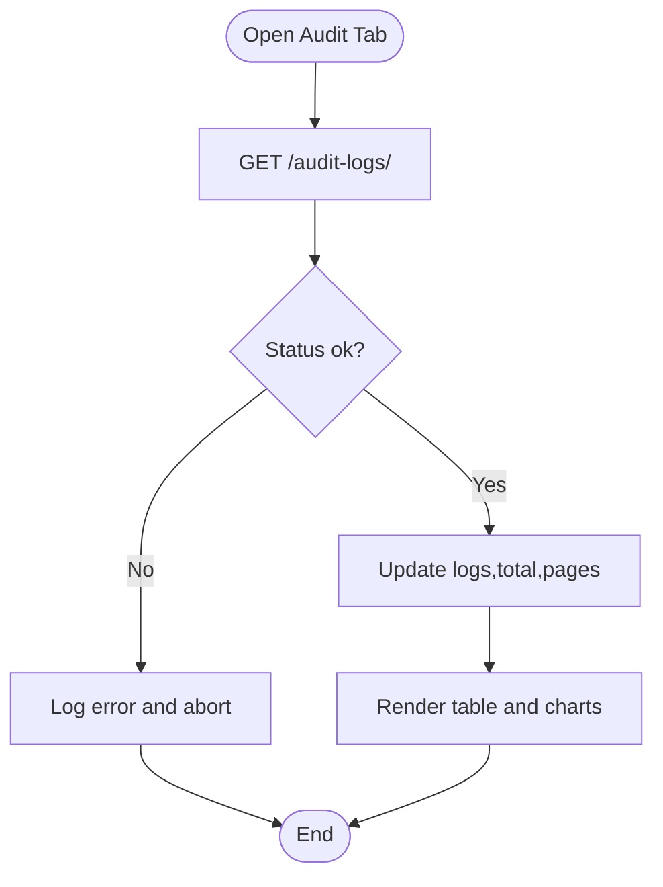
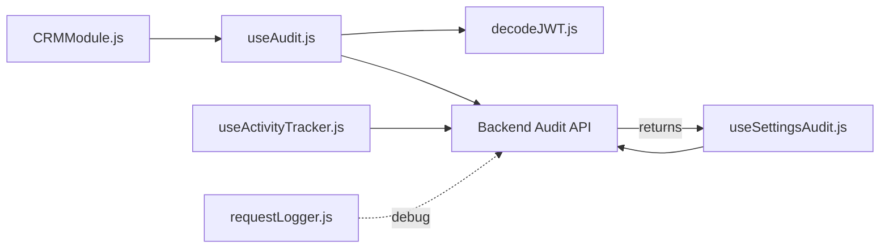

# Audit Logging

<cite>
**Referenced Files in This Document**
- [useAudit.js](file://src/config/useAudit.js)
- [audit_log.js](file://src/services/audit_log.js)
- [useSettingsAudit.js](file://src/composables/settings/useSettingsAudit.js)
- [SettingsAudit.vue](file://src/views/Modules/settings/components/SettingsAudit.vue)
- [decodeJWT.js](file://src/services/decodeJWT.js)
- [CRMModule.js](file://src/views/Modules/crm/composables/CRMModule.js)
- [BatchExecutionDetail.vue](file://src/views/Modules/datapipeline/BatchExecutionDetail.vue)
- [requestLogger.js](file://src/utils/requestLogger.js)
- [useActivityTracker.js](file://src/config/useActivityTracker.js)
</cite>

## Table of Contents
1. Introduction
2. Project Structure
3. Core Components
4. Architecture Overview
5. Detailed Component Analysis
6. Dependency Analysis
7. Performance Considerations
8. Troubleshooting Guide
9. Conclusion
10. Appendices

## Introduction
This document explains the ABSA Foundry Frontend audit logging implementation, covering user action tracking, system event monitoring, and compliance-oriented logging practices. It details how to create custom audit events, integrate with backend audit systems, track sessions, log security-relevant events, structure audit data, manage retention and secure storage, and generate reports. It also addresses privacy considerations, anonymization techniques, and performance optimization for high-volume logging.

## Project Structure
The audit logging capability is implemented across a few focused areas:
- Central composable for emitting audit events to the backend
- A legacy service helper for simple audit posting
- Composable for retrieving and displaying audit logs with filtering and pagination
- UI components for viewing audit trails and settings
- JWT decoding utilities used to enrich audit payloads with user context
- Activity tracking for session heartbeat emissions
- Request logger utility for debugging network calls

**Diagram sources**
- [useAudit.js:19-75](file://src/config/useAudit.js#L19-L75)
- [audit_log.js:4-20](file://src/services/audit_log.js#L4-L20)
- [useSettingsAudit.js:66-84](file://src/composables/settings/useSettingsAudit.js#L66-L84)
- [SettingsAudit.vue:1-53](file://src/views/Modules/settings/components/SettingsAudit.vue#L1-L53)
- [CRMModule.js:17-43](file://src/views/Modules/crm/composables/CRMModule.js#L17-L43)
- [BatchExecutionDetail.vue:432-455](file://src/views/Modules/datapipeline/BatchExecutionDetail.vue#L432-L455)
- [requestLogger.js:3-33](file://src/utils/requestLogger.js#L3-L33)
- [useActivityTracker.js:12-35](file://src/config/useActivityTracker.js#L12-L35)
- [decodeJWT.js:11-62](file://src/services/decodeJWT.js#L11-L62)

**Section sources**
- [useAudit.js:1-75](file://src/config/useAudit.js#L1-L75)
- [audit_log.js:1-20](file://src/services/audit_log.js#L1-L20)
- [useSettingsAudit.js:1-93](file://src/composables/settings/useSettingsAudit.js#L1-L93)
- [SettingsAudit.vue:1-53](file://src/views/Modules/settings/components/SettingsAudit.vue#L1-L53)
- [CRMModule.js:1-43](file://src/views/Modules/crm/composables/CRMModule.js#L1-L43)
- [BatchExecutionDetail.vue:432-455](file://src/views/Modules/datapipeline/BatchExecutionDetail.vue#L432-L455)
- [requestLogger.js:1-34](file://src/utils/requestLogger.js#L1-L34)
- [useActivityTracker.js:1-59](file://src/config/useActivityTracker.js#L1-L59)
- [decodeJWT.js:1-164](file://src/services/decodeJWT.js#L1-L164)

## Core Components
- useAudit composable: Emits structured audit events with user identity and role resolved from JWT or local state; posts to the backend audit endpoint with an Authorization header. Errors are logged but never break calling features.
- Legacy audit_log service: Simple POST to a different endpoint path for quick integration; suitable for minimal scenarios without full JWT enrichment.
- useSettingsAudit composable: Retrieves paginated audit logs with tenant scoping, filters by module, computes flags for sensitive modules, and exposes chart-ready aggregations.
- SettingsAudit view: Placeholder UI for future audit configuration controls.
- BatchExecutionDetail view: Displays an audit trail table for batch runs, showing timestamp, actor, action, and description.
- decodeJWT utility: Provides token, email, name, role, and other claims used to enrich audit payloads.
- requestLogger utility: Debugging aid that logs request/response details (excluding secrets).
- useActivityTracker: Tracks user activity via heartbeats to support session monitoring.

**Section sources**
- [useAudit.js:19-75](file://src/config/useAudit.js#L19-L75)
- [audit_log.js:4-20](file://src/services/audit_log.js#L4-L20)
- [useSettingsAudit.js:1-93](file://src/composables/settings/useSettingsAudit.js#L1-L93)
- [SettingsAudit.vue:1-53](file://src/views/Modules/settings/components/SettingsAudit.vue#L1-L53)
- [BatchExecutionDetail.vue:432-455](file://src/views/Modules/datapipeline/BatchExecutionDetail.vue#L432-L455)
- [decodeJWT.js:11-62](file://src/services/decodeJWT.js#L11-L62)
- [requestLogger.js:3-33](file://src/utils/requestLogger.js#L3-L33)
- [useActivityTracker.js:12-35](file://src/config/useActivityTracker.js#L12-L35)

## Architecture Overview
The frontend emits audit events from feature code into a centralized composable that enriches the payload with user context and sends it to the backend. The same backend endpoint supports both write (POST) and read (GET) operations for auditing. A separate legacy helper exists for simpler integrations.

**Diagram sources**
- [useAudit.js:19-75](file://src/config/useAudit.js#L19-L75)
- [decodeJWT.js:11-62](file://src/services/decodeJWT.js#L11-L62)

**Diagram sources**
- [useSettingsAudit.js:66-84](file://src/composables/settings/useSettingsAudit.js#L66-L84)

## Detailed Component Analysis

### Audit Emitter: useAudit
- Purpose: Centralized emission of audit events with rich user context and robust error handling.
- Key behaviors:
  - Resolves active operator role from local storage or JWT.
  - Builds a payload including user email, name, role, action, module, details, and ISO timestamp.
  - Posts to the backend audit endpoint with Bearer token authorization.
  - Non-blocking: failures are logged but do not disrupt business flows.

**Diagram sources**
- [useAudit.js:19-75](file://src/config/useAudit.js#L19-L75)

**Section sources**
- [useAudit.js:19-75](file://src/config/useAudit.js#L19-L75)
- [decodeJWT.js:11-62](file://src/services/decodeJWT.js#L11-L62)

### Legacy Audit Helper: audit_log
- Purpose: Minimal helper to post audit events to a different endpoint path.
- Characteristics:
  - Sends action, details, timestamp, and user email from local storage.
  - No Authorization header; suitable for internal or proxied endpoints.
  - Errors are caught and logged locally.

**Section sources**
- [audit_log.js:4-20](file://src/services/audit_log.js#L4-L20)

### Audit Viewer: useSettingsAudit
- Purpose: Fetch, paginate, filter, and aggregate audit logs for admin views.
- Capabilities:
  - Paginates using skip/limit parameters.
  - Filters by module.
  - Computes flagged actions for sensitive modules based on thresholds.
  - Exposes computed aggregates for charts and totals.

**Diagram sources**
- [useSettingsAudit.js:66-84](file://src/composables/settings/useSettingsAudit.js#L66-L84)

**Section sources**
- [useSettingsAudit.js:1-93](file://src/composables/settings/useSettingsAudit.js#L1-L93)

### Audit UI: SettingsAudit.vue and BatchExecutionDetail.vue
- SettingsAudit.vue: Placeholder for future audit configuration UI.
- BatchExecutionDetail.vue: Renders an audit trail table per execution with columns for timestamp, actor, action, and description.

**Section sources**
- [SettingsAudit.vue:1-53](file://src/views/Modules/settings/components/SettingsAudit.vue#L1-L53)
- [BatchExecutionDetail.vue:432-455](file://src/views/Modules/datapipeline/BatchExecutionDetail.vue#L432-L455)

### User Context Enrichment: decodeJWT
- Provides token, email, name, role, and identifiers used to enrich audit payloads and authorize requests.
- Ensures token validity and handles logout flow.

**Section sources**
- [decodeJWT.js:11-62](file://src/services/decodeJWT.js#L11-L62)

### Integration Example: CRM Module
- Demonstrates importing and using the audit composable within a feature module to record user actions.

**Section sources**
- [CRMModule.js:17-43](file://src/views/Modules/crm/composables/CRMModule.js#L17-L43)

## Dependency Analysis
- useAudit depends on decodeJWT for user context and uses API_BASE_URL for endpoint resolution.
- useSettingsAudit depends on useSettingsBase for tenant and API base URL, and performs authenticated GET requests.
- CRMModule integrates useAudit to emit audit events from CRM workflows.
- BatchExecutionDetail displays audit trails sourced from backend responses.
- requestLogger provides debug-level visibility into HTTP traffic (not part of audit pipeline).
- useActivityTracker emits periodic heartbeats for session monitoring.

**Diagram sources**
- [CRMModule.js:17-43](file://src/views/Modules/crm/composables/CRMModule.js#L17-L43)
- [useAudit.js:19-75](file://src/config/useAudit.js#L19-L75)
- [decodeJWT.js:11-62](file://src/services/decodeJWT.js#L11-L62)
- [useSettingsAudit.js:66-84](file://src/composables/settings/useSettingsAudit.js#L66-L84)
- [useActivityTracker.js:12-35](file://src/config/useActivityTracker.js#L12-L35)
- [requestLogger.js:3-33](file://src/utils/requestLogger.js#L3-L33)

**Section sources**
- [useAudit.js:19-75](file://src/config/useAudit.js#L19-L75)
- [useSettingsAudit.js:66-84](file://src/composables/settings/useSettingsAudit.js#L66-L84)
- [CRMModule.js:17-43](file://src/views/Modules/crm/composables/CRMModule.js#L17-L43)
- [useActivityTracker.js:12-35](file://src/config/useActivityTracker.js#L12-L35)
- [requestLogger.js:3-33](file://src/utils/requestLogger.js#L3-L33)

## Performance Considerations
- Non-blocking audit emission: useAudit catches errors and continues operation even if the backend is unavailable, preventing feature degradation.
- Pagination and server-side filtering: useSettingsAudit uses skip/limit and optional module filters to reduce payload sizes and improve UI responsiveness.
- Heartbeat throttling: useActivityTracker only pings when the user has been active recently and at fixed intervals to minimize overhead.
- Avoid heavy payloads: keep details concise; avoid embedding large objects or binary data in audit logs.
- Network efficiency: prefer batching on the backend side where possible; the frontend currently posts single events.

[No sources needed since this section provides general guidance]

## Troubleshooting Guide
- Audit POST failures: useAudit logs warnings with status and response body when the backend returns non-ok responses. Check network connectivity, token validity, and CORS/proxy configuration.
- Audit GET failures: useSettingsAudit logs errors when fetching audit logs fails; verify tenant_id, Authorization header, and backend availability.
- Missing user context: ensure decodeJWT can extract email/name/role from the stored token; confirm token presence and validity.
- Debugging HTTP calls: use requestLogger to inspect request payloads and responses during development.

**Section sources**
- [useAudit.js:64-71](file://src/config/useAudit.js#L64-L71)
- [useSettingsAudit.js:74-79](file://src/composables/settings/useSettingsAudit.js#L74-L79)
- [decodeJWT.js:11-62](file://src/services/decodeJWT.js#L11-L62)
- [requestLogger.js:3-33](file://src/utils/requestLogger.js#L3-L33)

## Conclusion
The ABSA Foundry Frontend implements a robust, non-blocking audit logging mechanism centered around a shared composable that enriches events with user context and posts them to a backend audit API. An admin-facing composable retrieves and visualizes logs with pagination and filtering. Session monitoring is supported via activity heartbeats. For compliance, ensure backend enforcement of retention policies, access controls, and secure storage. Extend the system by adding custom events through the central composable and leveraging existing patterns for consistent, auditable behavior across modules.

[No sources needed since this section summarizes without analyzing specific files]

## Appendices

### Audit Data Model
- Common fields observed in emitted events:
  - user_email: string
  - user_name: string
  - role: string
  - action: string (e.g., create, update, delete, export, login, logout)
  - module: string (feature area)
  - details: object (resource_type, resource_id, label, etc.)
  - timestamp: ISO string
- Read model (from GET response):
  - status: string
  - data: array of log entries
  - total: number

**Section sources**
- [useAudit.js:43-62](file://src/config/useAudit.js#L43-L62)
- [useSettingsAudit.js:74-78](file://src/composables/settings/useSettingsAudit.js#L74-L78)

### Implementing Custom Audit Events
- Import the audit composable in your feature module.
- Call the log function with action, module, and details describing the change.
- Ensure details include sufficient context for traceability while avoiding sensitive data.

**Section sources**
- [CRMModule.js:17-43](file://src/views/Modules/crm/composables/CRMModule.js#L17-L43)
- [useAudit.js:19-75](file://src/config/useAudit.js#L19-L75)

### Integrating with Backend Audit Systems
- Write path: POST to the configured audit endpoint with Authorization header and JSON payload.
- Read path: GET with tenant scoping, pagination, and optional filters.
- Error handling: treat backend failures as non-fatal for writes; surface errors for reads.

**Section sources**
- [useAudit.js:55-71](file://src/config/useAudit.js#L55-L71)
- [useSettingsAudit.js:66-79](file://src/composables/settings/useSettingsAudit.js#L66-L79)

### Generating Audit Reports
- Use the read composable to fetch paginated logs and compute aggregates for reporting.
- Leverage computed properties for totals and module breakdowns to build charts and summaries.

**Section sources**
- [useSettingsAudit.js:24-64](file://src/composables/settings/useSettingsAudit.js#L24-L64)

### Privacy and Compliance Notes
- Do not include sensitive personal data in audit details unless required and permitted by policy.
- Ensure tokens and secrets are not logged; rely on Authorization headers rather than embedding credentials in payloads.
- Apply least-privilege access to audit endpoints and restrict admin-only retrieval.
- Align retention and archival policies with banking regulations via backend controls.

[No sources needed since this section provides general guidance]

### Security-Relevant Events and Session Tracking
- Emit login/logout events to capture authentication lifecycle.
- Track user activity via heartbeats to infer session duration and idle periods.

**Section sources**
- [useActivityTracker.js:12-35](file://src/config/useActivityTracker.js#L12-L35)

### Secure Storage and Retention
- Store tokens securely in browser storage mechanisms managed by the app.
- Enforce server-side retention policies and encryption at rest for audit logs.
- Restrict access to audit data via role-based controls on the backend.

[No sources needed since this section provides general guidance]