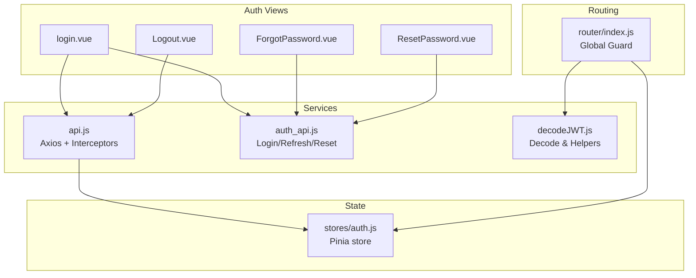
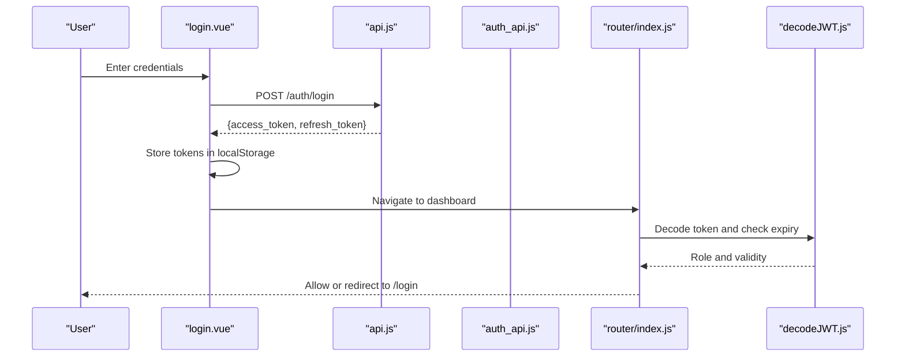
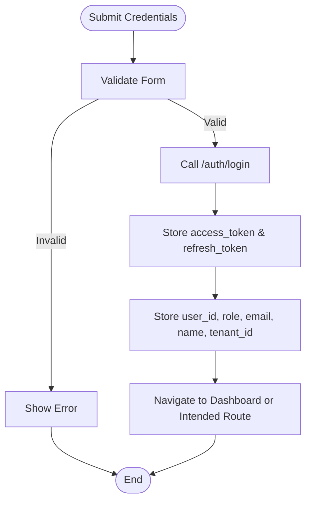
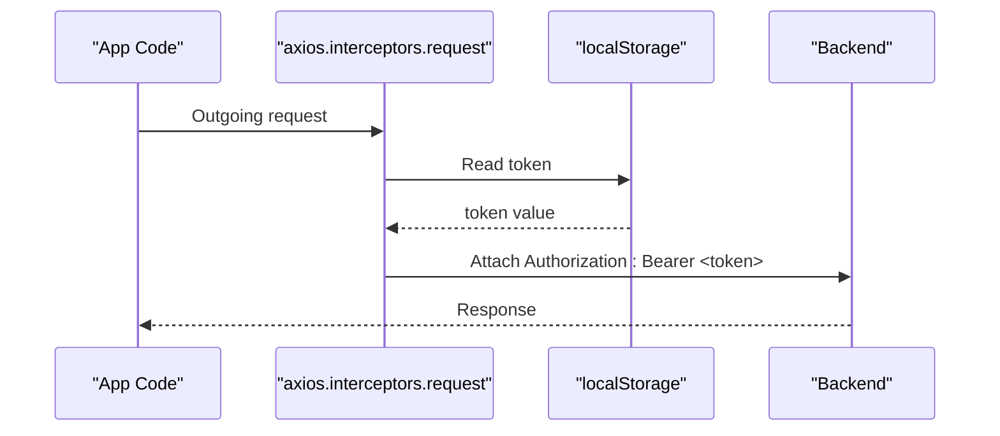
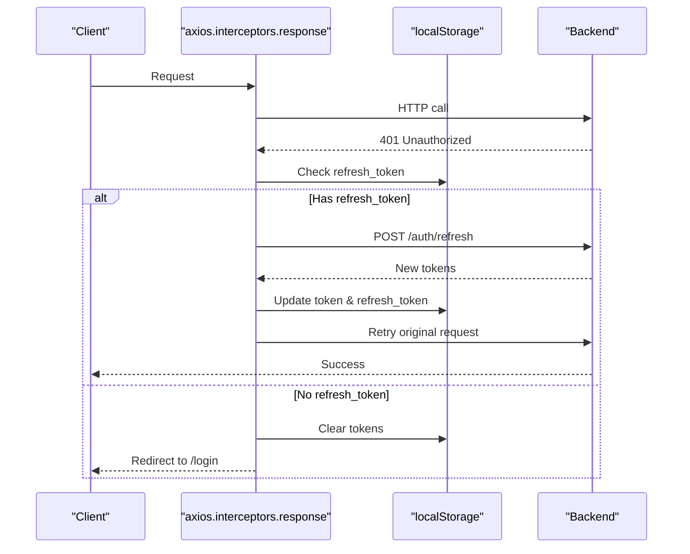
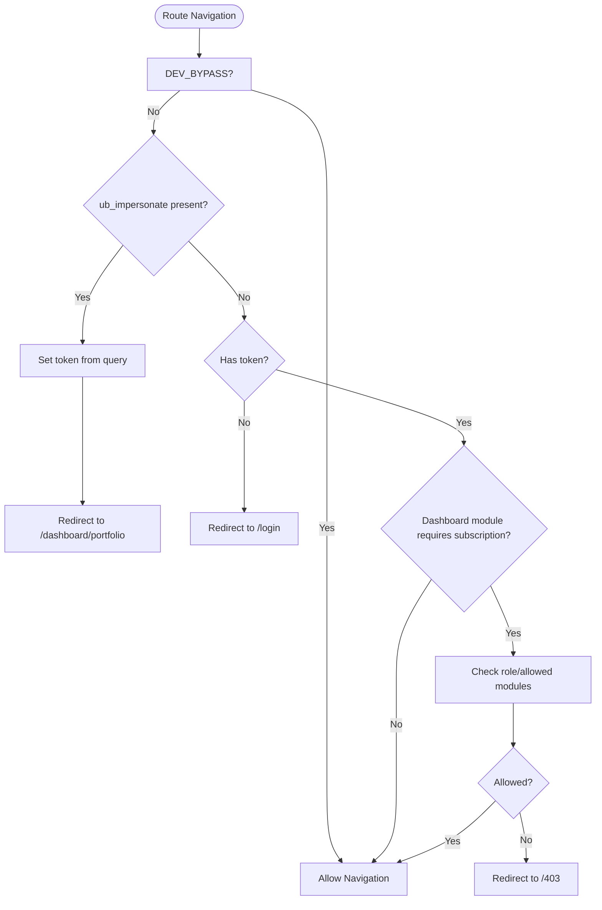
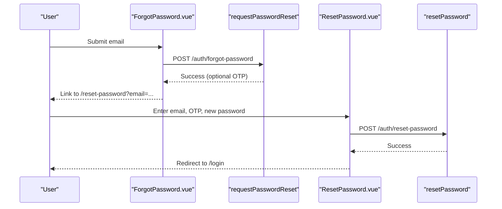
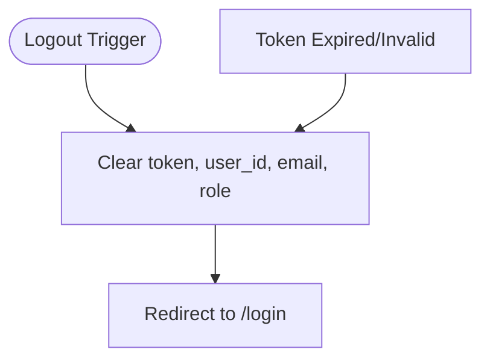
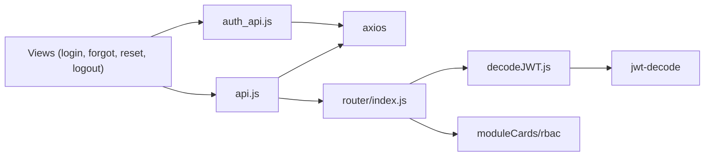

# Authentication Flow

<cite>
**Referenced Files in This Document**
- [src/services/api.js](file://src/services/api.js)
- [src/services/auth_api.js](file://src/services/auth_api.js)
- [src/stores/auth.js](file://src/stores/auth.js)
- [src/router/index.js](file://src/router/index.js)
- [src/views/auth/login.vue](file://src/views/auth/login.vue)
- [src/views/auth/ForgotPassword.vue](file://src/views/auth/ForgotPassword.vue)
- [src/views/auth/ResetPassword.vue](file://src/views/auth/ResetPassword.vue)
- [src/views/auth/Logout.vue](file://src/views/auth/Logout.vue)
- [src/services/decodeJWT.js](file://src/services/decodeJWT.js)
</cite>

## Table of Contents
1. Introduction
2. Project Structure
3. Core Components
4. Architecture Overview
5. Detailed Component Analysis
6. Dependency Analysis
7. Performance Considerations
8. Troubleshooting Guide
9. Conclusion

## Introduction
This document explains the ABSA Foundry Frontend authentication flow with a focus on JWT-based login, token storage in localStorage, automatic token attachment to requests via Axios interceptors, and token refresh mechanisms. It covers the complete lifecycle from credential submission through successful authentication to session management, including password reset workflows (forgot password and OTP verification), error handling strategies for failures, network issues, and token expiration, protected route access, automatic logout on token expiry, and security considerations for token storage, transmission, and validation.

## Project Structure
Authentication-related code is organized across services, stores, router guards, and auth views:
- Services: API client setup, request/response interceptors, login/refresh/logout, password reset helpers
- Store: Centralized auth state and logout action
- Router: Global navigation guard enforcing authentication and role checks
- Views: Login, Forgot Password, Reset Password, Logout pages
- Utilities: JWT decoding and helper functions

**Diagram sources**
- [src/services/api.js:64-146](file://src/services/api.js#L64-L146)
- [src/services/auth_api.js:36-87](file://src/services/auth_api.js#L36-L87)
- [src/stores/auth.js:1-22](file://src/stores/auth.js#L1-L22)
- [src/router/index.js:201-272](file://src/router/index.js#L201-L272)
- [src/services/decodeJWT.js:11-96](file://src/services/decodeJWT.js#L11-L96)

**Section sources**
- [src/services/api.js:1-209](file://src/services/api.js#L1-L209)
- [src/services/auth_api.js:1-190](file://src/services/auth_api.js#L1-L190)
- [src/stores/auth.js:1-22](file://src/stores/auth.js#L1-L22)
- [src/router/index.js:1-275](file://src/router/index.js#L1-L275)
- [src/views/auth/login.vue:133-265](file://src/views/auth/login.vue#L133-L265)
- [src/views/auth/ForgotPassword.vue:156-197](file://src/views/auth/ForgotPassword.vue#L156-L197)
- [src/views/auth/ResetPassword.vue:207-297](file://src/views/auth/ResetPassword.vue#L207-L297)
- [src/views/auth/Logout.vue:1-25](file://src/views/auth/Logout.vue#L1-L25)
- [src/services/decodeJWT.js:1-164](file://src/services/decodeJWT.js#L1-L164)

## Core Components
- Axios client with global interceptors:
  - Request interceptor attaches Bearer token from localStorage to all outgoing requests
  - Response interceptor handles 401 by refreshing tokens using refresh_token; queues concurrent requests during refresh; clears tokens and redirects to login on failure
- Auth service:
  - Login endpoint that stores access_token and refresh_token in localStorage
  - Refresh endpoint to obtain new tokens
  - Password reset endpoints for forgot-password and reset-password flows
- Pinia auth store:
  - Holds token, userRole, userEmail and provides logout action to clear local storage
- Router guard:
  - Enforces authentication before accessing protected routes
  - Handles admin impersonation token via URL query parameter
  - Checks module subscription/role-based access for dashboard paths
- JWT utilities:
  - Decode token, extract roles/email/userId, detect expired tokens, perform logout

**Section sources**
- [src/services/api.js:64-146](file://src/services/api.js#L64-L146)
- [src/services/auth_api.js:36-87](file://src/services/auth_api.js#L36-L87)
- [src/stores/auth.js:1-22](file://src/stores/auth.js#L1-L22)
- [src/router/index.js:201-272](file://src/router/index.js#L201-L272)
- [src/services/decodeJWT.js:11-96](file://src/services/decodeJWT.js#L11-L96)

## Architecture Overview
The authentication architecture combines UI flows, service layer, and routing guards to ensure secure access and seamless token management.

**Diagram sources**
- [src/views/auth/login.vue:180-248](file://src/views/auth/login.vue#L180-L248)
- [src/services/api.js:166-180](file://src/services/api.js#L166-L180)
- [src/router/index.js:201-272](file://src/router/index.js#L201-L272)
- [src/services/decodeJWT.js:11-96](file://src/services/decodeJWT.js#L11-L96)

## Detailed Component Analysis

### Login Flow
- The login view validates inputs, calls the login function, and stores tokens and user metadata in localStorage.
- On success, it navigates to the intended route or defaults to the dashboard portfolio.
- Token claims are decoded to populate user context and handle special roles like sub_account.

**Diagram sources**
- [src/views/auth/login.vue:161-248](file://src/views/auth/login.vue#L161-L248)
- [src/services/api.js:166-180](file://src/services/api.js#L166-L180)

**Section sources**
- [src/views/auth/login.vue:133-265](file://src/views/auth/login.vue#L133-L265)
- [src/services/api.js:166-180](file://src/services/api.js#L166-L180)

### Token Storage and Automatic Attachment
- Tokens are stored in localStorage under keys token and refresh_token.
- Axios request interceptor automatically adds Authorization header with Bearer token for every request.
- Additional auth headers utility supports fetch-based calls.

**Diagram sources**
- [src/services/api.js:64-76](file://src/services/api.js#L64-L76)
- [src/services/auth_api.js:21-27](file://src/services/auth_api.js#L21-L27)

**Section sources**
- [src/services/api.js:64-76](file://src/services/api.js#L64-L76)
- [src/services/auth_api.js:21-27](file://src/services/auth_api.js#L21-L27)

### Token Refresh Mechanism
- On receiving a 401 response, the response interceptor attempts to refresh the token using the stored refresh_token.
- Concurrent requests are queued and retried after refresh succeeds.
- If refresh fails, tokens are cleared and the user is redirected to login.

**Diagram sources**
- [src/services/api.js:78-146](file://src/services/api.js#L78-L146)
- [src/services/auth_api.js:64-87](file://src/services/auth_api.js#L64-L87)

**Section sources**
- [src/services/api.js:78-146](file://src/services/api.js#L78-L146)
- [src/services/auth_api.js:64-87](file://src/services/auth_api.js#L64-L87)

### Protected Routes and Session Management
- The router guard enforces authentication for protected routes and redirects unauthenticated users to login.
- It also decodes JWT to determine user role and applies module-level access checks for dashboard routes.
- Admin impersonation via URL query parameter sets token and navigates to dashboard.

**Diagram sources**
- [src/router/index.js:201-272](file://src/router/index.js#L201-L272)

**Section sources**
- [src/router/index.js:201-272](file://src/router/index.js#L201-L272)

### Password Reset Workflow (Forgot Password and OTP Verification)
- Forgot Password: User submits email; backend sends reset instructions; optional development mode displays OTP.
- Reset Password: User enters email, OTP, and new password; validation ensures correct format and strength; upon success, user is redirected to login.

**Diagram sources**
- [src/views/auth/ForgotPassword.vue:179-197](file://src/views/auth/ForgotPassword.vue#L179-L197)
- [src/services/auth_api.js:145-164](file://src/services/auth_api.js#L145-L164)
- [src/views/auth/ResetPassword.vue:279-297](file://src/views/auth/ResetPassword.vue#L279-L297)
- [src/services/auth_api.js:166-189](file://src/services/auth_api.js#L166-L189)

**Section sources**
- [src/views/auth/ForgotPassword.vue:156-197](file://src/views/auth/ForgotPassword.vue#L156-L197)
- [src/services/auth_api.js:145-189](file://src/services/auth_api.js#L145-L189)
- [src/views/auth/ResetPassword.vue:207-297](file://src/views/auth/ResetPassword.vue#L207-L297)

### Logout and Automatic Logout on Token Expiry
- Manual logout clears relevant localStorage entries and redirects to login.
- Automatic logout occurs when JWT decoding detects an expired token or invalid token, clearing session and navigating to login.

**Diagram sources**
- [src/views/auth/Logout.vue:7-15](file://src/views/auth/Logout.vue#L7-L15)
- [src/services/decodeJWT.js:66-96](file://src/services/decodeJWT.js#L66-L96)

**Section sources**
- [src/views/auth/Logout.vue:1-25](file://src/views/auth/Logout.vue#L1-L25)
- [src/services/decodeJWT.js:66-96](file://src/services/decodeJWT.js#L66-L96)

### Multi-Session Management
- The application uses localStorage for token persistence. Multiple browser tabs sharing the same origin will share the same token state.
- There is no explicit multi-session isolation per tab; concurrent requests are handled via the request queue during refresh.
- For true multi-session support, consider using sessionStorage or separate storage namespaces per session.

[No sources needed since this section provides general guidance]

## Dependency Analysis
Key dependencies and interactions:
- api.js depends on axios and router; defines interceptors and login/refresh/logout functions
- auth_api.js depends on axios and environment variables; provides login, refresh, signup, and password reset functions
- decodeJWT.js depends on jwt-decode and dev flags; provides token decoding and logout
- router/index.js depends on decodeJWT and module configuration; enforces authentication and role checks
- Stores and views depend on services for state and actions

**Diagram sources**
- [src/services/api.js:1-209](file://src/services/api.js#L1-L209)
- [src/services/auth_api.js:1-190](file://src/services/auth_api.js#L1-L190)
- [src/services/decodeJWT.js:1-164](file://src/services/decodeJWT.js#L1-L164)
- [src/router/index.js:1-275](file://src/router/index.js#L1-L275)

**Section sources**
- [src/services/api.js:1-209](file://src/services/api.js#L1-L209)
- [src/services/auth_api.js:1-190](file://src/services/auth_api.js#L1-L190)
- [src/services/decodeJWT.js:1-164](file://src/services/decodeJWT.js#L1-L164)
- [src/router/index.js:1-275](file://src/router/index.js#L1-L275)

## Performance Considerations
- Token refresh batching: The response interceptor queues concurrent requests during refresh to avoid redundant refresh calls and reduce network overhead.
- Lazy loading: Routes use dynamic imports to minimize initial bundle size and improve load performance.
- LocalStorage reads: Token retrieval is performed only when necessary (interceptors and guards), minimizing unnecessary I/O.

[No sources needed since this section provides general guidance]

## Troubleshooting Guide
Common issues and resolutions:
- 401 Unauthorized:
  - Ensure refresh_token exists in localStorage; if missing, user will be redirected to login
  - Verify backend refresh endpoint returns valid tokens
- Network errors:
  - Check base URL configuration and CORS settings
  - Inspect console logs for detailed error messages
- Invalid token:
  - Token decoding errors trigger logout; verify token integrity and expiration
- Password reset failures:
  - Validate email format and OTP length; ensure backend endpoints are reachable

**Section sources**
- [src/services/api.js:78-146](file://src/services/api.js#L78-L146)
- [src/services/auth_api.js:54-87](file://src/services/auth_api.js#L54-L87)
- [src/services/decodeJWT.js:11-96](file://src/services/decodeJWT.js#L11-L96)

## Conclusion
The ABSA Foundry Frontend implements a robust JWT-based authentication system with secure token storage, automatic request authorization, and resilient token refresh handling. Protected routes enforce authentication and role-based access, while password reset flows provide secure recovery mechanisms. Proper error handling and session management ensure a smooth user experience even in edge cases such as network failures and token expiration. Security best practices include storing tokens in localStorage, attaching them via Authorization headers, validating tokens locally, and clearing sensitive data on logout.

[No sources needed since this section summarizes without analyzing specific files]