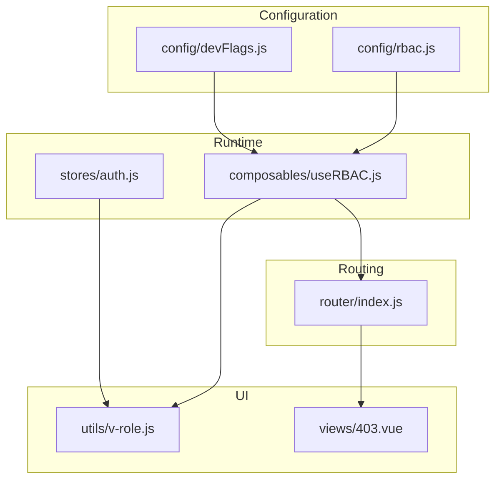
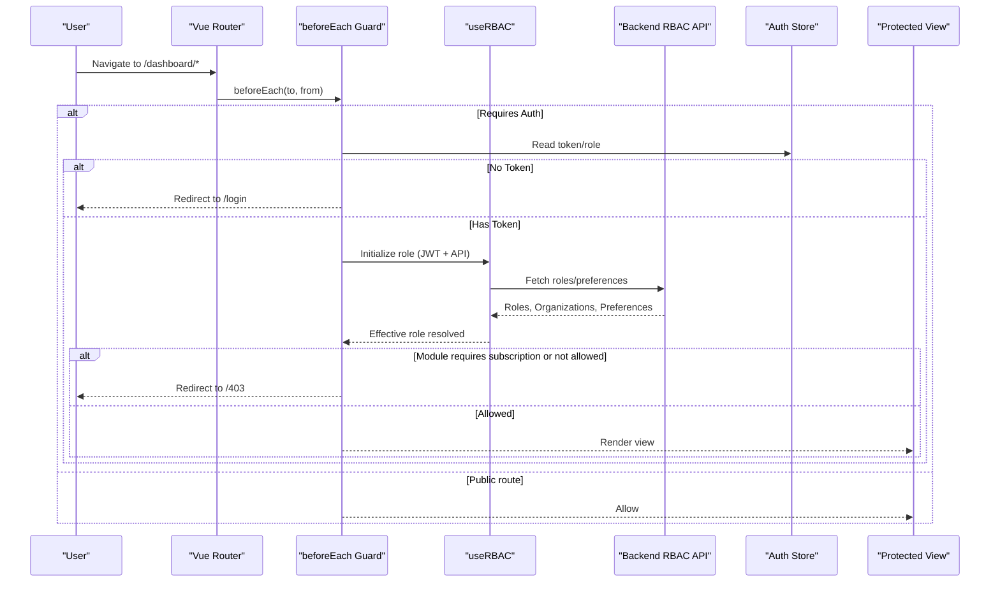
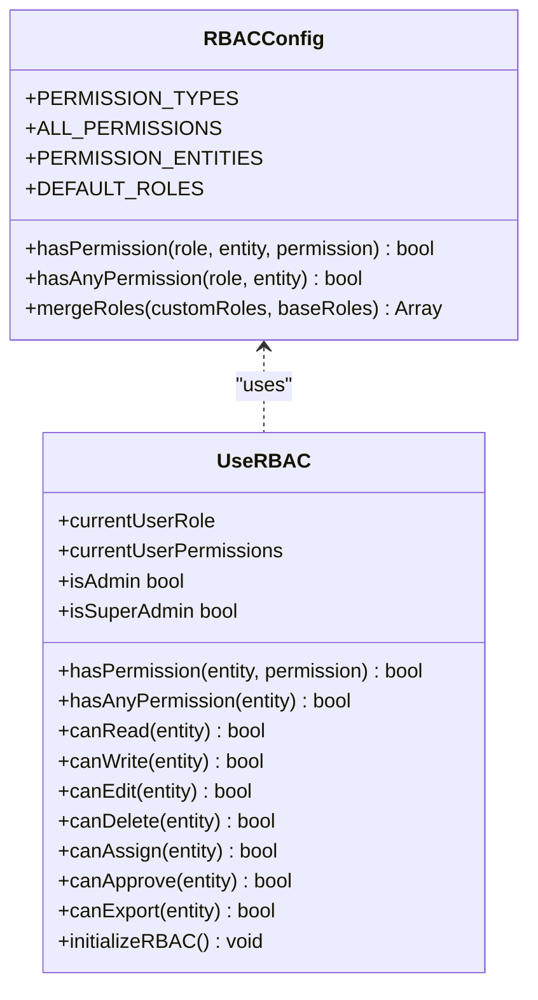
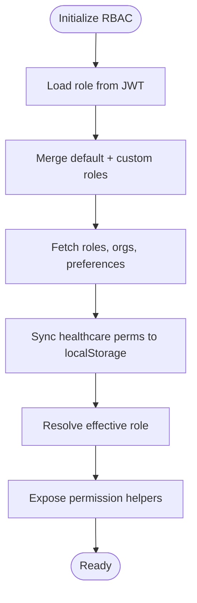
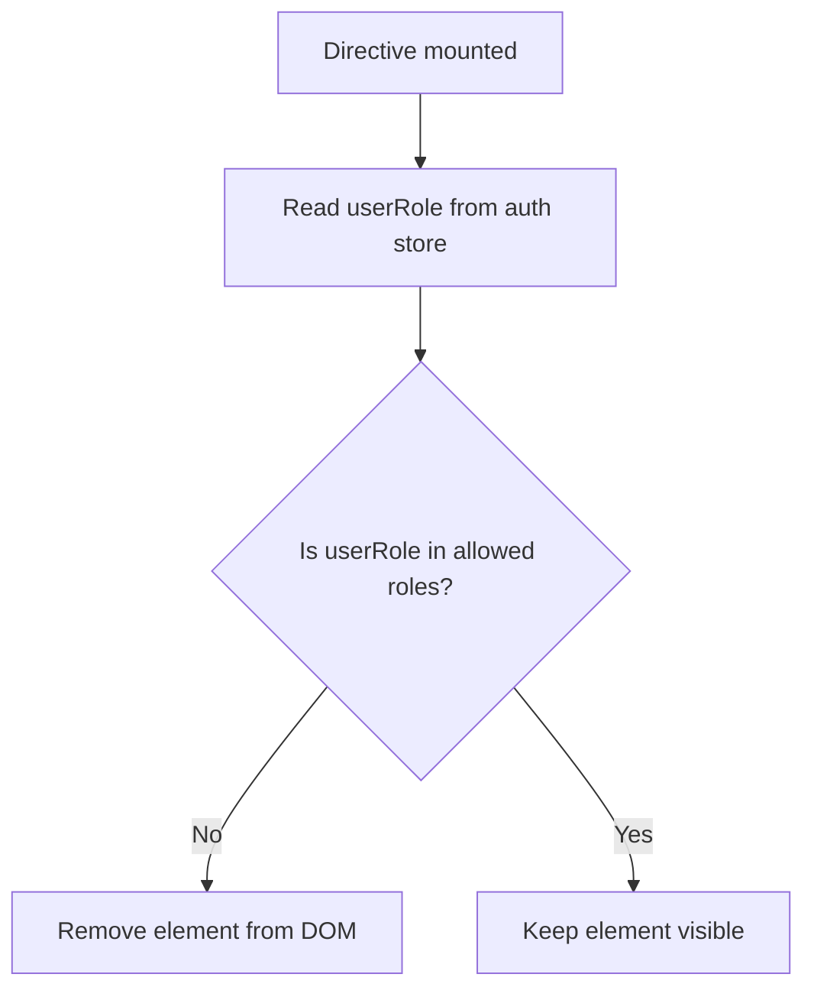
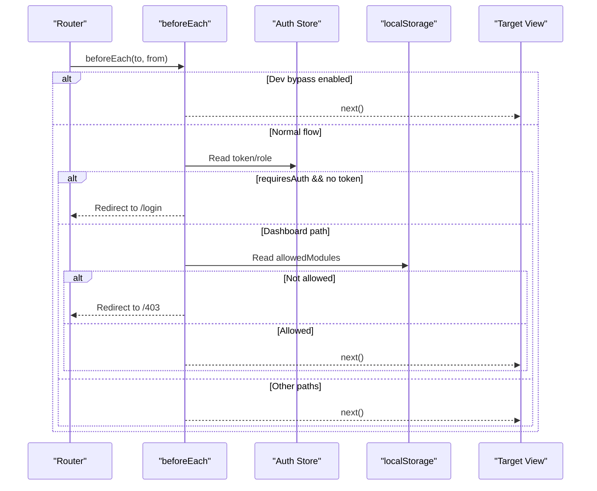
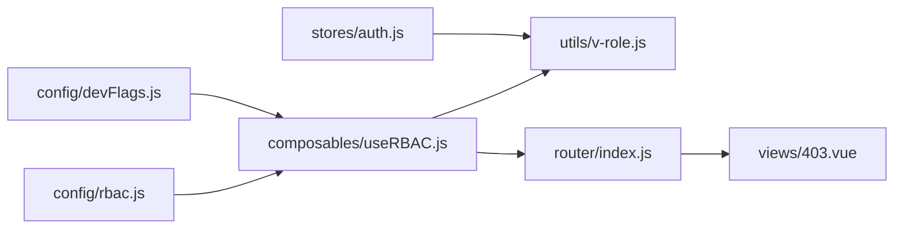

# Authorization & RBAC

<cite>
**Referenced Files in This Document**
- [useRBAC.js](file://src/composables/useRBAC.js)
- [rbac.js](file://src/config/rbac.js)
- [v-role.js](file://src/utils/v-role.js)
- [index.js](file://src/router/index.js)
- [auth.js](file://src/stores/auth.js)
- [devFlags.js](file://src/config/devFlags.js)
- [403.vue](file://src/views/403.vue)
</cite>

## Table of Contents
1. [Introduction](#introduction)
2. [Project Structure](#project-structure)
3. [Core Components](#core-components)
4. [Architecture Overview](#architecture-overview)
5. [Detailed Component Analysis](#detailed-component-analysis)
6. [Dependency Analysis](#dependency-analysis)
7. [Performance Considerations](#performance-considerations)
8. [Troubleshooting Guide](#troubleshooting-guide)
9. [Conclusion](#conclusion)
10. [Appendices](#appendices)

## Introduction
This document explains the ABSA Foundry Frontend’s authorization and role-based access control (RBAC). It covers:
- Role definitions, permission hierarchies, and policies
- UI-level checks using the v-role directive and composables
- Route-level authorization via Vue Router guards
- Dynamic menu generation based on permissions
- Custom permission checks and reusable authorization patterns
- Relationship between backend permissions and frontend UI controls
- Common RBAC patterns such as feature flags, module-level access control, and granular permissions

## Project Structure
The RBAC implementation spans configuration, runtime composable utilities, a lightweight directive for quick role checks, and router-level guards. The key areas are:
- Configuration: role definitions, entities, and permission types
- Runtime: reactive state, permission checks, role management, and UI preferences
- Directive: v-role for DOM-level visibility control
- Routing: global guard enforcing authentication and module access
- Stores: minimal auth state used by the directive

**Diagram sources**
- [rbac.js:1-753](file://src/config/rbac.js#L1-L753)
- [devFlags.js:1-28](file://src/config/devFlags.js#L1-L28)
- [useRBAC.js:1-783](file://src/composables/useRBAC.js#L1-L783)
- [auth.js:1-22](file://src/stores/auth.js#L1-L22)
- [v-role.js:1-12](file://src/utils/v-role.js#L1-L12)
- [index.js:1-275](file://src/router/index.js#L1-L275)
- [403.vue:1-14](file://src/views/403.vue#L1-L14)

**Section sources**
- [rbac.js:1-753](file://src/config/rbac.js#L1-L753)
- [useRBAC.js:1-783](file://src/composables/useRBAC.js#L1-L783)
- [v-role.js:1-12](file://src/utils/v-role.js#L1-L12)
- [index.js:1-275](file://src/router/index.js#L1-L275)
- [auth.js:1-22](file://src/stores/auth.js#L1-L22)
- [devFlags.js:1-28](file://src/config/devFlags.js#L1-L28)
- [403.vue:1-14](file://src/views/403.vue#L1-L14)

## Core Components
- Role and permission model:
  - Entities define modules/features that can be protected.
  - Permission types include read, write, edit, delete, assign, approve, export.
  - Default roles provide baseline permissions; custom roles can override or extend them.
- Reactive RBAC composable:
  - Loads current user role from JWT and merges tenant-specific roles from the backend.
  - Provides helpers like hasPermission, hasAnyPermission, canRead, canWrite, canEdit, canDelete, canAssign, canApprove, canExport, isAdmin, isSuperAdmin, canManageRoles.
  - Manages organizations and UI preferences per tenant.
- v-role directive:
  - Removes elements from the DOM if the user’s role does not match allowed roles.
- Router guard:
  - Enforces authentication and module-level access for dashboard routes.
  - Redirects unauthorized users to /403 when needed.
- Auth store:
  - Holds token, user role, and email for quick checks in simple directives.

**Section sources**
- [rbac.js:13-77](file://src/config/rbac.js#L13-L77)
- [rbac.js:85-337](file://src/config/rbac.js#L85-L337)
- [useRBAC.js:55-137](file://src/composables/useRBAC.js#L55-L137)
- [v-role.js:1-12](file://src/utils/v-role.js#L1-L12)
- [index.js:201-272](file://src/router/index.js#L201-L272)
- [auth.js:1-22](file://src/stores/auth.js#L1-L22)

## Architecture Overview
The system combines static role definitions with dynamic, backend-provided roles and permissions. At runtime, the composable resolves the effective role and exposes permission-checking functions. The router enforces route-level security, while the v-role directive handles element-level visibility.

**Diagram sources**
- [index.js:201-272](file://src/router/index.js#L201-L272)
- [useRBAC.js:144-226](file://src/composables/useRBAC.js#L144-L226)
- [auth.js:1-22](file://src/stores/auth.js#L1-L22)

## Detailed Component Analysis

### Role Definitions and Permission Model
- Entities: Modules such as POS, CRM, Healthcare, Assets Manager, etc., each can have multiple permission types.
- Permission Types: read, write, edit, delete, assign, approve, export. Some entities expose additional specific permissions.
- Default Roles:
  - Owner: full access across all entities.
  - Manager, Cashier, Accountant, Auditor, Attendant, Hotel Attendant, System Admin, Asset Manager, Finance Officer, Technician, Department Manager, Read-Only Viewer.
- Role Merging: Backend custom roles can override defaults; deleted roles are removed at runtime.
- Healthcare Addons: Derived from entity permissions and persisted for fast UI checks.

**Diagram sources**
- [rbac.js:13-77](file://src/config/rbac.js#L13-L77)
- [rbac.js:85-337](file://src/config/rbac.js#L85-L337)
- [rbac.js:658-713](file://src/config/rbac.js#L658-L713)
- [useRBAC.js:55-137](file://src/composables/useRBAC.js#L55-L137)

**Section sources**
- [rbac.js:13-77](file://src/config/rbac.js#L13-L77)
- [rbac.js:85-337](file://src/config/rbac.js#L85-L337)
- [rbac.js:658-713](file://src/config/rbac.js#L658-L713)

### useRBAC Composable
Responsibilities:
- Resolve effective role from JWT and merge with backend-provided roles.
- Provide permission checking helpers with dev bypass support.
- Manage organizations and UI preferences per tenant.
- Persist healthcare-related permissions for faster UI rendering.

Key behaviors:
- hasPermission and hasAnyPermission short-circuit for owner/admin/super_admin and dev bypass.
- initializeRBAC loads roles, organizations, and UI preferences concurrently.
- fetchRoles merges default and custom roles, removes deleted roles, and syncs healthcare permissions to localStorage.

**Diagram sources**
- [useRBAC.js:668-719](file://src/composables/useRBAC.js#L668-L719)
- [useRBAC.js:144-226](file://src/composables/useRBAC.js#L144-L226)

**Section sources**
- [useRBAC.js:55-137](file://src/composables/useRBAC.js#L55-L137)
- [useRBAC.js:144-226](file://src/composables/useRBAC.js#L144-L226)
- [useRBAC.js:668-719](file://src/composables/useRBAC.js#L668-L719)

### v-role Directive
Purpose:
- Quickly hide UI elements when the current user’s role is not included in the directive’s value array.

Behavior:
- On mount, reads the user role from the auth store.
- If the role is not in the provided list, removes the element from the DOM.

Usage pattern:
- Apply v-role="['admin', 'manager']" to buttons or sections to restrict visibility by role.

**Diagram sources**
- [v-role.js:1-12](file://src/utils/v-role.js#L1-L12)
- [auth.js:1-22](file://src/stores/auth.js#L1-L22)

**Section sources**
- [v-role.js:1-12](file://src/utils/v-role.js#L1-L12)
- [auth.js:1-22](file://src/stores/auth.js#L1-L22)

### Route-Level Authorization
Global guard responsibilities:
- Authentication enforcement for routes marked as requiring auth.
- Subscription/module access checks for dashboard routes.
- Impersonation token handling via query parameter.
- Redirect to /403 when access is denied.

Flow:
- If token missing and route requires auth, redirect to login.
- For dashboard routes, identify target module and check allowed modules list for non-admin roles.
- If module requires subscription and user lacks allowance, redirect to /403.

**Diagram sources**
- [index.js:201-272](file://src/router/index.js#L201-L272)
- [auth.js:1-22](file://src/stores/auth.js#L1-L22)

**Section sources**
- [index.js:201-272](file://src/router/index.js#L201-L272)

### Dynamic Menu Generation Based on Permissions
While menu components are not shown here, the typical pattern uses the RBAC composable to compute which modules are visible:
- Compute allowed modules by iterating PERMISSION_ENTITIES and checking hasAnyPermission or specific action permissions.
- Filter navigation entries accordingly.
- Combine with route-level guard logic to ensure consistency between visible items and accessible routes.

Best practice:
- Derive menu visibility from the same permission checks used by route guards to avoid mismatches.

[No sources needed since this section describes a general pattern without analyzing specific files]

### Custom Permission Checks and Reusable Composables
Patterns:
- Feature flags: Use DEV_BYPASS to enable/disable strict checks during development.
- Module-level access: Check hasAnyPermission for an entity before rendering module-specific features.
- Granular permissions: Use canRead/canWrite/canEdit/canDelete/canAssign/canApprove/canExport for fine-grained UI toggles.

Reusable approach:
- Create small composables that wrap useRBAC helpers for domain-specific checks (e.g., canManageCRM, canExportReports).
- Cache results in component scope where appropriate to avoid repeated computations.

**Section sources**
- [useRBAC.js:63-137](file://src/composables/useRBAC.js#L63-L137)
- [devFlags.js:1-28](file://src/config/devFlags.js#L1-L28)

### Handling Role Changes Dynamically
- Role changes occur when backend roles are updated or when a new JWT is issued.
- Re-initialize RBAC to reload roles and recompute effective permissions.
- Update local storage for healthcare permissions and UI preferences as part of initialization.

Recommended flow:
- On successful role update, call initializeRBAC again to refresh state.
- Ensure dependent UI (menus, buttons, routes) reacts to role changes via reactive state.

**Section sources**
- [useRBAC.js:144-226](file://src/composables/useRBAC.js#L144-L226)
- [useRBAC.js:668-719](file://src/composables/useRBAC.js#L668-L719)

## Dependency Analysis
The RBAC system has clear boundaries:
- Configuration defines the policy surface (entities, permissions, roles).
- Composable consumes configuration and runtime data (JWT, API) to produce reactive permission state.
- Directive and stores provide lightweight UI checks.
- Router guard enforces navigation-level security.

**Diagram sources**
- [rbac.js:1-753](file://src/config/rbac.js#L1-L753)
- [devFlags.js:1-28](file://src/config/devFlags.js#L1-L28)
- [useRBAC.js:1-783](file://src/composables/useRBAC.js#L1-L783)
- [v-role.js:1-12](file://src/utils/v-role.js#L1-L12)
- [index.js:1-275](file://src/router/index.js#L1-L275)
- [auth.js:1-22](file://src/stores/auth.js#L1-L22)
- [403.vue:1-14](file://src/views/403.vue#L1-L14)

**Section sources**
- [rbac.js:1-753](file://src/config/rbac.js#L1-L753)
- [useRBAC.js:1-783](file://src/composables/useRBAC.js#L1-L783)
- [v-role.js:1-12](file://src/utils/v-role.js#L1-L12)
- [index.js:1-275](file://src/router/index.js#L1-L275)
- [auth.js:1-22](file://src/stores/auth.js#L1-L22)
- [403.vue:1-14](file://src/views/403.vue#L1-L14)

## Performance Considerations
- Minimize redundant permission checks by caching computed values within components.
- Use hasAnyPermission for coarse checks and specific canX methods only when necessary.
- Avoid heavy operations in v-role; it should remain lightweight for DOM visibility.
- Leverage dev bypass judiciously; ensure production builds enforce strict checks.
- Batch initialization calls (roles, organizations, preferences) to reduce network requests.

[No sources needed since this section provides general guidance]

## Troubleshooting Guide
Common issues and resolutions:
- Elements hidden unexpectedly with v-role:
  - Verify the user role stored in the auth store matches expected values.
  - Ensure the directive’s allowed roles array includes the current role.
- Routes redirecting to /403:
  - Confirm the route’s meta and path classification under dashboard rules.
  - Check allowedModules in local storage for non-admin roles.
- Permission checks returning false:
  - Validate that the effective role was loaded and merged correctly.
  - Ensure backend returns valid permissions for the role.
- Development vs production behavior differences:
  - DEV_BYPASS may allow access in development; disable it to test strict mode.

**Section sources**
- [v-role.js:1-12](file://src/utils/v-role.js#L1-L12)
- [index.js:201-272](file://src/router/index.js#L201-L272)
- [useRBAC.js:63-137](file://src/composables/useRBAC.js#L63-L137)
- [devFlags.js:1-28](file://src/config/devFlags.js#L1-L28)

## Conclusion
The ABSA Foundry Frontend implements a robust RBAC system combining static role definitions with dynamic, backend-driven roles and permissions. The useRBAC composable centralizes permission logic, the v-role directive enables quick UI-level visibility control, and the router guard ensures route-level security. By aligning UI controls with backend permissions and following consistent patterns for feature flags and module-level access, the application maintains secure and predictable access control across the platform.

[No sources needed since this section summarizes without analyzing specific files]

## Appendices

### A. Quick Reference: Permission Helpers
- hasPermission(entity, permission): Check explicit permission for an entity.
- hasAnyPermission(entity): Check if any permission exists for an entity.
- canRead/canWrite/canEdit/canDelete/canAssign/canApprove/canExport(entity): Convenience helpers for common actions.
- isAdmin/isSuperAdmin/canManageRoles: Role-based shortcuts.

**Section sources**
- [useRBAC.js:63-137](file://src/composables/useRBAC.js#L63-L137)

### B. Example Patterns
- Feature flag gating:
  - Use DEV_BYPASS to toggle strict checks during development.
- Module-level access:
  - Check hasAnyPermission('crm') to show CRM features.
- Granular UI:
  - Show “Export” button only if canExport('reports').

**Section sources**
- [devFlags.js:1-28](file://src/config/devFlags.js#L1-L28)
- [useRBAC.js:63-137](file://src/composables/useRBAC.js#L63-L137)