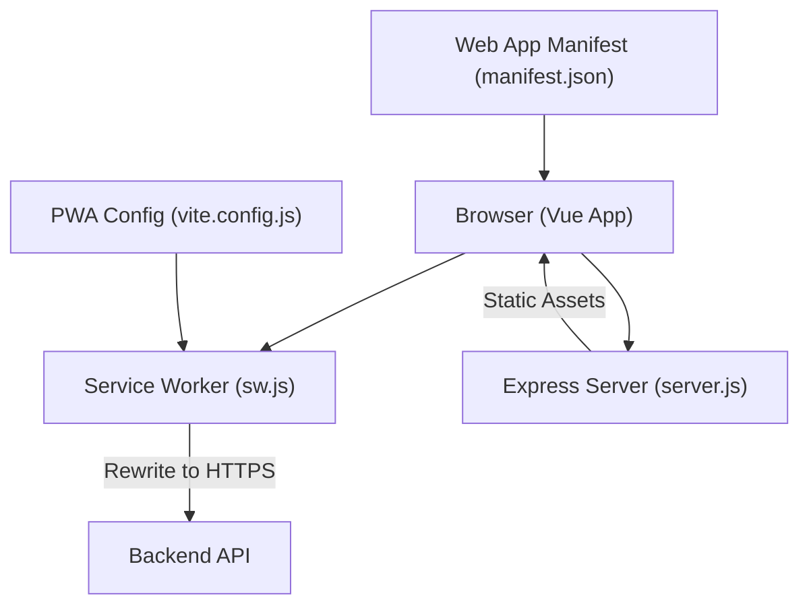
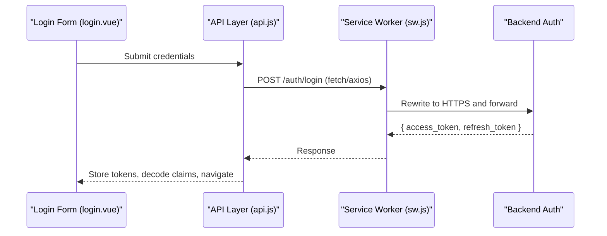
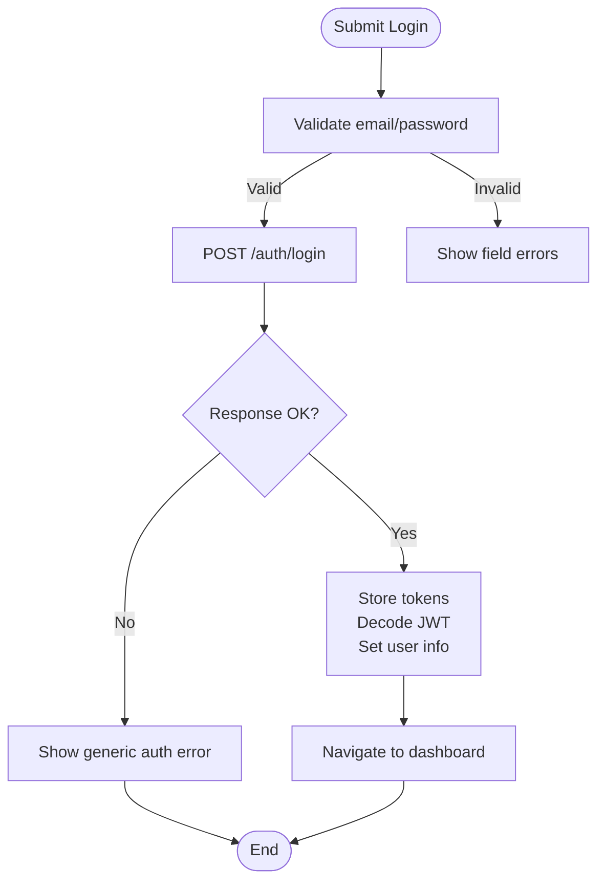
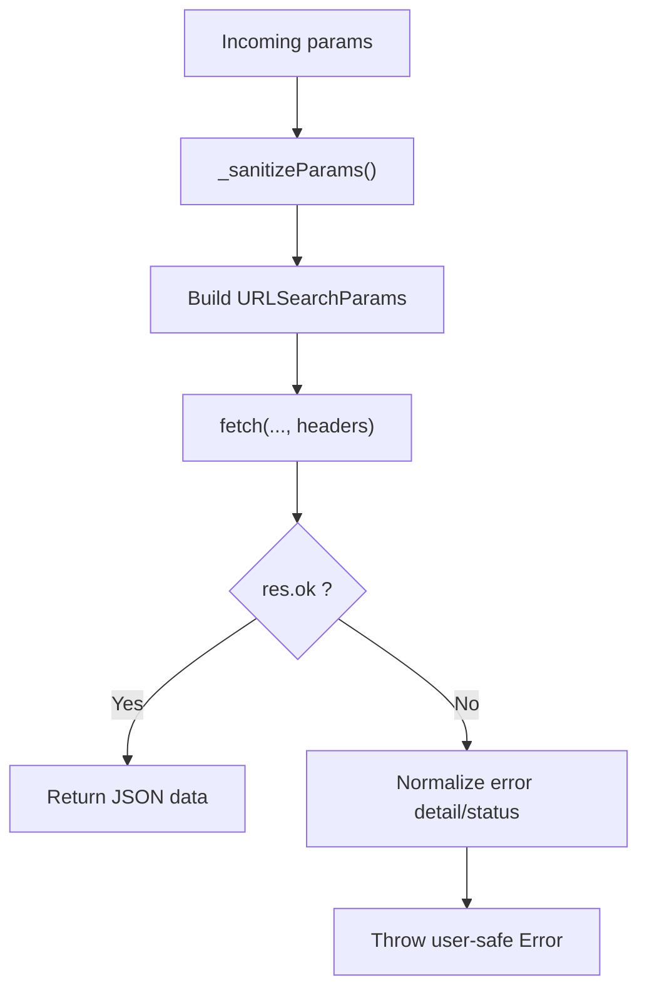
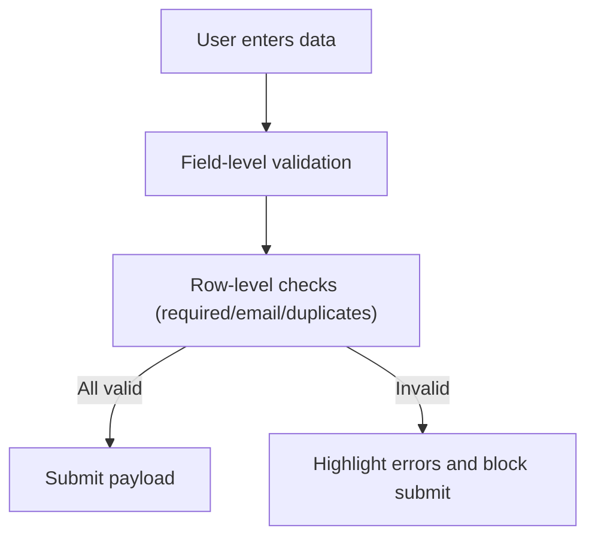
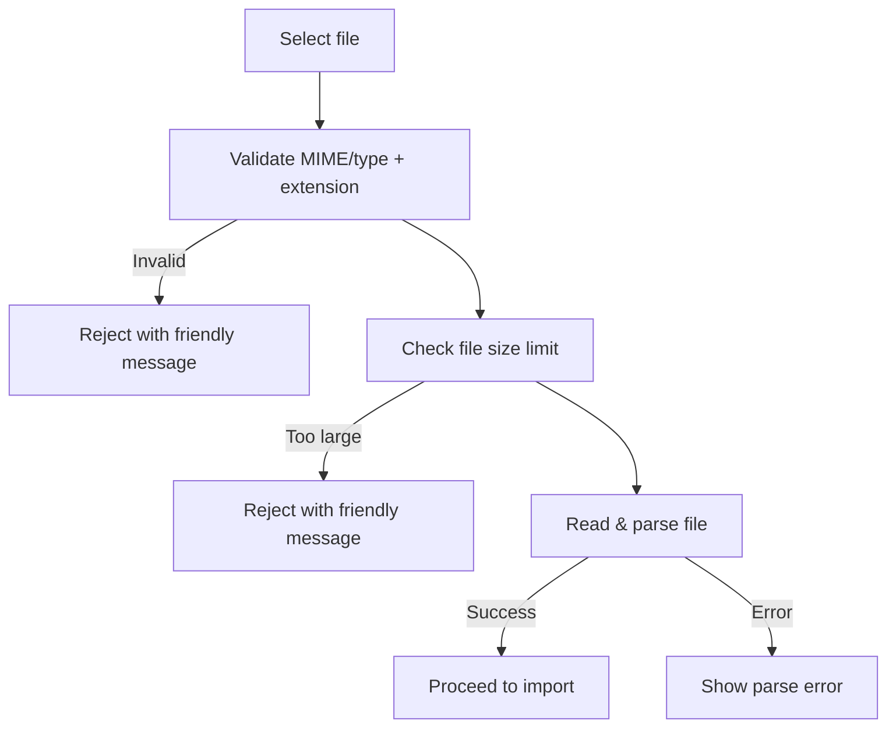
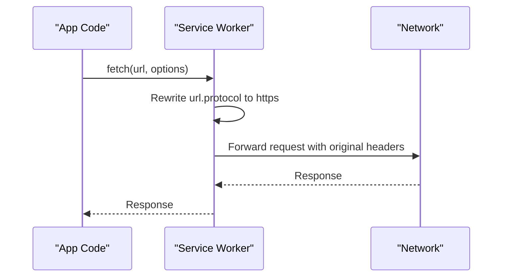
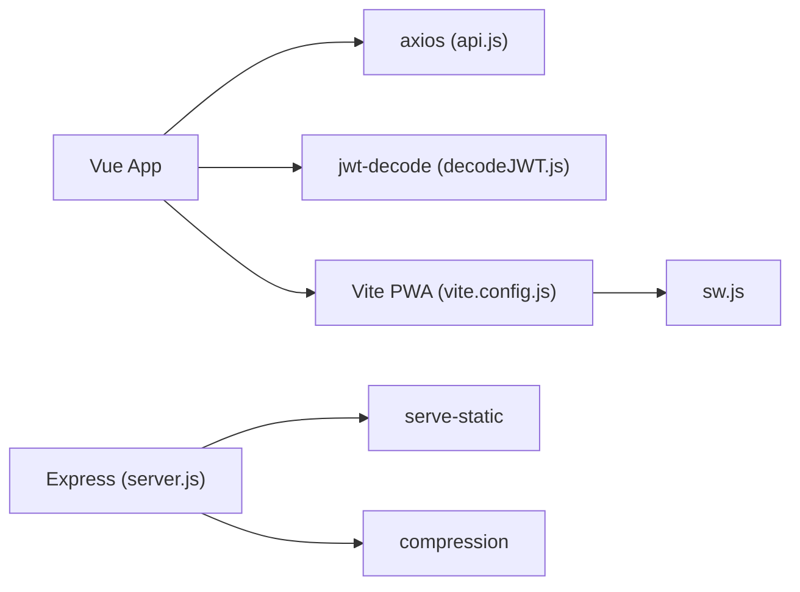

# Input Validation & Security

<cite>
**Referenced Files in This Document**
- [api.js](file://src/services/api.js)
- [crm_api.js](file://src/services/crm_api.js)
- [auth_api.js](file://src/services/auth_api.js)
- [decodeJWT.js](file://src/services/decodeJWT.js)
- [login.vue](file://src/views/auth/login.vue)
- [ForgotPassword.vue](file://src/views/auth/ForgotPassword.vue)
- [BulkUploadLeadsModal.vue](file://src/views/Modules/crm/components/BulkUploadLeadsModal.vue)
- [CRMModule.js](file://src/views/Modules/crm/composables/CRMModule.js)
- [sw.js](file://src/sw.js)
- [vite.config.js](file://vite.config.js)
- [server.js](file://server.js)
- [manifest.json](file://public/manifest.json)
- [AUTH-INTEGRATION.md](file://docs/AUTH-INTEGRATION.md)
</cite>

## Table of Contents
1. Introduction
2. Project Structure
3. Core Components
4. Architecture Overview
5. Detailed Component Analysis
6. Dependency Analysis
7. Performance Considerations
8. Troubleshooting Guide
9. Conclusion

## Introduction
This document provides comprehensive input validation and security guidance for the ABSA Foundry Frontend. It covers client-side form validation, data sanitization, type checking before API calls, XSS prevention, CSRF protection, secure HTTP headers, Content Security Policy considerations, error handling patterns that avoid information leakage, and secure practices for user-generated content, file uploads, and external data sources.

## Project Structure
The frontend is a Vue 3 application built with Vite and served by an Express server. Security-relevant areas include:
- Services layer for API calls and token handling
- Views for forms and user interactions
- Service Worker for HTTPS enforcement and caching
- Build configuration for PWA and asset handling
- Server middleware for static assets and error responses

**Diagram sources**
- [sw.js:36-100](file://src/sw.js#L36-L100)
- [server.js:1-70](file://server.js#L1-L70)
- [vite.config.js:1-41](file://vite.config.js#L1-L41)
- [manifest.json:1-24](file://public/manifest.json#L1-L24)

**Section sources**
- [sw.js:36-100](file://src/sw.js#L36-L100)
- [server.js:1-70](file://server.js#L1-L70)
- [vite.config.js:1-41](file://vite.config.js#L1-L41)
- [manifest.json:1-24](file://public/manifest.json#L1-L24)

## Core Components
- Authentication and token management:
  - Axios interceptors attach Authorization headers and handle 401 auto-refresh or logout flows.
  - Token storage uses localStorage; tokens are validated on login and decoded safely.
- API services:
  - Centralized fetch helpers set Content-Type and Authorization headers.
  - Parameter sanitization removes empty/null values before building query strings.
- Forms and validation:
  - Login page validates required fields and shows user-friendly errors.
  - Bulk upload modal validates rows, emails, and duplicates before submission.
  - File upload composable enforces allowed types and size limits.
- Secure transport:
  - Service Worker rewrites requests to HTTPS to prevent insecure connections.
- Error handling:
  - Consistent response handler normalizes backend errors into user-safe messages.
  - Global error middleware avoids leaking stack traces to clients.

**Section sources**
- [api.js:64-146](file://src/services/api.js#L64-L146)
- [api.js:166-208](file://src/services/api.js#L166-L208)
- [crm_api.js:11-44](file://src/services/crm_api.js#L11-L44)
- [login.vue:161-247](file://src/views/auth/login.vue#L161-L247)
- [BulkUploadLeadsModal.vue:784-828](file://src/views/Modules/crm/components/BulkUploadLeadsModal.vue#L784-L828)
- [CRMModule.js:2496-2517](file://src/views/Modules/crm/composables/CRMModule.js#L2496-L2517)
- [sw.js:36-100](file://src/sw.js#L36-L100)
- [server.js:13-17](file://server.js#L13-L17)

## Architecture Overview
The request flow emphasizes secure transport, authenticated headers, and safe error handling.

**Diagram sources**
- [login.vue:180-247](file://src/views/auth/login.vue#L180-L247)
- [api.js:166-208](file://src/services/api.js#L166-L208)
- [sw.js:36-100](file://src/sw.js#L36-L100)

## Detailed Component Analysis

### Authentication Flow and Token Handling
- Login validates inputs, sends credentials, stores tokens, decodes JWT to verify identity fields, and navigates securely.
- Axios interceptors automatically attach Bearer tokens and handle 401 by refreshing tokens or clearing session and redirecting to login.
- Logout clears local storage and attempts backend logout.

**Diagram sources**
- [login.vue:161-247](file://src/views/auth/login.vue#L161-L247)
- [api.js:166-208](file://src/services/api.js#L166-L208)
- [decodeJWT.js:11-38](file://src/services/decodeJWT.js#L11-L38)

**Section sources**
- [login.vue:161-247](file://src/views/auth/login.vue#L161-L247)
- [api.js:64-146](file://src/services/api.js#L64-L146)
- [api.js:166-208](file://src/services/api.js#L166-L208)
- [decodeJWT.js:11-38](file://src/services/decodeJWT.js#L11-L38)

### API Request Sanitization and Error Normalization
- Query parameters are sanitized to remove undefined, null, empty strings, and literal 'undefined' before building URLs.
- Responses are parsed safely; non-OK responses are normalized into user-safe error objects with status and message.

**Diagram sources**
- [crm_api.js:11-44](file://src/services/crm_api.js#L11-L44)

**Section sources**
- [crm_api.js:11-44](file://src/services/crm_api.js#L11-L44)

### Form Validation Examples
- Login form enforces required fields and displays specific field-level errors.
- Forgot Password form uses HTML5 email validation and shows contextual errors.
- Bulk Upload modal validates row completeness, email format, and duplicate detection prior to submission.

**Diagram sources**
- [login.vue:161-178](file://src/views/auth/login.vue#L161-L178)
- [ForgotPassword.vue:57-70](file://src/views/auth/ForgotPassword.vue#L57-L70)
- [BulkUploadLeadsModal.vue:784-828](file://src/views/Modules/crm/components/BulkUploadLeadsModal.vue#L784-L828)

**Section sources**
- [login.vue:161-178](file://src/views/auth/login.vue#L161-L178)
- [ForgotPassword.vue:57-70](file://src/views/auth/ForgotPassword.vue#L57-L70)
- [BulkUploadLeadsModal.vue:784-828](file://src/views/Modules/crm/components/BulkUploadLeadsModal.vue#L784-L828)

### File Upload Validation and Safe Processing
- Allowed MIME types and extensions are enforced; oversized files are rejected early.
- Uploaded files are read safely via FileReader and parsed using a library; invalid files produce clear errors without exposing internals.

**Diagram sources**
- [CRMModule.js:2496-2517](file://src/views/Modules/crm/composables/CRMModule.js#L2496-L2517)

**Section sources**
- [CRMModule.js:2496-2517](file://src/views/Modules/crm/composables/CRMModule.js#L2496-L2517)

### Secure Transport and Headers
- Service Worker intercepts backend requests and forces HTTPS protocol, ensuring secure transport even if the app loads over HTTP.
- All API calls include Authorization headers via helper functions and interceptors.

**Diagram sources**
- [sw.js:36-100](file://src/sw.js#L36-L100)
- [api.js:20-38](file://src/services/api.js#L20-L38)
- [crm_api.js:3-9](file://src/services/crm_api.js#L3-L9)

**Section sources**
- [sw.js:36-100](file://src/sw.js#L36-L100)
- [api.js:20-38](file://src/services/api.js#L20-L38)
- [crm_api.js:3-9](file://src/services/crm_api.js#L3-L9)

### Error Handling Patterns That Prevent Information Leakage
- Response handlers extract only user-facing details from backend payloads and discard sensitive internals.
- Global server error middleware returns generic messages and logs server-side details without exposing them to clients.
- Documentation outlines status-based user messages (e.g., 403, 429) without revealing implementation specifics.

**Section sources**
- [crm_api.js:11-32](file://src/services/crm_api.js#L11-L32)
- [server.js:13-17](file://server.js#L13-L17)
- [AUTH-INTEGRATION.md:782-804](file://docs/AUTH-INTEGRATION.md#L782-L804)

## Dependency Analysis
Security-related dependencies and their roles:
- axios: Used for authenticated requests with interceptors for token injection and 401 handling.
- jwt-decode: Used to safely decode tokens and validate presence of identity fields.
- vite-plugin-pwa: Generates service worker manifest and injects sw.js for offline and secure routing.
- express + serve-static + compression: Serves static assets with appropriate caching and minimal error exposure.

**Diagram sources**
- [api.js:1-18](file://src/services/api.js#L1-L18)
- [decodeJWT.js:1-2](file://src/services/decodeJWT.js#L1-L2)
- [vite.config.js:1-41](file://vite.config.js#L1-L41)
- [server.js:1-21](file://server.js#L1-L21)

**Section sources**
- [api.js:1-18](file://src/services/api.js#L1-L18)
- [decodeJWT.js:1-2](file://src/services/decodeJWT.js#L1-L2)
- [vite.config.js:1-41](file://vite.config.js#L1-L41)
- [server.js:1-21](file://server.js#L1-L21)

## Performance Considerations
- Caching strategy: index.html is served without cache to ensure latest assets; other static assets use aggressive caching with ETag and Last-Modified.
- Compression enabled to reduce payload sizes.
- Service Worker caches API GET responses briefly to improve resilience and perceived performance while maintaining freshness via short TTL.

[No sources needed since this section provides general guidance]

## Troubleshooting Guide
Common issues and resolutions:
- 401 Unauthorized:
  - The app attempts to refresh tokens; if refresh fails, it clears tokens and redirects to login.
  - Ensure refresh_token exists and backend supports /auth/refresh.
- Invalid token format:
  - Decoding failures trigger logout and clear stored tokens; verify backend token structure.
- File upload errors:
  - Enforce allowed types and size limits; provide clear messages when rejected.
- Network errors:
  - Service Worker ensures HTTPS; check CORS and backend availability.

**Section sources**
- [api.js:90-146](file://src/services/api.js#L90-L146)
- [api.js:166-208](file://src/services/api.js#L166-L208)
- [decodeJWT.js:11-38](file://src/services/decodeJWT.js#L11-L38)
- [CRMModule.js:2496-2517](file://src/views/Modules/crm/composables/CRMModule.js#L2496-L2517)
- [sw.js:36-100](file://src/sw.js#L36-L100)

## Conclusion
The ABSA Foundry Frontend implements robust client-side validation, secure transport, authenticated API calls, and safe error handling. Key strengths include parameter sanitization, HTTPS enforcement via Service Worker, token lifecycle management, and user-friendly error messaging that avoids information leakage. To further harden the application, consider adding explicit CSP headers at the server level, enforcing CSRF protections on state-changing endpoints, and centralizing input sanitization utilities for consistent reuse across components.