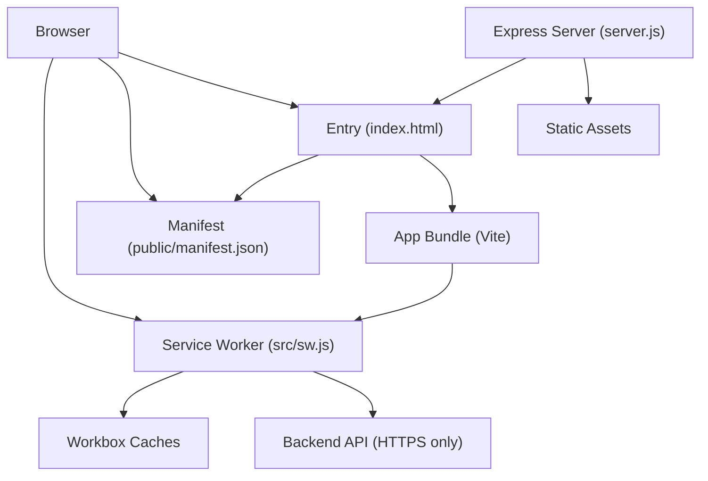
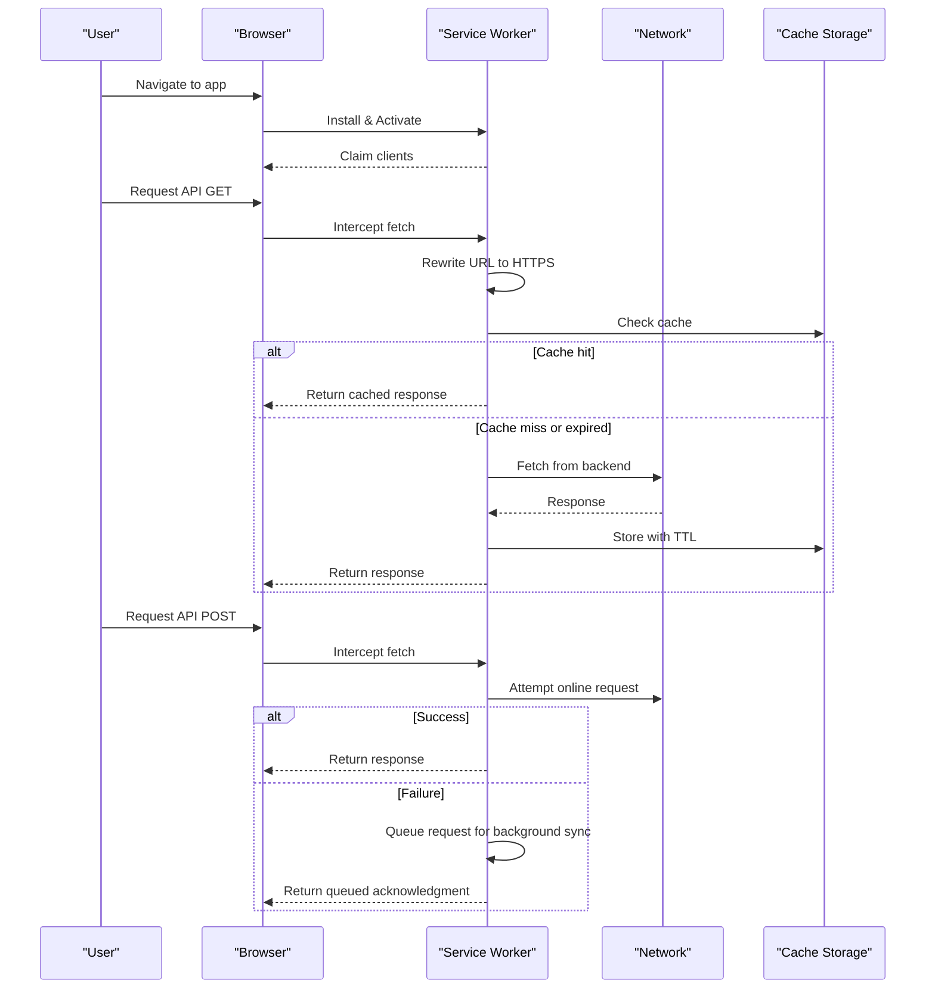
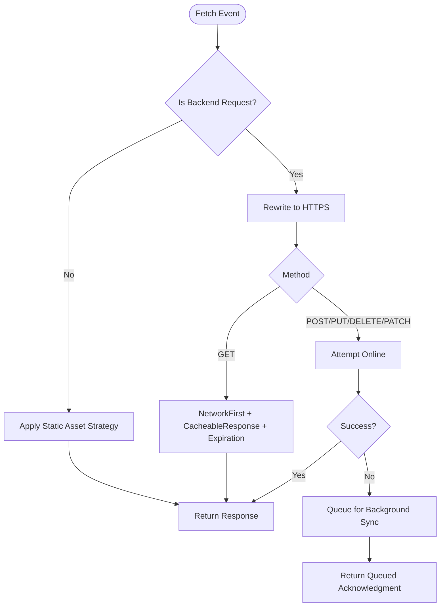
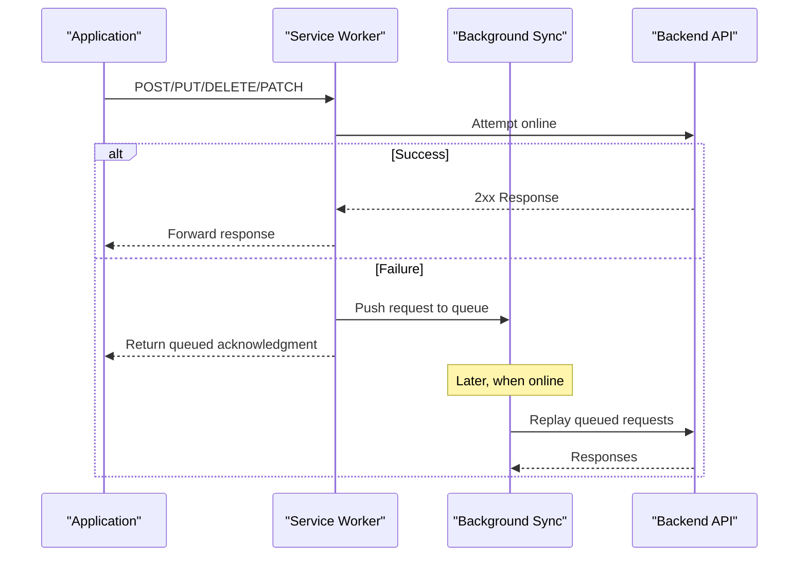
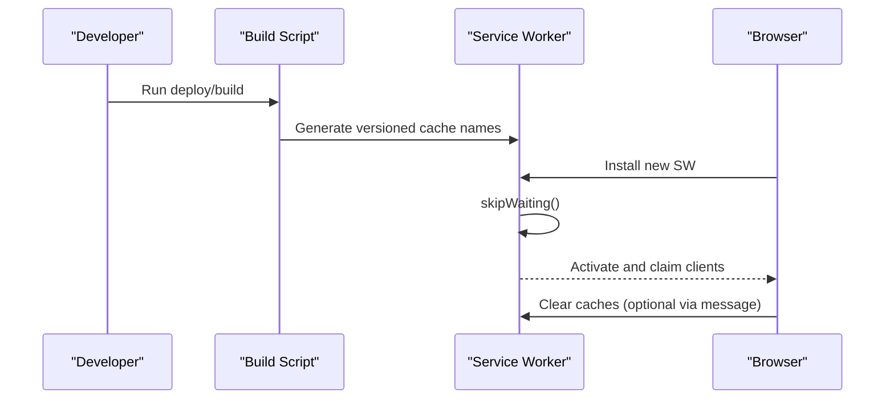
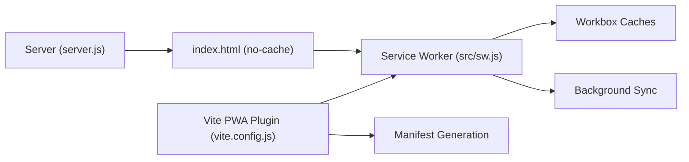

# PWA Security

<cite>
**Referenced Files in This Document**
- [sw.js](file://src/sw.js)
- [manifest.json](file://public/manifest.json)
- [vite.config.js](file://vite.config.js)
- [server.js](file://server.js)
- [index.html](file://index.html)
- [pwaManager.js](file://src/utils/pwaManager.js)
- [usePwaInstall.js](file://src/composables/usePwaInstall.js)
- [update-sw-cache.js](file://scripts/update-sw-cache.js)
</cite>

## Table of Contents
1. Introduction
2. Project Structure
3. Core Components
4. Architecture Overview
5. Detailed Component Analysis
6. Dependency Analysis
7. Performance Considerations
8. Troubleshooting Guide
9. Conclusion
10. Appendices

## Introduction
This document provides a comprehensive security guide for the Progressive Web App (PWA) implementation in the ABSA Foundry Frontend. It focuses on service worker security policies, secure caching strategies, offline data protection, manifest security, Content Security Policy (CSP) considerations, secure background synchronization, secure storage patterns, secure update mechanisms, and mobile-specific security considerations. It also includes testing approaches for PWA security, including offline validation and cache verification.

## Project Structure
The PWA security surface spans several layers:
- Service Worker: enforces HTTPS, defines caching strategies, handles background sync, and manages activation and updates.
- Manifest: declares app metadata and icons; must be served securely and consistently.
- Build and Dev Configuration: injects the service worker via Vite PWA plugin and controls asset inclusion and manifest generation.
- Server: serves index.html without caching to ensure fresh references and sets cache headers for static assets.
- HTML Entry: links the manifest and loads the application; external resources should be vetted for integrity and origin.
- Install UX: composable and manager coordinate install prompts and state safely.

**Diagram sources**
- [sw.js:1-224](file://src/sw.js#L1-L224)
- [manifest.json:1-24](file://public/manifest.json#L1-L24)
- [vite.config.js:11-35](file://vite.config.js#L11-L35)
- [server.js:28-51](file://server.js#L28-L51)
- [index.html:36-43](file://index.html#L36-L43)

**Section sources**
- [sw.js:1-224](file://src/sw.js#L1-L224)
- [manifest.json:1-24](file://public/manifest.json#L1-L24)
- [vite.config.js:11-35](file://vite.config.js#L11-L35)
- [server.js:28-51](file://server.js#L28-L51)
- [index.html:36-43](file://index.html#L36-L43)

## Core Components
- Service Worker (workbox-based):
  - Precaching via workbox-precaching for built assets.
  - Route-based strategies: NetworkFirst for API GETs with short TTL; StaleWhileRevalidate for JS/CSS/JSON; CacheFirst for images/fonts/icons with longer TTL.
  - Enforced HTTPS rewrite for backend requests to eliminate mixed content.
  - Background Sync for POST/PUT/DELETE/PATCH when offline using a named queue.
  - Activation cleanup of stale caches and immediate control via clients.claim().
  - Message handling for skip waiting and manual cache clearing.
- Manifest:
  - Declares name, short_name, start_url, display mode, theme colors, orientation, and icons.
- Build Integration:
  - Vite PWA plugin configured to inject the service worker and generate manifest.
- Server:
  - Serves index.html with no-cache headers to prevent stale shell caching.
  - Aggressive caching for hashed static assets.
- Install UX:
  - Manager and composable orchestrate native install prompts, track user interactions, and manage preferences safely.

**Section sources**
- [sw.js:15-118](file://src/sw.js#L15-L118)
- [sw.js:120-190](file://src/sw.js#L120-L190)
- [sw.js:192-224](file://src/sw.js#L192-L224)
- [manifest.json:1-24](file://public/manifest.json#L1-L24)
- [vite.config.js:11-35](file://vite.config.js#L11-L35)
- [server.js:28-51](file://server.js#L28-L51)
- [pwaManager.js:7-107](file://src/utils/pwaManager.js#L7-L107)
- [usePwaInstall.js:49-83](file://src/composables/usePwaInstall.js#L49-L83)

## Architecture Overview
The PWA architecture secures client-side execution and network interactions through layered controls:
- The service worker intercepts all fetches to backend hosts, rewrites HTTP to HTTPS, and applies strategy-specific caching.
- GET requests use NetworkFirst with strict response status filtering and short expiration to balance freshness and resilience.
- Non-GET requests are attempted online; failures enqueue them for background sync with retention limits.
- Static assets are cached with appropriate strategies and expiration to reduce bandwidth while ensuring updates propagate.
- The server ensures the app shell is never cached aggressively, preventing stale installs or UI states.

**Diagram sources**
- [sw.js:20-118](file://src/sw.js#L20-L118)
- [sw.js:155-190](file://src/sw.js#L155-L190)
- [sw.js:192-224](file://src/sw.js#L192-L224)

## Detailed Component Analysis

### Service Worker Security Policies
- HTTPS Enforcement:
  - All requests to backend hosts are rewritten to HTTPS before being sent, eliminating mixed content risks.
- Secure Caching Strategies:
  - API GETs: NetworkFirst with strict status filtering and short TTL to avoid serving stale or sensitive data too long.
  - Static assets: StaleWhileRevalidate for JS/CSS/JSON with moderate TTL; CacheFirst for images/fonts/icons with longer TTL.
  - Expiration plugins enforce max entries and ages to limit storage growth and reduce attack surface.
- Offline Data Protection:
  - Non-GET requests fail gracefully and are queued for background sync with a bounded retention window.
  - Queued requests are replayed when connectivity resumes.
- Update Mechanisms:
  - Immediate activation via skipWaiting on install and message-driven skip waiting.
  - Manual cache clearing supported via messages.
  - Activation cleans up obsolete caches to prevent version drift.

**Diagram sources**
- [sw.js:20-118](file://src/sw.js#L20-L118)
- [sw.js:120-150](file://src/sw.js#L120-L150)

**Section sources**
- [sw.js:20-118](file://src/sw.js#L20-L118)
- [sw.js:120-150](file://src/sw.js#L120-L150)
- [sw.js:155-190](file://src/sw.js#L155-L190)
- [sw.js:192-224](file://src/sw.js#L192-L224)

### Manifest Security Configurations
- The manifest defines app identity and behavior:
  - start_url set to root path to ensure consistent entry point.
  - display set to standalone for app-like experience.
  - Icons provided at multiple sizes with maskable purpose for adaptive icon support.
- Recommendations:
  - Serve manifest over HTTPS only.
  - Ensure CSP allows loading manifest from same origin.
  - Avoid embedding secrets or tokens in manifest fields.

**Section sources**
- [manifest.json:1-24](file://public/manifest.json#L1-L24)

### CSP Headers for PWA Context
- Current state:
  - No explicit CSP headers are set in the Express server configuration.
- Recommended actions:
  - Add a strict CSP header that restricts script, style, and resource origins to trusted domains.
  - Disallow inline scripts unless necessary; prefer subresource integrity for third-party libraries.
  - Restrict frame ancestors to prevent clickjacking.
  - Ensure upgrade-insecure-requests is enabled if any legacy HTTP resources exist.
- Validation:
  - Use browser developer tools and automated scanners to verify CSP effectiveness.

[No sources needed since this section provides general guidance]

### Secure Background Sync Implementation
- The service worker uses a named background sync queue for non-GET requests when offline.
- Retention is limited to prevent unbounded storage usage.
- On reconnect, queued requests are replayed automatically.

**Diagram sources**
- [sw.js:28-118](file://src/sw.js#L28-L118)
- [sw.js:215-224](file://src/sw.js#L215-L224)

**Section sources**
- [sw.js:28-118](file://src/sw.js#L28-L118)
- [sw.js:215-224](file://src/sw.js#L215-L224)

### Secure Storage Patterns for Offline Data
- Observations:
  - Some modules store JSON payloads in localStorage for offline access.
  - This pattern lacks encryption and may expose sensitive data if device security is compromised.
- Recommendations:
  - Prefer encrypted storage for sensitive offline data (e.g., IndexedDB with encryption wrappers).
  - Minimize sensitive data in caches; rely on server-side authorization for critical operations.
  - Implement cache invalidation and rotation policies aligned with session lifetimes.
  - Use secure cookies or token stores with HttpOnly flags where applicable.

[No sources needed since this section provides general guidance]

### Encryption of Cached Sensitive Information
- Current state:
  - No encryption is applied to cached responses or localStorage data in the analyzed files.
- Recommendations:
  - Encrypt sensitive payloads before caching or storing locally.
  - Use platform-provided secure storage APIs where available.
  - Rotate keys regularly and bind key material to device or session context.

[No sources needed since this section provides general guidance]

### Secure Update Mechanisms
- The service worker:
  - Skips waiting on install to activate immediately.
  - Supports message-driven skip waiting and manual cache clearing.
  - Cleans up old caches upon activation.
- Build integration:
  - Vite PWA plugin injects the service worker and generates manifest.
  - A helper script can version cache names to force cache busting during deployments.

**Diagram sources**
- [sw.js:192-213](file://src/sw.js#L192-L213)
- [update-sw-cache.js:8-35](file://scripts/update-sw-cache.js#L8-L35)
- [vite.config.js:11-35](file://vite.config.js#L11-L35)

**Section sources**
- [sw.js:192-213](file://src/sw.js#L192-L213)
- [update-sw-cache.js:8-35](file://scripts/update-sw-cache.js#L8-L35)
- [vite.config.js:11-35](file://vite.config.js#L11-L35)

### Validating Cached Resources
- The service worker:
  - Uses CacheableResponsePlugin to cache only specific statuses for API GETs.
  - Applies expiration policies to limit cache age and size.
- Recommendations:
  - Validate resource integrity using Subresource Integrity (SRI) for third-party scripts/styles.
  - Periodically audit cache contents and remove outdated entries.

**Section sources**
- [sw.js:75-94](file://src/sw.js#L75-L94)
- [sw.js:120-150](file://src/sw.js#L120-L150)

### Handling Secure WebSocket Connections in PWA Context
- Current state:
  - No WebSocket handling is present in the analyzed service worker or server code.
- Recommendations:
  - Use wss:// endpoints exclusively.
  - Apply TLS termination at the edge/proxy.
  - Authenticate connections using tokens passed via handshake parameters or headers, validated server-side.
  - Limit message rates and validate payloads server-side.

[No sources needed since this section provides general guidance]

### Mobile-Specific Security Considerations
- Install UX:
  - The manager and composable handle native prompts, track dismissals, and respect cooldowns to avoid intrusive behavior.
- Platform features:
  - Detect installed state via display-mode and navigator.standalone.
  - Provide fallback instructions when native prompts are unavailable.
- Sandbox and OS protections:
  - Rely on browser sandboxing and OS-level app isolation.
  - Avoid storing secrets in plain text; leverage secure storage APIs.

**Section sources**
- [pwaManager.js:7-107](file://src/utils/pwaManager.js#L7-L107)
- [usePwaInstall.js:11-47](file://src/composables/usePwaInstall.js#L11-L47)
- [usePwaInstall.js:49-83](file://src/composables/usePwaInstall.js#L49-L83)

## Dependency Analysis
The PWA security depends on coordinated behavior across build-time, runtime, and server configurations:
- Vite PWA plugin injects the service worker and manifest into the build output.
- The server configures cache headers for the app shell and static assets.
- The service worker orchestrates network interception, caching, and background sync.

**Diagram sources**
- [vite.config.js:11-35](file://vite.config.js#L11-L35)
- [server.js:28-51](file://server.js#L28-L51)
- [sw.js:15-190](file://src/sw.js#L15-L190)

**Section sources**
- [vite.config.js:11-35](file://vite.config.js#L11-L35)
- [server.js:28-51](file://server.js#L28-L51)
- [sw.js:15-190](file://src/sw.js#L15-L190)

## Performance Considerations
- Short-lived API cache reduces stale data exposure and improves responsiveness.
- Long-lived asset caches minimize bandwidth and improve load times.
- Background sync defers heavy operations until connectivity is available.
- Immediate service worker activation ensures consistent behavior after updates.

[No sources needed since this section provides general guidance]

## Troubleshooting Guide
- Mixed content issues:
  - Verify that all backend requests are intercepted and rewritten to HTTPS by the service worker.
- Stale app shell:
  - Ensure index.html is served with no-cache headers to always fetch the latest bundle references.
- Cache bloat:
  - Confirm expiration policies are active and old caches are cleaned on activation.
- Background sync not firing:
  - Check that non-GET requests are queued and that the correct tag is used for replay.
- Manual cache clear:
  - Use the message handler to clear caches when diagnosing issues.

**Section sources**
- [sw.js:20-118](file://src/sw.js#L20-L118)
- [sw.js:155-190](file://src/sw.js#L155-L190)
- [sw.js:192-213](file://src/sw.js#L192-L213)
- [server.js:28-43](file://server.js#L28-L43)

## Conclusion
The ABSA Foundry Frontend PWA implements robust security measures through its service worker, including enforced HTTPS, strategic caching, and resilient background sync. While there are opportunities to strengthen security—such as adding CSP headers, encrypting sensitive offline data, and validating third-party resources—the current design provides a solid foundation for secure offline-first operation. Continuous monitoring, periodic audits, and adherence to recommended hardening practices will further enhance the security posture.

## Appendices

### Testing Approaches for PWA Security
- Offline security testing:
  - Simulate network loss to verify background sync queuing and replay behavior.
  - Validate that non-GET requests are not executed insecurely and are properly deferred.
- Cache validation:
  - Inspect cache storage to confirm correct cache names, TTLs, and entry counts.
  - Trigger service worker updates and verify cache cleanup and activation flow.
- CSP validation:
  - Add CSP headers and test for blocked resources; adjust directives to allow only trusted sources.
- Install UX:
  - Test native prompt availability and fallback instructions across platforms.
  - Verify dismissal logic and cooldown behavior.

[No sources needed since this section provides general guidance]