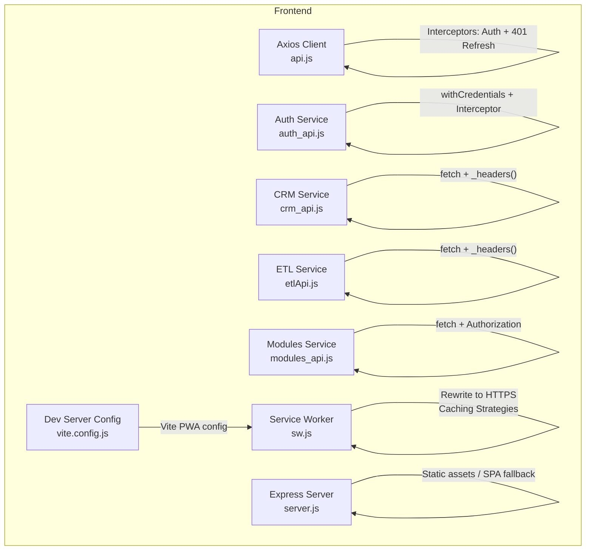
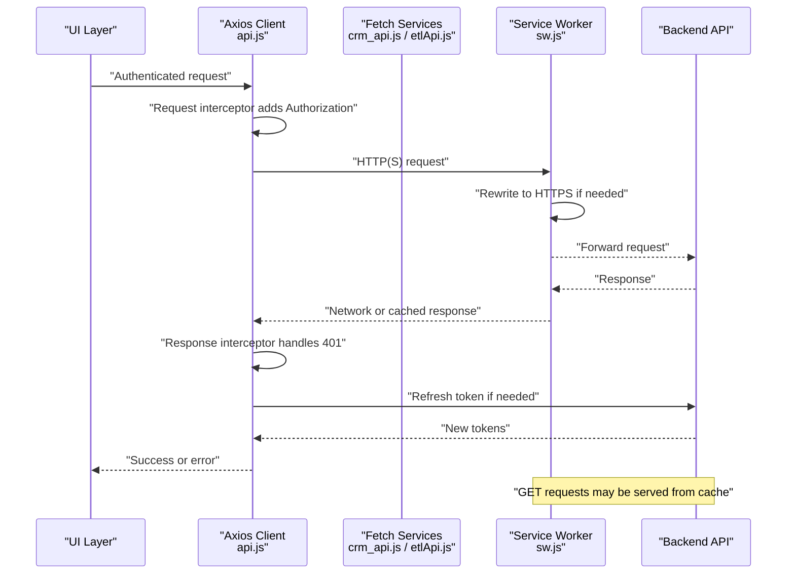
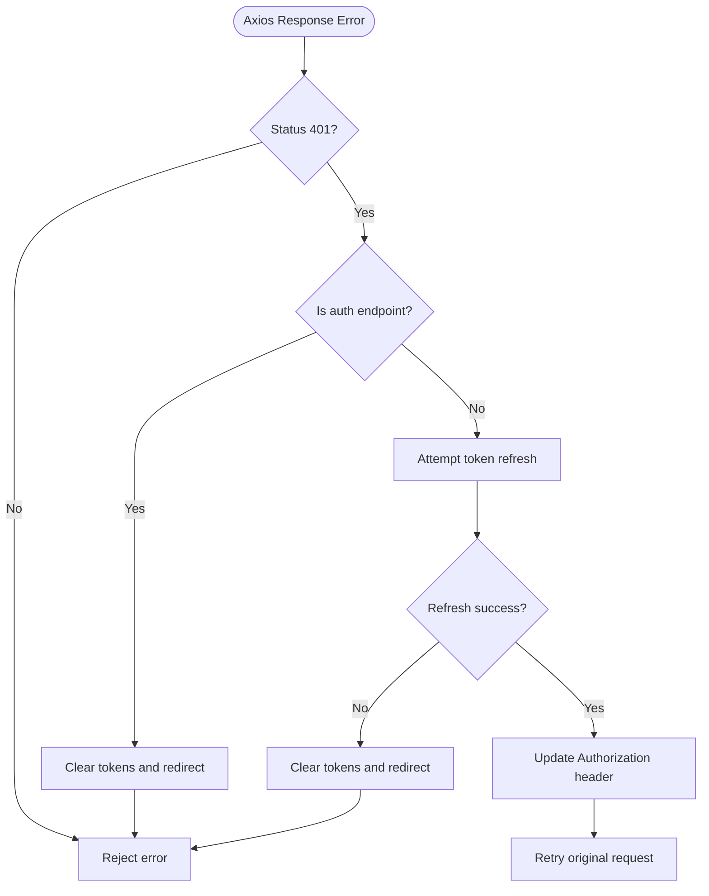
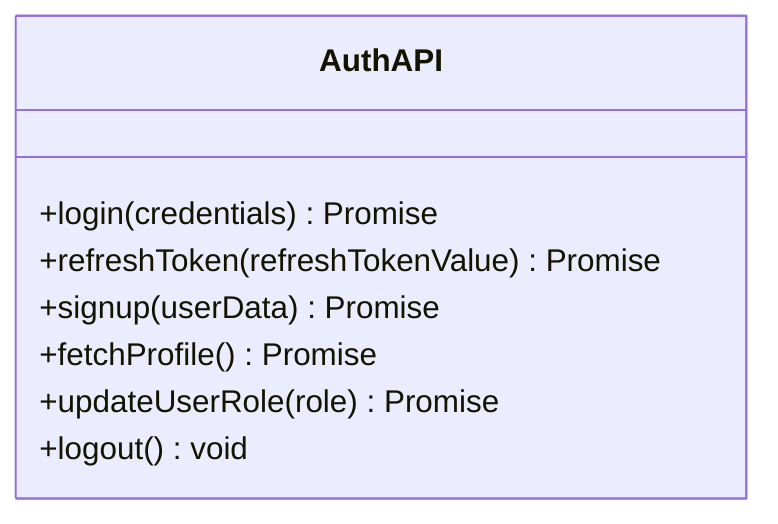
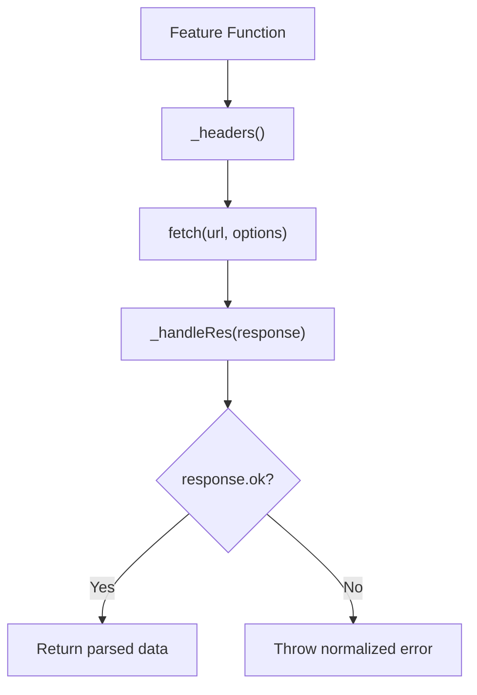
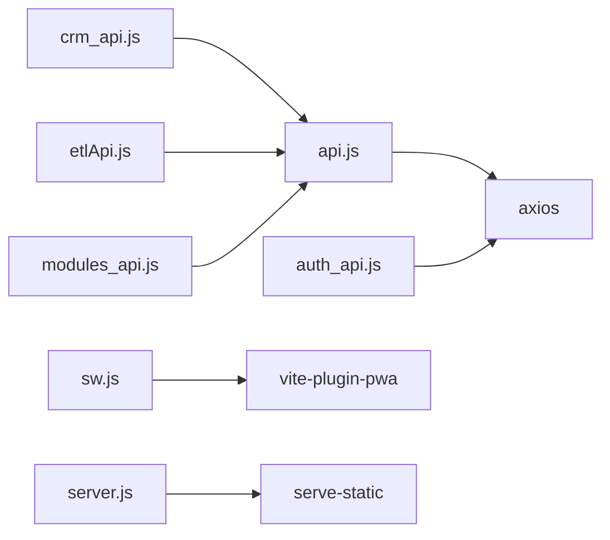

# Secure API Communication

<cite>
**Referenced Files in This Document**
- [api.js](file://src/services/api.js)
- [auth_api.js](file://src/services/auth_api.js)
- [crm_api.js](file://src/services/crm_api.js)
- [etlApi.js](file://src/services/etlApi.js)
- [modules_api.js](file://src/services/modules_api.js)
- [requestLogger.js](file://src/utils/requestLogger.js)
- [auth.js](file://src/stores/auth.js)
- [sw.js](file://src/sw.js)
- [vite.config.js](file://vite.config.js)
- [server.js](file://server.js)
- [AUTH-INTEGRATION.md](file://docs/AUTH-INTEGRATION.md)
</cite>

## Table of Contents
1. [Introduction](#introduction)
2. [Project Structure](#project-structure)
3. [Core Components](#core-components)
4. [Architecture Overview](#architecture-overview)
5. [Detailed Component Analysis](#detailed-component-analysis)
6. [Dependency Analysis](#dependency-analysis)
7. [Performance Considerations](#performance-considerations)
8. [Troubleshooting Guide](#troubleshooting-guide)
9. [Conclusion](#conclusion)
10. [Appendices](#appendices)

## Introduction
This document explains how the ABSA Foundry Frontend implements secure API communication. It covers centralized HTTP clients, authentication header injection, token refresh flows, error handling, CORS and HTTPS enforcement via service worker, secure cookie usage, logging for debugging without leaking secrets, and patterns for retry, cancellation, timeouts, versioning, rate limiting, sensitive data handling, encryption considerations, caching strategies, and testing approaches using mocks.

## Project Structure
The frontend uses a mix of Axios and native fetch across services:
- Centralized Axios client with interceptors in api.js for auth header injection and 401 handling.
- Feature-specific services (CRM, ETL, modules) that use fetch with consistent headers and response handling.
- A separate auth_api.js module with its own Axios instance and withCredentials usage.
- A service worker sw.js that rewrites requests to HTTPS and applies caching strategies.
- A dev server configuration in vite.config.js and a simple Express server in server.js for static serving.

**Diagram sources**
- [api.js:64-146](file://src/services/api.js#L64-L146)
- [auth_api.js:10-27](file://src/services/auth_api.js#L10-L27)
- [crm_api.js:3-32](file://src/services/crm_api.js#L3-L32)
- [etlApi.js:10-38](file://src/services/etlApi.js#L10-L38)
- [modules_api.js:26-34](file://src/services/modules_api.js#L26-L34)
- [sw.js:36-100](file://src/sw.js#L36-L100)
- [vite.config.js:11-35](file://vite.config.js#L11-L35)
- [server.js:37-70](file://server.js#L37-L70)

**Section sources**
- [api.js:1-18](file://src/services/api.js#L1-L18)
- [auth_api.js:1-17](file://src/services/auth_api.js#L1-L17)
- [crm_api.js:1-32](file://src/services/crm_api.js#L1-L32)
- [etlApi.js:1-38](file://src/services/etlApi.js#L1-L38)
- [modules_api.js:1-34](file://src/services/modules_api.js#L1-L34)
- [sw.js:36-100](file://src/sw.js#L36-L100)
- [vite.config.js:11-35](file://vite.config.js#L11-L35)
- [server.js:37-70](file://server.js#L37-L70)

## Core Components
- Centralized Axios client with request/response interceptors for authentication and token refresh.
- Feature services using fetch with shared helpers for headers and error normalization.
- Service worker enforcing HTTPS and applying network-first caching for GETs.
- Dev server configuration enabling PWA and static asset serving.

Key responsibilities:
- Inject Authorization headers consistently.
- Handle 401 by refreshing tokens and retrying original requests.
- Normalize errors and propagate meaningful messages.
- Enforce HTTPS at the service worker layer.
- Provide safe logging utilities that avoid leaking secrets.

**Section sources**
- [api.js:64-146](file://src/services/api.js#L64-L146)
- [auth_api.js:10-27](file://src/services/auth_api.js#L10-L27)
- [crm_api.js:3-32](file://src/services/crm_api.js#L3-L32)
- [etlApi.js:10-38](file://src/services/etlApi.js#L10-L38)
- [sw.js:36-100](file://src/sw.js#L36-L100)

## Architecture Overview
The system composes multiple layers to ensure secure and resilient API calls:
- Application layer: feature services call backend endpoints with proper headers.
- HTTP layer: Axios interceptors attach tokens and handle 401; fetch-based services use helper functions for headers and error handling.
- Transport layer: Service worker rewrites URLs to HTTPS and caches GET responses.
- Build/runtime: Vite PWA plugin registers the service worker; Express serves static assets.

**Diagram sources**
- [api.js:64-146](file://src/services/api.js#L64-L146)
- [sw.js:36-100](file://src/sw.js#L36-L100)
- [crm_api.js:3-32](file://src/services/crm_api.js#L3-L32)
- [etlApi.js:10-38](file://src/services/etlApi.js#L10-L38)

## Detailed Component Analysis

### Centralized Axios Client (api.js)
- Base URL resolution supports environment overrides and defaults to localhost in development or a hosted backend otherwise.
- Request interceptor attaches Authorization header from stored token.
- Response interceptor:
  - Detects 401 and attempts token refresh using refresh_token.
  - Queues concurrent requests during refresh and retries them after obtaining new tokens.
  - Clears tokens and redirects on persistent failures.
- Utility functions for login, signup, logout, and token refresh are provided.

Security notes:
- Tokens are read from localStorage and injected into Authorization headers.
- Sensitive endpoints like /auth/login and /auth/refresh are excluded from retry loops to prevent loops.

**Diagram sources**
- [api.js:78-146](file://src/services/api.js#L78-L146)

**Section sources**
- [api.js:1-18](file://src/services/api.js#L1-L18)
- [api.js:64-146](file://src/services/api.js#L64-L146)
- [api.js:149-209](file://src/services/api.js#L149-L209)

### Auth Service (auth_api.js)
- Creates an Axios instance with baseURL set to the auth domain and withCredentials enabled for cookie-based sessions where applicable.
- Adds Authorization header via interceptor when token exists.
- Provides login, refresh, signup, profile fetch, role update, and logout methods.
- Normalizes errors and clears tokens on failure.

Security notes:
- Uses withCredentials to support secure cookies when configured by the backend.
- Stores tokens in both access_token and token keys for compatibility.

**Diagram sources**
- [auth_api.js:10-27](file://src/services/auth_api.js#L10-L27)
- [auth_api.js:36-143](file://src/services/auth_api.js#L36-L143)

**Section sources**
- [auth_api.js:1-17](file://src/services/auth_api.js#L1-L17)
- [auth_api.js:36-143](file://src/services/auth_api.js#L36-L143)

### CRM Service (crm_api.js)
- Uses fetch with a shared _headers function that injects Authorization based on stored token.
- Implements a consistent _handleRes function that parses JSON safely and throws normalized errors with status and data fields.
- Exposes comprehensive CRUD operations for leads, customers, accounts, deals, communications, notifications, activities, visits, meetings, and more.

Security notes:
- Avoids sending empty or undefined parameters through sanitization helpers.
- Errors include status and parsed data for better diagnostics.

**Diagram sources**
- [crm_api.js:3-32](file://src/services/crm_api.js#L3-L32)

**Section sources**
- [crm_api.js:3-32](file://src/services/crm_api.js#L3-L32)
- [crm_api.js:46-800](file://src/services/crm_api.js#L46-L800)

### ETL Service (etlApi.js)
- Similar pattern to CRM: shared _headers and _handleRes for consistent security and error handling.
- Provides dashboard fetching, run detail retrieval, config listing, and pipeline triggering.

Security notes:
- Sanitizes query parameters to avoid sending empty or invalid values.
- Normalizes FastAPI-style validation errors into user-friendly messages.

**Section sources**
- [etlApi.js:10-38](file://src/services/etlApi.js#L10-L38)
- [etlApi.js:68-115](file://src/services/etlApi.js#L68-L115)

### Modules Service (modules_api.js)
- Reads tenant ID and token from JWT decoding utilities and attaches Authorization headers.
- Checks module subscriptions and retrieves available modules.

Security notes:
- Validates presence of tenant ID before making requests.
- Handles non-ok responses gracefully by returning safe defaults.

**Section sources**
- [modules_api.js:16-50](file://src/services/modules_api.js#L16-L50)
- [modules_api.js:56-87](file://src/services/modules_api.js#L56-L87)
- [modules_api.js:93-121](file://src/services/modules_api.js#L93-L121)
- [modules_api.js:127-152](file://src/services/modules_api.js#L127-L152)
- [modules_api.js:160-215](file://src/services/modules_api.js#L160-L215)

### Logging Utility (requestLogger.js)
- Wraps fetch to log method, URL, payload, and response body/status.
- Safely parses JSON payloads and falls back to raw text when necessary.
- Explicitly avoids logging Authorization headers or other secrets.

Usage guidance:
- Use loggedFetch only in development or when explicitly enabled.
- Ensure production builds strip or disable logging to prevent secret exposure.

**Section sources**
- [requestLogger.js:1-34](file://src/utils/requestLogger.js#L1-L34)

### Service Worker (sw.js)
- Rewrites all backend requests to HTTPS to enforce secure transport.
- Applies NetworkFirst strategy for GET requests with caching and expiration.
- For POST/PUT/DELETE, forwards to network and handles offline scenarios.

Security notes:
- Forces HTTPS regardless of initial protocol.
- Preserves credentials and CORS mode for API requests.

**Section sources**
- [sw.js:36-100](file://src/sw.js#L36-L100)

### Build and Server Configuration
- Vite PWA configuration registers the service worker and defines manifest details.
- Express server sets cache-control headers for HTML and serves static assets with aggressive caching.

Security notes:
- No-cache headers for index.html help ensure fresh app shell.
- Static assets benefit from long-lived caching with ETag and Last-Modified.

**Section sources**
- [vite.config.js:11-35](file://vite.config.js#L11-L35)
- [server.js:37-70](file://server.js#L37-L70)

## Dependency Analysis
- api.js depends on axios and router; it centralizes auth header injection and 401 handling.
- Feature services depend on api.js for BASE_URL and often implement their own fetch wrappers for consistency.
- auth_api.js creates a dedicated Axios instance with withCredentials for cookie-aware flows.
- sw.js is registered by Vite PWA and affects all outbound network requests.
- server.js provides static serving and caching behavior for the built application.

**Diagram sources**
- [api.js:1-18](file://src/services/api.js#L1-L18)
- [auth_api.js:1-17](file://src/services/auth_api.js#L1-L17)
- [crm_api.js:1-32](file://src/services/crm_api.js#L1-L32)
- [etlApi.js:1-38](file://src/services/etlApi.js#L1-L38)
- [modules_api.js:1-34](file://src/services/modules_api.js#L1-L34)
- [vite.config.js:11-35](file://vite.config.js#L11-L35)
- [server.js:37-70](file://server.js#L37-L70)

**Section sources**
- [api.js:1-18](file://src/services/api.js#L1-L18)
- [auth_api.js:1-17](file://src/services/auth_api.js#L1-L17)
- [crm_api.js:1-32](file://src/services/crm_api.js#L1-L32)
- [etlApi.js:1-38](file://src/services/etlApi.js#L1-L38)
- [modules_api.js:1-34](file://src/services/modules_api.js#L1-L34)
- [vite.config.js:11-35](file://vite.config.js#L11-L35)
- [server.js:37-70](file://server.js#L37-L70)

## Performance Considerations
- Caching: Service worker caches GET responses with expiration to reduce latency and bandwidth.
- Token refresh batching: Concurrent 401s are queued and retried after a single refresh to minimize redundant calls.
- Parameter sanitization: Prevents unnecessary network calls caused by empty or invalid query parameters.
- Static asset caching: Long-lived caching for JS/CSS/images improves load times.

Recommendations:
- Add explicit timeouts per request to avoid hanging calls.
- Implement exponential backoff for retries on transient errors (e.g., 5xx).
- Use AbortController for request cancellation on navigation or unmount.
- Apply rate limiting at the client level to respect backend limits and avoid 429s.

[No sources needed since this section provides general guidance]

## Troubleshooting Guide
Common issues and resolutions:
- 401 Unauthorized:
  - The Axios response interceptor attempts token refresh; if refresh fails, tokens are cleared and users are redirected to login.
  - Ensure refresh_token is present and valid; clear stale tokens if necessary.
- Network errors:
  - Service worker enforces HTTPS; verify backend is reachable over HTTPS.
  - Check CORS settings on the backend to allow the frontend origin.
- Logging leaks:
  - Ensure requestLogger does not print Authorization headers; use environment flags to enable logging only in development.

Operational checks:
- Verify BASE_URL resolves correctly in dev vs. production.
- Confirm service worker registration and HTTPS rewrite behavior.
- Validate that feature services normalize errors consistently.

**Section sources**
- [api.js:78-146](file://src/services/api.js#L78-L146)
- [sw.js:36-100](file://src/sw.js#L36-L100)
- [requestLogger.js:1-34](file://src/utils/requestLogger.js#L1-L34)

## Conclusion
The ABSA Foundry Frontend employs a layered approach to secure API communication:
- Centralized Axios interceptors handle authentication and token refresh.
- Feature services standardize headers and error handling.
- The service worker enforces HTTPS and optimizes performance via caching.
- Logging utilities provide debuggability without exposing secrets.
Adopting timeouts, retries with backoff, cancellation, rate limiting, and robust testing will further strengthen security and reliability.

[No sources needed since this section summarizes without analyzing specific files]

## Appendices

### Secure HTTP Methods and Error Propagation
- Use POST/PUT/PATCH/DELETE with JSON payloads and Authorization headers.
- Normalize errors to include status and parsed data for consistent handling.
- Avoid logging sensitive headers; sanitize payloads before logging.

**Section sources**
- [crm_api.js:3-32](file://src/services/crm_api.js#L3-L32)
- [etlApi.js:10-38](file://src/services/etlApi.js#L10-L38)
- [requestLogger.js:1-34](file://src/utils/requestLogger.js#L1-L34)

### CORS Configuration and HTTPS Enforcement
- Backend must allow the frontend origin and credentials if cookies are used.
- Service worker rewrites requests to HTTPS to ensure secure transport.

**Section sources**
- [sw.js:36-100](file://src/sw.js#L36-L100)

### Secure Cookie Handling
- auth_api.js enables withCredentials for cookie-based sessions.
- Ensure backend sets HttpOnly, Secure, SameSite attributes for cookies.

**Section sources**
- [auth_api.js:10-17](file://src/services/auth_api.js#L10-L17)

### Retry Logic with Exponential Backoff
- Implement client-side retry with exponential backoff for transient errors (5xx, network failures).
- Respect Retry-After headers when present.

[No sources needed since this section provides general guidance]

### Request Cancellation and Timeout Handling
- Use AbortController to cancel in-flight requests on navigation or component unmount.
- Set per-request timeouts to prevent hanging calls.

[No sources needed since this section provides general guidance]

### API Versioning Strategies
- Prefix endpoints with version segments (e.g., /api/v1/...) to maintain backward compatibility.
- Communicate deprecation timelines and provide migration guides.

[No sources needed since this section provides general guidance]

### Rate Limiting Implementation
- Track request counts per user/session and throttle accordingly.
- Honor backend rate limit responses and inform users with friendly messages.

[No sources needed since this section provides general guidance]

### Request/Response Logging for Debugging
- Use loggedFetch to capture method, URL, payload, and response details.
- Exclude Authorization headers and sensitive fields from logs.

**Section sources**
- [requestLogger.js:1-34](file://src/utils/requestLogger.js#L1-L34)

### Sensitive Data Handling and Encryption
- Avoid storing sensitive data in localStorage beyond tokens; prefer short-lived sessions.
- Encrypt payloads at rest if required by policy; ensure keys are managed securely.
- Minimize sensitive data in URLs and query strings.

[No sources needed since this section provides general guidance]

### Secure Caching Strategies
- Cache GET responses with expiration; invalidate on mutations.
- Do not cache sensitive or user-specific data unless properly scoped.

**Section sources**
- [sw.js:76-94](file://src/sw.js#L76-L94)

### Testing Approaches for API Security
- Use axios-mock-adapter to mock backend responses and simulate 401/429 scenarios.
- Test token refresh flow, error propagation, and redirection on logout.
- Validate that logging utilities do not leak secrets in test outputs.

**Section sources**
- [package.json:74-75](file://package.json#L74-L75)

### Authentication Flow Reference
- Follow the documented login, refresh, and logout endpoints and error codes.
- Store tokens securely and clear them on logout.

**Section sources**
- [AUTH-INTEGRATION.md:10-128](file://docs/AUTH-INTEGRATION.md#L10-L128)
- [AUTH-INTEGRATION.md:782-804](file://docs/AUTH-INTEGRATION.md#L782-L804)