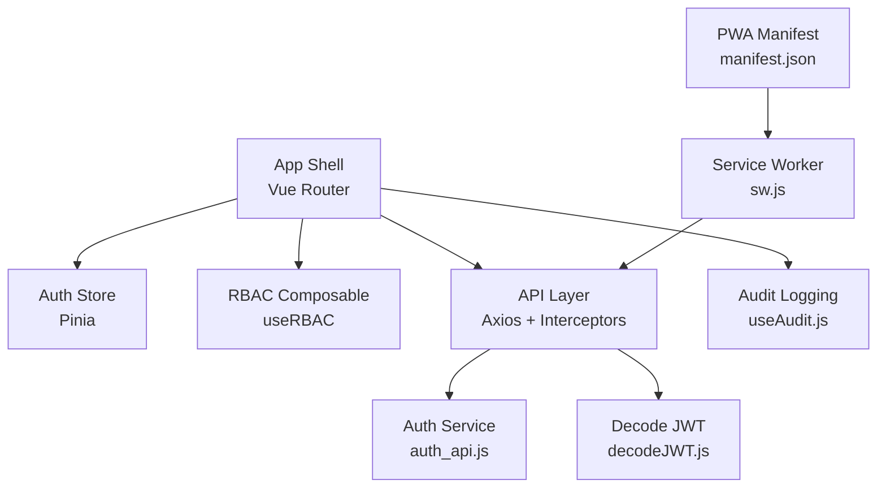
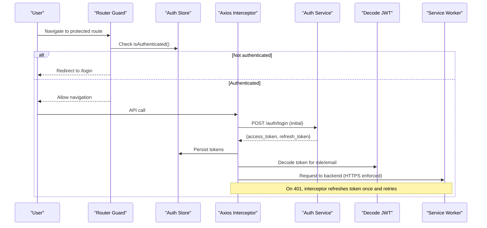
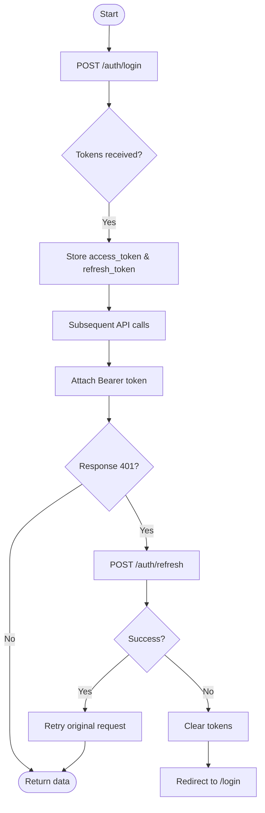
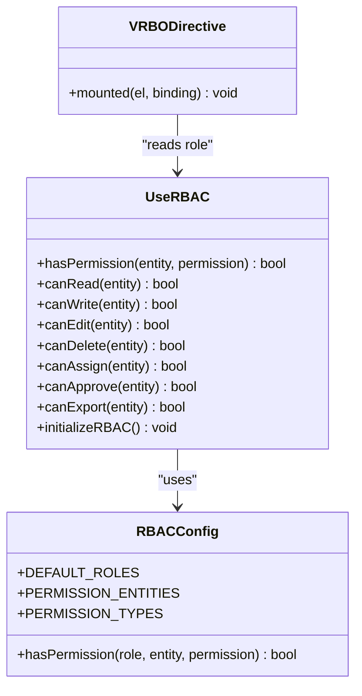
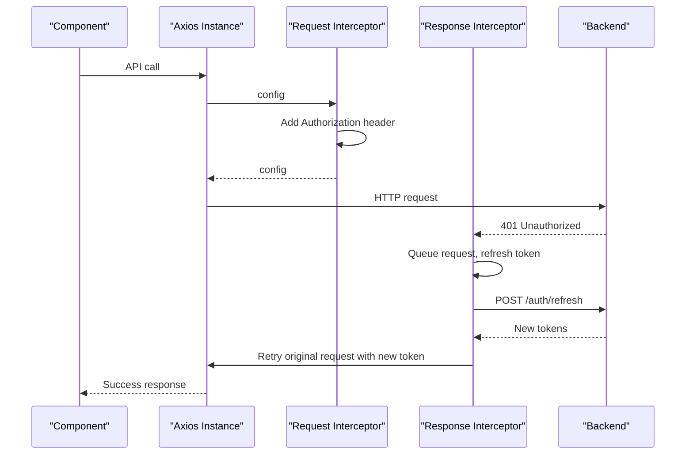
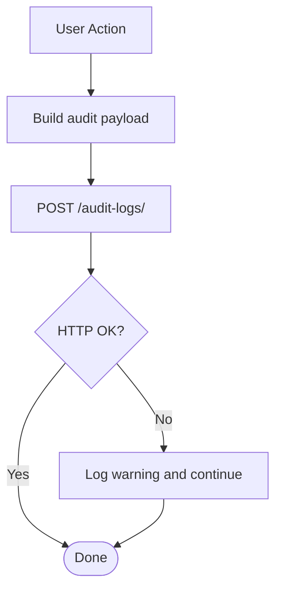
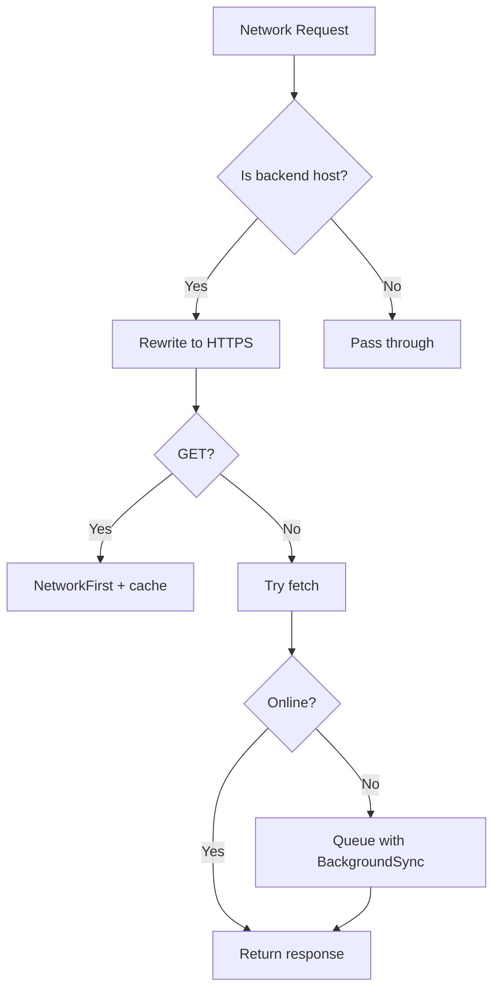
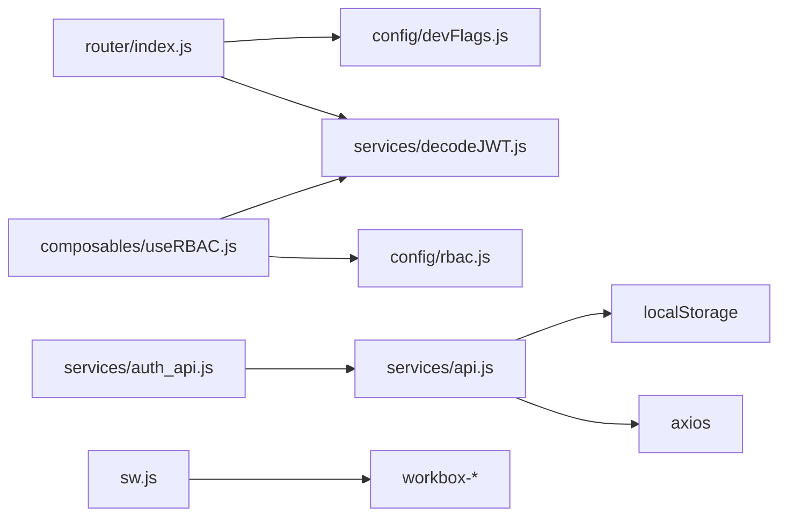

# Security Architecture

<cite>
**Referenced Files in This Document**
- [vite.config.js](file://vite.config.js)
- [src/sw.js](file://src/sw.js)
- [public/manifest.json](file://public/manifest.json)
- [src/services/api.js](file://src/services/api.js)
- [src/services/auth_api.js](file://src/services/auth_api.js)
- [src/services/decodeJWT.js](file://src/services/decodeJWT.js)
- [src/router/index.js](file://src/router/index.js)
- [src/stores/auth.js](file://src/stores/auth.js)
- [src/utils/v-role.js](file://src/utils/v-role.js)
- [src/config/rbac.js](file://src/config/rbac.js)
- [src/composables/useRBAC.js](file://src/composables/useRBAC.js)
- [src/config/useAudit.js](file://src/config/useAudit.js)
- [src/services/audit_log.js](file://src/services/audit_log.js)
</cite>

## Table of Contents
1. Introduction
2. Project Structure
3. Core Components
4. Architecture Overview
5. Detailed Component Analysis
6. Dependency Analysis
7. Performance Considerations
8. Troubleshooting Guide
9. Conclusion
10. Appendices

## Introduction
This document describes the security architecture of the ABSA Foundry Frontend with a focus on:
- JWT-based authentication, token lifecycle, and automatic logout on expiration
- Role-based access control (RBAC) for UI and routes
- Secure API communication using Axios interceptors and error handling
- Input validation strategies, XSS prevention, and CSRF considerations
- Audit logging for user actions and system events
- PWA security via service worker policies and offline data protection
- Security headers, content security policy (CSP), and vulnerability scanning practices
- Data encryption at rest and in transit, secure storage patterns, and banking compliance considerations

## Project Structure
The frontend is a Vue 3 application built with Vite and enhanced with a PWA via Workbox. Security-critical modules are distributed across services, composables, router guards, and configuration files. The service worker enforces HTTPS for backend requests and provides offline resilience with background sync.

**Diagram sources**
- [src/router/index.js:1-275](file://src/router/index.js#L1-L275)
- [src/stores/auth.js:1-22](file://src/stores/auth.js#L1-L22)
- [src/composables/useRBAC.js:1-783](file://src/composables/useRBAC.js#L1-L783)
- [src/services/api.js:1-209](file://src/services/api.js#L1-L209)
- [src/services/auth_api.js:1-190](file://src/services/auth_api.js#L1-L190)
- [src/services/decodeJWT.js:1-164](file://src/services/decodeJWT.js#L1-L164)
- [src/config/useAudit.js:1-76](file://src/config/useAudit.js#L1-L76)
- [src/sw.js:1-224](file://src/sw.js#L1-L224)
- [public/manifest.json:1-24](file://public/manifest.json#L1-L24)

**Section sources**
- [vite.config.js:1-41](file://vite.config.js#L1-L41)
- [src/sw.js:1-224](file://src/sw.js#L1-L224)
- [public/manifest.json:1-24](file://public/manifest.json#L1-L24)

## Core Components
- Authentication and Token Management: Centralized login, refresh, and logout flows; token stored in localStorage; automatic logout on expiry or invalidation.
- RBAC: Role definitions, permission checks, and UI directives to hide unauthorized elements; route-level authorization via router guards.
- Secure API Communication: Axios request/response interceptors attach tokens, handle 401s by refreshing tokens, and queue concurrent requests during refresh.
- Audit Logging: Lightweight composable to post audit events to the backend without breaking user workflows.
- PWA Security: Service worker forces HTTPS for backend calls, caches assets strategically, and queues mutations offline with background sync.

**Section sources**
- [src/services/auth_api.js:1-190](file://src/services/auth_api.js#L1-L190)
- [src/services/api.js:1-209](file://src/services/api.js#L1-L209)
- [src/services/decodeJWT.js:1-164](file://src/services/decodeJWT.js#L1-L164)
- [src/router/index.js:1-275](file://src/router/index.js#L1-L275)
- [src/composables/useRBAC.js:1-783](file://src/composables/useRBAC.js#L1-L783)
- [src/config/rbac.js:1-753](file://src/config/rbac.js#L1-L753)
- [src/config/useAudit.js:1-76](file://src/config/useAudit.js#L1-L76)
- [src/sw.js:1-224](file://src/sw.js#L1-L224)

## Architecture Overview
The security architecture combines client-side controls with server-enforced policies:
- Tokens are issued by the backend and stored in localStorage.
- Axios interceptors automatically attach Authorization headers and handle token refresh on 401 responses.
- Route guards enforce authentication and module access before rendering protected views.
- RBAC composable and v-role directive enforce UI-level permissions based on roles and entity-specific permissions.
- Service worker ensures all backend traffic uses HTTPS and supports offline mutation queuing.

**Diagram sources**
- [src/router/index.js:201-272](file://src/router/index.js#L201-L272)
- [src/stores/auth.js:1-22](file://src/stores/auth.js#L1-L22)
- [src/services/api.js:64-146](file://src/services/api.js#L64-L146)
- [src/services/auth_api.js:36-87](file://src/services/auth_api.js#L36-L87)
- [src/services/decodeJWT.js:11-96](file://src/services/decodeJWT.js#L11-L96)
- [src/sw.js:20-118](file://src/sw.js#L20-L118)

## Detailed Component Analysis

### JWT-Based Authentication Flow
- Login: Credentials sent to backend; access and refresh tokens stored in localStorage.
- Token Attachment: Axios request interceptor adds Authorization header from localStorage.
- Token Refresh: On 401, a single refresh flow runs; concurrent requests are queued and retried after success.
- Expiration Handling: Decoding validates exp; expired tokens trigger logout and redirect.
- Logout: Clears local tokens and navigates to login.

**Diagram sources**
- [src/services/auth_api.js:36-87](file://src/services/auth_api.js#L36-L87)
- [src/services/api.js:64-146](file://src/services/api.js#L64-L146)
- [src/services/decodeJWT.js:11-96](file://src/services/decodeJWT.js#L11-L96)

**Section sources**
- [src/services/auth_api.js:36-115](file://src/services/auth_api.js#L36-L115)
- [src/services/api.js:64-146](file://src/services/api.js#L64-L146)
- [src/services/decodeJWT.js:11-96](file://src/services/decodeJWT.js#L11-L96)
- [src/stores/auth.js:1-22](file://src/stores/auth.js#L1-L22)

### Role-Based Access Control (RBAC)
- Role Definitions: Default roles and per-entity permissions are defined centrally.
- Permission Checks: Composable exposes canRead/canWrite/etc., and integrates with dev bypass flags for development.
- UI Permissions: v-role directive removes DOM nodes when the current user lacks required roles.
- Route-Level Authorization: Router guard enforces authentication and module access for dashboard routes.

**Diagram sources**
- [src/composables/useRBAC.js:55-137](file://src/composables/useRBAC.js#L55-L137)
- [src/config/rbac.js:85-337](file://src/config/rbac.js#L85-L337)
- [src/utils/v-role.js:1-12](file://src/utils/v-role.js#L1-L12)

**Section sources**
- [src/config/rbac.js:85-337](file://src/config/rbac.js#L85-L337)
- [src/composables/useRBAC.js:55-137](file://src/composables/useRBAC.js#L55-L137)
- [src/utils/v-role.js:1-12](file://src/utils/v-role.js#L1-L12)
- [src/router/index.js:201-272](file://src/router/index.js#L201-L272)

### Secure API Communication Patterns
- Request Interceptor: Automatically attaches Authorization header if token exists.
- Response Interceptor: Handles 401 by refreshing tokens once, retrying queued requests, and clearing tokens on failure.
- Base URL Resolution: Centralized base URL used across services for consistent endpoints.
- Error Normalization: Services parse backend error payloads into structured errors.

**Diagram sources**
- [src/services/api.js:64-146](file://src/services/api.js#L64-L146)
- [src/services/auth_api.js:21-27](file://src/services/auth_api.js#L21-L27)

**Section sources**
- [src/services/api.js:1-209](file://src/services/api.js#L1-L209)
- [src/services/auth_api.js:1-190](file://src/services/auth_api.js#L1-L190)

### Input Validation, XSS Prevention, and CSRF Protection
- Input Validation: Client-side sanitization helpers exist in some services; ensure all user inputs are validated and sanitized before sending to backend.
- XSS Prevention: Prefer Vue’s templating which escapes by default; avoid v-html with untrusted content; sanitize any dynamic HTML.
- CSRF: Since the app uses bearer tokens in headers, CSRF is not applicable in the traditional cookie-same-site sense. Ensure cookies are not used for auth unless necessary.

[No sources needed since this section provides general guidance]

### Audit Logging
- Composable: useAudit posts structured events including user identity, role, action, module, and details.
- Resilience: Failures do not break calling features; logs warnings only.
- Alternative Endpoint: A simpler logAuditEvent helper exists for quick integration.

**Diagram sources**
- [src/config/useAudit.js:19-75](file://src/config/useAudit.js#L19-L75)

**Section sources**
- [src/config/useAudit.js:1-76](file://src/config/useAudit.js#L1-L76)
- [src/services/audit_log.js:1-20](file://src/services/audit_log.js#L1-L20)

### PWA Security Considerations
- HTTPS Enforcement: Service worker rewrites backend requests to HTTPS to prevent mixed content.
- Caching Strategy: NetworkFirst for APIs with short TTL; StaleWhileRevalidate for static assets; CacheFirst for images/fonts.
- Offline Mutation Queue: BackgroundSync queues POST/PUT/DELETE when offline and replays when online.
- Manifest: Declares standalone display and icons for secure installation.

**Diagram sources**
- [src/sw.js:20-118](file://src/sw.js#L20-L118)

**Section sources**
- [src/sw.js:1-224](file://src/sw.js#L1-L224)
- [public/manifest.json:1-24](file://public/manifest.json#L1-L24)
- [vite.config.js:11-35](file://vite.config.js#L11-L35)

### Security Headers, CSP, and Vulnerability Scanning
- Security Headers: Configure server/proxy to set strict transport security, frame options, and other hardening headers.
- Content Security Policy: Enforce CSP to restrict scripts, styles, and connections to trusted origins.
- Vulnerability Scanning: Integrate dependency scanning and container image scanning in CI/CD pipelines.

[No sources needed since this section provides general guidance]

### Data Encryption, Secure Storage, and Compliance
- In Transit: All backend communication is HTTPS; service worker enforces HTTPS for backend hosts.
- At Rest: Sensitive values should be minimized in localStorage; prefer short-lived tokens and server-side sessions where possible.
- Compliance: Follow banking standards by minimizing client-side sensitive data, enforcing least privilege, and ensuring robust audit trails.

[No sources needed since this section provides general guidance]

## Dependency Analysis
Security-related dependencies and their interactions:
- Router depends on decodeJWT and dev flags to enforce access.
- API layer depends on axios and central base URL; interceptors depend on localStorage for tokens.
- RBAC depends on role definitions and JWT decoding to compute permissions.
- Service worker depends on Workbox modules to manage caching and background sync.

**Diagram sources**
- [src/router/index.js:1-275](file://src/router/index.js#L1-L275)
- [src/services/api.js:1-209](file://src/services/api.js#L1-L209)
- [src/services/auth_api.js:1-190](file://src/services/auth_api.js#L1-L190)
- [src/composables/useRBAC.js:1-783](file://src/composables/useRBAC.js#L1-L783)
- [src/config/rbac.js:1-753](file://src/config/rbac.js#L1-L753)
- [src/sw.js:1-224](file://src/sw.js#L1-L224)

**Section sources**
- [src/router/index.js:1-275](file://src/router/index.js#L1-L275)
- [src/services/api.js:1-209](file://src/services/api.js#L1-L209)
- [src/composables/useRBAC.js:1-783](file://src/composables/useRBAC.js#L1-L783)
- [src/config/rbac.js:1-753](file://src/config/rbac.js#L1-L753)
- [src/sw.js:1-224](file://src/sw.js#L1-L224)

## Performance Considerations
- Token refresh batching reduces redundant network calls during concurrent failures.
- Caching strategies balance freshness and availability; API cache has short TTL to limit stale data.
- Lazy loading of routes and components reduces initial bundle size.

[No sources needed since this section provides general guidance]

## Troubleshooting Guide
- 401 Loops: Ensure refresh endpoint is reachable and tokens are valid; verify interceptor does not retry login/refresh endpoints.
- Mixed Content Errors: Confirm service worker is active and rewriting backend URLs to HTTPS.
- RBAC Mismatches: Verify role names match between JWT and configured roles; check dev bypass flags in development.
- Audit Logs Missing: Check network tab for failed POST to audit endpoint; confirm Authorization header presence.

**Section sources**
- [src/services/api.js:90-146](file://src/services/api.js#L90-L146)
- [src/sw.js:20-118](file://src/sw.js#L20-L118)
- [src/composables/useRBAC.js:55-137](file://src/composables/useRBAC.js#L55-L137)
- [src/config/useAudit.js:43-75](file://src/config/useAudit.js#L43-L75)

## Conclusion
The ABSA Foundry Frontend implements a layered security model:
- Strong JWT lifecycle management with automatic refresh and safe logout on expiration
- Comprehensive RBAC for both UI and routes
- Robust API communication with interceptors and centralized error handling
- PWA security via service worker policies and offline resilience
- Audit logging for accountability and traceability
Adhering to these patterns helps meet banking-grade security requirements while maintaining usability and performance.

[No sources needed since this section summarizes without analyzing specific files]

## Appendices

### Appendix A: Key Security Entry Points
- Authentication entry points: login, refresh, logout
- Route guard for protected navigation
- RBAC utilities for permission checks
- Service worker for HTTPS enforcement and offline support

**Section sources**
- [src/services/auth_api.js:36-115](file://src/services/auth_api.js#L36-L115)
- [src/router/index.js:201-272](file://src/router/index.js#L201-L272)
- [src/composables/useRBAC.js:55-137](file://src/composables/useRBAC.js#L55-L137)
- [src/sw.js:20-118](file://src/sw.js#L20-L118)