# Composable Patterns

<cite>
**Referenced Files in This Document**
- [useRBAC.js](file://src/composables/useRBAC.js)
- [useBulkSelect.js](file://src/composables/useBulkSelect.js)
- [useConfirmDialog.js](file://src/composables/useConfirmDialog.js)
- [useCurrency.js](file://src/composables/useCurrency.js)
- [useDashboardWidgets.js](file://src/composables/useDashboardWidgets.js)
- [useDataArchive.js](file://src/composables/useDataArchive.js)
- [useExport.js](file://src/composables/useExport.js)
- [useFullscreenMode.js](file://src/composables/useFullscreenMode.js)
- [useNetworkStatus.js](file://src/composables/useNetworkStatus.js)
- [usePwaInstall.js](file://src/composables/usePwaInstall.js)
- [useStrategicWorkflow.js](file://src/composables/useStrategicWorkflow.js)
- [useTelemetryComparison.js](file://src/composables/useTelemetryComparison.js)
- [useUserManagement.js](file://src/composables/useUserManagement.js)
- [useSettingsBase.js](file://src/composables/settings/useSettingsBase.js)
</cite>

## Table of Contents
1. Introduction
2. Project Structure
3. Core Components
4. Architecture Overview
5. Detailed Component Analysis
6. Dependency Analysis
7. Performance Considerations
8. Troubleshooting Guide
9. Conclusion

## Introduction
This document explains the composable function patterns used across ABSA Foundry Frontend to encapsulate reusable business logic and stateful functionality. It covers key composables for role-based access control, bulk selection, confirm dialogs, currency formatting, dashboard widgets, data archiving, export flows, fullscreen mode, network status, PWA installation, strategic workflows, telemetry comparison, user management, and the settings composables hierarchy with useSettingsBase as the foundation. It also details reactive state management, event handling patterns, and integration with Vue component lifecycle.

## Project Structure
The composables are organized under src/composables with a dedicated subfolder for settings-related composables. Each composable encapsulates:
- Reactive state (refs, computed)
- Methods to perform side effects (API calls, DOM mutations, storage)
- Lifecycle hooks (onMounted, onUnmounted) where needed
- Event listeners or watchers for global changes

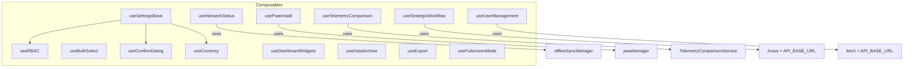

**Diagram sources**
- [useSettingsBase.js:26-41](file://src/composables/settings/useSettingsBase.js#L26-L41)
- [useNetworkStatus.js:6-8](file://src/composables/useNetworkStatus.js#L6-L8)
- [usePwaInstall.js:8-9](file://src/composables/usePwaInstall.js#L8-L9)
- [useTelemetryComparison.js:6-7](file://src/composables/useTelemetryComparison.js#L6-L7)
- [useStrategicWorkflow.js:3-4](file://src/composables/useStrategicWorkflow.js#L3-L4)
- [useUserManagement.js:3-6](file://src/composables/useUserManagement.js#L3-L6)

**Section sources**
- [useSettingsBase.js:26-41](file://src/composables/settings/useSettingsBase.js#L26-L41)
- [useNetworkStatus.js:6-8](file://src/composables/useNetworkStatus.js#L6-L8)
- [usePwaInstall.js:8-9](file://src/composables/usePwaInstall.js#L8-L9)
- [useTelemetryComparison.js:6-7](file://src/composables/useTelemetryComparison.js#L6-L7)
- [useStrategicWorkflow.js:3-4](file://src/composables/useStrategicWorkflow.js#L3-L4)
- [useUserManagement.js:3-6](file://src/composables/useUserManagement.js#L3-L6)

## Core Components
This section summarizes each composable’s purpose and core behaviors.

- useRBAC: Role-based access control, tenant roles/organizations, UI preferences, permission checks, initialization from JWT and API.
- useBulkSelect: Selection state and helpers for multi-row operations with range selection support.
- useConfirmDialog: Centralized confirmation dialog state machine with callbacks.
- useCurrency: Reactive currency formatting, settings persistence, fallbacks, and service integration.
- useDashboardWidgets: Registration, enable/disable, and persistence of dashboard widgets.
- useDataArchive: Generic paginated data fetching with search and date filters.
- useExport: Preview modal state and export execution wrapper with error toast.
- useFullscreenMode: Global fullscreen toggle via CSS class binding.
- useNetworkStatus: Online/offline detection, sync status aggregation, auto-sync on reconnect, offline notifications.
- usePwaInstall: PWA install prompt orchestration, platform detection, manual instructions fallback.
- useStrategicWorkflow: Fetch and run strategic workflow, persist results locally.
- useTelemetryComparison: Filters, pagination, metrics, chart data, real-time data, and export for telemetry vs image analysis.
- useUserManagement: CRUD for users and branches, module subscriptions, loading/error/success messaging.
- useSettingsBase: Foundation for settings pages; integrates RBAC, currency, confirm dialog, preferences, audit, and subscription calculator.

**Section sources**
- [useRBAC.js:55-780](file://src/composables/useRBAC.js#L55-L780)
- [useBulkSelect.js:3-97](file://src/composables/useBulkSelect.js#L3-L97)
- [useConfirmDialog.js:20-63](file://src/composables/useConfirmDialog.js#L20-L63)
- [useCurrency.js:18-200](file://src/composables/useCurrency.js#L18-L200)
- [useDashboardWidgets.js:24-86](file://src/composables/useDashboardWidgets.js#L24-L86)
- [useDataArchive.js:3-96](file://src/composables/useDataArchive.js#L3-L96)
- [useExport.js:4-34](file://src/composables/useExport.js#L4-L34)
- [useFullscreenMode.js:5-27](file://src/composables/useFullscreenMode.js#L5-L27)
- [useNetworkStatus.js:10-226](file://src/composables/useNetworkStatus.js#L10-L226)
- [usePwaInstall.js:89-107](file://src/composables/usePwaInstall.js#L89-L107)
- [useStrategicWorkflow.js:24-57](file://src/composables/useStrategicWorkflow.js#L24-L57)
- [useTelemetryComparison.js:9-381](file://src/composables/useTelemetryComparison.js#L9-L381)
- [useUserManagement.js:15-290](file://src/composables/useUserManagement.js#L15-L290)
- [useSettingsBase.js:26-378](file://src/composables/settings/useSettingsBase.js#L26-L378)

## Architecture Overview
Composables provide modular, testable units of logic that can be composed within components. They follow consistent patterns:
- State: ref and computed properties
- Actions: async methods wrapping fetch/axios calls
- Side effects: watchers, event listeners, DOM mutations
- Integration: shared services, stores, and utilities

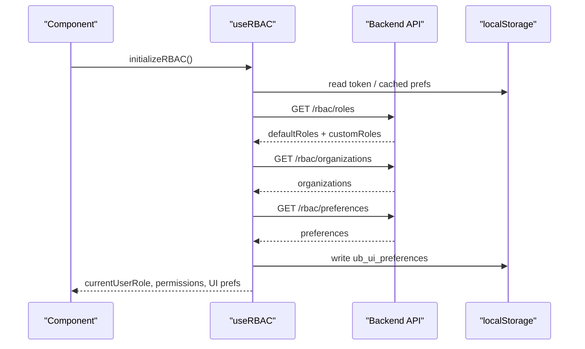

**Diagram sources**
- [useRBAC.js:668-719](file://src/composables/useRBAC.js#L668-L719)
- [useRBAC.js:144-226](file://src/composables/useRBAC.js#L144-L226)
- [useRBAC.js:354-376](file://src/composables/useRBAC.js#L354-L376)
- [useRBAC.js:495-523](file://src/composables/useRBAC.js#L495-L523)

## Detailed Component Analysis

### useRBAC.js
Encapsulates role-based access control, tenant configuration, and UI preferences. Provides permission checks, role/organization CRUD, and application-wide UI theming.

Key responsibilities:
- Permission checks: hasPermission, hasAnyPermission, canRead/write/edit/delete/assign/approve/export
- Role management: fetch/create/update/delete roles with validation and error handling
- Organization management: fetch/add/update/remove organizations
- UI preferences: fetch/update/apply preferences, including theme, fonts, radii, elevation, patterns, density, animations
- Initialization: load from JWT and localStorage, then parallelize API calls

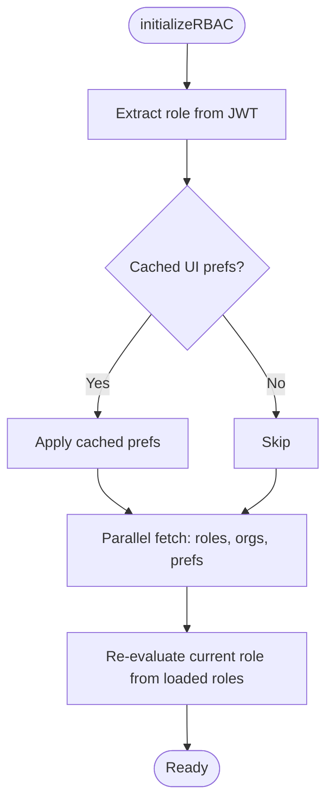

**Diagram sources**
- [useRBAC.js:668-719](file://src/composables/useRBAC.js#L668-L719)

**Section sources**
- [useRBAC.js:55-780](file://src/composables/useRBAC.js#L55-L780)

### useBulkSelect.js
Manages selected item IDs with support for shift-range selection, partial/all page selection, and utility getters.

Highlights:
- Reactive Set-backed selection state
- Computed selectionCount and hasSelection
- Range selection using lastClickedIndex
- Filter-aware select all/partial detection

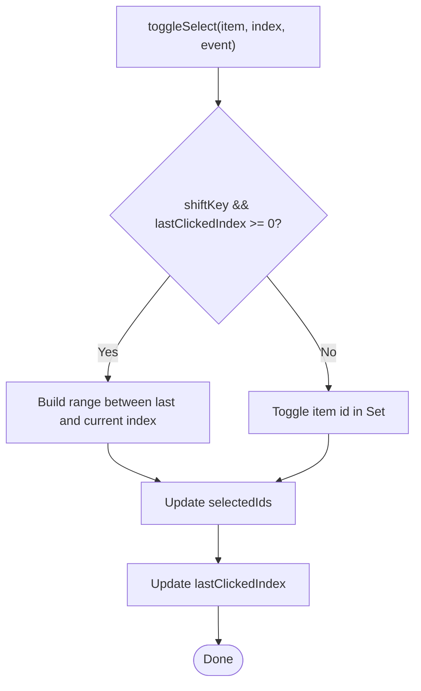

**Diagram sources**
- [useBulkSelect.js:27-50](file://src/composables/useBulkSelect.js#L27-L50)

**Section sources**
- [useBulkSelect.js:3-97](file://src/composables/useBulkSelect.js#L3-L97)

### useConfirmDialog.js
Centralizes confirmation dialog state and lifecycle callbacks.

Behavior:
- openConfirm merges defaults with provided options
- confirmAction executes onConfirm, handles errors via onError
- cancelConfirm and clearConfirm trigger onCancel/onClose

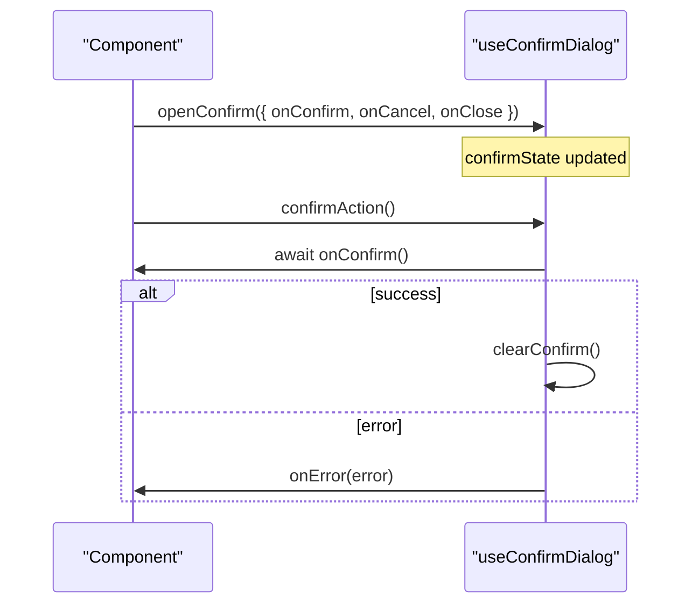

**Diagram sources**
- [useConfirmDialog.js:20-63](file://src/composables/useConfirmDialog.js#L20-L63)

**Section sources**
- [useConfirmDialog.js:20-63](file://src/composables/useConfirmDialog.js#L20-L63)

### useCurrency.js
Provides reactive currency formatting and settings management with robust fallbacks.

Features:
- initializeCurrency with try/catch and safe defaults
- formatCurrency/formatCurrencyCompact/parseCurrency delegating to service
- updateCurrencySettings/saveCurrencySettings with tenant-aware persistence
- Auto-initialization on mount

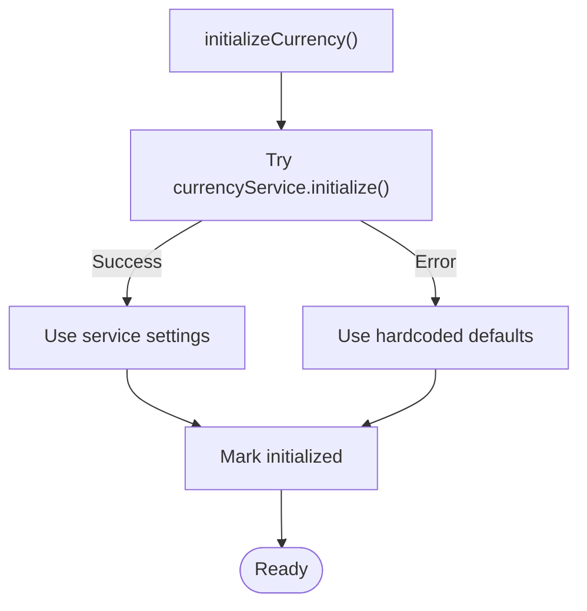

**Diagram sources**
- [useCurrency.js:24-54](file://src/composables/useCurrency.js#L24-L54)

**Section sources**
- [useCurrency.js:18-200](file://src/composables/useCurrency.js#L18-L200)

### useDashboardWidgets.js
Registers and toggles dashboard widgets with persistence.

Key points:
- Uses markRaw to avoid making component references reactive
- Persists enabled widget IDs to localStorage
- Exposes activeWidgets computed list

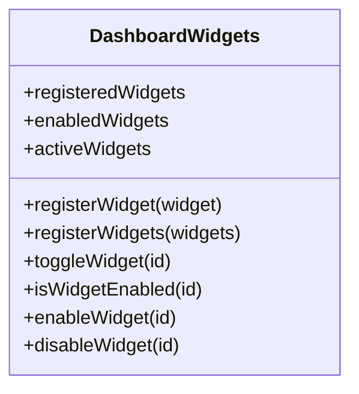

**Diagram sources**
- [useDashboardWidgets.js:24-86](file://src/composables/useDashboardWidgets.js#L24-L86)

**Section sources**
- [useDashboardWidgets.js:24-86](file://src/composables/useDashboardWidgets.js#L24-L86)

### useDataArchive.js
Generic paginated data loader with search and date filtering.

Responsibilities:
- Centralized loading/error state
- Page navigation and computed totals
- Search and date range setters that reset to first page and reload

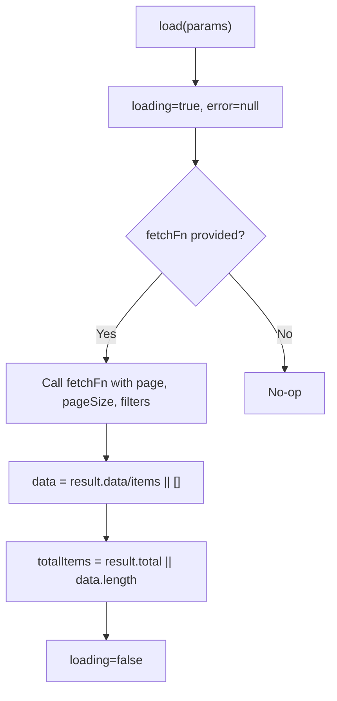

**Diagram sources**
- [useDataArchive.js:22-44](file://src/composables/useDataArchive.js#L22-L44)

**Section sources**
- [useDataArchive.js:3-96](file://src/composables/useDataArchive.js#L3-L96)

### useExport.js
Manages export preview modal state and execution wrapper.

Usage pattern:
- openExportPreview sets columns, rows, title
- handleExport(fn) returns a formatter-specific handler that closes preview and invokes fn with error toast

**Section sources**
- [useExport.js:4-34](file://src/composables/useExport.js#L4-L34)

### useFullscreenMode.js
Toggles a global CSS class based on internal boolean state.

Lifecycle:
- watch(isFullscreen) applies/removes app-fullscreen-mode class immediately

**Section sources**
- [useFullscreenMode.js:5-27](file://src/composables/useFullscreenMode.js#L5-L27)

### useNetworkStatus.js
Monitors online/offline status and sync state, triggers auto-sync on reconnect, and shows offline notifications.

Highlights:
- Debounced online/offline listeners
- Aggregates pending operations from IndexedDB and sync manager
- forceSync delegates to OfflineSyncManager and updates timestamps/status
- showOfflineNotification injects a temporary toast

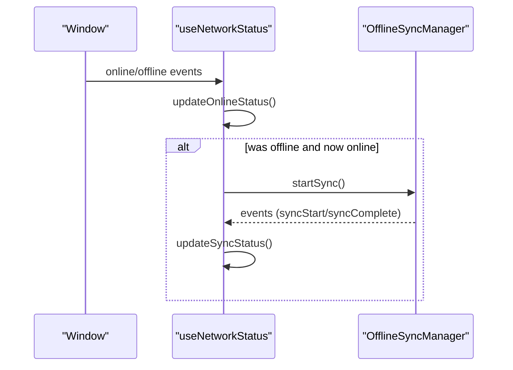

**Diagram sources**
- [useNetworkStatus.js:33-91](file://src/composables/useNetworkStatus.js#L33-L91)
- [useNetworkStatus.js:170-197](file://src/composables/useNetworkStatus.js#L170-L197)

**Section sources**
- [useNetworkStatus.js:10-226](file://src/composables/useNetworkStatus.js#L10-L226)

### usePwaInstall.js
Wraps pwaManager singleton to provide reactive install state and unified triggerInstall flow.

Flow:
- Detect native prompt availability
- If installed, show instructions modal
- Else prompt native install or show manual instructions

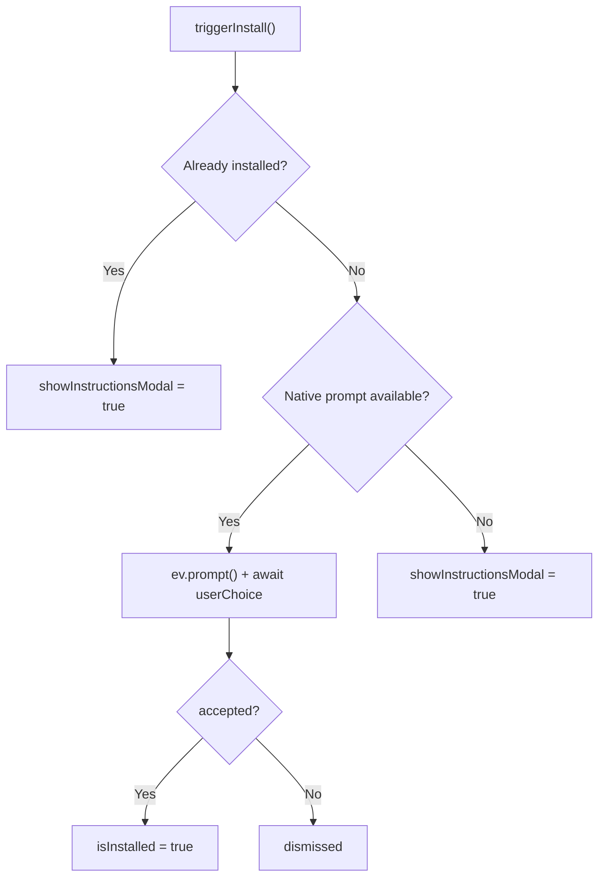

**Diagram sources**
- [usePwaInstall.js:49-83](file://src/composables/usePwaInstall.js#L49-L83)

**Section sources**
- [usePwaInstall.js:8-107](file://src/composables/usePwaInstall.js#L8-L107)

### useStrategicWorkflow.js
Persists and runs strategic workflow tasks, restoring results from localStorage and saving responses.

Key actions:
- fetchSavedOverview loads latest overview from backend if valid
- runStrategicWorkflow posts payload and persists result

**Section sources**
- [useStrategicWorkflow.js:24-57](file://src/composables/useStrategicWorkflow.js#L24-L57)

### useTelemetryComparison.js
Full-featured composable for comparing telemetry and image analysis data.

Capabilities:
- Reactive filters and pagination
- Computed filteredData, paginatedData, totalPages, metrics, chartData
- Data fetching with mock fallback in development
- Real-time data per machine
- CSV export and download utilities

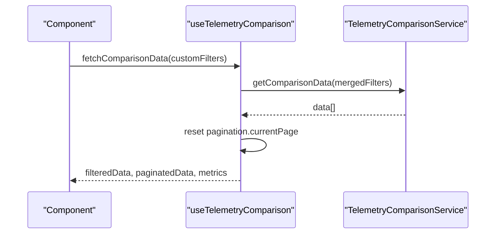

**Diagram sources**
- [useTelemetryComparison.js:156-184](file://src/composables/useTelemetryComparison.js#L156-L184)

**Section sources**
- [useTelemetryComparison.js:9-381](file://src/composables/useTelemetryComparison.js#L9-L381)

### useUserManagement.js
CRUD for users and branches, plus module subscription visibility.

Responsibilities:
- Fetch users/branches/modules
- Add/edit/remove with error/success messages
- Compute filtered modules based on subscriptions

**Section sources**
- [useUserManagement.js:15-290](file://src/composables/useUserManagement.js#L15-L290)

### Settings Composables Hierarchy: useSettingsBase.js
Foundation for settings pages, integrating multiple concerns:
- RBAC: permissions, roles, organizations, UI preferences
- Currency: formatting and code
- Confirm dialog: centralized confirm flow
- Preferences and audit: save brand preferences and log actions
- Subscription calculator: tiers, modules, surcharges, totals

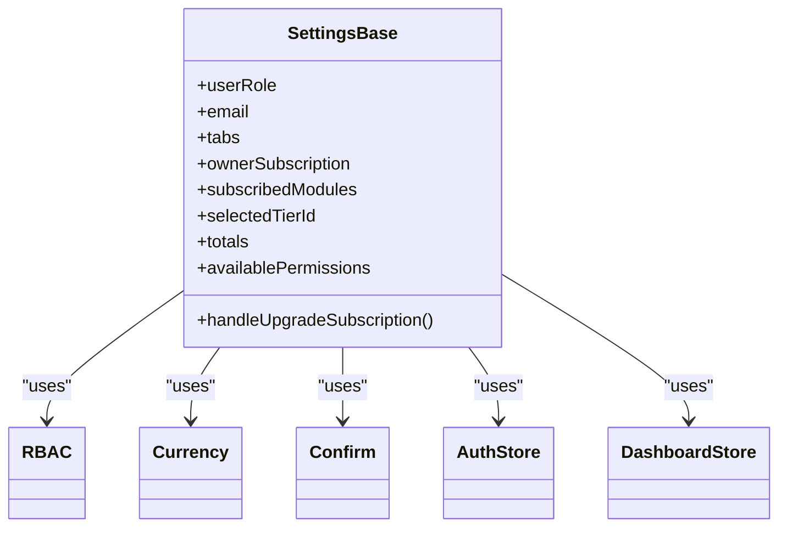

**Diagram sources**
- [useSettingsBase.js:26-41](file://src/composables/settings/useSettingsBase.js#L26-L41)
- [useSettingsBase.js:335-378](file://src/composables/settings/useSettingsBase.js#L335-L378)

**Section sources**
- [useSettingsBase.js:26-378](file://src/composables/settings/useSettingsBase.js#L26-L378)

## Dependency Analysis
Composables depend on services, stores, and browser APIs. The following diagram highlights major dependencies:

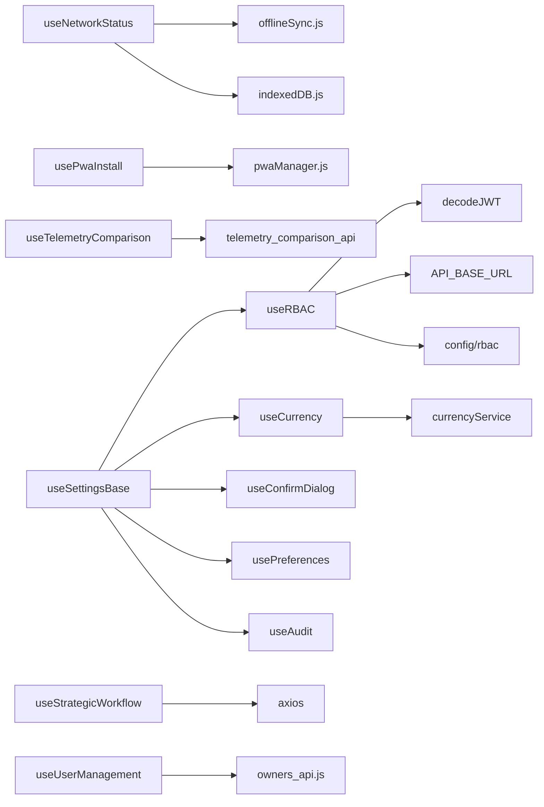

**Diagram sources**
- [useRBAC.js:6-33](file://src/composables/useRBAC.js#L6-L33)
- [useCurrency.js:6-8](file://src/composables/useCurrency.js#L6-L8)
- [useNetworkStatus.js:6-8](file://src/composables/useNetworkStatus.js#L6-L8)
- [usePwaInstall.js:8-9](file://src/composables/usePwaInstall.js#L8-L9)
- [useTelemetryComparison.js:6-7](file://src/composables/useTelemetryComparison.js#L6-L7)
- [useStrategicWorkflow.js:3-4](file://src/composables/useStrategicWorkflow.js#L3-L4)
- [useUserManagement.js:3-6](file://src/composables/useUserManagement.js#L3-L6)
- [useSettingsBase.js:13-15](file://src/composables/settings/useSettingsBase.js#L13-L15)

**Section sources**
- [useRBAC.js:6-33](file://src/composables/useRBAC.js#L6-L33)
- [useCurrency.js:6-8](file://src/composables/useCurrency.js#L6-L8)
- [useNetworkStatus.js:6-8](file://src/composables/useNetworkStatus.js#L6-L8)
- [usePwaInstall.js:8-9](file://src/composables/usePwaInstall.js#L8-L9)
- [useTelemetryComparison.js:6-7](file://src/composables/useTelemetryComparison.js#L6-L7)
- [useStrategicWorkflow.js:3-4](file://src/composables/useStrategicWorkflow.js#L3-L4)
- [useUserManagement.js:3-6](file://src/composables/useUserManagement.js#L3-L6)
- [useSettingsBase.js:13-15](file://src/composables/settings/useSettingsBase.js#L13-L15)

## Performance Considerations
- Prefer computed properties for derived state to minimize recalculations (e.g., filteredData, metrics).
- Debounce frequent events like network status changes to reduce redundant work.
- Use markRaw for non-reactive objects such as registered widget components to avoid overhead.
- Batch API calls where possible (e.g., parallel fetches during RBAC initialization).
- Keep large lists paginated and filter client-side only when necessary.
- Avoid heavy computations in watchers; prefer computed or throttled watchers.

[No sources needed since this section provides general guidance]

## Troubleshooting Guide
Common issues and strategies:
- RBAC initialization failures: ensure token exists and API endpoints respond; fall back to defaults and recompute role after roles load.
- Currency formatting errors: rely on built-in fallbacks; check service initialization and persisted settings.
- Network sync failures: inspect syncError and lastSuccessfulSync; verify OfflineSyncManager events and IndexedDB queries.
- PWA install prompts: if native prompt is unavailable, guide users through manual instructions; detect platform differences.
- Export failures: wrap export handlers with try/catch and surface user-friendly toasts.
- User management errors: normalize error payloads and display concise messages; refresh lists post mutation.

**Section sources**
- [useRBAC.js:144-226](file://src/composables/useRBAC.js#L144-L226)
- [useCurrency.js:24-54](file://src/composables/useCurrency.js#L24-L54)
- [useNetworkStatus.js:75-91](file://src/composables/useNetworkStatus.js#L75-L91)
- [usePwaInstall.js:49-83](file://src/composables/usePwaInstall.js#L49-L83)
- [useExport.js:17-26](file://src/composables/useExport.js#L17-L26)
- [useUserManagement.js:75-161](file://src/composables/useUserManagement.js#L75-L161)

## Conclusion
The composable patterns in ABSA Foundry Frontend provide a clean separation of concerns, enabling reusable, testable, and maintainable logic. By centralizing state, side effects, and integrations within composables, components remain focused on presentation and user interactions. The settings composables build upon useSettingsBase to compose complex feature areas while maintaining consistency across the application.

[No sources needed since this section summarizes without analyzing specific files]