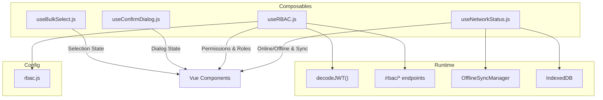
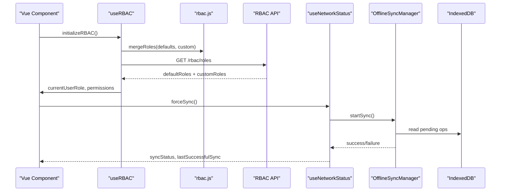
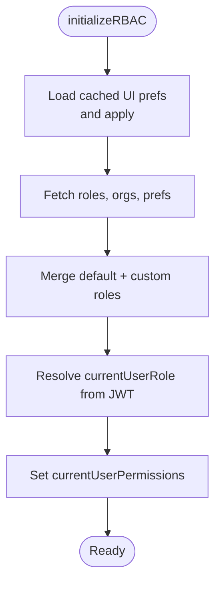
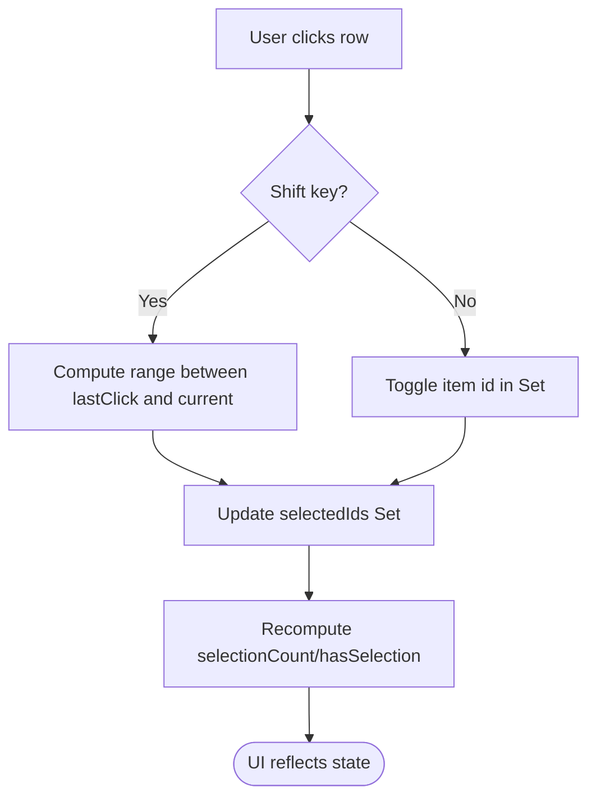
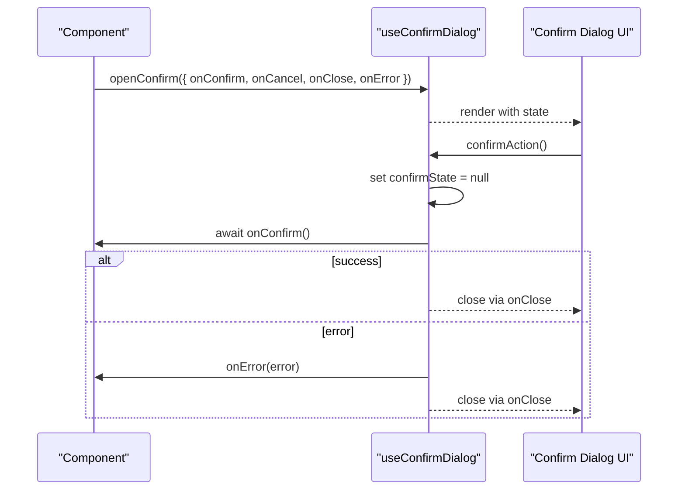
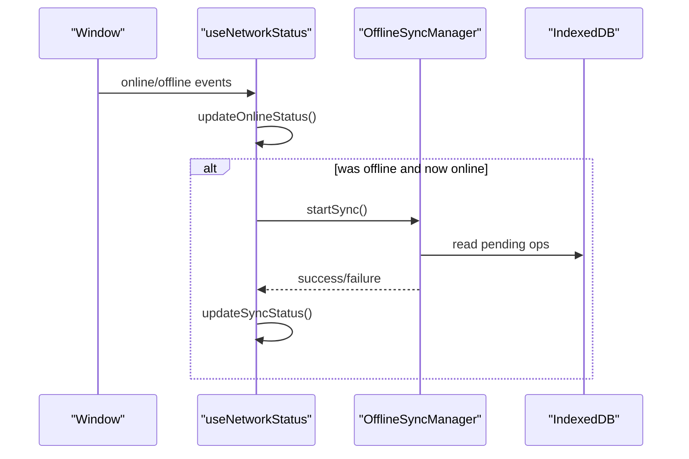
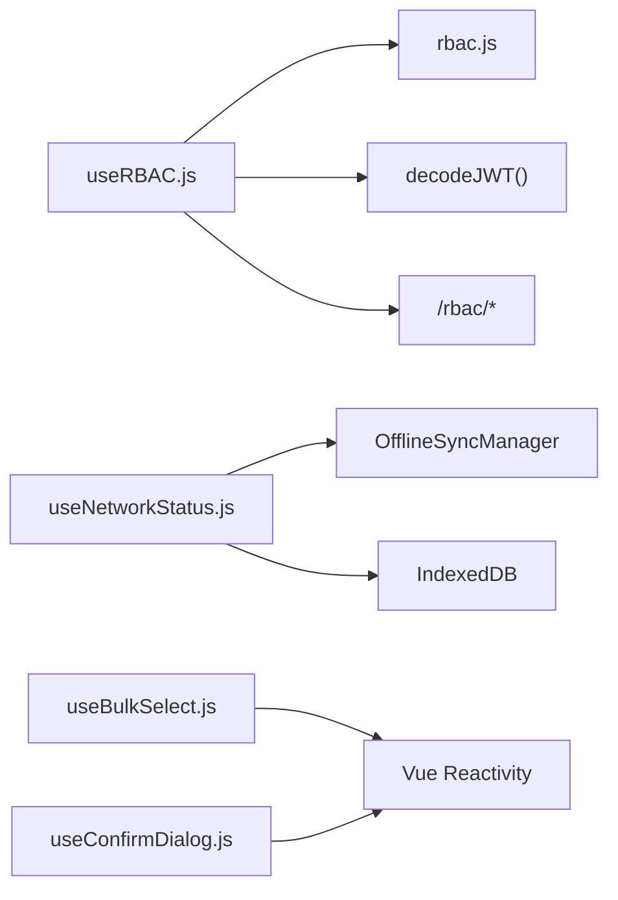

# Core Composables

<cite>
**Referenced Files in This Document**
- [useRBAC.js](file://src/composables/useRBAC.js)
- [rbac.js](file://src/config/rbac.js)
- [useBulkSelect.js](file://src/composables/useBulkSelect.js)
- [useConfirmDialog.js](file://src/composables/useConfirmDialog.js)
- [useNetworkStatus.js](file://src/composables/useNetworkStatus.js)
</cite>

## Table of Contents
1. Introduction
2. Project Structure
3. Core Components
4. Architecture Overview
5. Detailed Component Analysis
6. Dependency Analysis
7. Performance Considerations
8. Troubleshooting Guide
9. Conclusion

## Introduction
This document explains the core composable functions that provide fundamental application functionality across the frontend:
- useRBAC.js: Role-based access control, permission checking, role validation, and authorization patterns.
- useBulkSelect.js: Bulk selection operations with multi-select capabilities, selection state management, and batch actions.
- useConfirmDialog.js: User confirmation dialogs with customizable prompts, async handling, and integration patterns.
- useNetworkStatus.js: Network connectivity monitoring including online/offline detection, connection quality assessment, and offline data synchronization strategies.

It includes practical usage guidance within Vue components, reactive state patterns, and error handling approaches.

## Project Structure
The composables live under src/composables and are consumed by views and components throughout the app. RBAC configuration is centralized in src/config/rbac.js. The network status composable integrates with an offline sync manager and IndexedDB to queue and reconcile changes when connectivity is restored.

**Diagram sources**
- [useRBAC.js:55-780](file://src/composables/useRBAC.js#L55-L780)
- [rbac.js:1-753](file://src/config/rbac.js#L1-L753)
- [useNetworkStatus.js:1-228](file://src/composables/useNetworkStatus.js#L1-L228)

**Section sources**
- [useRBAC.js:55-780](file://src/composables/useRBAC.js#L55-L780)
- [rbac.js:1-753](file://src/config/rbac.js#L1-L753)
- [useNetworkStatus.js:1-228](file://src/composables/useNetworkStatus.js#L1-L228)

## Core Components
- useRBAC: Centralizes permissions, roles, organizations, and UI preferences; exposes helpers like hasPermission, canRead, canWrite, isAdmin, and initialization routines.
- useBulkSelect: Manages a Set of selected IDs, supports shift-range selection, select-all/partial states, and bulk retrieval.
- useConfirmDialog: Provides a reactive dialog state machine with open/cancel/confirm lifecycle hooks and async error propagation.
- useNetworkStatus: Tracks online/offline, computes pending sync counts, triggers auto-sync on reconnect, and surfaces errors and timestamps.

**Section sources**
- [useRBAC.js:55-780](file://src/composables/useRBAC.js#L55-L780)
- [useBulkSelect.js:1-99](file://src/composables/useBulkSelect.js#L1-L99)
- [useConfirmDialog.js:1-64](file://src/composables/useConfirmDialog.js#L1-L64)
- [useNetworkStatus.js:1-228](file://src/composables/useNetworkStatus.js#L1-L228)

## Architecture Overview
The system composes small, focused utilities into cohesive features:
- RBAC reads user identity from JWT, merges tenant roles from the backend with defaults, and applies UI preferences to the DOM. Permission checks short-circuit for privileged roles or dev bypass flags.
- Bulk selection keeps a lightweight Set of IDs and exposes computed booleans for UI toggles (select all/partial).
- Confirm dialog encapsulates async workflows behind a simple imperative API, surfacing errors via callbacks.
- Network status listens to browser events, updates sync counters from IndexedDB, and coordinates with an offline sync manager to reconcile queued work.

**Diagram sources**
- [useRBAC.js:144-226](file://src/composables/useRBAC.js#L144-L226)
- [rbac.js:701-713](file://src/config/rbac.js#L701-L713)
- [useNetworkStatus.js:75-91](file://src/composables/useNetworkStatus.js#L75-L91)

## Detailed Component Analysis

### useRBAC.js
Responsibilities:
- Permission checking: hasPermission, hasAnyPermission, and convenience methods (canRead, canWrite, canEdit, canDelete, canAssign, canApprove, canExport).
- Role management: fetchRoles, createRole, updateRole, deleteRole with validation and error handling.
- Organization management: fetchOrganizations, addOrganization, updateOrganization, removeOrganization.
- UI preferences: fetchUIPreferences, updateUIPreferences, applyUIPreferences to CSS variables and theme classes.
- Initialization: initializeRBAC loads roles, organizations, preferences, and resolves current user role.

Key implementation notes:
- Short-circuits for privileged roles (owner/admin/super_admin) and dev bypass flag.
- Merges backend-provided defaultRoles with custom roles; removes deleted roles by id.
- Persists UI preferences to localStorage for fast startup and applies them to the document root.
- Exposes readonly reactive state for safe consumption in components.

Usage pattern in components:
- Call initializeRBAC during app bootstrap or route entry.
- Use computed guards like v-if="hasPermission('crm', 'read')" to show/hide UI.
- Wrap mutations with isLoading/error handling provided by the composable.

Error handling:
- Network failures fall back to defaults where appropriate.
- Validation errors thrown by role creation/update propagate to callers.

**Diagram sources**
- [useRBAC.js:668-719](file://src/composables/useRBAC.js#L668-L719)
- [rbac.js:701-713](file://src/config/rbac.js#L701-L713)

**Section sources**
- [useRBAC.js:55-780](file://src/composables/useRBAC.js#L55-L780)
- [rbac.js:1-753](file://src/config/rbac.js#L1-L753)

### useBulkSelect.js
Responsibilities:
- Maintain selectedIds as a Set for O(1) membership checks.
- Provide selection state helpers: isSelected, isAllPageSelected, isPartiallySelected.
- Support range selection via Shift+click using lastClickedIndex.
- Offer bulk operations: toggleSelectAll, selectAll, clearSelection, getSelectedItems.

Reactive state:
- selectionCount and hasSelection computed values drive UI feedback (e.g., enable/disable batch action buttons).

Usage pattern in components:
- Initialize with getId mapping if your items use non-standard identifiers.
- Bind checkbox handlers to toggleSelect(item, index, event).
- Use isAllPageSelected(items) to reflect “select all” state for the current page.

Performance considerations:
- Using a Set ensures efficient add/remove/check operations even with large lists.
- Avoid unnecessary re-renders by binding only to computed properties.

**Diagram sources**
- [useBulkSelect.js:27-66](file://src/composables/useBulkSelect.js#L27-L66)

**Section sources**
- [useBulkSelect.js:1-99](file://src/composables/useBulkSelect.js#L1-L99)

### useConfirmDialog.js
Responsibilities:
- Manage confirmState with title, message, variant, labels, and callbacks.
- Open, cancel, clear, and execute confirmAction with async support.
- Surface errors via onError callback and ensure onClose runs on dismiss.

Integration pattern:
- Trigger openConfirm({ onConfirm: async () => {...}, onError: (err) => {...} }) from component methods.
- Render a modal/dialog bound to confirmState and wire buttons to cancelConfirm and confirmAction.

Error handling:
- Errors thrown inside onConfirm are caught and forwarded to onError while still being re-thrown for caller handling.

**Diagram sources**
- [useConfirmDialog.js:20-64](file://src/composables/useConfirmDialog.js#L20-L64)

**Section sources**
- [useConfirmDialog.js:1-64](file://src/composables/useConfirmDialog.js#L1-L64)

### useNetworkStatus.js
Responsibilities:
- Track online/offline via navigator.onLine and window events.
- Compute sync readiness: hasPendingSync, canSync.
- Query IndexedDB and OfflineSyncManager to populate syncStatus counters.
- Force sync on reconnect and expose notifications and permission helpers.

Offline synchronization strategy:
- On mount, listen to online/offline events and sync manager events to keep syncStatus current.
- When coming back online, automatically trigger forceSync to reconcile queued operations.
- Persist lastSyncAttempt and lastSuccessfulSync timestamps for UI indicators.

Connection quality assessment:
- While not measuring bandwidth directly, the composable infers connectivity state and sync readiness, enabling UI to adapt (e.g., disable write operations when offline).

**Diagram sources**
- [useNetworkStatus.js:33-91](file://src/composables/useNetworkStatus.js#L33-L91)
- [useNetworkStatus.js:170-197](file://src/composables/useNetworkStatus.js#L170-L197)

**Section sources**
- [useNetworkStatus.js:1-228](file://src/composables/useNetworkStatus.js#L1-L228)

## Dependency Analysis
- useRBAC depends on rbac.js for role definitions, permission helpers, and UI preference presets. It also uses decodeJWT and API endpoints for runtime role resolution.
- useNetworkStatus depends on an offline sync manager and IndexedDB to track and reconcile pending operations.
- useBulkSelect and useConfirmDialog are self-contained and have no external dependencies beyond Vue reactivity.

**Diagram sources**
- [useRBAC.js:55-780](file://src/composables/useRBAC.js#L55-L780)
- [rbac.js:1-753](file://src/config/rbac.js#L1-L753)
- [useNetworkStatus.js:1-228](file://src/composables/useNetworkStatus.js#L1-L228)

**Section sources**
- [useRBAC.js:55-780](file://src/composables/useRBAC.js#L55-L780)
- [useNetworkStatus.js:1-228](file://src/composables/useNetworkStatus.js#L1-L228)

## Performance Considerations
- RBAC:
  - Prefer computed permission checks in templates to avoid repeated function calls.
  - Cache currentUserRole and permissions after initial load; avoid refetching unless roles change.
  - Use dev bypass judiciously; it should be disabled in production.
- Bulk Select:
  - Keep item lists stable; avoid frequent reordering to minimize recalculations.
  - Use getId to map to stable identifiers for optimal Set performance.
- Confirm Dialog:
  - Keep onConfirm handlers lightweight; offload heavy work to services and update UI via state.
- Network Status:
  - Debounced online/offline listeners prevent excessive sync attempts.
  - Batch UI updates by reading syncStatus once per tick where possible.

[No sources needed since this section provides general guidance]

## Troubleshooting Guide
Common issues and resolutions:
- RBAC permissions not applied:
  - Ensure initializeRBAC ran before rendering protected UI.
  - Verify token presence and that /rbac/roles returns expected roles.
  - Check dev bypass flag behavior in development vs production.
- Bulk selection not updating:
  - Confirm getId maps to a unique field per item.
  - Ensure you pass the correct index and event to toggleSelect for range selection.
- Confirm dialog not closing or errors swallowed:
  - Implement onError to capture and display errors from onConfirm.
  - Always call onClose to clean up state and resources.
- Network sync not triggering:
  - Verify online/offline event listeners are attached.
  - Check OfflineSyncManager events and IndexedDB contents for pending operations.
  - Inspect syncError and timestamps to diagnose failed syncs.

**Section sources**
- [useRBAC.js:144-226](file://src/composables/useRBAC.js#L144-L226)
- [useBulkSelect.js:27-66](file://src/composables/useBulkSelect.js#L27-L66)
- [useConfirmDialog.js:43-55](file://src/composables/useConfirmDialog.js#L43-L55)
- [useNetworkStatus.js:170-207](file://src/composables/useNetworkStatus.js#L170-L207)

## Conclusion
These composables provide foundational building blocks for secure, interactive, and resilient Vue applications:
- useRBAC centralizes authorization and personalization with robust fallbacks and caching.
- useBulkSelect offers efficient multi-selection with ergonomic APIs.
- useConfirmDialog standardizes async confirmation flows with clear error handling.
- useNetworkStatus enables offline-first experiences with automatic reconciliation upon reconnection.

Adopt these patterns to build consistent, maintainable features across the application.