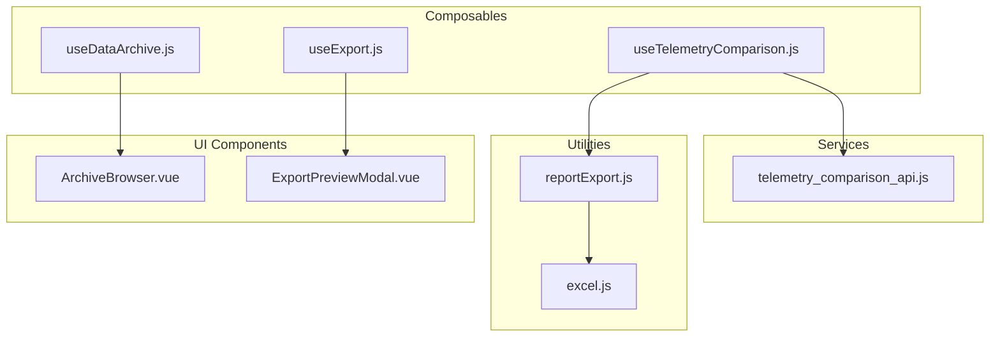
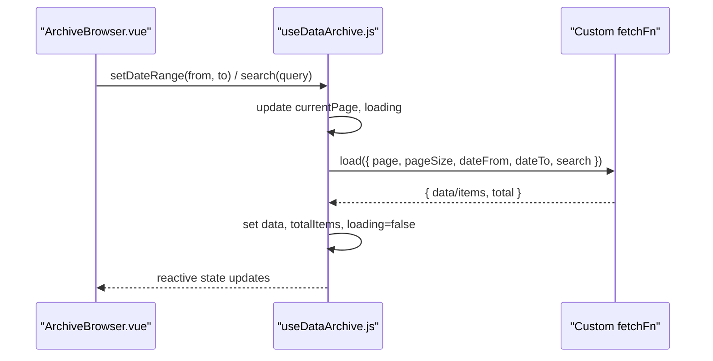
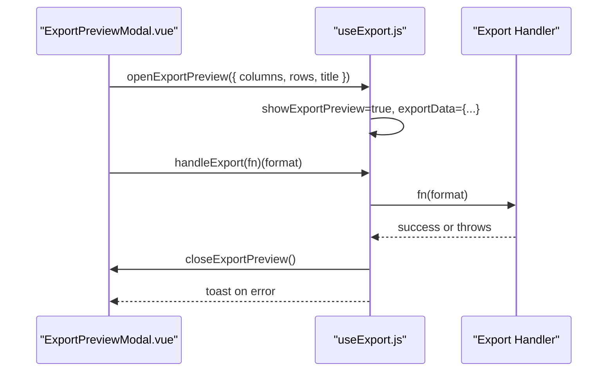
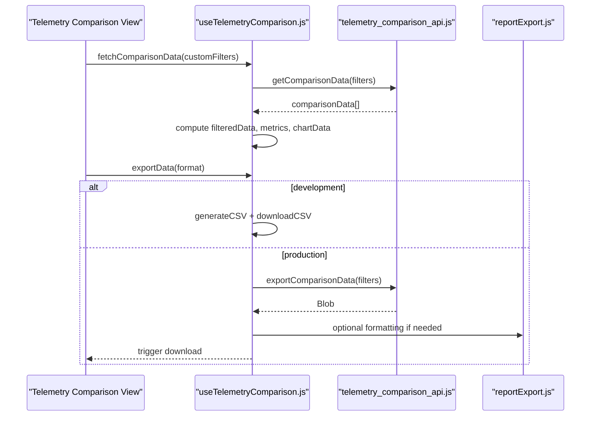
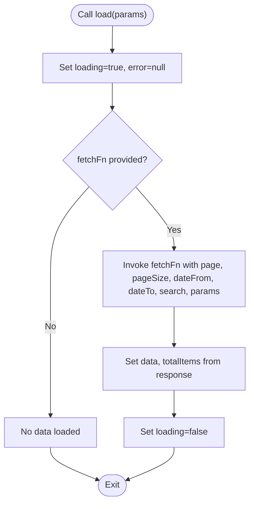
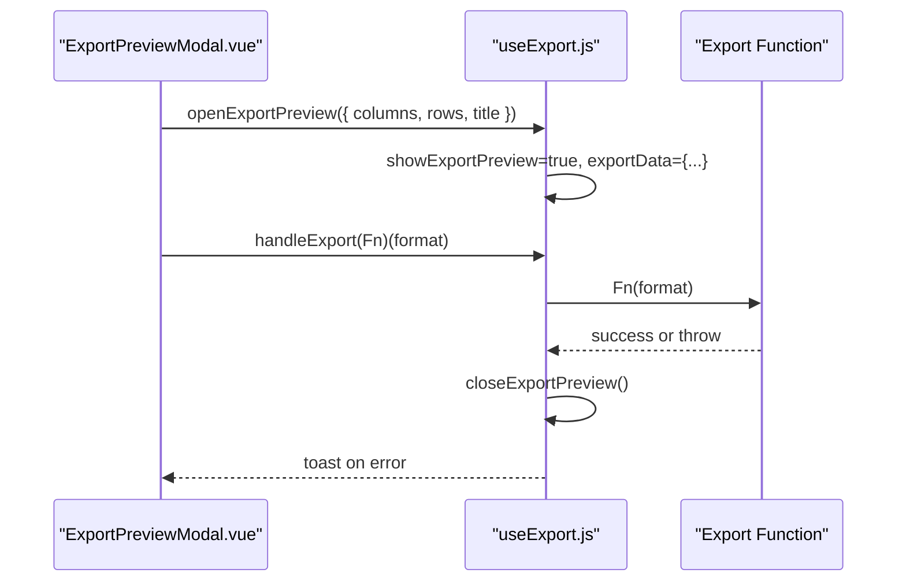
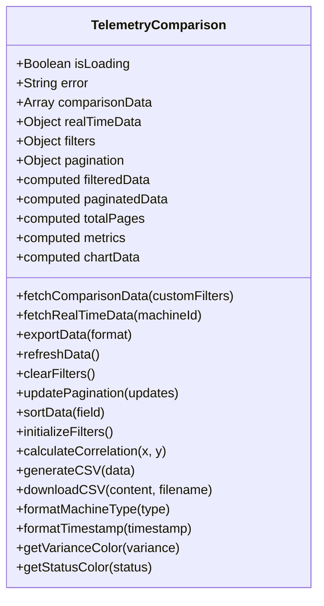
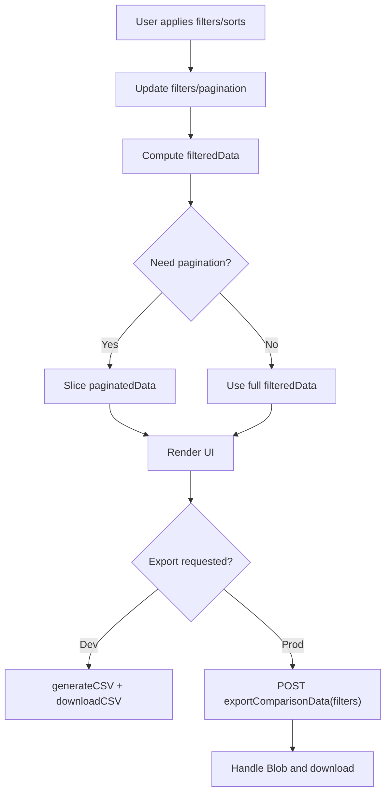
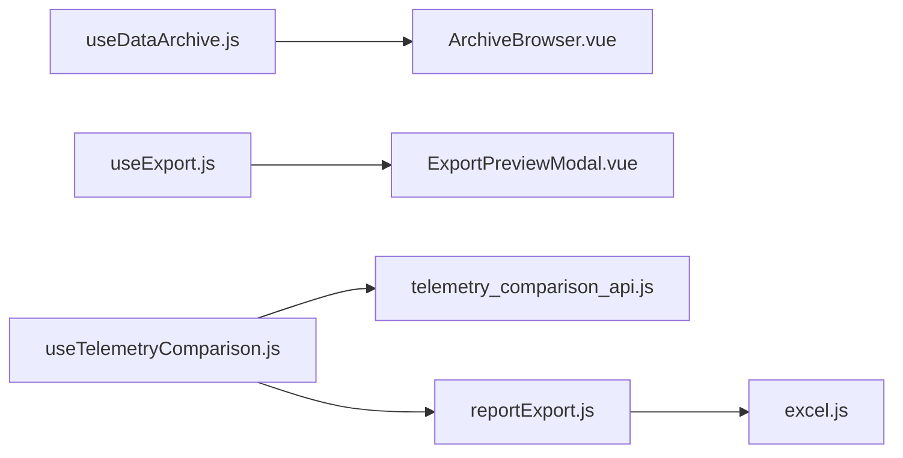
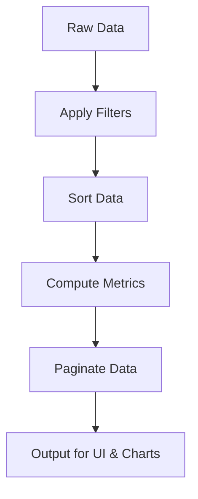

# Data Management Composables

<cite>
**Referenced Files in This Document**
- [useDataArchive.js](file://src/composables/useDataArchive.js)
- [useExport.js](file://src/composables/useExport.js)
- [useTelemetryComparison.js](file://src/composables/useTelemetryComparison.js)
- [telemetry_comparison_api.js](file://src/services/telemetry_comparison_api.js)
- [excel.js](file://src/utils/excel.js)
- [reportExport.js](file://src/utils/reportExport.js)
- [ArchiveBrowser.vue](file://src/components/ui/ArchiveBrowser.vue)
- [ExportPreviewModal.vue](file://src/components/ui/ExportPreviewModal.vue)
</cite>

## Table of Contents
1. [Introduction](#introduction)
2. [Project Structure](#project-structure)
3. [Core Components](#core-components)
4. [Architecture Overview](#architecture-overview)
5. [Detailed Component Analysis](#detailed-component-analysis)
6. [Dependency Analysis](#dependency-analysis)
7. [Performance Considerations](#performance-considerations)
8. [Troubleshooting Guide](#troubleshooting-guide)
9. [Conclusion](#conclusion)
10. [Appendices](#appendices)

## Introduction
This document provides comprehensive documentation for three data management composables that power complex data operations across the application:
- useDataArchive.js: Provides paginated, filterable data loading with date range and search support, designed to integrate with any fetch function for archive retrieval.
- useExport.js: Manages an export preview workflow and delegates actual export logic to a provided handler, with user-friendly error feedback.
- useTelemetryComparison.js: Implements analytics comparison features including metric aggregation, trend analysis, visualization data preparation, filtering, sorting, pagination, and export capabilities.

The document explains how these composables work together with supporting services and utilities to deliver robust data archiving, export, and telemetry comparison workflows. It includes diagrams, code-level references, performance guidance, and troubleshooting strategies.

## Project Structure
The data management layer is organized into reusable composables under src/composables, supported by services (API clients), utilities (Excel and report generation), and UI components that consume the composables.

**Diagram sources**
- [useDataArchive.js:1-98](file://src/composables/useDataArchive.js#L1-L98)
- [useExport.js:1-36](file://src/composables/useExport.js#L1-L36)
- [useTelemetryComparison.js:1-382](file://src/composables/useTelemetryComparison.js#L1-L382)
- [telemetry_comparison_api.js:1-252](file://src/services/telemetry_comparison_api.js#L1-L252)
- [excel.js:1-221](file://src/utils/excel.js#L1-L221)
- [reportExport.js:1-574](file://src/utils/reportExport.js#L1-L574)
- [ArchiveBrowser.vue:1-75](file://src/components/ui/ArchiveBrowser.vue#L1-L75)
- [ExportPreviewModal.vue:1-94](file://src/components/ui/ExportPreviewModal.vue#L1-L94)

**Section sources**
- [useDataArchive.js:1-98](file://src/composables/useDataArchive.js#L1-L98)
- [useExport.js:1-36](file://src/composables/useExport.js#L1-L36)
- [useTelemetryComparison.js:1-382](file://src/composables/useTelemetryComparison.js#L1-L382)
- [telemetry_comparison_api.js:1-252](file://src/services/telemetry_comparison_api.js#L1-L252)
- [excel.js:1-221](file://src/utils/excel.js#L1-L221)
- [reportExport.js:1-574](file://src/utils/reportExport.js#L1-L574)
- [ArchiveBrowser.vue:1-75](file://src/components/ui/ArchiveBrowser.vue#L1-L75)
- [ExportPreviewModal.vue:1-94](file://src/components/ui/ExportPreviewModal.vue#L1-L94)

## Core Components
- useDataArchive: Encapsulates state and behavior for fetching, paging, searching, and filtering archived data via a pluggable fetch function. Exposes computed properties for page navigation and status indicators.
- useExport: Manages an export preview modal state and wraps export execution with error handling and toast notifications.
- useTelemetryComparison: Orchestrates telemetry vs image analysis comparison data, including filters, sorting, pagination, metrics computation, chart data preparation, real-time data fetching, and export.

Key responsibilities:
- Centralized state management for data lists and UI states
- Computed values for derived data (page counts, filtered results, metrics)
- Error handling and user feedback
- Integration points for API services and export utilities

**Section sources**
- [useDataArchive.js:1-98](file://src/composables/useDataArchive.js#L1-L98)
- [useExport.js:1-36](file://src/composables/useExport.js#L1-L36)
- [useTelemetryComparison.js:1-382](file://src/composables/useTelemetryComparison.js#L1-L382)

## Architecture Overview
The architecture separates concerns between composable logic, service calls, and UI rendering:
- Composables manage reactive state and business logic
- Services encapsulate HTTP requests and mock data generation
- Utilities provide file generation and download capabilities
- UI components render data and trigger actions

**Diagram sources**
- [useDataArchive.js:22-44](file://src/composables/useDataArchive.js#L22-L44)
- [ArchiveBrowser.vue:1-75](file://src/components/ui/ArchiveBrowser.vue#L1-L75)

**Diagram sources**
- [useExport.js:8-26](file://src/composables/useExport.js#L8-L26)
- [ExportPreviewModal.vue:71-94](file://src/components/ui/ExportPreviewModal.vue#L71-L94)

**Diagram sources**
- [useTelemetryComparison.js:156-232](file://src/composables/useTelemetryComparison.js#L156-L232)
- [telemetry_comparison_api.js:15-98](file://src/services/telemetry_comparison_api.js#L15-L98)
- [reportExport.js:1-574](file://src/utils/reportExport.js#L1-L574)

## Detailed Component Analysis

### useDataArchive.js
Purpose:
- Provide a reusable data loading composable for archives with pagination, search, and date range filtering.
- Abstract the data source behind a configurable fetch function to enable flexible integration.

Key behaviors:
- State: data, loading, error, currentPage, totalItems, dateFrom, dateTo, searchQuery
- Computed: totalPages, hasMore, hasPrevious
- Methods: load(params), setDateRange(from, to), search(query), nextPage(), prevPage(), goToPage(page)

Error handling:
- Catches errors during load, sets error message, clears data, ensures loading is reset.

Performance considerations:
- Pagination reduces memory footprint by limiting loaded items per page.
- Date range and search parameters are passed to the fetch function to leverage server-side filtering when available.

Integration example:
- ArchiveBrowser.vue consumes this composable to render table data, controls, and pagination.

**Diagram sources**
- [useDataArchive.js:22-44](file://src/composables/useDataArchive.js#L22-L44)

**Section sources**
- [useDataArchive.js:1-98](file://src/composables/useDataArchive.js#L1-L98)
- [ArchiveBrowser.vue:1-75](file://src/components/ui/ArchiveBrowser.vue#L1-L75)

### useExport.js
Purpose:
- Manage export preview state and wrap export execution with error handling and user feedback.

Key behaviors:
- State: showExportPreview, exportData (columns, rows, title)
- Methods: openExportPreview({ columns, rows, title }), closeExportPreview(), handleExport(fn)

Error handling:
- Wraps export execution in try/catch and displays toast error messages.

Usage pattern:
- ExportPreviewModal.vue opens the preview and triggers format-specific exports via handleExport.

**Diagram sources**
- [useExport.js:8-26](file://src/composables/useExport.js#L8-L26)
- [ExportPreviewModal.vue:71-94](file://src/components/ui/ExportPreviewModal.vue#L71-L94)

**Section sources**
- [useExport.js:1-36](file://src/composables/useExport.js#L1-L36)
- [ExportPreviewModal.vue:1-94](file://src/components/ui/ExportPreviewModal.vue#L1-L94)

### useTelemetryComparison.js
Purpose:
- Implement analytics comparison features for telemetry vs image analysis data, including filtering, sorting, pagination, metrics computation, chart data preparation, real-time data fetching, and export.

Key behaviors:
- State: isLoading, error, comparisonData, realTimeData, selectedMachine, filters, pagination
- Computed: filteredData, paginatedData, totalPages, metrics, chartData
- Methods: fetchComparisonData, fetchRealTimeData, exportData, refreshData, clearFilters, updatePagination, sortData, initializeFilters
- Utilities: calculateCorrelation, generateCSV, downloadCSV, formatMachineType, formatTimestamp, getVarianceColor, getStatusColor

Data flows:
- Filtering and sorting applied to comparisonData produce filteredData; pagination slices filteredData for display.
- Metrics aggregate accuracy rate, average variance, active machines, critical alerts, and correlation coefficient.
- Chart data prepares labels and datasets for visualization using recent entries.

Export flow:
- In development, generates CSV locally and downloads it.
- In production, posts filters to export endpoint and handles blob download.

**Diagram sources**
- [useTelemetryComparison.js:1-382](file://src/composables/useTelemetryComparison.js#L1-L382)

**Diagram sources**
- [useTelemetryComparison.js:37-88](file://src/composables/useTelemetryComparison.js#L37-L88)
- [useTelemetryComparison.js:210-232](file://src/composables/useTelemetryComparison.js#L210-L232)
- [telemetry_comparison_api.js:88-98](file://src/services/telemetry_comparison_api.js#L88-L98)

**Section sources**
- [useTelemetryComparison.js:1-382](file://src/composables/useTelemetryComparison.js#L1-L382)
- [telemetry_comparison_api.js:1-252](file://src/services/telemetry_comparison_api.js#L1-L252)

## Dependency Analysis
- useDataArchive depends on a pluggable fetch function; no direct service dependency, enabling flexibility for different backends.
- useExport depends on vue3-toastify for user feedback and integrates with UI components for preview and export actions.
- useTelemetryComparison depends on telemetry_comparison_api for data retrieval and export, and optionally uses reportExport utilities for PDF/Excel generation.
- reportExport depends on excel.js for Excel workbook creation and docx/file-saver for Word and file saving.

**Diagram sources**
- [useDataArchive.js:1-98](file://src/composables/useDataArchive.js#L1-L98)
- [useExport.js:1-36](file://src/composables/useExport.js#L1-L36)
- [useTelemetryComparison.js:1-382](file://src/composables/useTelemetryComparison.js#L1-L382)
- [telemetry_comparison_api.js:1-252](file://src/services/telemetry_comparison_api.js#L1-L252)
- [reportExport.js:1-574](file://src/utils/reportExport.js#L1-L574)
- [excel.js:1-221](file://src/utils/excel.js#L1-L221)

**Section sources**
- [useDataArchive.js:1-98](file://src/composables/useDataArchive.js#L1-L98)
- [useExport.js:1-36](file://src/composables/useExport.js#L1-L36)
- [useTelemetryComparison.js:1-382](file://src/composables/useTelemetryComparison.js#L1-L382)
- [telemetry_comparison_api.js:1-252](file://src/services/telemetry_comparison_api.js#L1-L252)
- [reportExport.js:1-574](file://src/utils/reportExport.js#L1-L574)
- [excel.js:1-221](file://src/utils/excel.js#L1-L221)

## Performance Considerations
- Pagination: Both useDataArchive and useTelemetryComparison implement client-side pagination to limit rendered data and reduce memory usage. For very large datasets, prefer server-side pagination and filtering.
- Filtering and Sorting: useTelemetryComparison performs filtering and sorting on the client side. For large datasets, consider moving these operations to the backend to avoid heavy computations in the browser.
- Export Streaming: For large exports, prefer streaming responses from the server (as implemented in telemetry export) and avoid building large in-memory structures. Use Blob URLs and revoke them promptly to free memory.
- Memory Management: Revoke object URLs after downloads to prevent memory leaks. Avoid retaining unnecessary references to large arrays once they are no longer needed.
- Computed Properties: Leverage Vue’s computed properties to derive data efficiently; ensure dependencies are minimal to avoid unnecessary recalculations.

[No sources needed since this section provides general guidance]

## Troubleshooting Guide
Common issues and resolutions:
- Data not loading:
  - Ensure fetchFn is provided and returns expected structure (data/items and total).
  - Check network errors and verify API endpoints.
  - Confirm pagination parameters are correctly passed.
- Export failures:
  - Verify export handler function is correctly implemented and handles all formats.
  - Check toast messages for detailed error information.
  - For telemetry export, ensure environment mode (development vs production) routes to correct logic.
- Real-time data not updating:
  - Validate machineId parameter and network connectivity.
  - Review error logs for failed real-time telemetry requests.
- Filtering/sorting not reflecting:
  - Confirm filters and pagination state updates trigger recomputation.
  - Ensure watchers are configured to re-fetch data when relevant filters change.

**Section sources**
- [useDataArchive.js:22-44](file://src/composables/useDataArchive.js#L22-L44)
- [useExport.js:17-26](file://src/composables/useExport.js#L17-L26)
- [useTelemetryComparison.js:156-208](file://src/composables/useTelemetryComparison.js#L156-L208)
- [telemetry_comparison_api.js:15-98](file://src/services/telemetry_comparison_api.js#L15-L98)

## Conclusion
The data management composables provide a cohesive foundation for archive retrieval, export workflows, and telemetry comparison analytics. They emphasize separation of concerns, reactive state management, and extensibility through pluggable functions and services. By leveraging pagination, filtering, and efficient export mechanisms, the system supports both small and large datasets while maintaining responsive user experiences.

[No sources needed since this section summarizes without analyzing specific files]

## Appendices

### Example: Data Transformation Pipeline
- Input: Raw comparison data from API
- Transform: Apply filters (machine type, ID, parameter, variance range), sort by timestamp or other fields
- Aggregate: Compute metrics (accuracy rate, average variance, correlation coefficient)
- Output: Paginated dataset for UI and chart-ready data for visualization

[No sources needed since this diagram shows conceptual workflow, not actual code structure]

### Example: Error Handling Strategy
- Wrap async operations in try/catch blocks
- Set error state for UI feedback
- Log errors for debugging
- Provide user-friendly messages (e.g., toast notifications)

**Section sources**
- [useDataArchive.js:22-44](file://src/composables/useDataArchive.js#L22-L44)
- [useExport.js:17-26](file://src/composables/useExport.js#L17-L26)
- [useTelemetryComparison.js:156-184](file://src/composables/useTelemetryComparison.js#L156-L184)

### Example: Memory Management Techniques for Large Datasets
- Use pagination to limit in-memory data size
- Revoke object URLs after file downloads
- Avoid holding references to large arrays beyond their lifecycle
- Prefer server-side processing for heavy transformations when possible

**Section sources**
- [useTelemetryComparison.js:210-232](file://src/composables/useTelemetryComparison.js#L210-L232)
- [reportExport.js:84-88](file://src/utils/reportExport.js#L84-L88)
- [excel.js:38-45](file://src/utils/excel.js#L38-L45)