# Settings Composables

<cite>
**Referenced Files in This Document**
- [useSettingsBase.js](file://src/composables/settings/useSettingsBase.js)
- [index.js](file://src/composables/settings/index.js)
- [useSettingsAiAgents.js](file://src/composables/settings/useSettingsAiAgents.js)
- [useSettingsApprovals.js](file://src/composables/settings/useSettingsApprovals.js)
- [useSettingsAudit.js](file://src/composables/settings/useSettingsAudit.js)
- [useSettingsBranding.js](file://src/composables/settings/useSettingsBranding.js)
- [useSettingsCurrency.js](file://src/composables/settings/useSettingsCurrency.js)
- [useSettingsEmail.js](file://src/composables/settings/useSettingsEmail.js)
- [useSettingsGoals.js](file://src/composables/settings/useSettingsGoals.js)
- [useSettingsIntegrations.js](file://src/composables/settings/useSettingsIntegrations.js)
- [useSettingsModules.js](file://src/composables/settings/useSettingsModules.js)
- [useSettingsNotifications.js](file://src/composables/settings/useSettingsNotifications.js)
- [useSettingsProfile.js](file://src/composables/settings/useSettingsProfile.js)
- [useSettingsRoles.js](file://src/composables/settings/useSettingsRoles.js)
</cite>

## Table of Contents
1. [Introduction](#introduction)
2. [Project Structure](#project-structure)
3. [Core Components](#core-components)
4. [Architecture Overview](#architecture-overview)
5. [Detailed Component Analysis](#detailed-component-analysis)
6. [Dependency Analysis](#dependency-analysis)
7. [Performance Considerations](#performance-considerations)
8. [Troubleshooting Guide](#troubleshooting-guide)
9. [Conclusion](#conclusion)
10. [Appendices](#appendices)

## Introduction
This document explains the settings composable system architecture and each individual setting module under src/composables/settings/. The foundation is useSettingsBase.js, which centralizes shared concerns such as tenant context, API base URL, RBAC utilities, UI preferences, confirmation dialogs, audit logging, currency formatting, and subscription/pricing state. Each specialized composable builds on this base to manage a specific domain: AI agents, approvals, audit logs, branding, currency, email, goals, integrations, modules, notifications, profile, and roles.

The system follows a reactive pattern using Vue’s ref, computed, and reactive primitives to keep UI synchronized with backend state. It provides validation at the UI layer, persists changes via REST endpoints, and emits change notifications through toast feedback and optional audit logs. Migration strategies for schema changes are addressed by mapping frontend fields to backend schemas and maintaining default values for new or deprecated fields.

## Project Structure
The settings composables are organized feature-by-feature under src/composables/settings/, with a single index that re-exports all modules for convenient imports. The base composable encapsulates cross-cutting logic used by all other modules.

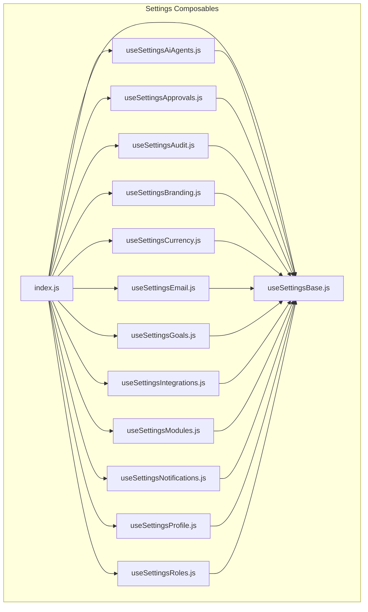

**Diagram sources**
- [index.js:1-14](file://src/composables/settings/index.js#L1-L14)
- [useSettingsBase.js:26-378](file://src/composables/settings/useSettingsBase.js#L26-L378)

**Section sources**
- [index.js:1-14](file://src/composables/settings/index.js#L1-L14)

## Core Components
- useSettingsBase.js: Central hub providing tenant ID, API base URL, RBAC helpers, UI preferences, confirmation dialog, audit logging, currency formatting, pricing/subscription state, and tab navigation. All other settings modules consume these capabilities.
- Module-specific composables: Each encapsulates its own data, validation, persistence, and UI interactions while delegating shared behavior to the base.

Key responsibilities of the base:
- Tenant and auth context: getTenantId, getUserRole, getUserEmail
- API access: API_BASE_URL and shared fetch/axios usage patterns
- RBAC integration: hasPermission, initializeRBAC, create/update/delete role, available permissions
- UI preferences: load/save brand/UI preferences, apply theme and typography live
- Confirmation flows: open/close/handle confirm dialogs for destructive actions
- Audit logging: logAudit for sensitive operations
- Currency: formatCurrency, formatCurrencyCompact, currencyCode
- Subscription/pricing: ownerSubscription, selectedTierId, totals, activeCycle, upgrade flow

**Section sources**
- [useSettingsBase.js:26-378](file://src/composables/settings/useSettingsBase.js#L26-L378)

## Architecture Overview
The settings system uses a layered architecture:
- Presentation layer (Vue components) consumes composables
- Composables layer encapsulates business logic, state, and API calls
- Services layer handles HTTP requests (axios/fetch) and external services (currencyService, modules_api, crm_email_api)
- Backend APIs provide persistence and enforcement (approvals, audit logs, modules manager, telegram bot, etc.)

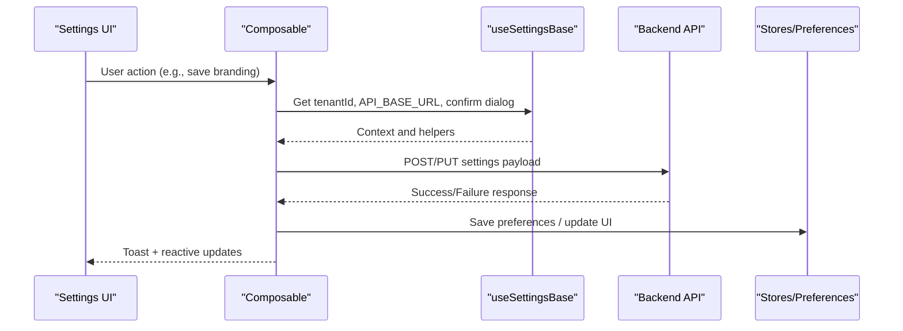

**Diagram sources**
- [useSettingsBase.js:26-378](file://src/composables/settings/useSettingsBase.js#L26-L378)
- [useSettingsBranding.js:91-111](file://src/composables/settings/useSettingsBranding.js#L91-L111)
- [useSettingsEmail.js:67-118](file://src/composables/settings/useSettingsEmail.js#L67-L118)

## Detailed Component Analysis

### useSettingsBase.js
- Provides shared state and methods consumed by all settings modules.
- Exposes constants for roles, permissions, UI options, and defaults.
- Manages tabs and navigation state for the settings UI.
- Handles subscription calculator and module selection state.
- Integrates RBAC and UI preferences for dynamic permission scoping and theming.

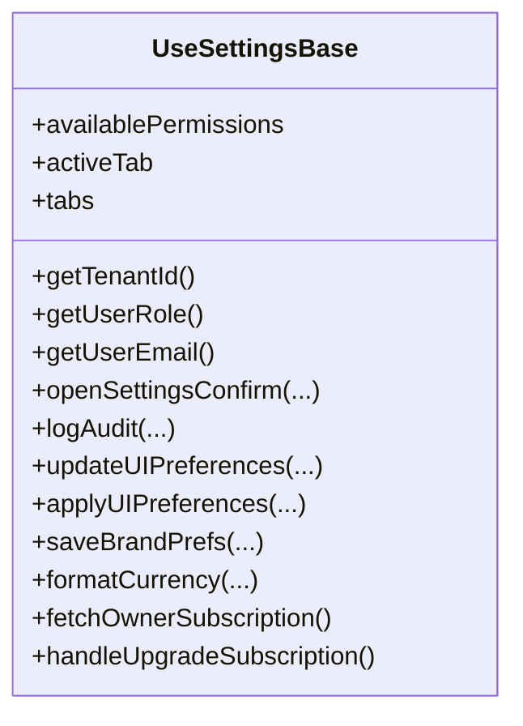

**Diagram sources**
- [useSettingsBase.js:26-378](file://src/composables/settings/useSettingsBase.js#L26-L378)

**Section sources**
- [useSettingsBase.js:26-378](file://src/composables/settings/useSettingsBase.js#L26-L378)

### useSettingsAiAgents.js
- Maintains a list of AI agent configurations with schedule and delivery method.
- Persists changes via POST to the AI agents endpoint.
- Provides success/error feedback per agent.

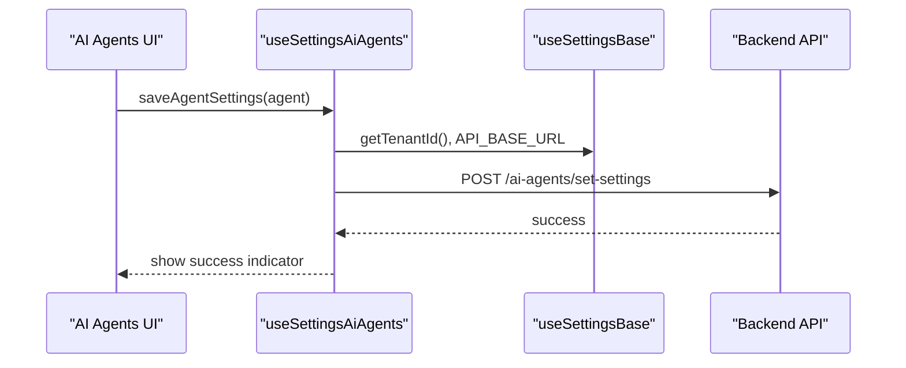

**Diagram sources**
- [useSettingsAiAgents.js:23-38](file://src/composables/settings/useSettingsAiAgents.js#L23-L38)
- [useSettingsBase.js:26-378](file://src/composables/settings/useSettingsBase.js#L26-L378)

**Section sources**
- [useSettingsAiAgents.js:1-42](file://src/composables/settings/useSettingsAiAgents.js#L1-L42)

### useSettingsApprovals.js
- Implements multi-level approval workflows for sensitive settings changes.
- Defines level mappings per setting group and labels/classes for UI.
- Provides functions to submit, decide, withdraw, and check pending approvals.
- Wraps role mutations with guarded flow that either auto-executes or opens a modal for approval submission.

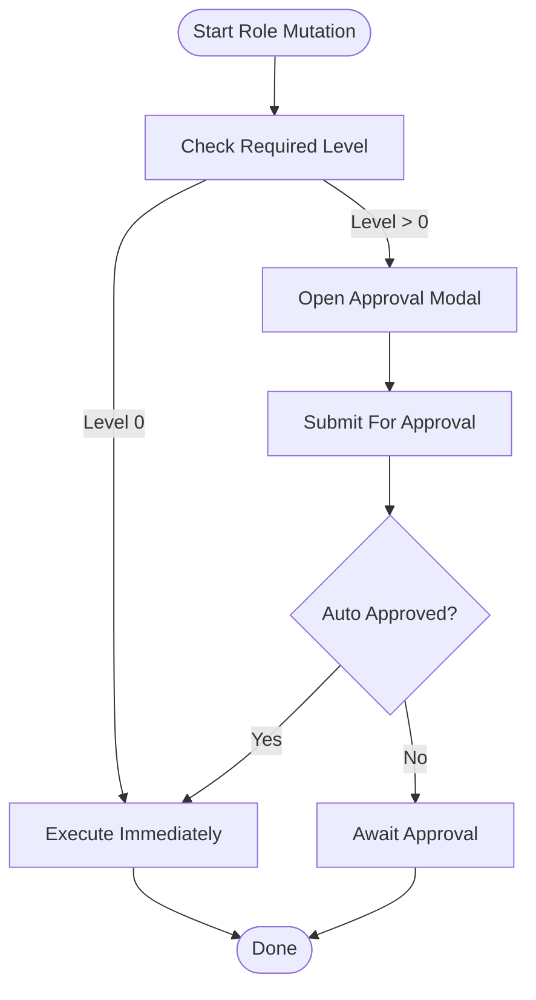

**Diagram sources**
- [useSettingsApprovals.js:44-70](file://src/composables/settings/useSettingsApprovals.js#L44-L70)
- [useSettingsApprovals.js:146-210](file://src/composables/settings/useSettingsApprovals.js#L146-L210)
- [useSettingsApprovals.js:337-415](file://src/composables/settings/useSettingsApprovals.js#L337-L415)

**Section sources**
- [useSettingsApprovals.js:1-500](file://src/composables/settings/useSettingsApprovals.js#L1-L500)

### useSettingsAudit.js
- Loads paginated audit logs with filtering and computes flags for sensitive modules/actions.
- Provides chart data and action totals for visualization.
- Uses tenant context and token-based authorization.

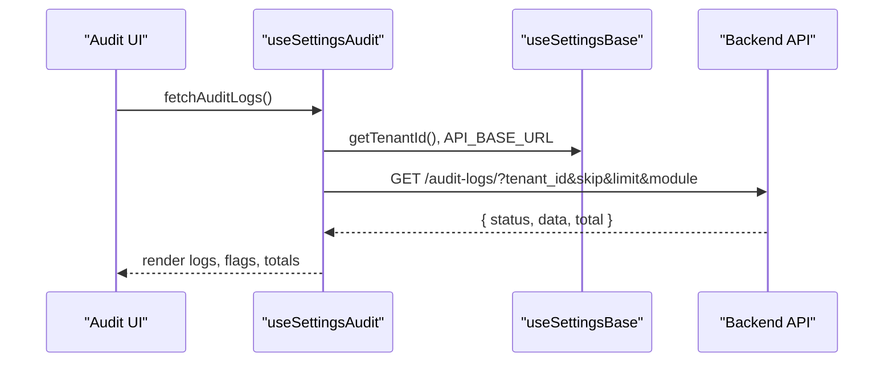

**Diagram sources**
- [useSettingsAudit.js:66-81](file://src/composables/settings/useSettingsAudit.js#L66-L81)
- [useSettingsBase.js:26-378](file://src/composables/settings/useSettingsBase.js#L26-L378)

**Section sources**
- [useSettingsAudit.js:1-94](file://src/composables/settings/useSettingsAudit.js#L1-L94)

### useSettingsBranding.js
- Syncs global brand preferences into a local form and applies UI preferences live.
- Supports visual style presets, color pickers, theme mode preview, and reset to original UI.
- Saves both UI preferences and branding metadata to backend.

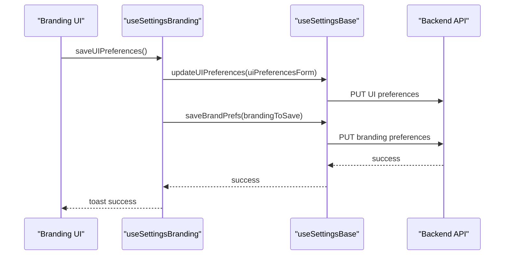

**Diagram sources**
- [useSettingsBranding.js:91-111](file://src/composables/settings/useSettingsBranding.js#L91-L111)
- [useSettingsBase.js:26-378](file://src/composables/settings/useSettingsBase.js#L26-L378)

**Section sources**
- [useSettingsBranding.js:1-119](file://src/composables/settings/useSettingsBranding.js#L1-L119)

### useSettingsCurrency.js
- Manages system currency, decimal places, symbol position, and symbol mapping.
- Persists settings via currency service and updates runtime currency configuration.
- Provides formatted previews and error handling.

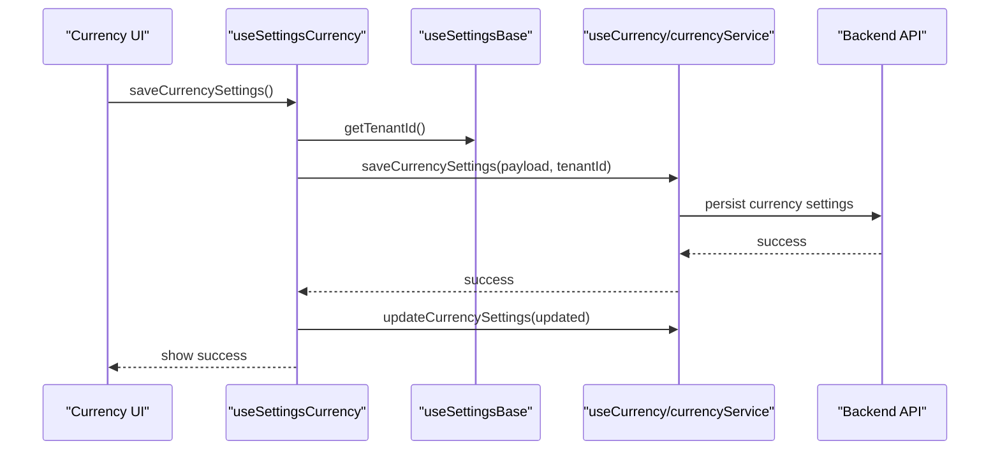

**Diagram sources**
- [useSettingsCurrency.js:41-67](file://src/composables/settings/useSettingsCurrency.js#L41-L67)
- [useSettingsBase.js:26-378](file://src/composables/settings/useSettingsBase.js#L26-L378)

**Section sources**
- [useSettingsCurrency.js:1-94](file://src/composables/settings/useSettingsCurrency.js#L1-L94)

### useSettingsEmail.js
- Manages SMTP/email configurations including creation, editing, deletion, and testing.
- Normalizes backend field names to frontend template fields.
- Validates required fields and supports notification frequency toggles per type.

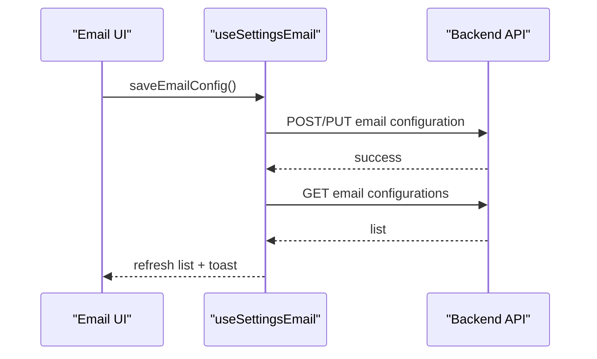

**Diagram sources**
- [useSettingsEmail.js:67-118](file://src/composables/settings/useSettingsEmail.js#L67-L118)
- [useSettingsEmail.js:201-216](file://src/composables/settings/useSettingsEmail.js#L201-L216)

**Section sources**
- [useSettingsEmail.js:1-240](file://src/composables/settings/useSettingsEmail.js#L1-L240)

### useSettingsGoals.js
- Manages company goals with CRUD operations, duplication, and AI insights generation.
- Computes counts for active/completed goals and AI insights.
- Provides helper classes for status/priority/progress/risk display.

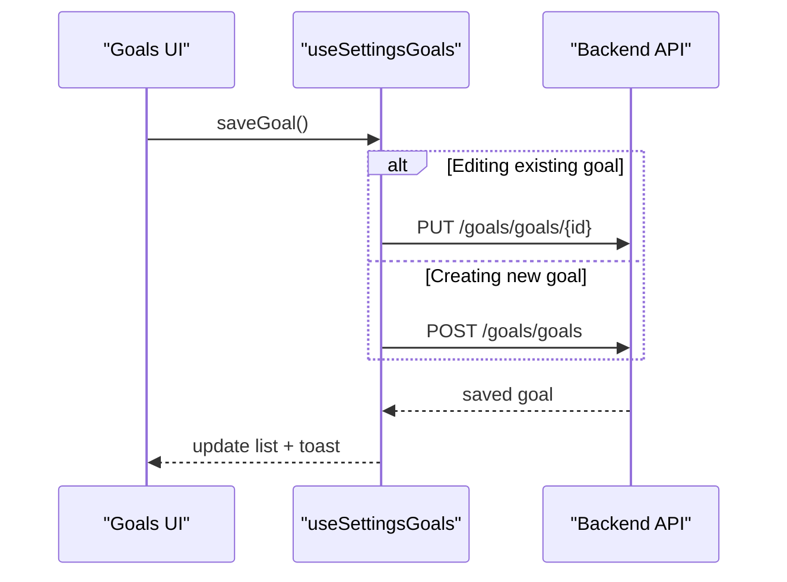

**Diagram sources**
- [useSettingsGoals.js:57-80](file://src/composables/settings/useSettingsGoals.js#L57-L80)

**Section sources**
- [useSettingsGoals.js:1-172](file://src/composables/settings/useSettingsGoals.js#L1-L172)

### useSettingsIntegrations.js
- Configures Telegram bot integration: load/save config, enable/disable, and view conversations.
- Uses axios for HTTP requests and manages loading/success/error states.

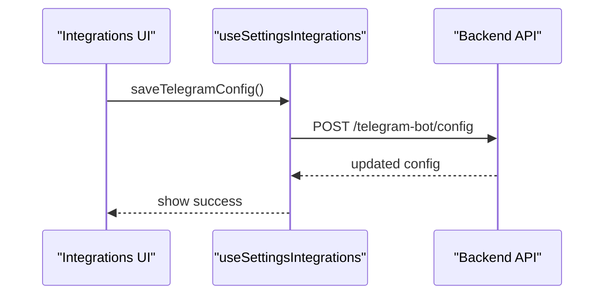

**Diagram sources**
- [useSettingsIntegrations.js:27-45](file://src/composables/settings/useSettingsIntegrations.js#L27-L45)

**Section sources**
- [useSettingsIntegrations.js:1-72](file://src/composables/settings/useSettingsIntegrations.js#L1-L72)

### useSettingsModules.js
- Manages module subscriptions, payment plans, due dates, and upgrade requests.
- Fetches subscribed modules, pending requests, and storage usage.
- Maps frontend module IDs to backend IDs and caches plan details.

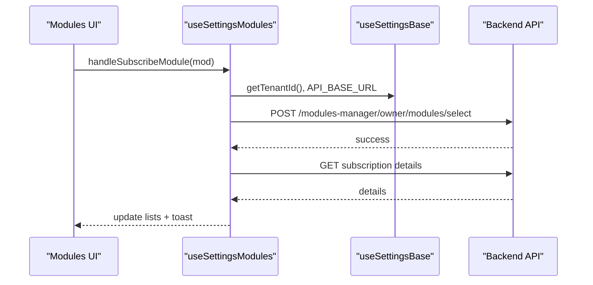

**Diagram sources**
- [useSettingsModules.js:308-352](file://src/composables/settings/useSettingsModules.js#L308-L352)
- [useSettingsBase.js:26-378](file://src/composables/settings/useSettingsBase.js#L26-L378)

**Section sources**
- [useSettingsModules.js:1-398](file://src/composables/settings/useSettingsModules.js#L1-L398)

### useSettingsNotifications.js
- Loads, groups, filters, and exports notifications; supports item-level and global stock thresholds.
- Provides test send functionality and saves notification settings.
- Generates PDF and Excel reports.

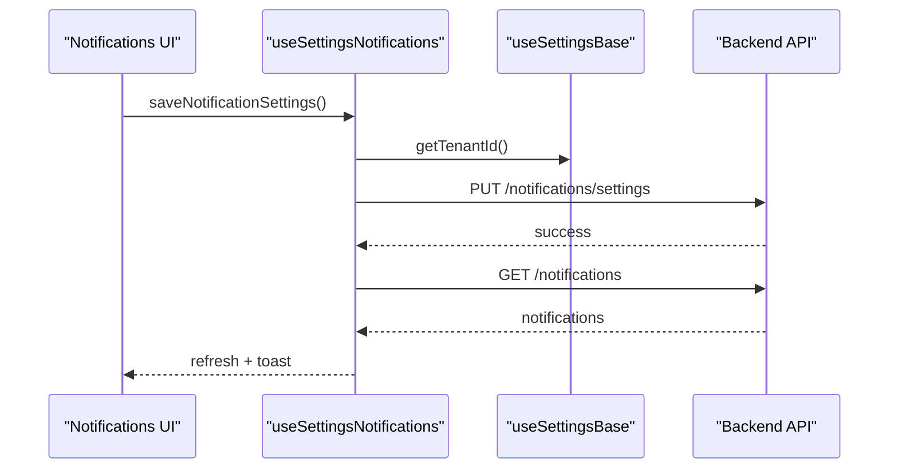

**Diagram sources**
- [useSettingsNotifications.js:276-292](file://src/composables/settings/useSettingsNotifications.js#L276-L292)
- [useSettingsBase.js:26-378](file://src/composables/settings/useSettingsBase.js#L26-L378)

**Section sources**
- [useSettingsNotifications.js:1-424](file://src/composables/settings/useSettingsNotifications.js#L1-L424)

### useSettingsProfile.js
- Loads tenant details, normalizes fields, uploads/removes company logo, and updates profile.
- Syncs branding preferences after profile updates.

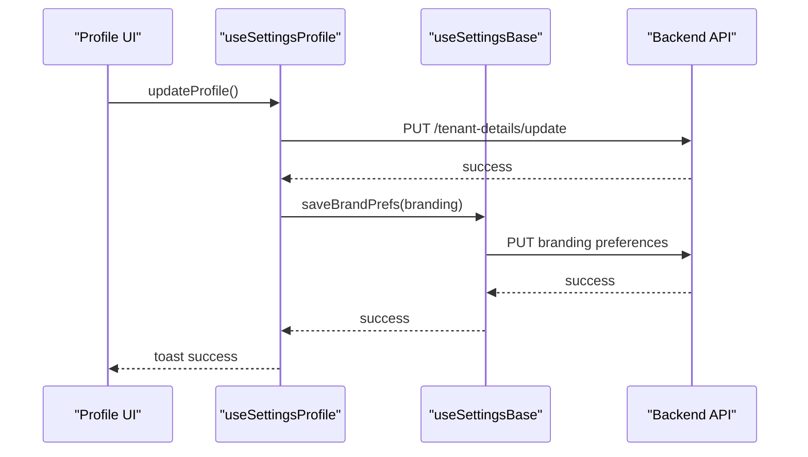

**Diagram sources**
- [useSettingsProfile.js:130-185](file://src/composables/settings/useSettingsProfile.js#L130-L185)
- [useSettingsBase.js:26-378](file://src/composables/settings/useSettingsBase.js#L26-L378)

**Section sources**
- [useSettingsProfile.js:1-195](file://src/composables/settings/useSettingsProfile.js#L1-L195)

### useSettingsRoles.js
- Manages roles and permissions, including POS addons and asset scope fields.
- Opens modal for creating/editing roles, validates inputs, and delegates create/update/delete to RBAC base.
- Syncs POS permissions to localStorage for downstream features.

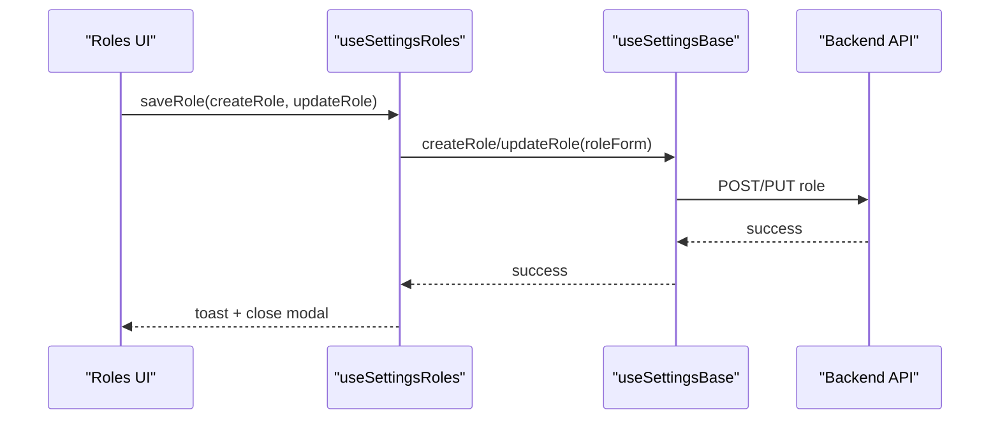

**Diagram sources**
- [useSettingsRoles.js:142-155](file://src/composables/settings/useSettingsRoles.js#L142-L155)
- [useSettingsBase.js:26-378](file://src/composables/settings/useSettingsBase.js#L26-L378)

**Section sources**
- [useSettingsRoles.js:1-187](file://src/composables/settings/useSettingsRoles.js#L1-L187)

## Dependency Analysis
- All modules depend on useSettingsBase for shared context and utilities.
- Some modules integrate additional services:
  - Email: crm_email_api for email templates and SMTP configs
  - Currency: useCurrency and currencyService for runtime formatting and persistence
  - Modules: modules_api for statuses and subscription requests
  - Notifications: jspdf/jspdf-autotable and excel utils for export
- RBAC integration is centralized in the base, exposing permission checks and role management.

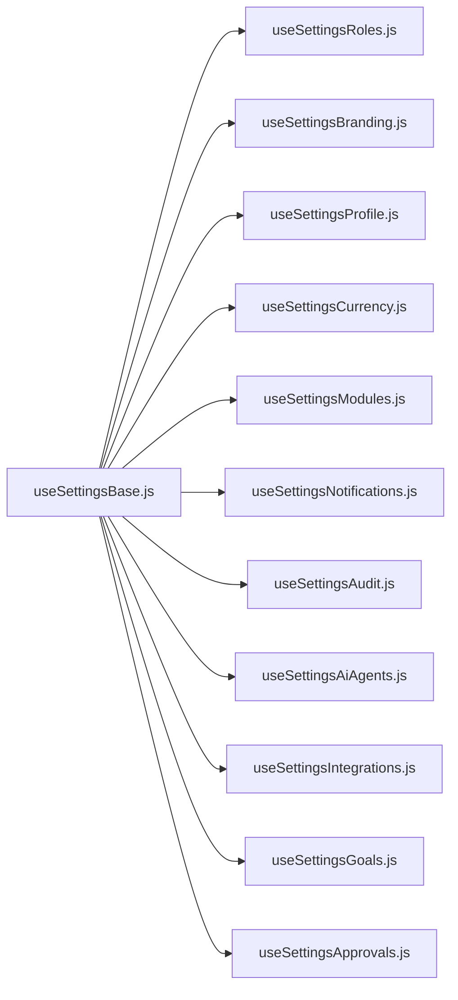

**Diagram sources**
- [useSettingsBase.js:26-378](file://src/composables/settings/useSettingsBase.js#L26-L378)
- [index.js:1-14](file://src/composables/settings/index.js#L1-L14)

**Section sources**
- [useSettingsBase.js:26-378](file://src/composables/settings/useSettingsBase.js#L26-L378)
- [index.js:1-14](file://src/composables/settings/index.js#L1-L14)

## Performance Considerations
- Prefer computed properties for derived data to minimize recalculations (e.g., grouped notifications, totals).
- Cache expensive results locally where appropriate (e.g., payment plans, subscription details).
- Debounce or throttle user input-heavy operations if needed (e.g., search/filter in notifications).
- Use pagination for large datasets (e.g., audit logs) to reduce payload size.
- Avoid unnecessary re-renders by keeping reactive state minimal and scoped to relevant components.

[No sources needed since this section provides general guidance]

## Troubleshooting Guide
Common issues and resolutions:
- Missing tenant ID: Ensure getTenantId returns a valid value before making API calls. Many modules guard against missing tenant context.
- Authentication failures: Verify Authorization header includes a valid token from localStorage.
- Network errors: Wrap fetch/axios calls in try/catch and surface user-friendly messages via toast.
- Validation errors: Validate required fields before submission (e.g., email config fields).
- Approval workflow blocks: If a mutation requires approval, ensure the modal flow is handled and the user submits the request.

**Section sources**
- [useSettingsEmail.js:67-73](file://src/composables/settings/useSettingsEmail.js#L67-L73)
- [useSettingsApprovals.js:146-210](file://src/composables/settings/useSettingsApprovals.js#L146-L210)
- [useSettingsNotifications.js:276-292](file://src/composables/settings/useSettingsNotifications.js#L276-L292)

## Conclusion
The settings composable system provides a robust, modular architecture centered around a shared base that standardizes tenant context, RBAC, UI preferences, and persistence patterns. Each domain-specific composable encapsulates its own state and API interactions while leveraging common utilities. The system supports reactive UI updates, validation, approval workflows, and audit trails, ensuring consistency and reliability across settings features.

[No sources needed since this section summarizes without analyzing specific files]

## Appendices

### Reactive Settings Pattern
- State: Use ref for primitive values and reactive objects for complex forms.
- Computed: Derive UI-facing values (totals, filtered lists, categories).
- Watchers: Apply live previews (e.g., typography/theme changes) and sync global preferences.
- Persistence: Save to backend via dedicated endpoints; fallback to defaults when unavailable.

### Validation Rules
- Required fields: Enforced before submission (e.g., email config).
- Type checks: Ensure numeric fields like decimalPlaces are numbers.
- Format checks: Validate email addresses and file types for uploads.

### Migration Strategies for Schema Changes
- Field mapping: Normalize backend responses to frontend shapes (e.g., email config fields).
- Defaults: Provide sensible defaults for new fields to avoid breaking UI.
- Backward compatibility: Support legacy fields during transition periods.
- Caching: Update cache keys when schema versions change to invalidate stale data.

[No sources needed since this section provides general guidance]