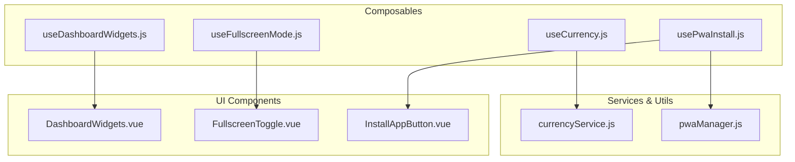
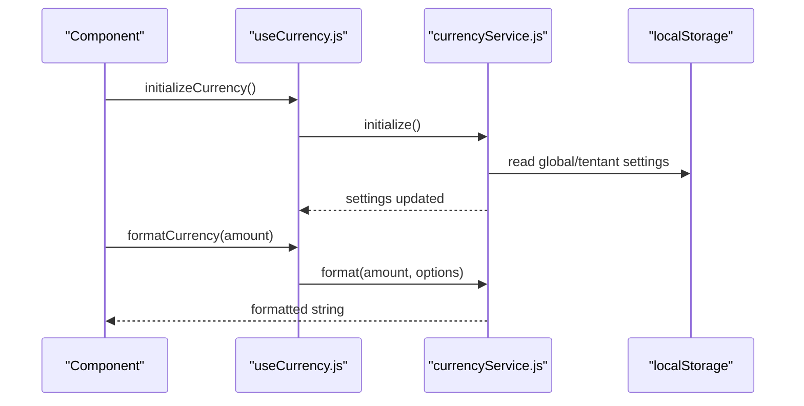
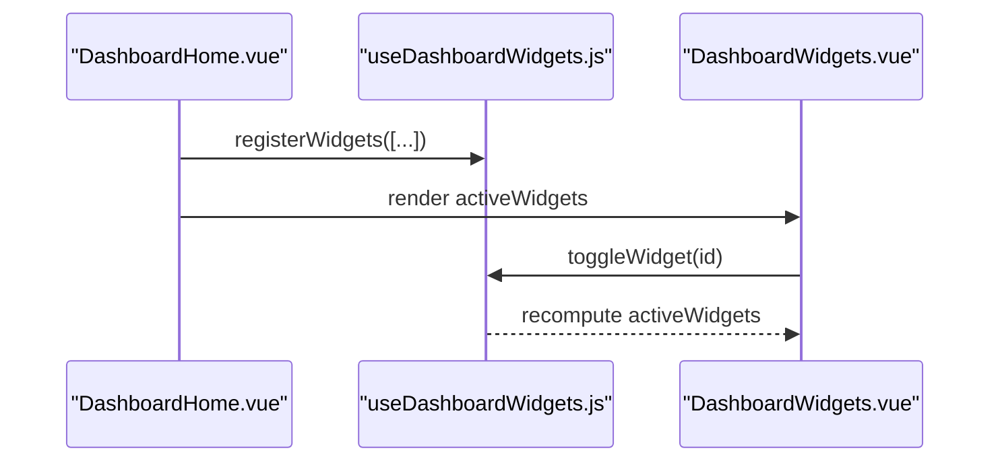
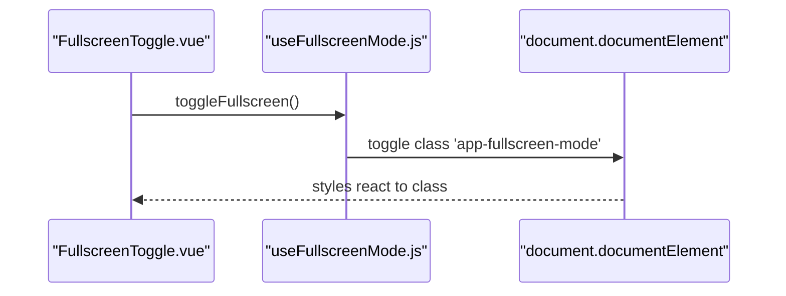
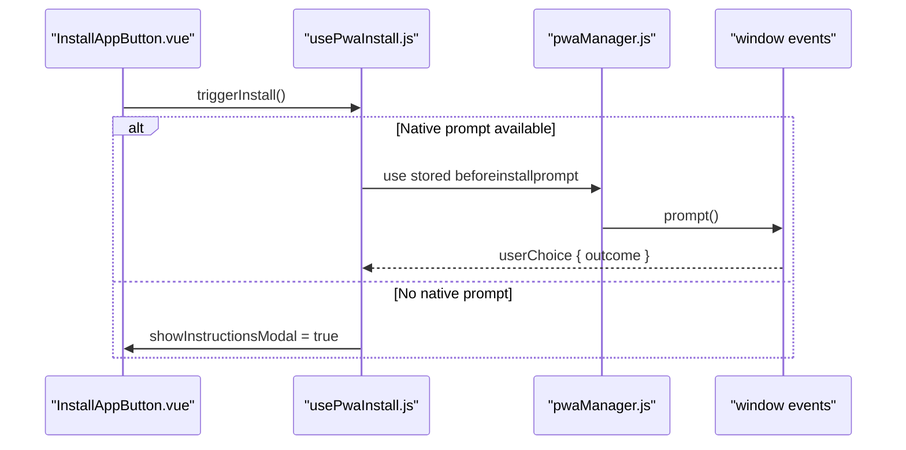
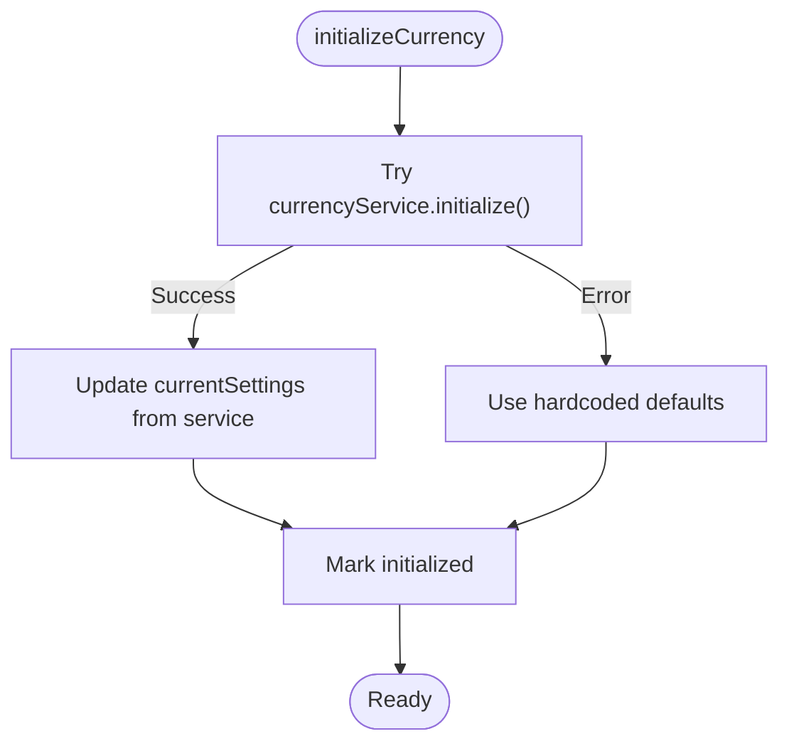
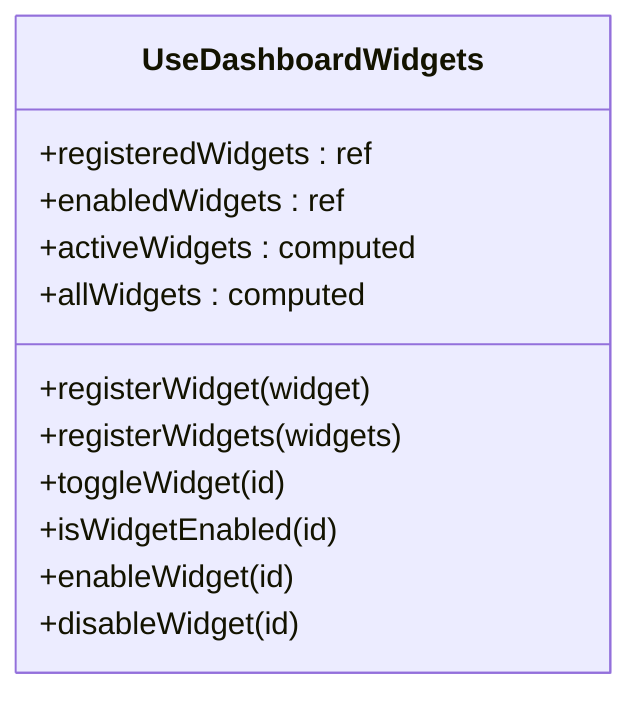
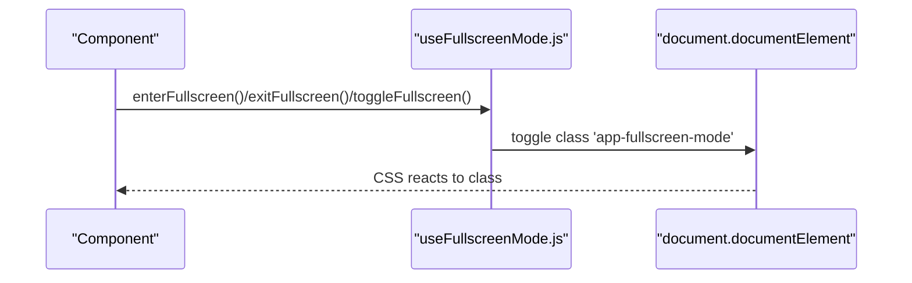
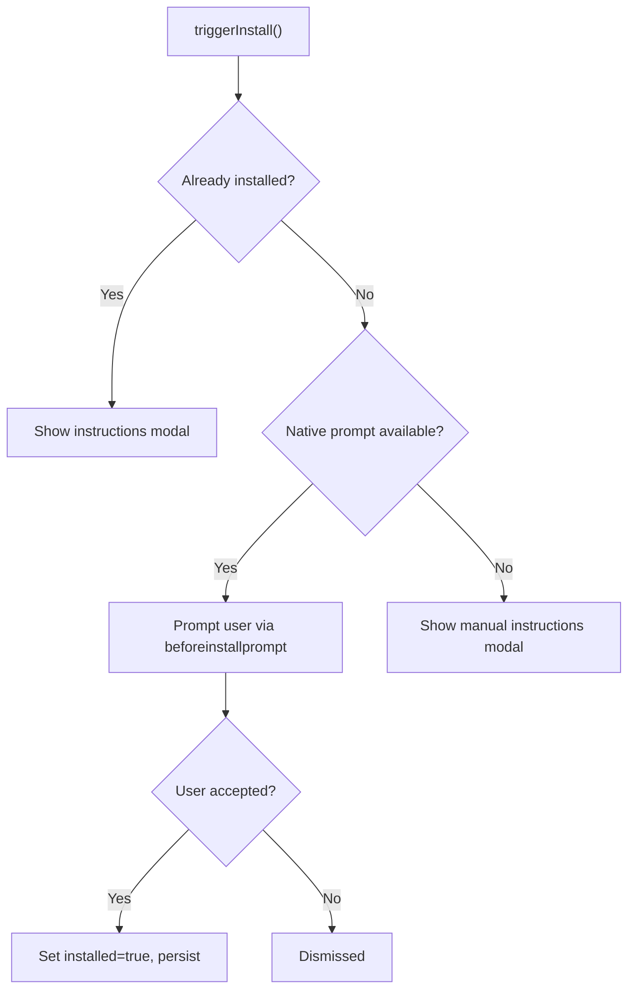
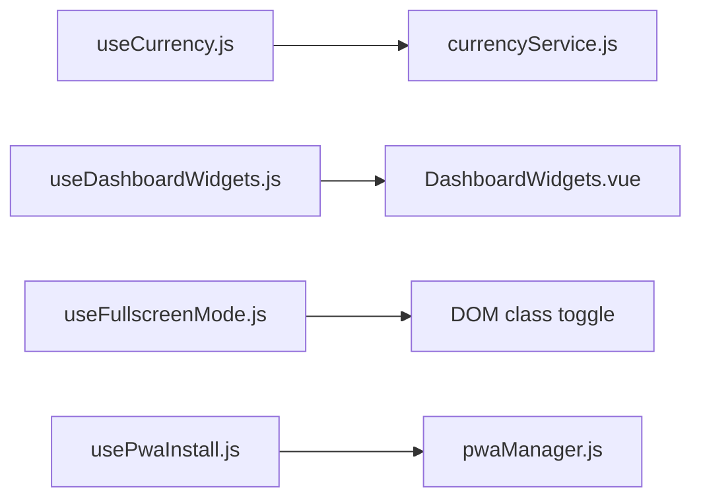

# UI Enhancement Composables

<cite>
**Referenced Files in This Document**
- [useCurrency.js](file://src/composables/useCurrency.js)
- [currencyService.js](file://src/services/currencyService.js)
- [currency.js](file://src/config/currency.js)
- [useDashboardWidgets.js](file://src/composables/useDashboardWidgets.js)
- [DashboardWidgets.vue](file://src/components/ui/DashboardWidgets.vue)
- [useFullscreenMode.js](file://src/composables/useFullscreenMode.js)
- [FullscreenToggle.vue](file://src/components/ui/FullscreenToggle.vue)
- [usePwaInstall.js](file://src/composables/usePwaInstall.js)
- [pwaManager.js](file://src/utils/pwaManager.js)
- [InstallAppButton.vue](file://src/components/InstallAppButton.vue)
</cite>

## Table of Contents
1. Introduction
2. Project Structure
3. Core Components
4. Architecture Overview
5. Detailed Component Analysis
6. Dependency Analysis
7. Performance Considerations
8. Troubleshooting Guide
9. Conclusion

## Introduction
This document explains the UI enhancement composables that improve user interface functionality across the application:
- useCurrency.js: Reactive currency formatting, localization, and financial calculations with support for multiple currencies and exchange-ready settings.
- useDashboardWidgets.js: Dynamic widget management including registration, layout control, and persistence for real-time updates.
- useFullscreenMode.js: Fullscreen toggling via a reactive class on the document root to drive responsive behavior.
- usePwaInstall.js: Progressive Web App installation prompts, service worker detection patterns, and install flow management with fallback instructions.

These composables are designed to be lightweight, reusable, and easy to integrate into Vue components.

## Project Structure
The composables live under src/composables and integrate with services, utilities, and UI components:
- Currency formatting is provided by a composable (useCurrency.js) backed by a service (currencyService.js), with global plugin exposure (config/currency.js).
- Dashboard widgets are managed by a composable (useDashboardWidgets.js) and rendered through a UI component (DashboardWidgets.vue).
- Fullscreen mode is handled by a composable (useFullscreenMode.js) and exposed via a toggle button (FullscreenToggle.vue).
- PWA install flows are orchestrated by a composable (usePwaInstall.js) using a singleton manager (pwaManager.js) and surfaced via InstallAppButton.vue.

**Diagram sources**
- [useCurrency.js:1-216](file://src/composables/useCurrency.js#L1-L216)
- [currencyService.js:1-208](file://src/services/currencyService.js#L1-L208)
- [useDashboardWidgets.js:1-88](file://src/composables/useDashboardWidgets.js#L1-L88)
- [DashboardWidgets.vue:1-71](file://src/components/ui/DashboardWidgets.vue#L1-L71)
- [useFullscreenMode.js:1-29](file://src/composables/useFullscreenMode.js#L1-L29)
- [FullscreenToggle.vue:1-22](file://src/components/ui/FullscreenToggle.vue#L1-L22)
- [usePwaInstall.js:1-111](file://src/composables/usePwaInstall.js#L1-L111)
- [pwaManager.js:1-236](file://src/utils/pwaManager.js#L1-L236)
- [InstallAppButton.vue:1-176](file://src/components/InstallAppButton.vue#L1-L176)

**Section sources**
- [useCurrency.js:1-216](file://src/composables/useCurrency.js#L1-L216)
- [currencyService.js:1-208](file://src/services/currencyService.js#L1-L208)
- [useDashboardWidgets.js:1-88](file://src/composables/useDashboardWidgets.js#L1-L88)
- [DashboardWidgets.vue:1-71](file://src/components/ui/DashboardWidgets.vue#L1-L71)
- [useFullscreenMode.js:1-29](file://src/composables/useFullscreenMode.js#L1-L29)
- [FullscreenToggle.vue:1-22](file://src/components/ui/FullscreenToggle.vue#L1-L22)
- [usePwaInstall.js:1-111](file://src/composables/usePwaInstall.js#L1-L111)
- [pwaManager.js:1-236](file://src/utils/pwaManager.js#L1-L236)
- [InstallAppButton.vue:1-176](file://src/components/InstallAppButton.vue#L1-L176)

## Core Components
- useCurrency.js: Initializes currency settings, formats amounts, parses strings, exposes symbol/code, and persists settings globally or per tenant.
- useDashboardWidgets.js: Registers widgets, tracks enabled state, computes active sets, and persists preferences to localStorage.
- useFullscreenMode.js: Maintains a reactive fullscreen flag and applies a CSS class to the document root for responsive styling.
- usePwaInstall.js: Detects native install prompts, triggers installation, shows manual instructions when needed, and tracks installed state.

**Section sources**
- [useCurrency.js:18-200](file://src/composables/useCurrency.js#L18-L200)
- [useDashboardWidgets.js:24-86](file://src/composables/useDashboardWidgets.js#L24-L86)
- [useFullscreenMode.js:5-27](file://src/composables/useFullscreenMode.js#L5-L27)
- [usePwaInstall.js:49-107](file://src/composables/usePwaInstall.js#L49-L107)

## Architecture Overview
The system separates concerns between composables (reactive logic), services (domain logic), and components (UI). The currency pipeline uses a service-backed approach; dashboard widgets use a registry pattern; fullscreen mode uses DOM class toggling; PWA install uses a singleton manager with event-driven flows.

**Diagram sources**
- [useCurrency.js:24-76](file://src/composables/useCurrency.js#L24-L76)
- [currencyService.js:43-127](file://src/services/currencyService.js#L43-L127)

**Diagram sources**
- [useDashboardWidgets.js:27-73](file://src/composables/useDashboardWidgets.js#L27-L73)
- [DashboardWidgets.vue:51-58](file://src/components/ui/DashboardWidgets.vue#L51-L58)

**Diagram sources**
- [useFullscreenMode.js:6-20](file://src/composables/useFullscreenMode.js#L6-L20)
- [FullscreenToggle.vue:17-21](file://src/components/ui/FullscreenToggle.vue#L17-L21)

**Diagram sources**
- [usePwaInstall.js:49-83](file://src/composables/usePwaInstall.js#L49-L83)
- [pwaManager.js:32-44](file://src/utils/pwaManager.js#L32-L44)
- [InstallAppButton.vue:102-129](file://src/components/InstallAppButton.vue#L102-L129)

## Detailed Component Analysis

### useCurrency.js — Currency Formatting, Localization, and Settings
- Responsibilities:
  - Initialize currency settings from service with robust fallbacks.
  - Format amounts with configurable decimal places and symbol position.
  - Parse formatted strings back to numbers.
  - Expose reactive symbol and code.
  - Persist settings globally or per tenant.
- Key behaviors:
  - Auto-initialization on mount ensures safe defaults if service fails.
  - Safe formatting with try/catch and fallback to local settings.
  - Tenant-aware persistence using token decoding when possible; otherwise global storage.
- Integration examples:
  - In views/components: import and destructure methods like formatCurrency, formatCurrencyCompact, parseCurrency, updateCurrencySettings, saveCurrencySettings.
  - Global plugin: config/currency.js exposes $formatCurrency, $formatCurrencyCompact, $parseCurrency, $getCurrencySymbol, $getCurrencyCode to all templates.

**Diagram sources**
- [useCurrency.js:24-54](file://src/composables/useCurrency.js#L24-L54)

**Section sources**
- [useCurrency.js:18-200](file://src/composables/useCurrency.js#L18-L200)
- [currencyService.js:43-184](file://src/services/currencyService.js#L43-L184)
- [currency.js:7-32](file://src/config/currency.js#L7-L32)

### useDashboardWidgets.js — Dynamic Widget Management
- Responsibilities:
  - Register single or multiple widgets.
  - Track enabled/disabled state with a Set.
  - Compute active widgets list reactively.
  - Persist enabled IDs to localStorage.
- Usage pattern:
  - Register widgets at app or view level.
  - Render only active widgets in the UI.
  - Provide a configuration panel to toggle visibility.

**Diagram sources**
- [useDashboardWidgets.js:24-86](file://src/composables/useDashboardWidgets.js#L24-L86)

**Section sources**
- [useDashboardWidgets.js:1-88](file://src/composables/useDashboardWidgets.js#L1-L88)
- [DashboardWidgets.vue:1-71](file://src/components/ui/DashboardWidgets.vue#L1-L71)

### useFullscreenMode.js — Fullscreen Mode Toggle
- Responsibilities:
  - Maintain a reactive boolean for fullscreen state.
  - Apply/remove a CSS class on document.documentElement to enable responsive styles.
- Integration:
  - Use in any component to toggle fullscreen and observe the class change for styling.

**Diagram sources**
- [useFullscreenMode.js:6-20](file://src/composables/useFullscreenMode.js#L6-L20)
- [FullscreenToggle.vue:17-21](file://src/components/ui/FullscreenToggle.vue#L17-L21)

**Section sources**
- [useFullscreenMode.js:1-29](file://src/composables/useFullscreenMode.js#L1-L29)
- [FullscreenToggle.vue:1-22](file://src/components/ui/FullscreenToggle.vue#L1-L22)

### usePwaInstall.js — PWA Installation Flow
- Responsibilities:
  - Detect native install prompts and track installed state.
  - Trigger installation via the captured event when available.
  - Show manual instructions modal for platforms without native prompts.
  - Listen for appinstalled to update state and persist preference.
- Integration:
  - Use in buttons or banners to offer install actions.
  - Combine with InstallAppButton.vue for a ready-to-use UI.

**Diagram sources**
- [usePwaInstall.js:49-83](file://src/composables/usePwaInstall.js#L49-L83)
- [pwaManager.js:32-44](file://src/utils/pwaManager.js#L32-L44)

**Section sources**
- [usePwaInstall.js:1-111](file://src/composables/usePwaInstall.js#L1-L111)
- [pwaManager.js:1-236](file://src/utils/pwaManager.js#L1-L236)
- [InstallAppButton.vue:1-176](file://src/components/InstallAppButton.vue#L1-L176)

## Dependency Analysis
- useCurrency depends on currencyService for initialization, formatting, parsing, and persistence.
- useDashboardWidgets is self-contained but consumed by DashboardWidgets.vue to render active widgets.
- useFullscreenMode interacts with the DOM to apply a CSS class used by application styles.
- usePwaInstall depends on pwaManager for capturing and managing the beforeinstallprompt lifecycle.

**Diagram sources**
- [useCurrency.js:1-216](file://src/composables/useCurrency.js#L1-L216)
- [currencyService.js:1-208](file://src/services/currencyService.js#L1-L208)
- [useDashboardWidgets.js:1-88](file://src/composables/useDashboardWidgets.js#L1-L88)
- [DashboardWidgets.vue:1-71](file://src/components/ui/DashboardWidgets.vue#L1-L71)
- [useFullscreenMode.js:1-29](file://src/composables/useFullscreenMode.js#L1-L29)
- [usePwaInstall.js:1-111](file://src/composables/usePwaInstall.js#L1-L111)
- [pwaManager.js:1-236](file://src/utils/pwaManager.js#L1-L236)

**Section sources**
- [useCurrency.js:1-216](file://src/composables/useCurrency.js#L1-L216)
- [currencyService.js:1-208](file://src/services/currencyService.js#L1-L208)
- [useDashboardWidgets.js:1-88](file://src/composables/useDashboardWidgets.js#L1-L88)
- [DashboardWidgets.vue:1-71](file://src/components/ui/DashboardWidgets.vue#L1-L71)
- [useFullscreenMode.js:1-29](file://src/composables/useFullscreenMode.js#L1-L29)
- [usePwaInstall.js:1-111](file://src/composables/usePwaInstall.js#L1-L111)
- [pwaManager.js:1-236](file://src/utils/pwaManager.js#L1-L236)

## Performance Considerations
- Currency formatting:
  - Prefer using formatCurrencyCompact for large numbers to reduce visual clutter.
  - Avoid frequent calls in tight loops; memoize results where appropriate.
- Dashboard widgets:
  - Registration happens once per view; avoid repeated registrations.
  - Enabled state is persisted; minimize unnecessary toggles.
- Fullscreen mode:
  - Class toggling is lightweight; ensure CSS rules are scoped to avoid layout thrash.
- PWA install:
  - Prompt handling is event-driven; do not poll or force prompts excessively.
  - Respect cooldown and dismissal policies to avoid UX fatigue.

[No sources needed since this section provides general guidance]

## Troubleshooting Guide
- Currency service initialization failures:
  - If backend or localStorage is unavailable, defaults are applied automatically. Check console logs for errors during initialization.
  - Verify that currency settings are saved correctly for tenant vs global contexts.
- Dashboard widgets not appearing:
  - Ensure widgets are registered before rendering.
  - Confirm that enabled IDs are persisted and loaded from localStorage.
- Fullscreen mode not applying styles:
  - Verify that the document root has the expected class when toggled.
  - Ensure CSS targets document.documentElement for responsive changes.
- PWA install prompt not showing:
  - Native prompts require meeting PWA criteria and user interaction thresholds.
  - On unsupported browsers/platforms, manual instructions will appear; guide users accordingly.

**Section sources**
- [useCurrency.js:24-54](file://src/composables/useCurrency.js#L24-L54)
- [currencyService.js:43-90](file://src/services/currencyService.js#L43-L90)
- [useDashboardWidgets.js:8-22](file://src/composables/useDashboardWidgets.js#L8-L22)
- [useFullscreenMode.js:18-20](file://src/composables/useFullscreenMode.js#L18-L20)
- [usePwaInstall.js:49-83](file://src/composables/usePwaInstall.js#L49-L83)
- [pwaManager.js:74-113](file://src/utils/pwaManager.js#L74-L113)

## Conclusion
These composables provide a cohesive set of UI enhancements:
- Robust, reactive currency formatting with flexible localization and persistence.
- Dynamic dashboard widgets with registration, toggling, and persistence.
- Simple fullscreen mode toggling via DOM class management.
- Reliable PWA installation flows with platform-aware prompts and fallback instructions.

Adopt these composables to standardize UI behavior, reduce duplication, and improve user experience across the application.

[No sources needed since this section summarizes without analyzing specific files]