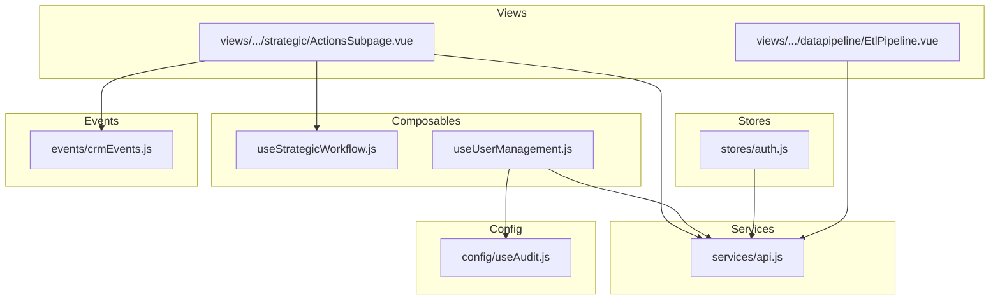
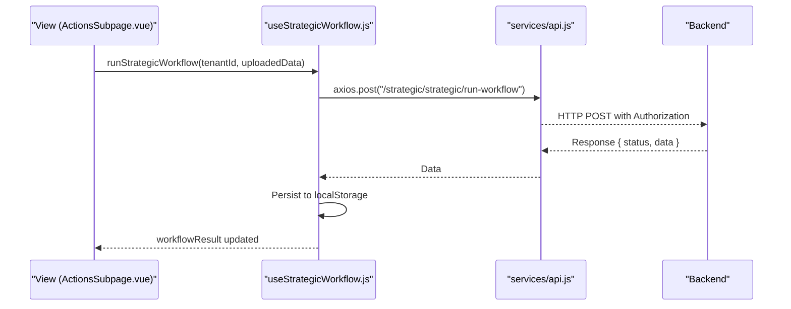
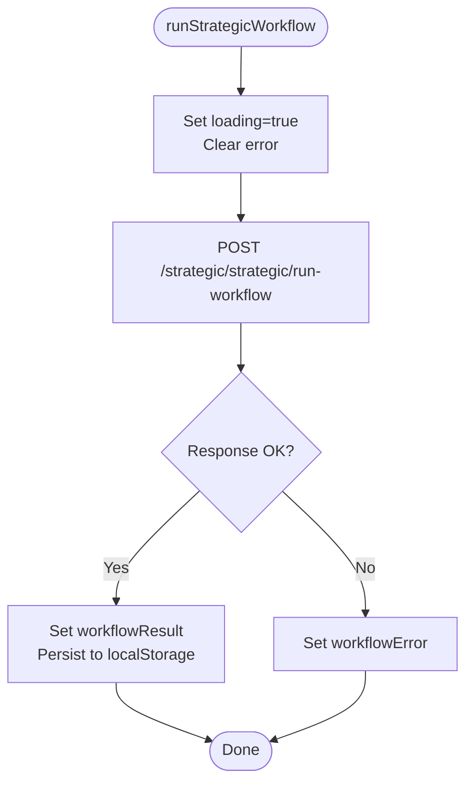
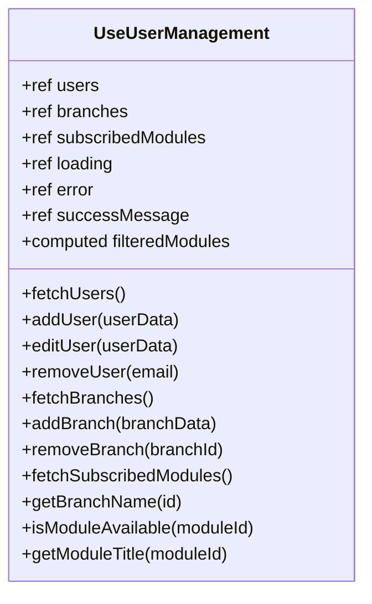
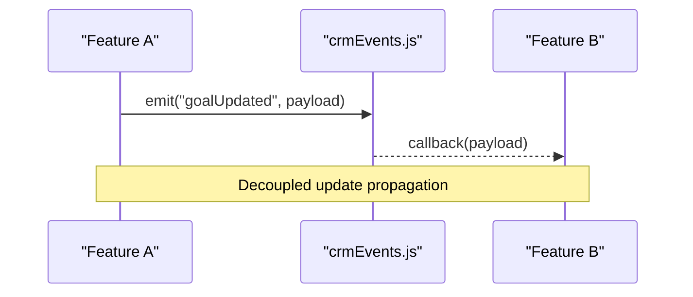
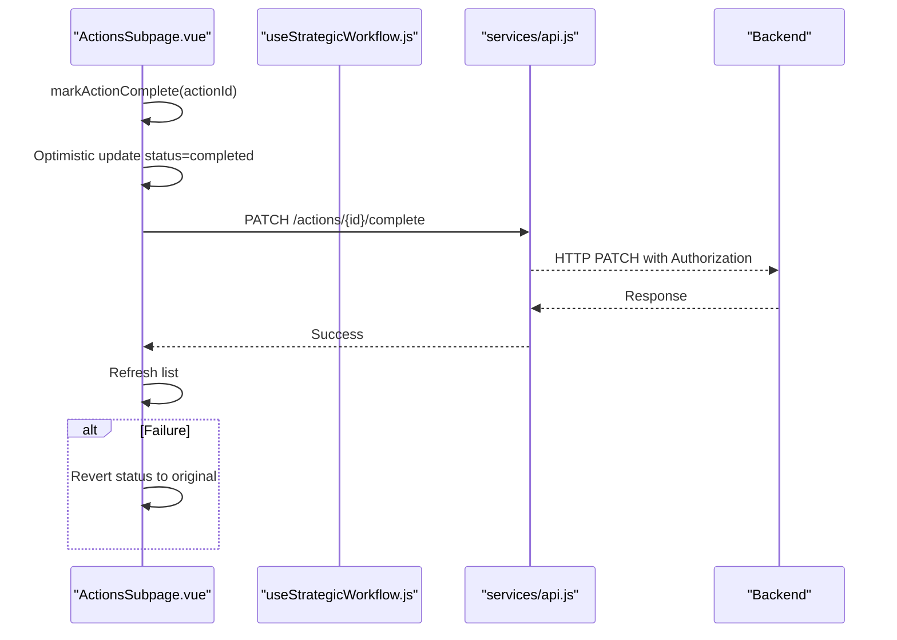
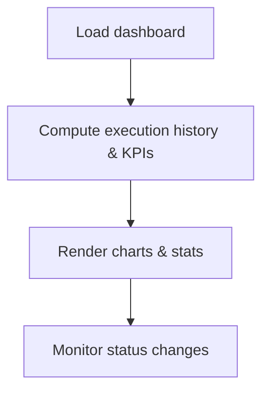
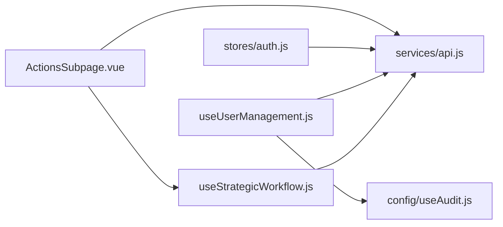

# Workflow Composables

<cite>
**Referenced Files in This Document**
- [useStrategicWorkflow.js](file://src/composables/useStrategicWorkflow.js)
- [useUserManagement.js](file://src/composables/useUserManagement.js)
- [api.js](file://src/services/api.js)
- [useAudit.js](file://src/config/useAudit.js)
- [auth.js](file://src/stores/auth.js)
- [crmEvents.js](file://src/events/crmEvents.js)
- [ActionsSubpage.vue](file://src/views/Modules/strategic/ActionsSubpage.vue)
- [EtlPipeline.vue](file://src/views/Modules/datapipeline/EtlPipeline.vue)
- [architecture.md](file://src/.ai/architecture.md)
</cite>

## Table of Contents
1. Introduction
2. Project Structure
3. Core Components
4. Architecture Overview
5. Detailed Component Analysis
6. Dependency Analysis
7. Performance Considerations
8. Troubleshooting Guide
9. Conclusion

## Introduction
This document explains the workflow-oriented composables that manage complex business processes in the application, focusing on:
- Strategic planning workflows for goal tracking, action item management, milestone monitoring, and progress analytics with collaboration-friendly patterns
- User administration operations including user CRUD, role assignment, permission management, and audit logging
- Workflow state management, event-driven architecture patterns, and integration with backend services
- Examples of workflow orchestration, error recovery mechanisms, and performance optimization strategies for long-running processes

The guidance is grounded in the actual implementation found in the repository’s composables, services, stores, and views.

## Project Structure
At a high level:
- Composables encapsulate reusable business logic (e.g., strategic workflow and user management)
- Services centralize HTTP communication, authentication, and token refresh
- Stores hold global app state (e.g., auth)
- Views orchestrate UI interactions and call composables/services
- Config modules provide cross-cutting utilities like audit logging and activity tracking
- Events module provides a simple pub/sub bus for decoupled communication

**Diagram sources**
- [useStrategicWorkflow.js:1-58](file://src/composables/useStrategicWorkflow.js#L1-L58)
- [useUserManagement.js:1-292](file://src/composables/useUserManagement.js#L1-L292)
- [api.js:1-209](file://src/services/api.js#L1-L209)
- [useAudit.js:1-76](file://src/config/useAudit.js#L1-L76)
- [auth.js:1-22](file://src/stores/auth.js#L1-L22)
- [crmEvents.js:1-30](file://src/events/crmEvents.js#L1-L30)
- [ActionsSubpage.vue:698-863](file://src/views/Modules/strategic/ActionsSubpage.vue#L698-L863)
- [EtlPipeline.vue:251-288](file://src/views/Modules/datapipeline/EtlPipeline.vue#L251-L288)

**Section sources**
- [architecture.md:49-72](file://src/.ai/architecture.md#L49-L72)

## Core Components
- useStrategicWorkflow.js: Provides reactive state and functions to run and persist strategic workflow results, fetch saved overviews, and coordinate with backend endpoints. It persists results to localStorage for resilience across sessions.
- useUserManagement.js: Encapsulates user, branch, and module subscription management with loading/error/success states, computed filtering, and helper methods. It integrates with backend endpoints and configuration for available modules.

Key responsibilities:
- State management: Reactive refs for data, loading, errors, and success messages
- Backend integration: Direct fetch/axios calls to API endpoints
- Error handling: Centralized error setters and message clearing
- Auditability: Optional integration points for audit logging

**Section sources**
- [useStrategicWorkflow.js:1-58](file://src/composables/useStrategicWorkflow.js#L1-L58)
- [useUserManagement.js:1-292](file://src/composables/useUserManagement.js#L1-L292)

## Architecture Overview
The system follows an event-driven and service-oriented pattern:
- Composables own domain logic and expose actions to components
- Services handle HTTP requests, authentication headers, and token refresh
- Stores maintain global state such as authentication tokens and roles
- Views orchestrate UI flows and compose multiple services/composables
- A lightweight event bus enables decoupled communication between features

**Diagram sources**
- [useStrategicWorkflow.js:41-57](file://src/composables/useStrategicWorkflow.js#L41-L57)
- [api.js:64-146](file://src/services/api.js#L64-L146)
- [ActionsSubpage.vue:781-827](file://src/views/Modules/strategic/ActionsSubpage.vue#L781-L827)

## Detailed Component Analysis

### Strategic Workflow Composable
Purpose:
- Run strategic workflows and retrieve saved overviews
- Manage workflow lifecycle state (loading, result, error)
- Persist results locally for resilience and quick reloads

Key behaviors:
- On app load, restore persisted workflow result from localStorage
- Fetch saved overview from backend; if valid, update state and persist
- Execute workflow via POST; update state and persist response
- Handle errors by setting workflowError and ensuring loading is cleared

Integration points:
- Uses API_BASE_URL from services/api.js
- Consumes axios with automatic Authorization header injection and token refresh

**Diagram sources**
- [useStrategicWorkflow.js:41-57](file://src/composables/useStrategicWorkflow.js#L41-L57)

**Section sources**
- [useStrategicWorkflow.js:1-58](file://src/composables/useStrategicWorkflow.js#L1-L58)

### User Management Composable
Purpose:
- Provide CRUD for users and branches
- Manage subscribed modules per tenant
- Expose helpers for module availability and branch name resolution

Key behaviors:
- Loading flags per operation type (users, branches, modules, action)
- Centralized error and success messaging with auto-clear timers
- Computed filtered modules based on subscription and availability flags
- Helpers to resolve branch names and check module availability

Integration points:
- Direct fetch calls to user, branch, and modules endpoints
- Uses decodeJWT for token retrieval when needed
- Integrates with config/moduleCards for module metadata

**Diagram sources**
- [useUserManagement.js:15-291](file://src/composables/useUserManagement.js#L15-L291)

**Section sources**
- [useUserManagement.js:1-292](file://src/composables/useUserManagement.js#L1-L292)

### Event-Driven Patterns and Collaboration
- The CRM events module implements a simple pub/sub bus with on/off/emit, enabling decoupled communication across features
- While not directly used by the strategic workflow composable, this pattern can be adopted for real-time collaboration signals (e.g., updates to goals or milestones)

**Diagram sources**
- [crmEvents.js:1-30](file://src/events/crmEvents.js#L1-L30)

**Section sources**
- [crmEvents.js:1-30](file://src/events/crmEvents.js#L1-L30)

### Workflow Orchestration in Views
- The strategic Actions view orchestrates fetching, filtering, pagination, and execution of actions, integrating with both local workflow results and backend data
- Demonstrates optimistic updates and rollback on failure for marking actions complete

**Diagram sources**
- [ActionsSubpage.vue:726-747](file://src/views/Modules/strategic/ActionsSubpage.vue#L726-L747)
- [api.js:64-146](file://src/services/api.js#L64-L146)

**Section sources**
- [ActionsSubpage.vue:698-863](file://src/views/Modules/strategic/ActionsSubpage.vue#L698-L863)

### Long-Running Processes and Progress Analytics
- The ETL pipeline view demonstrates progress analytics and execution history, computing metrics like average quality and rendering visualizations
- These patterns are applicable to long-running strategic workflows to show progress and outcomes

**Diagram sources**
- [EtlPipeline.vue:251-288](file://src/views/Modules/datapipeline/EtlPipeline.vue#L251-L288)

**Section sources**
- [EtlPipeline.vue:251-288](file://src/views/Modules/datapipeline/EtlPipeline.vue#L251-L288)

## Dependency Analysis
- useStrategicWorkflow depends on:
  - Vue reactivity (ref)
  - Axios for HTTP
  - API base URL from services/api.js
  - LocalStorage for persistence
- useUserManagement depends on:
  - Vue reactivity (ref, computed)
  - JWT decoding utility
  - API base URL and direct fetch calls
  - Module configuration for available modules
- Cross-cutting dependencies:
  - Authentication and token refresh handled centrally in services/api.js
  - Auth store maintains token and role state
  - Audit logging utility supports compliance and traceability

**Diagram sources**
- [useStrategicWorkflow.js:1-58](file://src/composables/useStrategicWorkflow.js#L1-L58)
- [useUserManagement.js:1-292](file://src/composables/useUserManagement.js#L1-L292)
- [api.js:1-209](file://src/services/api.js#L1-L209)
- [useAudit.js:1-76](file://src/config/useAudit.js#L1-L76)
- [auth.js:1-22](file://src/stores/auth.js#L1-L22)
- [ActionsSubpage.vue:698-863](file://src/views/Modules/strategic/ActionsSubpage.vue#L698-L863)

**Section sources**
- [api.js:1-209](file://src/services/api.js#L1-L209)
- [auth.js:1-22](file://src/stores/auth.js#L1-L22)

## Performance Considerations
- Persistence and caching:
  - Strategic workflow results are persisted to localStorage to avoid redundant network calls and improve perceived performance on reload
- Network efficiency:
  - Centralized axios interceptors automatically attach Authorization headers and handle token refresh, reducing boilerplate and preventing unnecessary retries
- Optimistic updates:
  - Marking actions complete uses optimistic UI updates with rollback on failure to keep the interface responsive
- Debouncing and throttling:
  - Network status composable debounces online/offline updates to reduce churn
- Metrics and visualization:
  - ETL pipeline computes averages and renders efficient SVG paths for large datasets

Recommendations:
- For long-running workflows, consider polling or server-sent events to update progress incrementally
- Batch small mutations where possible to reduce network overhead
- Use computed properties for derived data to minimize recomputation

[No sources needed since this section provides general guidance]

## Troubleshooting Guide
Common issues and resolutions:
- Authentication failures:
  - Token expiration triggers automatic refresh via axios interceptor; if refresh fails, users are redirected to login
- Network errors:
  - Composables set error states and clear loading flags; ensure UI reflects these states
- Audit logging failures:
  - Audit logging is designed to be non-blocking; failures are logged but do not disrupt core functionality
- Offline scenarios:
  - Network status composable tracks sync events and updates UI accordingly

Operational tips:
- Check browser console for detailed error messages
- Verify API_BASE_URL configuration for environment-specific routing
- Ensure localStorage contains valid tokens for authenticated requests

**Section sources**
- [api.js:64-146](file://src/services/api.js#L64-L146)
- [useAudit.js:53-71](file://src/config/useAudit.js#L53-L71)
- [useNetworkStatus.js:156-192](file://src/composables/useNetworkStatus.js#L156-L192)

## Conclusion
The workflow-oriented composables provide a robust foundation for managing complex business processes:
- Strategic workflow composable manages lifecycle, persistence, and backend integration for planning and analytics
- User management composable centralizes CRUD, permissions, and module subscriptions with clear state and error handling
- Event-driven patterns enable decoupled collaboration and updates
- Service layer ensures secure, resilient communication with backend services
- Views demonstrate orchestration, optimistic updates, and progress analytics suitable for long-running processes

Adopting these patterns consistently will improve maintainability, scalability, and user experience across the application.

[No sources needed since this section summarizes without analyzing specific files]