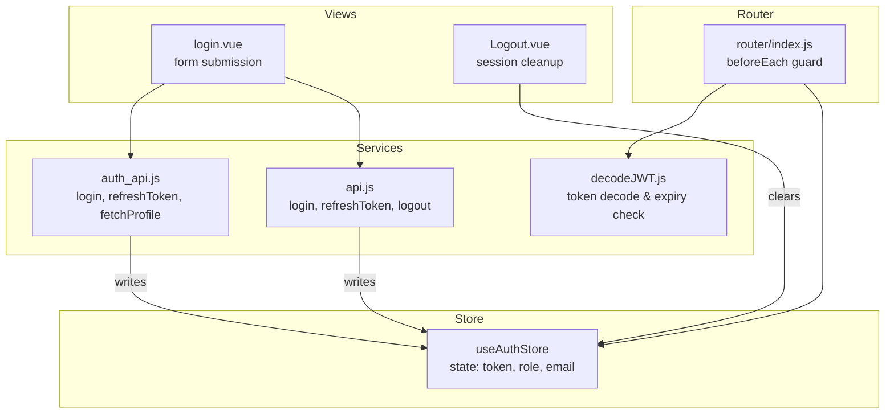
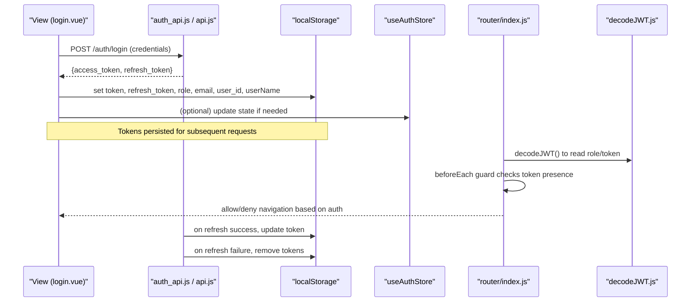
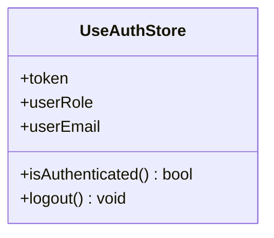
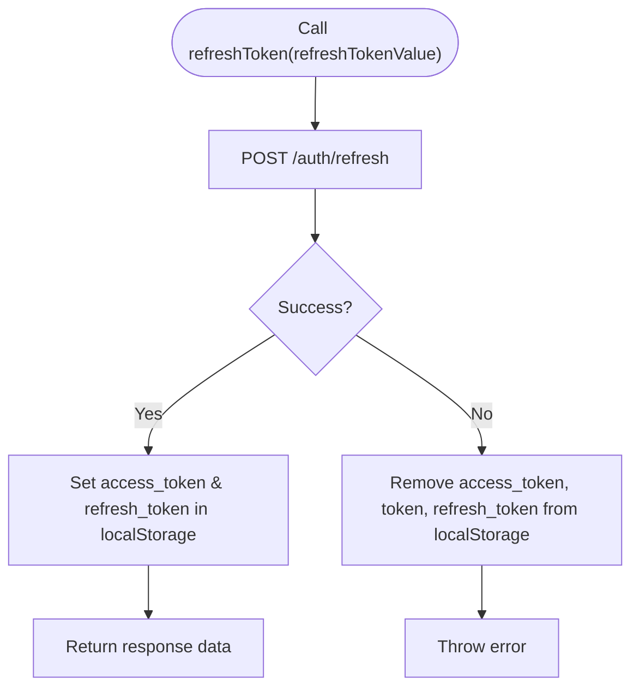
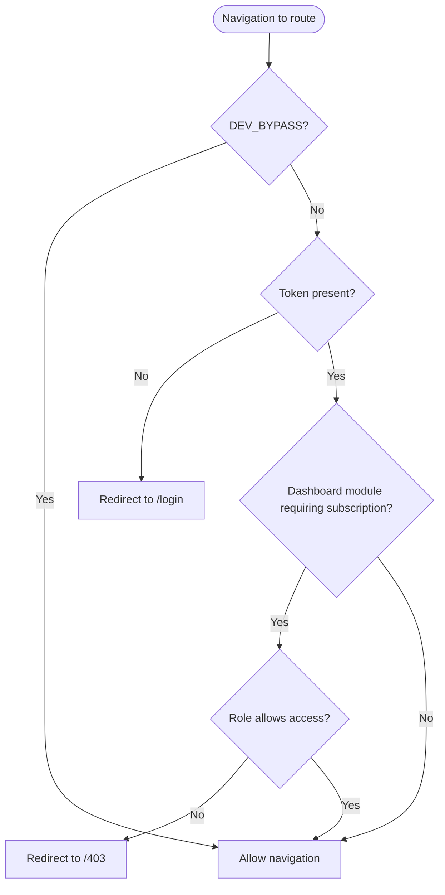
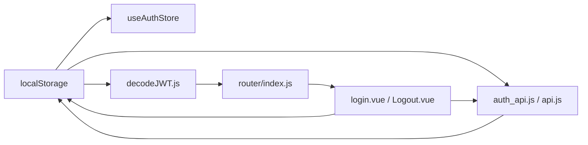

# Authentication Store (auth.js)

<cite>
**Referenced Files in This Document**
- [auth.js](file://src/stores/auth.js)
- [auth_api.js](file://src/services/auth_api.js)
- [api.js](file://src/services/api.js)
- [decodeJWT.js](file://src/services/decodeJWT.js)
- [index.js](file://src/router/index.js)
- [login.vue](file://src/views/auth/login.vue)
- [Logout.vue](file://src/views/auth/Logout.vue)
</cite>

## Table of Contents
1. [Introduction](#introduction)
2. [Project Structure](#project-structure)
3. [Core Components](#core-components)
4. [Architecture Overview](#architecture-overview)
5. [Detailed Component Analysis](#detailed-component-analysis)
6. [Dependency Analysis](#dependency-analysis)
7. [Performance Considerations](#performance-considerations)
8. [Troubleshooting Guide](#troubleshooting-guide)
9. [Conclusion](#conclusion)

## Introduction
This document explains the authentication store implementation in auth.js and how it manages JWT tokens, user roles, and email information with localStorage persistence. It covers the isAuthenticated getter for checking authentication status, the logout action that clears all authentication data from both state and localStorage, and how components use this store for authentication checks and session management. It also details integration points with auth_api.js for token refresh and user validation, and addresses security considerations around token storage patterns and session cleanup.

## Project Structure
The authentication system spans several layers:
- Store layer: Pinia-based auth store for state and actions
- Service layer: API client and helpers for login, refresh, profile, and password reset flows
- Router layer: Route guards to enforce authentication and module access
- View layer: Login and logout pages that interact with services and local storage

**Diagram sources**
- [auth.js:3-20](file://src/stores/auth.js#L3-L20)
- [auth_api.js:36-87](file://src/services/auth_api.js#L36-L87)
- [api.js:165-208](file://src/services/api.js#L165-L208)
- [decodeJWT.js:11-58](file://src/services/decodeJWT.js#L11-L58)
- [index.js:201-272](file://src/router/index.js#L201-L272)
- [login.vue:181-248](file://src/views/auth/login.vue#L181-L248)
- [Logout.vue:7-15](file://src/views/auth/Logout.vue#L7-L15)

**Section sources**
- [auth.js:3-20](file://src/stores/auth.js#L3-L20)
- [index.js:201-272](file://src/router/index.js#L201-L272)

## Core Components
- Auth store (Pinia): Holds token, userRole, userEmail initialized from localStorage; exposes isAuthenticated getter and logout action that clears both state and localStorage keys.
- Auth service (auth_api.js): Provides login, refreshToken, signup, getUserEmail, logout, updateUserRole, and fetchProfile. Automatically attaches Authorization header via Axios interceptor when a token exists.
- API helper (api.js): Contains login, refreshToken, and logout functions used by views and stores.
- JWT decoder (decodeJWT.js): Decodes tokens, validates expiry, and provides role/email/name getters; triggers logout on invalid/expired tokens.
- Router guard (index.js): Enforces authentication before navigation using token presence and role checks.

Key responsibilities:
- Token lifecycle: persist access_token and refresh_token during login/refresh; remove them on logout or failure.
- User context: persist role and email for quick UI decisions; decode additional claims as needed.
- Session enforcement: route guards prevent unauthorized access; views clear session on logout.

**Section sources**
- [auth.js:3-20](file://src/stores/auth.js#L3-L20)
- [auth_api.js:21-27](file://src/services/auth_api.js#L21-L27)
- [auth_api.js:36-87](file://src/services/auth_api.js#L36-L87)
- [api.js:165-208](file://src/services/api.js#L165-L208)
- [decodeJWT.js:11-58](file://src/services/decodeJWT.js#L11-L58)
- [index.js:201-272](file://src/router/index.js#L201-L272)

## Architecture Overview
The authentication flow integrates store, services, router, and views:

**Diagram sources**
- [login.vue:181-248](file://src/views/auth/login.vue#L181-L248)
- [auth_api.js:36-87](file://src/services/auth_api.js#L36-L87)
- [api.js:165-208](file://src/services/api.js#L165-L208)
- [decodeJWT.js:11-58](file://src/services/decodeJWT.js#L11-L58)
- [index.js:201-272](file://src/router/index.js#L201-L272)

## Detailed Component Analysis

### Auth Store (useAuthStore)
- State initialization: Reads token, role, and email from localStorage at store creation time so the app can reflect current session immediately.
- Getters:
  - isAuthenticated: Returns true if a token exists in state.
- Actions:
  - logout: Removes multiple sensitive keys from localStorage (token, refresh_token, user_id, email, role, userName) and resets store fields to null.

**Diagram sources**
- [auth.js:3-20](file://src/stores/auth.js#L3-L20)

**Section sources**
- [auth.js:3-20](file://src/stores/auth.js#L3-L20)

### Auth Service (auth_api.js)
- Axios instance: Configured with base URL and automatic Authorization header injection when a token is present in localStorage.
- Login: Posts credentials, persists access_token and refresh_token to localStorage, returns response data.
- Refresh: Exchanges refresh_token for new tokens; on failure, removes tokens from localStorage and throws an error.
- Signup: Persists email to localStorage upon successful registration.
- Logout: Clears userEmail and access_token from localStorage and redirects to home.
- Profile: Uses the configured axios instance to fetch protected profile data.

**Diagram sources**
- [auth_api.js:64-87](file://src/services/auth_api.js#L64-L87)

**Section sources**
- [auth_api.js:21-27](file://src/services/auth_api.js#L21-L27)
- [auth_api.js:36-87](file://src/services/auth_api.js#L36-L87)
- [auth_api.js:89-115](file://src/services/auth_api.js#L89-L115)
- [auth_api.js:133-141](file://src/services/auth_api.js#L133-L141)

### API Helper (api.js)
- login: Posts credentials and persists access_token and refresh_token to localStorage.
- refreshToken: Exchanges refresh_token and updates stored tokens.
- logout: Calls server logout endpoint (if available), clears localStorage, and redirects to root.

**Section sources**
- [api.js:165-208](file://src/services/api.js#L165-L208)

### JWT Decoder (decodeJWT.js)
- Decodes token from localStorage and checks expiration; logs warning and triggers logout on expired tokens.
- Provides helpers to extract role, email, and name from decoded payload.
- Supports development bypass mode to inject a dev payload when enabled.

**Section sources**
- [decodeJWT.js:11-58](file://src/services/decodeJWT.js#L11-L58)

### Router Guard (index.js)
- beforeEach guard enforces authentication:
  - If a route requires auth and no token is present, redirects to login.
  - Handles admin impersonation token via query parameter by setting token and redirecting to dashboard.
  - Applies module-level subscription checks for certain dashboard routes based on role and allowed modules cache.

**Diagram sources**
- [index.js:201-272](file://src/router/index.js#L201-L272)

**Section sources**
- [index.js:201-272](file://src/router/index.js#L201-L272)

### Views Integration

#### Login (login.vue)
- Validates form inputs and submits credentials via api.js login.
- On success, extracts claims from the token and persists user_id, role, email, company_name, tenant_id, userName, and active subaccount info to localStorage.
- Optionally fetches branches for the tenant and navigates to dashboard or intended route.

**Section sources**
- [login.vue:181-248](file://src/views/auth/login.vue#L181-L248)

#### Logout (Logout.vue)
- On mount, removes token, user, and tenantId from localStorage and redirects to login page.

**Section sources**
- [Logout.vue:7-15](file://src/views/auth/Logout.vue#L7-L15)

## Dependency Analysis
- The store depends on localStorage for persistence and is independent of network calls.
- Services depend on axios and environment configuration for API endpoints.
- Router guard depends on decodeJWT to validate tokens and derive roles.
- Views depend on services for authentication operations and may directly manipulate localStorage for user context.

**Diagram sources**
- [auth.js:3-20](file://src/stores/auth.js#L3-L20)
- [auth_api.js:21-27](file://src/services/auth_api.js#L21-L27)
- [api.js:165-208](file://src/services/api.js#L165-L208)
- [decodeJWT.js:11-58](file://src/services/decodeJWT.js#L11-L58)
- [index.js:201-272](file://src/router/index.js#L201-L272)
- [login.vue:181-248](file://src/views/auth/login.vue#L181-L248)
- [Logout.vue:7-15](file://src/views/auth/Logout.vue#L7-L15)

**Section sources**
- [auth.js:3-20](file://src/stores/auth.js#L3-L20)
- [auth_api.js:21-27](file://src/services/auth_api.js#L21-L27)
- [api.js:165-208](file://src/services/api.js#L165-L208)
- [decodeJWT.js:11-58](file://src/services/decodeJWT.js#L11-L58)
- [index.js:201-272](file://src/router/index.js#L201-L272)

## Performance Considerations
- LocalStorage reads/writes are synchronous and fast but should be minimized; batch writes where possible (e.g., after login).
- Axios interceptor adds Authorization header per request; ensure token retrieval is efficient.
- Router guard runs on every navigation; keep logic lightweight and avoid heavy computations.
- Avoid decoding tokens excessively; cache decoded values in memory when appropriate.

[No sources needed since this section provides general guidance]

## Troubleshooting Guide
Common issues and resolutions:
- Token missing on navigation: Ensure login flow sets token and refresh_token in localStorage; verify router guard checks token presence.
- Refresh failures: On refresh errors, tokens are removed; re-authenticate users and handle error messages gracefully.
- Expired tokens: decodeJWT.js detects expired tokens and triggers logout; implement retry logic or prompt re-login.
- Inconsistent state: After logout, confirm all relevant keys are cleared from localStorage and store state is reset.

**Section sources**
- [auth_api.js:64-87](file://src/services/auth_api.js#L64-L87)
- [decodeJWT.js:11-58](file://src/services/decodeJWT.js#L11-L58)
- [auth.js:13-19](file://src/stores/auth.js#L13-L19)
- [Logout.vue:7-15](file://src/views/auth/Logout.vue#L7-L15)

## Conclusion
The authentication store in auth.js provides a minimal yet effective mechanism to manage JWT tokens, user roles, and email via localStorage. Combined with the auth service, router guard, and view integrations, it ensures secure session handling, robust token refresh, and consistent authentication checks across the application. For enhanced security, consider storing tokens in httpOnly cookies, implementing token rotation, and centralizing all token persistence through the store to reduce inconsistencies.

[No sources needed since this section summarizes without analyzing specific files]