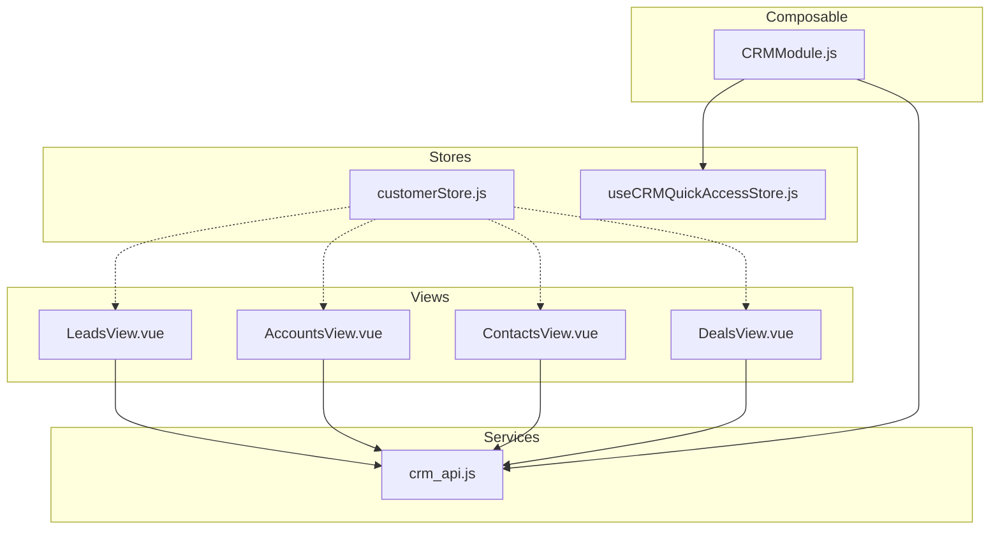
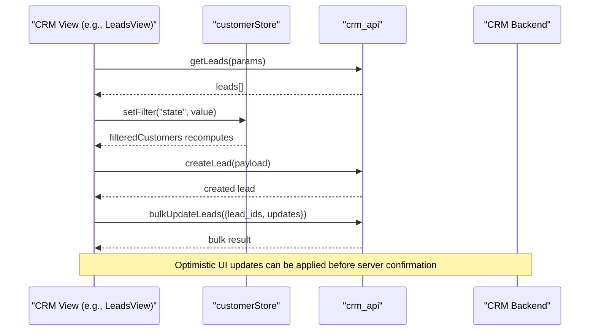
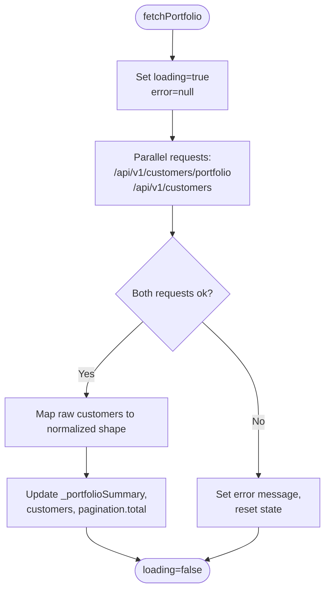
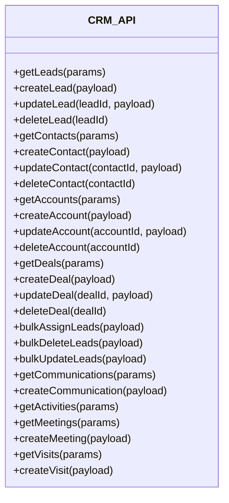
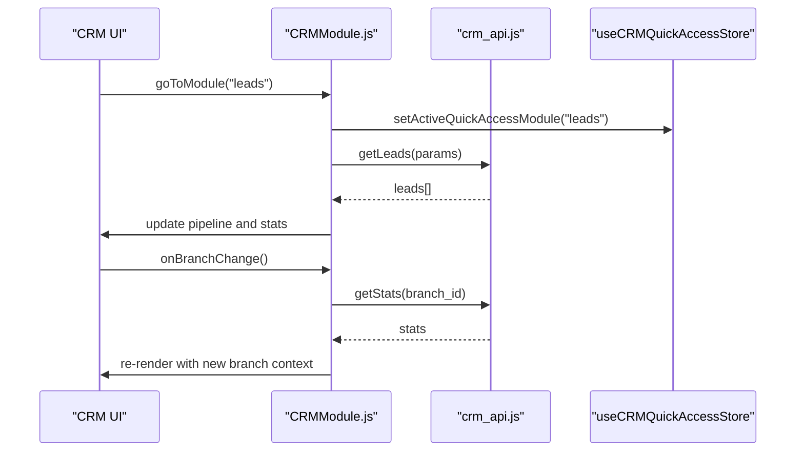
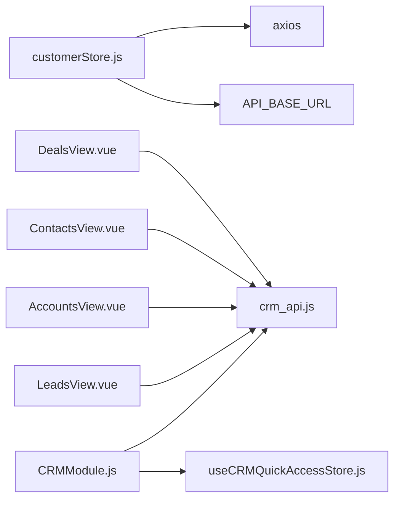
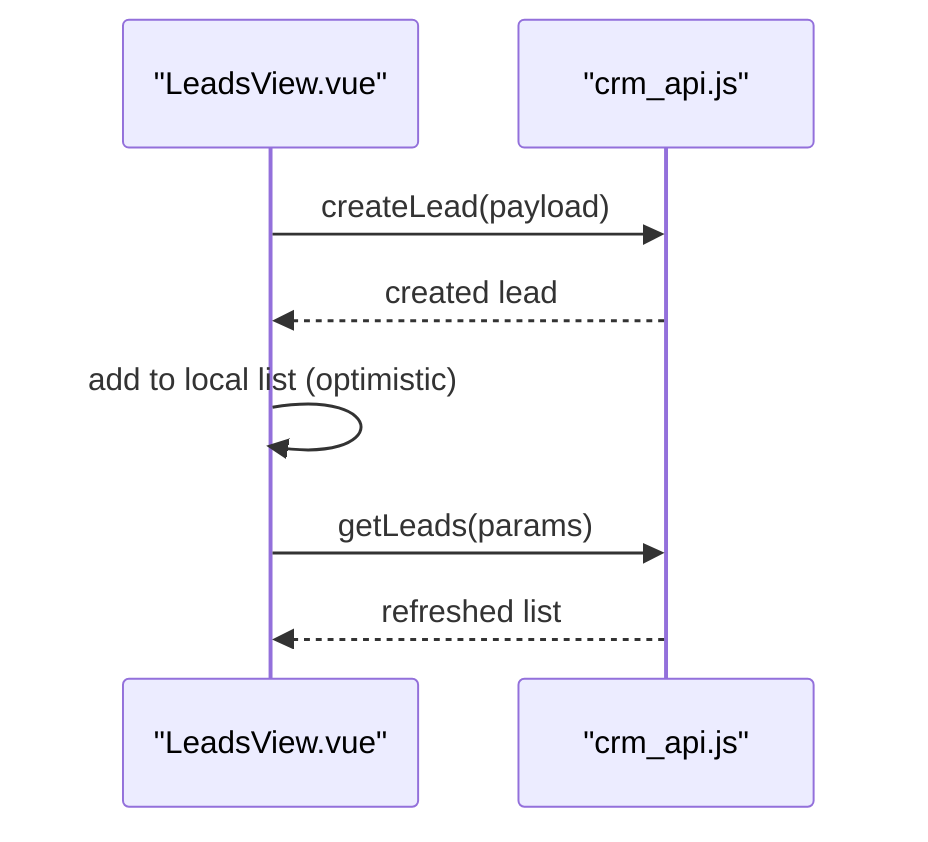
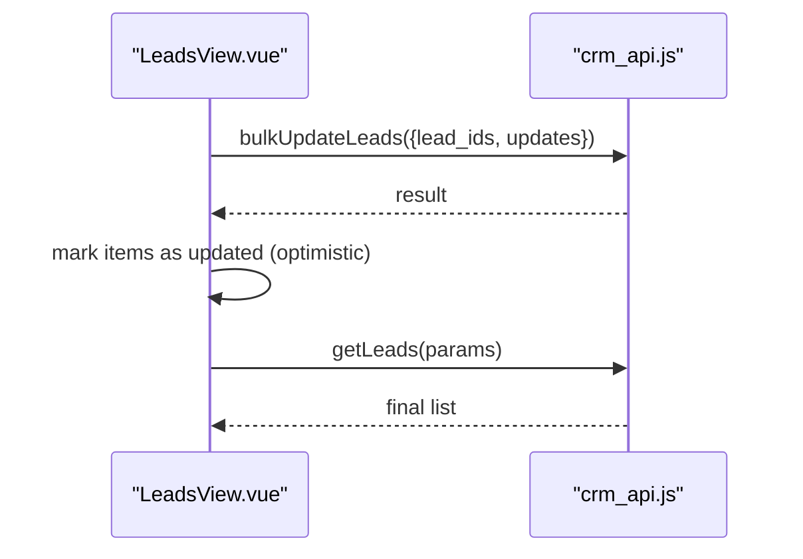
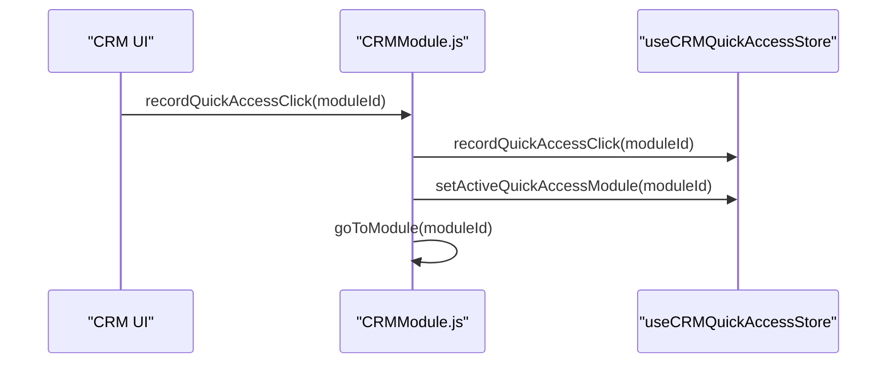

# Customer Store (customerStore.js)

<cite>
**Referenced Files in This Document**
- [customerStore.js](file://src/stores/customerStore.js)
- [crm_api.js](file://src/services/crm_api.js)
- [CRMModule.js](file://src/views/Modules/crm/composables/CRMModule.js)
- [useCRMQuickAccessStore.js](file://src/stores/useCRMQuickAccessStore.js)
- [LeadsView.vue](file://src/views/Modules/crm/components/LeadsView.vue)
- [AccountsView.vue](file://src/views/Modules/crm/components/AccountsView.vue)
- [ContactsView.vue](file://src/views/Modules/crm/components/ContactsView.vue)
- [DealsView.vue](file://src/views/Modules/crm/components/DealsView.vue)
</cite>

## Table of Contents
1. Introduction
2. Project Structure
3. Core Components
4. Architecture Overview
5. Detailed Component Analysis
6. Dependency Analysis
7. Performance Considerations
8. Troubleshooting Guide
9. Conclusion
10. Appendices

## Introduction
This document explains the CRM-related state management and data flow centered around the customer store and its integration with CRM services and UI components. It covers how leads, contacts, accounts, and deals are created, read, updated, deleted, searched, and bulk-managed; how the quick access store supports navigation and analytics; and how optimistic updates and caching strategies can be applied to improve user experience.

## Project Structure
The CRM feature spans stores, services, composables, and view components:
- Stores:
  - customerStore.js: Centralized state for customer portfolio and detail views.
  - useCRMQuickAccessStore.js: Lightweight store for quick access module tracking.
- Services:
  - crm_api.js: HTTP client functions for all CRM entities (leads, contacts, accounts, deals, activities, meetings, visits, notifications, etc.).
- Composables:
  - CRMModule.js: Orchestrates CRM workflows, loading pipeline data, and coordinating UI interactions across modules.
- Views:
  - LeadsView.vue, AccountsView.vue, ContactsView.vue, DealsView.vue: UI components that call service APIs and update local state for rendering lists, filters, and actions.

**Diagram sources**
- [customerStore.js:1-187](file://src/stores/customerStore.js#L1-L187)
- [crm_api.js:1-800](file://src/services/crm_api.js#L1-L800)
- [CRMModule.js:1-800](file://src/views/Modules/crm/composables/CRMModule.js#L1-L800)
- [useCRMQuickAccessStore.js:1-29](file://src/stores/useCRMQuickAccessStore.js#L1-L29)
- [LeadsView.vue:1-200](file://src/views/Modules/crm/components/LeadsView.vue#L1-L200)
- [AccountsView.vue:1-200](file://src/views/Modules/crm/components/AccountsView.vue#L1-L200)
- [ContactsView.vue:1-200](file://src/views/Modules/crm/components/ContactsView.vue#L1-L200)
- [DealsView.vue:1-200](file://src/views/Modules/crm/components/DealsView.vue#L1-L200)

**Section sources**
- [customerStore.js:1-187](file://src/stores/customerStore.js#L1-L187)
- [crm_api.js:1-800](file://src/services/crm_api.js#L1-L800)
- [CRMModule.js:1-800](file://src/views/Modules/crm/composables/CRMModule.js#L1-L800)
- [useCRMQuickAccessStore.js:1-29](file://src/stores/useCRMQuickAccessStore.js#L1-L29)
- [LeadsView.vue:1-200](file://src/views/Modules/crm/components/LeadsView.vue#L1-L200)
- [AccountsView.vue:1-200](file://src/views/Modules/crm/components/AccountsView.vue#L1-L200)
- [ContactsView.vue:1-200](file://src/views/Modules/crm/components/ContactsView.vue#L1-L200)
- [DealsView.vue:1-200](file://src/views/Modules/crm/components/DealsView.vue#L1-L200)

## Core Components
- Customer Store (customerStore.js):
  - State: customers list, selectedCustomer, filters, pagination, timeline, features, portfolio summary.
  - Computed: portfolio derived from by_state counts; filteredCustomers based on state/search and pagination.
  - Actions: fetchPortfolio (parallel requests for portfolio summary and customer list), fetchCustomerDetail, fetchCustomerTimeline, fetchCustomerFeatures, setFilter, clearFilters.
  - Mapping: _mapCustomer normalizes raw API responses into a consistent shape for UI consumption.
- CRM Quick Access Store (useCRMQuickAccessStore.js):
  - Tracks activeModule and quickAccessData; provides methods to record clicks and set active module.
- CRM Service (crm_api.js):
  - Provides CRUD and listing endpoints for leads, contacts, accounts, deals, communications, activities, meetings, visits, notifications, metadata, import/export, and bulk operations.
  - Includes helpers for headers, response handling, and parameter sanitization.
- CRM Module Composable (CRMModule.js):
  - Loads pipeline data (leads, contacts, accounts, deals), manages branch selection, stats, and orchestrates UI flows like lead conversion, communication logging, and meeting scheduling.
  - Integrates with useCRMQuickAccessStore for quick access navigation and analytics.

**Section sources**
- [customerStore.js:16-187](file://src/stores/customerStore.js#L16-L187)
- [useCRMQuickAccessStore.js:4-29](file://src/stores/useCRMQuickAccessStore.js#L4-L29)
- [crm_api.js:46-800](file://src/services/crm_api.js#L46-L800)
- [CRMModule.js:21-800](file://src/views/Modules/crm/composables/CRMModule.js#L21-L800)

## Architecture Overview
The CRM architecture separates concerns:
- Stores manage reactive state and computed views.
- Services encapsulate network calls and error handling.
- Composables coordinate multi-step workflows and cross-module state.
- Views render data and trigger actions via stores or services directly.

**Diagram sources**
- [crm_api.js:46-143](file://src/services/crm_api.js#L46-L143)
- [crm_api.js:718-746](file://src/services/crm_api.js#L718-L746)
- [customerStore.js:53-69](file://src/stores/customerStore.js#L53-L69)
- [LeadsView.vue:112-145](file://src/views/Modules/crm/components/LeadsView.vue#L112-L145)

## Detailed Component Analysis

### Customer Store (customerStore.js)
Responsibilities:
- Portfolio overview: aggregates total_customers and by_state metrics to compute actionable insights (active, at-risk, dormant, churned).
- Customer list: fetches and maps raw records into a normalized structure for UI display.
- Detail views: loads individual customer details, timeline, and feature snapshots.
- Filtering and pagination: computes filtered results and slices per page.

Key implementation highlights:
- Parallel fetching for performance: portfolio summary and customer list are fetched concurrently.
- Error handling: sets error messages and resets state on failures.
- Normalization: _mapCustomer ensures consistent field names and types for downstream consumers.

**Diagram sources**
- [customerStore.js:91-114](file://src/stores/customerStore.js#L91-L114)

**Section sources**
- [customerStore.js:16-187](file://src/stores/customerStore.js#L16-L187)

### CRM Service (crm_api.js)
Responsibilities:
- Provide typed functions for all CRM entities and related resources.
- Standardize request headers and handle errors consistently.
- Support bulk operations and import/export utilities.

Notable capabilities:
- CRUD for leads, contacts, accounts, deals.
- Bulk assign/delete/update for leads.
- Communications and notes.
- Meetings and visits.
- Notifications and scanning.
- Metadata retrieval and updates.

**Diagram sources**
- [crm_api.js:46-800](file://src/services/crm_api.js#L46-L800)

**Section sources**
- [crm_api.js:1-800](file://src/services/crm_api.js#L1-L800)

### CRM Module Composable (CRMModule.js)
Responsibilities:
- Orchestrate CRM workflows: load pipeline data, manage branch context, compute stats, and coordinate UI modals.
- Integrate with quick access store to track module usage and navigate efficiently.
- Manage shared state for leads, contacts, accounts, deals, and related activities.

Integration points:
- Uses crm_api.js for data synchronization.
- Calls useCRMQuickAccessStore.recordQuickAccessClick and setActiveQuickAccessModule for analytics and navigation.
- Emits events to refresh data when branch changes.

**Diagram sources**
- [CRMModule.js:270-309](file://src/views/Modules/crm/composables/CRMModule.js#L270-L309)
- [CRMModule.js:59-67](file://src/views/Modules/crm/composables/CRMModule.js#L59-L67)
- [useCRMQuickAccessStore.js:8-19](file://src/stores/useCRMQuickAccessStore.js#L8-L19)
- [crm_api.js:748-759](file://src/services/crm_api.js#L748-L759)

**Section sources**
- [CRMModule.js:1-800](file://src/views/Modules/crm/composables/CRMModule.js#L1-L800)
- [useCRMQuickAccessStore.js:1-29](file://src/stores/useCRMQuickAccessStore.js#L1-L29)
- [crm_api.js:748-759](file://src/services/crm_api.js#L748-L759)

### CRM Views Interaction Examples
- LeadsView.vue:
  - Displays KPIs, filters, and actions (add, bulk upload, export, Excel edit).
  - Triggers events to parent for viewing/editing leads and opening modals.
- AccountsView.vue:
  - Shows account registry with bulk import/export and Excel editing.
  - Filters by industry and toggles between grid/list views.
- ContactsView.vue:
  - Presents contact directory with search, account filtering, and quick actions (call, WhatsApp, edit, delete).
- DealsView.vue:
  - Renders deal pipeline with stage filtering, search, and view mode toggles.

These components typically call crm_api.js functions directly or through composable logic to manipulate data and reflect changes in the UI.

**Section sources**
- [LeadsView.vue:112-145](file://src/views/Modules/crm/components/LeadsView.vue#L112-L145)
- [AccountsView.vue:31-66](file://src/views/Modules/crm/components/AccountsView.vue#L31-L66)
- [ContactsView.vue:65-100](file://src/views/Modules/crm/components/ContactsView.vue#L65-L100)
- [DealsView.vue:72-125](file://src/views/Modules/crm/components/DealsView.vue#L72-L125)

## Dependency Analysis
- customerStore.js depends on axios and API_BASE_URL for HTTP requests and defines internal state and computed values.
- CRMModule.js depends on crm_api.js for data operations and useCRMQuickAccessStore.js for quick access tracking.
- Views depend on crm_api.js for direct entity operations and may reference stores for shared state where applicable.

**Diagram sources**
- [customerStore.js:1-6](file://src/stores/customerStore.js#L1-L6)
- [CRMModule.js:1-20](file://src/views/Modules/crm/composables/CRMModule.js#L1-L20)
- [useCRMQuickAccessStore.js:1-6](file://src/stores/useCRMQuickAccessStore.js#L1-L6)
- [crm_api.js:1-9](file://src/services/crm_api.js#L1-L9)

**Section sources**
- [customerStore.js:1-6](file://src/stores/customerStore.js#L1-L6)
- [CRMModule.js:1-20](file://src/views/Modules/crm/composables/CRMModule.js#L1-L20)
- [useCRMQuickAccessStore.js:1-6](file://src/stores/useCRMQuickAccessStore.js#L1-L6)
- [crm_api.js:1-9](file://src/services/crm_api.js#L1-L9)

## Performance Considerations
- Parallel requests: The customer store uses Promise.all to fetch portfolio summary and customer list concurrently, reducing latency.
- Local filtering and pagination: Computed properties filter and slice data client-side for responsive UI without extra network calls.
- Debounced searches: CRMModule uses debounced search for participant queries to avoid excessive requests.
- Caching opportunities:
  - Geolocation search results are cached in-memory to prevent repeated lookups.
  - Consider adding simple in-memory caches for frequently accessed metadata (pipeline stages, branches) and short-lived lists.
- Optimistic updates:
  - For create/update/delete operations, immediately update local state to provide instant feedback, then reconcile with server responses. Roll back on failure.
  - Apply optimistic updates for bulk operations by temporarily marking items as processed and reverting if the server returns errors.

[No sources needed since this section provides general guidance]

## Troubleshooting Guide
Common issues and resolutions:
- Network errors:
  - Ensure Authorization header is present; both axios interceptor and crm_api set Bearer tokens from localStorage.
  - Validate API_BASE_URL configuration and backend availability.
- Data mapping errors:
  - Verify that raw responses match expected fields; adjust _mapCustomer if backend schema changes.
- Filter and pagination bugs:
  - Confirm that filters reset pagination.page to 1 and that computed filteredCustomers correctly applies state and search criteria.
- Bulk operation failures:
  - Check payload structure for bulk-assign, bulk-delete, bulk-update; ensure tenant_id and lead_ids are provided.
- Quick access store:
  - If quick access clicks are not recorded, verify that recordQuickAccessClick is called and that activeModule is set appropriately.

**Section sources**
- [customerStore.js:8-12](file://src/stores/customerStore.js#L8-L12)
- [crm_api.js:3-32](file://src/services/crm_api.js#L3-L32)
- [crm_api.js:718-746](file://src/services/crm_api.js#L718-L746)
- [useCRMQuickAccessStore.js:8-19](file://src/stores/useCRMQuickAccessStore.js#L8-L19)

## Conclusion
The CRM feature leverages a clear separation of concerns: stores for reactive state, services for data synchronization, composables for workflow orchestration, and views for presentation and interaction. The customer store centralizes portfolio and detail management, while CRMModule coordinates broader CRM operations and integrates with the quick access store for navigation and analytics. Applying caching and optimistic updates further enhances responsiveness and user experience.

[No sources needed since this section summarizes without analyzing specific files]

## Appendices

### Example Workflows

#### Create Lead Flow

**Diagram sources**
- [crm_api.js:78-85](file://src/services/crm_api.js#L78-L85)
- [crm_api.js:46-51](file://src/services/crm_api.js#L46-L51)
- [LeadsView.vue:112-145](file://src/views/Modules/crm/components/LeadsView.vue#L112-L145)

#### Bulk Update Leads Flow

**Diagram sources**
- [crm_api.js:738-746](file://src/services/crm_api.js#L738-L746)
- [crm_api.js:46-51](file://src/services/crm_api.js#L46-L51)
- [LeadsView.vue:112-145](file://src/views/Modules/crm/components/LeadsView.vue#L112-L145)

#### Quick Access Navigation Flow

**Diagram sources**
- [CRMModule.js:215-219](file://src/views/Modules/crm/composables/CRMModule.js#L215-L219)
- [useCRMQuickAccessStore.js:8-19](file://src/stores/useCRMQuickAccessStore.js#L8-L19)